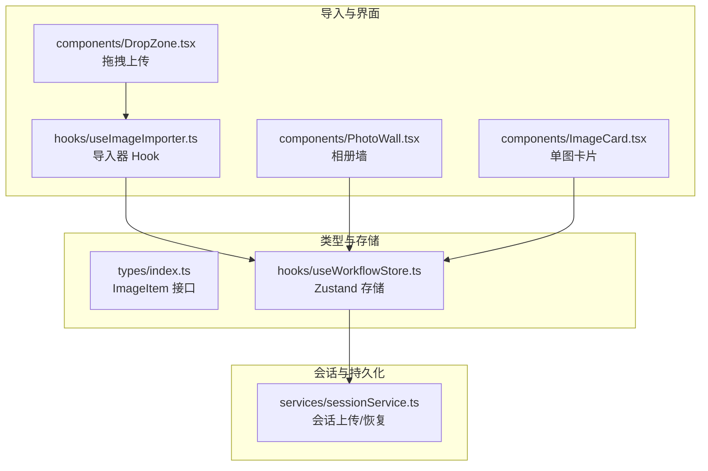
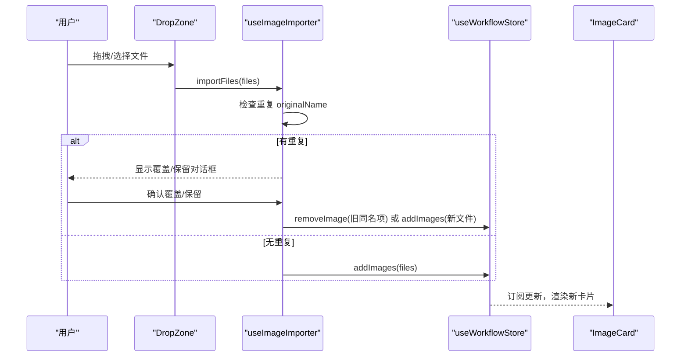
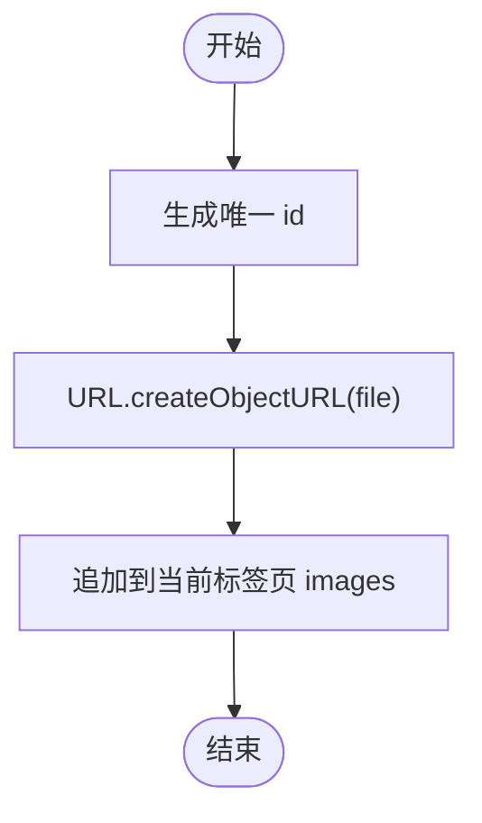
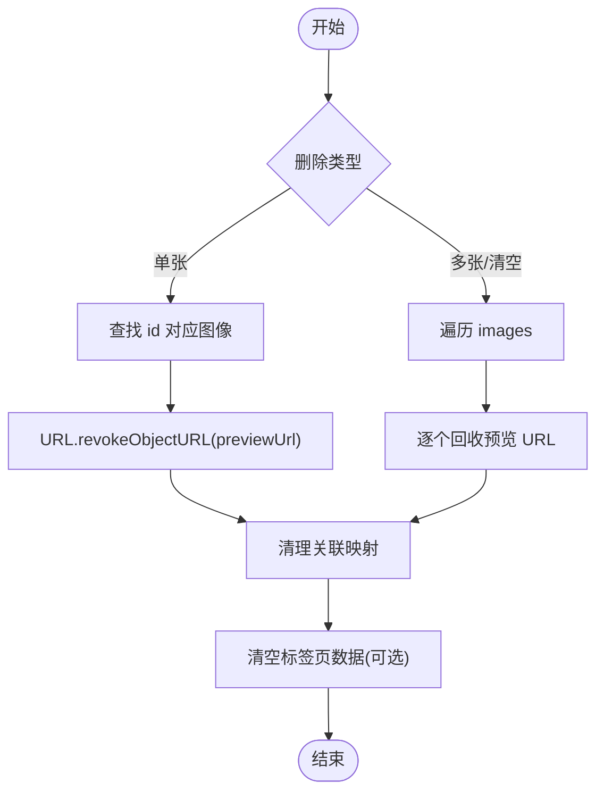
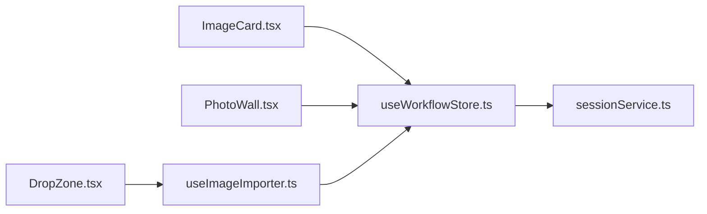

# 图像数据管理

<cite>
**本文引用的文件**
- [ImageCard.tsx](file://client/src/components/ImageCard.tsx)
- [useImageImporter.ts](file://client/src/hooks/useImageImporter.ts)
- [useWorkflowStore.ts](file://client/src/hooks/useWorkflowStore.ts)
- [index.ts](file://client/src/types/index.ts)
- [DropZone.tsx](file://client/src/components/DropZone.tsx)
- [PhotoWall.tsx](file://client/src/components/PhotoWall.tsx)
- [sessionService.ts](file://client/src/services/sessionService.ts)
</cite>

## 目录
1. [简介](#简介)
2. [项目结构](#项目结构)
3. [核心组件](#核心组件)
4. [架构总览](#架构总览)
5. [详细组件分析](#详细组件分析)
6. [依赖关系分析](#依赖关系分析)
7. [性能考虑](#性能考虑)
8. [故障排查指南](#故障排查指南)
9. [结论](#结论)
10. [附录](#附录)

## 简介
本文件系统化阐述图像数据管理的设计与实现，重点覆盖以下方面：
- ImageItem 接口的完整结构与职责
- 图像添加、删除、批量操作的实现机制
- 图像预览 URL 的生成与回收策略
- 图像 ID 的生成策略与唯一性保障
- 使用示例：添加图片、批量删除、清空当前标签页
- 内存管理与性能优化建议

## 项目结构
围绕图像数据管理的关键文件与职责如下：
- 类型定义：定义 ImageItem 接口及任务状态等核心类型
- 工作流存储：集中管理图像列表、任务状态、提示词、输出索引等
- 导入器 Hook：封装重复名检测与导入对话框逻辑
- 组件层：拖拽上传、相册墙渲染、单图卡片交互
- 会话服务：提供持久化上传与会话恢复能力

**图表来源**
- [index.ts:1-58](file://client/src/types/index.ts#L1-L58)
- [useWorkflowStore.ts:1-645](file://client/src/hooks/useWorkflowStore.ts#L1-L645)
- [DropZone.tsx:1-171](file://client/src/components/DropZone.tsx#L1-L171)
- [useImageImporter.ts:1-48](file://client/src/hooks/useImageImporter.ts#L1-L48)
- [PhotoWall.tsx:1-578](file://client/src/components/PhotoWall.tsx#L1-L578)
- [ImageCard.tsx:1-1055](file://client/src/components/ImageCard.tsx#L1-L1055)
- [sessionService.ts:1-134](file://client/src/services/sessionService.ts#L1-L134)

**章节来源**
- [index.ts:1-58](file://client/src/types/index.ts#L1-L58)
- [useWorkflowStore.ts:1-645](file://client/src/hooks/useWorkflowStore.ts#L1-L645)
- [DropZone.tsx:1-171](file://client/src/components/DropZone.tsx#L1-L171)
- [useImageImporter.ts:1-48](file://client/src/hooks/useImageImporter.ts#L1-L48)
- [PhotoWall.tsx:1-578](file://client/src/components/PhotoWall.tsx#L1-L578)
- [ImageCard.tsx:1-1055](file://client/src/components/ImageCard.tsx#L1-L1055)
- [sessionService.ts:1-134](file://client/src/services/sessionService.ts#L1-L134)

## 核心组件
- ImageItem 接口
  - id：图像唯一标识，用于关联任务、提示词、输出索引等
  - file：浏览器 File 对象，承载原始二进制数据
  - previewUrl：预览用 URL，通常由 URL.createObjectURL(file) 生成
  - originalName：原始文件名
  - sessionUrl：会话持久化后的稳定 URL（设置于会话保存/恢复后）
- 工作流存储（Zustand）
  - addImages/addImagesGetIds/addImagesToTab：批量添加图像，生成唯一 id 并创建预览 URL
  - removeImage/removeImages/clearCurrentImages：删除单张/多张/当前标签页全部图像，并回收预览 URL
  - 任务与提示词映射：按 imageId 关联任务状态、进度、输出列表与用户提示词
- 导入器 Hook
  - 检测重复 originalName，弹出覆盖/保留对话框
  - 调用工作流存储执行实际添加或删除后再添加的操作

**章节来源**
- [index.ts:1-58](file://client/src/types/index.ts#L1-L58)
- [useWorkflowStore.ts:197-329](file://client/src/hooks/useWorkflowStore.ts#L197-L329)
- [useImageImporter.ts:9-47](file://client/src/hooks/useImageImporter.ts#L9-L47)

## 架构总览
图像数据管理采用“类型定义 + 状态存储 + 组件驱动”的分层设计：
- 类型层：统一 ImageItem 结构与任务状态枚举
- 存储层：Zustand 管理每个标签页的图像列表与关联状态
- 组件层：通过 Hook 订阅状态并触发动作；拖拽上传与相册墙负责用户交互
- 会话层：提供上传与恢复，确保 sessionUrl 的一致性

**图表来源**
- [DropZone.tsx:39-91](file://client/src/components/DropZone.tsx#L39-L91)
- [useImageImporter.ts:15-46](file://client/src/hooks/useImageImporter.ts#L15-L46)
- [useWorkflowStore.ts:197-214](file://client/src/hooks/useWorkflowStore.ts#L197-L214)

## 详细组件分析

### ImageItem 接口详解
- 字段作用
  - id：全局唯一标识，贯穿任务、输出、提示词、蒙版等关联
  - file：原始文件对象，用于上传与工作流执行
  - previewUrl：本地预览 URL，支持懒加载与缩略图显示
  - originalName：文件名，用于重复检测与 UI 展示
  - sessionUrl：会话持久化后稳定的访问地址，便于跨会话复用
- 设计要点
  - 预览 URL 与 File 对象一一对应，删除时需回收
  - 唯一性由生成策略保证，避免冲突

**章节来源**
- [index.ts:1-8](file://client/src/types/index.ts#L1-L8)

### 图像添加机制
- 单次添加
  - 生成唯一 id：前缀 + 时间戳 + 自增计数器
  - 创建预览 URL：URL.createObjectURL(file)
  - 追加到当前标签页 images 列表
- 批量添加
  - 支持返回新增 id 数组（addImagesGetIds），便于后续联动
  - 可指定目标标签页（addImagesToTab）

**图表来源**
- [useWorkflowStore.ts:197-214](file://client/src/hooks/useWorkflowStore.ts#L197-L214)
- [useWorkflowStore.ts:216-234](file://client/src/hooks/useWorkflowStore.ts#L216-L234)
- [useWorkflowStore.ts:236-252](file://client/src/hooks/useWorkflowStore.ts#L236-L252)

**章节来源**
- [useWorkflowStore.ts:197-252](file://client/src/hooks/useWorkflowStore.ts#L197-L252)

### 图像删除与批量操作
- 单张删除
  - 从 images 列表移除
  - 回收 previewUrl：URL.revokeObjectURL(previewUrl)
  - 清理与该 id 相关的提示词、任务、输出索引、蒙版等
- 多张删除
  - 批量过滤 images，同时回收多个预览 URL
  - 同步清理相关映射
- 清空当前标签页
  - 遍历当前 images，回收所有预览 URL
  - 将该标签页数据重置为空

**图表来源**
- [useWorkflowStore.ts:254-283](file://client/src/hooks/useWorkflowStore.ts#L254-L283)
- [useWorkflowStore.ts:285-315](file://client/src/hooks/useWorkflowStore.ts#L285-L315)
- [useWorkflowStore.ts:317-329](file://client/src/hooks/useWorkflowStore.ts#L317-L329)

**章节来源**
- [useWorkflowStore.ts:254-329](file://client/src/hooks/useWorkflowStore.ts#L254-L329)

### 预览 URL 管理机制
- 生成
  - 在添加图像时调用 URL.createObjectURL(file) 生成本地预览 URL
- 回收
  - 删除图像时调用 URL.revokeObjectURL(previewUrl) 释放内存
  - 清空当前标签页时统一回收
- 使用场景
  - ImageCard 中作为 img/video 的 src
  - 缩略图条与输出对比展示
  - 反推提示词时按需下载输出 Blob 并生成临时 URL

**章节来源**
- [useWorkflowStore.ts:197-214](file://client/src/hooks/useWorkflowStore.ts#L197-L214)
- [useWorkflowStore.ts:254-283](file://client/src/hooks/useWorkflowStore.ts#L254-L283)
- [ImageCard.tsx:493-505](file://client/src/components/ImageCard.tsx#L493-L505)

### 图像 ID 生成策略与唯一性
- 生成规则
  - 前缀 + 当前时间戳毫秒值 + 自增计数器
  - 时间戳确保不同批次添加的 ID 不冲突
  - 计数器在同一毫秒内保证不重复
- 唯一性保障
  - 与自增变量 imageCounter 结合，避免并发极端情况下的重复
  - 仅在当前客户端进程有效，跨进程不共享计数器，整体冲突概率极低

**章节来源**
- [useWorkflowStore.ts:90](file://client/src/hooks/useWorkflowStore.ts#L90)
- [useWorkflowStore.ts:197-214](file://client/src/hooks/useWorkflowStore.ts#L197-L214)

### 使用示例
- 添加图片文件
  - 通过 DropZone 拖拽或点击选择文件
  - 导入器 Hook 检测重复名，必要时弹出对话框
  - 调用工作流存储 addImages 完成添加
  - 参考路径：[DropZone.tsx:39-91](file://client/src/components/DropZone.tsx#L39-L91)，[useImageImporter.ts:15-28](file://client/src/hooks/useImageImporter.ts#L15-L28)，[useWorkflowStore.ts:197-214](file://client/src/hooks/useWorkflowStore.ts#L197-L214)
- 批量删除图片
  - 进入多选模式，勾选若干图片
  - 点击批量删除，确认后调用 removeImages
  - 参考路径：[PhotoWall.tsx:242-245](file://client/src/components/PhotoWall.tsx#L242-L245)，[useWorkflowStore.ts:285-315](file://client/src/hooks/useWorkflowStore.ts#L285-L315)
- 清空当前标签页图片
  - 调用 clearCurrentImages，统一回收预览 URL 并清空数据
  - 参考路径：[useWorkflowStore.ts:317-329](file://client/src/hooks/useWorkflowStore.ts#L317-L329)

**章节来源**
- [DropZone.tsx:39-91](file://client/src/components/DropZone.tsx#L39-L91)
- [useImageImporter.ts:15-28](file://client/src/hooks/useImageImporter.ts#L15-L28)
- [PhotoWall.tsx:242-245](file://client/src/components/PhotoWall.tsx#L242-L245)
- [useWorkflowStore.ts:285-329](file://client/src/hooks/useWorkflowStore.ts#L285-L329)

## 依赖关系分析
- 组件与存储
  - ImageCard 通过 useWorkflowStore 订阅任务状态与输出列表，渲染预览与输出对比
  - PhotoWall 负责多选、批量执行、批量删除与拖拽删除
  - useImageImporter 依赖当前 activeTab 的 images 列表进行重复名检测
- 存储与会话
  - sessionService 提供上传输入图像与蒙版、保存/加载会话的能力
  - 工作流存储在会话恢复时重建任务与输出映射

**图表来源**
- [ImageCard.tsx:42-88](file://client/src/components/ImageCard.tsx#L42-L88)
- [PhotoWall.tsx:103-125](file://client/src/components/PhotoWall.tsx#L103-L125)
- [useImageImporter.ts:9-13](file://client/src/hooks/useImageImporter.ts#L9-L13)
- [DropZone.tsx:39-73](file://client/src/components/DropZone.tsx#L39-L73)
- [useWorkflowStore.ts:600-636](file://client/src/hooks/useWorkflowStore.ts#L600-L636)
- [sessionService.ts:69-134](file://client/src/services/sessionService.ts#L69-L134)

**章节来源**
- [ImageCard.tsx:42-88](file://client/src/components/ImageCard.tsx#L42-L88)
- [PhotoWall.tsx:103-125](file://client/src/components/PhotoWall.tsx#L103-L125)
- [useImageImporter.ts:9-13](file://client/src/hooks/useImageImporter.ts#L9-L13)
- [DropZone.tsx:39-73](file://client/src/components/DropZone.tsx#L39-L73)
- [useWorkflowStore.ts:600-636](file://client/src/hooks/useWorkflowStore.ts#L600-L636)
- [sessionService.ts:69-134](file://client/src/services/sessionService.ts#L69-L134)

## 性能考虑
- 预览 URL 管理
  - 必须在删除时回收，避免内存泄漏与 URL 泄漏
  - 批量删除时一次性回收多个 URL，减少多次调用开销
- 渲染优化
  - PhotoWall 使用 IntersectionObserver 实现懒加载，降低首屏压力
  - ImageCard 使用 memo 与浅比较 props，减少无效重渲染
- 任务与输出
  - 输出列表按需追加，避免重复创建对象
  - 视频工作流默认选择特定输出（如插帧）提升用户体验
- 会话持久化
  - 通过 sessionUrl 减少重复上传与预览 URL 重建成本
  - 会话恢复时重建任务映射，保持状态一致

[本节为通用性能建议，无需具体文件引用]

## 故障排查指南
- 预览空白或报错
  - 检查是否正确生成与回收 previewUrl
  - 确认删除流程中是否调用 URL.revokeObjectURL
  - 参考路径：[useWorkflowStore.ts:254-283](file://client/src/hooks/useWorkflowStore.ts#L254-L283)
- 重复文件名导致导入异常
  - 使用 useImageImporter 的对话框选择覆盖或保留
  - 参考路径：[useImageImporter.ts:15-46](file://client/src/hooks/useImageImporter.ts#L15-L46)
- 批量删除未生效
  - 确认已进入多选模式并选择了图片
  - 检查 removeImages 是否被调用
  - 参考路径：[PhotoWall.tsx:242-245](file://client/src/components/PhotoWall.tsx#L242-L245)，[useWorkflowStore.ts:285-315](file://client/src/hooks/useWorkflowStore.ts#L285-L315)
- 会话恢复后图片不可见
  - 确认 sessionUrl 已设置且可用
  - 参考路径：[sessionService.ts:69-85](file://client/src/services/sessionService.ts#L69-L85)，[useWorkflowStore.ts:600-636](file://client/src/hooks/useWorkflowStore.ts#L600-L636)

**章节来源**
- [useWorkflowStore.ts:254-315](file://client/src/hooks/useWorkflowStore.ts#L254-L315)
- [useImageImporter.ts:15-46](file://client/src/hooks/useImageImporter.ts#L15-L46)
- [PhotoWall.tsx:242-245](file://client/src/components/PhotoWall.tsx#L242-L245)
- [sessionService.ts:69-85](file://client/src/services/sessionService.ts#L69-L85)
- [useWorkflowStore.ts:600-636](file://client/src/hooks/useWorkflowStore.ts#L600-L636)

## 结论
本系统通过清晰的类型定义、可靠的存储模型与完善的组件交互，实现了高效的图像数据管理。预览 URL 的生命周期管理、ID 生成策略与批量操作接口共同保障了性能与稳定性。配合会话持久化能力，用户可在不同会话间无缝复用图像与结果。

[本节为总结性内容，无需具体文件引用]

## 附录
- 相关 API 与行为
  - addImages：添加图像并生成预览 URL
  - removeImage/removeImages/clearCurrentImages：删除与回收
  - addImagesGetIds：批量添加并返回新增 id 列表
  - addImagesToTab：向指定标签页添加图像
  - 参考路径：[useWorkflowStore.ts:197-329](file://client/src/hooks/useWorkflowStore.ts#L197-L329)

**章节来源**
- [useWorkflowStore.ts:197-329](file://client/src/hooks/useWorkflowStore.ts#L197-L329)