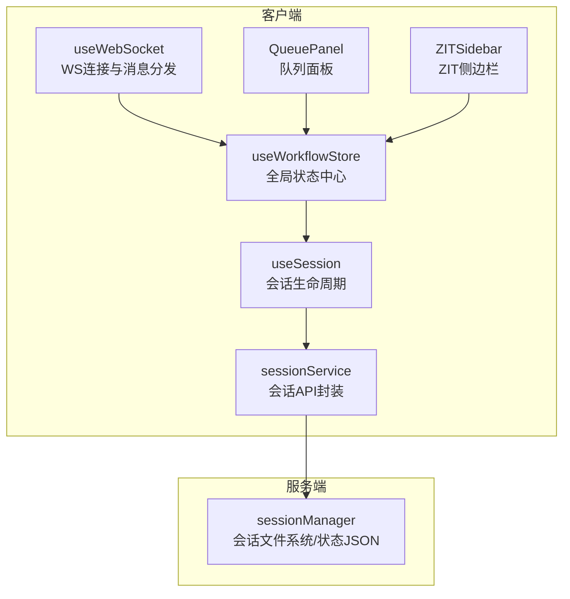
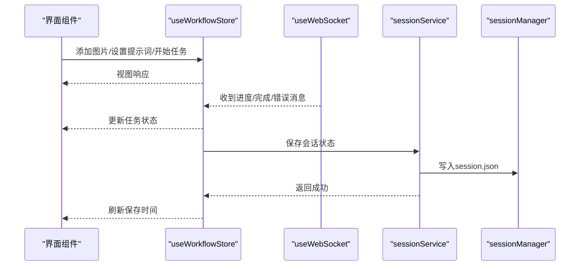
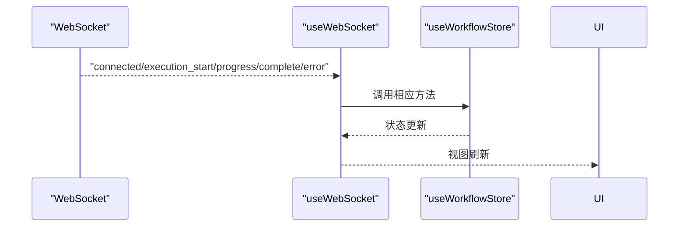
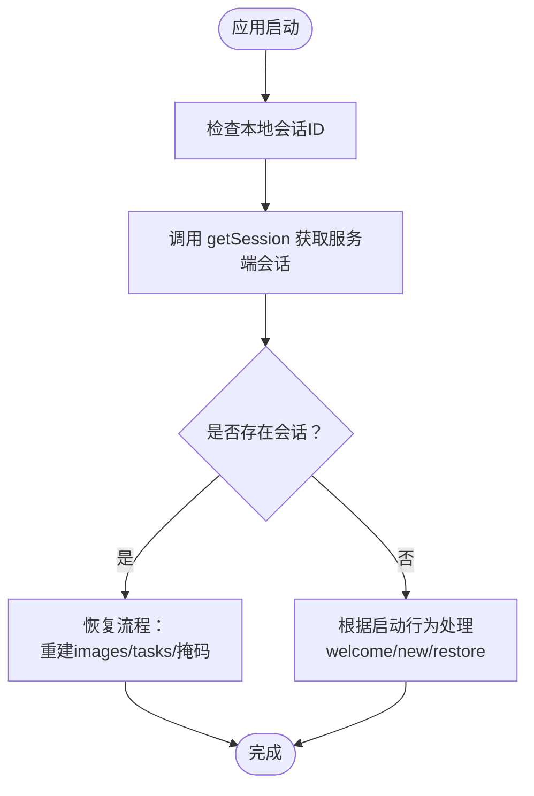
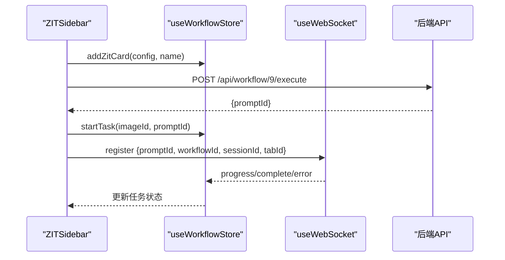
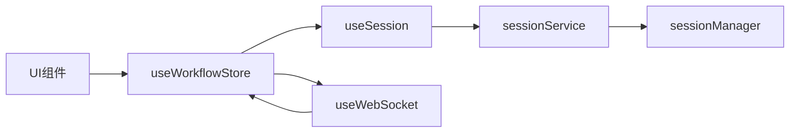

# 工作流状态管理

<cite>
**本文引用的文件列表**
- [useWorkflowStore.ts](file://client/src/hooks/useWorkflowStore.ts)
- [index.ts](file://client/src/types/index.ts)
- [sessionService.ts](file://client/src/services/sessionService.ts)
- [sessionManager.ts](file://server/src/services/sessionManager.ts)
- [useSession.ts](file://client/src/hooks/useSession.ts)
- [useWebSocket.ts](file://client/src/hooks/useWebSocket.ts)
- [QueuePanel.tsx](file://client/src/components/QueuePanel.tsx)
- [ZITSidebar.tsx](file://client/src/components/ZITSidebar.tsx)
- [App.tsx](file://client/src/components/App.tsx)
</cite>

## 目录
1. [简介](#简介)
2. [项目结构与角色分工](#项目结构与角色分工)
3. [核心组件总览](#核心组件总览)
4. [架构概览](#架构概览)
5. [详细组件分析](#详细组件分析)
6. [依赖关系分析](#依赖关系分析)
7. [性能考量与优化建议](#性能考量与优化建议)
8. [故障排查指南](#故障排查指南)
9. [结论](#结论)
10. [附录：使用示例与最佳实践](#附录使用示例与最佳实践)

## 简介
本文件围绕前端工作流状态管理进行系统性梳理，重点解析 useWorkflowStore 的完整实现，涵盖：
- 标签页状态隔离机制
- 图像数据管理与生命周期
- 任务队列控制与状态流转
- 数据结构设计（接口与类型）
- 状态更新机制（同步与异步）
- 会话持久化与恢复策略
- 性能优化与最佳实践

目标是帮助开发者快速理解并正确使用该状态管理模块，同时为后续扩展提供清晰的参考路径。

## 项目结构与角色分工
- 客户端状态层
  - useWorkflowStore：全局工作流状态中心，负责标签页隔离、图像与任务管理、会话恢复等
  - useSession：会话生命周期管理，负责上传/保存/恢复、本地存储与服务端交互
  - useWebSocket：WebSocket 连接与消息分发，驱动异步状态更新
  - sessionService：客户端侧会话 API 封装（上传图片/掩码、保存状态、读取会话）
- 服务端会话层
  - sessionManager：服务端会话文件系统与状态 JSON 管理（目录结构、序列化/反序列化）



图表来源
- [useWorkflowStore.ts:1-645](file://client/src/hooks/useWorkflowStore.ts#L1-L645)
- [useSession.ts:1-422](file://client/src/hooks/useSession.ts#L1-L422)
- [useWebSocket.ts:1-99](file://client/src/hooks/useWebSocket.ts#L1-L99)
- [sessionService.ts:1-134](file://client/src/services/sessionService.ts#L1-L134)
- [sessionManager.ts:1-164](file://server/src/services/sessionManager.ts#L1-L164)
- [QueuePanel.tsx:1-306](file://client/src/components/QueuePanel.tsx#L1-L306)
- [ZITSidebar.tsx:1-635](file://client/src/components/ZITSidebar.tsx#L1-L635)

章节来源
- [useWorkflowStore.ts:1-645](file://client/src/hooks/useWorkflowStore.ts#L1-L645)
- [useSession.ts:1-422](file://client/src/hooks/useSession.ts#L1-L422)
- [useWebSocket.ts:1-99](file://client/src/hooks/useWebSocket.ts#L1-L99)
- [sessionService.ts:1-134](file://client/src/services/sessionService.ts#L1-L134)
- [sessionManager.ts:1-164](file://server/src/services/sessionManager.ts#L1-L164)
- [QueuePanel.tsx:1-306](file://client/src/components/QueuePanel.tsx#L1-L306)
- [ZITSidebar.tsx:1-635](file://client/src/components/ZITSidebar.tsx#L1-L635)

## 核心组件总览
- useWorkflowStore：以 Zustand 实现的全局状态容器，提供标签页隔离、图像管理、任务队列、配置管理、会话恢复等能力
- useSession：订阅状态变化，自动上传新图像与掩码，保存会话状态，支持欢迎页/新建/恢复三种启动行为
- useWebSocket：单例 WebSocket 管理，接收进度、完成、错误等事件并同步到 store
- sessionService：封装上传图片/掩码、保存/加载会话状态的 API
- sessionManager：服务端会话文件系统与状态 JSON 管理

章节来源
- [useWorkflowStore.ts:35-88](file://client/src/hooks/useWorkflowStore.ts#L35-L88)
- [useSession.ts:137-182](file://client/src/hooks/useSession.ts#L137-L182)
- [useWebSocket.ts:10-73](file://client/src/hooks/useWebSocket.ts#L10-L73)
- [sessionService.ts:69-134](file://client/src/services/sessionService.ts#L69-L134)
- [sessionManager.ts:91-120](file://server/src/services/sessionManager.ts#L91-L120)

## 架构概览
工作流状态管理采用“前端状态中心 + 会话持久化 + 异步消息驱动”的架构模式：
- 前端通过 useWorkflowStore 维护多标签页隔离的状态树
- useSession 订阅 store 变化，自动上传新图像/掩码并保存状态
- useWebSocket 接收后端进度/完成/错误消息，驱动任务状态更新
- 服务端通过 sessionManager 管理会话文件系统与状态 JSON



图表来源
- [useWorkflowStore.ts:377-476](file://client/src/hooks/useWorkflowStore.ts#L377-L476)
- [useSession.ts:164-175](file://client/src/hooks/useSession.ts#L164-L175)
- [sessionService.ts:103-113](file://client/src/services/sessionService.ts#L103-L113)
- [sessionManager.ts:91-110](file://server/src/services/sessionManager.ts#L91-L110)

## 详细组件分析

### useWorkflowStore：工作流状态中心
- 标签页隔离
  - 使用 tabData: Record<number, TabData> 存储每个标签页的独立状态
  - activeTab 控制当前激活标签页；切换时清空多选状态
- 图像数据管理
  - images: ImageItem[] 存放当前标签页的图像集合
  - addImages/addImagesGetIds/addImagesToTab：批量添加图片，生成唯一 id 并创建预览 URL
  - removeImage/removeImages/clearCurrentImages：删除与清理，自动回收预览 URL
- 提示词与配置
  - prompts：记录每张图片对应的提示词
  - text2imgConfigs/zitConfigs：文本生成类工作流的参数配置
  - setPrompt/setPrompts：批量设置提示词
- 任务队列与状态
  - tasks：记录每个 imageId 对应的任务信息（promptId/status/progress/outputs/error）
  - startTask/markTaskStarted/updateProgress/completeTask/failTask/resetTask/removeOutput：任务全生命周期管理
  - imagePromptMap：用于根据 promptId 快速定位对应 imageId
- 选择与高亮
  - selectedImageIds：多选状态
  - toggleImageSelection/enterMultiSelect/setSelectedImageIds/clearSelection：选择控制
  - setFlashingImage：高亮闪烁效果
- 特殊功能
  - toggleBackPose：姿态切换开关
  - setFaceSwapZone：换脸区域选择
  - setSelectedOutputIndex：默认输出索引
  - remapTaskPromptIds：当队列优先级调整导致 promptId 变更时，统一更新所有标签页的任务映射
  - needsPrompt/isProcessing：辅助计算属性
- 会话恢复
  - restoreSession：从服务端恢复完整会话，重建任务状态与映射

```mermaid
classDiagram
class TabData {
+images : ImageItem[]
+prompts : Record<string,string>
+tasks : Record<string,TaskInfo>
+imagePromptMap : Record<string,string>
+selectedOutputIndex : Record<string,number>
+backPoseToggles : Record<string,boolean>
+text2imgConfigs : Record<string,Text2ImgConfig>
+zitConfigs : Record<string,ZitConfig>
+faceSwapZones : Record<string,'face'|'target'>
}
class WorkflowStore {
+activeTab : number
+workflows : WorkflowInfo[]
+tabData : Record<number,TabData>
+clientId : string|null
+sessionId : string|null
+selectedImageIds : string[]
+addImages(files)
+removeImage(id)
+setPrompt(imageId,prompt)
+startTask(imageId,promptId)
+markTaskStarted(promptId)
+updateProgress(promptId,percentage)
+completeTask(promptId,outputs)
+failTask(promptId,error)
+resetTask(imageId)
+restoreSession(activeTab,tabData,restoredImages)
}
class ImageItem {
+id : string
+file : File
+previewUrl : string
+originalName : string
+sessionUrl? : string
}
class TaskInfo {
+promptId : string
+status : TaskStatus
+progress : number
+outputs : Array<{filename : string,url : string}>
+error? : string
}
WorkflowStore --> TabData : "管理"
TabData --> ImageItem : "包含"
TabData --> TaskInfo : "包含"
```

图表来源
- [useWorkflowStore.ts:19-88](file://client/src/hooks/useWorkflowStore.ts#L19-L88)
- [index.ts:1-58](file://client/src/types/index.ts#L1-L58)

章节来源
- [useWorkflowStore.ts:19-88](file://client/src/hooks/useWorkflowStore.ts#L19-L88)
- [index.ts:1-58](file://client/src/types/index.ts#L1-L58)

### 任务状态更新机制：同步与异步
- 同步更新
  - addImages/removeImage/setPrompt/startTask 等直接通过 set 更新状态树
  - 适用于 UI 即时反馈与本地状态变更
- 异步状态处理
  - WebSocket 消息驱动：connected/execution_start/progress/complete/error
  - useWebSocket 在 onmessage 中解析消息并调用 store 的 markTaskStarted/updateProgress/completeTask/failTask
  - 队列面板通过轮询 /api/workflow/queue 获取运行/排队任务，并与 store 中的任务进行关联



图表来源
- [useWebSocket.ts:26-51](file://client/src/hooks/useWebSocket.ts#L26-L51)
- [useWorkflowStore.ts:398-499](file://client/src/hooks/useWorkflowStore.ts#L398-L499)

章节来源
- [useWebSocket.ts:10-73](file://client/src/hooks/useWebSocket.ts#L10-L73)
- [useWorkflowStore.ts:377-476](file://client/src/hooks/useWorkflowStore.ts#L377-L476)
- [QueuePanel.tsx:37-121](file://client/src/components/QueuePanel.tsx#L37-L121)

### 会话持久化与恢复策略
- 保存策略
  - 序列化：serializeState 将 store 中的可持久化字段（不含 File 对象）导出
  - 上传：putSessionState 将序列化结果写入服务端 session.json
  - 去抖：scheduleSaveState 使用定时器去抖，避免频繁保存
- 上传与恢复
  - 新增图片：订阅 store 变化，检测新增图片并上传至服务端，成功后回填 sessionUrl
  - 掩码上传：订阅 useMaskStore，将掩码转换为 PNG 并上传
  - 恢复：getSession 获取服务端 session.json，重建 images 与 tasks，并恢复掩码
- 启动行为
  - welcome/new/restore：由 useSettingsStore 控制，影响是否显示欢迎页以及是否恢复上次会话



图表来源
- [useSession.ts:290-387](file://client/src/hooks/useSession.ts#L290-L387)
- [sessionService.ts:116-121](file://client/src/services/sessionService.ts#L116-L121)
- [sessionManager.ts:112-120](file://server/src/services/sessionManager.ts#L112-L120)

章节来源
- [useSession.ts:137-182](file://client/src/hooks/useSession.ts#L137-L182)
- [useSession.ts:184-233](file://client/src/hooks/useSession.ts#L184-L233)
- [useSession.ts:315-387](file://client/src/hooks/useSession.ts#L315-L387)
- [sessionService.ts:103-134](file://client/src/services/sessionService.ts#L103-L134)
- [sessionManager.ts:91-120](file://server/src/services/sessionManager.ts#L91-L120)

### 典型业务流程：ZIT 批量生成
- 用户在 ZITSidebar 设置参数并点击“生成”
- 生成循环：为每个批次创建卡片（addZitCard），然后发起执行请求
- 执行返回 promptId 后，调用 startTask(imageId, promptId)，并通过 WebSocket 注册任务
- 后端通过 WebSocket 推送进度/完成/错误，store 自动更新任务状态



图表来源
- [ZITSidebar.tsx:107-156](file://client/src/components/ZITSidebar.tsx#L107-L156)
- [useWorkflowStore.ts:571-593](file://client/src/hooks/useWorkflowStore.ts#L571-L593)
- [useWebSocket.ts:91-95](file://client/src/hooks/useWebSocket.ts#L91-L95)

章节来源
- [ZITSidebar.tsx:107-156](file://client/src/components/ZITSidebar.tsx#L107-L156)
- [useWorkflowStore.ts:571-593](file://client/src/hooks/useWorkflowStore.ts#L571-L593)
- [useWebSocket.ts:91-95](file://client/src/hooks/useWebSocket.ts#L91-L95)

## 依赖关系分析
- 组件耦合
  - useWorkflowStore 是核心，被 UI 组件广泛消费（如 PhotoWall、ImageCard、QueuePanel、ZITSidebar）
  - useSession 与 useWorkflowStore 强耦合，通过订阅 store 变化实现自动上传与保存
  - useWebSocket 与 useWorkflowStore 解耦，仅通过消息类型驱动状态更新
- 外部依赖
  - sessionService：HTTP API 封装
  - sessionManager：服务端文件系统与 JSON 管理
  - WebSocket：实时状态推送



图表来源
- [useWorkflowStore.ts:96-644](file://client/src/hooks/useWorkflowStore.ts#L96-L644)
- [useSession.ts:184-233](file://client/src/hooks/useSession.ts#L184-L233)
- [useWebSocket.ts:10-73](file://client/src/hooks/useWebSocket.ts#L10-L73)
- [sessionService.ts:69-134](file://client/src/services/sessionService.ts#L69-L134)
- [sessionManager.ts:91-120](file://server/src/services/sessionManager.ts#L91-L120)

章节来源
- [useWorkflowStore.ts:96-644](file://client/src/hooks/useWorkflowStore.ts#L96-L644)
- [useSession.ts:184-233](file://client/src/hooks/useSession.ts#L184-L233)
- [useWebSocket.ts:10-73](file://client/src/hooks/useWebSocket.ts#L10-L73)
- [sessionService.ts:69-134](file://client/src/services/sessionService.ts#L69-L134)
- [sessionManager.ts:91-120](file://server/src/services/sessionManager.ts#L91-L120)

## 性能考量与优化建议
- 状态粒度与订阅
  - 使用 useShallow 或选择性订阅减少不必要的重渲染（例如 ImageCard 中对 prompt/task 的局部订阅）
- 大列表渲染
  - PhotoWall 使用 LazyCard + IntersectionObserver 进行懒加载，降低初始渲染压力
- 文件对象与内存
  - 图片预览使用 URL.createObjectURL，删除时及时 revoke，避免内存泄漏
- 上传与保存
  - 上传与保存采用去抖策略，避免频繁网络请求
- WebSocket 连接
  - 单例连接与自动重连，确保消息可靠到达
- 任务状态搜索
  - progress/complete/error 在所有标签页中查找匹配的 promptId，注意在大型会话中的潜在性能开销，必要时可引入索引优化

章节来源
- [useWorkflowStore.ts:254-283](file://client/src/hooks/useWorkflowStore.ts#L254-L283)
- [useSession.ts:177-181](file://client/src/hooks/useSession.ts#L177-L181)
- [useWebSocket.ts:53-73](file://client/src/hooks/useWebSocket.ts#L53-L73)
- [PhotoWall.tsx:18-30](file://client/src/components/PhotoWall.tsx#L18-L30)

## 故障排查指南
- WebSocket 断线重连
  - 若出现断线，useWebSocket 会在有订阅者时自动重连；检查浏览器控制台日志确认连接状态
- 任务状态不更新
  - 确认 WebSocket 是否收到 progress/complete/error 消息；检查 store 的 markTaskStarted/updateProgress/completeTask/failTask 是否被调用
- 会话恢复失败
  - 检查 getSession 返回值与 session.json 结构；确认图片/掩码 URL 是否可访问
- 图片无法删除或内存泄漏
  - 确保 removeImage/removeImages 后触发 URL.revokeObjectURL；检查是否遗漏清理
- 队列优先级变更
  - prioritize 会返回新的 promptId 映射，需调用 remapTaskPromptIds 更新 store，并重新注册新的 promptId

章节来源
- [useWebSocket.ts:53-73](file://client/src/hooks/useWebSocket.ts#L53-L73)
- [useWorkflowStore.ts:398-499](file://client/src/hooks/useWorkflowStore.ts#L398-L499)
- [useSession.ts:315-387](file://client/src/hooks/useSession.ts#L315-L387)
- [QueuePanel.tsx:89-116](file://client/src/components/QueuePanel.tsx#L89-L116)

## 结论
useWorkflowStore 通过标签页隔离、完善的任务生命周期管理、与会话系统的深度集成，构建了稳定可靠的工作流状态管理框架。结合 useSession 的自动上传与保存、useWebSocket 的实时消息驱动，以及服务端 sessionManager 的文件系统支撑，形成了从前端状态到持久化的完整闭环。遵循本文的最佳实践与优化建议，可在保证用户体验的同时提升系统性能与可维护性。

## 附录：使用示例与最佳实践

### 数据结构与类型
- ImageItem：图像项，包含 id、File、预览 URL、原始名称、可选的会话 URL
- TaskInfo：任务信息，包含 promptId、状态、进度、输出数组、错误信息
- TabData：标签页状态，包含图像、提示词、任务、映射、选择索引、配置等
- WorkflowStore：状态容器接口，提供增删改查、任务控制、会话恢复等方法

章节来源
- [index.ts:1-58](file://client/src/types/index.ts#L1-L58)
- [useWorkflowStore.ts:19-88](file://client/src/hooks/useWorkflowStore.ts#L19-L88)

### 常见操作示例（步骤说明）
- 添加图片
  - 调用 addImages 或 addImagesGetIds，传入 File 数组
  - store 自动创建预览 URL 并加入当前标签页
- 设置提示词
  - setPrompt(imageId, prompt) 或 setPrompts(updates)
- 开始任务
  - startTask(imageId, promptId)；若 promptId 为空，表示等待后端分配
- 查看队列
  - 打开 QueuePanel，周期性拉取 /api/workflow/queue，支持置顶与取消
- 会话恢复
  - useSession 在启动时根据设置决定是否恢复；恢复时重建 images 与 tasks，并恢复掩码

章节来源
- [useWorkflowStore.ts:197-252](file://client/src/hooks/useWorkflowStore.ts#L197-L252)
- [useWorkflowStore.ts:331-355](file://client/src/hooks/useWorkflowStore.ts#L331-L355)
- [useWorkflowStore.ts:377-396](file://client/src/hooks/useWorkflowStore.ts#L377-L396)
- [QueuePanel.tsx:37-87](file://client/src/components/QueuePanel.tsx#L37-L87)
- [useSession.ts:315-387](file://client/src/hooks/useSession.ts#L315-L387)

### 最佳实践
- 使用 useShallow 选择性订阅，避免全局状态变化导致的过度重渲染
- 在删除图片时及时清理预览 URL，防止内存泄漏
- 对于大批量任务，合理使用去抖保存与批量上传，避免频繁网络请求
- 队列优先级变更后，务必调用 remapTaskPromptIds 并重新注册新的 promptId
- 保持 sessionId 与 clientId 的一致性，确保 WebSocket 注册与状态更新正确

章节来源
- [useWorkflowStore.ts:254-283](file://client/src/hooks/useWorkflowStore.ts#L254-L283)
- [useSession.ts:177-181](file://client/src/hooks/useSession.ts#L177-L181)
- [QueuePanel.tsx:89-116](file://client/src/components/QueuePanel.tsx#L89-L116)
- [useWebSocket.ts:91-95](file://client/src/hooks/useWebSocket.ts#L91-L95)