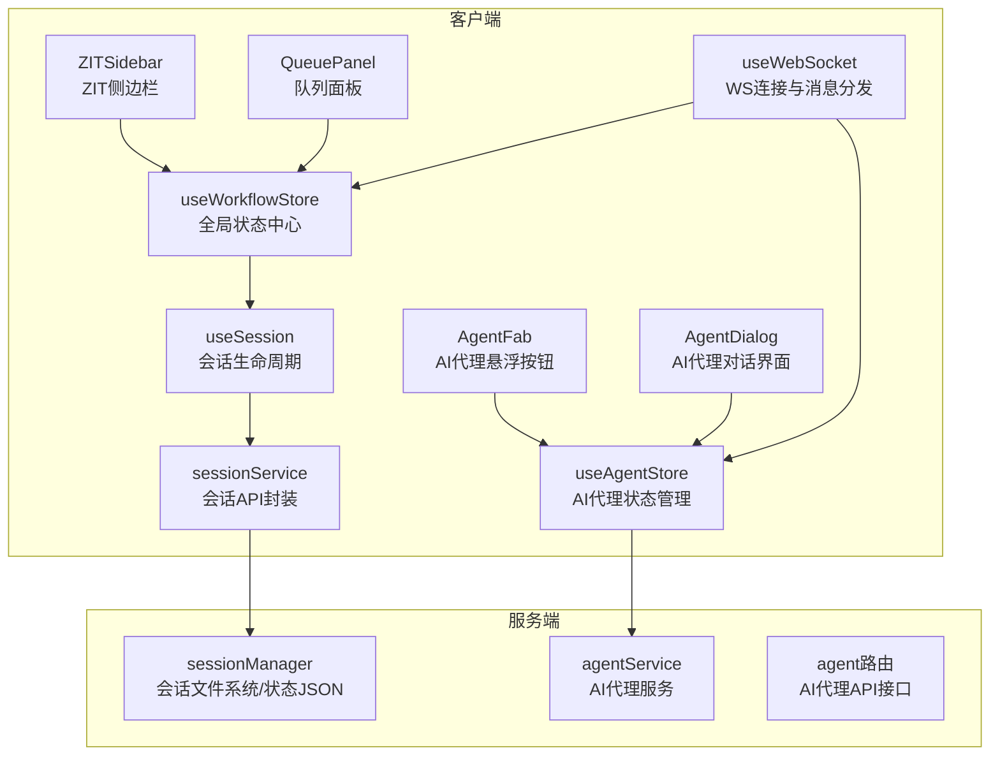
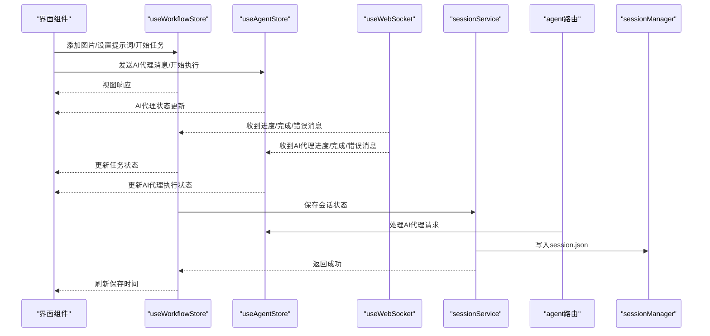
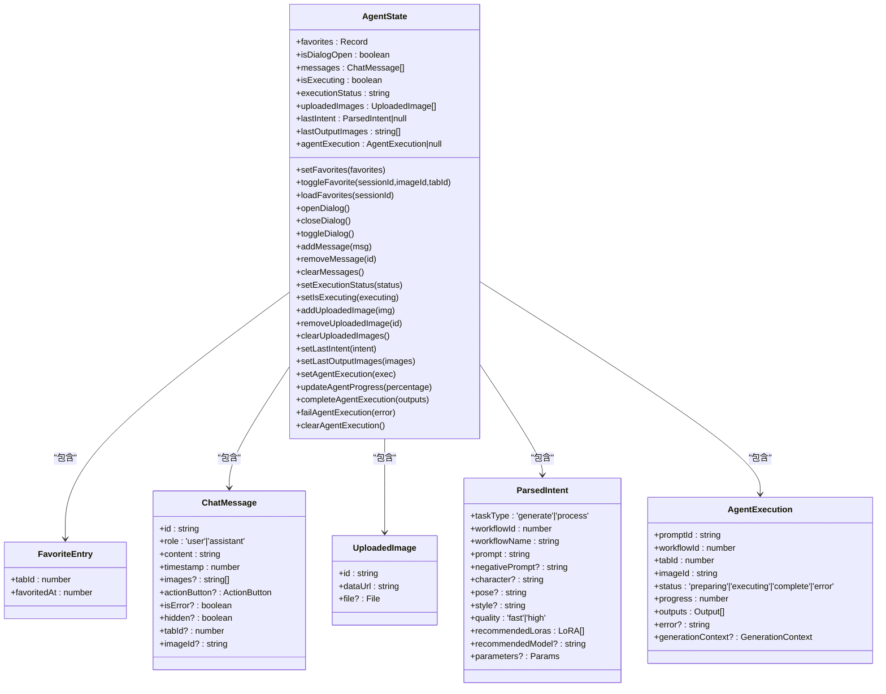
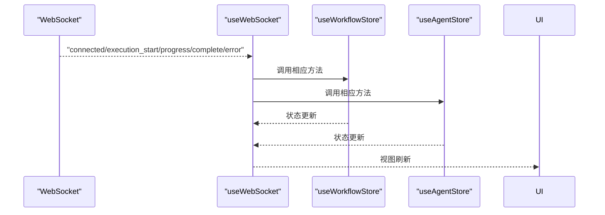
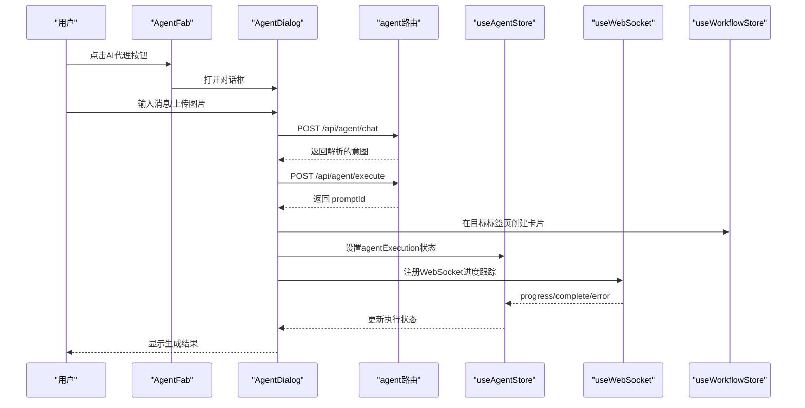
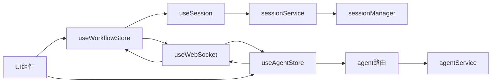

# 工作流状态管理

<cite>
**本文引用的文件列表**
- [useWorkflowStore.ts](file://client/src/hooks/useWorkflowStore.ts)
- [useAgentStore.ts](file://client/src/hooks/useAgentStore.ts)
- [index.ts](file://client/src/types/index.ts)
- [sessionService.ts](file://client/src/services/sessionService.ts)
- [sessionManager.ts](file://server/src/services/sessionManager.ts)
- [useSession.ts](file://client/src/hooks/useSession.ts)
- [useWebSocket.ts](file://client/src/hooks/useWebSocket.ts)
- [AgentDialog.tsx](file://client/src/components/AgentDialog.tsx)
- [AgentFab.tsx](file://client/src/components/AgentFab.tsx)
- [QueuePanel.tsx](file://client/src/components/QueuePanel.tsx)
- [ZITSidebar.tsx](file://client/src/components/ZITSidebar.tsx)
- [App.tsx](file://client/src/components/App.tsx)
- [agent.ts](file://server/src/routes/agent.ts)
- [agentService.ts](file://server/src/services/agentService.ts)
</cite>

## 更新摘要
**变更内容**
- 新增 useAgentStore 钩子，支持AI代理状态管理和跨标签通信
- 增强任务状态管理的灵活性和完整性
- 新增 AI代理对话系统，支持智能意图解析和工作流调度
- 增强跨标签页状态同步和通信机制

## 目录
1. [简介](#简介)
2. [项目结构与角色分工](#项目结构与角色分工)
3. [核心组件总览](#核心组件总览)
4. [架构概览](#架构概览)
5. [详细组件分析](#详细组件分析)
6. [依赖关系分析](#依赖关系分析)
7. [性能考量与优化建议](#性能考量与优化建议)
8. [故障排查指南](#故障排查指南)
9. [结论](#结论)
10. [附录：使用示例与最佳实践](#附录使用示例与最佳实践)

## 简介
本文件围绕前端工作流状态管理进行系统性梳理，重点解析 useWorkflowStore 和新增的 useAgentStore 的完整实现，涵盖：
- 标签页状态隔离机制
- 图像数据管理与生命周期
- 任务队列控制与状态流转
- AI代理状态管理与跨标签通信
- 数据结构设计（接口与类型）
- 状态更新机制（同步与异步）
- 会话持久化与恢复策略
- 性能优化与最佳实践

目标是帮助开发者快速理解并正确使用该状态管理模块，同时为后续扩展提供清晰的参考路径。

## 项目结构与角色分工
- 客户端状态层
  - useWorkflowStore：全局工作流状态中心，负责标签页隔离、图像与任务管理、会话恢复等
  - **新增** useAgentStore：AI代理状态管理，负责对话状态、执行状态、收藏管理、跨标签通信
  - useSession：会话生命周期管理，负责上传/保存/恢复、本地存储与服务端交互
  - useWebSocket：WebSocket 连接与消息分发，驱动异步状态更新和AI代理通信
  - sessionService：客户端侧会话 API 封装（上传图片/掩码、保存状态、读取会话）
- 服务端会话层
  - sessionManager：服务端会话文件系统与状态 JSON 管理（目录结构、序列化/反序列化）
  - **新增** agentService：AI代理服务，负责生成日志、收藏管理、用户画像分析
  - **新增** agent 路由：AI代理API接口，处理聊天、意图解析、工作流执行



**图表来源**
- [useWorkflowStore.ts:1-689](file://client/src/hooks/useWorkflowStore.ts#L1-L689)
- [useAgentStore.ts:1-226](file://client/src/hooks/useAgentStore.ts#L1-L226)
- [useSession.ts:1-422](file://client/src/hooks/useSession.ts#L1-L422)
- [useWebSocket.ts:1-202](file://client/src/hooks/useWebSocket.ts#L1-L202)
- [sessionService.ts:1-134](file://client/src/services/sessionService.ts#L1-L134)
- [sessionManager.ts:1-164](file://server/src/services/sessionManager.ts#L1-L164)
- [agentService.ts:1-118](file://server/src/services/agentService.ts#L1-L118)
- [agent.ts:1-927](file://server/src/routes/agent.ts#L1-L927)

**章节来源**
- [useWorkflowStore.ts:1-689](file://client/src/hooks/useWorkflowStore.ts#L1-L689)
- [useAgentStore.ts:1-226](file://client/src/hooks/useAgentStore.ts#L1-L226)
- [useSession.ts:1-422](file://client/src/hooks/useSession.ts#L1-L422)
- [useWebSocket.ts:1-202](file://client/src/hooks/useWebSocket.ts#L1-L202)
- [sessionService.ts:1-134](file://client/src/services/sessionService.ts#L1-L134)
- [sessionManager.ts:1-164](file://server/src/services/sessionManager.ts#L1-L164)
- [agentService.ts:1-118](file://server/src/services/agentService.ts#L1-L118)
- [agent.ts:1-927](file://server/src/routes/agent.ts#L1-L927)

## 核心组件总览
- useWorkflowStore：以 Zustand 实现的全局状态容器，提供标签页隔离、图像管理、任务队列、配置管理、会话恢复等能力
- **新增** useAgentStore：以 Zustand 实现的AI代理状态容器，提供对话管理、执行状态、收藏管理、跨标签通信等功能
- useSession：订阅状态变化，自动上传新图像与掩码，保存会话状态，支持欢迎页/新建/恢复三种启动行为
- useWebSocket：单例 WebSocket 管理，接收进度、完成、错误等事件并同步到 store，支持AI代理通信
- sessionService：封装上传图片/掩码、保存/加载会话状态的 API
- sessionManager：服务端会话文件系统与状态 JSON 管理

**章节来源**
- [useWorkflowStore.ts:35-88](file://client/src/hooks/useWorkflowStore.ts#L35-L88)
- [useAgentStore.ts:54-122](file://client/src/hooks/useAgentStore.ts#L54-L122)
- [useSession.ts:137-182](file://client/src/hooks/useSession.ts#L137-L182)
- [useWebSocket.ts:10-73](file://client/src/hooks/useWebSocket.ts#L10-L73)
- [sessionService.ts:69-134](file://client/src/services/sessionService.ts#L69-L134)
- [sessionManager.ts:91-120](file://server/src/services/sessionManager.ts#L91-L120)

## 架构概览
工作流状态管理采用"前端状态中心 + 会话持久化 + 异步消息驱动 + AI代理智能调度"的架构模式：
- 前端通过 useWorkflowStore 维护多标签页隔离的状态树
- **新增** 通过 useAgentStore 管理AI代理对话状态和执行状态
- useSession 订阅 store 变化，自动上传新图像/掩码并保存状态
- useWebSocket 接收后端进度/完成/错误消息，驱动任务状态更新和AI代理通信
- 服务端通过 sessionManager 管理会话文件系统与状态 JSON
- **新增** 服务端通过 agentService 和 agent 路由提供AI代理功能



**图表来源**
- [useWorkflowStore.ts:377-476](file://client/src/hooks/useWorkflowStore.ts#L377-L476)
- [useAgentStore.ts:167-225](file://client/src/hooks/useAgentStore.ts#L167-L225)
- [useSession.ts:164-175](file://client/src/hooks/useSession.ts#L164-L175)
- [useWebSocket.ts:131-153](file://client/src/hooks/useWebSocket.ts#L131-L153)
- [sessionService.ts:103-113](file://client/src/services/sessionService.ts#L103-L113)
- [sessionManager.ts:91-110](file://server/src/services/sessionManager.ts#L91-L110)

## 详细组件分析

### useWorkflowStore：工作流状态中心
- 标签页隔离
  - 使用 tabData: Record<number, TabData> 存储每个标签页的独立状态
  - activeTab 控制当前激活标签页；切换时清空多选状态
- 图像数据管理
  - images: ImageItem[] 存放当前标签页的图像集合
  - addImages/addImagesGetIds/addImagesToTab：批量添加图片，生成唯一 id 并创建预览 URL
  - removeImage/removeImages/clearCurrentImages：删除与清理，自动回收预览 URL
- 提示词与配置
  - prompts：记录每张图片对应的提示词
  - text2imgConfigs/zitConfigs：文本生成类工作流的参数配置
  - setPrompt/setPrompts：批量设置提示词
- 任务队列与状态
  - tasks：记录每个 imageId 对应的任务信息（promptId/status/progress/outputs/error）
  - startTask/markTaskStarted/updateProgress/completeTask/failTask/resetTask/removeOutput：任务全生命周期管理
  - **新增** removeImageByPromptId：根据 promptId 跨标签页清理图片和相关状态，提供更彻底的状态清理能力
  - imagePromptMap：用于根据 promptId 快速定位对应 imageId
- 选择与高亮
  - selectedImageIds：多选状态
  - toggleImageSelection/enterMultiSelect/setSelectedImageIds/clearSelection：选择控制
  - setFlashingImage：高亮闪烁效果
- 特殊功能
  - toggleBackPose：姿态切换开关
  - setFaceSwapZone：换脸区域选择
  - setSelectedOutputIndex：默认输出索引
  - remapTaskPromptIds：当队列优先级调整导致 promptId 变更时，统一更新所有标签页的任务映射
  - needsPrompt/isProcessing：辅助计算属性
- 会话恢复
  - restoreSession：从服务端恢复完整会话，重建任务状态与映射

```mermaid
classDiagram
class TabData {
+images : ImageItem[]
+prompts : Record<string,string>
+tasks : Record<string,TaskInfo>
+imagePromptMap : Record<string,string>
+selectedOutputIndex : Record<string,number>
+backPoseToggles : Record<string,boolean>
+text2imgConfigs : Record<string,Text2ImgConfig>
+zitConfigs : Record<string,ZitConfig>
+faceSwapZones : Record<string,'face'|'target'>
}
class WorkflowStore {
+activeTab : number
+workflows : WorkflowInfo[]
+tabData : Record<number,TabData>
+clientId : string|null
+sessionId : string|null
+selectedImageIds : string[]
+addImages(files)
+removeImage(id)
+setPrompt(imageId,prompt)
+startTask(imageId,promptId)
+markTaskStarted(promptId)
+updateProgress(promptId,percentage)
+completeTask(promptId,outputs)
+failTask(promptId,error)
+resetTask(imageId)
+removeImageByPromptId(promptId)
+removeOutput(imageId,outputIndex)
+restoreSession(activeTab,tabData,restoredImages)
}
class ImageItem {
+id : string
+file : File
+previewUrl : string
+originalName : string
+sessionUrl? : string
}
class TaskInfo {
+promptId : string
+status : TaskStatus
+progress : number
+outputs : Array<{filename : string,url : string}>
+error? : string
}
WorkflowStore --> TabData : "管理"
TabData --> ImageItem : "包含"
TabData --> TaskInfo : "包含"
```

**图表来源**
- [useWorkflowStore.ts:19-88](file://client/src/hooks/useWorkflowStore.ts#L19-L88)
- [index.ts:1-58](file://client/src/types/index.ts#L1-L58)

**章节来源**
- [useWorkflowStore.ts:19-88](file://client/src/hooks/useWorkflowStore.ts#L19-L88)
- [index.ts:1-58](file://client/src/types/index.ts#L1-L58)

### useAgentStore：AI代理状态管理
**新增** AI代理状态管理模块，提供完整的AI代理功能：
- 收藏管理
  - favorites：记录图片收藏状态，包含 tabId 和收藏时间
  - toggleFavorite/loadFavorites：收藏/取消收藏，支持跨标签页收藏同步
  - isFavorited：检查图片是否已收藏
- 对话状态
  - isDialogOpen：AI代理对话框打开状态
  - openDialog/closeDialog/toggleDialog：对话框控制
  - messages：对话消息数组，支持用户/助手消息和错误消息
  - addMessage/removeMessage/clearMessages：消息管理
- 执行状态
  - isExecuting：AI代理执行状态
  - executionStatus：执行状态描述
  - agentExecution：AI代理执行详情（promptId/workflowId/tabId/imageId/status/progress/outputs/error）
  - setAgentExecution/updateAgentProgress/completeAgentExecution/failAgentExecution/clearAgentExecution：执行状态管理
- 上传图片
  - uploadedImages：用户上传的图片列表
  - addUploadedImage/removeUploadedImage/clearUploadedImages：图片管理
- 意图解析
  - lastIntent：最后一次解析的意图
  - setLastIntent：设置意图
  - lastOutputImages：最近一次生成的输出图片URL数组
  - setLastOutputImages：设置输出图片



**图表来源**
- [useAgentStore.ts:3-52](file://client/src/hooks/useAgentStore.ts#L3-L52)
- [useAgentStore.ts:54-122](file://client/src/hooks/useAgentStore.ts#L54-L122)

**章节来源**
- [useAgentStore.ts:3-52](file://client/src/hooks/useAgentStore.ts#L3-L52)
- [useAgentStore.ts:54-122](file://client/src/hooks/useAgentStore.ts#L54-L122)

### 任务状态更新机制：同步与异步
- 同步更新
  - addImages/removeImage/setPrompt/startTask 等直接通过 set 更新状态树
  - 适用于 UI 即时反馈与本地状态变更
- 异步状态处理
  - WebSocket 消息驱动：connected/execution_start/progress/complete/error
  - useWebSocket 在 onmessage 中解析消息并调用 store 的 markTaskStarted/updateProgress/completeTask/failTask
  - **新增** AI代理执行状态：useWebSocket 独立处理 agentExecution 的进度同步
  - 队列面板通过轮询 /api/workflow/queue 获取运行/排队任务，并与 store 中的任务进行关联



**图表来源**
- [useWebSocket.ts:26-51](file://client/src/hooks/useWebSocket.ts#L26-L51)
- [useWebSocket.ts:131-153](file://client/src/hooks/useWebSocket.ts#L131-L153)
- [useWorkflowStore.ts:398-499](file://client/src/hooks/useWorkflowStore.ts#L398-L499)

**章节来源**
- [useWebSocket.ts:10-73](file://client/src/hooks/useWebSocket.ts#L10-L73)
- [useWebSocket.ts:131-153](file://client/src/hooks/useWebSocket.ts#L131-L153)
- [useWorkflowStore.ts:377-476](file://client/src/hooks/useWorkflowStore.ts#L377-L476)
- [QueuePanel.tsx:37-121](file://client/src/components/QueuePanel.tsx#L37-L121)

### 会话持久化与恢复策略
- 保存策略
  - 序列化：serializeState 将 store 中的可持久化字段（不含 File 对象）导出
  - 上传：putSessionState 将序列化结果写入服务端 session.json
  - 去抖：scheduleSaveState 使用定时器去抖，避免频繁保存
- 上传与恢复
  - 新增图片：订阅 store 变化，检测新增图片并上传至服务端，成功后回填 sessionUrl
  - 掩码上传：订阅 useMaskStore，将掩码转换为 PNG 并上传
  - 恢复：getSession 获取服务端 session.json，重建 images 与 tasks，并恢复掩码
- 启动行为
  - welcome/new/restore：由 useSettingsStore 控制，影响是否显示欢迎页以及是否恢复上次会话


**图表来源**
- [useSession.ts:290-387](file://client/src/hooks/useSession.ts#L290-L387)
- [sessionService.ts:116-121](file://client/src/services/sessionService.ts#L116-L121)
- [sessionManager.ts:112-120](file://server/src/services/sessionManager.ts#L112-L120)

**章节来源**
- [useSession.ts:137-182](file://client/src/hooks/useSession.ts#L137-L182)
- [useSession.ts:184-233](file://client/src/hooks/useSession.ts#L184-L233)
- [useSession.ts:315-387](file://client/src/hooks/useSession.ts#L315-L387)
- [sessionService.ts:103-134](file://client/src/services/sessionService.ts#L103-L134)
- [sessionManager.ts:91-120](file://server/src/services/sessionManager.ts#L91-L120)

### 典型业务流程：AI代理对话与工作流执行
**新增** AI代理对话系统的工作流程：
- 用户通过 AgentFab 打开 AgentDialog
- 用户输入消息或上传图片，AgentDialog 调用 /api/agent/chat
- 服务端通过 LLM 解析用户意图，返回 ParsedIntent
- AgentDialog 调用 /api/agent/execute 执行工作流
- 服务端创建工作流模板，调用 queuePrompt 返回 promptId
- AgentDialog 在目标标签页创建卡片并关联 promptId
- useWebSocket 注册进度跟踪，实时更新 agentExecution 状态



**图表来源**
- [AgentFab.tsx:1-46](file://client/src/components/AgentFab.tsx#L1-L46)
- [AgentDialog.tsx:162-393](file://client/src/components/AgentDialog.tsx#L162-L393)
- [agent.ts:604-800](file://server/src/routes/agent.ts#L604-L800)
- [useWebSocket.ts:131-153](file://client/src/hooks/useWebSocket.ts#L131-L153)

**章节来源**
- [AgentFab.tsx:1-46](file://client/src/components/AgentFab.tsx#L1-L46)
- [AgentDialog.tsx:162-393](file://client/src/components/AgentDialog.tsx#L162-L393)
- [agent.ts:604-800](file://server/src/routes/agent.ts#L604-L800)
- [useWebSocket.ts:131-153](file://client/src/hooks/useWebSocket.ts#L131-L153)

### 任务清理机制：removeImageByPromptId 与 resetTask 的对比
- **resetTask 方法**（传统方式）
  - 仅清理指定 imageId 对应的任务状态
  - 保留图片本身和相关配置
  - 适用于需要保留图片但清除任务状态的场景
- **removeImageByPromptId 方法**（新增增强方式）
  - **跨标签页清理**：遍历所有标签页查找匹配的 promptId
  - **彻底清理**：删除对应的图片、任务、提示词、配置等所有相关状态
  - **内存安全**：自动回收预览 URL，防止内存泄漏
  - **状态一致性**：确保跨标签页的状态映射保持一致

**使用场景对比**
- resetTask：用户想要重新执行某个任务但保留原图
- removeImageByPromptId：用户想要完全移除某个任务及其相关状态，通常用于队列取消或错误清理

**章节来源**
- [useWorkflowStore.ts:506-520](file://client/src/hooks/useWorkflowStore.ts#L506-L520)
- [useWorkflowStore.ts:522-559](file://client/src/hooks/useWorkflowStore.ts#L522-L559)
- [QueuePanel.tsx:119-123](file://client/src/components/QueuePanel.tsx#L119-L123)

### AI代理跨标签通信机制
**新增** AI代理系统支持跨标签页通信和状态同步：
- 收藏状态跨标签页同步：toggleFavorite 支持跨标签页收藏管理
- 生成历史跨会话共享：agentService 提供跨会话的用户画像分析
- 执行状态共享：agentExecution 状态在所有标签页间共享
- 消息历史：messages 在所有标签页间共享，支持跨标签页导航
- 输出图片共享：lastOutputImages 供链式工作流引用

**章节来源**
- [useAgentStore.ts:129-158](file://client/src/hooks/useAgentStore.ts#L129-L158)
- [agentService.ts:66-118](file://server/src/services/agentService.ts#L66-L118)
- [AgentDialog.tsx:48-98](file://client/src/components/AgentDialog.tsx#L48-L98)

## 依赖关系分析
- 组件耦合
  - useWorkflowStore 是核心，被 UI 组件广泛消费（如 PhotoWall、ImageCard、QueuePanel、ZITSidebar）
  - **新增** useAgentStore 与 useWorkflowStore 解耦，通过独立的状态管理实现AI代理功能
  - useSession 与 useWorkflowStore 强耦合，通过订阅 store 变化实现自动上传与保存
  - useWebSocket 与 useWorkflowStore 和 useAgentStore 都有交互，分别处理工作流任务和AI代理执行状态
- 外部依赖
  - sessionService：HTTP API 封装
  - sessionManager：服务端文件系统与 JSON 管理
  - **新增** agentService：AI代理服务，提供收藏管理和生成日志
  - **新增** agent 路由：AI代理API接口，处理聊天、意图解析、工作流执行
  - WebSocket：实时状态推送和AI代理通信



**图表来源**
- [useWorkflowStore.ts:96-689](file://client/src/hooks/useWorkflowStore.ts#L96-L689)
- [useAgentStore.ts:124-225](file://client/src/hooks/useAgentStore.ts#L124-L225)
- [useSession.ts:184-233](file://client/src/hooks/useSession.ts#L184-L233)
- [useWebSocket.ts:10-73](file://client/src/hooks/useWebSocket.ts#L10-L73)
- [sessionService.ts:69-134](file://client/src/services/sessionService.ts#L69-L134)
- [sessionManager.ts:91-120](file://server/src/services/sessionManager.ts#L91-L120)
- [agent.ts:1-927](file://server/src/routes/agent.ts#L1-L927)
- [agentService.ts:1-118](file://server/src/services/agentService.ts#L1-L118)

**章节来源**
- [useWorkflowStore.ts:96-689](file://client/src/hooks/useWorkflowStore.ts#L96-L689)
- [useAgentStore.ts:124-225](file://client/src/hooks/useAgentStore.ts#L124-L225)
- [useSession.ts:184-233](file://client/src/hooks/useSession.ts#L184-L233)
- [useWebSocket.ts:10-73](file://client/src/hooks/useWebSocket.ts#L10-L73)
- [sessionService.ts:69-134](file://client/src/services/sessionService.ts#L69-L134)
- [sessionManager.ts:91-120](file://server/src/services/sessionManager.ts#L91-L120)
- [agent.ts:1-927](file://server/src/routes/agent.ts#L1-L927)
- [agentService.ts:1-118](file://server/src/services/agentService.ts#L1-L118)

## 性能考量与优化建议
- 状态粒度与订阅
  - 使用 useShallow 或选择性订阅减少不必要的重渲染（例如 ImageCard 中对 prompt/task 的局部订阅）
  - **新增** useAgentStore 支持细粒度订阅，避免不必要的AI代理状态更新
- 大列表渲染
  - PhotoWall 使用 LazyCard + IntersectionObserver 进行懒加载，降低初始渲染压力
- 文件对象与内存
  - 图片预览使用 URL.createObjectURL，删除时及时 revoke，避免内存泄漏
  - **新增** AI代理上传图片使用临时内存存储，及时清理避免内存泄漏
  - **新增** removeImageByPromptId 自动处理 URL.revokeObjectURL，确保内存安全
- 上传与保存
  - 上传与保存采用去抖策略，避免频繁网络请求
- WebSocket 连接
  - 单例连接与自动重连，确保消息可靠到达
  - **新增** AI代理执行状态独立处理，避免与工作流任务状态冲突
- 任务状态搜索
  - progress/complete/error 在所有标签页中查找匹配的 promptId，注意在大型会话中的潜在性能开销，必要时可引入索引优化
  - **新增** AI代理执行状态通过 promptId 匹配，避免全表扫描
  - **新增** 收藏状态跨标签页查找，使用索引优化提高性能

**章节来源**
- [useWorkflowStore.ts:254-283](file://client/src/hooks/useWorkflowStore.ts#L254-L283)
- [useAgentStore.ts:129-158](file://client/src/hooks/useAgentStore.ts#L129-L158)
- [useSession.ts:177-181](file://client/src/hooks/useSession.ts#L177-L181)
- [useWebSocket.ts:53-73](file://client/src/hooks/useWebSocket.ts#L53-L73)
- [PhotoWall.tsx:18-30](file://client/src/components/PhotoWall.tsx#L18-L30)

## 故障排查指南
- WebSocket 断线重连
  - 若出现断线，useWebSocket 会在有订阅者时自动重连；检查浏览器控制台日志确认连接状态
  - **新增** AI代理执行状态断线重连，确保执行状态不丢失
- 任务状态不更新
  - 确认 WebSocket 是否收到 progress/complete/error 消息；检查 store 的 markTaskStarted/updateProgress/completeTask/failTask 是否被调用
  - **新增** AI代理执行状态检查：确认 agentExecution 状态是否正确更新
- 会话恢复失败
  - 检查 getSession 返回值与 session.json 结构；确认图片/掩码 URL 是否可访问
- 图片无法删除或内存泄漏
  - **新增** 使用 removeImageByPromptId 替代手动清理，确保所有相关状态都被正确移除
  - 确保 removeImage/removeImages 后触发 URL.revokeObjectURL；检查是否遗漏清理
  - **新增** AI代理上传图片及时清理，避免内存泄漏
- 队列优先级变更
  - prioritize 会返回新的 promptId 映射，需调用 remapTaskPromptIds 更新 store，并重新注册新的 promptId
- **新增** removeImageByPromptId 不生效
  - 检查 promptId 是否正确传递
  - 确认 imagePromptMap 中存在对应的映射关系
  - 验证跨标签页的状态查找逻辑
- **新增** AI代理对话异常
  - 检查 /api/agent/chat 接口返回的意图解析是否正确
  - 确认 /api/agent/execute 接口是否返回有效的 promptId
  - 验证 WebSocket 进度跟踪是否正常工作
- **新增** 收藏功能异常
  - 检查 /api/agent/favorite 接口是否正确调用
  - 确认 agentService 是否正确写入收藏数据
  - 验证跨标签页收藏状态同步

**章节来源**
- [useWebSocket.ts:53-73](file://client/src/hooks/useWebSocket.ts#L53-L73)
- [useWorkflowStore.ts:398-499](file://client/src/hooks/useWorkflowStore.ts#L398-L499)
- [useSession.ts:315-387](file://client/src/hooks/useSession.ts#L315-L387)
- [QueuePanel.tsx:89-116](file://client/src/components/QueuePanel.tsx#L89-L116)
- [agent.ts:429-478](file://server/src/routes/agent.ts#L429-L478)
- [agentService.ts:83-96](file://server/src/services/agentService.ts#L83-L96)

## 结论
useWorkflowStore 通过标签页隔离、完善的任务生命周期管理、与会话系统的深度集成，构建了稳定可靠的工作流状态管理框架。**新增的 useAgentStore** 通过独立的状态管理，实现了完整的AI代理功能，包括对话管理、执行状态、收藏管理、跨标签通信等能力。

结合 useSession 的自动上传与保存、useWebSocket 的实时消息驱动，以及服务端 sessionManager 和 agentService 的文件系统支撑，形成了从前端状态到持久化的完整闭环。

**重大改进**：
- 新增的 useAgentStore 提供了强大的AI代理功能，支持智能对话、意图解析、工作流执行
- 增强的任务清理机制，通过 removeImageByPromptId 实现跨标签页的彻底清理
- 改进的跨标签通信机制，支持收藏状态、消息历史、执行状态的跨标签页同步
- AI代理系统与现有工作流系统的无缝集成，提供智能化的用户体验

遵循本文的最佳实践与优化建议，可在保证用户体验的同时提升系统性能与可维护性。

## 附录：使用示例与最佳实践

### 数据结构与类型
- ImageItem：图像项，包含 id、File、预览 URL、原始名称、可选的会话 URL
- TaskInfo：任务信息，包含 promptId、状态、进度、输出数组、错误信息
- TabData：标签页状态，包含图像、提示词、任务、映射、选择索引、配置等
- WorkflowStore：状态容器接口，提供增删改查、任务控制、会话恢复等方法
- **新增** ChatMessage：AI代理对话消息，支持用户/助手消息和错误消息
- **新增** ParsedIntent：解析后的用户意图，包含工作流类型、参数、推荐LoRA等
- **新增** AgentExecution：AI代理执行状态，包含执行详情和进度信息

**章节来源**
- [index.ts:1-58](file://client/src/types/index.ts#L1-L58)
- [useWorkflowStore.ts:19-88](file://client/src/hooks/useWorkflowStore.ts#L19-L88)
- [useAgentStore.ts:3-52](file://client/src/hooks/useAgentStore.ts#L3-L52)

### 常见操作示例（步骤说明）
- 添加图片
  - 调用 addImages 或 addImagesGetIds，传入 File 数组
  - store 自动创建预览 URL 并加入当前标签页
- 设置提示词
  - setPrompt(imageId, prompt) 或 setPrompts(updates)
- 开始任务
  - startTask(imageId, promptId)；若 promptId 为空，表示等待后端分配
- 查看队列
  - 打开 QueuePanel，周期性拉取 /api/workflow/queue，支持置顶与取消
- 会话恢复
  - useSession 在启动时根据设置决定是否恢复；恢复时重建 images 与 tasks，并恢复掩码
- **新增** 清理任务
  - 使用 resetTask 清理指定图片的任务状态（保留图片）
  - 使用 removeImageByPromptId 根据 promptId 跨标签页彻底清理（推荐用于队列取消）
- **新增** AI代理对话
  - 通过 AgentFab 打开 AgentDialog
  - 输入消息或上传图片，系统自动解析意图并执行工作流
  - 实时查看生成进度和结果
- **新增** 收藏管理
  - 在任意标签页收藏图片，状态跨标签页同步
  - 通过 /api/agent/favorites 获取收藏列表

**章节来源**
- [useWorkflowStore.ts:197-252](file://client/src/hooks/useWorkflowStore.ts#L197-L252)
- [useWorkflowStore.ts:331-355](file://client/src/hooks/useWorkflowStore.ts#L331-L355)
- [useWorkflowStore.ts:377-396](file://client/src/hooks/useWorkflowStore.ts#L377-L396)
- [QueuePanel.tsx:37-87](file://client/src/components/QueuePanel.tsx#L37-L87)
- [useSession.ts:315-387](file://client/src/hooks/useSession.ts#L315-L387)
- [AgentDialog.tsx:438-531](file://client/src/components/AgentDialog.tsx#L438-L531)
- [useAgentStore.ts:129-158](file://client/src/hooks/useAgentStore.ts#L129-L158)

### 最佳实践
- 使用 useShallow 选择性订阅，避免全局状态变化导致的过度重渲染
- 在删除图片时及时清理预览 URL，防止内存泄漏
- 对于大批量任务，合理使用去抖保存与批量上传，避免频繁网络请求
- 队列优先级变更后，务必调用 remapTaskPromptIds 并重新注册新的 promptId
- 保持 sessionId 与 clientId 的一致性，确保 WebSocket 注册与状态更新正确
- **新增** 优先使用 removeImageByPromptId 进行任务清理，确保跨标签页状态的一致性
- **新增** 在处理队列取消时，使用 removeImageByPromptId 而非 resetTask，避免残留状态
- **新增** AI代理对话中及时清理上传的图片，避免内存泄漏
- **新增** 收藏操作使用异步持久化，避免阻塞UI响应
- **新增** 跨标签通信时注意状态同步的时机，避免竞态条件

**章节来源**
- [useWorkflowStore.ts:254-283](file://client/src/hooks/useWorkflowStore.ts#L254-L283)
- [useSession.ts:177-181](file://client/src/hooks/useSession.ts#L177-L181)
- [QueuePanel.tsx:89-116](file://client/src/components/QueuePanel.tsx#L89-L116)
- [useWebSocket.ts:91-95](file://client/src/hooks/useWebSocket.ts#L91-L95)
- [AgentDialog.tsx:425-436](file://client/src/components/AgentDialog.tsx#L425-L436)
- [useAgentStore.ts:139-144](file://client/src/hooks/useAgentStore.ts#L139-L144)