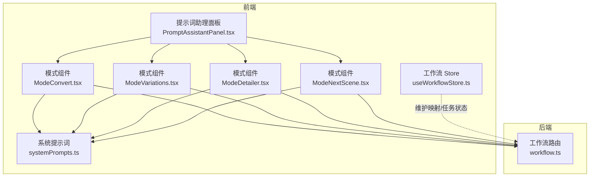
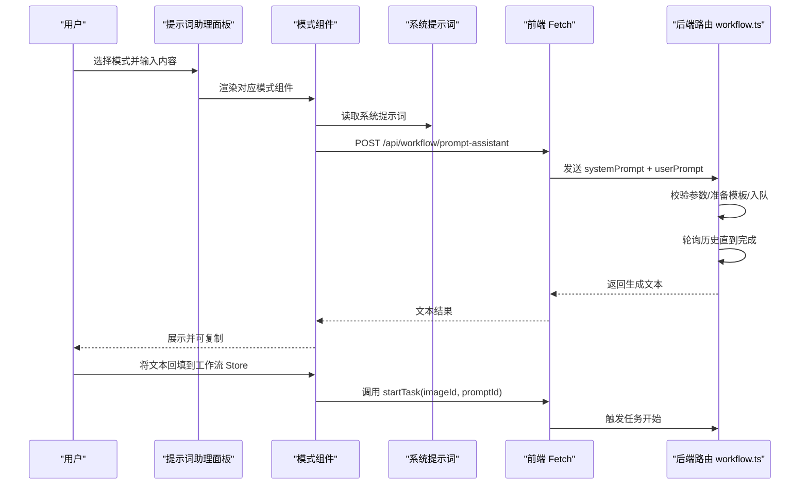
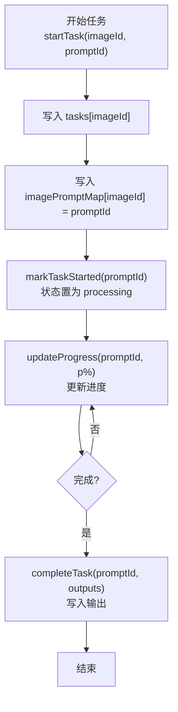
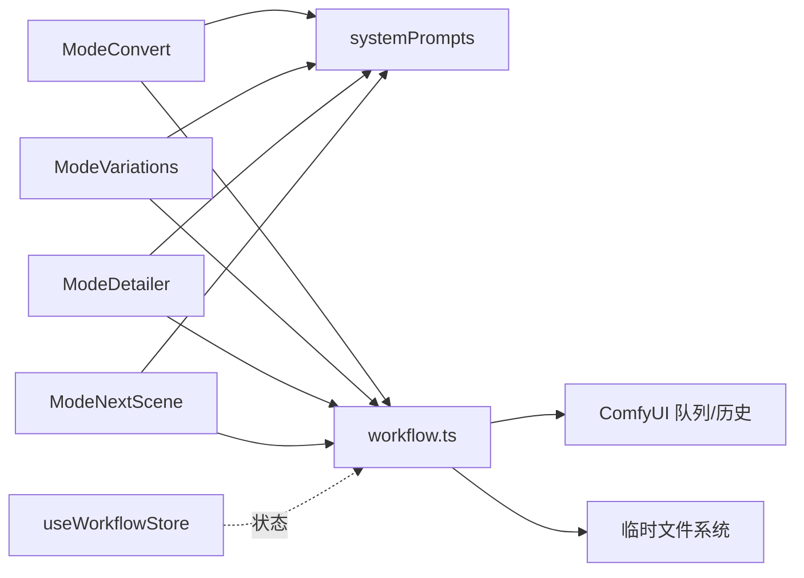

# 提示词管理

<cite>
**本文引用的文件**
- [useWorkflowStore.ts](file://client/src/hooks/useWorkflowStore.ts)
- [PromptAssistantPanel.tsx](file://client/src/components/PromptAssistantPanel.tsx)
- [ModeConvert.tsx](file://client/src/components/prompt-assistant/ModeConvert.tsx)
- [ModeVariations.tsx](file://client/src/components/prompt-assistant/ModeVariations.tsx)
- [ModeDetailer.tsx](file://client/src/components/prompt-assistant/ModeDetailer.tsx)
- [ModeNextScene.tsx](file://client/src/components/prompt-assistant/ModeNextScene.tsx)
- [systemPrompts.ts](file://client/src/components/prompt-assistant/systemPrompts.ts)
- [workflow.ts](file://server/src/routes/workflow.ts)
- [SystemPrompt.txt](file://docs/SystemPrompt.txt)
</cite>

## 目录
1. [简介](#简介)
2. [项目结构](#项目结构)
3. [核心组件](#核心组件)
4. [架构总览](#架构总览)
5. [详细组件分析](#详细组件分析)
6. [依赖分析](#依赖分析)
7. [性能考虑](#性能考虑)
8. [故障排查指南](#故障排查指南)
9. [结论](#结论)
10. [附录](#附录)

## 简介
本文件系统性阐述提示词管理的设计与实现，重点覆盖以下方面：
- prompts 记录与 imagePromptMap 映射的设计目的与使用方式
- setPrompt、setPrompts 的实现逻辑与调用场景
- 如何为特定图片设置提示词以及批量设置提示词
- 提示词与图片 ID 的关联关系及在任务状态管理中的作用
- 提示词验证与错误处理机制
- 使用示例（步骤化说明，不直接展示代码）
- 最佳实践与常见问题解决方案

## 项目结构
提示词管理涉及前端状态存储与后端工作流服务两大部分：
- 前端工作流状态：通过工作流 Store 维护每个标签页内的图片、提示词、任务与映射关系
- 提示词助理面板：提供多种提示词工程模式（转换、变体、扩写、后续镜头等），通过系统提示词驱动后端 ComfyUI 工作流生成文本

图表来源
- [useWorkflowStore.ts](file://client/src/hooks/useWorkflowStore.ts)
- [PromptAssistantPanel.tsx](file://client/src/components/PromptAssistantPanel.tsx)
- [ModeConvert.tsx](file://client/src/components/prompt-assistant/ModeConvert.tsx)
- [ModeVariations.tsx](file://client/src/components/prompt-assistant/ModeVariations.tsx)
- [ModeDetailer.tsx](file://client/src/components/prompt-assistant/ModeDetailer.tsx)
- [ModeNextScene.tsx](file://client/src/components/prompt-assistant/ModeNextScene.tsx)
- [systemPrompts.ts](file://client/src/components/prompt-assistant/systemPrompts.ts)
- [workflow.ts](file://server/src/routes/workflow.ts)

章节来源
- [useWorkflowStore.ts](file://client/src/hooks/useWorkflowStore.ts)
- [PromptAssistantPanel.tsx](file://client/src/components/PromptAssistantPanel.tsx)
- [ModeConvert.tsx](file://client/src/components/prompt-assistant/ModeConvert.tsx)
- [ModeVariations.tsx](file://client/src/components/prompt-assistant/ModeVariations.tsx)
- [ModeDetailer.tsx](file://client/src/components/prompt-assistant/ModeDetailer.tsx)
- [ModeNextScene.tsx](file://client/src/components/prompt-assistant/ModeNextScene.tsx)
- [systemPrompts.ts](file://client/src/components/prompt-assistant/systemPrompts.ts)
- [workflow.ts](file://server/src/routes/workflow.ts)

## 核心组件
- 工作流 Store（useWorkflowStore.ts）
  - 维护每个标签页的图像列表、提示词字典、任务字典、提示词映射、输出索引等
  - 提供 setPrompt、setPrompts、startTask、markTaskStarted、updateProgress、completeTask、failTask 等方法
  - 提供 imagePromptMap 字段用于将图片 ID 映射到对应的提示词任务 ID（promptId）

- 提示词助理面板（PromptAssistantPanel.tsx）
  - 提供多种模式的切换与内容区域渲染
  - 模式组件通过系统提示词调用后端工作流接口，获取生成的提示词文本

- 系统提示词（systemPrompts.ts）
  - 定义不同模式下的系统提示词模板，驱动提示词助理工作流

- 后端工作流路由（workflow.ts）
  - 对外暴露 /api/workflow/prompt-assistant 接口，执行指定工作流并返回文本结果
  - 包含请求参数校验、超时控制、错误处理与临时文件读写

章节来源
- [useWorkflowStore.ts](file://client/src/hooks/useWorkflowStore.ts)
- [PromptAssistantPanel.tsx](file://client/src/components/PromptAssistantPanel.tsx)
- [systemPrompts.ts](file://client/src/components/prompt-assistant/systemPrompts.ts)
- [workflow.ts](file://server/src/routes/workflow.ts)

## 架构总览
提示词管理的端到端流程如下：
- 用户在提示词助理面板选择模式并输入内容
- 前端根据所选模式拼装系统提示词与用户输入，调用后端 /api/workflow/prompt-assistant
- 后端加载工作流模板、注入系统提示词与用户提示词、入队执行、轮询历史直至完成
- 后端将生成文本写入临时文件，前端读取并返回给用户
- 用户可将生成的提示词回填至工作流 Store 的 prompts 字典，并通过 startTask 关联 imagePromptMap

图表来源
- [PromptAssistantPanel.tsx](file://client/src/components/PromptAssistantPanel.tsx)
- [ModeConvert.tsx](file://client/src/components/prompt-assistant/ModeConvert.tsx)
- [systemPrompts.ts](file://client/src/components/prompt-assistant/systemPrompts.ts)
- [workflow.ts](file://server/src/routes/workflow.ts)

## 详细组件分析

### 工作流 Store 与提示词存储机制
- 数据结构
  - prompts：记录每个图片 ID 对应的提示词文本
  - tasks：记录每个图片 ID 对应的任务信息（包含 promptId、状态、进度、输出等）
  - imagePromptMap：记录每个图片 ID 到其任务对应 promptId 的映射
  - selectedOutputIndex：记录每个图片 ID 选中的输出索引

- 关键方法
  - setPrompt(imageId, prompt)：为指定图片设置提示词
  - setPrompts(updates)：批量设置多个图片的提示词
  - startTask(imageId, promptId)：启动任务并将 imagePromptMap[imageId] = promptId
  - markTaskStarted(promptId)：根据 promptId 将对应任务状态置为 processing
  - updateProgress(promptId, percentage)：根据 promptId 更新任务进度
  - completeTask(promptId, outputs)：根据 promptId 完成任务并写入输出
  - failTask(promptId, error)：根据 promptId 标记任务失败
  - remapTaskPromptIds(mapping)：当提示词 ID 变更时，同步更新 tasks 与 imagePromptMap

- 设计目的
  - 通过 imagePromptMap 将“图片”与“提示词任务”解耦，便于跨标签页或会话恢复时进行 ID 重映射
  - 通过 tasks 统一管理任务生命周期，结合进度与输出，支撑 UI 交互与状态展示

章节来源
- [useWorkflowStore.ts](file://client/src/hooks/useWorkflowStore.ts)

### 提示词助理模式与系统提示词
- 模式组件
  - ModeConvert：自然语言 ↔ 标签双向转换
  - ModeVariations：基于原始提示词生成变体
  - ModeDetailer：对指定片段进行扩写
  - ModeNextScene：基于当前镜头生成下一镜头

- 系统提示词
  - systemPrompts.ts 与 docs/SystemPrompt.txt 内容一致，定义了各模式的系统角色与规则
  - 模式组件在运行时读取对应系统提示词并调用后端接口

- 错误处理
  - 模式组件在调用失败时弹出错误提示
  - 后端路由对缺失参数、超时、ComfyUI 未返回文本等情况进行统一错误响应

章节来源
- [ModeConvert.tsx](file://client/src/components/prompt-assistant/ModeConvert.tsx)
- [ModeVariations.tsx](file://client/src/components/prompt-assistant/ModeVariations.tsx)
- [ModeDetailer.tsx](file://client/src/components/prompt-assistant/ModeDetailer.tsx)
- [ModeNextScene.tsx](file://client/src/components/prompt-assistant/ModeNextScene.tsx)
- [systemPrompts.ts](file://client/src/components/prompt-assistant/systemPrompts.ts)
- [SystemPrompt.txt](file://docs/SystemPrompt.txt)
- [workflow.ts](file://server/src/routes/workflow.ts)

### setPrompt 与 setPrompts 实现与使用
- setPrompt(imageId, prompt)
  - 将指定图片的提示词写入 prompts 字典
  - 适用于为单张图片设置提示词的场景
  - 典型调用位置：提示词助理生成文本后，由 UI 回填到 Store

- setPrompts(updates)
  - 批量更新多个图片的提示词
  - 参数为键值对映射，键为图片 ID，值为提示词文本
  - 适用于多图同时编辑或从外部导入提示词的场景

- 使用示例（步骤化说明）
  - 单张图片设置提示词
    1) 在提示词助理面板选择合适模式并输入内容
    2) 点击生成，获取文本结果
    3) 将文本复制到工作流 Store 的 prompts 中（setPrompt）
    4) 准备开始任务时，调用 startTask(imageId, promptId)，触发任务并建立 imagePromptMap 映射
  - 批量设置提示词
    1) 准备一个包含多个图片 ID 与对应提示词的映射对象
    2) 调用 setPrompts(updates) 一次性写入
    3) 逐个或批量调用 startTask，建立 imagePromptMap 并启动任务

章节来源
- [useWorkflowStore.ts](file://client/src/hooks/useWorkflowStore.ts)

### 提示词与图片 ID 的关联关系
- 关系说明
  - prompts：图片 ID → 提示词文本
  - imagePromptMap：图片 ID → 任务对应的 promptId
  - tasks：promptId → 任务状态、进度、输出等

- 作用
  - 保证任务状态与输出能通过 promptId 进行全局追踪
  - 支持跨标签页或会话恢复时，通过 remapTaskPromptIds 对旧 promptId 进行重映射，同时同步 imagePromptMap

- 流程示意

图表来源
- [useWorkflowStore.ts](file://client/src/hooks/useWorkflowStore.ts)

章节来源
- [useWorkflowStore.ts](file://client/src/hooks/useWorkflowStore.ts)

### 提示词验证与错误处理机制
- 前端模式组件
  - 调用后端接口前进行基础校验（如输入非空）
  - 失败时弹出错误提示，避免 UI 异常

- 后端路由
  - 请求参数校验：systemPrompt 与 userPrompt 必填
  - 工作流执行超时控制：轮询历史最多等待固定时间
  - 结果完整性检查：确保生成文本存在且非空
  - 文件读写异常处理：临时文件不存在或为空时返回错误

- 建议的前端补充校验
  - 在 setPrompt/setPrompts 前对提示词长度与格式进行轻量校验
  - 在 startTask 前检查 imagePromptMap 是否已建立，避免任务启动失败

章节来源
- [ModeConvert.tsx](file://client/src/components/prompt-assistant/ModeConvert.tsx)
- [ModeVariations.tsx](file://client/src/components/prompt-assistant/ModeVariations.tsx)
- [ModeDetailer.tsx](file://client/src/components/prompt-assistant/ModeDetailer.tsx)
- [ModeNextScene.tsx](file://client/src/components/prompt-assistant/ModeNextScene.tsx)
- [workflow.ts](file://server/src/routes/workflow.ts)

## 依赖分析
- 组件耦合
  - 提示词助理面板聚合多个模式组件，模式组件依赖系统提示词
  - 模式组件通过 Fetch 调用后端路由，后端路由依赖 ComfyUI 队列与历史查询
  - 工作流 Store 作为状态中心，被 UI 与后端任务状态更新共同依赖

- 外部依赖
  - ComfyUI 工作流模板与队列系统
  - 临时文件系统（用于保存提示词助理生成的文本）

图表来源
- [ModeConvert.tsx](file://client/src/components/prompt-assistant/ModeConvert.tsx)
- [ModeVariations.tsx](file://client/src/components/prompt-assistant/ModeVariations.tsx)
- [ModeDetailer.tsx](file://client/src/components/prompt-assistant/ModeDetailer.tsx)
- [ModeNextScene.tsx](file://client/src/components/prompt-assistant/ModeNextScene.tsx)
- [systemPrompts.ts](file://client/src/components/prompt-assistant/systemPrompts.ts)
- [workflow.ts](file://server/src/routes/workflow.ts)
- [useWorkflowStore.ts](file://client/src/hooks/useWorkflowStore.ts)

章节来源
- [useWorkflowStore.ts](file://client/src/hooks/useWorkflowStore.ts)
- [workflow.ts](file://server/src/routes/workflow.ts)

## 性能考虑
- 前端
  - 批量更新：优先使用 setPrompts 而非多次 setPrompt，减少状态更新次数
  - 任务状态更新：updateProgress 会遍历所有标签页的任务，建议在高频进度回调时做节流
  - 图片预览 URL：移除图片时及时 revokeObjectURL，避免内存泄漏

- 后端
  - 轮询间隔与超时：保持合理的轮询周期与超时上限，避免长时间占用资源
  - 临时文件清理：生成完成后及时删除临时文件，防止磁盘膨胀

[本节为通用建议，无需特定文件来源]

## 故障排查指南
- 无法获取提示词文本
  - 检查后端路由是否正确接收 systemPrompt 与 userPrompt
  - 确认工作流模板中输出节点配置正确，临时文件路径可写
  - 查看后端日志是否存在超时或文件读取失败

- 任务状态不更新
  - 确认 startTask 已调用并写入 imagePromptMap
  - 检查 markTaskStarted/updateProgress/completeTask 是否按 promptId 正确匹配

- 提示词助理界面无响应
  - 检查网络请求是否成功，确认 /api/workflow/prompt-assistant 可访问
  - 模式组件内是否有错误弹窗，查看浏览器控制台

章节来源
- [workflow.ts](file://server/src/routes/workflow.ts)
- [ModeConvert.tsx](file://client/src/components/prompt-assistant/ModeConvert.tsx)
- [useWorkflowStore.ts](file://client/src/hooks/useWorkflowStore.ts)

## 结论
提示词管理通过前端 Store 与后端工作流的协同，实现了从“提示词生成”到“任务执行”的完整闭环。prompts 与 imagePromptMap 的分离设计，既保证了提示词的独立性，又为任务状态管理提供了稳定的关联纽带。遵循本文的最佳实践与排错建议，可在复杂场景下稳定地管理大量图片的提示词与任务。

[本节为总结性内容，无需特定文件来源]

## 附录

### 使用示例（步骤化说明）
- 为单张图片设置提示词
  1) 在提示词助理面板选择“标签转换”或“按需扩写”等模式
  2) 输入自然语言或原始提示词
  3) 点击生成，复制生成的提示词文本
  4) 在工作流界面调用 setPrompt(imageId, prompt) 写入 Store
  5) 调用 startTask(imageId, promptId) 启动任务，建立 imagePromptMap 映射
  6) 监听 markTaskStarted/updateProgress/completeTask，更新 UI 状态

- 批量设置多个图片的提示词
  1) 准备一个映射对象：{ imageId1: prompt1, imageId2: prompt2, ... }
  2) 调用 setPrompts(updates) 一次性写入
  3) 逐个或批量调用 startTask，建立 imagePromptMap 并启动任务

- 任务状态管理要点
  - 通过 imagePromptMap 将图片 ID 与 promptId 关联
  - 使用 remapTaskPromptIds 在提示词 ID 变更时同步更新
  - 使用 updateProgress/completeTask/failTask 管理任务生命周期

章节来源
- [useWorkflowStore.ts](file://client/src/hooks/useWorkflowStore.ts)
- [ModeConvert.tsx](file://client/src/components/prompt-assistant/ModeConvert.tsx)
- [workflow.ts](file://server/src/routes/workflow.ts)