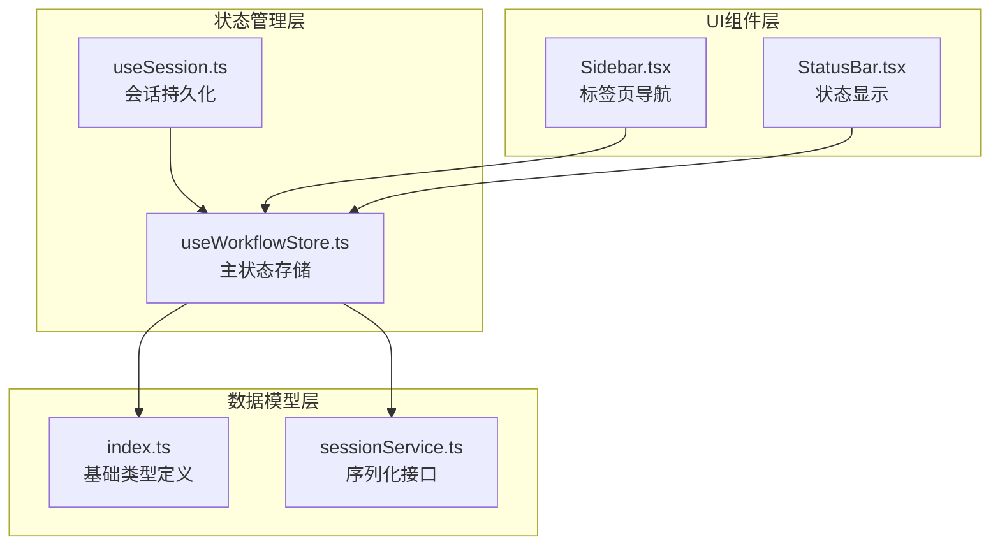
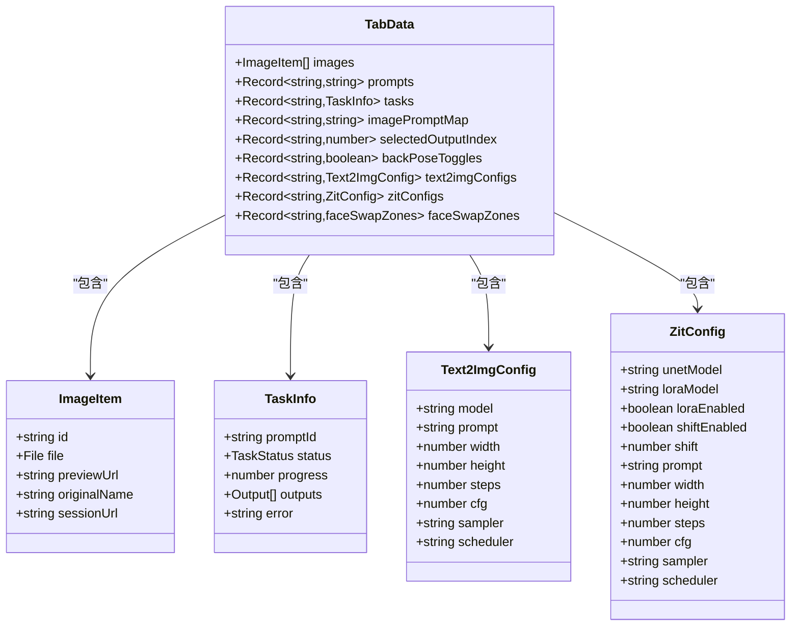
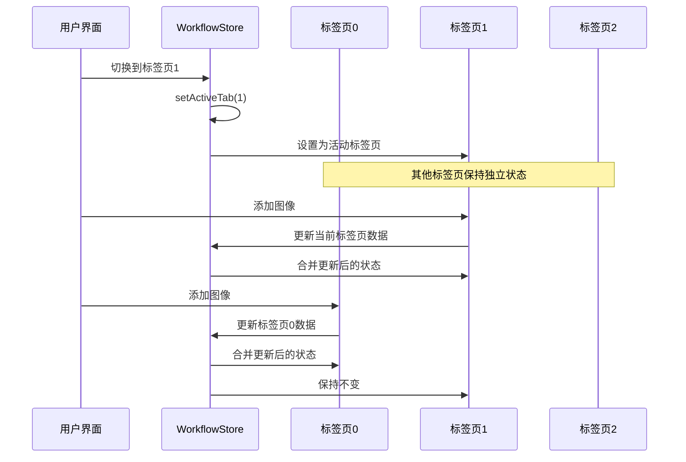
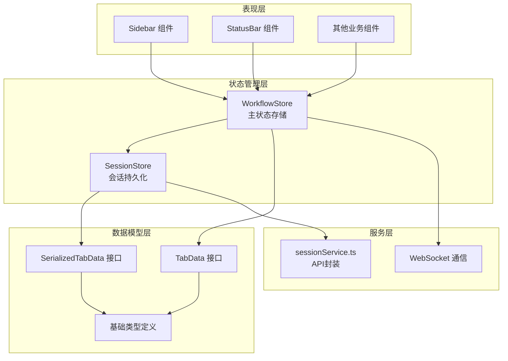
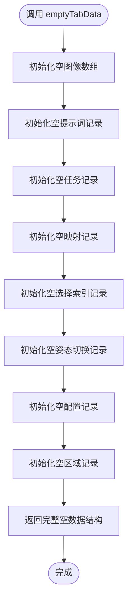
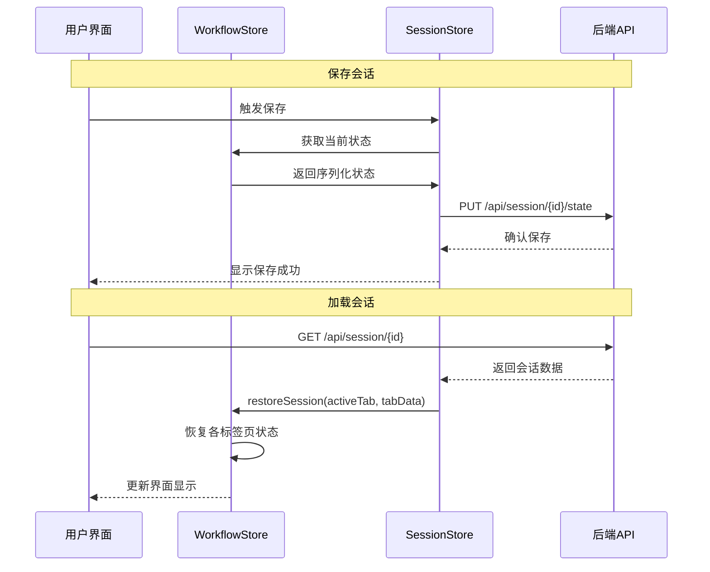
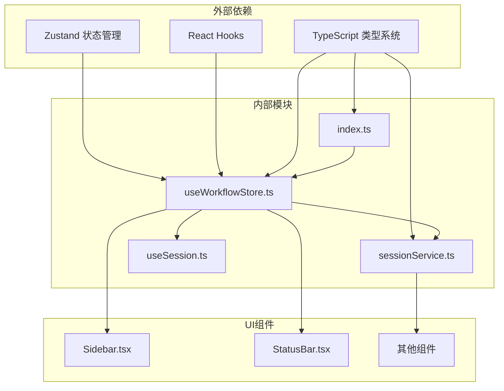

# 标签页数据管理

<cite>
**本文档引用的文件**
- [useWorkflowStore.ts](file://client/src/hooks/useWorkflowStore.ts)
- [sessionService.ts](file://client/src/services/sessionService.ts)
- [index.ts](file://client/src/types/index.ts)
- [Sidebar.tsx](file://client/src/components/Sidebar.tsx)
- [StatusBar.tsx](file://client/src/components/StatusBar.tsx)
- [useSession.ts](file://client/src/hooks/useSession.ts)
</cite>

## 目录
1. [简介](#简介)
2. [项目结构](#项目结构)
3. [核心组件](#核心组件)
4. [架构概览](#架构概览)
5. [详细组件分析](#详细组件分析)
6. [依赖关系分析](#依赖关系分析)
7. [性能考虑](#性能考虑)
8. [故障排除指南](#故障排除指南)
9. [结论](#结论)

## 简介

本文档深入解析了 CorineKit Pix2Real 项目中的标签页数据管理系统。该系统基于 Zustand 状态管理库构建，实现了多标签页状态隔离机制，支持 10 个不同的工作流程标签页（编号 0-9）。每个标签页都维护着独立的状态数据，包括图像数据、提示词、任务状态等，确保用户可以在不同工作流程间无缝切换而不会相互干扰。

系统的核心设计目标是：
- 实现标签页级别的状态隔离
- 支持跨标签页的数据迁移和共享
- 提供完整的会话持久化能力
- 优化性能以支持大量图像和任务数据

## 项目结构

标签页数据管理主要分布在以下文件中：



**图表来源**
- [useWorkflowStore.ts:1-645](file://client/src/hooks/useWorkflowStore.ts#L1-L645)
- [sessionService.ts:1-134](file://client/src/services/sessionService.ts#L1-L134)

**章节来源**
- [useWorkflowStore.ts:1-645](file://client/src/hooks/useWorkflowStore.ts#L1-L645)
- [sessionService.ts:1-134](file://client/src/services/sessionService.ts#L1-L134)

## 核心组件

### TabData 接口设计

TabData 是标签页数据管理的核心接口，定义了每个标签页的完整状态结构：



**图表来源**
- [useWorkflowStore.ts:19-29](file://client/src/hooks/useWorkflowStore.ts#L19-L29)
- [index.ts:1-58](file://client/src/types/index.ts#L1-L58)
- [sessionService.ts:4-28](file://client/src/services/sessionService.ts#L4-L28)

### 状态隔离机制

系统通过 `activeTab` 属性实现标签页状态隔离：



**图表来源**
- [useWorkflowStore.ts:92-94](file://client/src/hooks/useWorkflowStore.ts#L92-L94)
- [useWorkflowStore.ts:115](file://client/src/hooks/useWorkflowStore.ts#L115)

**章节来源**
- [useWorkflowStore.ts:19-29](file://client/src/hooks/useWorkflowStore.ts#L19-L29)
- [useWorkflowStore.ts:92-94](file://client/src/hooks/useWorkflowStore.ts#L92-L94)

## 架构概览

标签页数据管理采用分层架构设计：



**图表来源**
- [useWorkflowStore.ts:35-88](file://client/src/hooks/useWorkflowStore.ts#L35-L88)
- [sessionService.ts:50-67](file://client/src/services/sessionService.ts#L50-L67)

## 详细组件分析

### WorkflowStore 主状态管理

WorkflowStore 是整个标签页数据管理的核心，负责协调所有状态操作：

#### 核心属性说明

| 属性名 | 类型 | 描述 | 默认值 |
|--------|------|------|--------|
| `activeTab` | `number` | 当前激活的标签页索引 | `0` |
| `workflows` | `WorkflowInfo[]` | 工作流程配置数组 | 预定义的10个工作流程 |
| `tabData` | `Record<number, TabData>` | 所有标签页的数据映射 | `{0-9}: emptyTabData()` |
| `clientId` | `string \| null` | WebSocket 客户端ID | `null` |
| `sessionId` | `string \| null` | 会话ID | `null` |
| `selectedImageIds` | `string[]` | 当前选中的图像ID列表 | `[]` |

#### 关键方法功能

##### 图像管理方法
- `addImages(files: File[])`: 添加图像到当前标签页
- `addImagesToTab(tabId: number, files: File[])`: 添加图像到指定标签页
- `removeImage(id: string)`: 删除指定图像及其关联数据
- `removeImages(ids: string[])`: 批量删除图像

##### 提示词管理方法
- `setPrompt(imageId: string, prompt: string)`: 设置单个图像的提示词
- `setPrompts(updates: Record<string, string>)`: 批量设置提示词

##### 任务管理方法
- `startTask(imageId: string, promptId: string)`: 开始新任务
- `updateProgress(promptId: string, percentage: number)`: 更新任务进度
- `completeTask(promptId: string, outputs: Output[])`: 完成任务
- `failTask(promptId: string, error: string)`: 任务失败

**章节来源**
- [useWorkflowStore.ts:35-88](file://client/src/hooks/useWorkflowStore.ts#L35-L88)
- [useWorkflowStore.ts:222-252](file://client/src/hooks/useWorkflowStore.ts#L222-L252)
- [useWorkflowStore.ts:331-355](file://client/src/hooks/useWorkflowStore.ts#L331-L355)

### emptyTabData 初始化函数

emptyTabData 函数负责创建空的标签页数据结构，确保每个新标签页都有完整的数据结构：



**图表来源**
- [useWorkflowStore.ts:31-33](file://client/src/hooks/useWorkflowStore.ts#L31-L33)

该函数确保：
- 所有数组类型的属性都有初始空数组
- 所有对象类型的属性都有初始空对象
- 配置相关属性有默认空对象
- 数据结构完整且类型安全

**章节来源**
- [useWorkflowStore.ts:31-33](file://client/src/hooks/useWorkflowStore.ts#L31-L33)

### 会话持久化机制

系统实现了完整的会话持久化功能，支持状态的序列化和恢复：



**图表来源**
- [useSession.ts:136-162](file://client/src/hooks/useSession.ts#L136-L162)
- [useSession.ts:164-175](file://client/src/hooks/useSession.ts#L164-L175)
- [sessionService.ts:103-121](file://client/src/services/sessionService.ts#L103-L121)

**章节来源**
- [useSession.ts:136-175](file://client/src/hooks/useSession.ts#L136-L175)
- [sessionService.ts:103-121](file://client/src/services/sessionService.ts#L103-L121)

### 使用示例

#### 基本标签页操作

**切换标签页**
```typescript
// 在组件中切换到标签页3
const setActiveTab = useWorkflowStore(state => state.setActiveTab);
setActiveTab(3);

// 获取当前标签页数据
const currentTabData = useWorkflowStore(state => state.tabData[state.activeTab]);
```

**获取特定标签页数据**
```typescript
// 获取标签页0的数据
const tab0Data = useWorkflowStore(state => state.tabData[0]);

// 检查标签页是否为空
const isEmpty = !tab0Data.images.length && !Object.keys(tab0Data.prompts).length;
```

**操作标签页数据**
```typescript
// 添加图像到指定标签页
const addImagesToTab = useWorkflowStore(state => state.addImagesToTab);
addImagesToTab(2, files); // 添加到标签页2

// 设置提示词
const setPrompt = useWorkflowStore(state => state.setPrompt);
setPrompt(imageId, promptText);
```

#### 高级操作示例

**跨标签页数据迁移**
```typescript
// 将选中的图像从当前标签页复制到目标标签页
const handleDrop = useCallback(async (e: React.DragEvent, targetTab: number) => {
  // ... 拖拽处理逻辑
  const state = useWorkflowStore.getState();
  const idsToImport = state.selectedImageIds;
  
  // 复制图像到目标标签页
  addImagesToTab(targetTab, files);
}, [addImagesToTab]);
```

**批量操作**
```typescript
// 批量设置提示词
const setPrompts = useWorkflowStore(state => state.setPrompts);
setPrompts({
  'img_1': '正面照片',
  'img_2': '侧面照片',
  'img_3': '背面照片'
});
```

**章节来源**
- [Sidebar.tsx:124-209](file://client/src/components/Sidebar.tsx#L124-L209)
- [useWorkflowStore.ts:236-252](file://client/src/hooks/useWorkflowStore.ts#L236-L252)

## 依赖关系分析

标签页数据管理涉及多个层次的依赖关系：



**图表来源**
- [useWorkflowStore.ts:1-4](file://client/src/hooks/useWorkflowStore.ts#L1-L4)
- [sessionService.ts:1-3](file://client/src/services/sessionService.ts#L1-L3)

### 关键依赖关系

1. **Zustand 依赖**: 使用 Zustand 的 `create` 函数创建状态存储
2. **类型系统依赖**: 严格使用 TypeScript 接口确保类型安全
3. **组件依赖**: UI 组件通过 selector 函数订阅特定状态片段
4. **服务层依赖**: 会话持久化依赖 sessionService.ts 提供的 API 封装

**章节来源**
- [useWorkflowStore.ts:1-4](file://client/src/hooks/useWorkflowStore.ts#L1-L4)
- [sessionService.ts:1-3](file://client/src/services/sessionService.ts#L1-L3)

## 性能考虑

### 内存优化策略

1. **懒加载图像预览**: 使用 URL.createObjectURL 创建预览URL，在删除图像时及时释放
2. **选择性状态订阅**: UI 组件使用 selector 函数只订阅需要的状态片段
3. **状态合并优化**: 使用展开运算符进行状态合并，避免不必要的重渲染

### 并发处理优化

1. **任务进度广播**: 进度更新会在所有标签页间传播，但只更新匹配的任务
2. **异步操作管理**: 图像上传和会话保存使用异步操作，避免阻塞主线程
3. **防抖机制**: 会话保存使用 500ms 防抖，减少频繁保存操作

### 最佳实践建议

1. **状态结构设计**: 保持扁平化的状态结构，避免深层嵌套
2. **数据一致性**: 使用原子性的状态更新操作，确保数据一致性
3. **错误边界**: 实现适当的错误处理和回滚机制
4. **资源清理**: 及时清理临时资源，如预览URL和定时器

## 故障排除指南

### 常见问题及解决方案

**问题1: 标签页切换后状态丢失**
- 检查 `activeTab` 属性是否正确更新
- 确认 `tabData` 对象包含所有标签页的数据
- 验证 `emptyTabData` 函数是否正确初始化

**问题2: 图像无法删除**
- 检查 `removeImage` 方法中的 ID 匹配逻辑
- 确认图像预览URL是否正确释放
- 验证相关映射表（prompts、tasks、imagePromptMap）是否同步更新

**问题3: 会话保存失败**
- 检查 `putSessionState` API 调用是否成功
- 验证序列化过程是否正确
- 确认网络连接状态

**问题4: 任务状态不一致**
- 检查 `updateProgress` 和 `completeTask` 方法的广播逻辑
- 验证 `promptId` 映射关系
- 确认状态更新的原子性

**章节来源**
- [useWorkflowStore.ts:254-329](file://client/src/hooks/useWorkflowStore.ts#L254-L329)
- [useSession.ts:164-175](file://client/src/hooks/useSession.ts#L164-L175)

## 结论

标签页数据管理系统通过精心设计的架构实现了高效的状态隔离和管理。系统的主要优势包括：

1. **完整的状态隔离**: 每个标签页都有独立的数据空间，确保操作的原子性和一致性
2. **灵活的扩展性**: 支持 10 个不同工作流程，每个都有专门的配置和数据结构
3. **强大的持久化能力**: 完整的会话保存和恢复机制
4. **优秀的用户体验**: 流畅的标签页切换和跨标签页数据迁移

该系统为复杂的图像处理应用提供了坚实的技术基础，支持从简单的图像查看到复杂的工作流处理等各种场景。通过遵循本文档中的最佳实践和性能优化建议，可以进一步提升系统的稳定性和用户体验。