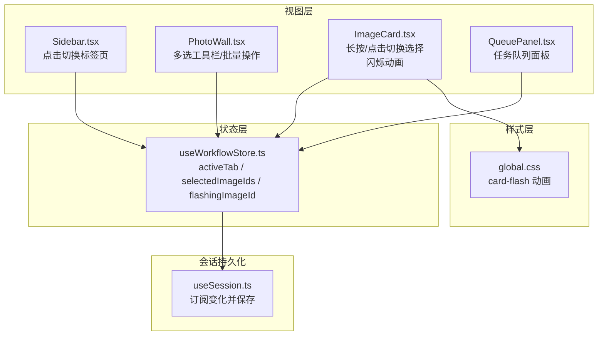
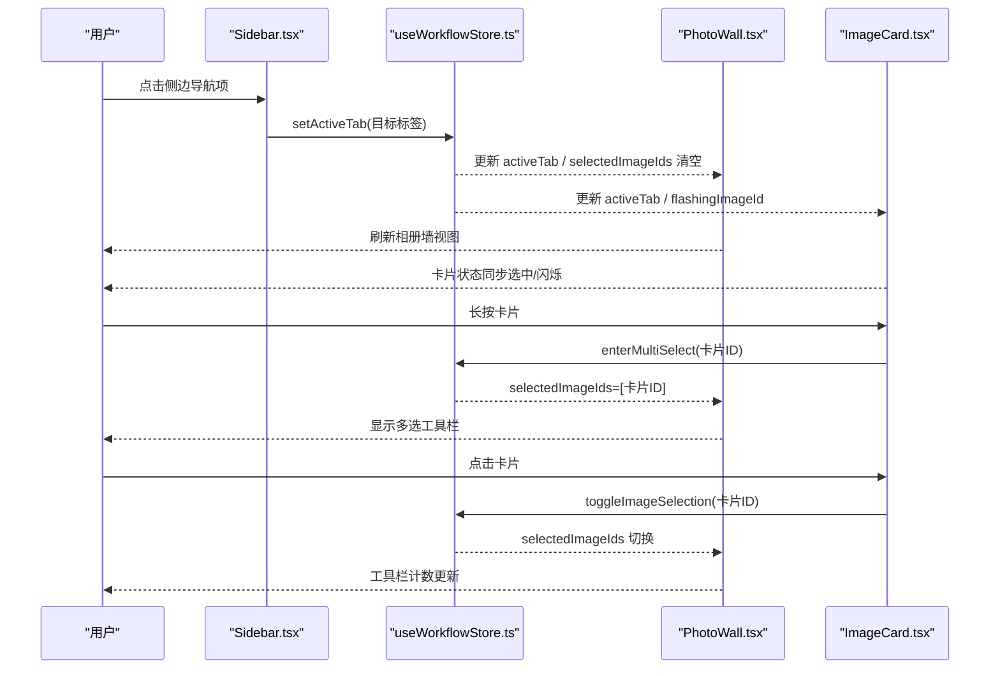
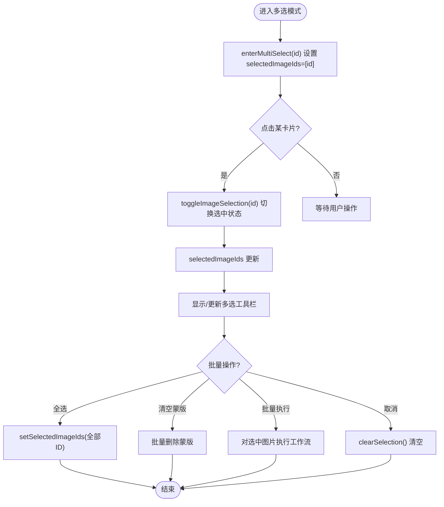
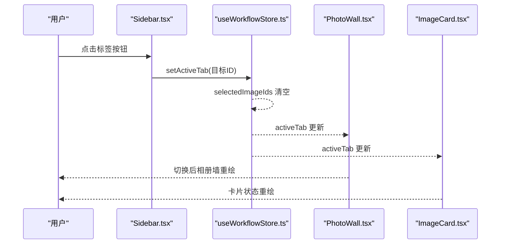
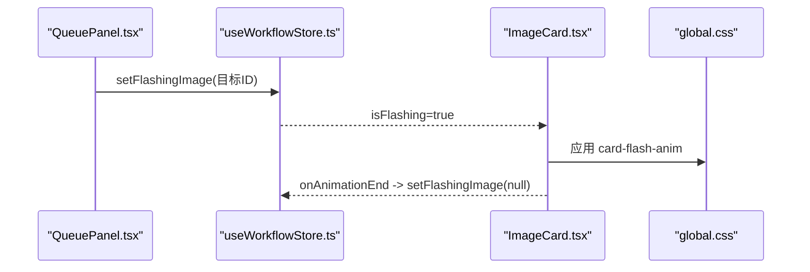
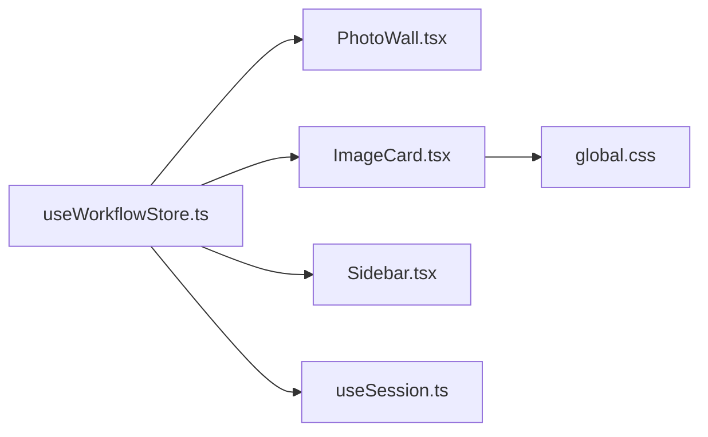

# 选择与导航

<cite>
**本文档引用的文件**
- [useWorkflowStore.ts](file://client/src/hooks/useWorkflowStore.ts)
- [PhotoWall.tsx](file://client/src/components/PhotoWall.tsx)
- [ImageCard.tsx](file://client/src/components/ImageCard.tsx)
- [Sidebar.tsx](file://client/src/components/Sidebar.tsx)
- [global.css](file://client/src/styles/global.css)
- [useSession.ts](file://client/src/hooks/useSession.ts)
- [QueuePanel.tsx](file://client/src/components/QueuePanel.tsx)
</cite>

## 目录
1. [简介](#简介)
2. [项目结构](#项目结构)
3. [核心组件](#核心组件)
4. [架构总览](#架构总览)
5. [详细组件分析](#详细组件分析)
6. [依赖关系分析](#依赖关系分析)
7. [性能考量](#性能考量)
8. [故障排除指南](#故障排除指南)
9. [结论](#结论)
10. [附录](#附录)

## 简介
本文件聚焦于“选择与导航”功能，涵盖以下主题：
- 多选模式的实现机制：selectedImageIds 数组管理、enterMultiSelect、toggleImageSelection、clearSelection 的工作原理
- 标签页切换功能：setActiveTab 如何实现标签页切换与状态重置
- 闪烁效果功能：setFlashingImage 的使用场景与实现机制
- 使用示例：如何启用多选模式、切换标签页、实现图片闪烁效果
- 选择状态的持久化与清理机制
- 用户体验优化建议与交互设计最佳实践

## 项目结构
围绕“选择与导航”的关键文件组织如下：
- 状态管理：useWorkflowStore.ts（Zustand store，集中管理 activeTab、selectedImageIds、flashingImageId 等）
- 视图层：
  - PhotoWall.tsx：相册墙容器，负责多选工具栏、批量操作、标签页内容渲染
  - ImageCard.tsx：单张图片卡片，支持长按进入多选、点击切换选择、闪烁动画
  - Sidebar.tsx：侧边导航，点击切换 activeTab，并在拖拽时高亮目标标签
  - QueuePanel.tsx：任务队列面板，接收 setFlashingImage 调用以高亮对应任务
- 样式层：global.css 定义卡牌闪烁动画与高亮样式
- 会话持久化：useSession.ts 订阅 store 变化并进行序列化保存

**图表来源**
- [useWorkflowStore.ts:96-164](file://client/src/hooks/useWorkflowStore.ts#L96-L164)
- [Sidebar.tsx:272-299](file://client/src/components/Sidebar.tsx#L272-L299)
- [PhotoWall.tsx:103-125](file://client/src/components/PhotoWall.tsx#L103-L125)
- [ImageCard.tsx:420-451](file://client/src/components/ImageCard.tsx#L420-L451)
- [QueuePanel.tsx:130-133](file://client/src/components/QueuePanel.tsx#L130-L133)
- [global.css:102-109](file://client/src/styles/global.css#L102-L109)
- [useSession.ts:184-233](file://client/src/hooks/useSession.ts#L184-L233)

**章节来源**
- [useWorkflowStore.ts:96-164](file://client/src/hooks/useWorkflowStore.ts#L96-L164)
- [PhotoWall.tsx:103-125](file://client/src/components/PhotoWall.tsx#L103-L125)
- [ImageCard.tsx:420-451](file://client/src/components/ImageCard.tsx#L420-L451)
- [Sidebar.tsx:272-299](file://client/src/components/Sidebar.tsx#L272-L299)
- [global.css:102-109](file://client/src/styles/global.css#L102-L109)
- [useSession.ts:184-233](file://client/src/hooks/useSession.ts#L184-L233)

## 核心组件
- 选择与多选控制
  - selectedImageIds：当前选中的图片 ID 列表
  - enterMultiSelect(id)：长按某卡片进入多选模式并仅选中该卡片
  - toggleImageSelection(id)：切换某卡片的选中状态
  - setSelectedImageIds(ids)：直接设置选中列表
  - clearSelection()：清空选中列表
- 标签页切换
  - setActiveTab(tab)：切换活动标签页，并将 selectedImageIds 清空
- 闪烁效果
  - flashingImageId：当前需要闪烁的图片 ID
  - setFlashingImage(id)：设置或清除闪烁目标；ImageCard 在动画结束后自动清除

**章节来源**
- [useWorkflowStore.ts:115-129](file://client/src/hooks/useWorkflowStore.ts#L115-L129)
- [useWorkflowStore.ts:163-164](file://client/src/hooks/useWorkflowStore.ts#L163-L164)
- [PhotoWall.tsx:139-142](file://client/src/components/PhotoWall.tsx#L139-L142)
- [PhotoWall.tsx:496-503](file://client/src/components/PhotoWall.tsx#L496-L503)
- [ImageCard.tsx:430-431](file://client/src/components/ImageCard.tsx#L430-L431)

## 架构总览
“选择与导航”功能由状态层、视图层与样式层协同完成：
- 状态层：Zustand store 统一维护 activeTab、selectedImageIds、flashingImageId
- 视图层：Sidebar 负责标签页切换；PhotoWall 负责多选工具栏与批量操作；ImageCard 负责单卡选择与闪烁
- 样式层：全局 CSS 定义卡牌闪烁动画类，配合 store 状态驱动

**图表来源**
- [Sidebar.tsx:285](file://client/src/components/Sidebar.tsx#L285)
- [useWorkflowStore.ts:115](file://client/src/hooks/useWorkflowStore.ts#L115)
- [PhotoWall.tsx:114-119](file://client/src/components/PhotoWall.tsx#L114-L119)
- [ImageCard.tsx:176-181](file://client/src/components/ImageCard.tsx#L176-L181)
- [ImageCard.tsx:208-215](file://client/src/components/ImageCard.tsx#L208-L215)

## 详细组件分析

### 多选模式实现机制
- selectedImageIds 数组管理
  - enterMultiSelect(id)：将当前选中集合设为仅包含该 id，进入多选模式
  - toggleImageSelection(id)：若已选中则移除，否则追加
  - setSelectedImageIds(ids)：批量设置选中集合
  - clearSelection()：清空选中集合
- 多选工具栏与批量操作
  - PhotoWall 根据 selectedImageIds.length 决定是否显示工具栏
  - 支持全选/反选、批量替换提示词、批量删除蒙版、批量执行等
- 与标签页切换的关系
  - setActiveTab(tab) 会同时清空 selectedImageIds，避免跨标签的误选

**图表来源**
- [useWorkflowStore.ts:117-129](file://client/src/hooks/useWorkflowStore.ts#L117-L129)
- [PhotoWall.tsx:165-171](file://client/src/components/PhotoWall.tsx#L165-L171)
- [PhotoWall.tsx:242-266](file://client/src/components/PhotoWall.tsx#L242-L266)
- [PhotoWall.tsx:496-503](file://client/src/components/PhotoWall.tsx#L496-L503)

**章节来源**
- [useWorkflowStore.ts:115-129](file://client/src/hooks/useWorkflowStore.ts#L115-L129)
- [PhotoWall.tsx:139-142](file://client/src/components/PhotoWall.tsx#L139-L142)
- [PhotoWall.tsx:165-171](file://client/src/components/PhotoWall.tsx#L165-L171)
- [PhotoWall.tsx:242-266](file://client/src/components/PhotoWall.tsx#L242-L266)
- [PhotoWall.tsx:496-503](file://client/src/components/PhotoWall.tsx#L496-L503)

### 标签页切换功能
- setActiveTab(tab) 的行为
  - 切换 activeTab
  - 同步清空 selectedImageIds，确保切换后无残留选中
- 视图联动
  - Sidebar.tsx 中点击按钮触发 setActiveTab
  - PhotoWall.tsx 与 ImageCard.tsx 订阅 activeTab，刷新渲染
- 拖拽与高亮
  - Sidebar.tsx 在拖拽卡片到目标标签时高亮指示器，提升可见性

**图表来源**
- [Sidebar.tsx:285](file://client/src/components/Sidebar.tsx#L285)
- [useWorkflowStore.ts:115](file://client/src/hooks/useWorkflowStore.ts#L115)
- [PhotoWall.tsx:104-105](file://client/src/components/PhotoWall.tsx#L104-L105)
- [ImageCard.tsx:59-66](file://client/src/components/ImageCard.tsx#L59-L66)

**章节来源**
- [useWorkflowStore.ts:115](file://client/src/hooks/useWorkflowStore.ts#L115)
- [Sidebar.tsx:272-299](file://client/src/components/Sidebar.tsx#L272-L299)
- [PhotoWall.tsx:104-105](file://client/src/components/PhotoWall.tsx#L104-L105)
- [ImageCard.tsx:59-66](file://client/src/components/ImageCard.tsx#L59-L66)

### 闪烁效果功能
- 实现机制
  - setFlashingImage(id) 设置当前闪烁目标
  - ImageCard 根据 isFlashing={flashingImageId === id} 应用 card-flash-anim 类
  - 动画结束后通过 onAnimationEnd 自动清除 flashingImageId
- 样式定义
  - global.css 中定义 card-flash 与 card-flash-anim，实现“闪亮-消失”的循环效果
- 使用场景
  - QueuePanel.tsx：当任务状态变化时，调用 setFlashingImage 高亮对应任务行
  - 用户可通过点击卡片长按进入多选，随后在批量执行等操作中通过闪烁引导关注目标

**图表来源**
- [QueuePanel.tsx:130-133](file://client/src/components/QueuePanel.tsx#L130-L133)
- [useWorkflowStore.ts:163-164](file://client/src/hooks/useWorkflowStore.ts#L163-L164)
- [ImageCard.tsx:430-431](file://client/src/components/ImageCard.tsx#L430-L431)
- [global.css:102-109](file://client/src/styles/global.css#L102-L109)

**章节来源**
- [useWorkflowStore.ts:163-164](file://client/src/hooks/useWorkflowStore.ts#L163-L164)
- [ImageCard.tsx:430-431](file://client/src/components/ImageCard.tsx#L430-L431)
- [global.css:102-109](file://client/src/styles/global.css#L102-L109)
- [QueuePanel.tsx:130-133](file://client/src/components/QueuePanel.tsx#L130-L133)

### 使用示例
- 启用多选模式
  - 长按任意图片卡片，触发 enterMultiSelect，selectedImageIds 将仅包含该卡片
  - 点击其他卡片可继续切换选中状态
- 切换标签页
  - 点击侧边栏对应标签按钮，setActiveTab 切换活动标签并清空选中
- 实现图片闪烁效果
  - 调用 setFlashingImage(目标图片ID)，卡片将出现闪烁动画
  - 动画结束后自动清除闪烁状态

**章节来源**
- [ImageCard.tsx:176-181](file://client/src/components/ImageCard.tsx#L176-L181)
- [PhotoWall.tsx:496-503](file://client/src/components/PhotoWall.tsx#L496-L503)
- [Sidebar.tsx:285](file://client/src/components/Sidebar.tsx#L285)
- [useWorkflowStore.ts:117-129](file://client/src/hooks/useWorkflowStore.ts#L117-L129)
- [useWorkflowStore.ts:163-164](file://client/src/hooks/useWorkflowStore.ts#L163-L164)

### 选择状态的持久化与清理机制
- 会话持久化
  - useSession.ts 订阅 store 变化，对 tabData、提示词、任务等进行序列化保存
  - selectedImageIds 不直接持久化，而是通过切换标签页时清空的方式避免跨会话误用
- 清理策略
  - setActiveTab(tab)：切换标签页时清空选中集合
  - clearSelection()：手动清空选中集合
  - 新建会话：useSession.newSession() 会重置 store 与 mask 状态

**章节来源**
- [useSession.ts:184-233](file://client/src/hooks/useSession.ts#L184-L233)
- [useSession.ts:268-288](file://client/src/hooks/useSession.ts#L268-L288)
- [useWorkflowStore.ts:115](file://client/src/hooks/useWorkflowStore.ts#L115)
- [useWorkflowStore.ts:129](file://client/src/hooks/useWorkflowStore.ts#L129)

## 依赖关系分析
- 组件耦合
  - PhotoWall 依赖 useWorkflowStore 的 selectedImageIds、activeTab、flashingImageId
  - ImageCard 依赖 useWorkflowStore 的 selectedImageIds、activeTab、flashingImageId
  - Sidebar 依赖 useWorkflowStore 的 activeTab、setActiveTab
- 外部依赖
  - 全局 CSS 提供动画类名，用于闪烁效果
  - 会话持久化通过 useSession.ts 与后端 API 交互

**图表来源**
- [useWorkflowStore.ts:96-164](file://client/src/hooks/useWorkflowStore.ts#L96-L164)
- [PhotoWall.tsx:103-125](file://client/src/components/PhotoWall.tsx#L103-L125)
- [ImageCard.tsx:420-451](file://client/src/components/ImageCard.tsx#L420-L451)
- [Sidebar.tsx:272-299](file://client/src/components/Sidebar.tsx#L272-L299)
- [global.css:102-109](file://client/src/styles/global.css#L102-L109)
- [useSession.ts:184-233](file://client/src/hooks/useSession.ts#L184-L233)

**章节来源**
- [useWorkflowStore.ts:96-164](file://client/src/hooks/useWorkflowStore.ts#L96-L164)
- [PhotoWall.tsx:103-125](file://client/src/components/PhotoWall.tsx#L103-L125)
- [ImageCard.tsx:420-451](file://client/src/components/ImageCard.tsx#L420-L451)
- [Sidebar.tsx:272-299](file://client/src/components/Sidebar.tsx#L272-L299)
- [global.css:102-109](file://client/src/styles/global.css#L102-L109)
- [useSession.ts:184-233](file://client/src/hooks/useSession.ts#L184-L233)

## 性能考量
- 多选渲染优化
  - PhotoWall 使用 LazyCard 与 IntersectionObserver 进行懒加载，减少首屏压力
  - ImageCard 通过 memo 与 arePropsEqual 降低不必要的重渲染
- 动画性能
  - 闪烁动画使用 outline 与 GPU 加速动画属性，避免昂贵的 box-shadow 动画
- 状态更新
  - Zustand 的局部状态订阅减少无关组件的重渲染

**章节来源**
- [PhotoWall.tsx:18-97](file://client/src/components/PhotoWall.tsx#L18-L97)
- [ImageCard.tsx:28-40](file://client/src/components/ImageCard.tsx#L28-L40)
- [global.css:102-109](file://client/src/styles/global.css#L102-L109)

## 故障排除指南
- 问题：切换标签页后仍显示多选工具栏
  - 检查 setActiveTab 是否被正确调用，以及 selectedImageIds 是否被清空
  - 参考路径：[useWorkflowStore.ts:115](file://client/src/hooks/useWorkflowStore.ts#L115)
- 问题：闪烁效果不生效
  - 确认 setFlashingImage 被调用且传入正确的图片 ID
  - 确认 CSS 类 card-flash-anim 生效
  - 参考路径：[useWorkflowStore.ts:163-164](file://client/src/hooks/useWorkflowStore.ts#L163-L164)，[global.css:102-109](file://client/src/styles/global.css#L102-L109)
- 问题：批量操作未对选中图片生效
  - 检查 selectedImageIds 是否包含目标图片 ID
  - 确认 hasIdleSelected 条件满足（非 Tab 7 且任务状态为 idle）
  - 参考路径：[PhotoWall.tsx:173-179](file://client/src/components/PhotoWall.tsx#L173-L179)，[PhotoWall.tsx:181-240](file://client/src/components/PhotoWall.tsx#L181-L240)

**章节来源**
- [useWorkflowStore.ts:115](file://client/src/hooks/useWorkflowStore.ts#L115)
- [useWorkflowStore.ts:163-164](file://client/src/hooks/useWorkflowStore.ts#L163-L164)
- [global.css:102-109](file://client/src/styles/global.css#L102-L109)
- [PhotoWall.tsx:173-179](file://client/src/components/PhotoWall.tsx#L173-L179)
- [PhotoWall.tsx:181-240](file://client/src/components/PhotoWall.tsx#L181-L240)

## 结论
“选择与导航”功能通过 Zustand 状态管理与 React 组件协作实现：
- 多选模式以 selectedImageIds 为核心，结合 enterMultiSelect、toggleImageSelection、clearSelection 提供灵活的批量操作入口
- 标签页切换通过 setActiveTab 实现，同时清理选中状态，保证上下文一致性
- 闪烁效果通过 setFlashingImage 与 CSS 动画实现，兼顾性能与视觉反馈
- 会话持久化确保用户状态在重启后得以恢复，同时避免跨会话误用

## 附录
- 交互设计最佳实践
  - 多选工具栏应始终与选中数量同步显示，提供明确的批量操作入口
  - 标签切换时应即时清空选中，避免用户困惑
  - 闪烁效果仅用于关键状态变更，避免过度使用导致干扰
- 用户体验优化建议
  - 在 PhotoWall 中增加“全选/反选”三态复选框，提升批量操作效率
  - 为长按多选提供视觉反馈（如卡片轻微高亮），增强可用性
  - 对于批量操作，提供预览与确认对话框，降低误操作风险