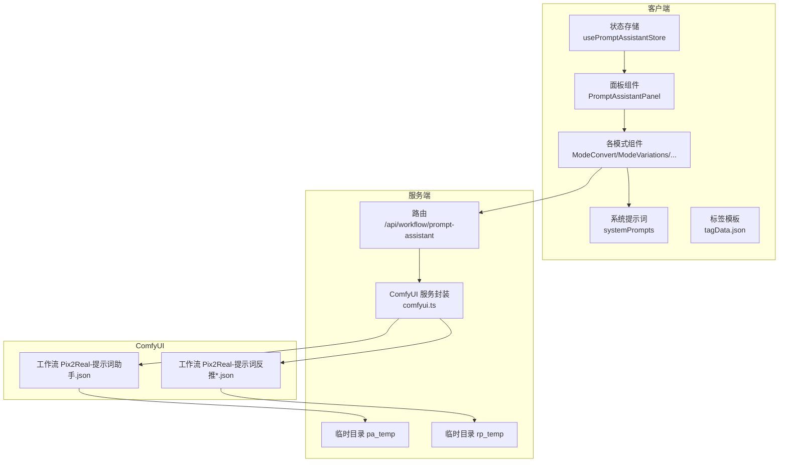
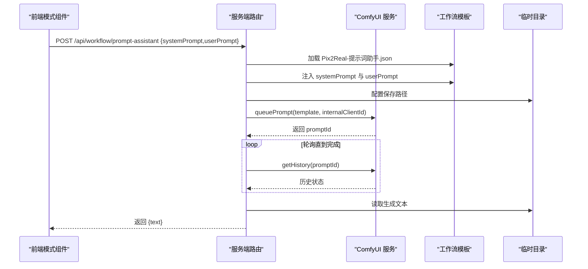
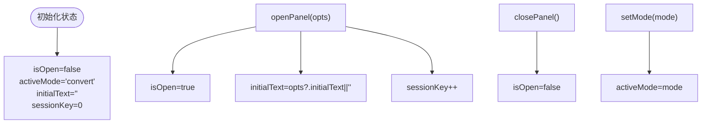
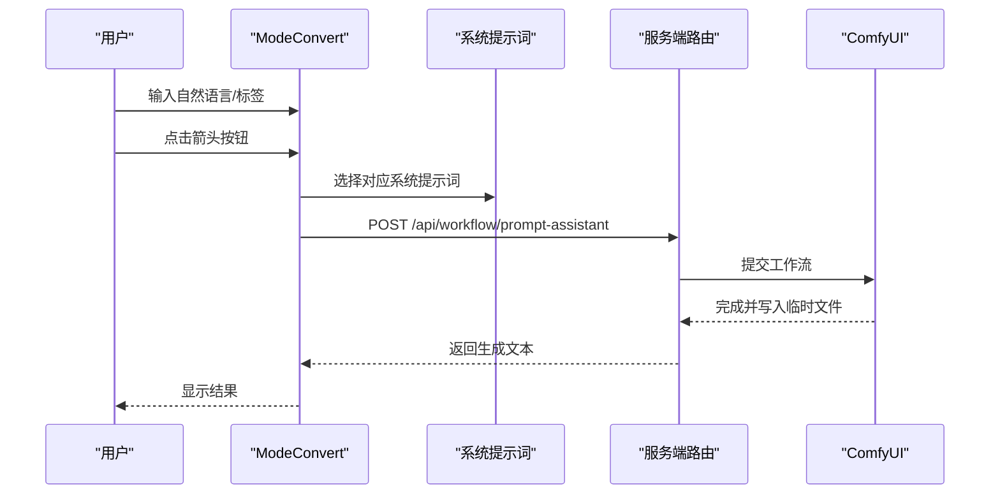
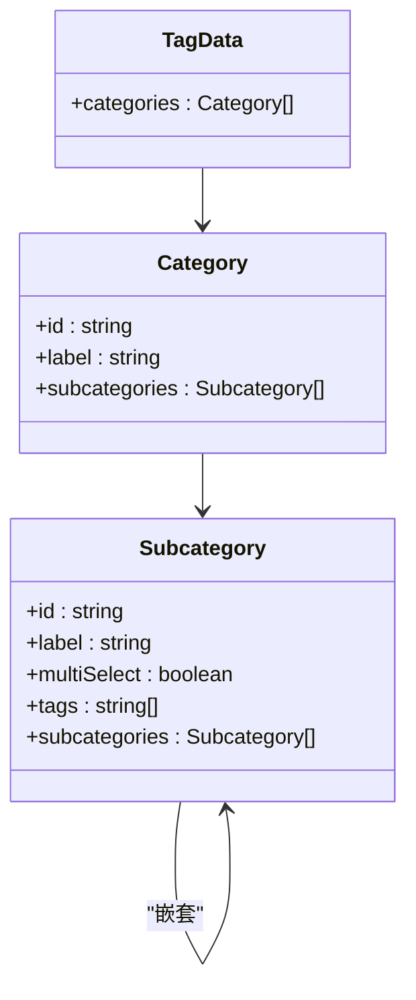
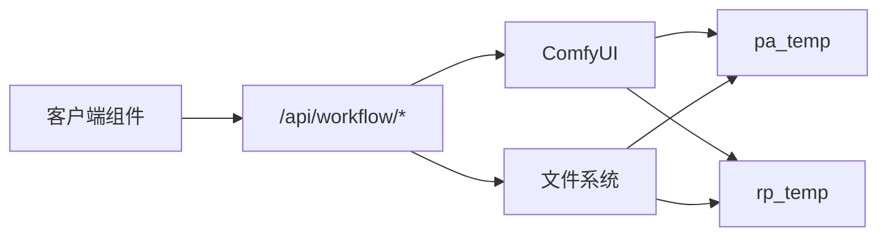

# 提示词助手状态管理

<cite>
**本文档引用的文件**
- [usePromptAssistantStore.ts](file://client/src/hooks/usePromptAssistantStore.ts)
- [PromptAssistantPanel.tsx](file://client/src/components/PromptAssistantPanel.tsx)
- [systemPrompts.ts](file://client/src/components/prompt-assistant/systemPrompts.ts)
- [ModeConvert.tsx](file://client/src/components/prompt-assistant/ModeConvert.tsx)
- [ModeVariations.tsx](file://client/src/components/prompt-assistant/ModeVariations.tsx)
- [ModeDetailer.tsx](file://client/src/components/prompt-assistant/ModeDetailer.tsx)
- [ModeNextScene.tsx](file://client/src/components/prompt-assistant/ModeNextScene.tsx)
- [ModeStoryboarder.tsx](file://client/src/components/prompt-assistant/ModeStoryboarder.tsx)
- [ModeTagAssemble.tsx](file://client/src/components/prompt-assistant/ModeTagAssemble.tsx)
- [tagData.json](file://client/src/data/tagData.json)
- [workflow.ts](file://server/src/routes/workflow.ts)
- [comfyui.ts](file://server/src/services/comfyui.ts)
- [SystemPrompt.txt](file://docs/提示词助理开发需求/SystemPrompt.txt)
</cite>

## 目录
1. [简介](#简介)
2. [项目结构](#项目结构)
3. [核心组件](#核心组件)
4. [架构总览](#架构总览)
5. [详细组件分析](#详细组件分析)
6. [依赖关系分析](#依赖关系分析)
7. [性能考虑](#性能考虑)
8. [故障排除指南](#故障排除指南)
9. [结论](#结论)
10. [附录](#附录)

## 简介
本文件系统性阐述提示词助手的状态管理与实现，覆盖以下方面：
- 状态设计与数据结构：面板开关、活动模式、初始文本、会话键等
- 模板与系统提示词：内置系统提示词集合与来源
- 功能模块：标签转换、变体生成、按需扩写、后续镜头、分镜生成、标签合成器
- 生成与反推流程：AI 交互状态、临时文件缓存策略、错误处理
- 使用示例：在不同工作流中的应用方式
- 高级功能：标签模板的导入导出与个性化定制

## 项目结构
提示词助手位于客户端前端与服务端后端协作的体系中：
- 客户端负责状态管理、UI 展示与用户交互
- 服务端通过 ComfyUI 工作流执行提示词生成与反推任务
- 临时目录用于保存中间结果文本，避免直接读取图像输出

**图表来源**
- [usePromptAssistantStore.ts:1-33](file://client/src/hooks/usePromptAssistantStore.ts#L1-L33)
- [PromptAssistantPanel.tsx:1-139](file://client/src/components/PromptAssistantPanel.tsx#L1-L139)
- [systemPrompts.ts:1-145](file://client/src/components/prompt-assistant/systemPrompts.ts#L1-L145)
- [workflow.ts:746-800](file://server/src/routes/workflow.ts#L746-L800)
- [comfyui.ts:1-285](file://server/src/services/comfyui.ts#L1-L285)

**章节来源**
- [usePromptAssistantStore.ts:1-33](file://client/src/hooks/usePromptAssistantStore.ts#L1-L33)
- [PromptAssistantPanel.tsx:1-139](file://client/src/components/PromptAssistantPanel.tsx#L1-L139)
- [workflow.ts:746-800](file://server/src/routes/workflow.ts#L746-L800)

## 核心组件
- 状态存储（Zustand）
  - 字段：isOpen、activeMode、initialText、sessionKey
  - 方法：openPanel(opts)、closePanel()、setMode(mode)
  - sessionKey 用于驱动模式内输入框的重置与刷新
- 面板容器
  - 渲染六个标签页模式，根据 activeMode 切换显示
  - 关闭按钮与模式切换逻辑
- 系统提示词
  - 内置六种模式的系统提示词集合，来源于文档与源码
- 各模式组件
  - ModeConvert：自然语言↔标签双向转换
  - ModeVariations：基于用户标记的变体生成
  - ModeDetailer：对指定区域进行按点数扩展
  - ModeNextScene：基于当前镜头生成下一镜头
  - ModeStoryboarder：根据故事大纲生成分镜
  - ModeTagAssemble：标签模板的可视化组装与导入导出

**章节来源**
- [usePromptAssistantStore.ts:5-32](file://client/src/hooks/usePromptAssistantStore.ts#L5-L32)
- [PromptAssistantPanel.tsx:10-17](file://client/src/components/PromptAssistantPanel.tsx#L10-L17)
- [systemPrompts.ts:4-144](file://client/src/components/prompt-assistant/systemPrompts.ts#L4-L144)
- [ModeTagAssemble.tsx:61-95](file://client/src/components/prompt-assistant/ModeTagAssemble.tsx#L61-L95)

## 架构总览
提示词助手的请求链路如下：
- 客户端调用 /api/workflow/prompt-assistant，携带 systemPrompt 与 userPrompt
- 服务端加载 Pix2Real-提示词助手.json 模板，注入系统提示词与用户提示词
- 服务端为该任务生成内部 clientId 并提交到 ComfyUI 队列
- 服务端轮询历史记录，等待任务完成
- 服务端从 pa_temp 读取生成的文本文件并返回给客户端

**图表来源**
- [workflow.ts:746-800](file://server/src/routes/workflow.ts#L746-L800)
- [comfyui.ts:47-71](file://server/src/services/comfyui.ts#L47-L71)

## 详细组件分析

### 状态存储与面板控制
- 状态字段
  - isOpen：面板是否可见
  - activeMode：当前激活的模式标识
  - initialText：传入的初始提示词
  - sessionKey：会话键，用于强制刷新模式内的输入框
- 行为
  - openPanel：打开面板并重置 sessionKey
  - closePanel：关闭面板
  - setMode：切换活动模式
- 与面板的联动
  - PromptAssistantPanel 根据 isOpen 控制显示
  - 根据 activeMode 渲染对应模式组件

**图表来源**
- [usePromptAssistantStore.ts:15-32](file://client/src/hooks/usePromptAssistantStore.ts#L15-L32)

**章节来源**
- [usePromptAssistantStore.ts:5-32](file://client/src/hooks/usePromptAssistantStore.ts#L5-L32)
- [PromptAssistantPanel.tsx:19-138](file://client/src/components/PromptAssistantPanel.tsx#L19-L138)

### 系统提示词与数据结构
- 数据来源
  - client/src/components/prompt-assistant/systemPrompts.ts：六种模式的系统提示词
  - docs/提示词助理开发需求/SystemPrompt.txt：完整规范与规则
- 结构要点
  - 角色定位、核心规则、工作流程三段式
  - 输出格式约束（如仅英文标签、中文段落、编号列表等）

**章节来源**
- [systemPrompts.ts:4-144](file://client/src/components/prompt-assistant/systemPrompts.ts#L4-L144)
- [SystemPrompt.txt:1-153](file://docs/提示词助理开发需求/SystemPrompt.txt#L1-L153)

### 标签转换（ModeConvert）
- 双向转换
  - 自然语言 → 标签：严格英文、无填充词、按重要性排序
  - 标签 → 自然语言：视觉字面化、空间结构组织
- 状态与交互
  - 左右两侧输入框，中心箭头按钮触发转换
  - 复制按钮与加载态
- 错误处理
  - 请求失败弹出错误提示

**图表来源**
- [ModeConvert.tsx:5-14](file://client/src/components/prompt-assistant/ModeConvert.tsx#L5-L14)
- [systemPrompts.ts:6-49](file://client/src/components/prompt-assistant/systemPrompts.ts#L6-L49)
- [workflow.ts:746-800](file://server/src/routes/workflow.ts#L746-L800)

**章节来源**
- [ModeConvert.tsx:32-194](file://client/src/components/prompt-assistant/ModeConvert.tsx#L32-L194)

### 变体生成（ModeVariations）
- 规则
  - 用户以 # 标记目标元素，@ 数值表示变化程度，括号内为偏好
  - 生成五条变体，保持原结构并聚焦用户标记区域
- 状态与交互
  - 输入原始提示词，点击“创建变体”后解析编号列表并展示

**章节来源**
- [ModeVariations.tsx:32-151](file://client/src/components/prompt-assistant/ModeVariations.tsx#L32-L151)
- [systemPrompts.ts:51-73](file://client/src/components/prompt-assistant/systemPrompts.ts#L51-L73)

### 按需扩写（ModeDetailer）
- 规则
  - 仅对 [ ] 或 【 】 区域进行扩写，按点数决定详细度
  - 扩写后无缝融合，不重复外部内容
- 状态与交互
  - 输入原始提示词，点击“扩写”后显示结果并支持复制

**章节来源**
- [ModeDetailer.tsx:32-142](file://client/src/components/prompt-assistant/ModeDetailer.tsx#L32-L142)
- [systemPrompts.ts:75-92](file://client/src/components/prompt-assistant/systemPrompts.ts#L75-L92)

### 后续镜头（ModeNextScene）
- 规则
  - 基于当前镜头设计下一镜头，保持角色外观与环境一致性
  - 推动情节连续性，输出简洁的视觉描述
- 状态与交互
  - 输入当前镜头，点击“脑补后续”生成下一镜头

**章节来源**
- [ModeNextScene.tsx:32-142](file://client/src/components/prompt-assistant/ModeNextScene.tsx#L32-L142)
- [systemPrompts.ts:94-111](file://client/src/components/prompt-assistant/systemPrompts.ts#L94-L111)

### 分镜生成（ModeStoryboarder）
- 规则
  - 根据故事大纲生成若干镜头，保持角色与环境一致性
  - 输出编号镜头列表，长度与输入大致匹配
- 状态与交互
  - 输入故事大纲，点击“生成分镜”解析编号列表并展示

**章节来源**
- [ModeStoryboarder.tsx:32-171](file://client/src/components/prompt-assistant/ModeStoryboarder.tsx#L32-L171)
- [systemPrompts.ts:113-143](file://client/src/components/prompt-assistant/systemPrompts.ts#L113-L143)

### 标签合成器（ModeTagAssemble）
- 数据模型
  - 分类（Category）→ 子分类（Subcategory）→ 标签（Tag）
  - 支持多选与单选两种模式
- 状态与持久化
  - 本地存储 selectedCat、selectedTags、tagData
  - 计算结果字符串，实时更新
- 导入导出
  - 导出：下载 tagData.json
  - 导入：读取 JSON 并更新本地存储

**图表来源**
- [ModeTagAssemble.tsx:5-21](file://client/src/components/prompt-assistant/ModeTagAssemble.tsx#L5-L21)
- [tagData.json:1-95](file://client/src/data/tagData.json#L1-L95)

**章节来源**
- [ModeTagAssemble.tsx:60-391](file://client/src/components/prompt-assistant/ModeTagAssemble.tsx#L60-L391)
- [tagData.json:1-95](file://client/src/data/tagData.json#L1-L95)

## 依赖关系分析
- 客户端依赖
  - Zustand 管理全局状态
  - Lucide 图标库提供 UI 元素
  - fetch 发起 API 请求
- 服务端依赖
  - Express 路由
  - node-fetch 与 WebSocket 连接 ComfyUI
  - 临时目录 pa_temp、rp_temp 存储中间结果
- 文件依赖
  - Pix2Real-提示词助手.json：提示词生成工作流
  - Pix2Real-提示词反推*.json：反推工作流（Qwen/Florence/WD-14）

**图表来源**
- [workflow.ts:12-21](file://server/src/routes/workflow.ts#L12-L21)
- [workflow.ts:746-800](file://server/src/routes/workflow.ts#L746-L800)
- [comfyui.ts:1-285](file://server/src/services/comfyui.ts#L1-L285)

**章节来源**
- [workflow.ts:12-21](file://server/src/routes/workflow.ts#L12-L21)
- [comfyui.ts:1-285](file://server/src/services/comfyui.ts#L1-L285)

## 性能考虑
- 轮询策略
  - 服务端对每个任务进行轮询，最长等待时间约 180 秒
  - 建议在 UI 层提供取消与重试机制
- 临时文件管理
  - pa_temp/rp_temp 目录定期清理，避免磁盘占用增长
- 并发与队列
  - 通过队列优先级接口可调整执行顺序
- 前端渲染
  - 模式切换与输入重置通过 sessionKey 强制刷新，确保状态一致性

[本节为通用建议，无需具体文件分析]

## 故障排除指南
- 常见错误类型
  - 服务端未返回结果文本：检查工作流模板节点配置与临时目录权限
  - 轮询超时：确认 ComfyUI 正常运行且网络连通
  - 上传失败：检查 /upload/image 接口可用性
- 定位方法
  - 查看服务端日志与错误响应
  - 在浏览器开发者工具 Network 面板查看 /api/workflow/prompt-assistant 的请求与响应
- 处理步骤
  - 重试请求
  - 清理临时目录并重启服务端
  - 检查工作流模板节点 ID 与保存节点配置

**章节来源**
- [workflow.ts:746-800](file://server/src/routes/workflow.ts#L746-L800)
- [comfyui.ts:47-71](file://server/src/services/comfyui.ts#L47-L71)

## 结论
提示词助手通过清晰的状态管理与模块化设计，实现了从系统提示词到用户提示词的双向转换、创意扩展与结构化分镜生成。配合标签模板的可视化组装与导入导出，满足了从基础提示词工程到个性化定制的多样化需求。服务端采用临时文件与轮询机制保障生成稳定性，前端通过会话键与本地存储提升用户体验。

[本节为总结，无需具体文件分析]

## 附录

### 使用示例：在不同工作流中使用提示词助手
- 文生图工作流（Workflow 7/ZIT 快出）
  - 在调用 /api/workflow/7/execute 或 /api/workflow/9/execute 之前，先通过提示词助手生成优化后的 prompt
  - 将生成的文本作为 prompt 参数传入工作流
- 反推提示词（Reverse Prompt）
  - 使用 /api/workflow/reverse-prompt 获取图像对应的提示词文本
  - 将文本作为输入进入提示词助手进行进一步优化
- 标签合成器
  - 在 ModeTagAssemble 中构建标签模板，导出为 JSON
  - 在其他工作流中复用标签模板，提升一致性与效率

**章节来源**
- [workflow.ts:94-149](file://server/src/routes/workflow.ts#L94-L149)
- [workflow.ts:181-261](file://server/src/routes/workflow.ts#L181-L261)
- [workflow.ts:674-744](file://server/src/routes/workflow.ts#L674-L744)
- [ModeTagAssemble.tsx:182-211](file://client/src/components/prompt-assistant/ModeTagAssemble.tsx#L182-L211)

### 高级功能：模板导入导出与个性化定制
- 导入
  - 选择本地 JSON 文件，解析并更新本地存储
  - 更新后自动选择第一个分类
- 导出
  - 将当前标签模板序列化为 JSON 文件并下载
- 个性化定制
  - 编辑模式下可添加/删除分类与子分类
  - 支持拖拽排序与批量标签编辑
  - 多选/单选配置适应不同场景

**章节来源**
- [ModeTagAssemble.tsx:182-211](file://client/src/components/prompt-assistant/ModeTagAssemble.tsx#L182-L211)
- [ModeTagAssemble.tsx:133-181](file://client/src/components/prompt-assistant/ModeTagAssemble.tsx#L133-L181)