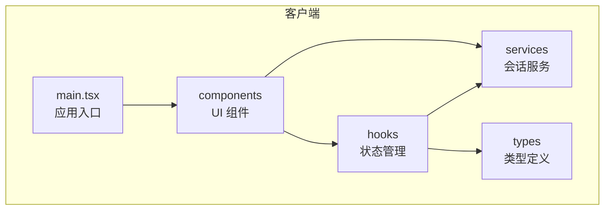
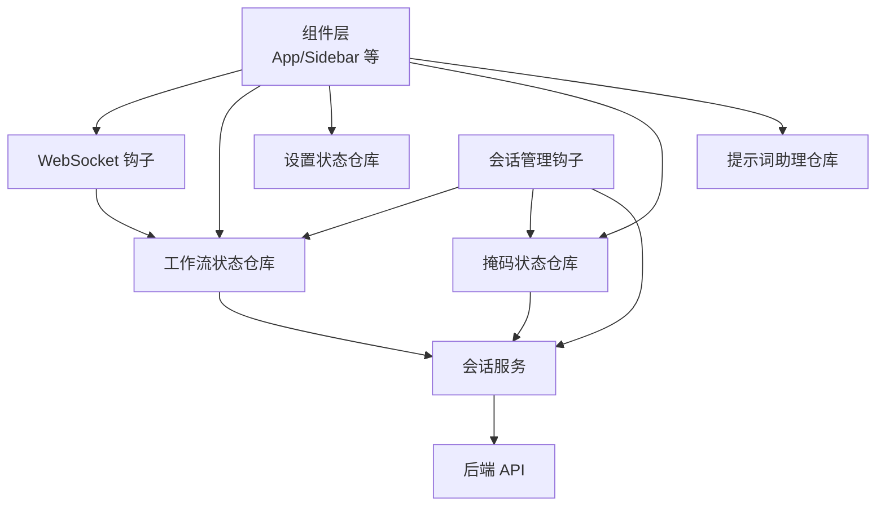
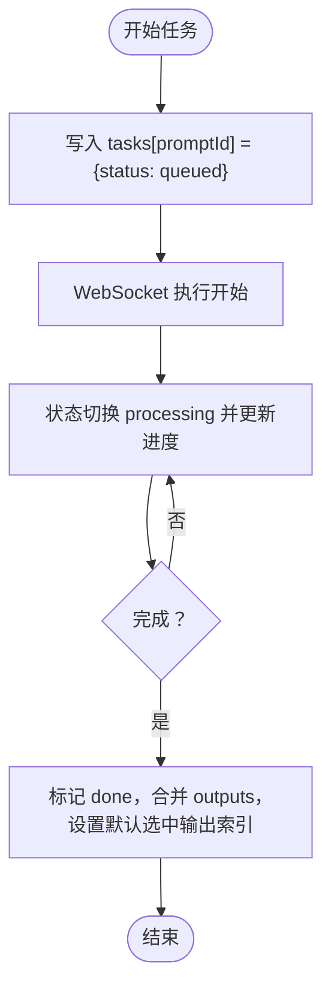
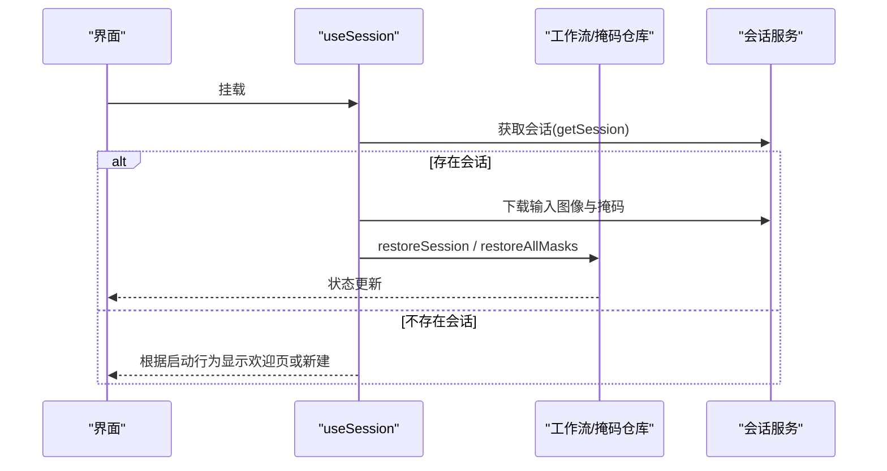
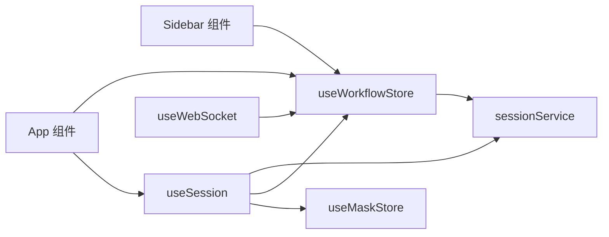

# 状态管理系统

<cite>
**本文引用的文件**
- [useWorkflowStore.ts](file://client/src/hooks/useWorkflowStore.ts)
- [useSettingsStore.ts](file://client/src/hooks/useSettingsStore.ts)
- [useSession.ts](file://client/src/hooks/useSession.ts)
- [useMaskStore.ts](file://client/src/hooks/useMaskStore.ts)
- [usePromptAssistantStore.ts](file://client/src/hooks/usePromptAssistantStore.ts)
- [sessionService.ts](file://client/src/services/sessionService.ts)
- [index.ts](file://client/src/types/index.ts)
- [App.tsx](file://client/src/components/App.tsx)
- [Sidebar.tsx](file://client/src/components/Sidebar.tsx)
- [Workflow0SettingsPanel.tsx](file://client/src/components/Workflow0SettingsPanel.tsx)
- [Workflow2SettingsPanel.tsx](file://client/src/components/Workflow2SettingsPanel.tsx)
- [useWebSocket.ts](file://client/src/hooks/useWebSocket.ts)
- [main.tsx](file://client/src/main.tsx)
</cite>

## 目录
1. [简介](#简介)
2. [项目结构](#项目结构)
3. [核心组件](#核心组件)
4. [架构总览](#架构总览)
5. [详细组件分析](#详细组件分析)
6. [依赖关系分析](#依赖关系分析)
7. [性能考量](#性能考量)
8. [故障排查指南](#故障排查指南)
9. [结论](#结论)
10. [附录](#附录)

## 简介
本文件系统性阐述基于 Zustand 的状态管理架构，覆盖工作流状态设计、会话状态管理、设置状态维护与持久化策略。重点解析 useWorkflowStore 的实现机制，包括标签页状态隔离、图像数据管理、任务队列控制、跨标签进度同步与会话恢复；同时说明本地存储与服务端会话的协同机制、自动保存与恢复流程、以及最佳实践与性能优化建议。

## 项目结构
客户端采用按功能域划分的目录组织，状态管理相关的核心文件集中在 client/src/hooks 与 client/src/services，类型定义位于 client/src/types，UI 组件位于 client/src/components。

**图表来源**
- [main.tsx:1-11](file://client/src/main.tsx#L1-L11)
- [App.tsx:1-335](file://client/src/components/App.tsx#L1-L335)

**章节来源**
- [main.tsx:1-11](file://client/src/main.tsx#L1-L11)
- [App.tsx:1-335](file://client/src/components/App.tsx#L1-L335)

## 核心组件
- 工作流状态仓库（Zustand）：集中管理图像、提示词、任务、输出索引、配置等，支持标签页隔离与跨标签任务同步。
- 设置状态仓库：管理逆向提示词模型、启动行为等用户偏好。
- 会话管理钩子：负责会话 ID 生命周期、序列化/反序列化、自动保存、上传输入图像与掩码、恢复逻辑。
- 掩码状态仓库：管理编辑中的掩码像素数据与编辑器状态。
- 提示词助理状态仓库：管理面板开关、模式与会话键。
- 会话服务：封装与后端交互的 API，如上传图像/掩码、保存/加载会话状态。
- 类型系统：统一 ImageItem、TaskInfo、WSMessage 等核心类型。

**章节来源**
- [useWorkflowStore.ts:1-645](file://client/src/hooks/useWorkflowStore.ts#L1-L645)
- [useSettingsStore.ts:1-31](file://client/src/hooks/useSettingsStore.ts#L1-L31)
- [useSession.ts:1-422](file://client/src/hooks/useSession.ts#L1-L422)
- [useMaskStore.ts:1-51](file://client/src/hooks/useMaskStore.ts#L1-L51)
- [usePromptAssistantStore.ts:1-33](file://client/src/hooks/usePromptAssistantStore.ts#L1-L33)
- [sessionService.ts:1-134](file://client/src/services/sessionService.ts#L1-L134)
- [index.ts:1-58](file://client/src/types/index.ts#L1-L58)

## 架构总览
Zustand 状态通过 hooks 暴露给组件订阅；会话管理钩子在挂载时根据启动行为决定新建/恢复会话；状态变更通过订阅触发自动保存；WebSocket 接收进度/完成事件驱动任务状态更新；服务层负责与后端 API 交互。

**图表来源**
- [useSession.ts:1-422](file://client/src/hooks/useSession.ts#L1-L422)
- [useWorkflowStore.ts:1-645](file://client/src/hooks/useWorkflowStore.ts#L1-L645)
- [useMaskStore.ts:1-51](file://client/src/hooks/useMaskStore.ts#L1-L51)
- [useWebSocket.ts:1-98](file://client/src/hooks/useWebSocket.ts#L1-L98)
- [sessionService.ts:1-134](file://client/src/services/sessionService.ts#L1-L134)

## 详细组件分析

### 工作流状态仓库（useWorkflowStore）
- 设计要点
  - 标签页隔离：每个 tabData 键值对应一个 TabData，包含 images、prompts、tasks、selectedOutputIndex、backPoseToggles、text2imgConfigs、zitConfigs、faceSwapZones 等字段。
  - 任务队列与状态：支持 queued/processing/done/error 等状态，跨标签搜索 promptId 同步进度与结果。
  - 图像生命周期：添加/删除/清空图像时释放预览 URL；支持批量删除与选择集。
  - 特殊工作流卡片：Tab 7（文本生成）与 Tab 9（ZIT 快速出图）提供“虚拟占位”图像以保证会话上传/恢复正常。
  - 会话恢复：restoreSession 将服务端序列化数据还原为仓库状态，修正任务状态为 done/error。
  - 计算属性：needsPrompt 根据当前 activeTab 判断是否需要提示词；isProcessing 检测当前标签是否有进行中任务。

- 关键流程示意（任务状态流转）

**图表来源**
- [useWorkflowStore.ts:377-499](file://client/src/hooks/useWorkflowStore.ts#L377-L499)

- 代码片段路径
  - [工作流常量与接口定义:6-17](file://client/src/hooks/useWorkflowStore.ts#L6-L17)
  - [TabData 结构与空态初始化:19-33](file://client/src/hooks/useWorkflowStore.ts#L19-L33)
  - [图像增删改查与 URL 释放:197-329](file://client/src/hooks/useWorkflowStore.ts#L197-L329)
  - [任务状态管理与跨标签同步:377-499](file://client/src/hooks/useWorkflowStore.ts#L377-L499)
  - [会话恢复逻辑:600-636](file://client/src/hooks/useWorkflowStore.ts#L600-L636)
  - [计算属性 needsPrompt/isProcessing:595-643](file://client/src/hooks/useWorkflowStore.ts#L595-L643)

**章节来源**
- [useWorkflowStore.ts:1-645](file://client/src/hooks/useWorkflowStore.ts#L1-L645)

### 会话管理（useSession）
- 会话生命周期
  - 会话 ID：首次访问生成并存入本地存储；支持重命名与新会话创建。
  - 自动保存：订阅工作流与掩码状态变化，防抖后保存；beforeunload 使用 beacon 上报最终状态。
  - 图像上传：检测新增图像，异步上传至服务端，成功后回填 sessionUrl 并再次保存。
  - 掩码保存：掩码变更时转换为灰度 PNG 并上传。
  - 恢复逻辑：根据启动行为（restore/new/welcome）决定是否恢复；恢复时重建 ImageItem 并回填 sessionUrl，同时恢复掩码。

- 关键流程示意（会话恢复）

**图表来源**
- [useSession.ts:290-387](file://client/src/hooks/useSession.ts#L290-L387)
- [sessionService.ts:116-133](file://client/src/services/sessionService.ts#L116-L133)

- 代码片段路径
  - [会话 ID 生成与读取:25-36](file://client/src/hooks/useSession.ts#L25-L36)
  - [序列化状态（排除 File 对象）:138-162](file://client/src/hooks/useSession.ts#L138-L162)
  - [自动保存与防抖:164-181](file://client/src/hooks/useSession.ts#L164-L181)
  - [图像上传与回填 sessionUrl:184-233](file://client/src/hooks/useSession.ts#L184-L233)
  - [掩码保存与上传:235-265](file://client/src/hooks/useSession.ts#L235-L265)
  - [恢复流程与空会话清理:290-387](file://client/src/hooks/useSession.ts#L290-L387)
  - [beforeunload 最终保存:397-418](file://client/src/hooks/useSession.ts#L397-L418)

**章节来源**
- [useSession.ts:1-422](file://client/src/hooks/useSession.ts#L1-L422)
- [sessionService.ts:1-134](file://client/src/services/sessionService.ts#L1-L134)

### 设置状态仓库（useSettingsStore）
- 管理逆向提示词模型与启动行为，并持久化到本地存储。
- 提供打开/关闭设置面板的方法。

- 代码片段路径
  - [设置项与持久化:16-30](file://client/src/hooks/useSettingsStore.ts#L16-L30)

**章节来源**
- [useSettingsStore.ts:1-31](file://client/src/hooks/useSettingsStore.ts#L1-L31)

### 掩码状态仓库（useMaskStore）
- 管理掩码像素数据（RGBA）、编辑器状态（打开/关闭、原图/结果图、模式 A/B）。
- 支持批量恢复所有掩码。

- 代码片段路径
  - [掩码数据结构与编辑器状态:4-30](file://client/src/hooks/useMaskStore.ts#L4-L30)
  - [设置/删除/获取/恢复掩码:32-50](file://client/src/hooks/useMaskStore.ts#L32-L50)

**章节来源**
- [useMaskStore.ts:1-51](file://client/src/hooks/useMaskStore.ts#L1-L51)

### 提示词助理仓库（usePromptAssistantStore）
- 管理面板开关、活动模式、初始文本与会话键，用于不同模式下的提示词生成体验。

- 代码片段路径
  - [状态与方法定义:5-32](file://client/src/hooks/usePromptAssistantStore.ts#L5-L32)

**章节来源**
- [usePromptAssistantStore.ts:1-33](file://client/src/hooks/usePromptAssistantStore.ts#L1-L33)

### 类型系统（types/index.ts）
- 统一定义 ImageItem、TaskInfo、TaskStatus、WSMessage 等核心类型，确保状态结构与消息格式一致。

- 代码片段路径
  - [图像与任务类型:1-25](file://client/src/types/index.ts#L1-L25)
  - [WebSocket 消息类型:27-57](file://client/src/types/index.ts#L27-L57)

**章节来源**
- [index.ts:1-58](file://client/src/types/index.ts#L1-L58)

### UI 组件与状态订阅
- App 组件订阅工作流状态（当前标签图像列表、活动标签），集成会话、主题、拖拽导入等能力。
- Sidebar 基于工作流仓库渲染侧边栏，支持标签间拖拽复制图像、队列面板等。

- 代码片段路径
  - [App 中的工作流订阅与拖拽处理:54-134](file://client/src/components/App.tsx#L54-L134)
  - [Sidebar 中的标签切换与拖拽复制:30-209](file://client/src/components/Sidebar.tsx#L30-L209)

**章节来源**
- [App.tsx:1-335](file://client/src/components/App.tsx#L1-L335)
- [Sidebar.tsx:1-425](file://client/src/components/Sidebar.tsx#L1-L425)

### 工作流专用设置面板
- Workflow0SettingsPanel 与 Workflow2SettingsPanel 分别维护工作流特定的本地设置（如绘制模型、放大模型），通过 localStorage 持久化。

- 代码片段路径
  - [Workflow0 设置面板:1-58](file://client/src/components/Workflow0SettingsPanel.tsx#L1-L58)
  - [Workflow2 设置面板:1-59](file://client/src/components/Workflow2SettingsPanel.tsx#L1-L59)

**章节来源**
- [Workflow0SettingsPanel.tsx:1-58](file://client/src/components/Workflow0SettingsPanel.tsx#L1-L58)
- [Workflow2SettingsPanel.tsx:1-59](file://client/src/components/Workflow2SettingsPanel.tsx#L1-L59)

## 依赖关系分析
- 组件对状态仓库的依赖：App、Sidebar 等组件通过选择器订阅工作流状态；设置与提示词助理仓库被各自面板组件直接使用。
- 会话管理对仓库与服务的依赖：useSession 订阅工作流与掩码状态，调用 sessionService 进行上传/保存/加载。
- WebSocket 与工作流：useWebSocket 全局连接，接收进度/完成消息后更新工作流任务状态。

**图表来源**
- [App.tsx:1-335](file://client/src/components/App.tsx#L1-L335)
- [Sidebar.tsx:1-425](file://client/src/components/Sidebar.tsx#L1-L425)
- [useSession.ts:1-422](file://client/src/hooks/useSession.ts#L1-L422)
- [useWorkflowStore.ts:1-645](file://client/src/hooks/useWorkflowStore.ts#L1-L645)
- [useMaskStore.ts:1-51](file://client/src/hooks/useMaskStore.ts#L1-L51)
- [useWebSocket.ts:1-98](file://client/src/hooks/useWebSocket.ts#L1-L98)
- [sessionService.ts:1-134](file://client/src/services/sessionService.ts#L1-L134)

**章节来源**
- [App.tsx:1-335](file://client/src/components/App.tsx#L1-L335)
- [Sidebar.tsx:1-425](file://client/src/components/Sidebar.tsx#L1-L425)
- [useSession.ts:1-422](file://client/src/hooks/useSession.ts#L1-L422)
- [useWorkflowStore.ts:1-645](file://client/src/hooks/useWorkflowStore.ts#L1-L645)
- [useMaskStore.ts:1-51](file://client/src/hooks/useMaskStore.ts#L1-L51)
- [useWebSocket.ts:1-98](file://client/src/hooks/useWebSocket.ts#L1-L98)
- [sessionService.ts:1-134](file://client/src/services/sessionService.ts#L1-L134)

## 性能考量
- 状态粒度与订阅范围
  - 使用选择器订阅（如 s => s.tabData[s.activeTab]?.images）避免无关重渲染。
  - 在 Sidebar 中仅订阅必要字段，减少渲染压力。
- 防抖与批处理
  - useSession 对状态变更进行防抖保存，降低网络请求频率。
  - 批量删除图像时统一释放 URL，避免内存泄漏。
- 跨标签状态同步
  - 任务状态更新与进度广播遍历所有标签，注意在大标签数量场景下的开销；可考虑按需查找或缓存映射。
- WebSocket 连接复用
  - 单例连接与连接数统计，避免重复连接导致资源浪费。
- 本地存储与序列化
  - 会话序列化排除 File 对象，仅保存元信息；恢复时再按需下载文件，平衡内存占用与可用性。

[本节为通用性能建议，不直接分析具体文件，故无“章节来源”]

## 故障排查指南
- 会话恢复失败
  - 检查 getSession 返回值与启动行为设置；确认服务端会话是否存在。
  - 查看控制台日志与 useSession 的异常捕获分支。
- 图像未上传或 sessionUrl 为空
  - 确认订阅回调是否触发；检查上传接口返回与错误处理。
  - 确保上传完成后回填 sessionUrl 并再次保存。
- 任务进度不同步
  - 确认 WebSocket 消息类型与 useWebSocket 的消息分发逻辑。
  - 核对任务状态更新是否跨标签正确传播。
- 掩码保存异常
  - 检查灰度 PNG 转换与上传接口调用；确认掩码键命名规则与服务端路径一致。
- beforeunload 未保存
  - 确认 isRestoring 标记未阻止保存；检查 beacon 请求与服务端接收。

**章节来源**
- [useSession.ts:164-181](file://client/src/hooks/useSession.ts#L164-L181)
- [useSession.ts:184-233](file://client/src/hooks/useSession.ts#L184-L233)
- [useSession.ts:235-265](file://client/src/hooks/useSession.ts#L235-L265)
- [useSession.ts:290-387](file://client/src/hooks/useSession.ts#L290-L387)
- [useSession.ts:397-418](file://client/src/hooks/useSession.ts#L397-L418)
- [useWebSocket.ts:26-44](file://client/src/hooks/useWebSocket.ts#L26-L44)

## 结论
该状态管理方案以 Zustand 为核心，结合会话管理钩子实现了从本地到服务端的完整状态持久化闭环。useWorkflowStore 提供了清晰的标签页隔离与任务状态同步机制；useSession 将自动保存、图像/掩码上传与会话恢复整合为一体；类型系统确保了前后端契约一致性。通过合理使用订阅选择器、防抖与连接复用等手段，可在复杂工作流场景下保持良好的性能与用户体验。

[本节为总结性内容，不直接分析具体文件，故无“章节来源”]

## 附录

### 状态管理最佳实践
- 状态设计原则
  - 将 UI 临时状态与业务状态分离；仅将需要共享与持久化的数据放入仓库。
  - 使用选择器订阅最小化渲染范围，避免全量订阅。
- 性能优化技巧
  - 对频繁变更的状态进行防抖/节流；批量操作时一次性提交。
  - 大对象（如 File、Blob）避免直接存入仓库，改为 ID/URL 引用并在需要时加载。
- 错误处理策略
  - 对网络请求与文件上传增加重试与降级逻辑；在 UI 层提供明确反馈。
  - 对 WebSocket 断线进行重连与消息去重处理。
- 代码示例路径（不展示具体代码，仅提供定位）
  - [状态订阅与拖拽导入:54-134](file://client/src/components/App.tsx#L54-L134)
  - [任务状态更新与进度同步:398-443](file://client/src/hooks/useWorkflowStore.ts#L398-L443)
  - [会话自动保存与上传:164-233](file://client/src/hooks/useSession.ts#L164-L233)
  - [WebSocket 消息分发:26-44](file://client/src/hooks/useWebSocket.ts#L26-L44)
  - [设置项持久化:20-27](file://client/src/hooks/useSettingsStore.ts#L20-L27)

[本节为实践指导，不直接分析具体文件，故无“章节来源”]