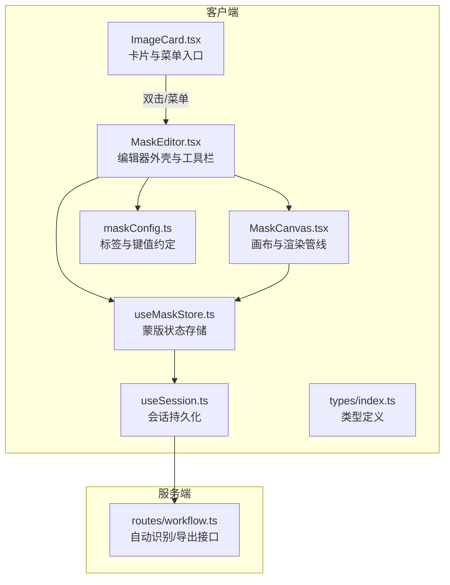
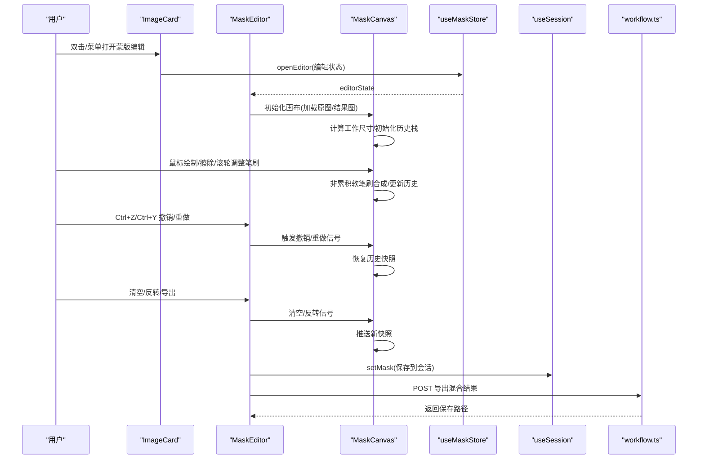
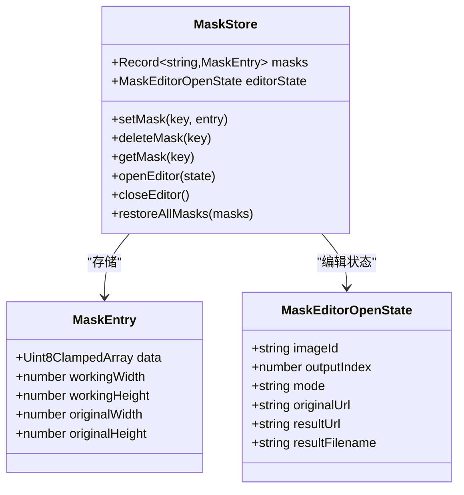
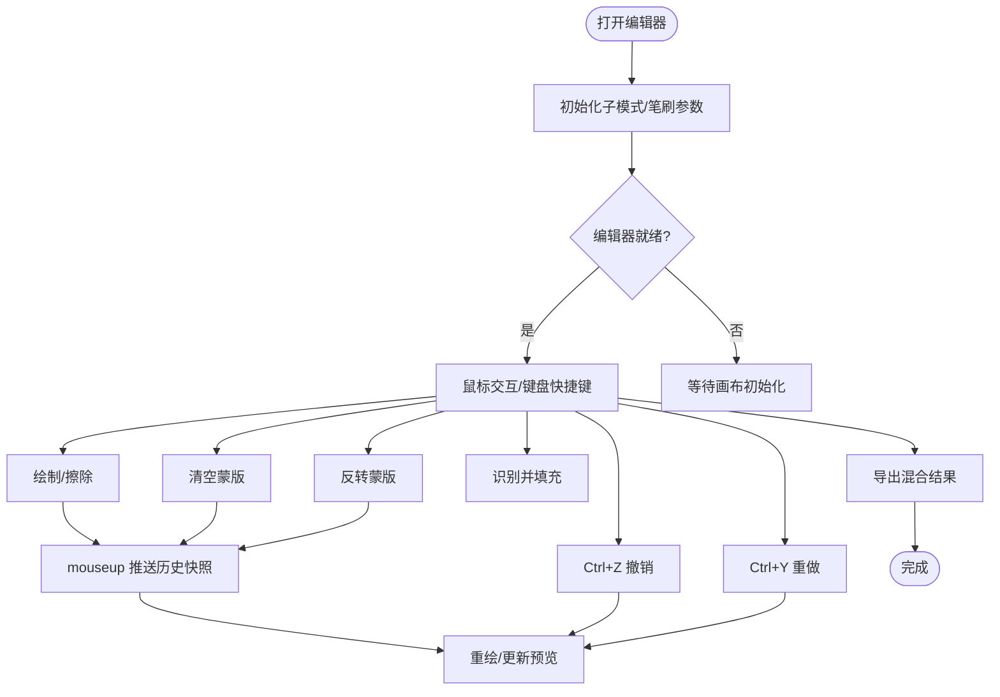
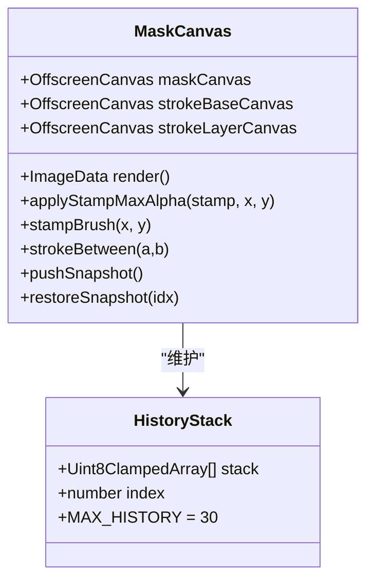
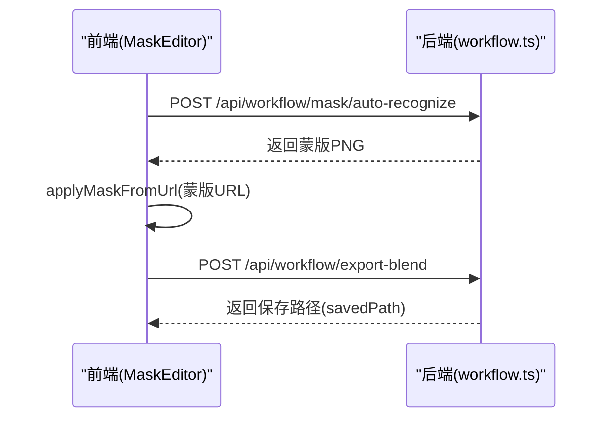
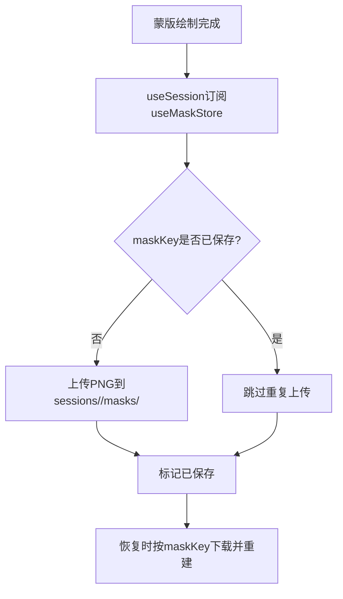
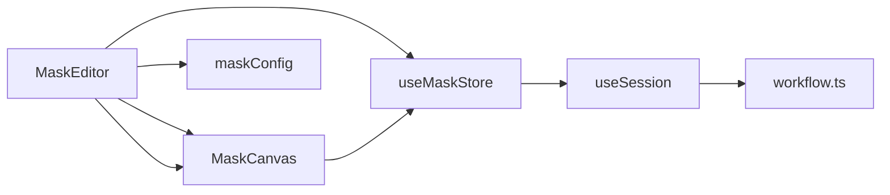

# 蒙版编辑状态管理

<cite>
**本文档引用的文件**
- [MaskEditor.tsx](file://client/src/components/MaskEditor.tsx)
- [MaskCanvas.tsx](file://client/src/components/MaskCanvas.tsx)
- [useMaskStore.ts](file://client/src/hooks/useMaskStore.ts)
- [maskConfig.ts](file://client/src/config/maskConfig.ts)
- [ImageCard.tsx](file://client/src/components/ImageCard.tsx)
- [useSession.ts](file://client/src/hooks/useSession.ts)
- [workflow.ts](file://server/src/routes/workflow.ts)
- [2026-02-24-mask-editor-design.md](file://docs/plans/2026-02-24-mask-editor-design.md)
- [index.ts](file://client/src/types/index.ts)
</cite>

## 目录
1. [简介](#简介)
2. [项目结构](#项目结构)
3. [核心组件](#核心组件)
4. [架构总览](#架构总览)
5. [详细组件分析](#详细组件分析)
6. [依赖关系分析](#依赖关系分析)
7. [性能考虑](#性能考虑)
8. [故障排除指南](#故障排除指南)
9. [结论](#结论)
10. [附录](#附录)

## 简介
本文件系统性阐述蒙版编辑状态管理系统的设计与实现，涵盖蒙版数据模型、编辑工具状态、预设配置、交互状态管理、持久化策略以及跨会话共享机制。该系统支持两种编辑模式（叠加模式A与A|B混合模式B），提供撤销/重做、实时预览、自动识别填充、导出混合结果等能力，并通过会话机制实现跨页面刷新的蒙版数据持久化。

## 项目结构
蒙版编辑功能主要分布在前端组件与状态管理模块，配合后端路由实现自动识别与导出功能：

**图表来源**
- [ImageCard.tsx:335-365](file://client/src/components/ImageCard.tsx#L335-L365)
- [MaskEditor.tsx:141-188](file://client/src/components/MaskEditor.tsx#L141-L188)
- [MaskCanvas.tsx:39-54](file://client/src/components/MaskCanvas.tsx#L39-L54)
- [useMaskStore.ts:32-50](file://client/src/hooks/useMaskStore.ts#L32-L50)
- [maskConfig.ts:18-20](file://client/src/config/maskConfig.ts#L18-L20)
- [useSession.ts:235-265](file://client/src/hooks/useSession.ts#L235-L265)
- [workflow.ts:626-655](file://server/src/routes/workflow.ts#L626-L655)

**章节来源**
- [MaskEditor.tsx:141-188](file://client/src/components/MaskEditor.tsx#L141-L188)
- [MaskCanvas.tsx:39-54](file://client/src/components/MaskCanvas.tsx#L39-L54)
- [useMaskStore.ts:32-50](file://client/src/hooks/useMaskStore.ts#L32-L50)
- [maskConfig.ts:18-20](file://client/src/config/maskConfig.ts#L18-L20)
- [useSession.ts:235-265](file://client/src/hooks/useSession.ts#L235-L265)
- [workflow.ts:626-655](file://server/src/routes/workflow.ts#L626-L655)

## 核心组件
- 蒙版数据模型（MaskEntry）：包含蒙版像素数据、工作分辨率与原图分辨率信息，用于跨组件传递与持久化。
- 编辑器外壳（MaskEditor）：负责工具栏、快捷键、撤销/重做信号、清空/反转、导出对话框等交互。
- 画布渲染（MaskCanvas）：实现双画布视口、三通道叠加渲染、非累积软笔刷、历史快照、实时预览与混合渲染。
- 状态存储（useMaskStore）：独立的Zustand存储，管理蒙版映射、编辑器打开状态与会话恢复。
- 配置约定（maskConfig）：基于标签页的蒙版模式分配与键值生成规则。
- 会话持久化（useSession）：监听蒙版变化并异步上传PNG至会话目录，支持恢复与清理。

**章节来源**
- [useMaskStore.ts:4-10](file://client/src/hooks/useMaskStore.ts#L4-L10)
- [MaskEditor.tsx:141-188](file://client/src/components/MaskEditor.tsx#L141-L188)
- [MaskCanvas.tsx:39-54](file://client/src/components/MaskCanvas.tsx#L39-L54)
- [maskConfig.ts:3-16](file://client/src/config/maskConfig.ts#L3-L16)
- [useSession.ts:235-265](file://client/src/hooks/useSession.ts#L235-L265)

## 架构总览
蒙版编辑采用“组件-状态-画布-会话”的分层架构。组件负责交互与配置，状态管理负责数据与生命周期，画布负责渲染与历史，会话负责持久化与跨会话共享。

**图表来源**
- [ImageCard.tsx:335-365](file://client/src/components/ImageCard.tsx#L335-L365)
- [MaskEditor.tsx:189-235](file://client/src/components/MaskEditor.tsx#L189-L235)
- [MaskCanvas.tsx:180-201](file://client/src/components/MaskCanvas.tsx#L180-L201)
- [useMaskStore.ts:47-49](file://client/src/hooks/useMaskStore.ts#L47-L49)
- [useSession.ts:235-265](file://client/src/hooks/useSession.ts#L235-L265)
- [workflow.ts:626-655](file://server/src/routes/workflow.ts#L626-L655)

## 详细组件分析

### 数据模型与键值约定
- 蒙版条目（MaskEntry）包含：
  - data：Uint8ClampedArray，RGBA像素数据（蒙版仅使用alpha通道）
  - workingWidth/workingHeight：工作分辨率（最长边≤2048）
  - originalWidth/originalHeight：原图分辨率
- 键值约定（maskKey）：`${imageId}:${outputIndex}`
  - 模式A：outputIndex=-1（原图）
  - 模式B：outputIndex=选中的输出索引

**图表来源**
- [useMaskStore.ts:4-10](file://client/src/hooks/useMaskStore.ts#L4-L10)
- [useMaskStore.ts:21-30](file://client/src/hooks/useMaskStore.ts#L21-L30)

**章节来源**
- [useMaskStore.ts:4-10](file://client/src/hooks/useMaskStore.ts#L4-L10)
- [useMaskStore.ts:21-30](file://client/src/hooks/useMaskStore.ts#L21-L30)
- [maskConfig.ts:18-20](file://client/src/config/maskConfig.ts#L18-L20)

### 编辑器外壳（MaskEditor）
- 工具栏功能：
  - 模式A子模式切换（暗色叠加/高亮显示/红色叠加）
  - 显示/隐藏蒙版叠加（模式B）
  - 清空蒙版、反转蒙版
  - 识别并填充（调用后端自动识别）
  - 导出（模式B）
- 快捷键：
  - Ctrl+Z/Ctrl+Y：撤销/重做
  - Alt+滚轮：调整笔刷大小
  - T+滚轮：调整笔刷不透明度
  - F：适配视图
- 状态信号：
  - undoSignal/redoSignal/clearSignal/invertSignal：通过自增触发对应副作用
  - onHistoryChange：向父组件报告可撤销/可重做状态

**图表来源**
- [MaskEditor.tsx:141-188](file://client/src/components/MaskEditor.tsx#L141-L188)
- [MaskEditor.tsx:196-235](file://client/src/components/MaskEditor.tsx#L196-L235)
- [MaskCanvas.tsx:180-201](file://client/src/components/MaskCanvas.tsx#L180-L201)

**章节来源**
- [MaskEditor.tsx:141-188](file://client/src/components/MaskEditor.tsx#L141-L188)
- [MaskEditor.tsx:196-235](file://client/src/components/MaskEditor.tsx#L196-L235)
- [MaskCanvas.tsx:180-201](file://client/src/components/MaskCanvas.tsx#L180-L201)

### 画布渲染（MaskCanvas）
- 三画布架构：
  - canvas1：基础图像显示
  - canvas2：蒙版/合成输出（模式B时为混合结果）
  - canvas3：画笔光标预览
  - 事件捕获层：统一处理鼠标/键盘事件
- 渲染模式：
  - 模式A：三种子模式的覆盖渲染
  - 模式B：原图*(1-掩码)+结果图*掩码的实时混合
- 笔刷系统：
  - 非累积软笔刷：通过strokeBase/strokeLayer两层离屏画布，逐像素取最大alpha，避免重叠导致边缘硬化
  - 擦除：使用destination-out复合操作
- 历史管理：
  - 最大历史栈深度30
  - 在mouseup时推送快照，清空/反转也推送快照
  - 历史索引变化时回调通知父组件

**图表来源**
- [MaskCanvas.tsx:17-20](file://client/src/components/MaskCanvas.tsx#L17-L20)
- [MaskCanvas.tsx:69-70](file://client/src/components/MaskCanvas.tsx#L69-L70)
- [MaskCanvas.tsx:180-201](file://client/src/components/MaskCanvas.tsx#L180-L201)

**章节来源**
- [MaskCanvas.tsx:39-54](file://client/src/components/MaskCanvas.tsx#L39-L54)
- [MaskCanvas.tsx:180-201](file://client/src/components/MaskCanvas.tsx#L180-L201)
- [MaskCanvas.tsx:203-276](file://client/src/components/MaskCanvas.tsx#L203-L276)
- [MaskCanvas.tsx:288-302](file://client/src/components/MaskCanvas.tsx#L288-L302)

### 自动识别与导出流程
- 自动识别：
  - 前端上传原图到后端
  - 后端执行SAM模板工作流，返回蒙版PNG
  - 前端将蒙版应用到当前画布
- 导出混合：
  - 前端在工作分辨率上构建原图*(1-掩码)+结果图*掩码
  - 将结果以base64形式POST到后端
  - 后端保存到会话输出目录并返回保存路径

**图表来源**
- [MaskEditor.tsx:196-235](file://client/src/components/MaskEditor.tsx#L196-L235)
- [workflow.ts:820-854](file://server/src/routes/workflow.ts#L820-L854)
- [workflow.ts:626-655](file://server/src/routes/workflow.ts#L626-L655)

**章节来源**
- [MaskEditor.tsx:196-235](file://client/src/components/MaskEditor.tsx#L196-L235)
- [workflow.ts:820-854](file://server/src/routes/workflow.ts#L820-L854)
- [workflow.ts:626-655](file://server/src/routes/workflow.ts#L626-L655)

### 会话持久化与跨会话共享
- 监听策略：
  - 蒙版绘制完成后（mouseup）触发保存
  - 使用useSession订阅useMaskStore，将新增或变更的蒙版以PNG形式上传
- 存储结构：
  - sessions/<sessionId>/tab-<tab>/masks/<maskKey>.png
  - 会话JSON记录状态快照（不含File对象）
- 恢复逻辑：
  - 启动时根据sessionId加载会话
  - 逐个查找并下载mask PNG，重建蒙版映射
  - 恢复后通过restoreAllMasks注入到状态

**图表来源**
- [useSession.ts:235-265](file://client/src/hooks/useSession.ts#L235-L265)
- [useMaskStore.ts:47-49](file://client/src/hooks/useMaskStore.ts#L47-L49)

**章节来源**
- [useSession.ts:235-265](file://client/src/hooks/useSession.ts#L235-L265)
- [useMaskStore.ts:47-49](file://client/src/hooks/useMaskStore.ts#L47-L49)

## 依赖关系分析
- 组件耦合：
  - MaskEditor依赖useMaskStore与maskConfig，控制工具栏与导出行为
  - MaskCanvas依赖编辑器状态与画布句柄，内部维护历史栈与渲染管线
- 外部依赖：
  - 后端workflow路由提供自动识别与导出接口
  - 会话服务负责文件上传与恢复

**图表来源**
- [MaskEditor.tsx:141-188](file://client/src/components/MaskEditor.tsx#L141-L188)
- [MaskCanvas.tsx:39-54](file://client/src/components/MaskCanvas.tsx#L39-L54)
- [useMaskStore.ts:32-50](file://client/src/hooks/useMaskStore.ts#L32-L50)
- [maskConfig.ts:18-20](file://client/src/config/maskConfig.ts#L18-L20)
- [useSession.ts:235-265](file://client/src/hooks/useSession.ts#L235-L265)
- [workflow.ts:626-655](file://server/src/routes/workflow.ts#L626-L655)

**章节来源**
- [MaskEditor.tsx:141-188](file://client/src/components/MaskEditor.tsx#L141-L188)
- [MaskCanvas.tsx:39-54](file://client/src/components/MaskCanvas.tsx#L39-L54)
- [useMaskStore.ts:32-50](file://client/src/hooks/useMaskStore.ts#L32-L50)
- [maskConfig.ts:18-20](file://client/src/config/maskConfig.ts#L18-L20)
- [useSession.ts:235-265](file://client/src/hooks/useSession.ts#L235-L265)
- [workflow.ts:626-655](file://server/src/routes/workflow.ts#L626-L655)

## 性能考虑
- 工作分辨率限制：最长边不超过2048px，降低高分辨率输入下的渲染压力
- 历史快照优化：以Uint8ClampedArray副本存储，避免完整ImageData对象的GC压力
- 离屏画布渲染：笔刷与混合均在离屏画布完成，减少主线程阻塞
- 非累积软笔刷：通过像素级max alpha合成，避免重叠导致的边缘硬化问题
- 会话上传去抖：批量保存，避免频繁IO

[本节为通用性能建议，无需特定文件引用]

## 故障排除指南
- 自动识别失败：
  - 检查网络连接与后端服务状态
  - 查看后端日志，确认SAM模板执行是否超时（默认120秒）
- 导出失败：
  - 确认sessionId与tabId有效
  - 检查后端输出目录权限与磁盘空间
- 撤销/重做无效：
  - 确认历史栈未被清空
  - 检查undoSignal/redoSignal是否正确递增
- 蒙版未持久化：
  - 确认useSession订阅生效
  - 检查会话目录上传是否成功

**章节来源**
- [workflow.ts:820-854](file://server/src/routes/workflow.ts#L820-L854)
- [workflow.ts:626-655](file://server/src/routes/workflow.ts#L626-L655)
- [MaskCanvas.tsx:180-201](file://client/src/components/MaskCanvas.tsx#L180-L201)
- [useSession.ts:235-265](file://client/src/hooks/useSession.ts#L235-L265)

## 结论
蒙版编辑状态管理系统通过清晰的组件边界与状态分离，实现了高效、直观且可扩展的蒙版绘制体验。其核心优势在于：
- 独立的状态存储与稳定的画布渲染管线
- 历史快照与非累积软笔刷保证了高质量的绘制体验
- 会话持久化与跨会话共享机制满足实际工作流需求
- 自动识别与导出接口完善了端到端工作流

## 附录

### 使用示例：在图像处理中应用蒙版
- 模式A（叠加预览）：适合在原图上进行局部高亮/遮罩叠加预览，便于调整绘制区域
- 模式B（实时混合）：在原图与结果图之间进行A|B混合，实时查看蒙版效果
- 自动识别：一键生成蒙版，减少手工绘制工作量
- 导出混合：将最终混合结果保存到会话输出目录，供后续使用

**章节来源**
- [2026-02-24-mask-editor-design.md:7-11](file://docs/plans/2026-02-24-mask-editor-design.md#L7-L11)
- [ImageCard.tsx:335-365](file://client/src/components/ImageCard.tsx#L335-L365)
- [MaskEditor.tsx:196-235](file://client/src/components/MaskEditor.tsx#L196-L235)
- [workflow.ts:626-655](file://server/src/routes/workflow.ts#L626-L655)