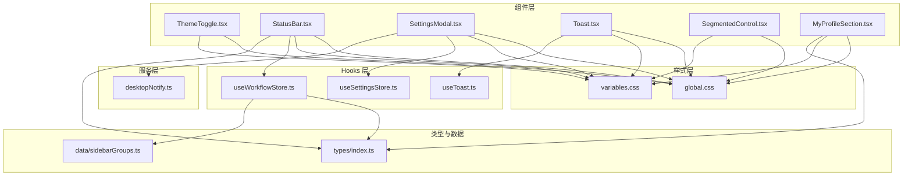
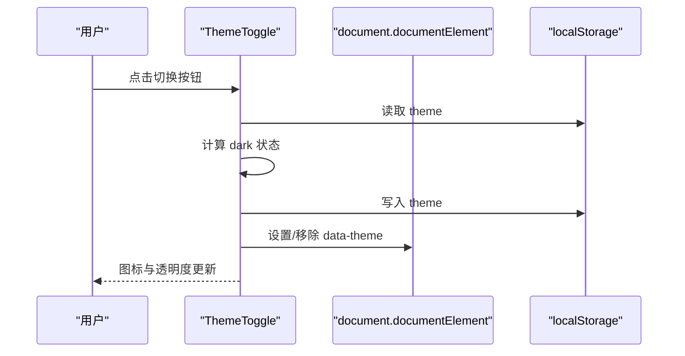
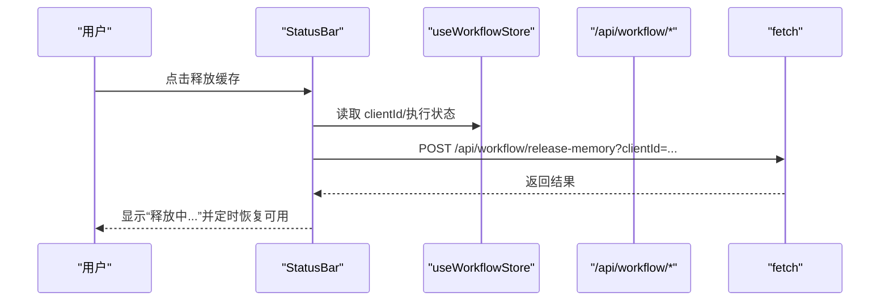
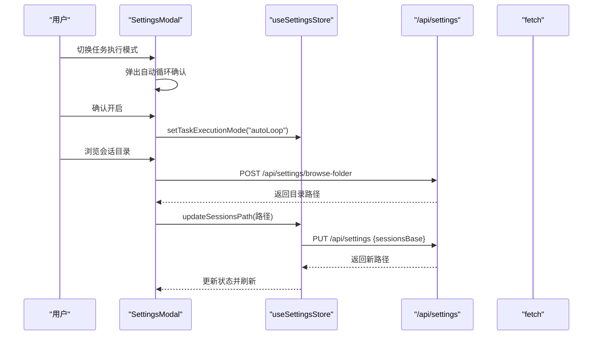
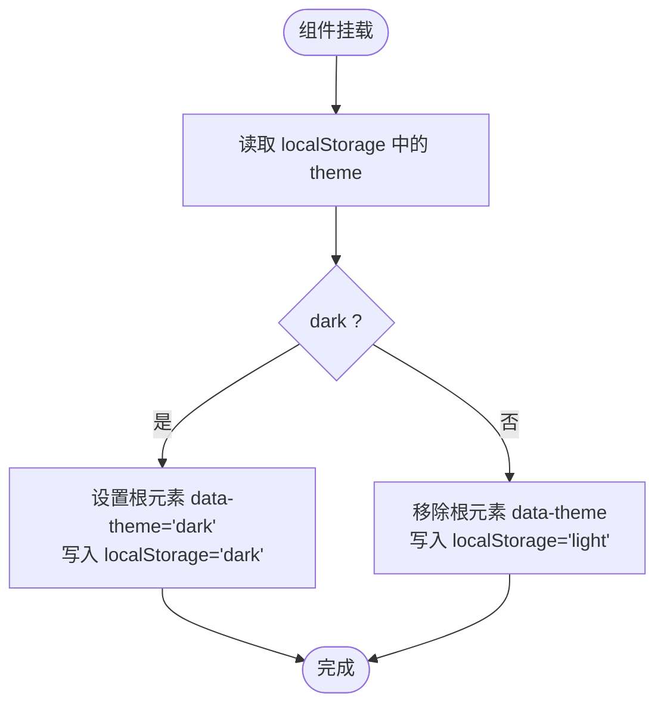
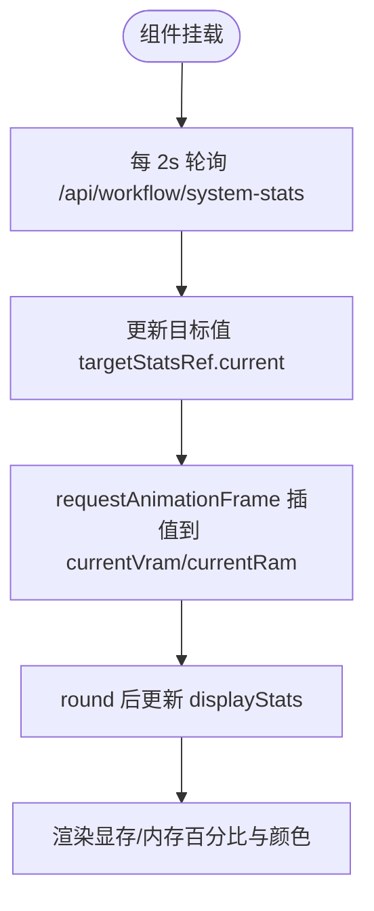
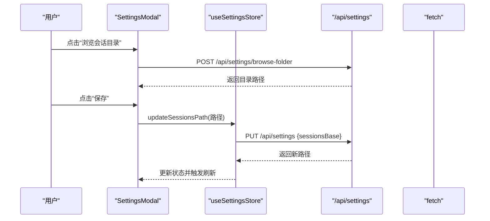
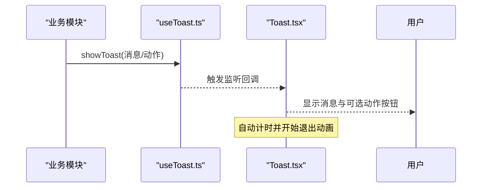
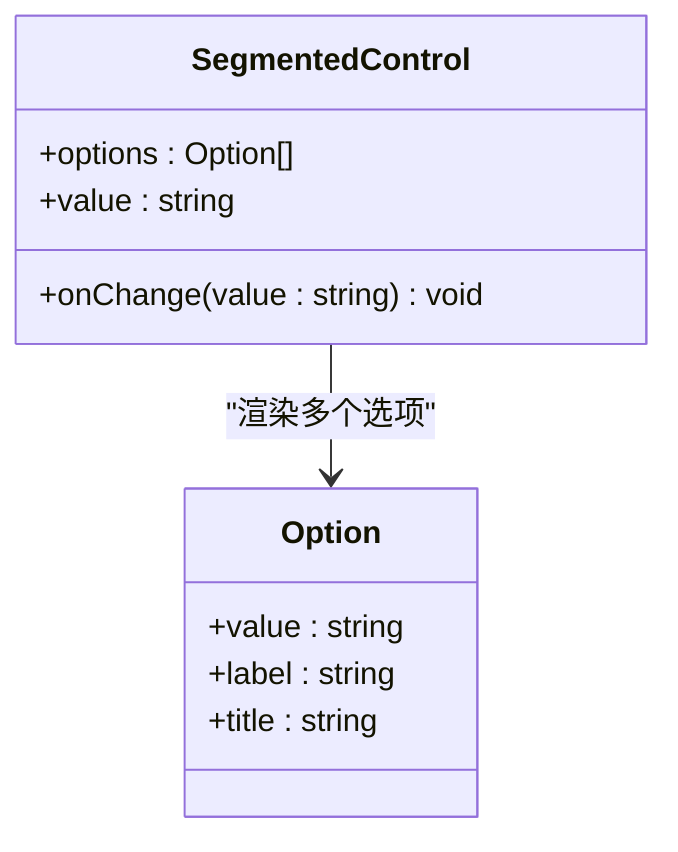
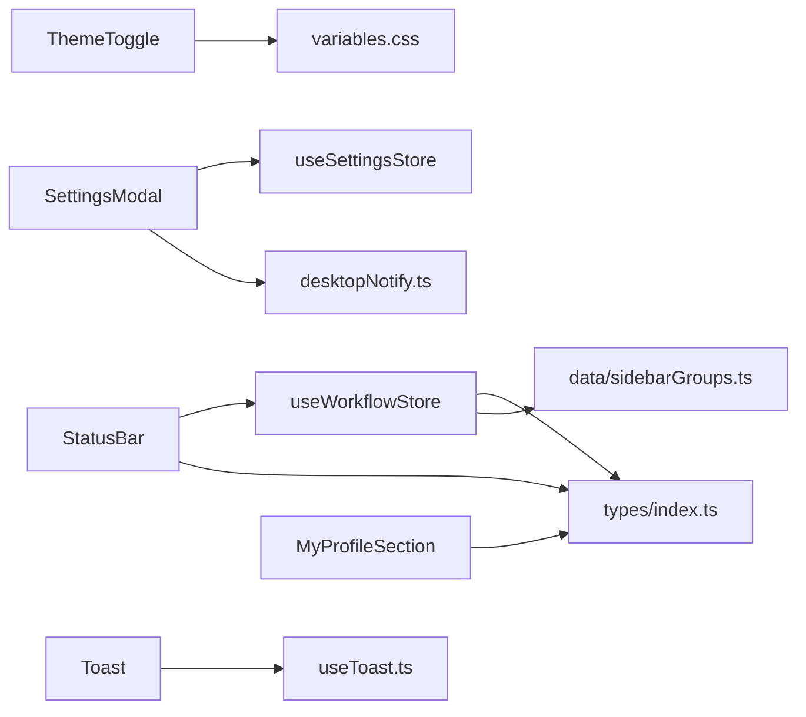

# UI 组件库与交互

<cite>
**本文引用的文件**
- [ThemeToggle.tsx](file://client/src/components/ThemeToggle.tsx)
- [StatusBar.tsx](file://client/src/components/StatusBar.tsx)
- [SettingsModal.tsx](file://client/src/components/SettingsModal.tsx)
- [Toast.tsx](file://client/src/components/Toast.tsx)
- [SegmentedControl.tsx](file://client/src/components/SegmentedControl.tsx)
- [MyProfileSection.tsx](file://client/src/components/MyProfileSection.tsx)
- [useSettingsStore.ts](file://client/src/hooks/useSettingsStore.ts)
- [useToast.ts](file://client/src/hooks/useToast.ts)
- [useWorkflowStore.ts](file://client/src/hooks/useWorkflowStore.ts)
- [global.css](file://client/src/styles/global.css)
- [variables.css](file://client/src/styles/variables.css)
- [desktopNotify.ts](file://client/src/services/desktopNotify.ts)
- [index.ts](file://client/src/types/index.ts)
- [sidebarGroups.ts](file://client/src/data/sidebarGroups.ts)
</cite>

## 目录
1. [简介](#简介)
2. [项目结构](#项目结构)
3. [核心组件](#核心组件)
4. [架构总览](#架构总览)
5. [详细组件分析](#详细组件分析)
6. [依赖关系分析](#依赖关系分析)
7. [性能考量](#性能考量)
8. [故障排查指南](#故障排查指南)
9. [结论](#结论)
10. [附录](#附录)

## 简介
本文件面向 CorineKit Pix2Real 的前端 UI 组件库，聚焦以下核心组件的设计理念与实现细节：
- ThemeToggle 主题切换：基于本地存储与根元素属性的明暗主题切换，支持图标反馈与持久化。
- StatusBar 状态栏：展示自动保存时间、会话与输出目录、视图大小切换、显存/内存占用、释放缓存等能力，并集成系统资源轮询与平滑插值显示。
- SettingsModal 设置面板：多分类设置项（工作流、随机生成、会话、通知、提示词管理、我的偏好），支持会话路径浏览与重置、自动循环模式风险确认、桌面通知权限引导等。
- Toast 消息提示：全局消息气泡，支持可选操作按钮与自动消失动画，统一通过监听器模式分发。

文档还涵盖响应式设计、主题系统、无障碍支持、动画与过渡效果、交互优化、使用指南与最佳实践。

## 项目结构
客户端采用按功能域组织的组件结构，样式通过 CSS 变量与全局动画统一管理，状态通过轻量状态库集中管理。

图表来源
- [ThemeToggle.tsx:1-39](file://client/src/components/ThemeToggle.tsx#L1-L39)
- [StatusBar.tsx:1-243](file://client/src/components/StatusBar.tsx#L1-L243)
- [SettingsModal.tsx:1-756](file://client/src/components/SettingsModal.tsx#L1-L756)
- [Toast.tsx:1-56](file://client/src/components/Toast.tsx#L1-L56)
- [SegmentedControl.tsx:1-50](file://client/src/components/SegmentedControl.tsx#L1-L50)
- [MyProfileSection.tsx:1-422](file://client/src/components/MyProfileSection.tsx#L1-L422)
- [useSettingsStore.ts:1-177](file://client/src/hooks/useSettingsStore.ts#L1-L177)
- [useToast.ts:1-70](file://client/src/hooks/useToast.ts#L1-L70)
- [useWorkflowStore.ts:1-923](file://client/src/hooks/useWorkflowStore.ts#L1-L923)
- [global.css:1-300](file://client/src/styles/global.css#L1-L300)
- [variables.css:1-31](file://client/src/styles/variables.css#L1-L31)
- [desktopNotify.ts:1-77](file://client/src/services/desktopNotify.ts#L1-L77)
- [index.ts:1-76](file://client/src/types/index.ts#L1-L76)
- [sidebarGroups.ts:1-14](file://client/src/data/sidebarGroups.ts#L1-L14)

章节来源
- [ThemeToggle.tsx:1-39](file://client/src/components/ThemeToggle.tsx#L1-L39)
- [StatusBar.tsx:1-243](file://client/src/components/StatusBar.tsx#L1-L243)
- [SettingsModal.tsx:1-756](file://client/src/components/SettingsModal.tsx#L1-L756)
- [Toast.tsx:1-56](file://client/src/components/Toast.tsx#L1-L56)
- [SegmentedControl.tsx:1-50](file://client/src/components/SegmentedControl.tsx#L1-L50)
- [MyProfileSection.tsx:1-422](file://client/src/components/MyProfileSection.tsx#L1-L422)
- [useSettingsStore.ts:1-177](file://client/src/hooks/useSettingsStore.ts#L1-L177)
- [useToast.ts:1-70](file://client/src/hooks/useToast.ts#L1-L70)
- [useWorkflowStore.ts:1-923](file://client/src/hooks/useWorkflowStore.ts#L1-L923)
- [global.css:1-300](file://client/src/styles/global.css#L1-L300)
- [variables.css:1-31](file://client/src/styles/variables.css#L1-L31)
- [desktopNotify.ts:1-77](file://client/src/services/desktopNotify.ts#L1-L77)
- [index.ts:1-76](file://client/src/types/index.ts#L1-L76)
- [sidebarGroups.ts:1-14](file://client/src/data/sidebarGroups.ts#L1-L14)

## 核心组件
本节概述四个核心组件的职责、接口与样式定制要点。

- ThemeToggle
  - 职责：切换明/暗主题，持久化到本地存储，更新根元素的主题属性，提供图标反馈。
  - 关键点：读取本地存储初始化状态；在切换时写入 localStorage 并设置/移除根元素 data-theme；按钮样式通过 CSS 变量与内联样式控制。
  - 样式定制：通过 CSS 变量控制颜色与透明度；图标随主题切换而变化。
  - 章节来源
    - [ThemeToggle.tsx:1-39](file://client/src/components/ThemeToggle.tsx#L1-L39)
    - [variables.css:1-31](file://client/src/styles/variables.css#L1-L31)
    - [global.css:1-300](file://client/src/styles/global.css#L1-L300)

- StatusBar
  - 职责：展示自动保存状态、打开输出目录、视图大小切换、释放缓存、显存/内存占用与趋势。
  - 关键点：定时轮询系统资源，使用 requestAnimationFrame 插值平滑显示；根据 clientId 与执行状态禁用释放缓存按钮；会话名称来自本地存储映射。
  - 交互：按钮禁用态与透明度提示；释放缓存按钮在释放期间显示“释放中…”。
  - 样式定制：统一使用 CSS 变量与内联样式；分隔线与按钮 hover/禁用态通过变量与样式控制。
  - 章节来源
    - [StatusBar.tsx:1-243](file://client/src/components/StatusBar.tsx#L1-L243)
    - [useWorkflowStore.ts:1-923](file://client/src/hooks/useWorkflowStore.ts#L1-L923)
    - [index.ts:1-76](file://client/src/types/index.ts#L1-L76)
    - [global.css:1-300](file://client/src/styles/global.css#L1-L300)

- SettingsModal
  - 职责：多分类设置面板，支持工作流、随机生成、会话、通知、提示词管理、我的偏好等。
  - 关键点：使用 SegmentedControl 实现二态/多态设置；自动循环模式开启前二次确认；会话路径浏览与重置；桌面通知权限引导。
  - 数据流：设置项通过 useSettingsStore 管理，本地持久化；会话路径通过服务端 API 获取与更新。
  - 章节来源
    - [SettingsModal.tsx:1-756](file://client/src/components/SettingsModal.tsx#L1-L756)
    - [SegmentedControl.tsx:1-50](file://client/src/components/SegmentedControl.tsx#L1-L50)
    - [useSettingsStore.ts:1-177](file://client/src/hooks/useSettingsStore.ts#L1-L177)
    - [desktopNotify.ts:1-77](file://client/src/services/desktopNotify.ts#L1-L77)
    - [MyProfileSection.tsx:1-422](file://client/src/components/MyProfileSection.tsx#L1-L422)

- Toast
  - 职责：全局消息提示，支持可选操作按钮与自动消失动画。
  - 关键点：通过 useToastMessage 获取消息状态与动作；根据 isExiting 应用不同动画；指针事件根据是否存在 action 动态启用。
  - 章节来源
    - [Toast.tsx:1-56](file://client/src/components/Toast.tsx#L1-L56)
    - [useToast.ts:1-70](file://client/src/hooks/useToast.ts#L1-L70)
    - [global.css:135-143](file://client/src/styles/global.css#L135-L143)

## 架构总览
组件间协作与数据流向如下：

图表来源
- [ThemeToggle.tsx:1-39](file://client/src/components/ThemeToggle.tsx#L1-L39)

图表来源
- [StatusBar.tsx:110-121](file://client/src/components/StatusBar.tsx#L110-L121)
- [useWorkflowStore.ts:1-923](file://client/src/hooks/useWorkflowStore.ts#L1-L923)

图表来源
- [SettingsModal.tsx:150-234](file://client/src/components/SettingsModal.tsx#L150-L234)
- [useSettingsStore.ts:155-176](file://client/src/hooks/useSettingsStore.ts#L155-L176)

## 详细组件分析

### ThemeToggle 主题切换
- 设计理念
  - 最小侵入：通过根元素 data-theme 属性驱动主题切换，避免在每个组件内重复判断。
  - 本地持久化：首次渲染从 localStorage 读取，保证刷新后主题一致。
  - 可访问性：按钮具备 title 提示，图标随主题切换，视觉反馈明确。
- 实现要点
  - 初始化：读取 localStorage 中的 theme 值决定初始 dark 状态。
  - 切换逻辑：根据当前状态设置/移除根元素的 data-theme，并同步 localStorage。
  - 样式：按钮采用内联样式与 CSS 变量，确保与主题一致的颜色体系。
- 扩展建议
  - 可加入系统主题检测与自动跟随策略。
  - 可引入过渡动画提升切换体验。
- 章节来源
  - [ThemeToggle.tsx:1-39](file://client/src/components/ThemeToggle.tsx#L1-L39)
  - [variables.css:1-31](file://client/src/styles/variables.css#L1-L31)

图表来源
- [ThemeToggle.tsx:5-17](file://client/src/components/ThemeToggle.tsx#L5-L17)

### StatusBar 状态栏
- 设计理念
  - 信息密度与可读性：将多个状态信息（自动保存、输出目录、视图大小、释放缓存、显存/内存）整合在一行，使用分隔线与图标增强可读性。
  - 实时性与平滑性：系统资源通过轮询获取，使用 requestAnimationFrame 插值平滑显示，避免闪烁。
  - 安全性：释放缓存按钮在队列执行中禁用，防止误操作导致资源异常。
- 实现要点
  - 自动保存时间：基于 lastSavedAt 计算“多久前”，定时刷新。
  - 会话名称：从本地存储映射表读取，异常时回退为截断 ID。
  - 资源监控：每 2 秒轮询一次，目标值更新后通过 rAF 插值到当前显示值。
  - 释放缓存：POST 请求携带 clientId，释放完成后延时恢复可用。
- 章节来源
  - [StatusBar.tsx:1-243](file://client/src/components/StatusBar.tsx#L1-L243)
  - [useWorkflowStore.ts:1-923](file://client/src/hooks/useWorkflowStore.ts#L1-L923)
  - [index.ts:1-76](file://client/src/types/index.ts#L1-L76)

图表来源
- [StatusBar.tsx:67-108](file://client/src/components/StatusBar.tsx#L67-L108)

### SettingsModal 设置面板
- 设计理念
  - 分类导航：左侧分类导航，右侧滚动内容，便于长列表设置的浏览与定位。
  - 交互安全：自动循环模式开启前二次确认，避免误操作导致持续运行。
  - 权限引导：桌面通知开启时主动申请权限，并提示未授权时的行为。
  - 数据治理：会话路径支持浏览与重置，变更后立即刷新欢迎页并重载列表。
- 实现要点
  - 设置项：通过 useSettingsStore 管理，本地持久化；部分设置项通过服务端 API 获取与更新。
  - 自动循环确认：弹窗展示风险说明，确认后立即设置并停止循环。
  - 会话路径：POST /api/settings/browse-folder 获取目录，PUT /api/settings 更新路径。
  - 提示词数据库：支持导出/导入本地标签数据。
- 章节来源
  - [SettingsModal.tsx:1-756](file://client/src/components/SettingsModal.tsx#L1-L756)
  - [useSettingsStore.ts:1-177](file://client/src/hooks/useSettingsStore.ts#L1-L177)
  - [desktopNotify.ts:1-77](file://client/src/services/desktopNotify.ts#L1-L77)
  - [MyProfileSection.tsx:1-422](file://client/src/components/MyProfileSection.tsx#L1-L422)

图表来源
- [SettingsModal.tsx:179-215](file://client/src/components/SettingsModal.tsx#L179-L215)
- [useSettingsStore.ts:155-176](file://client/src/hooks/useSettingsStore.ts#L155-L176)

### Toast 消息提示
- 设计理念
  - 全局一致性：通过监听器模式统一派发消息，组件内仅负责渲染与动画。
  - 可交互性：支持带动作的消息，动作按钮可触发回调并自动关闭。
  - 自适应时长：无动作默认 2 秒，有动作默认 8 秒，结束前 300ms 开始退出动画。
- 实现要点
  - 消息派发：showToast 将消息广播给所有监听者。
  - 渲染控制：useToastMessage 管理消息状态、定时器与退出动画。
  - 动画：飞入/飞出动画通过 CSS 动画实现，位置固定在顶部中央。
- 章节来源
  - [Toast.tsx:1-56](file://client/src/components/Toast.tsx#L1-L56)
  - [useToast.ts:1-70](file://client/src/hooks/useToast.ts#L1-L70)
  - [global.css:135-143](file://client/src/styles/global.css#L135-L143)

图表来源
- [useToast.ts:18-66](file://client/src/hooks/useToast.ts#L18-L66)
- [Toast.tsx:3-54](file://client/src/components/Toast.tsx#L3-L54)

### SegmentedControl 分段控件
- 设计理念
  - 简洁直观：将多选项以按钮形式并排展示，激活态高亮，非激活态弱化，对比清晰。
  - 可访问性：按钮具备 title 提示，支持键盘导航。
- 实现要点
  - 选项渲染：遍历 options 渲染按钮，激活态使用主色背景与白色文字。
  - 交互：点击触发 onChange 回调，支持传入 title 作为提示。
- 章节来源
  - [SegmentedControl.tsx:1-50](file://client/src/components/SegmentedControl.tsx#L1-L50)

图表来源
- [SegmentedControl.tsx:1-50](file://client/src/components/SegmentedControl.tsx#L1-L50)

### MyProfileSection 我的偏好
- 设计理念
  - 数据可视化：通过统计卡片、进度条、标签云等方式直观呈现用户偏好。
  - 可刷新：提供重新聚合按钮，支持加载状态与错误提示。
- 实现要点
  - 数据加载：GET /api/agent/user-profile-view 获取聚合数据。
  - 分类展示：模型偏好、LoRA 偏好、参数偏好、风格标签、常用组合等。
  - 性能：使用 useMemo 缓存计算结果，减少渲染成本。
- 章节来源
  - [MyProfileSection.tsx:1-422](file://client/src/components/MyProfileSection.tsx#L1-L422)

## 依赖关系分析
- 组件与样式
  - 所有组件均依赖 CSS 变量与全局动画，确保主题与动效一致性。
- 组件与状态
  - SettingsModal 依赖 useSettingsStore 进行设置项管理与会话路径更新。
  - StatusBar 依赖 useWorkflowStore 获取 clientId、活动标签与任务状态，用于释放缓存按钮的可用性判断。
  - Toast 依赖 useToast 派发与接收消息。
- 组件与服务
  - SettingsModal 依赖 desktopNotify 进行桌面通知权限引导。
  - StatusBar 依赖 useWorkflowStore 与后端 API 获取系统资源与释放缓存。
- 类型与数据
  - useWorkflowStore 与 StatusBar 依赖任务与图片类型定义。
  - MyProfileSection 依赖用户画像类型定义。

图表来源
- [ThemeToggle.tsx:1-39](file://client/src/components/ThemeToggle.tsx#L1-L39)
- [StatusBar.tsx:1-243](file://client/src/components/StatusBar.tsx#L1-L243)
- [SettingsModal.tsx:1-756](file://client/src/components/SettingsModal.tsx#L1-L756)
- [Toast.tsx:1-56](file://client/src/components/Toast.tsx#L1-L56)
- [MyProfileSection.tsx:1-422](file://client/src/components/MyProfileSection.tsx#L1-L422)
- [useSettingsStore.ts:1-177](file://client/src/hooks/useSettingsStore.ts#L1-L177)
- [useToast.ts:1-70](file://client/src/hooks/useToast.ts#L1-L70)
- [useWorkflowStore.ts:1-923](file://client/src/hooks/useWorkflowStore.ts#L1-L923)
- [index.ts:1-76](file://client/src/types/index.ts#L1-L76)
- [sidebarGroups.ts:1-14](file://client/src/data/sidebarGroups.ts#L1-L14)
- [desktopNotify.ts:1-77](file://client/src/services/desktopNotify.ts#L1-L77)

章节来源
- [useWorkflowStore.ts:1-923](file://client/src/hooks/useWorkflowStore.ts#L1-L923)
- [index.ts:1-76](file://client/src/types/index.ts#L1-L76)
- [sidebarGroups.ts:1-14](file://client/src/data/sidebarGroups.ts#L1-L14)

## 性能考量
- 主题切换
  - 仅操作根元素属性与本地存储，开销极低。
  - 建议避免频繁切换，必要时可引入节流。
- 状态栏资源监控
  - 轮询间隔 2 秒，rAF 插值平滑，兼顾实时性与性能。
  - 建议在页面不可见时降低轮询频率或暂停轮询。
- 设置面板
  - 分类导航与滚动容器分离，避免不必要的重排。
  - 会话路径加载与更新采用异步，避免阻塞主线程。
- Toast
  - 使用 requestAnimationFrame 控制动画，GPU 加速。
  - 自动计时与退出动画提前开始，减少闪烁。

## 故障排查指南
- 主题切换无效
  - 检查 localStorage 中是否存在 theme 键及其值。
  - 确认根元素 data-theme 是否正确设置/移除。
  - 参考路径：[ThemeToggle.tsx:5-17](file://client/src/components/ThemeToggle.tsx#L5-L17)
- 释放缓存按钮不可用
  - 检查 clientId 是否存在，以及是否有任务处于 processing/queued 状态。
  - 参考路径：[StatusBar.tsx:110-121](file://client/src/components/StatusBar.tsx#L110-L121)
- 会话路径更改未生效
  - 确认 /api/settings 返回的新路径与默认路径是否一致。
  - 检查 updateSessionsPath 的返回值与错误信息。
  - 参考路径：[SettingsModal.tsx:179-215](file://client/src/components/SettingsModal.tsx#L179-L215)，[useSettingsStore.ts:155-176](file://client/src/hooks/useSettingsStore.ts#L155-L176)
- 桌面通知未弹出
  - 确认浏览器通知权限状态，必要时重新申请。
  - 参考路径：[desktopNotify.ts:17-26](file://client/src/services/desktopNotify.ts#L17-L26)
- Toast 不显示或不消失
  - 检查 showToast 的调用与 useToastMessage 的监听注册。
  - 参考路径：[useToast.ts:18-66](file://client/src/hooks/useToast.ts#L18-L66)，[Toast.tsx:3-54](file://client/src/components/Toast.tsx#L3-L54)

章节来源
- [ThemeToggle.tsx:5-17](file://client/src/components/ThemeToggle.tsx#L5-L17)
- [StatusBar.tsx:110-121](file://client/src/components/StatusBar.tsx#L110-L121)
- [SettingsModal.tsx:179-215](file://client/src/components/SettingsModal.tsx#L179-L215)
- [useSettingsStore.ts:155-176](file://client/src/hooks/useSettingsStore.ts#L155-L176)
- [desktopNotify.ts:17-26](file://client/src/services/desktopNotify.ts#L17-L26)
- [useToast.ts:18-66](file://client/src/hooks/useToast.ts#L18-L66)
- [Toast.tsx:3-54](file://client/src/components/Toast.tsx#L3-L54)

## 结论
本 UI 组件库围绕主题切换、状态栏、设置面板与消息提示构建了简洁、一致且可扩展的交互体系。通过 CSS 变量与全局动画实现主题与动效的一致性，通过状态库与服务层解耦数据与界面，辅以明确的错误处理与权限引导，提升了可用性与可维护性。建议在后续迭代中进一步完善响应式布局、无障碍支持与性能优化策略。

## 附录
- 使用指南与最佳实践
  - 主题切换：在应用入口处放置 ThemeToggle，确保首屏主题一致。
  - 状态栏：在主界面底部固定渲染，确保资源轮询与插值逻辑稳定。
  - 设置面板：在合适的位置触发打开，注意自动循环模式的风险提示。
  - Toast：在关键操作完成后调用 showToast，提供必要的动作按钮。
- 动画与过渡
  - 组件内部使用 CSS 动画实现飞入/飞出、面板进入/退出等效果，确保 GPU 加速与流畅体验。
- 无障碍支持
  - 按钮具备 title 提示；图标语义明确；交互状态通过颜色与透明度区分。
- 扩展模式
  - 新增设置项：在 useSettingsStore 中新增字段与持久化逻辑，并在 SettingsModal 中添加对应控件。
  - 新增消息类型：通过 showToast 的配置对象扩展消息与动作。