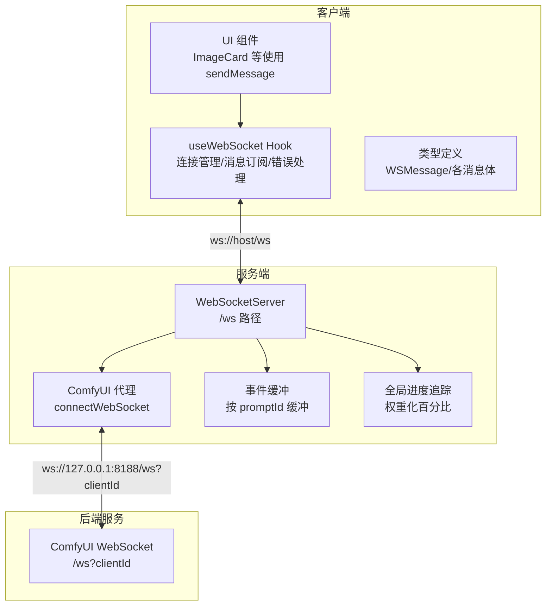
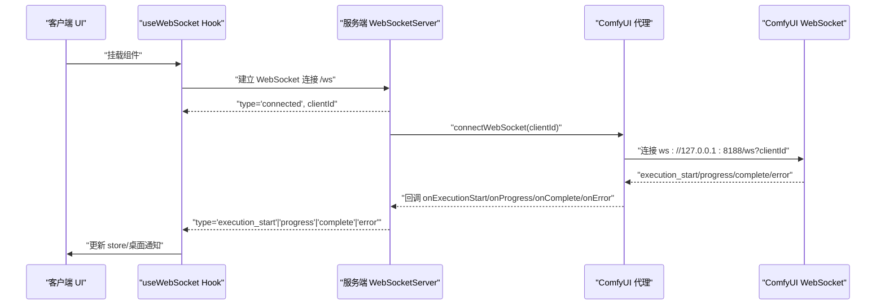
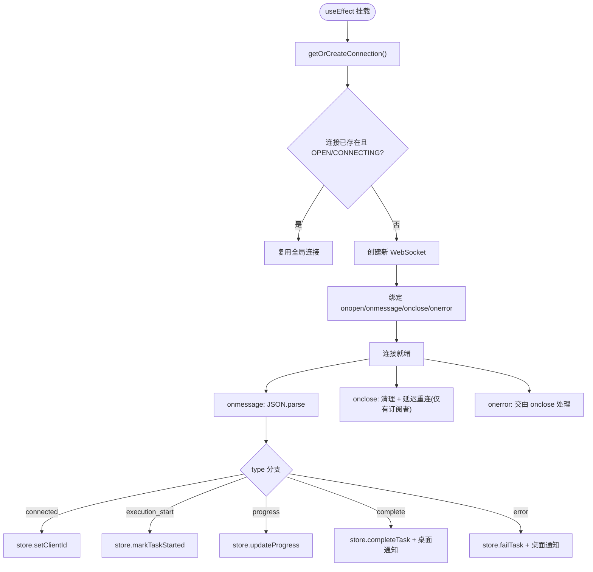
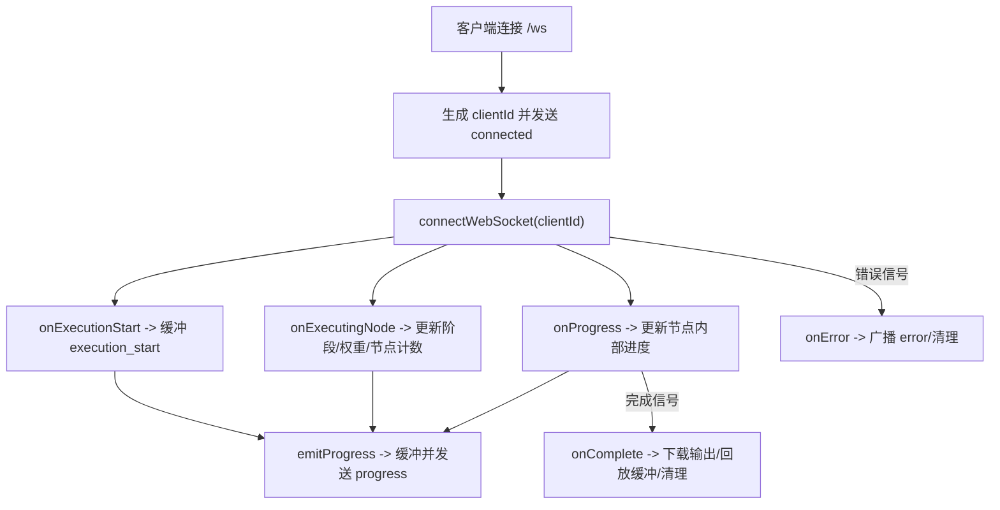
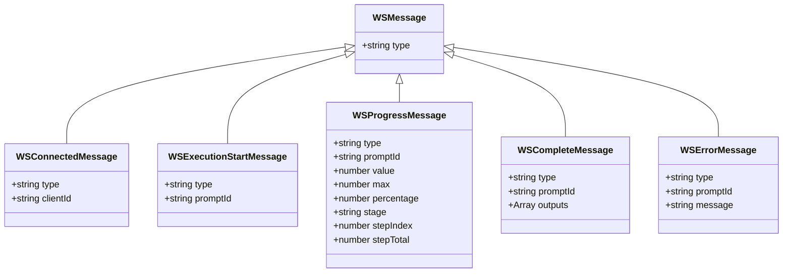
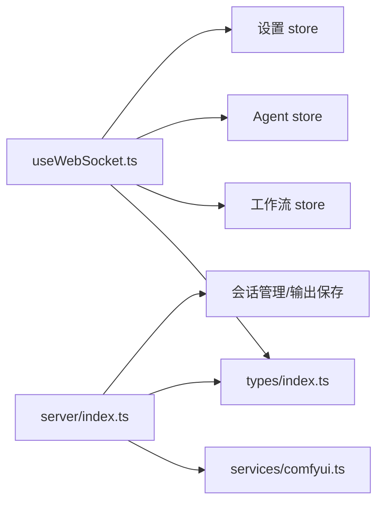

# WebSocket 通信实现

<cite>
**本文引用的文件**
- [useWebSocket.ts](file://client/src/hooks/useWebSocket.ts)
- [index.ts](file://server/src/index.ts)
- [index.ts](file://client/src/types/index.ts)
- [comfyui.ts](file://server/src/services/comfyui.ts)
- [StatusBar.tsx](file://client/src/components/StatusBar.tsx)
- [ImageCard.tsx](file://client/src/components/ImageCard.tsx)
</cite>

## 目录
1. [引言](#引言)
2. [项目结构](#项目结构)
3. [核心组件](#核心组件)
4. [架构总览](#架构总览)
5. [详细组件分析](#详细组件分析)
6. [依赖关系分析](#依赖关系分析)
7. [性能考虑](#性能考虑)
8. [故障排查指南](#故障排查指南)
9. [结论](#结论)
10. [附录](#附录)

## 引言
本文件面向 CorineKit Pix2Real 的 WebSocket 通信系统，聚焦实时通信的实现机制与 useWebSocket Hook 的设计模式。内容覆盖连接建立、消息格式定义、事件处理流程、与后端服务的通信协议、进度事件与状态更新、错误通知、连接重试与断线恢复、心跳检测策略、序列化与反序列化过程、调试工具与常见问题排查等。

## 项目结构
Pix2Real 的 WebSocket 通信由客户端 Hook 与服务端 WebSocketServer 共同构成，二者通过统一的消息协议进行交互。客户端负责连接管理、消息订阅与错误处理；服务端负责与 ComfyUI 的 WebSocket 代理、进度聚合与事件缓冲、完成与错误事件的最终投递。

图表来源
- [useWebSocket.ts:29-252](file://client/src/hooks/useWebSocket.ts#L29-L252)
- [index.ts:157-494](file://server/src/index.ts#L157-L494)
- [comfyui.ts:265-375](file://server/src/services/comfyui.ts#L265-L375)

章节来源
- [useWebSocket.ts:1-278](file://client/src/hooks/useWebSocket.ts#L1-L278)
- [index.ts:157-494](file://server/src/index.ts#L157-L494)
- [index.ts:1-76](file://client/src/types/index.ts#L1-L76)

## 核心组件
- 客户端 useWebSocket Hook：单例连接、自动重连、消息解析与派发、桌面通知集成、Agent 执行进度同步。
- 服务端 WebSocketServer：/ws 路由、客户端连接管理、事件缓冲、全局进度计算、完成与错误事件投递、与 ComfyUI 的代理连接。
- 类型系统：统一的 WSMessage 及各子类型，确保前后端消息契约一致。
- ComfyUI 代理：连接本地 ComfyUI WebSocket，桥接进度、执行开始、缓存跳过、完成与错误信号。

章节来源
- [useWebSocket.ts:254-277](file://client/src/hooks/useWebSocket.ts#L254-L277)
- [index.ts:157-494](file://server/src/index.ts#L157-L494)
- [index.ts:39-75](file://client/src/types/index.ts#L39-L75)
- [comfyui.ts:265-375](file://server/src/services/comfyui.ts#L265-L375)

## 架构总览
客户端通过 useWebSocket 建立到服务端 /ws 的连接；服务端为每个客户端分配唯一 clientId 并与本地 ComfyUI 的 WebSocket 建立代理连接。服务端维护每个 promptId 的事件缓冲与全局进度状态，向客户端投递 execution_start、progress、complete、error 等事件。客户端据此更新工作流状态、显示进度与输出、触发桌面通知。

图表来源
- [useWebSocket.ts:41-230](file://client/src/hooks/useWebSocket.ts#L41-L230)
- [index.ts:168-464](file://server/src/index.ts#L168-L464)
- [comfyui.ts:304-375](file://server/src/services/comfyui.ts#L304-L375)

## 详细组件分析

### useWebSocket Hook 设计与实现
- 单例连接管理：全局共享 WebSocket 实例，连接计数控制生命周期，关闭时清理定时器与连接。
- 自动重连：断开后延迟重连，仅当存在活跃订阅者时触发。
- 消息订阅与派发：统一 JSON.parse，按 type 分发至工作流与 Agent store，分别更新任务状态与 Agent 执行进度。
- 事件缓冲与回放：客户端注册 promptId 后，服务端回放此前缓冲的 execution_start/progress 事件，保证首卡无等待。
- 桌面通知：根据设置与工作流标签，任务完成/错误时触发系统通知。
- 发送消息：提供 sendMessage 方法，仅在连接 OPEN 时发送 JSON 序列化数据。

图表来源
- [useWebSocket.ts:29-252](file://client/src/hooks/useWebSocket.ts#L29-L252)
- [useWebSocket.ts:41-230](file://client/src/hooks/useWebSocket.ts#L41-L230)

章节来源
- [useWebSocket.ts:29-252](file://client/src/hooks/useWebSocket.ts#L29-L252)
- [useWebSocket.ts:41-230](file://client/src/hooks/useWebSocket.ts#L41-L230)

### 服务端 WebSocketServer 与事件缓冲
- /ws 路由：为每个客户端分配唯一 clientId 并立即发送 connected 消息。
- 事件缓冲：按 promptId 维护最近事件列表，客户端注册后回放，解决“先执行后注册”的竞态。
- 全局进度追踪：基于节点权重与当前节点内部进度，计算权重化百分比，避免回退。
- 完成与错误：完成前等待历史提交与输出下载，错误时清理状态并广播 error。
- 与 ComfyUI 代理：桥接 ComfyUI 的 progress/executing/execution_success/execution_error 等信号，统一为前端事件。

图表来源
- [index.ts:168-464](file://server/src/index.ts#L168-L464)
- [comfyui.ts:304-375](file://server/src/services/comfyui.ts#L304-L375)

章节来源
- [index.ts:168-464](file://server/src/index.ts#L168-L464)
- [comfyui.ts:265-375](file://server/src/services/comfyui.ts#L265-L375)

### 消息格式与事件处理流程
- 消息类型：connected、execution_start、progress、complete、error。
- 客户端侧类型定义：WSConnectedMessage、WSExecutionStartMessage、WSProgressMessage、WSCompleteMessage、WSErrorMessage。
- 事件处理：客户端按 type 分发到工作流 store 与 Agent store；服务端按节点权重与内部进度计算全局百分比，避免回退。

图表来源
- [index.ts:39-75](file://client/src/types/index.ts#L39-L75)

章节来源
- [index.ts:39-75](file://client/src/types/index.ts#L39-L75)

### 与后端服务的通信协议
- 客户端注册：向服务端发送 register 消息，携带 promptId、workflowId、sessionId、tabId，服务端回放缓冲事件。
- 输出下载：完成事件包含输出文件名与 URL，服务端将 ComfyUI 输出下载到会话目录并返回 URL 列表。
- 错误通知：错误事件包含错误信息，客户端触发桌面通知与状态更新。
- Agent 执行：服务端为 Agent 执行提供独立的进度与完成事件，支持批量模式的增量完成与最终合并。

章节来源
- [index.ts:467-488](file://server/src/index.ts#L467-L488)
- [index.ts:335-448](file://server/src/index.ts#L335-L448)
- [useWebSocket.ts:164-229](file://client/src/hooks/useWebSocket.ts#L164-L229)

### 连接重试机制与断线恢复
- 客户端：断开时延迟重连，仅在存在活跃订阅者时触发；连接计数为 0 时关闭连接并取消重连定时器。
- 服务端：客户端断开时关闭与 ComfyUI 的代理连接；客户端重新连接后重建代理。
- 事件缓冲：客户端注册后回放缓冲事件，避免首卡无进度。

章节来源
- [useWebSocket.ts:232-244](file://client/src/hooks/useWebSocket.ts#L232-L244)
- [useWebSocket.ts:259-268](file://client/src/hooks/useWebSocket.ts#L259-L268)
- [index.ts:490-494](file://server/src/index.ts#L490-L494)

### 心跳检测与性能优化策略
- 心跳检测：当前实现未见专用 ping/pong 心跳；建议在服务端与客户端增加定期 ping/pong 以检测空闲连接存活。
- 性能优化：
  - 事件缓冲：按 promptId 缓存最近事件，减少重复投递。
  - 权重化进度：基于节点权重与内部进度计算全局百分比，避免 UI 回退。
  - 输出下载：仅在存在有效 sessionId 时下载，节省带宽与日志噪音。
  - 桌面通知异步：生成日志与通知异步执行，不阻塞 UI。

章节来源
- [index.ts:175-185](file://server/src/index.ts#L175-L185)
- [index.ts:240-271](file://server/src/index.ts#L240-L271)
- [index.ts:373-420](file://server/src/index.ts#L373-L420)
- [useWebSocket.ts:129-140](file://client/src/hooks/useWebSocket.ts#L129-L140)

### 消息序列化与反序列化
- 客户端：发送前 JSON.stringify，接收后 JSON.parse，按 type 分发。
- 服务端：接收客户端消息时 JSON.parse，向客户端发送时 JSON.stringify。
- 类型安全：通过 TS 类型定义约束消息结构，降低运行时错误。

章节来源
- [useWebSocket.ts:47-47](file://client/src/hooks/useWebSocket.ts#L47-L47)
- [useWebSocket.ts:272-272](file://client/src/hooks/useWebSocket.ts#L272-L272)
- [index.ts:469-469](file://server/src/index.ts#L469-L469)
- [index.ts:424-424](file://server/src/index.ts#L424-L424)

### 使用示例与调用路径
- 组件使用：多个 UI 组件通过 useWebSocket 获取 sendMessage，用于向服务端发送注册等消息。
- 示例路径：[ImageCard.tsx:100](file://client/src/components/ImageCard.tsx#L100) 获取 sendMessage。

章节来源
- [ImageCard.tsx:100](file://client/src/components/ImageCard.tsx#L100)

## 依赖关系分析
- 客户端 useWebSocket 依赖：
  - 工作流 store：任务状态与进度更新。
  - Agent store：Agent 执行进度与批量完成合并。
  - 设置 store：桌面通知开关。
  - 类型系统：WSMessage 及各消息体。
- 服务端 WebSocketServer 依赖：
  - ComfyUI 代理：connectWebSocket、进度回调、完成与错误处理。
  - 会话管理：输出文件保存与 URL 返回。
  - 节点信息：节点权重与阶段名称映射。

图表来源
- [useWebSocket.ts:1-8](file://client/src/hooks/useWebSocket.ts#L1-L8)
- [index.ts:157-494](file://server/src/index.ts#L157-L494)
- [comfyui.ts:265-375](file://server/src/services/comfyui.ts#L265-L375)

章节来源
- [useWebSocket.ts:1-8](file://client/src/hooks/useWebSocket.ts#L1-L8)
- [index.ts:157-494](file://server/src/index.ts#L157-L494)
- [comfyui.ts:265-375](file://server/src/services/comfyui.ts#L265-L375)

## 性能考虑
- 连接复用：单例连接减少资源消耗与握手开销。
- 事件缓冲：避免重复投递与 UI 抖动。
- 权重化进度：平滑进度曲线，提升用户体验。
- 异步操作：桌面通知与生成日志异步执行，避免阻塞主线程。
- 输出下载：仅在需要时下载，减少网络与磁盘压力。

## 故障排查指南
- 无法连接 /ws：
  - 检查服务端是否启动并监听端口。
  - 查看浏览器控制台与服务端日志，确认 onerror/onclose 是否触发。
- 进度不更新：
  - 确认客户端已发送 register 消息并包含正确 promptId。
  - 检查服务端是否收到 ComfyUI 的 progress/executing 事件。
- 完成但无输出：
  - 等待历史提交与输出下载完成，必要时检查会话目录权限。
  - 关注服务端日志中的“history never reached completed”警告。
- 错误通知：
  - 确认设置 store 中的桌面通知开关。
  - 检查服务端 onerror 分支是否正确广播错误消息。
- 显存/内存监控：
  - 使用状态栏组件的系统统计接口，确认 ComfyUI 可用性与资源占用。

章节来源
- [StatusBar.tsx:68-108](file://client/src/components/StatusBar.tsx#L68-L108)
- [index.ts:335-448](file://server/src/index.ts#L335-L448)
- [useWebSocket.ts:141-158](file://client/src/hooks/useWebSocket.ts#L141-L158)

## 结论
本 WebSocket 通信系统通过客户端 Hook 与服务端 WebSocketServer 的协作，实现了稳定、可扩展的实时通信能力。服务端对 ComfyUI 的代理与事件缓冲机制确保了首卡无等待与进度一致性；客户端的单例连接与自动重连保障了连接可靠性。未来可在心跳检测、批量输出合并、错误重试等方面进一步增强鲁棒性与性能。

## 附录
- 关键实现路径参考：
  - 客户端连接与消息处理：[useWebSocket.ts:29-252](file://client/src/hooks/useWebSocket.ts#L29-L252)
  - 服务端 /ws 路由与事件缓冲：[index.ts:168-464](file://server/src/index.ts#L168-L464)
  - ComfyUI 代理与进度计算：[comfyui.ts:265-375](file://server/src/services/comfyui.ts#L265-L375)
  - 消息类型定义：[index.ts:39-75](file://client/src/types/index.ts#L39-L75)
  - 系统统计与释放缓存：[StatusBar.tsx:68-121](file://client/src/components/StatusBar.tsx#L68-L121)