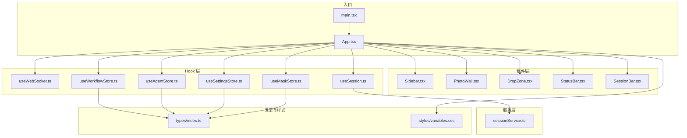
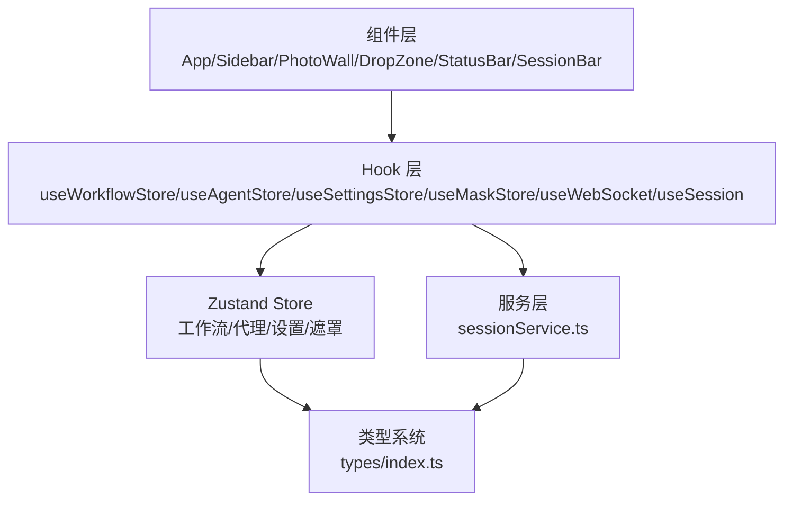
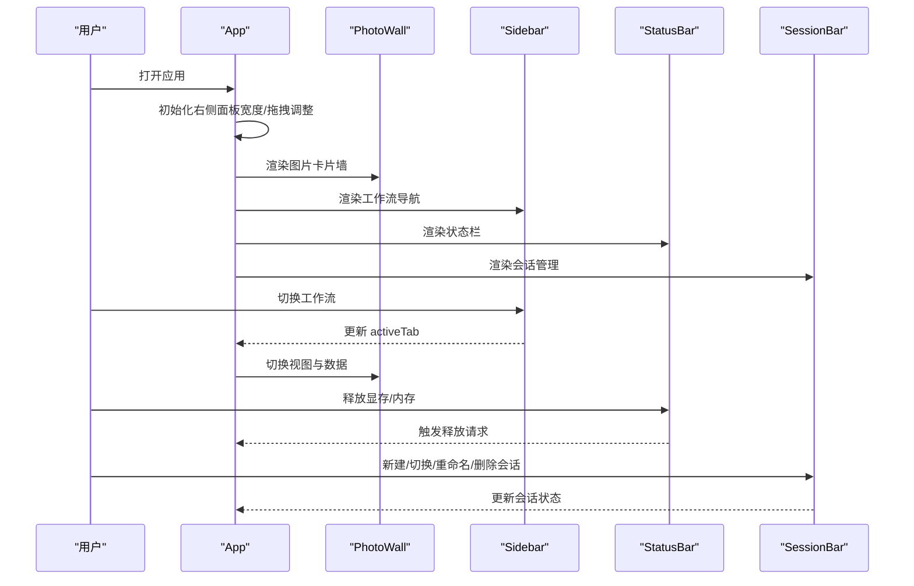
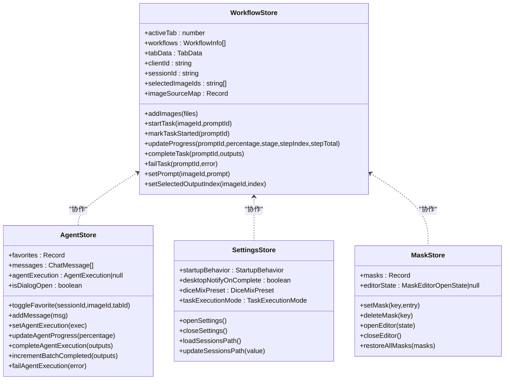
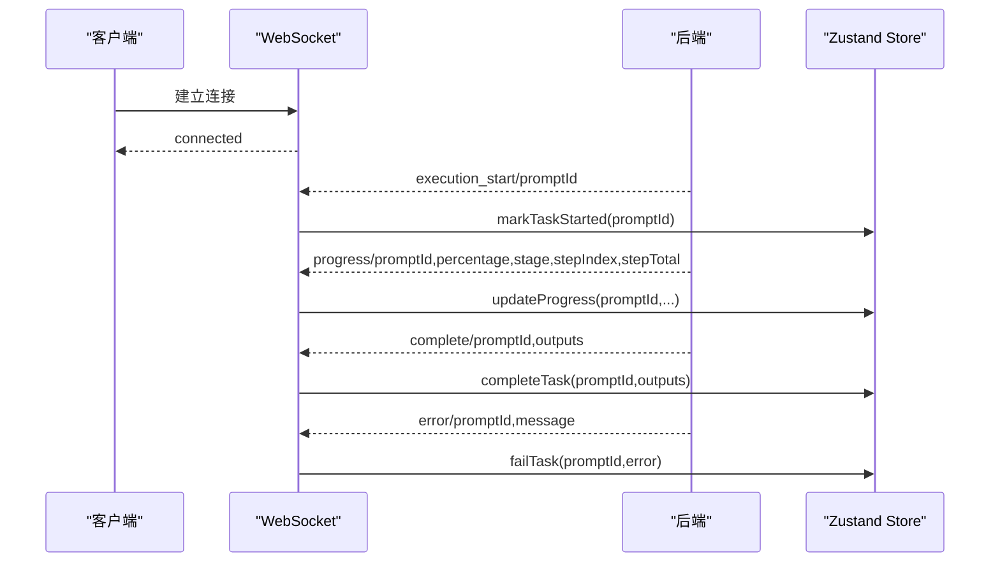
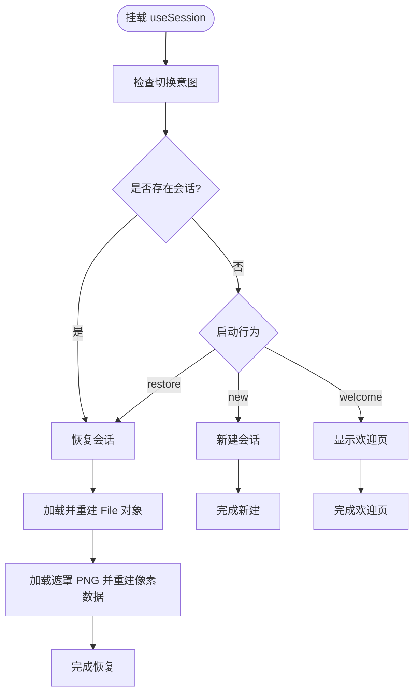
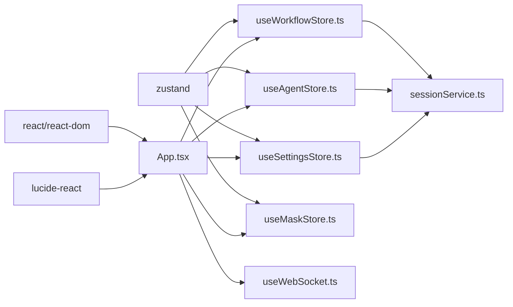

# 前端应用详解

<cite>
**本文档引用的文件**
- [client/package.json](file://client/package.json)
- [client/src/main.tsx](file://client/src/main.tsx)
- [client/src/components/App.tsx](file://client/src/components/App.tsx)
- [client/src/hooks/useWebSocket.ts](file://client/src/hooks/useWebSocket.ts)
- [client/src/hooks/useSession.ts](file://client/src/hooks/useSession.ts)
- [client/src/services/sessionService.ts](file://client/src/services/sessionService.ts)
- [client/src/hooks/useWorkflowStore.ts](file://client/src/hooks/useWorkflowStore.ts)
- [client/src/hooks/useAgentStore.ts](file://client/src/hooks/useAgentStore.ts)
- [client/src/hooks/useSettingsStore.ts](file://client/src/hooks/useSettingsStore.ts)
- [client/src/hooks/useMaskStore.ts](file://client/src/hooks/useMaskStore.ts)
- [client/src/types/index.ts](file://client/src/types/index.ts)
- [client/src/styles/variables.css](file://client/src/styles/variables.css)
- [client/src/components/Sidebar.tsx](file://client/src/components/Sidebar.tsx)
- [client/src/components/PhotoWall.tsx](file://client/src/components/PhotoWall.tsx)
- [client/src/components/DropZone.tsx](file://client/src/components/DropZone.tsx)
- [client/src/components/StatusBar.tsx](file://client/src/components/StatusBar.tsx)
- [client/src/components/SessionBar.tsx](file://client/src/components/SessionBar.tsx)
</cite>

## 目录
1. [简介](#简介)
2. [项目结构](#项目结构)
3. [核心组件](#核心组件)
4. [架构总览](#架构总览)
5. [详细组件分析](#详细组件分析)
6. [依赖关系分析](#依赖关系分析)
7. [性能考虑](#性能考虑)
8. [故障排除指南](#故障排除指南)
9. [结论](#结论)
10. [附录](#附录)

## 简介
本项目是一个基于 React 的前端应用，负责与 ComfyUI 后端进行实时通信，支持多工作流的图像/视频生成与处理。应用采用 Zustand 进行全局状态管理，通过 WebSocket 实时接收任务进度与结果，并提供会话持久化、遮罩编辑、AI 助手等功能。本文档将深入解析组件架构、状态管理、WebSocket 通信、UI 主题与响应式布局以及调试与性能优化策略。

## 项目结构
客户端采用模块化的组织方式，主要分为以下层次：
- 入口与根组件：main.tsx 和 App.tsx 负责应用初始化与顶层布局。
- 组件层：Sidebar、PhotoWall、DropZone、StatusBar、SessionBar 等构成 UI 层。
- Hook 层：useWorkflowStore、useAgentStore、useSettingsStore、useMaskStore、useWebSocket、useSession 等提供状态与副作用管理。
- 服务层：sessionService.ts 封装会话相关的 API 调用。
- 类型定义：types/index.ts 定义了图像、任务、WebSocket 消息等类型。
- 样式层：styles/variables.css 定义主题变量与暗色模式支持。

**图表来源**
- [client/src/main.tsx:1-11](file://client/src/main.tsx#L1-L11)
- [client/src/components/App.tsx:1-422](file://client/src/components/App.tsx#L1-L422)
- [client/src/components/Sidebar.tsx:1-434](file://client/src/components/Sidebar.tsx#L1-L434)
- [client/src/components/PhotoWall.tsx:1-200](file://client/src/components/PhotoWall.tsx#L1-L200)
- [client/src/components/DropZone.tsx:1-181](file://client/src/components/DropZone.tsx#L1-L181)
- [client/src/components/StatusBar.tsx:1-243](file://client/src/components/StatusBar.tsx#L1-L243)
- [client/src/components/SessionBar.tsx:1-381](file://client/src/components/SessionBar.tsx#L1-L381)
- [client/src/hooks/useWebSocket.ts:1-278](file://client/src/hooks/useWebSocket.ts#L1-L278)
- [client/src/hooks/useWorkflowStore.ts:1-800](file://client/src/hooks/useWorkflowStore.ts#L1-L800)
- [client/src/hooks/useAgentStore.ts:1-337](file://client/src/hooks/useAgentStore.ts#L1-L337)
- [client/src/hooks/useSettingsStore.ts:1-177](file://client/src/hooks/useSettingsStore.ts#L1-L177)
- [client/src/hooks/useMaskStore.ts:1-51](file://client/src/hooks/useMaskStore.ts#L1-L51)
- [client/src/hooks/useSession.ts:1-435](file://client/src/hooks/useSession.ts#L1-L435)
- [client/src/services/sessionService.ts:1-232](file://client/src/services/sessionService.ts#L1-L232)
- [client/src/types/index.ts:1-76](file://client/src/types/index.ts#L1-L76)
- [client/src/styles/variables.css:1-31](file://client/src/styles/variables.css#L1-L31)

**章节来源**
- [client/src/main.tsx:1-11](file://client/src/main.tsx#L1-L11)
- [client/src/components/App.tsx:1-422](file://client/src/components/App.tsx#L1-L422)

## 核心组件
本节聚焦于应用的核心组件及其职责：
- App：应用根容器，负责布局、拖拽处理、右侧面板宽度控制、欢迎页与主题切换、全局状态订阅与 WebSocket 初始化。
- Sidebar：工作流导航与任务队列管理，支持拖拽复制图片到目标工作流、显示处理中的任务指示。
- PhotoWall：图片卡片墙，支持懒加载、多选、批量操作、删除区域拖拽、自动滚动至新生成卡片。
- DropZone：拖放区域，支持图片/视频拖放与文件夹递归读取。
- StatusBar：状态栏，显示自动保存时间、打开输出目录、释放显存/内存、VRAM/RAM 使用率。
- SessionBar：会话管理，支持新建、切换、重命名、删除会话。

**章节来源**
- [client/src/components/App.tsx:61-422](file://client/src/components/App.tsx#L61-L422)
- [client/src/components/Sidebar.tsx:26-434](file://client/src/components/Sidebar.tsx#L26-L434)
- [client/src/components/PhotoWall.tsx:103-200](file://client/src/components/PhotoWall.tsx#L103-L200)
- [client/src/components/DropZone.tsx:40-181](file://client/src/components/DropZone.tsx#L40-L181)
- [client/src/components/StatusBar.tsx:44-243](file://client/src/components/StatusBar.tsx#L44-L243)
- [client/src/components/SessionBar.tsx:26-381](file://client/src/components/SessionBar.tsx#L26-L381)

## 架构总览
应用采用“组件 + Hook + Zustand Store + 服务层”的分层架构：
- 组件层：负责 UI 渲染与用户交互。
- Hook 层：封装状态逻辑与副作用（WebSocket、会话、设置、遮罩等）。
- Zustand Store：集中管理应用状态（工作流、代理、设置、遮罩）。
- 服务层：封装 API 调用（会话持久化、系统统计、队列管理等）。
- 类型系统：统一的数据结构与消息格式，确保前后端一致性。

**图表来源**
- [client/src/components/App.tsx:1-422](file://client/src/components/App.tsx#L1-L422)
- [client/src/hooks/useWorkflowStore.ts:1-800](file://client/src/hooks/useWorkflowStore.ts#L1-L800)
- [client/src/hooks/useAgentStore.ts:1-337](file://client/src/hooks/useAgentStore.ts#L1-L337)
- [client/src/hooks/useSettingsStore.ts:1-177](file://client/src/hooks/useSettingsStore.ts#L1-L177)
- [client/src/hooks/useMaskStore.ts:1-51](file://client/src/hooks/useMaskStore.ts#L1-L51)
- [client/src/hooks/useWebSocket.ts:1-278](file://client/src/hooks/useWebSocket.ts#L1-L278)
- [client/src/hooks/useSession.ts:1-435](file://client/src/hooks/useSession.ts#L1-L435)
- [client/src/services/sessionService.ts:1-232](file://client/src/services/sessionService.ts#L1-L232)
- [client/src/types/index.ts:1-76](file://client/src/types/index.ts#L1-L76)

## 详细组件分析

### 组件层次结构与生命周期管理
- App 作为根组件，负责：
  - 初始化右侧面板宽度与拖拽调整逻辑。
  - 处理全局拖拽事件，过滤外部拖入的文件类型。
  - 订阅会话状态变化，加载收藏项。
  - 渲染欢迎页、主题切换、状态栏与遮罩编辑器。
- PhotoWall：
  - 使用 IntersectionObserver 实现懒加载，减少首屏渲染压力。
  - 支持多选、全选、反选、批量重命名、删除输出。
  - 自动滚动至新生成卡片，提升用户体验。
- Sidebar：
  - 导航工作流，浮动指示器动画跟随激活项。
  - 队列面板定时轮询，显示运行中/等待中的任务数量。
  - 支持卡片拖拽到其他工作流，自动过滤文件类型。
- DropZone：
  - 支持文件夹递归读取，过滤图片/视频类型。
  - 提供点击选择文件的后备方案。
- StatusBar：
  - 定时轮询系统资源使用情况，平滑过渡显示。
  - 提供释放显存/内存按钮，受队列执行状态保护。
- SessionBar：
  - 新建会话、切换会话、重命名、删除会话。
  - 通过 localStorage 与 sessionStorage 管理会话名称与切换意图。

**图表来源**
- [client/src/components/App.tsx:61-422](file://client/src/components/App.tsx#L61-L422)
- [client/src/components/PhotoWall.tsx:103-200](file://client/src/components/PhotoWall.tsx#L103-L200)
- [client/src/components/Sidebar.tsx:26-434](file://client/src/components/Sidebar.tsx#L26-L434)
- [client/src/components/StatusBar.tsx:44-243](file://client/src/components/StatusBar.tsx#L44-L243)
- [client/src/components/SessionBar.tsx:26-381](file://client/src/components/SessionBar.tsx#L26-L381)

**章节来源**
- [client/src/components/App.tsx:61-422](file://client/src/components/App.tsx#L61-L422)
- [client/src/components/PhotoWall.tsx:103-200](file://client/src/components/PhotoWall.tsx#L103-L200)
- [client/src/components/Sidebar.tsx:26-434](file://client/src/components/Sidebar.tsx#L26-L434)
- [client/src/components/DropZone.tsx:40-181](file://client/src/components/DropZone.tsx#L40-L181)
- [client/src/components/StatusBar.tsx:44-243](file://client/src/components/StatusBar.tsx#L44-L243)
- [client/src/components/SessionBar.tsx:26-381](file://client/src/components/SessionBar.tsx#L26-L381)

### 状态管理设计（Zustand）
应用广泛使用 Zustand 进行状态管理，核心 Store 如下：
- useWorkflowStore：管理工作流 Tab 数据、任务状态、提示词、输出索引、选择状态、生成来源标记等。
- useAgentStore：管理 AI 助手对话、执行状态、收藏、上传图片、配置快照等。
- useSettingsStore：管理设置项（启动行为、通知、Dice 参数、任务执行模式等），并持久化到 localStorage。
- useMaskStore：管理遮罩数据与编辑器状态。
- useSession：集中管理会话生命周期（创建、恢复、保存、删除），与服务端 API 交互。

**图表来源**
- [client/src/hooks/useWorkflowStore.ts:101-183](file://client/src/hooks/useWorkflowStore.ts#L101-L183)
- [client/src/hooks/useAgentStore.ts:96-185](file://client/src/hooks/useAgentStore.ts#L96-L185)
- [client/src/hooks/useSettingsStore.ts:19-52](file://client/src/hooks/useSettingsStore.ts#L19-L52)
- [client/src/hooks/useMaskStore.ts:21-30](file://client/src/hooks/useMaskStore.ts#L21-L30)

**章节来源**
- [client/src/hooks/useWorkflowStore.ts:101-800](file://client/src/hooks/useWorkflowStore.ts#L101-L800)
- [client/src/hooks/useAgentStore.ts:198-337](file://client/src/hooks/useAgentStore.ts#L198-L337)
- [client/src/hooks/useSettingsStore.ts:54-177](file://client/src/hooks/useSettingsStore.ts#L54-L177)
- [client/src/hooks/useMaskStore.ts:32-51](file://client/src/hooks/useMaskStore.ts#L32-L51)

### WebSocket 通信实现
WebSocket 用于实时接收任务进度与结果，实现如下：
- 单例连接：全局维护一个 WebSocket 实例，避免重复连接。
- 自动重连：断线后延迟重连，仅当存在订阅者时尝试重连。
- 消息分发：根据消息类型更新工作流状态或代理执行状态。
- 任务完成与错误：触发桌面通知与生成日志记录。
- Agent 执行：支持批量生成模式下的进度与完成聚合。

**图表来源**
- [client/src/hooks/useWebSocket.ts:29-278](file://client/src/hooks/useWebSocket.ts#L29-L278)
- [client/src/types/index.ts:39-76](file://client/src/types/index.ts#L39-L76)

**章节来源**
- [client/src/hooks/useWebSocket.ts:29-278](file://client/src/hooks/useWebSocket.ts#L29-L278)
- [client/src/types/index.ts:39-76](file://client/src/types/index.ts#L39-L76)

### 会话数据管理
会话管理贯穿应用生命周期：
- 会话 ID：首次使用生成 UUID 并持久化到 localStorage。
- 恢复策略：根据设置决定“恢复上次”、“新建”或“欢迎页”。
- 图像上传：监听工作流 Store 变化，异步上传新增图像并更新 sessionUrl。
- 遮罩保存：监听遮罩 Store 变化，将遮罩转换为 PNG 并上传。
- 状态保存：防抖保存工作流状态，空会话不保存。
- 退出清理：beforeunload 使用 Beacon 发送最终状态，必要时删除空会话。

**图表来源**
- [client/src/hooks/useSession.ts:294-435](file://client/src/hooks/useSession.ts#L294-L435)
- [client/src/services/sessionService.ts:88-152](file://client/src/services/sessionService.ts#L88-L152)

**章节来源**
- [client/src/hooks/useSession.ts:118-435](file://client/src/hooks/useSession.ts#L118-L435)
- [client/src/services/sessionService.ts:88-232](file://client/src/services/sessionService.ts#L88-L232)

### UI 组件库与主题系统
- 图标库：使用 lucide-react 提供图标。
- 主题系统：通过 CSS 变量与 data-theme 属性实现明/暗主题切换。
- 响应式布局：使用 CSS 变量控制间距与颜色，配合 Flexbox 与相对定位实现自适应布局。
- 动画与交互：浮动指示器、队列面板弹出、删除区域高亮、懒加载占位符等增强用户体验。

**章节来源**
- [client/src/styles/variables.css:1-31](file://client/src/styles/variables.css#L1-L31)
- [client/src/components/Sidebar.tsx:26-434](file://client/src/components/Sidebar.tsx#L26-L434)
- [client/src/components/PhotoWall.tsx:21-97](file://client/src/components/PhotoWall.tsx#L21-L97)

## 依赖关系分析
- 依赖声明：React、ReactDOM、lucide-react、zustand。
- 组件间依赖：App 依赖多个 Hook 与组件；PhotoWall 依赖 WebSocket Hook；Sidebar 依赖队列 API；StatusBar 依赖系统统计 API。
- 状态耦合：Workflow Store 与 Agent Store 存在协作关系（收藏、执行状态）；Settings Store 与 Session Store 通过设置影响启动行为。

**图表来源**
- [client/package.json:11-26](file://client/package.json#L11-L26)
- [client/src/components/App.tsx:1-422](file://client/src/components/App.tsx#L1-L422)
- [client/src/hooks/useWorkflowStore.ts:1-800](file://client/src/hooks/useWorkflowStore.ts#L1-L800)
- [client/src/hooks/useAgentStore.ts:1-337](file://client/src/hooks/useAgentStore.ts#L1-L337)
- [client/src/hooks/useSettingsStore.ts:1-177](file://client/src/hooks/useSettingsStore.ts#L1-L177)
- [client/src/hooks/useMaskStore.ts:1-51](file://client/src/hooks/useMaskStore.ts#L1-L51)
- [client/src/hooks/useWebSocket.ts:1-278](file://client/src/hooks/useWebSocket.ts#L1-L278)
- [client/src/services/sessionService.ts:1-232](file://client/src/services/sessionService.ts#L1-L232)

**章节来源**
- [client/package.json:11-26](file://client/package.json#L11-L26)

## 性能考虑
- 懒加载：PhotoWall 使用 IntersectionObserver 与占位符，减少首屏渲染与滚动抖动。
- 防抖保存：会话状态保存使用防抖，避免频繁网络请求。
- 单例 WebSocket：避免重复连接与资源浪费。
- 资源轮询平滑：StatusBar 使用 requestAnimationFrame 与目标值插值，平滑显示 VRAM/RAM 使用率。
- 文件预览：视频首帧提取为 JPEG，降低预览成本。
- 选择性渲染：多选状态与批量操作仅在需要时触发重渲染。

[本节为通用性能建议，无需特定文件引用]

## 故障排除指南
- WebSocket 断线重连：检查连接计数与重连定时器，确认订阅者数量。
- 任务进度不更新：确认 promptId 与 imageId 映射正确，检查 markTaskStarted 与 updateProgress 的调用顺序。
- 会话恢复失败：检查服务端返回状态与文件存在性，确认 HEAD 请求与 Blob 转 File 的流程。
- 系统统计不可用：确认 /api/workflow/system-stats 接口可达，注意轮询间隔与异常捕获。
- 遮罩上传失败：确认 FormData 字段与 maskKey 格式，检查服务端接口返回。

**章节来源**
- [client/src/hooks/useWebSocket.ts:232-278](file://client/src/hooks/useWebSocket.ts#L232-L278)
- [client/src/hooks/useSession.ts:319-435](file://client/src/hooks/useSession.ts#L319-L435)
- [client/src/components/StatusBar.tsx:67-108](file://client/src/components/StatusBar.tsx#L67-L108)

## 结论
本应用通过清晰的分层架构与 Zustand 状态管理，实现了高效、可维护的图像/视频生成前端体验。WebSocket 实时通信与会话持久化保证了工作流的连续性与可靠性。UI 组件注重性能与交互细节，结合主题系统与响应式布局，提供了良好的用户体验。后续可在性能监控、错误边界与国际化方面进一步完善。

[本节为总结性内容，无需特定文件引用]

## 附录
- 开发工具：Vite + TypeScript，支持热重载与类型检查。
- 调试技巧：利用浏览器开发者工具观察 WebSocket 消息、Zustand 状态变化、网络请求与资源使用情况。
- 常见问题：
  - 无法连接 WebSocket：检查协议与主机地址，确认服务端 WebSocket 端点。
  - 任务卡住：查看任务状态与进度消息，确认 imagePromptMap 与 promptId 映射。
  - 会话为空：确认防抖保存逻辑与空会话删除条件。

[本节为补充信息，无需特定文件引用]