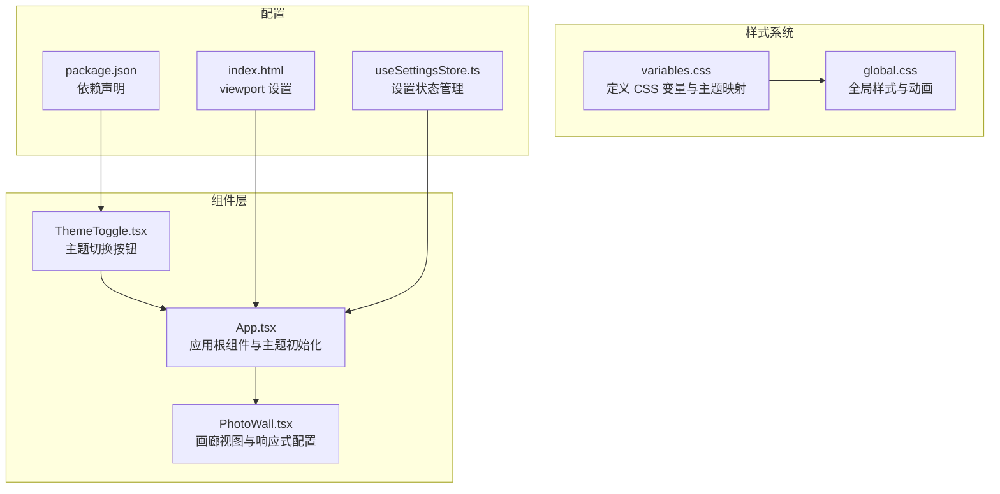
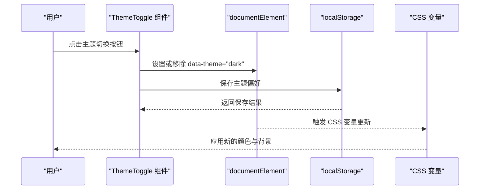
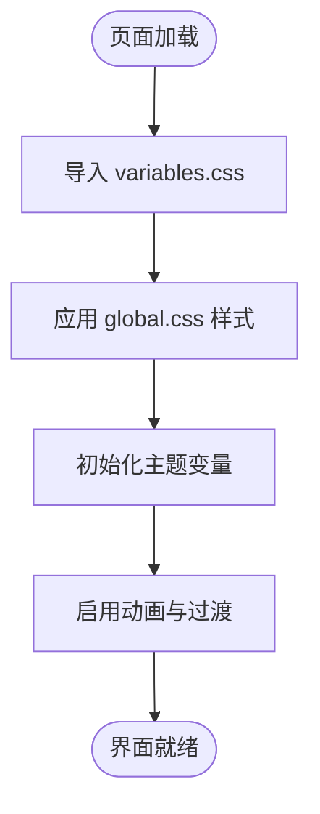
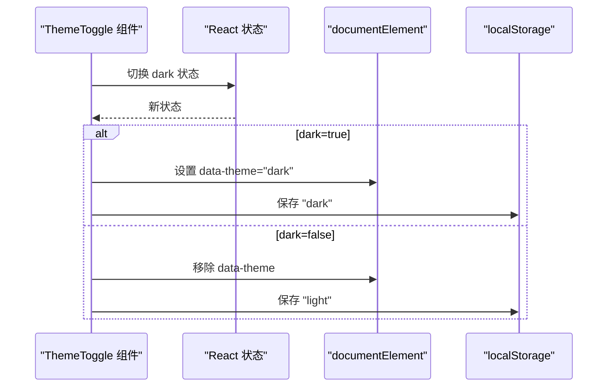
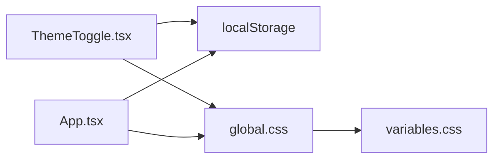

# 响应式布局与主题系统

<cite>
**本文档引用的文件**
- [variables.css](file://client/src/styles/variables.css)
- [global.css](file://client/src/styles/global.css)
- [ThemeToggle.tsx](file://client/src/components/ThemeToggle.tsx)
- [App.tsx](file://client/src/components/App.tsx)
- [PhotoWall.tsx](file://client/src/components/PhotoWall.tsx)
- [index.html](file://client/index.html)
- [useSettingsStore.ts](file://client/src/hooks/useSettingsStore.ts)
- [package.json](file://client/package.json)
</cite>

## 目录
1. [简介](#简介)
2. [项目结构](#项目结构)
3. [核心组件](#核心组件)
4. [架构概览](#架构概览)
5. [详细组件分析](#详细组件分析)
6. [依赖关系分析](#依赖关系分析)
7. [性能考量](#性能考量)
8. [故障排除指南](#故障排除指南)
9. [结论](#结论)
10. [附录](#附录)

## 简介
本文件针对 CorineKit Pix2Real 的响应式布局与主题系统进行深入技术解析，重点覆盖：
- CSS 变量系统的设计与实现：主题变量定义、颜色体系与间距规范
- 响应式布局策略：断点设计、网格系统与组件自适应
- 主题切换机制：暗色模式实现、CSS 变量动态更新与用户偏好持久化
- 移动端适配、高分辨率屏幕支持与无障碍访问考虑
- 样式系统扩展指南与最佳实践

## 项目结构
客户端样式系统采用模块化组织，核心文件位于 client/src/styles 目录，配合 React 组件实现主题与布局控制。



**图表来源**
- [variables.css:1-31](file://client/src/styles/variables.css#L1-L31)
- [global.css:1-300](file://client/src/styles/global.css#L1-L300)
- [ThemeToggle.tsx:1-39](file://client/src/components/ThemeToggle.tsx#L1-L39)
- [App.tsx:1-422](file://client/src/components/App.tsx#L1-L422)
- [PhotoWall.tsx:1-200](file://client/src/components/PhotoWall.tsx#L1-L200)
- [index.html:1-16](file://client/index.html#L1-L16)
- [useSettingsStore.ts:1-177](file://client/src/hooks/useSettingsStore.ts#L1-L177)
- [package.json:1-26](file://client/package.json#L1-L26)

**章节来源**
- [variables.css:1-31](file://client/src/styles/variables.css#L1-L31)
- [global.css:1-300](file://client/src/styles/global.css#L1-L300)
- [ThemeToggle.tsx:1-39](file://client/src/components/ThemeToggle.tsx#L1-L39)
- [App.tsx:1-422](file://client/src/components/App.tsx#L1-L422)
- [PhotoWall.tsx:1-200](file://client/src/components/PhotoWall.tsx#L1-L200)
- [index.html:1-16](file://client/index.html#L1-L16)
- [useSettingsStore.ts:1-177](file://client/src/hooks/useSettingsStore.ts#L1-L177)
- [package.json:1-26](file://client/package.json#L1-L26)

## 核心组件
- CSS 变量系统：通过 :root 和 [data-theme="dark"] 定义基础颜色与间距变量，实现明暗主题切换
- 全局样式：统一字体、滚动条、动画与交互样式，确保主题变量生效
- 主题切换组件：基于本地存储的状态切换 data-theme 属性
- 应用根组件：初始化主题状态并在挂载时读取用户偏好
- 画廊组件：提供视图尺寸配置，支撑响应式布局

**章节来源**
- [variables.css:1-31](file://client/src/styles/variables.css#L1-L31)
- [global.css:1-300](file://client/src/styles/global.css#L1-L300)
- [ThemeToggle.tsx:1-39](file://client/src/components/ThemeToggle.tsx#L1-L39)
- [App.tsx:131-136](file://client/src/components/App.tsx#L131-L136)

## 架构概览
主题系统采用“CSS 变量 + HTML 属性”的轻量级实现，避免运行时样式计算成本，提升渲染性能。



**图表来源**
- [ThemeToggle.tsx:5-17](file://client/src/components/ThemeToggle.tsx#L5-L17)
- [App.tsx:131-136](file://client/src/components/App.tsx#L131-L136)
- [variables.css:21-30](file://client/src/styles/variables.css#L21-L30)

## 详细组件分析

### CSS 变量系统
- 变量定义位置：根作用域定义基础变量，暗色主题选择器覆盖关键变量
- 颜色体系：主色、背景、表面、文本、边框、遮罩、成功/错误等分类明确
- 间距规范：提供 xs/sm/md/lg/xl 多级间距，便于组件间一致性布局
- 动态更新：通过 data-theme 属性切换，CSS 变量自动生效

```mermaid
classDiagram
class RootVariables {
"+--color-primary"
"+--color-bg"
"+--color-surface"
"+--color-text"
"+--spacing-md"
"+...其他变量"
}
class DarkThemeOverride {
"[data-theme='dark']"
"+覆盖背景/表面/文本/边框等"
}
RootVariables <|-- DarkThemeOverride
```

**图表来源**
- [variables.css:1-31](file://client/src/styles/variables.css#L1-L31)

**章节来源**
- [variables.css:1-31](file://client/src/styles/variables.css#L1-L31)

### 全局样式与动画
- 字体与排版：继承系统字体栈，使用 CSS 变量控制文本颜色
- 滚动条：通过伪元素与 CSS 变量实现主题一致的滚动条样式
- 动画系统：提供多种动画（脉冲、旋转、波浪、发光等），广泛用于组件反馈
- 骨架屏：基于 CSS 变量的主题化加载效果



**图表来源**
- [global.css:1-300](file://client/src/styles/global.css#L1-L300)

**章节来源**
- [global.css:1-300](file://client/src/styles/global.css#L1-L300)

### 主题切换组件
- 状态管理：使用 React useState 与 useEffect 实现切换逻辑
- 本地存储：通过 localStorage 持久化用户偏好
- DOM 操作：直接操作 documentElement 的 data-theme 属性触发 CSS 变量切换



**图表来源**
- [ThemeToggle.tsx:1-39](file://client/src/components/ThemeToggle.tsx#L1-L39)

**章节来源**
- [ThemeToggle.tsx:1-39](file://client/src/components/ThemeToggle.tsx#L1-L39)

### 应用根组件中的主题初始化
- 首次加载：从 localStorage 读取主题偏好并设置到 documentElement
- 与组件协作：ThemeToggle 与 App 共同维护主题状态一致性

**章节来源**
- [App.tsx:131-136](file://client/src/components/App.tsx#L131-L136)

### 响应式布局与网格系统
- 断点策略：未在样式中显式定义媒体查询，采用基于 CSS 变量与组件配置的自适应方案
- 网格系统：PhotoWall 提供视图尺寸配置（small/medium/large），通过列宽与卡片高度估算实现不同密度显示
- 组件自适应：容器使用 flex 布局，配合最小宽度与高度约束，保证内容区域在不同视口下的可用性

```mermaid
classDiagram
class PhotoWall {
"+viewSize : small|medium|large"
"+VIEW_CONFIG"
"+LazyCard 懒加载"
"+IntersectionObserver"
}
class VIEW_CONFIG {
"+small : columnWidth='180px'"
"+medium : columnWidth='280px'"
"+large : columnWidth='600px'"
}
PhotoWall --> VIEW_CONFIG : "使用"
```

**图表来源**
- [PhotoWall.tsx:13-19](file://client/src/components/PhotoWall.tsx#L13-L19)

**章节来源**
- [PhotoWall.tsx:13-19](file://client/src/components/PhotoWall.tsx#L13-L19)

### 视口与移动端适配
- 视口设置：index.html 中配置了标准 viewport meta，确保移动端缩放与显示正确
- 字体加载：预连接 Google Fonts，提升移动端首屏字体渲染性能
- 交互适配：全局样式中包含滚动条、输入控件与拖拽状态的移动端友好处理

**章节来源**
- [index.html:1-16](file://client/index.html#L1-L16)
- [global.css:1-300](file://client/src/styles/global.css#L1-L300)

### 无障碍访问考虑
- 对比度：明暗主题下颜色变量确保文本与背景具备基本对比度
- 键盘焦点：全局样式中未发现专门的焦点可见性样式，建议在后续迭代中补充
- 屏幕阅读器：组件未使用 aria-* 属性，建议在关键交互组件中增加语义化标记

**章节来源**
- [variables.css:1-31](file://client/src/styles/variables.css#L1-L31)
- [global.css:1-300](file://client/src/styles/global.css#L1-L300)

## 依赖关系分析
- 组件依赖：ThemeToggle 依赖 localStorage 进行偏好持久化；App 在挂载时读取偏好以保持一致性
- 样式依赖：global.css 通过 @import 引入 variables.css，确保变量优先级与覆盖规则
- 动画依赖：大量 CSS 动画与属性动画依赖于 CSS 变量，实现主题联动



**图表来源**
- [ThemeToggle.tsx:1-39](file://client/src/components/ThemeToggle.tsx#L1-L39)
- [App.tsx:131-136](file://client/src/components/App.tsx#L131-L136)
- [global.css:1-300](file://client/src/styles/global.css#L1-L300)
- [variables.css:1-31](file://client/src/styles/variables.css#L1-L31)

**章节来源**
- [ThemeToggle.tsx:1-39](file://client/src/components/ThemeToggle.tsx#L1-L39)
- [App.tsx:131-136](file://client/src/components/App.tsx#L131-L136)
- [global.css:1-300](file://client/src/styles/global.css#L1-L300)
- [variables.css:1-31](file://client/src/styles/variables.css#L1-L31)

## 性能考量
- CSS 变量切换：无需重排重绘，仅更新 CSS 变量值，性能开销极低
- 动画优化：使用 GPU 加速的 outline 与 transform，避免昂贵的 box-shadow 动画
- 懒加载：PhotoWall 使用 IntersectionObserver 实现懒渲染，减少初始渲染压力
- 动画节流：骨架屏与过渡动画采用合理的缓动函数与持续时间，平衡体验与性能

**章节来源**
- [global.css:119-131](file://client/src/styles/global.css#L119-L131)
- [PhotoWall.tsx:21-97](file://client/src/components/PhotoWall.tsx#L21-L97)

## 故障排除指南
- 主题切换无效
  - 检查 localStorage 中是否存在 theme 键及其值
  - 确认 documentElement 上是否正确设置了 data-theme 属性
  - 验证 variables.css 是否被正确导入
- 样式不随主题变化
  - 确保使用 var(--variable-name) 而非硬编码颜色值
  - 检查暗色主题选择器是否正确覆盖目标变量
- 响应式布局异常
  - 确认 PhotoWall 的 viewSize 配置与实际使用一致
  - 检查容器的 flex 与 min-width/min-height 设置

**章节来源**
- [ThemeToggle.tsx:5-17](file://client/src/components/ThemeToggle.tsx#L5-L17)
- [App.tsx:131-136](file://client/src/components/App.tsx#L131-L136)
- [variables.css:1-31](file://client/src/styles/variables.css#L1-L31)
- [PhotoWall.tsx:13-19](file://client/src/components/PhotoWall.tsx#L13-L19)

## 结论
该样式系统通过 CSS 变量与 HTML 属性实现了轻量、高性能的主题切换机制，并结合组件化的视图配置提供了良好的响应式体验。建议在未来版本中补充无障碍访问支持与媒体查询断点，进一步完善移动端与高分辨率屏幕的适配。

## 附录

### CSS 变量使用示例路径
- 颜色变量使用：[global.css:24-29](file://client/src/styles/global.css#L24-L29)
- 间距变量使用：[App.tsx:214-216](file://client/src/components/App.tsx#L214-L216)
- 暗色主题覆盖：[variables.css:21-30](file://client/src/styles/variables.css#L21-L30)

### 媒体查询与断点策略
- 当前实现未使用媒体查询，采用基于组件配置的自适应方案
- 如需引入响应式断点，可在 global.css 中添加媒体查询规则，并通过 CSS 变量控制布局参数

### 主题切换实现细节
- 初始化流程：[App.tsx:131-136](file://client/src/components/App.tsx#L131-L136)
- 切换逻辑：[ThemeToggle.tsx:5-17](file://client/src/components/ThemeToggle.tsx#L5-L17)
- 用户偏好持久化：[ThemeToggle.tsx:6-12](file://client/src/components/ThemeToggle.tsx#L6-L12)

### 扩展指南与最佳实践
- 扩展颜色系统：在 variables.css 中新增变量，并在暗色主题选择器中提供对应覆盖
- 添加媒体查询：在 global.css 中定义断点，使用 CSS 变量驱动布局变化
- 无障碍增强：为交互组件添加 aria-* 属性，补充键盘导航与焦点可见性样式
- 性能优化：继续使用 CSS 变量与 GPU 加速动画，避免频繁重排重绘

**章节来源**
- [variables.css:1-31](file://client/src/styles/variables.css#L1-L31)
- [global.css:1-300](file://client/src/styles/global.css#L1-L300)
- [ThemeToggle.tsx:1-39](file://client/src/components/ThemeToggle.tsx#L1-L39)
- [App.tsx:131-136](file://client/src/components/App.tsx#L131-L136)