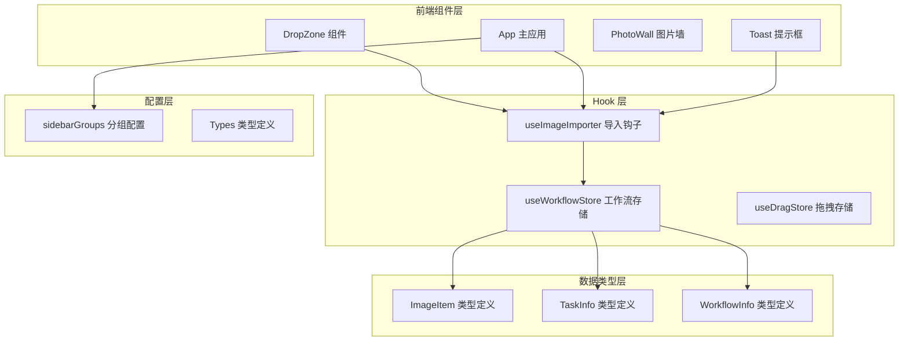
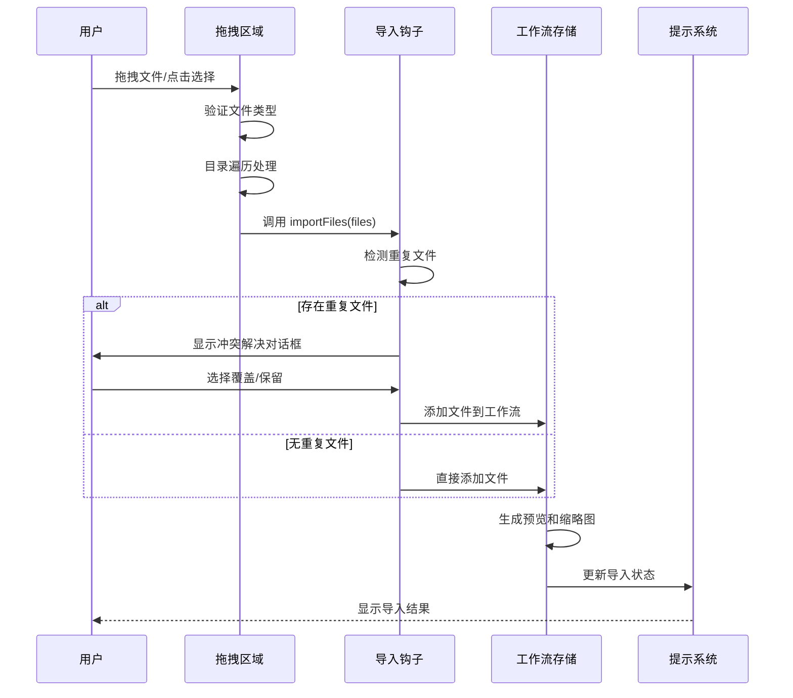
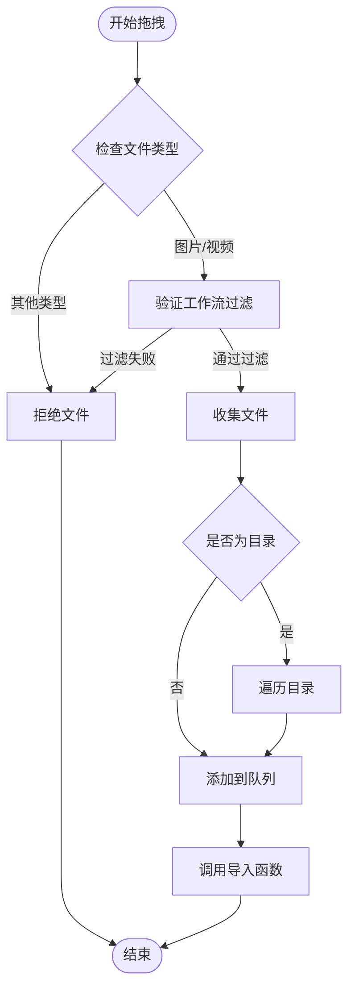
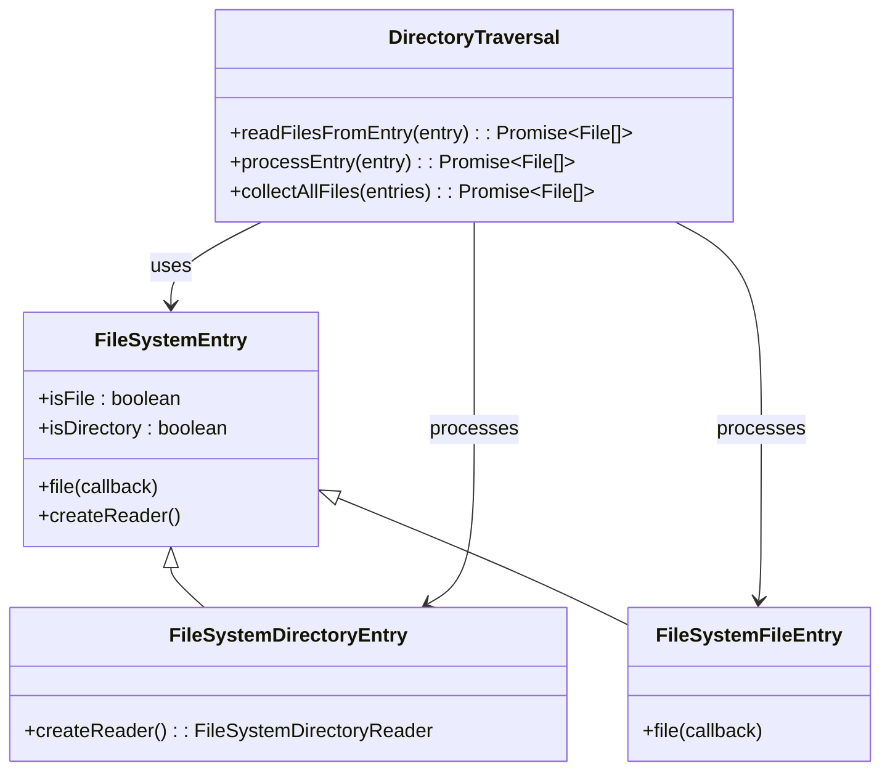
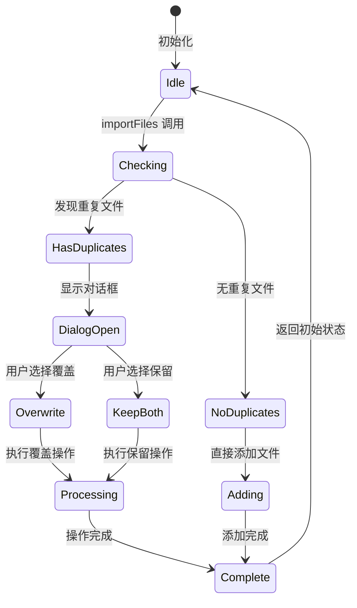
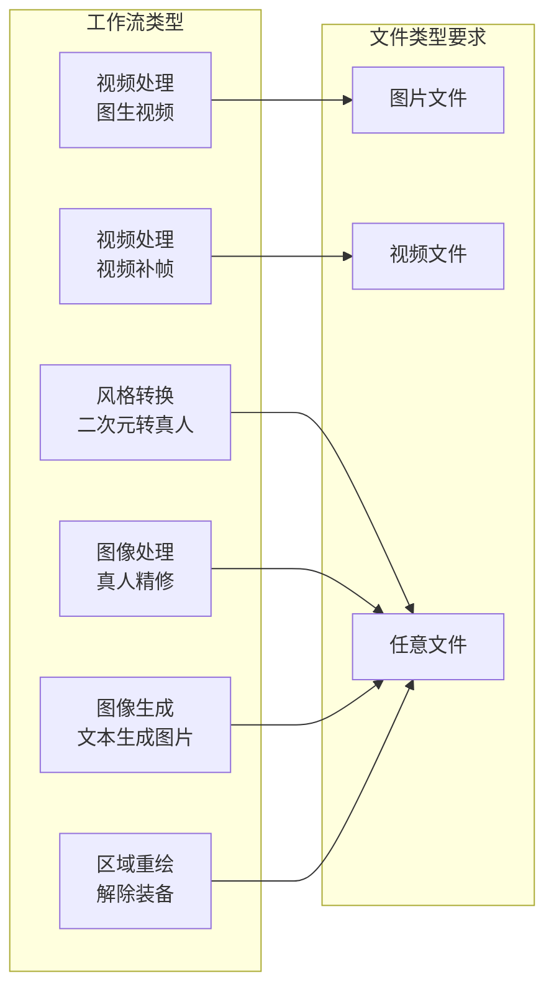
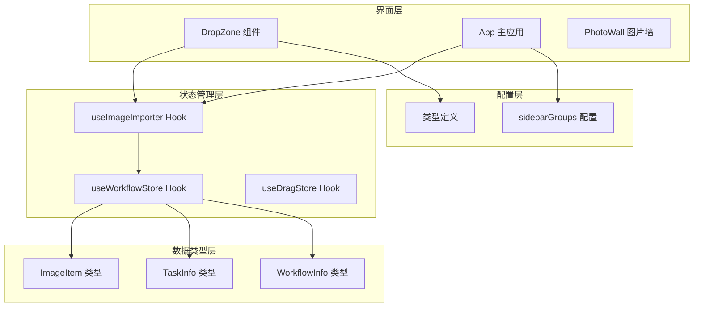

# 文件拖拽与导入系统

<cite>
**本文档引用的文件**
- [DropZone.tsx](file://client/src/components/DropZone.tsx)
- [useImageImporter.ts](file://client/src/hooks/useImageImporter.ts)
- [useWorkflowStore.ts](file://client/src/hooks/useWorkflowStore.ts)
- [App.tsx](file://client/src/components/App.tsx)
- [sidebarGroups.ts](file://client/src/data/sidebarGroups.ts)
- [Toast.tsx](file://client/src/components/Toast.tsx)
- [index.ts](file://client/src/types/index.ts)
</cite>

## 目录
1. [简介](#简介)
2. [项目结构](#项目结构)
3. [核心组件](#核心组件)
4. [架构概览](#架构概览)
5. [详细组件分析](#详细组件分析)
6. [依赖关系分析](#依赖关系分析)
7. [性能考虑](#性能考虑)
8. [故障排除指南](#故障排除指南)
9. [结论](#结论)

## 简介

CorineKit Pix2Real 的文件拖拽与导入系统是一个高度集成的文件处理框架，支持多种文件类型和工作流场景。该系统实现了完整的拖拽文件处理机制，包括 DragEvent 处理、文件类型验证、目录遍历功能，以及智能的工作流适配。

系统的核心特性包括：
- 支持图片和视频文件的拖拽导入
- 自动目录遍历和文件过滤
- 工作流特定的文件类型验证
- 重复文件检测和冲突解决
- 实时进度反馈和错误处理
- 用户体验优化的界面设计

## 项目结构

文件拖拽与导入系统主要分布在以下模块中：

**图表来源**
- [DropZone.tsx:1-181](file://client/src/components/DropZone.tsx#L1-L181)
- [useImageImporter.ts:1-48](file://client/src/hooks/useImageImporter.ts#L1-L48)
- [useWorkflowStore.ts:1-923](file://client/src/hooks/useWorkflowStore.ts#L1-L923)

**章节来源**
- [DropZone.tsx:1-181](file://client/src/components/DropZone.tsx#L1-L181)
- [useImageImporter.ts:1-48](file://client/src/hooks/useImageImporter.ts#L1-L48)
- [useWorkflowStore.ts:1-923](file://client/src/hooks/useWorkflowStore.ts#L1-L923)

## 核心组件

### 拖拽区域组件 (DropZone)

DropZone 组件是文件导入系统的核心界面组件，提供了直观的拖拽体验和多种导入方式。

**主要功能特性：**
- 支持全屏和内嵌两种显示模式
- 自动文件类型过滤和验证
- 目录遍历和文件收集
- 工作流特定的文件类型限制
- 实时拖拽状态反馈

**文件类型处理机制：**
- 图片文件：image/*
- 视频文件：video/*
- 自动过滤不支持的文件类型

**章节来源**
- [DropZone.tsx:40-181](file://client/src/components/DropZone.tsx#L40-L181)

### 文件导入钩子 (useImageImporter)

useImageImporter Hook 实现了智能的文件导入流程，包括重复文件检测和冲突解决机制。

**核心功能：**
- 文件导入流程管理
- 重复文件检测和冲突解决
- 批量操作支持
- 对话框状态管理

**重复文件处理策略：**
- 检测现有文件名冲突
- 提供覆盖或保留两种选项
- 保持用户选择的记忆

**章节来源**
- [useImageImporter.ts:9-48](file://client/src/hooks/useImageImporter.ts#L9-L48)

### 工作流存储管理 (useWorkflowStore)

useWorkflowStore 提供了完整的文件管理和工作流支持，包括视频缩略图生成和任务状态管理。

**关键能力：**
- 文件预览 URL 生成
- 视频文件缩略图提取
- 多标签页文件管理
- 任务进度跟踪
- 内存资源清理

**章节来源**
- [useWorkflowStore.ts:297-327](file://client/src/hooks/useWorkflowStore.ts#L297-L327)

## 架构概览

文件拖拽与导入系统采用分层架构设计，确保了良好的可维护性和扩展性：

**图表来源**
- [DropZone.tsx:50-82](file://client/src/components/DropZone.tsx#L50-L82)
- [useImageImporter.ts:15-28](file://client/src/hooks/useImageImporter.ts#L15-L28)
- [useWorkflowStore.ts:297-327](file://client/src/hooks/useWorkflowStore.ts#L297-L327)

## 详细组件分析

### 拖拽事件处理机制

系统实现了完整的 DragEvent 处理链路，支持多种文件导入场景：

**图表来源**
- [DropZone.tsx:50-82](file://client/src/components/DropZone.tsx#L50-L82)
- [App.tsx:157-197](file://client/src/components/App.tsx#L157-L197)

#### 文件类型验证逻辑

系统实现了多层次的文件类型验证机制：

**基础类型检查：**
- 使用 MIME 类型前缀验证 (`image/`, `video/`)
- 支持通配符匹配 (`image/*`, `video/*`)
- 运行时动态类型判断

**工作流特定验证：**
- 视频补帧工作流：仅接受视频文件
- 图生视频工作流：仅接受图片文件
- 其他工作流：接受所有媒体文件

**章节来源**
- [DropZone.tsx:11-13](file://client/src/components/DropZone.tsx#L11-L13)
- [DropZone.tsx:44-48](file://client/src/components/DropZone.tsx#L44-L48)
- [App.tsx:188-194](file://client/src/components/App.tsx#L188-L194)

### 目录遍历功能

系统支持递归目录遍历，自动收集所有符合条件的文件：

**图表来源**
- [DropZone.tsx:15-38](file://client/src/components/DropZone.tsx#L15-L38)
- [App.tsx:36-59](file://client/src/components/App.tsx#L36-L59)

**章节来源**
- [DropZone.tsx:15-38](file://client/src/components/DropZone.tsx#L15-L38)
- [App.tsx:36-59](file://client/src/components/App.tsx#L36-L59)

### useImageImporter Hook 设计模式

useImageImporter Hook 采用了函数式编程和状态管理模式：

**图表来源**
- [useImageImporter.ts:15-46](file://client/src/hooks/useImageImporter.ts#L15-L46)

#### 文件导入流程

**导入前准备：**
- 获取当前工作区的现有文件列表
- 构建文件名索引用于冲突检测
- 准备重复文件集合

**导入执行：**
- 直接添加无冲突文件
- 弹出重复文件对话框
- 支持批量操作处理

**清理和优化：**
- 自动内存管理
- 文件预览 URL 清理
- 状态重置机制

**章节来源**
- [useImageImporter.ts:15-46](file://client/src/hooks/useImageImporter.ts#L15-L46)

### 工作流适配机制

系统根据不同工作流的需求提供专门的文件处理策略：

**图表来源**
- [useWorkflowStore.ts:71-83](file://client/src/hooks/useWorkflowStore.ts#L71-L83)
- [sidebarGroups.ts:4-10](file://client/src/data/sidebarGroups.ts#L4-L10)

**章节来源**
- [useWorkflowStore.ts:71-83](file://client/src/hooks/useWorkflowStore.ts#L71-L83)
- [sidebarGroups.ts:4-10](file://client/src/data/sidebarGroups.ts#L4-L10)

## 依赖关系分析

文件拖拽与导入系统的依赖关系体现了清晰的分层架构：

**图表来源**
- [DropZone.tsx:1-10](file://client/src/components/DropZone.tsx#L1-L10)
- [useImageImporter.ts:1-7](file://client/src/hooks/useImageImporter.ts#L1-L7)
- [useWorkflowStore.ts:1-6](file://client/src/hooks/useWorkflowStore.ts#L1-L6)

**章节来源**
- [DropZone.tsx:1-10](file://client/src/components/DropZone.tsx#L1-L10)
- [useImageImporter.ts:1-7](file://client/src/hooks/useImageImporter.ts#L1-L7)
- [useWorkflowStore.ts:1-6](file://client/src/hooks/useWorkflowStore.ts#L1-L6)

## 性能考虑

### 内存管理优化

系统实现了多层内存管理策略以确保最佳性能：

**文件预览 URL 管理：**
- 动态生成和清理预览 URL
- 自动释放不再使用的内存
- 支持批量文件删除的内存回收

**视频文件处理优化：**
- 异步生成缩略图，避免阻塞主线程
- 智能超时机制防止长时间占用
- 错误恢复和降级处理

**章节来源**
- [useWorkflowStore.ts:392-423](file://client/src/hooks/useWorkflowStore.ts#L392-L423)
- [useWorkflowStore.ts:8-69](file://client/src/hooks/useWorkflowStore.ts#L8-L69)

### 并发处理策略

系统支持高效的并发文件处理：

**批量导入优化：**
- 批量文件添加减少状态更新次数
- 并行缩略图生成提升响应速度
- 智能队列管理避免过度并发

**内存使用监控：**
- 实时监控内存使用情况
- 自动触发垃圾回收机制
- 大文件处理的内存保护

## 故障排除指南

### 常见问题诊断

**拖拽功能异常：**
- 检查浏览器兼容性支持
- 验证 MIME 类型检测逻辑
- 确认目录遍历权限

**文件类型过滤问题：**
- 验证工作流配置正确性
- 检查文件扩展名解析
- 确认 MIME 类型映射

**内存泄漏排查：**
- 监控预览 URL 释放情况
- 检查事件监听器清理
- 验证定时器和回调函数

### 错误处理策略

系统实现了全面的错误处理机制：

**用户可见错误：**
- 文件类型不支持提示
- 目录访问权限错误
- 网络连接问题反馈

**内部错误处理：**
- 文件读取异常捕获
- 缩略图生成失败降级
- 状态同步错误恢复

**章节来源**
- [Toast.tsx:1-56](file://client/src/components/Toast.tsx#L1-L56)
- [useWorkflowStore.ts:57-60](file://client/src/hooks/useWorkflowStore.ts#L57-L60)

## 结论

CorineKit Pix2Real 的文件拖拽与导入系统展现了现代前端应用的最佳实践。通过精心设计的架构和完善的错误处理机制，系统实现了高效、可靠的文件导入体验。

**核心优势：**
- 完整的拖拽文件处理链路
- 智能的工作流适配机制  
- 高效的内存管理和性能优化
- 用户友好的交互设计

**技术亮点：**
- 多层次文件类型验证
- 智能重复文件检测
- 异步处理和状态管理
- 清晰的组件职责分离

该系统为后续的功能扩展和性能优化奠定了坚实的基础，能够满足复杂应用场景下的文件处理需求。