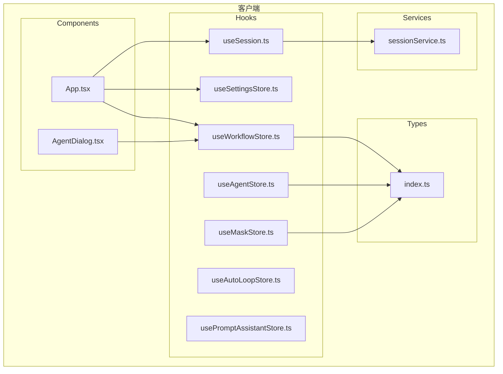
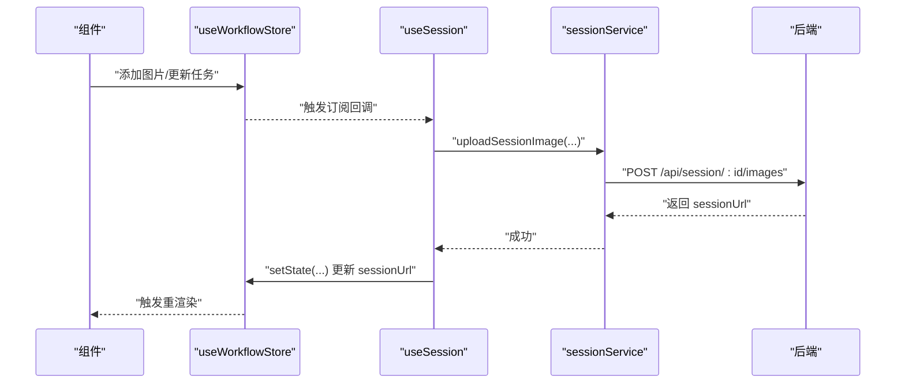
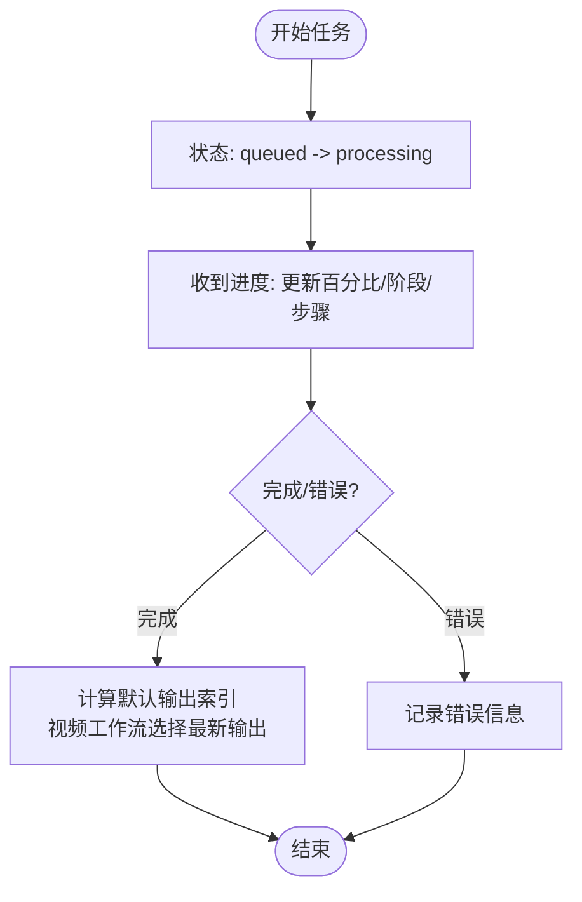
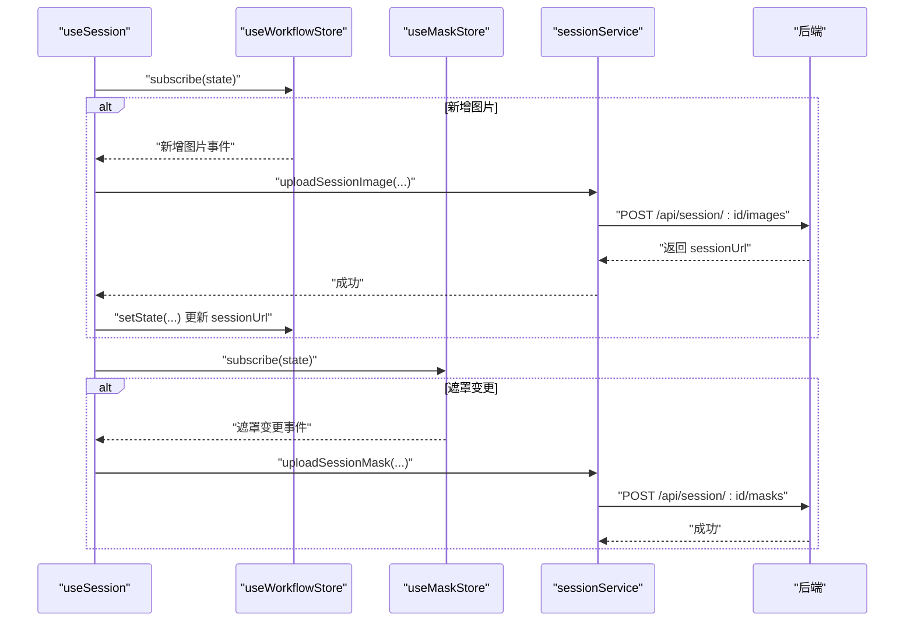
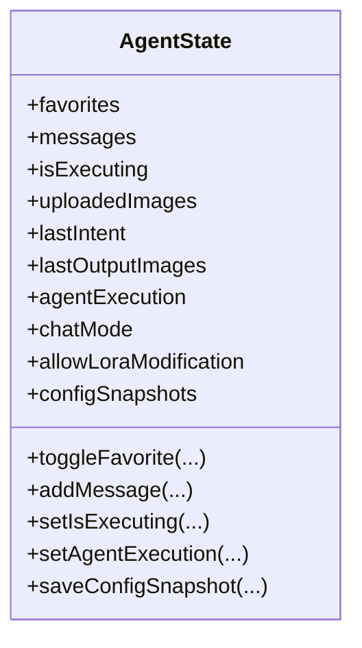
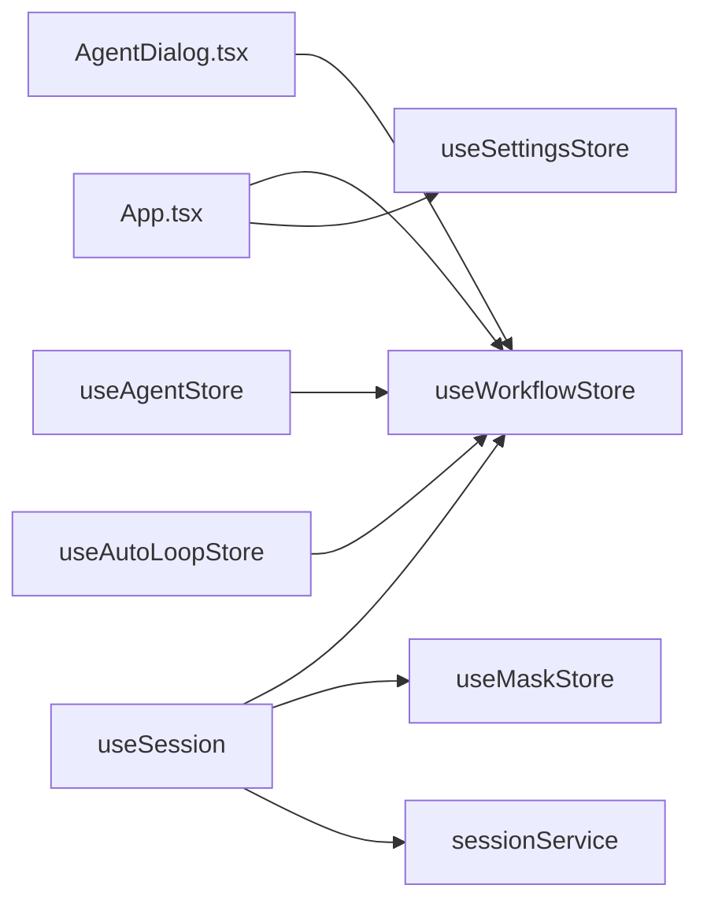

# 状态管理系统

<cite>
**本文引用的文件**
- [useWorkflowStore.ts](file://client/src/hooks/useWorkflowStore.ts)
- [useSession.ts](file://client/src/hooks/useSession.ts)
- [useSettingsStore.ts](file://client/src/hooks/useSettingsStore.ts)
- [useAgentStore.ts](file://client/src/hooks/useAgentStore.ts)
- [useMaskStore.ts](file://client/src/hooks/useMaskStore.ts)
- [useAutoLoopStore.ts](file://client/src/hooks/useAutoLoopStore.ts)
- [usePromptAssistantStore.ts](file://client/src/hooks/usePromptAssistantStore.ts)
- [sessionService.ts](file://client/src/services/sessionService.ts)
- [index.ts](file://client/src/types/index.ts)
- [App.tsx](file://client/src/components/App.tsx)
- [AgentDialog.tsx](file://client/src/components/AgentDialog.tsx)
</cite>

## 目录
1. [引言](#引言)
2. [项目结构](#项目结构)
3. [核心组件](#核心组件)
4. [架构总览](#架构总览)
5. [详细组件分析](#详细组件分析)
6. [依赖关系分析](#依赖关系分析)
7. [性能考量](#性能考量)
8. [故障排查指南](#故障排查指南)
9. [结论](#结论)
10. [附录](#附录)

## 引言
本文件面向 CorineKit Pix2Real 的前端状态管理，系统性阐述基于 Zustand 的状态设计与实现，覆盖 store 的创建、状态订阅与动作定义，并对四大核心 store 的职责进行拆解：工作流状态管理（useWorkflowStore）、会话状态管理（useSession）、设置状态管理（useSettingsStore）、AI Agent 状态管理（useAgentStore）。文档还解释了状态持久化策略、跨组件状态共享机制与最佳实践，提供可追溯的代码片段路径与可视化图示，帮助开发者高效理解与维护状态层。

## 项目结构
状态管理相关代码主要位于 client/src/hooks 下，配合 services 层的会话 API 与 types 定义，形成“store + 服务 + 类型”的清晰分层：
- hooks：定义各领域 store（工作流、会话、设置、Agent、遮罩、自动循环、提示词助理）
- services：封装会话上传/下载、重命名等后端交互
- types：统一前后端数据契约与枚举类型
- components：在 UI 中以选择器方式订阅 store，实现跨组件状态共享

图表来源
- [useWorkflowStore.ts:1-923](file://client/src/hooks/useWorkflowStore.ts#L1-L923)
- [useSession.ts:1-435](file://client/src/hooks/useSession.ts#L1-L435)
- [useSettingsStore.ts:1-177](file://client/src/hooks/useSettingsStore.ts#L1-L177)
- [useAgentStore.ts:1-337](file://client/src/hooks/useAgentStore.ts#L1-L337)
- [useMaskStore.ts:1-51](file://client/src/hooks/useMaskStore.ts#L1-L51)
- [useAutoLoopStore.ts:1-97](file://client/src/hooks/useAutoLoopStore.ts#L1-L97)
- [usePromptAssistantStore.ts:1-33](file://client/src/hooks/usePromptAssistantStore.ts#L1-L33)
- [sessionService.ts:1-232](file://client/src/services/sessionService.ts#L1-L232)
- [index.ts:1-76](file://client/src/types/index.ts#L1-L76)
- [App.tsx:1-100](file://client/src/components/App.tsx#L1-L100)
- [AgentDialog.tsx:1-1000](file://client/src/components/AgentDialog.tsx#L1-L1000)

章节来源
- [useWorkflowStore.ts:1-923](file://client/src/hooks/useWorkflowStore.ts#L1-L923)
- [useSession.ts:1-435](file://client/src/hooks/useSession.ts#L1-L435)
- [useSettingsStore.ts:1-177](file://client/src/hooks/useSettingsStore.ts#L1-L177)
- [useAgentStore.ts:1-337](file://client/src/hooks/useAgentStore.ts#L1-L337)
- [useMaskStore.ts:1-51](file://client/src/hooks/useMaskStore.ts#L1-L51)
- [useAutoLoopStore.ts:1-97](file://client/src/hooks/useAutoLoopStore.ts#L1-L97)
- [usePromptAssistantStore.ts:1-33](file://client/src/hooks/usePromptAssistantStore.ts#L1-L33)
- [sessionService.ts:1-232](file://client/src/services/sessionService.ts#L1-L232)
- [index.ts:1-76](file://client/src/types/index.ts#L1-L76)
- [App.tsx:1-100](file://client/src/components/App.tsx#L1-L100)
- [AgentDialog.tsx:1-1000](file://client/src/components/AgentDialog.tsx#L1-L1000)

## 核心组件
- useWorkflowStore：工作流状态中心，负责多标签页的图像、提示词、任务进度、输出索引、来源标记、文本/配置卡片等状态管理，提供任务生命周期动作与批量映射更新。
- useSession：会话生命周期管理，负责会话 ID 生成与持久化、序列化 store、异步上传输入图与遮罩、恢复与清理空会话、beforeunload 保底保存。
- useSettingsStore：全局设置项，含启动行为、随机生成策略、任务执行模式、桌面通知、会话路径等，支持本地持久化与服务端同步。
- useAgentStore：AI Agent 对话与执行状态，包含消息、收藏、上传图、意图解析、执行进度、批量输出、配置快照与回滚等。
- useMaskStore：遮罩数据与编辑器状态，提供遮罩写入、删除、查询与编辑器开关。
- useAutoLoopStore：自动循环控制与打断请求，提供跨标签打断保护与等待任务终态工具。
- usePromptAssistantStore：提示词助理面板状态，支持打开/关闭与多种模式切换。

章节来源
- [useWorkflowStore.ts:101-183](file://client/src/hooks/useWorkflowStore.ts#L101-L183)
- [useSession.ts:118-435](file://client/src/hooks/useSession.ts#L118-L435)
- [useSettingsStore.ts:19-52](file://client/src/hooks/useSettingsStore.ts#L19-L52)
- [useAgentStore.ts:96-185](file://client/src/hooks/useAgentStore.ts#L96-L185)
- [useMaskStore.ts:21-30](file://client/src/hooks/useMaskStore.ts#L21-L30)
- [useAutoLoopStore.ts:19-33](file://client/src/hooks/useAutoLoopStore.ts#L19-L33)
- [usePromptAssistantStore.ts:5-13](file://client/src/hooks/usePromptAssistantStore.ts#L5-L13)

## 架构总览
Zustand 采用函数式 store 定义与订阅模型，结合服务层 API 实现状态持久化与跨组件共享。工作流状态通过订阅驱动会话服务上传输入图与遮罩，设置状态贯穿 UI 渲染与行为控制，Agent 状态支撑智能对话与链式工作流。

图表来源
- [useSession.ts:187-237](file://client/src/hooks/useSession.ts#L187-L237)
- [sessionService.ts:88-104](file://client/src/services/sessionService.ts#L88-L104)
- [useWorkflowStore.ts:297-360](file://client/src/hooks/useWorkflowStore.ts#L297-L360)

## 详细组件分析

### useWorkflowStore 工作流状态管理
- 设计理念
  - 多标签页（0-10）状态隔离与组合，每个标签页拥有独立的图像列表、提示词、任务、输出索引、配置等。
  - 使用不可变更新策略，通过浅拷贝与局部替换保证最小化重渲染。
  - 将复杂业务逻辑（如视频缩略图生成、任务生命周期推进、批量映射）内聚在 store 动作中，降低组件负担。
- 关键职责
  - 图像管理：添加/移除/批量移除、清空当前标签页、生成视频首帧缩略图。
  - 提示词与任务：设置提示词、启动任务、推进进度、完成/失败处理、重置任务、按 promptId 移除图像。
  - 输出与索引：设置选中输出索引、移除指定输出、默认索引策略（视频工作流优先最新输出）。
  - 来源追踪：标记“手动/骰子/Agent 聊天”来源，用于偏好画像与体验优化。
  - 配置卡片：快速出图（Tab 7）与 ZIT 快出（Tab 9）卡片创建。
  - 计算辅助：是否需要提示词、是否正在处理等。
- 订阅与副作用
  - 在添加图片时异步生成视频缩略图并回填到 store。
  - 通过 remapTaskPromptIds 支持后端提示词重映射，保持任务与输出一致性。
- 代码片段路径
  - [添加图片与缩略图生成:297-360](file://client/src/hooks/useWorkflowStore.ts#L297-L360)
  - [启动任务与进度推进:560-648](file://client/src/hooks/useWorkflowStore.ts#L560-L648)
  - [完成任务与默认输出索引:650-680](file://client/src/hooks/useWorkflowStore.ts#L650-L680)
  - [按 promptId 移除图像:721-757](file://client/src/hooks/useWorkflowStore.ts#L721-L757)

图表来源
- [useWorkflowStore.ts:601-680](file://client/src/hooks/useWorkflowStore.ts#L601-L680)

章节来源
- [useWorkflowStore.ts:101-183](file://client/src/hooks/useWorkflowStore.ts#L101-L183)
- [useWorkflowStore.ts:297-360](file://client/src/hooks/useWorkflowStore.ts#L297-L360)
- [useWorkflowStore.ts:560-680](file://client/src/hooks/useWorkflowStore.ts#L560-L680)
- [useWorkflowStore.ts:721-757](file://client/src/hooks/useWorkflowStore.ts#L721-L757)

### useSession 会话状态管理
- 设计理念
  - 以 sessionId 为中心，统一管理会话的创建、恢复、保存与清理。
  - 通过 store 订阅检测状态变化，自动序列化并上传输入图与遮罩，避免重复上传。
  - beforeunload 使用 sendBeacon 保底保存，确保页面卸载时不会丢失状态。
- 关键职责
  - 会话 ID：本地生成与持久化，支持新会话重置。
  - 序列化：剥离 File 对象，仅保留可持久化字段。
  - 上传与恢复：异步上传输入图与遮罩，按启动行为决定恢复策略。
  - 空会话清理：欢迎页返回时删除空会话记录。
- 代码片段路径
  - [序列化与保存调度:140-185](file://client/src/hooks/useSession.ts#L140-185)
  - [订阅工作流变化并上传图片:187-237](file://client/src/hooks/useSession.ts#L187-237)
  - [订阅遮罩变化并上传:239-269](file://client/src/hooks/useSession.ts#L239-269)
  - [挂载时恢复或新建会话:294-400](file://client/src/hooks/useSession.ts#L294-400)
  - [beforeunload 保底保存:410-431](file://client/src/hooks/useSession.ts#L410-431)

图表来源
- [useSession.ts:187-269](file://client/src/hooks/useSession.ts#L187-L269)
- [sessionService.ts:88-119](file://client/src/services/sessionService.ts#L88-L119)

章节来源
- [useSession.ts:118-435](file://client/src/hooks/useSession.ts#L118-L435)
- [sessionService.ts:121-147](file://client/src/services/sessionService.ts#L121-L147)

### useSettingsStore 设置状态管理
- 设计理念
  - 将用户偏好与系统行为集中管理，支持本地持久化与服务端同步。
  - 启动行为（恢复/新建/欢迎页）与随机生成策略（预设、参考图模式、比例模式、内容策略、温度）统一配置。
- 关键职责
  - 设置项：逆向提示词模型、LLM 模型、启动行为、下拉菜单风格、桌面通知、随机生成参数、任务执行模式。
  - 会话路径：加载默认路径与动态更新，支持错误反馈。
  - 面板开关：打开/关闭设置面板，必要时提前加载会话路径。
- 代码片段路径
  - [设置项与本地持久化:54-176](file://client/src/hooks/useSettingsStore.ts#L54-176)
  - [加载与更新会话路径:140-175](file://client/src/hooks/useSettingsStore.ts#L140-175)

章节来源
- [useSettingsStore.ts:19-52](file://client/src/hooks/useSettingsStore.ts#L19-L52)
- [useSettingsStore.ts:54-176](file://client/src/hooks/useSettingsStore.ts#L54-L176)

### useAgentStore AI Agent 状态管理
- 设计理念
  - 将对话、意图解析、执行状态、批量输出、配置快照与回滚整合在一个 store，便于与工作流联动。
  - 通过消息结构承载跳转、批量结果、冲突处理等复杂 UI 语义。
- 关键职责
  - 收藏：本地记录 + 服务端持久化。
  - 对话：消息增删改查、执行状态与进度。
  - 上传图：临时存储用户上传的图片以便对话引用。
  - 意图解析：解析生成/处理意图，携带推荐 LoRA 与参数建议。
  - 执行：单次/批量执行，进度推进与完成回调。
  - 配置快照：保存配置快照，支持回滚。
- 代码片段路径
  - [收藏与持久化:203-219](file://client/src/hooks/useAgentStore.ts#L203-219)
  - [消息管理:240-255](file://client/src/hooks/useAgentStore.ts#L240-255)
  - [执行状态与进度:281-317](file://client/src/hooks/useAgentStore.ts#L281-317)
  - [配置快照:330-335](file://client/src/hooks/useAgentStore.ts#L330-335)

图表来源
- [useAgentStore.ts:96-185](file://client/src/hooks/useAgentStore.ts#L96-L185)

章节来源
- [useAgentStore.ts:96-185](file://client/src/hooks/useAgentStore.ts#L96-L185)
- [useAgentStore.ts:198-336](file://client/src/hooks/useAgentStore.ts#L198-L336)

### useMaskStore 遮罩状态管理
- 设计理念
  - 将遮罩像素数据与编辑器状态分离，便于按需渲染与持久化。
- 关键职责
  - 遮罩：按 key 存储遮罩像素数据，提供增删查与全量恢复。
  - 编辑器：记录当前打开的编辑器状态（图像、输出索引、模式等）。
- 代码片段路径
  - [遮罩 CRUD 与编辑器状态:32-50](file://client/src/hooks/useMaskStore.ts#L32-50)

章节来源
- [useMaskStore.ts:21-30](file://client/src/hooks/useMaskStore.ts#L21-L30)
- [useMaskStore.ts:32-50](file://client/src/hooks/useMaskStore.ts#L32-L50)

### useAutoLoopStore 自动循环控制
- 设计理念
  - 在特定标签（快速出图/ ZIT 快出）提供自动循环能力，并在用户跨标签提交任务时进行打断保护。
- 关键职责
  - 启停循环、跨标签打断请求、等待任务终态。
- 代码片段路径
  - [循环控制与打断请求:35-63](file://client/src/hooks/useAutoLoopStore.ts#L35-63)
  - [等待任务终态:69-96](file://client/src/hooks/useAutoLoopStore.ts#L69-96)

章节来源
- [useAutoLoopStore.ts:19-33](file://client/src/hooks/useAutoLoopStore.ts#L19-L33)
- [useAutoLoopStore.ts:35-63](file://client/src/hooks/useAutoLoopStore.ts#L35-L63)
- [useAutoLoopStore.ts:69-96](file://client/src/hooks/useAutoLoopStore.ts#L69-L96)

### usePromptAssistantStore 提示词助理
- 设计理念
  - 轻量 store 管理面板开关与模式切换，支持初始文本注入与会话键值递增。
- 关键职责
  - 打开/关闭面板、设置活动模式、注入初始文本。
- 代码片段路径
  - [面板状态与模式:15-32](file://client/src/hooks/usePromptAssistantStore.ts#L15-32)

章节来源
- [usePromptAssistantStore.ts:5-13](file://client/src/hooks/usePromptAssistantStore.ts#L5-L13)
- [usePromptAssistantStore.ts:15-32](file://client/src/hooks/usePromptAssistantStore.ts#L15-L32)

## 依赖关系分析
- 组件与 store 的绑定
  - App 通过选择器订阅工作流与设置，实现全局状态驱动 UI。
  - AgentDialog 通过 getState 直接读取/写入工作流状态，用于与 Agent 对话联动。
- store 间耦合
  - useSession 订阅 useWorkflowStore 与 useMaskStore，实现跨 store 的自动持久化。
  - useAgentStore 与 useWorkflowStore 在配置应用与任务联动上存在语义耦合。
- 外部依赖
  - sessionService 提供会话上传/下载、重命名等 API，作为 store 与后端的桥梁。
  - types 定义统一的数据契约，确保 store 与服务层的一致性。

图表来源
- [App.tsx:1-100](file://client/src/components/App.tsx#L1-L100)
- [AgentDialog.tsx:1-1000](file://client/src/components/AgentDialog.tsx#L1-L1000)
- [useSession.ts:187-269](file://client/src/hooks/useSession.ts#L187-L269)
- [sessionService.ts:1-232](file://client/src/services/sessionService.ts#L1-L232)

章节来源
- [App.tsx:1-100](file://client/src/components/App.tsx#L1-L100)
- [AgentDialog.tsx:1-1000](file://client/src/components/AgentDialog.tsx#L1-L1000)
- [useSession.ts:187-269](file://client/src/hooks/useSession.ts#L187-L269)
- [sessionService.ts:1-232](file://client/src/services/sessionService.ts#L1-L232)

## 性能考量
- 最小化重渲染
  - 使用选择器订阅（如 App 中对 activeTab 与 images 的订阅）仅在相关字段变化时触发重渲染。
  - 在 useWorkflowStore 中采用局部浅拷贝与不可变更新策略，避免深层对象重建。
- 异步与去抖
  - useSession 对状态保存进行 500ms 去抖，减少频繁网络请求。
  - 视频缩略图生成采用异步 Promise，完成后回填到 store，避免阻塞主线程。
- 订阅粒度
  - 将工作流与遮罩分别订阅，避免无关状态变化引发的上传。
- 任务终态等待
  - 使用订阅一次性监听任务终态，避免轮询带来的性能损耗。

[本节为通用性能指导，无需列出具体文件来源]

## 故障排查指南
- 会话恢复失败
  - 现象：启动后未恢复或显示欢迎页。
  - 排查：检查启动行为设置与服务端会话是否存在；查看控制台日志中的恢复错误。
  - 参考路径：[挂载恢复流程:294-400](file://client/src/hooks/useSession.ts#L294-400)
- 图片未上传或 sessionUrl 为空
  - 现象：图片添加后未显示持久化链接。
  - 排查：确认上传接口返回与 setState 回填是否成功；检查订阅触发条件。
  - 参考路径：[上传图片与回填:187-237](file://client/src/hooks/useSession.ts#L187-237)
- 任务进度不更新
  - 现象：任务已开始但 UI 未显示进度。
  - 排查：确认 WebSocket 进度消息映射到 store 的 updateProgress；检查 promptId 是否一致。
  - 参考路径：[进度推进:624-648](file://client/src/hooks/useWorkflowStore.ts#L624-648)
- 空会话清理异常
  - 现象：欢迎页返回后仍有空会话记录。
  - 排查：确认 beforeunload 保底保存与空会话判断逻辑。
  - 参考路径：[空会话清理:402-431](file://client/src/hooks/useSession.ts#L402-431)
- Agent 执行中断
  - 现象：跨标签提交任务被中断。
  - 排查：检查自动循环打断请求与 resolve 流程。
  - 参考路径：[打断请求与解决:46-62](file://client/src/hooks/useAutoLoopStore.ts#L46-62)

章节来源
- [useSession.ts:294-400](file://client/src/hooks/useSession.ts#L294-L400)
- [useSession.ts:187-237](file://client/src/hooks/useSession.ts#L187-L237)
- [useWorkflowStore.ts:624-648](file://client/src/hooks/useWorkflowStore.ts#L624-L648)
- [useAutoLoopStore.ts:46-62](file://client/src/hooks/useAutoLoopStore.ts#L46-L62)

## 结论
本状态管理体系以 Zustand 为核心，围绕工作流、会话、设置与 Agent 四大域构建清晰的 store 分层，结合服务层 API 实现端到端的状态持久化与跨组件共享。通过订阅驱动的自动上传、去抖保存与最小化重渲染策略，系统在功能完整性与性能之间取得良好平衡。建议后续在大型任务场景引入更细粒度的选择器与缓存策略，进一步提升复杂工作流下的交互流畅度。

[本节为总结性内容，无需列出具体文件来源]

## 附录
- 状态读取与更新模式
  - 选择器订阅：在组件中使用选择器读取 store 字段，例如 [读取当前标签图像:61-62](file://client/src/components/App.tsx#L61-L62)。
  - 动作调用：通过 store 暴露的动作方法更新状态，例如 [设置提示词:471-482](file://client/src/hooks/useWorkflowStore.ts#L471-L482)。
  - 直接读取/写入：在需要强耦合交互的场景（如 Agent 对话）使用 getState/ setState，例如 [读取 sessionId:230-230](file://client/src/components/AgentDialog.tsx#L230-L230)。
- 状态持久化最佳实践
  - 仅序列化可持久化字段，剥离 File 对象，例如 [序列化逻辑:140-166](file://client/src/hooks/useSession.ts#L140-L166)。
  - 使用去抖与空会话过滤，避免无效保存，例如 [保存调度:181-185](file://client/src/hooks/useSession.ts#L181-185)。
  - beforeunload 保底保存，确保页面卸载时状态落盘，例如 [保底保存:410-431](file://client/src/hooks/useSession.ts#L410-431)。

章节来源
- [App.tsx:61-62](file://client/src/components/App.tsx#L61-L62)
- [useWorkflowStore.ts:471-482](file://client/src/hooks/useWorkflowStore.ts#L471-L482)
- [AgentDialog.tsx:230-230](file://client/src/components/AgentDialog.tsx#L230-L230)
- [useSession.ts:140-166](file://client/src/hooks/useSession.ts#L140-L166)
- [useSession.ts:181-185](file://client/src/hooks/useSession.ts#L181-L185)
- [useSession.ts:410-431](file://client/src/hooks/useSession.ts#L410-L431)