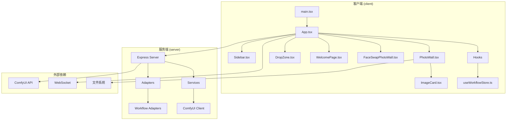
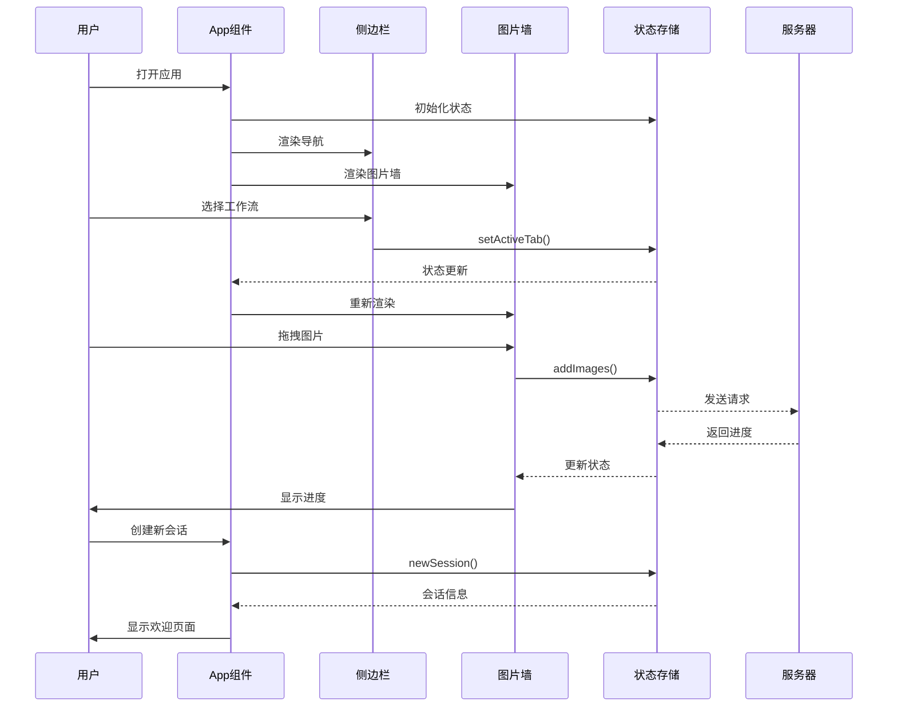
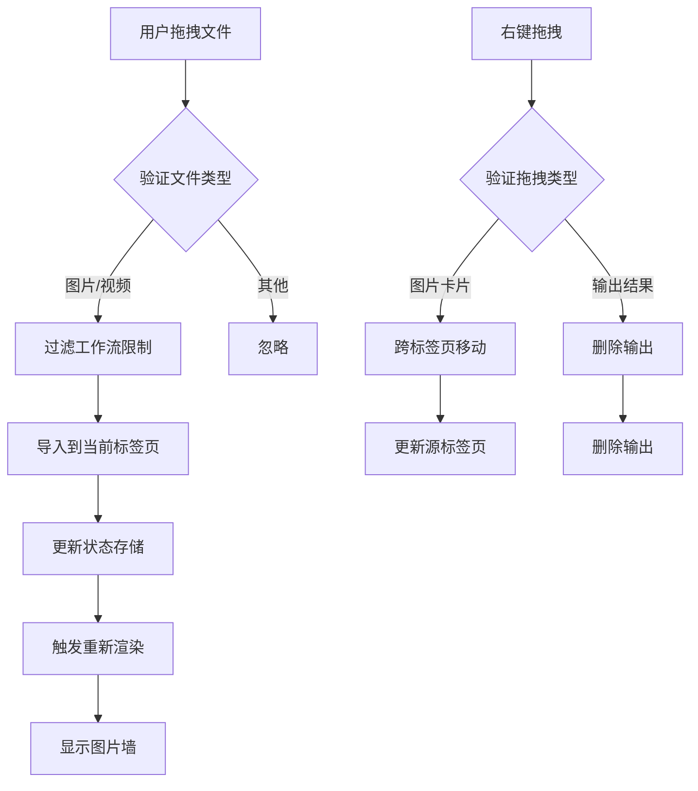
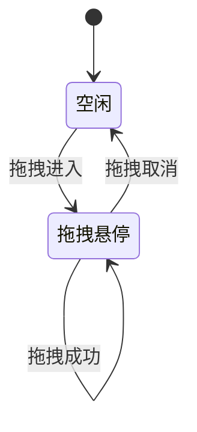
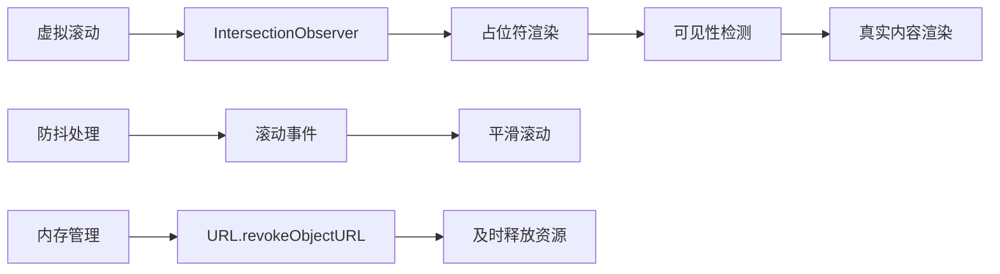
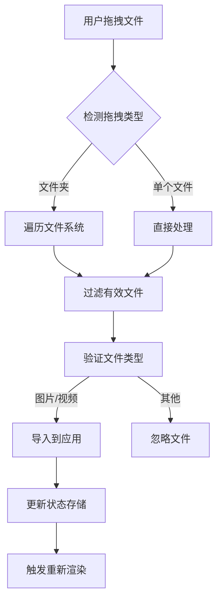
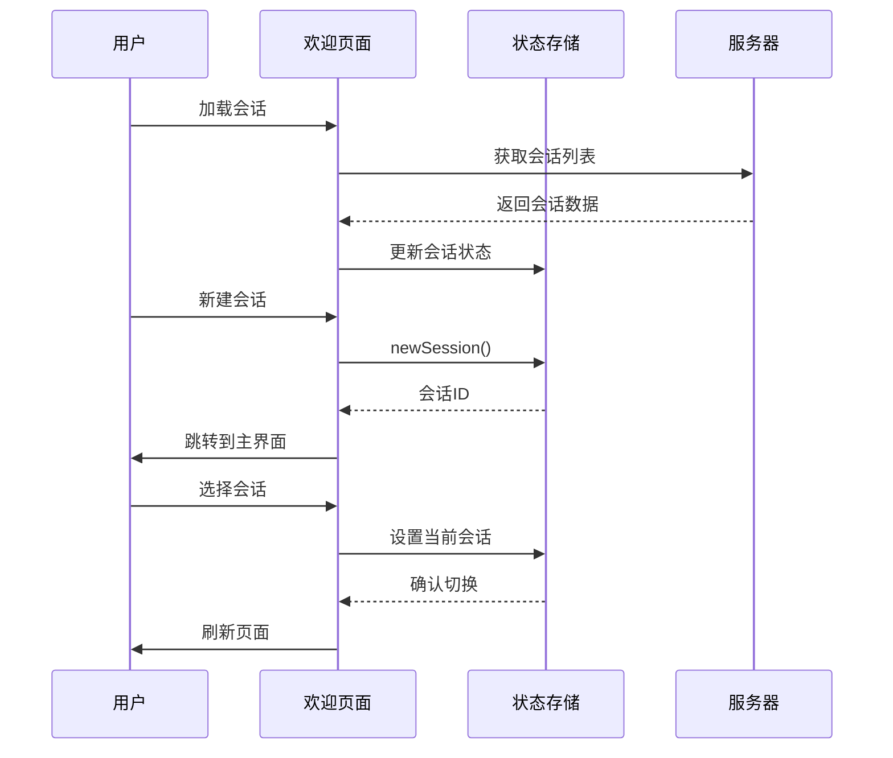
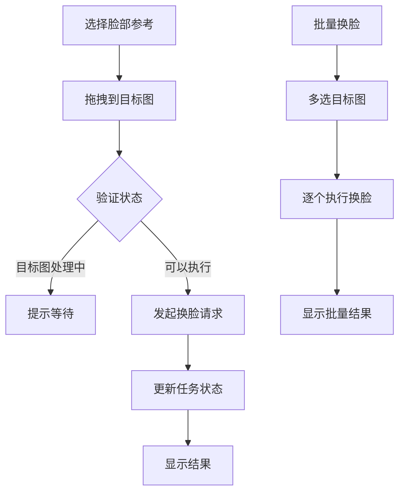
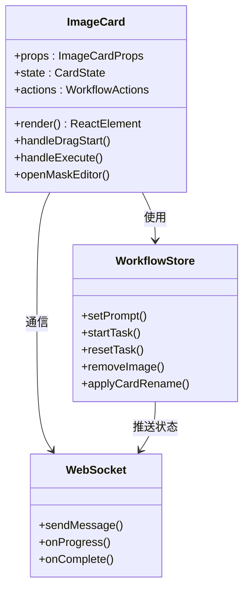
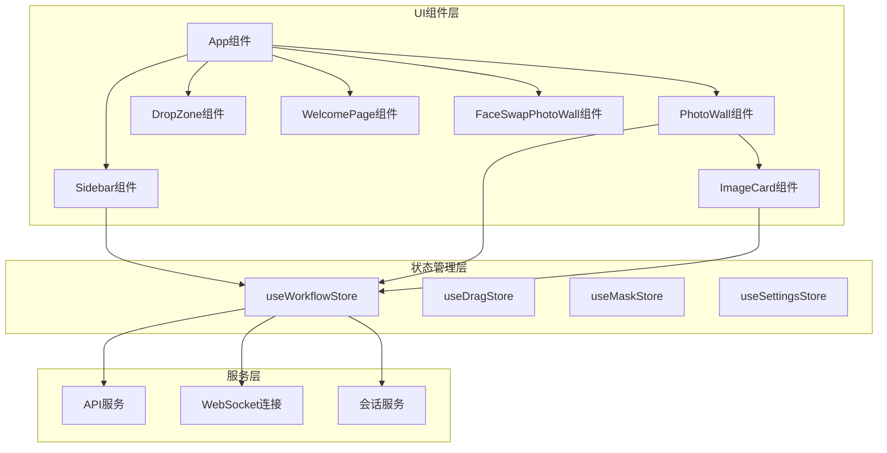

# 组件架构设计

<cite>
**本文档引用的文件**
- [main.tsx](file://client/src/main.tsx)
- [App.tsx](file://client/src/components/App.tsx)
- [Sidebar.tsx](file://client/src/components/Sidebar.tsx)
- [PhotoWall.tsx](file://client/src/components/PhotoWall.tsx)
- [DropZone.tsx](file://client/src/components/DropZone.tsx)
- [WelcomePage.tsx](file://client/src/components/WelcomePage.tsx)
- [FaceSwapPhotoWall.tsx](file://client/src/components/FaceSwapPhotoWall.tsx)
- [ImageCard.tsx](file://client/src/components/ImageCard.tsx)
- [useWorkflowStore.ts](file://client/src/hooks/useWorkflowStore.ts)
- [sidebarGroups.ts](file://client/src/data/sidebarGroups.ts)
- [index.ts](file://client/src/types/index.ts)
- [package.json](file://client/package.json)
</cite>

## 目录
1. [简介](#简介)
2. [项目结构](#项目结构)
3. [核心组件](#核心组件)
4. [架构概览](#架构概览)
5. [详细组件分析](#详细组件分析)
6. [依赖关系分析](#依赖关系分析)
7. [性能考虑](#性能考虑)
8. [故障排除指南](#故障排除指南)
9. [结论](#结论)

## 简介

CorineKit Pix2Real 是一个基于 React 的本地 Web UI 应用，专门用于通过 ComfyUI 进行批量图像/视频处理。该应用采用现代前端技术栈，实现了高度模块化的组件架构，支持多种工作流程（动漫转真实、人物精修、放大、视频生成等），提供实时进度更新和一键输出文件夹访问功能。

## 项目结构

项目采用清晰的分层架构，主要分为客户端（client）、服务端（server）和 ComfyUI 工作流模板三个部分：

**图表来源**
- [main.tsx:1-11](file://client/src/main.tsx#L1-L11)
- [App.tsx:1-422](file://client/src/components/App.tsx#L1-L422)

**章节来源**
- [README.md:41-62](file://README.md#L41-L62)
- [package.json:1-26](file://client/package.json#L1-L26)

## 核心组件

### 应用入口与根组件

应用的入口点位于 `main.tsx`，通过 React DOM 将根组件 `App` 渲染到页面中。`App` 组件作为整个应用的容器，负责管理全局状态、处理拖拽事件、协调各个子组件之间的交互。

### 状态管理核心

应用使用 Zustand 作为状态管理库，`useWorkflowStore` 提供了集中式的全局状态管理，包括：
- 工作流数据（images、prompts、tasks）
- 用户界面状态（activeTab、selectedImageIds）
- 任务执行状态（clientId、sessionId）
- 会话管理（restoreSession、applyCardRename）

**章节来源**
- [main.tsx:1-11](file://client/src/main.tsx#L1-L11)
- [useWorkflowStore.ts:191-500](file://client/src/hooks/useWorkflowStore.ts#L191-L500)

## 架构概览

应用采用组件化架构，通过 props 传递和事件回调实现组件间的通信。整体架构遵循单向数据流原则，确保状态变更的可预测性和可追踪性。

**图表来源**
- [App.tsx:61-197](file://client/src/components/App.tsx#L61-L197)
- [useWorkflowStore.ts:297-360](file://client/src/hooks/useWorkflowStore.ts#L297-L360)

## 详细组件分析

### App 根组件

`App` 组件是整个应用的核心容器，负责：
- 管理全局布局和主题切换
- 处理文件拖拽和导入逻辑
- 协调右侧侧边栏的显示与隐藏
- 管理欢迎页面与主界面的切换

#### 数据流管理

**图表来源**
- [App.tsx:138-197](file://client/src/components/App.tsx#L138-L197)
- [useWorkflowStore.ts:362-390](file://client/src/hooks/useWorkflowStore.ts#L362-L390)

#### 条件渲染逻辑

App 组件实现了复杂的条件渲染逻辑，根据不同的工作流标签页显示相应的界面：

- **欢迎页面**：首次启动或需要新建会话时显示
- **主界面**：正常工作模式下显示侧边栏、图片墙和右侧工具栏
- **特殊工作流**：针对特定工作流（如文本生成、换脸）显示专用界面

**章节来源**
- [App.tsx:273-365](file://client/src/components/App.tsx#L273-L365)

### Sidebar 侧边栏导航

Sidebar 组件提供了工作流导航功能，支持：
- 工作流分组显示（图像生成、图像处理、风格转换等）
- 实时任务队列状态显示
- 拖拽功能支持跨标签页移动图片
- 主题切换和设置入口

#### 拖拽处理机制

**图表来源**
- [Sidebar.tsx:119-218](file://client/src/components/Sidebar.tsx#L119-L218)

**章节来源**
- [Sidebar.tsx:26-434](file://client/src/components/Sidebar.tsx#L26-L434)

### PhotoWall 图像展示墙

PhotoWall 组件是应用的核心展示组件，负责：
- 网格布局的图片展示
- 多选模式和批量操作
- 进度条显示和任务状态管理
- 懒加载优化大量图片的渲染性能

#### 性能优化策略

**图表来源**
- [PhotoWall.tsx:21-97](file://client/src/components/PhotoWall.tsx#L21-L97)

**章节来源**
- [PhotoWall.tsx:103-781](file://client/src/components/PhotoWall.tsx#L103-L781)

### DropZone 文件拖拽区域

DropZone 组件提供了灵活的文件导入机制：
- 支持文件夹拖拽导入
- 自动文件类型过滤
- 多种导入方式（拖拽、点击、文件选择器）

#### 文件处理流程

**图表来源**
- [DropZone.tsx:40-82](file://client/src/components/DropZone.tsx#L40-L82)

**章节来源**
- [DropZone.tsx:40-181](file://client/src/components/DropZone.tsx#L40-L181)

### WelcomePage 欢迎页面

WelcomePage 组件提供了会话管理和项目启动功能：
- 会话列表展示和管理
- 新建会话功能
- 会话导入和导出
- 会话重命名和删除

#### 会话管理流程

**图表来源**
- [WelcomePage.tsx:92-130](file://client/src/components/WelcomePage.tsx#L92-L130)

**章节来源**
- [WelcomePage.tsx:92-534](file://client/src/components/WelcomePage.tsx#L92-L534)

### FaceSwapPhotoWall 换脸工作流

FaceSwapPhotoWall 是专门为换脸功能设计的专用组件：
- 双区域布局（脸部参考区、目标图区）
- 专用的拖拽和交换机制
- 收藏夹集成
- 批量操作支持

#### 换脸工作流

**图表来源**
- [FaceSwapPhotoWall.tsx:397-427](file://client/src/components/FaceSwapPhotoWall.tsx#L397-L427)

**章节来源**
- [FaceSwapPhotoWall.tsx:246-800](file://client/src/components/FaceSwapPhotoWall.tsx#L246-L800)

### ImageCard 图片卡片组件

ImageCard 是 PhotoWall 中的基础展示单元，提供了丰富的交互功能：
- 图片预览和缩略图
- 提示词编辑和智能助手
- 蒙版编辑集成
- 进度显示和状态管理
- 多种工作流的专用功能

#### 组件通信模式

**图表来源**
- [ImageCard.tsx:23-51](file://client/src/components/ImageCard.tsx#L23-L51)
- [useWorkflowStore.ts:560-515](file://client/src/hooks/useWorkflowStore.ts#L560-L515)

**章节来源**
- [ImageCard.tsx:51-800](file://client/src/components/ImageCard.tsx#L51-L800)

## 依赖关系分析

### 组件依赖图

**图表来源**
- [App.tsx:6-30](file://client/src/components/App.tsx#L6-L30)
- [useWorkflowStore.ts:1-8](file://client/src/hooks/useWorkflowStore.ts#L1-L8)

### 技术栈依赖

应用使用了现代化的前端技术栈：
- **React 19.0.0**: 组件化开发框架
- **TypeScript**: 类型安全和更好的开发体验
- **Zustand**: 轻量级状态管理库
- **Lucide React**: 图标库
- **Vite**: 构建工具和开发服务器

**章节来源**
- [package.json:11-24](file://client/package.json#L11-L24)

## 性能考虑

### 渲染性能优化

1. **懒加载机制**: PhotoWall 使用 IntersectionObserver 实现图片懒加载，减少初始渲染负担
2. **虚拟滚动**: 对于大量图片场景，使用虚拟滚动技术提升渲染性能
3. **组件记忆化**: 关键组件使用 React.memo 避免不必要的重新渲染
4. **状态订阅优化**: 使用 Zustand 的浅比较优化状态订阅

### 内存管理

1. **URL 对象清理**: 及时调用 URL.revokeObjectURL 释放预览图片占用的内存
2. **WebSocket 连接管理**: 单例模式确保每个浏览器客户端只有一个 WebSocket 连接
3. **文件上传优化**: 大文件采用流式传输，避免内存峰值过高

### 网络性能

1. **批量请求**: 支持批量处理多个文件，减少网络往返次数
2. **进度缓存**: 实时进度信息缓存，避免重复计算
3. **连接池管理**: WebSocket 连接复用，减少连接建立开销

## 故障排除指南

### 常见问题及解决方案

#### 拖拽功能异常

**问题**: 图片拖拽不响应或无法导入
**原因**: 
- 浏览器安全策略限制
- 文件类型不被支持
- 拖拽事件处理冲突

**解决方案**:
1. 检查浏览器是否支持拖拽 API
2. 确认文件类型符合工作流要求
3. 验证拖拽事件监听器是否正确绑定

#### 进度显示异常

**问题**: 任务进度不更新或显示错误
**原因**:
- WebSocket 连接断开
- 服务端状态不同步
- 客户端状态更新延迟

**解决方案**:
1. 检查网络连接和 WebSocket 状态
2. 重启应用重新建立连接
3. 查看控制台错误信息

#### 图片显示问题

**问题**: 图片无法显示或显示异常
**原因**:
- 文件路径错误
- 权限问题
- 缓存问题

**解决方案**:
1. 检查文件是否存在且可访问
2. 清除浏览器缓存
3. 重新生成预览图片

**章节来源**
- [ImageCard.tsx:355-364](file://client/src/components/ImageCard.tsx#L355-L364)
- [PhotoWall.tsx:134-152](file://client/src/components/PhotoWall.tsx#L134-L152)

## 结论

CorineKit Pix2Real 展示了一个成熟的 React 应用架构设计，通过模块化组件、集中式状态管理和高效的性能优化策略，实现了复杂的工作流处理功能。应用的主要优势包括：

1. **清晰的架构分层**: UI 组件、状态管理、服务层职责明确
2. **强大的状态管理**: Zustand 提供了轻量级但功能完整的状态管理
3. **优秀的用户体验**: 实时进度反馈、流畅的动画效果、直观的操作流程
4. **良好的扩展性**: 模块化设计便于添加新的工作流和功能

该架构为类似的应用开发提供了很好的参考，特别是在处理复杂数据流和实时交互方面具有重要的借鉴价值。