# AI代理服务层

<cite>
**本文档引用的文件**
- [server/src/index.ts](file://server/src/index.ts)
- [server/src/routes/agent.ts](file://server/src/routes/agent.ts)
- [server/src/services/agentService.ts](file://server/src/services/agentService.ts)
- [server/src/services/llmService.ts](file://server/src/services/llmService.ts)
- [server/src/services/intentParser.ts](file://server/src/services/intentParser.ts)
- [server/src/services/comfyui.ts](file://server/src/services/comfyui.ts)
- [server/src/services/profileService.ts](file://server/src/services/profileService.ts)
- [server/src/services/sessionManager.ts](file://server/src/services/sessionManager.ts)
- [server/src/adapters/index.ts](file://server/src/adapters/index.ts)
- [server/src/types/index.ts](file://server/src/types/index.ts)
- [client/src/hooks/useAgentStore.ts](file://client/src/hooks/useAgentStore.ts)
- [client/src/components/AgentDialog.tsx](file://client/src/components/AgentDialog.tsx)
- [client/src/types/index.ts](file://client/src/types/index.ts)
- [README.md](file://README.md)
</cite>

## 更新摘要
**变更内容**
- 新增批量变体生成功能支持，后端LLM服务现在支持variants参数
- AgentDialog组件新增批量模式支持，包括批量进度跟踪、消息合并和结果导航功能
- 完善了批量模式下的状态管理和WebSocket事件处理机制

## 目录
1. [项目概述](#项目概述)
2. [架构总览](#架构总览)
3. [核心组件分析](#核心组件分析)
4. [AI代理服务详解](#ai代理服务详解)
5. [LLM集成与意图解析](#llm集成与意图解析)
6. [工作流适配器系统](#工作流适配器系统)
7. [会话管理与持久化](#会话管理与持久化)
8. [前端交互层](#前端交互层)
9. [批量变体生成功能](#批量变体生成功能)
10. [性能优化策略](#性能优化策略)
11. [故障排除指南](#故障排除指南)
12. [总结](#总结)

## 项目概述

CorineKit Pix2Real是一个基于ComfyUI的本地AI图像生成服务系统，专注于提供智能化的AI代理服务。该系统通过自然语言交互，将用户的口头描述转换为精确的图像生成参数，并自动执行相应的工作流程。

### 主要特性
- **多模态AI代理**：支持文本描述和图片上传的混合输入
- **智能工作流调度**：根据用户需求自动选择最优工作流程
- **实时进度监控**：WebSocket实时传输生成进度
- **个性化推荐**：基于用户偏好画像的智能建议系统
- **批量处理能力**：支持多图片同时处理
- **批量变体生成**：支持生成多个变体版本，包括不同参数和风格的组合

**章节来源**
- [README.md:1-79](file://README.md#L1-L79)

## 架构总览

系统采用分层架构设计，主要分为四个层次：

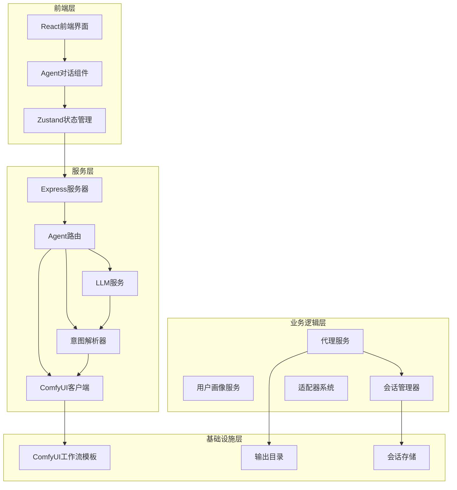

**图表来源**
- [server/src/index.ts:52-73](file://server/src/index.ts#L52-L73)
- [server/src/routes/agent.ts:369-602](file://server/src/routes/agent.ts#L369-L602)

## 核心组件分析

### 服务器入口点

系统的核心入口位于`server/src/index.ts`，负责初始化整个服务架构：

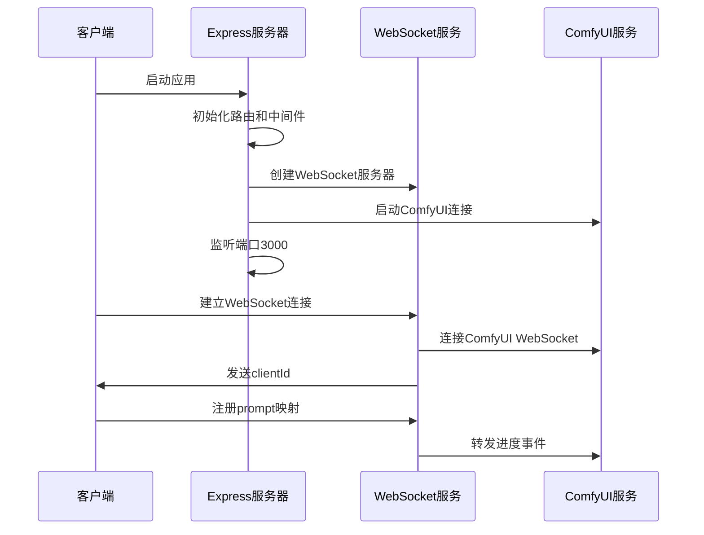

**图表来源**
- [server/src/index.ts:85-242](file://server/src/index.ts#L85-L242)

**章节来源**
- [server/src/index.ts:1-264](file://server/src/index.ts#L1-L264)

### 代理服务核心

代理服务是整个系统的大脑，负责协调各个组件的工作：

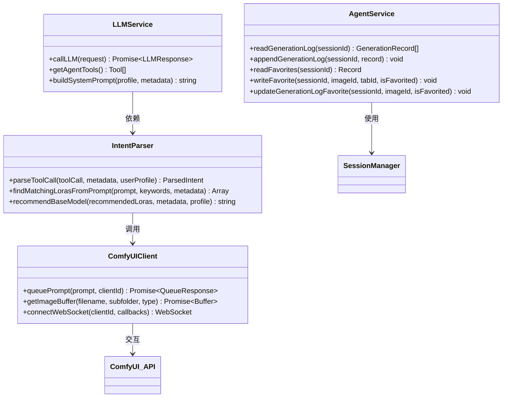

**图表来源**
- [server/src/services/agentService.ts:44-117](file://server/src/services/agentService.ts#L44-L117)
- [server/src/services/llmService.ts:50-109](file://server/src/services/llmService.ts#L50-L109)
- [server/src/services/intentParser.ts:426-536](file://server/src/services/intentParser.ts#L426-L536)

**章节来源**
- [server/src/services/agentService.ts:1-118](file://server/src/services/agentService.ts#L1-L118)

## AI代理服务详解

### 智能对话系统

AI代理服务的核心是其智能对话能力，能够理解复杂的用户需求并生成相应的图像生成参数：

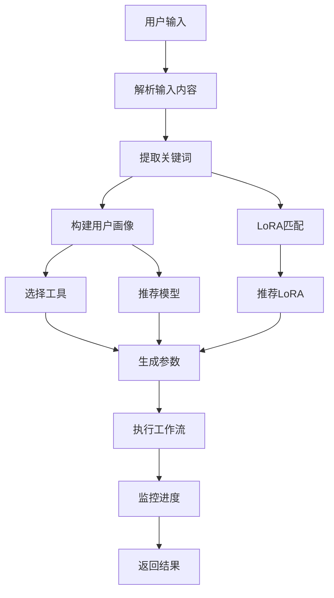

**图表来源**
- [server/src/routes/agent.ts:492-602](file://server/src/routes/agent.ts#L492-L602)
- [server/src/services/intentParser.ts:445-511](file://server/src/services/intentParser.ts#L445-L511)

### 用户偏好画像构建

系统通过分析用户的历史行为，构建详细的用户偏好画像：

| 偏好类型 | 数据来源 | 用途 |
|---------|----------|------|
| 模型偏好 | 生成历史中的基础模型使用情况 | 自动推荐兼容的基础模型 |
| LoRA偏好 | LoRA使用频率和强度 | 智能推荐相关的LoRA组合 |
| 参数偏好 | 生成参数的众数统计 | 提供默认参数建议 |
| 风格特征 | 提示词标签统计 | 生成风格相关的建议 |
| 使用模式 | 工作流使用频率 | 个性化工作流推荐 |

**章节来源**
- [server/src/services/profileService.ts:77-237](file://server/src/services/profileService.ts#L77-L237)

## LLM集成与意图解析

### 工具调用机制

系统集成了Grok AI模型，通过Function Calling机制实现智能工作流调度：

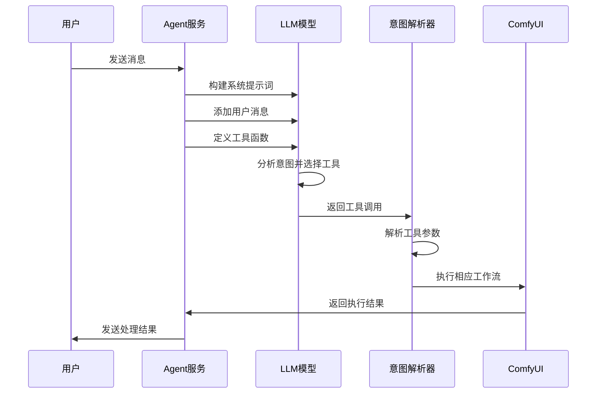

**图表来源**
- [server/src/services/llmService.ts:113-196](file://server/src/services/llmService.ts#L113-L196)
- [server/src/services/intentParser.ts:426-443](file://server/src/services/intentParser.ts#L426-L443)

### 意图解析算法

意图解析器采用多阶段匹配策略，确保准确理解用户需求：

1. **关键词提取**：从用户输入中提取角色、姿势、风格等关键词
2. **LoRA匹配**：基于关键词在元数据中搜索最佳匹配的LoRA模型
3. **参数推荐**：根据质量要求和用户偏好推荐合适的生成参数
4. **模型选择**：智能推荐兼容的基础模型

**章节来源**
- [server/src/services/intentParser.ts:142-258](file://server/src/services/intentParser.ts#L142-L258)

## 工作流适配器系统

### 适配器模式实现

系统采用适配器模式管理不同的工作流程，每个工作流都有专门的适配器：

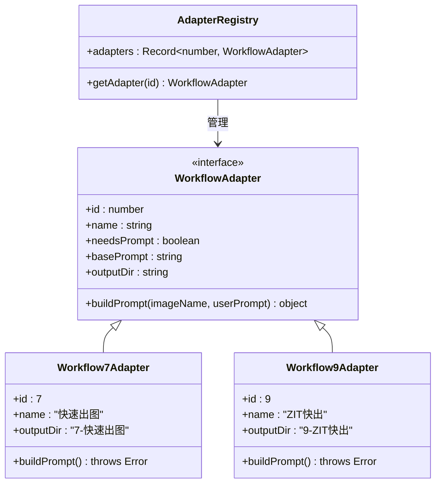

**图表来源**
- [server/src/adapters/BaseAdapter.ts:1-4](file://server/src/adapters/BaseAdapter.ts#L1-L4)
- [server/src/adapters/Workflow7Adapter.ts:3-13](file://server/src/adapters/Workflow7Adapter.ts#L3-L13)
- [server/src/adapters/Workflow9Adapter.ts:3-13](file://server/src/adapters/Workflow9Adapter.ts#L3-L13)

### 工作流执行流程

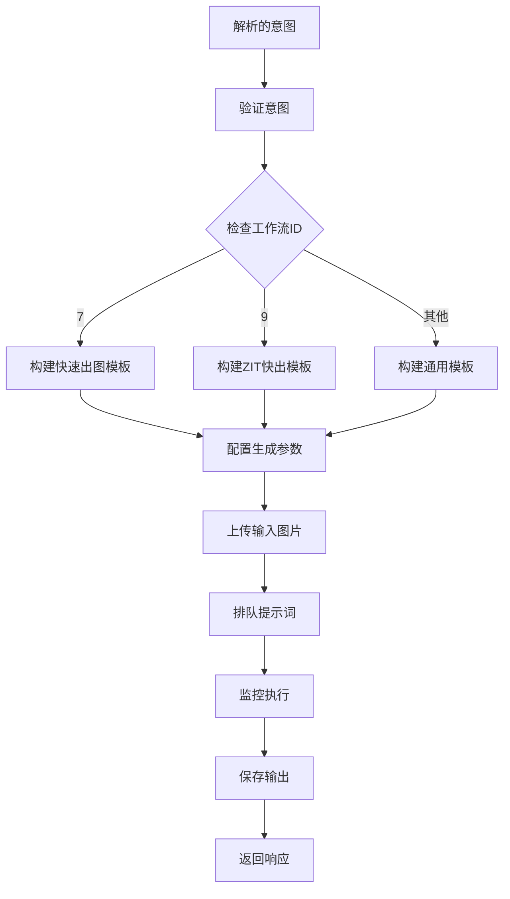

**图表来源**
- [server/src/routes/agent.ts:633-750](file://server/src/routes/agent.ts#L633-L750)

**章节来源**
- [server/src/adapters/index.ts:14-30](file://server/src/adapters/index.ts#L14-L30)

## 会话管理与持久化

### 会话状态管理

系统实现了完整的会话管理机制，确保用户操作的连续性和数据持久化：

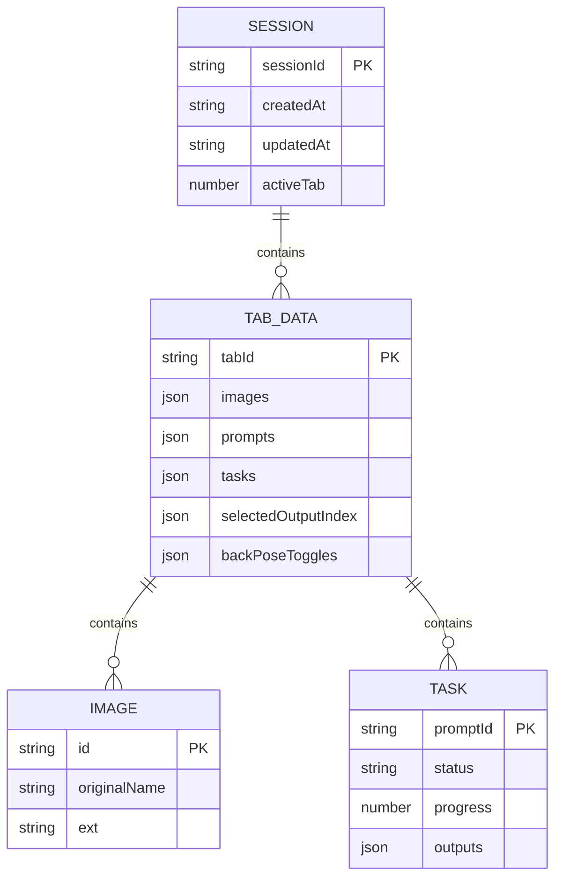

**图表来源**
- [server/src/services/sessionManager.ts:61-89](file://server/src/services/sessionManager.ts#L61-L89)

### 数据持久化策略

系统采用分层数据存储策略：

1. **会话元数据**：存储在session.json中，包含会话基本信息
2. **图像数据**：按会话和标签分类存储在独立目录
3. **生成日志**：记录详细的生成历史和用户偏好
4. **收藏夹**：维护用户收藏的图像信息

**章节来源**
- [server/src/services/sessionManager.ts:91-120](file://server/src/services/sessionManager.ts#L91-L120)

## 前端交互层

### Agent对话组件

前端通过AgentDialog组件提供直观的AI交互体验：

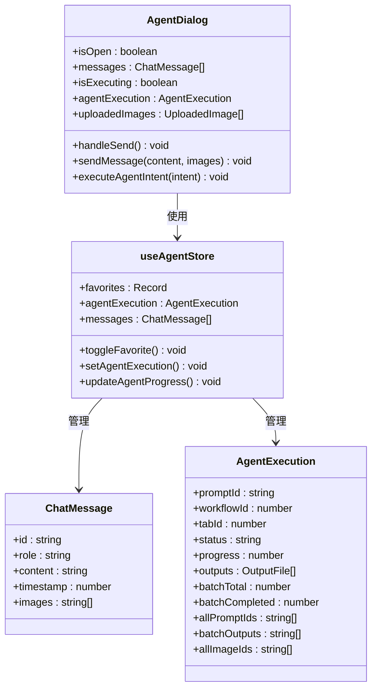

**图表来源**
- [client/src/components/AgentDialog.tsx:7-800](file://client/src/components/AgentDialog.tsx#L7-L800)
- [client/src/hooks/useAgentStore.ts:54-122](file://client/src/hooks/useAgentStore.ts#L54-L122)

### 实时进度监控

前端通过WebSocket实现与后端的实时通信：

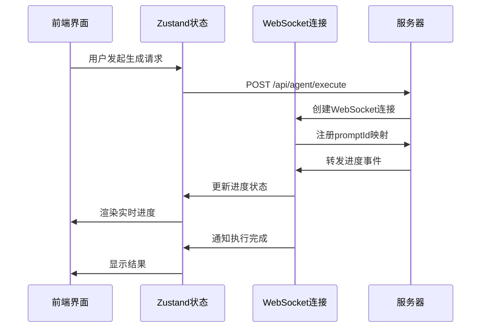

**图表来源**
- [client/src/components/AgentDialog.tsx:388-393](file://client/src/components/AgentDialog.tsx#L388-L393)
- [server/src/index.ts:214-236](file://server/src/index.ts#L214-L236)

**章节来源**
- [client/src/hooks/useAgentStore.ts:124-226](file://client/src/hooks/useAgentStore.ts#L124-L226)

## 批量变体生成功能

### 批量模式架构设计

系统新增了强大的批量变体生成功能，允许用户一次性生成多个不同参数的变体版本：

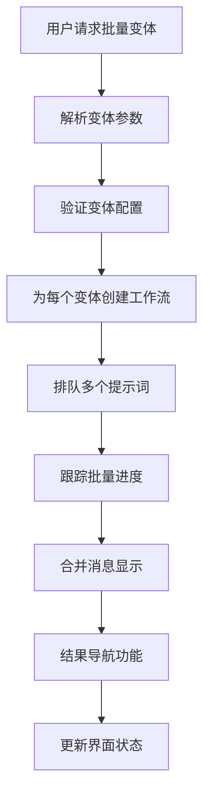

**图表来源**
- [server/src/routes/agent.ts:794-837](file://server/src/routes/agent.ts#L794-L837)
- [client/src/components/AgentDialog.tsx:47-87](file://client/src/components/AgentDialog.tsx#L47-L87)

### 后端批量处理实现

后端通过LLM服务的variants参数支持批量变体生成：

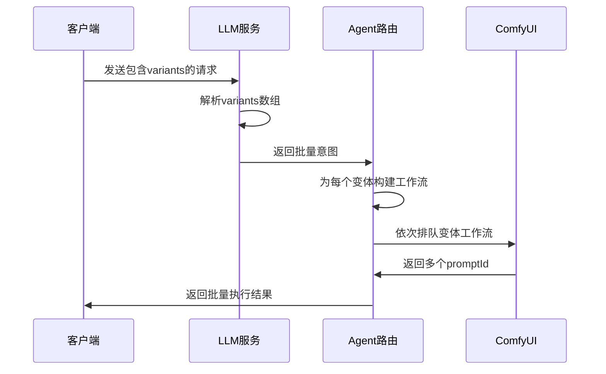

**图表来源**
- [server/src/services/llmService.ts:152-177](file://server/src/services/llmService.ts#L152-L177)
- [server/src/routes/agent.ts:794-837](file://server/src/routes/agent.ts#L794-L837)

### 前端批量状态管理

前端通过useAgentStore管理批量模式的状态：

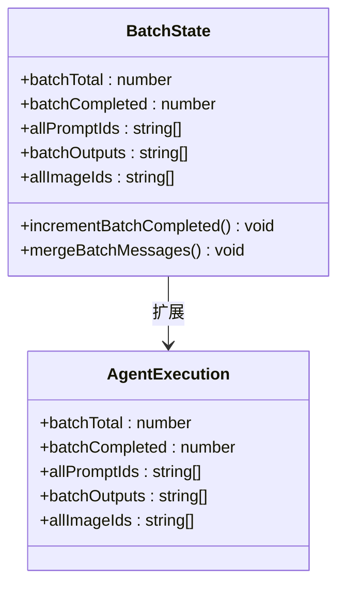

**图表来源**
- [client/src/hooks/useAgentStore.ts:107-131](file://client/src/hooks/useAgentStore.ts#L107-L131)
- [client/src/components/AgentDialog.tsx:48-87](file://client/src/components/AgentDialog.tsx#L48-L87)

### 批量进度跟踪机制

系统实现了精细的批量进度跟踪，支持多变体同时生成：

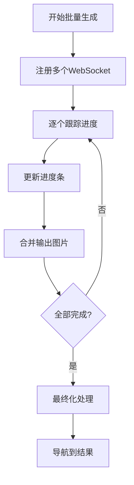

**图表来源**
- [client/src/components/AgentDialog.tsx:89-177](file://client/src/components/AgentDialog.tsx#L89-L177)
- [client/src/hooks/useAgentStore.ts:232-246](file://client/src/hooks/useAgentStore.ts#L232-L246)

**章节来源**
- [server/src/services/llmService.ts:152-177](file://server/src/services/llmService.ts#L152-L177)
- [client/src/hooks/useAgentStore.ts:107-131](file://client/src/hooks/useAgentStore.ts#L107-L131)

## 性能优化策略

### 缓存机制

系统实现了多层次的缓存策略以提升性能：

1. **元数据缓存**：模型元数据缓存1分钟，减少文件读取开销
2. **用户画像缓存**：构建用户画像时使用内存缓存
3. **模板缓存**：工作流模板在内存中缓存，避免重复加载

### 并发处理

- **异步写入**：生成日志和收藏操作使用异步方式，不阻塞主线程
- **WebSocket复用**：单个客户端连接复用，减少资源消耗
- **批量操作**：支持多图片同时处理，提高吞吐量
- **批量变体并发**：多个变体工作流可以并行排队执行

### 内存管理

- **及时清理**：WebSocket断开时自动清理事件缓冲区
- **资源释放**：生成完成后及时释放相关资源
- **会话清理**：定期清理长时间未使用的会话

## 故障排除指南

### 常见问题及解决方案

| 问题类型 | 症状 | 可能原因 | 解决方案 |
|---------|------|----------|----------|
| LLM调用失败 | 返回纯文本回复 | API密钥错误或网络问题 | 检查API配置和网络连接 |
| 工作流执行失败 | 生成卡在0% | ComfyUI未启动或模板错误 | 确认ComfyUI服务运行正常 |
| 进度不更新 | WebSocket连接异常 | 端口被占用或防火墙阻止 | 检查端口配置和防火墙设置 |
| 图像保存失败 | 输出文件缺失 | 权限问题或磁盘空间不足 | 检查输出目录权限和磁盘空间 |
| 批量变体失败 | 部分变体未生成 | 参数配置错误或资源不足 | 检查变体参数配置和系统资源 |

### 调试技巧

1. **启用详细日志**：在开发环境中启用更详细的日志输出
2. **检查网络连接**：确认前后端之间的网络通信正常
3. **验证配置文件**：检查所有配置文件的格式和内容
4. **监控系统资源**：关注CPU、内存和磁盘使用情况
5. **批量模式调试**：使用简化参数测试批量变体功能

**章节来源**
- [server/src/index.ts:247-261](file://server/src/index.ts#L247-L261)

## 总结

CorineKit Pix2Real的AI代理服务层展现了现代AI应用的完整架构设计。通过智能的LLM集成、精确的意图解析、灵活的工作流适配器系统，以及完善的会话管理机制，系统为用户提供了流畅、智能的AI图像生成体验。

### 核心优势

1. **智能化程度高**：能够理解复杂的用户需求并自动生成相应的参数
2. **扩展性强**：模块化的架构设计便于添加新的工作流程和功能
3. **用户体验优秀**：实时进度反馈和直观的界面设计
4. **性能表现稳定**：多层缓存和并发处理机制确保系统的高效运行
5. **批量处理能力强**：支持多变体同时生成，大幅提升创作效率

### 技术亮点

- **多模态输入支持**：同时支持文本描述和图片上传
- **智能推荐系统**：基于用户偏好的个性化建议
- **实时交互体验**：WebSocket实现实时进度更新
- **完整的生命周期管理**：从会话创建到数据持久化的全流程管理
- **批量变体生成功能**：支持多参数、多风格的变体生成，极大提升创意效率

该系统为AI图像生成领域提供了一个优秀的参考实现，展示了如何将先进的AI技术与实用的用户界面相结合，创造出真正有价值的应用程序。