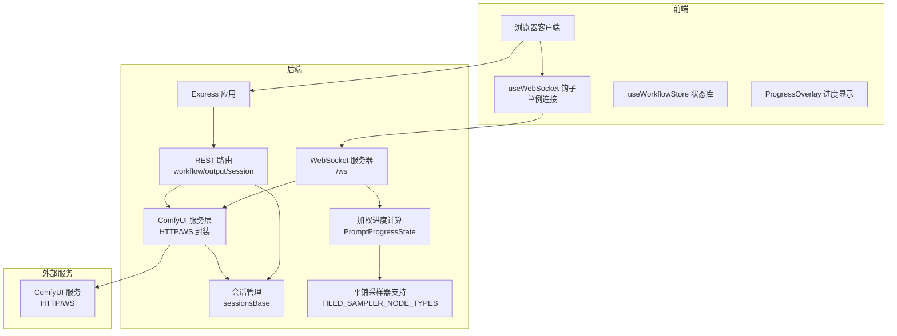
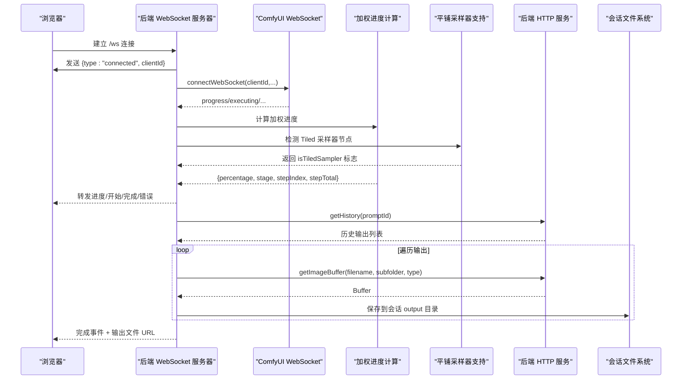
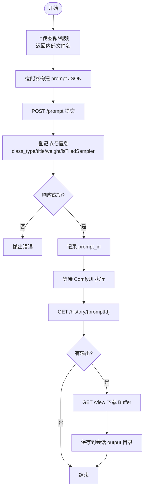
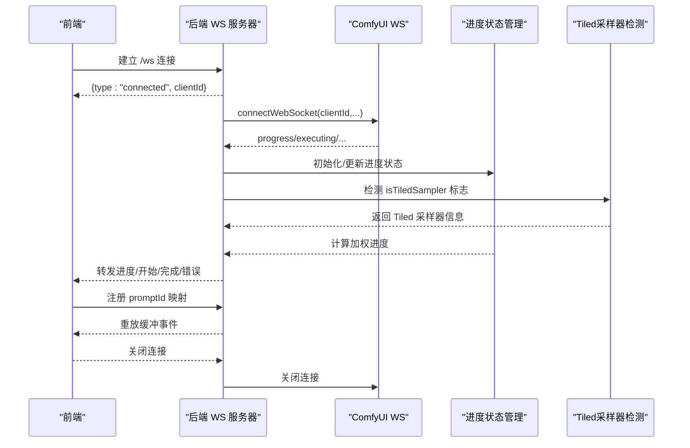
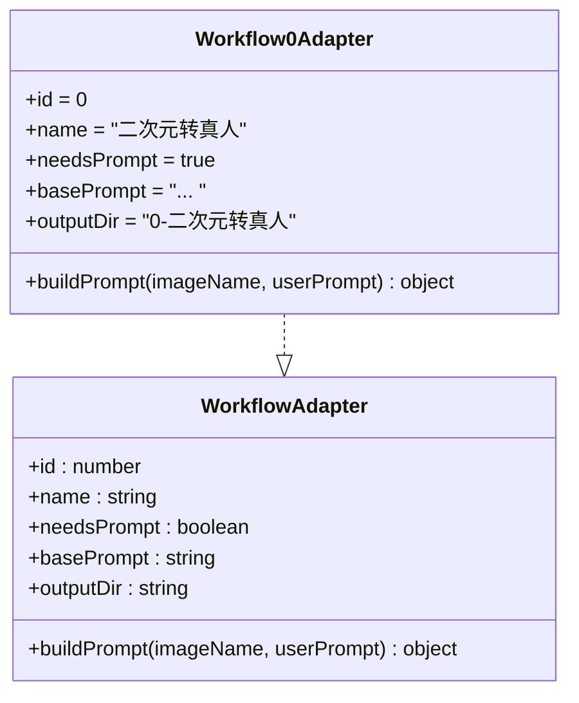
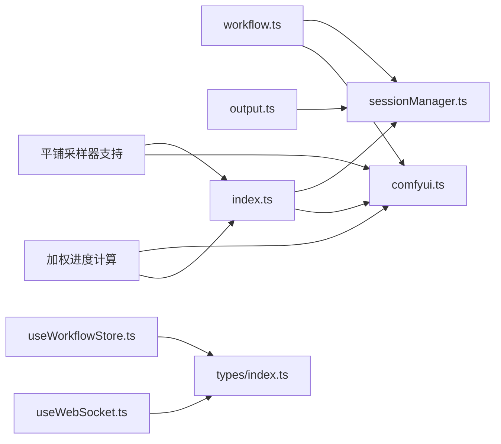

# ComfyUI 集成

<cite>
**本文引用的文件**
- [server/src/services/comfyui.ts](file://server/src/services/comfyui.ts)
- [server/src/routes/workflow.ts](file://server/src/routes/workflow.ts)
- [server/src/routes/output.ts](file://server/src/routes/output.ts)
- [server/src/routes/session.ts](file://server/src/routes/session.ts)
- [server/src/services/sessionManager.ts](file://server/src/services/sessionManager.ts)
- [server/src/adapters/index.ts](file://server/src/adapters/index.ts)
- [server/src/adapters/BaseAdapter.ts](file://server/src/adapters/BaseAdapter.ts)
- [server/src/adapters/Workflow0Adapter.ts](file://server/src/adapters/Workflow0Adapter.ts)
- [server/src/types/index.ts](file://server/src/types/index.ts)
- [server/src/index.ts](file://server/src/index.ts)
- [client/src/hooks/useWebSocket.ts](file://client/src/hooks/useWebSocket.ts)
- [client/src/hooks/useWorkflowStore.ts](file://client/src/hooks/useWorkflowStore.ts)
- [client/src/types/index.ts](file://client/src/types/index.ts)
- [client/src/components/ProgressOverlay.tsx](file://client/src/components/ProgressOverlay.tsx)
- [README.md](file://README.md)
</cite>

## 更新摘要
**所做更改**
- 新增平铺采样器集成章节，详细介绍 TILED_SAMPLER_NODE_TYPES 集合和 isTiledSampler 标志支持
- 更新节点权重分析与阶段映射功能说明，包含 Tiled 采样器的特殊处理机制
- 增强 WebSocket 进度事件处理与前端展示优化，支持多轮节点和 Tiled 采样器进度计算
- 补充采样器权重计算与动态权重调整机制，包括 Tiled 采样器的估算算法
- 更新进度条计算公式与阶段名称映射表，涵盖 SD 放大采样阶段

## 目录
1. [简介](#简介)
2. [项目结构](#项目结构)
3. [核心组件](#核心组件)
4. [架构总览](#架构总览)
5. [详细组件分析](#详细组件分析)
6. [加权进度计算系统](#加权进度计算系统)
7. [平铺采样器集成](#平铺采样器集成)
8. [依赖关系分析](#依赖关系分析)
9. [性能考虑](#性能考虑)
10. [故障排查指南](#故障排查指南)
11. [结论](#结论)
12. [附录](#附录)

## 简介
本技术文档面向 CorineKit Pix2Real 的 ComfyUI 集成服务，聚焦于以下方面：
- HTTP API 调用封装：工作流提交、参数传递、响应处理、错误处理与超时策略
- WebSocket 连接管理：连接建立、消息路由、事件监听、断线重连策略
- 文件上传下载处理：二进制数据传输、进度监控、内存管理
- ComfyUI 服务集成流程：认证机制（clientId）、超时处理、性能优化建议
- **新增** 加权进度计算系统：基于节点权重分析的精确进度估算
- **新增** 平铺采样器集成：支持 UltimateSDUpscale 等 Tiled 采样器的特殊进度计算

该系统通过适配器模式加载 ComfyUI 工作流模板，统一构建 prompt JSON 并提交队列；后端以单例 WebSocket 代理与 ComfyUI 实时通信，同时在任务完成后将输出文件下载到本地会话目录，供前端按需访问。**最新更新**引入了基于节点权重分析的加权进度计算系统，提供更准确的任务进度估算，并集成了平铺采样器支持，能够处理分块重复采样的复杂进度计算。

## 项目结构
整体采用前后端分离架构：
- 前端（React + TypeScript）：负责用户交互、状态管理、WebSocket 事件消费与 UI 展示
- 后端（Express + ws）：提供 REST API、WebSocket 中继、文件系统会话持久化、与 ComfyUI 的 HTTP/WS 交互



**图表来源**
- [server/src/index.ts:62-219](file://server/src/index.ts#L62-L219)
- [server/src/routes/workflow.ts:1-862](file://server/src/routes/workflow.ts#L1-L862)
- [server/src/routes/output.ts:1-134](file://server/src/routes/output.ts#L1-L134)
- [server/src/routes/session.ts:1-95](file://server/src/routes/session.ts#L1-L95)
- [server/src/services/comfyui.ts:1-285](file://server/src/services/comfyui.ts#L1-L285)
- [server/src/services/sessionManager.ts:1-164](file://server/src/services/sessionManager.ts#L1-L164)
- [client/src/hooks/useWebSocket.ts:1-99](file://client/src/hooks/useWebSocket.ts#L1-L99)
- [client/src/hooks/useWorkflowStore.ts:1-645](file://client/src/hooks/useWorkflowStore.ts#L1-L645)
- [client/src/components/ProgressOverlay.tsx:1-126](file://client/src/components/ProgressOverlay.tsx#L1-L126)

**章节来源**
- [README.md:41-79](file://README.md#L41-L79)
- [server/src/index.ts:1-228](file://server/src/index.ts#L1-L228)

## 核心组件
- ComfyUI 服务层（HTTP/WS）
  - HTTP：上传图像/视频、提交 prompt、查询历史、获取图片、系统统计、队列管理、模型列表等
  - WebSocket：连接 ComfyUI，转发进度、执行开始、完成、错误事件
- 路由层
  - 工作流路由：执行单图/批量、取消队列、优先级调整、释放内存、系统统计、导出混合图等
  - 输出路由：列出/下载输出文件、打开文件或文件夹
  - 会话路由：保存输入图/蒙版、保存/加载/删除会话状态
- 适配器层
  - 每个工作流一个适配器，加载模板并按需填充节点（如图像名、提示词、随机种子）
- 会话管理
  - 会话目录结构化存储输入图、蒙版、输出文件与状态 JSON
- 前端 WebSocket 与状态
  - 单例 WebSocket 连接、断线重连、事件分发至状态库
  - 状态库维护任务生命周期、进度、输出文件映射
- **新增** 加权进度计算系统
  - PromptProgressState 管理：跟踪任务总节点数、总权重、已完成权重等状态
  - 节点权重分析：基于时间开销的静态权重表和动态采样权重计算
  - 阶段映射：将节点类型映射为用户友好的中文阶段名称
- **新增** 平铺采样器支持
  - TILED_SAMPLER_NODE_TYPES 集合：包含 UltimateSDUpscale、UltimateSDUpscaleNoUpscale 等节点类型
  - isTiledSampler 标志：标记节点是否为 Tiled 采样器，启用特殊进度计算逻辑
  - 多轮节点处理：支持分块重复采样的 tick 计数机制

**章节来源**
- [server/src/services/comfyui.ts:1-285](file://server/src/services/comfyui.ts#L1-L285)
- [server/src/routes/workflow.ts:1-862](file://server/src/routes/workflow.ts#L1-L862)
- [server/src/routes/output.ts:1-134](file://server/src/routes/output.ts#L1-L134)
- [server/src/routes/session.ts:1-95](file://server/src/routes/session.ts#L1-L95)
- [server/src/adapters/index.ts:1-31](file://server/src/adapters/index.ts#L1-L31)
- [server/src/adapters/Workflow0Adapter.ts:1-35](file://server/src/adapters/Workflow0Adapter.ts#L1-L35)
- [server/src/services/sessionManager.ts:1-164](file://server/src/services/sessionManager.ts#L1-L164)
- [client/src/hooks/useWebSocket.ts:1-99](file://client/src/hooks/useWebSocket.ts#L1-L99)
- [client/src/hooks/useWorkflowStore.ts:1-645](file://client/src/hooks/useWorkflowStore.ts#L1-L645)

## 架构总览
后端启动时创建 Express 与 WebSocketServer，分别监听 HTTP 与 WS 请求。每个浏览器客户端连接后，后端分配唯一 clientId 并与 ComfyUI 建立 WebSocket 连接，将 ComfyUI 的进度/完成/错误事件转换为统一格式回传给前端。**新增的加权进度计算系统**在事件处理过程中实时计算精确的进度百分比，包括阶段名称、步骤索引和总步骤数。**新增的平铺采样器支持**能够处理分块重复采样的复杂进度计算，使用 tick 计数和预期 tick 数来估算进度。完成事件中包含输出文件信息，后端从 ComfyUI 下载对应二进制并保存到会话目录，随后通知前端。



**图表来源**
- [server/src/index.ts:73-219](file://server/src/index.ts#L73-L219)
- [server/src/services/comfyui.ts:47-125](file://server/src/services/comfyui.ts#L47-L125)
- [server/src/services/sessionManager.ts:34-57](file://server/src/services/sessionManager.ts#L34-L57)

**章节来源**
- [server/src/index.ts:62-228](file://server/src/index.ts#L62-L228)

## 详细组件分析

### HTTP API 调用封装与工作流执行
- 上传文件
  - 支持图像与视频上传，使用表单数据提交至 ComfyUI 的上传接口
  - 返回 ComfyUI 内部文件名，用于后续模板节点引用
- 提交工作流
  - 将适配器构建好的 prompt JSON 通过 /prompt 接口提交
  - 返回 prompt_id，作为后续历史查询与输出下载的标识
  - **新增**：在提交时自动登记节点信息（class_type、title、weight、isTiledSampler）
- 历史与输出
  - 通过 /history/{promptId} 获取输出文件列表
  - 通过 /view 接口下载具体文件为 Buffer
- 队列与系统
  - 查询队列、删除队列项、提升优先级、系统统计（VRAM/内存）
- 模型列表
  - 通过 /object_info/* 接口动态获取可用模型名称



**图表来源**
- [server/src/services/comfyui.ts:9-83](file://server/src/services/comfyui.ts#L9-L83)
- [server/src/routes/workflow.ts:407-455](file://server/src/routes/workflow.ts#L407-L455)
- [server/src/services/sessionManager.ts:34-57](file://server/src/services/sessionManager.ts#L34-L57)

**章节来源**
- [server/src/services/comfyui.ts:9-125](file://server/src/services/comfyui.ts#L9-L125)
- [server/src/routes/workflow.ts:407-455](file://server/src/routes/workflow.ts#L407-L455)

### WebSocket 连接管理与事件路由
- 连接建立
  - 客户端首次连接后，后端分配 clientId 并发送 connected 事件
  - 后端为该客户端创建 ComfyUI WebSocket 连接
- 事件路由
  - progress：计算百分比并转发
  - executing：首次节点非空触发 execution_start，节点为空触发 complete
  - execution_success：显式完成信号
  - execution_error：错误事件
- 断线重连
  - 前端 useWebSocket 使用模块级全局连接与计数，断开后延迟重连
  - 后端在客户端断开时关闭对应的 ComfyUI 连接
- 事件缓冲与重放
  - 对每个 promptId 维护事件缓冲，若客户端注册较晚可重放已发生的 execution_start/progress
- **新增** 加权进度计算
  - onExecutionStart：初始化 PromptProgressState
  - onExecutionCached：处理缓存命中节点，直接计入已完成权重
  - onExecutingNode：节点切换时更新阶段名称和权重
  - onProgress：实时计算加权进度百分比
- **新增** 平铺采样器支持
  - 检测 isTiledSampler 标志，启用特殊进度计算逻辑
  - 多轮节点处理：使用 nodeTickCount 和预期 tick 数计算进度



**图表来源**
- [server/src/index.ts:73-219](file://server/src/index.ts#L73-L219)
- [client/src/hooks/useWebSocket.ts:1-99](file://client/src/hooks/useWebSocket.ts#L1-L99)

**章节来源**
- [server/src/index.ts:73-219](file://server/src/index.ts#L73-L219)
- [client/src/hooks/useWebSocket.ts:1-99](file://client/src/hooks/useWebSocket.ts#L1-L99)

### 文件上传下载处理与内存管理
- 上传
  - 使用 multer 内存存储，直接将 Buffer 传入 ComfyUI 上传接口
  - 图像与视频分别调用不同的上传函数
- 下载
  - 通过 /view 接口获取 Buffer，再写入会话 output 目录
  - 保存路径通过 /api/session-files 暴露静态访问
- 内存管理
  - 服务端使用内存存储上传文件，适合小批量场景
  - 大批量或大尺寸文件建议结合 ComfyUI 的本地存储或外部对象存储
- 输出访问
  - 输出路由支持直接下载与打开文件，默认应用

**章节来源**
- [server/src/routes/workflow.ts:22-27](file://server/src/routes/workflow.ts#L22-L27)
- [server/src/services/comfyui.ts:9-83](file://server/src/services/comfyui.ts#L9-L83)
- [server/src/routes/output.ts:1-134](file://server/src/routes/output.ts#L1-L134)
- [server/src/services/sessionManager.ts:20-57](file://server/src/services/sessionManager.ts#L20-L57)

### 适配器模式与工作流模板
- 适配器职责
  - 加载对应 JSON 模板，仅修改必要节点（图像名、提示词、随机种子等）
  - 统一输出结构，便于路由层复用
- 典型流程
  - 读取模板 → 填充节点 → 随机种子 → 提交队列 → 记录 prompt_id → 等待完成 → 下载输出



**图表来源**
- [server/src/adapters/BaseAdapter.ts:1-4](file://server/src/adapters/BaseAdapter.ts#L1-L4)
- [server/src/adapters/Workflow0Adapter.ts:1-35](file://server/src/adapters/Workflow0Adapter.ts#L1-L35)
- [server/src/adapters/index.ts:1-31](file://server/src/adapters/index.ts#L1-L31)

**章节来源**
- [server/src/adapters/Workflow0Adapter.ts:1-35](file://server/src/adapters/Workflow0Adapter.ts#L1-L35)
- [server/src/adapters/index.ts:1-31](file://server/src/adapters/index.ts#L1-L31)

### 会话与状态持久化
- 目录结构
  - sessions/{sessionId}/tab-{tabId}/{input|masks|output}
- 功能
  - 保存输入图、蒙版、输出文件
  - 保存/加载/删除会话状态 JSON
  - 列出最近会话并裁剪旧会话
- 与输出路由配合
  - 输出文件通过 /api/session-files 暴露，支持打开文件默认应用

**章节来源**
- [server/src/services/sessionManager.ts:1-164](file://server/src/services/sessionManager.ts#L1-L164)
- [server/src/routes/output.ts:1-134](file://server/src/routes/output.ts#L1-L134)
- [server/src/routes/session.ts:1-95](file://server/src/routes/session.ts#L1-L95)

## 加权进度计算系统

### PromptProgressState 管理机制
**新增** 系统引入了 PromptProgressState 接口来管理每个任务的进度状态：

- totalNodes：任务总节点数
- totalWeight：任务总权重（基于节点时间开销计算）
- completedWeight：已完成节点的累计权重
- stepIndex：当前执行步骤索引
- currentNode：当前执行节点ID
- currentStage：当前阶段名称
- currentNodeWeight：当前节点权重
- currentValue/currentMax：当前节点内部进度值
- **新增** nodeTickCount：统计当前节点收到的 progress 消息总数，用于多轮场景（如 UltimateSDUpscale）
- **新增** nodeIsMultiRound：标记节点是否为多轮执行
- **新增** nodeIsTiledSampler：预标记节点是否为 Tiled sampler，始终用 tick 计数

系统通过 getOrInitProgress 函数为每个 promptId 创建和维护独立的进度状态，确保多任务并行时的准确性。

**章节来源**
- [server/src/index.ts:175-216](file://server/src/index.ts#L175-L216)

### 节点权重分析与计算
**新增** 节点权重系统基于时间开销分析，分为静态权重和动态权重两部分：

#### 静态权重表（基于节点类型的时间开销）
- 模型加载类：15 权重（CheckpointLoaderSimple、UNETLoader 等）
- 文本编码类：2-3 权重（CLIPTextEncode 等）
- VAE 编解码：3-4 权重（VAEEncode、VAEDecode、VAEDecodeTiled 等）
- 放大类：8 权重（ImageUpscaleWithModel 等）
- IO 类：1 权重（SaveImage、LoadImage 等）
- 特殊处理：换脸、分割、反推等 8-10 权重

#### 动态权重计算（采样器）
采样器节点权重根据 steps 参数动态计算：
- **标准采样器**：基础权重 = steps × 2.5，当缺少 steps 时使用默认步骤 20
- **Tiled 采样器**：基础权重 = steps × 估算 tile 数 × 2.5，估算 tile 数为 8
- 多采样器工作流会自然按采样次数累加权重

**章节来源**
- [server/src/services/comfyui.ts:57-144](file://server/src/services/comfyui.ts#L57-L144)

### 阶段映射与友好显示
**新增** 系统提供了节点类型到中文阶段名称的映射表：

- 模型加载：加载主模型、加载 UNET、加载 VAE 等
- 文本编码：编码提示词
- VAE 编解码：VAE 编码、VAE 解码、VAE 解码（平铺）
- 采样：采样中
- 放大：放大图像、放大潜空间、SD 放大采样
- 视频：合成视频、加载视频
- IO：保存图像、预览图像、加载图像
- 特殊：面部交换、智能分割、反推提示词

如果节点没有映射，系统会回退到用户在 ComfyUI 中设置的节点标题。

**章节来源**
- [server/src/index.ts:19-74](file://server/src/index.ts#L19-L74)

### 进度计算公式与事件处理
**新增** 加权进度计算的核心公式：
```
全局进度 = (已完成权重 + 当前节点权重 × 当前节点内部进度) / 总权重 × 100%
```

**新增** Tiled 采样器的特殊处理逻辑：
- 多轮节点检测：通过 nodeTickCount 和预期 tick 数计算进度
- 预期 tick 数：currentNodeWeight / SAMPLER_STEP_WEIGHT
- 节点内部进度：min(0.95, nodeTickCount / 预期tick数)

系统通过多个事件处理器实现精确进度跟踪：

- onExecutionStart：初始化进度状态，发送 execution_start 事件
- onExecutionCached：处理缓存命中节点，直接计入已完成权重
- onExecutingNode：节点切换时更新阶段名称和权重，推进步骤索引
- onProgress：实时计算并发送加权进度，支持节点切换时的权重同步

**章节来源**
- [server/src/index.ts:216-320](file://server/src/index.ts#L216-L320)

### 前端进度展示优化
**新增** 前端 ProgressOverlay 组件现在接收并展示新的进度信息：

- stage：当前执行阶段名称
- stepIndex/stepTotal：当前步骤索引和总步骤数
- percentage：加权计算的进度百分比（最大 99%，完成时为 100%）

组件支持"准备中"动画状态，当还没有进入第一个节点时显示加载动画。

**章节来源**
- [client/src/components/ProgressOverlay.tsx:59-94](file://client/src/components/ProgressOverlay.tsx#L59-L94)
- [client/src/hooks/useWorkflowStore.ts:73](file://client/src/hooks/useWorkflowStore.ts#L73)

## 平铺采样器集成

### TILED_SAMPLER_NODE_TYPES 集合
**新增** 系统引入了专门的 Tiled 采样器支持，包含以下节点类型：

- UltimateSDUpscale：支持图像放大和分块采样的主要节点
- UltimateSDUpscaleNoUpscale：仅进行分块采样而不放大图像

这些节点的特点是：
- 采用分块重复采样的方式处理大图像
- 实际耗时 = steps × tile 数 × 采样系数
- tile 数取决于图片尺寸和放大倍率，无法静态精确计算

**章节来源**
- [server/src/services/comfyui.ts:120-124](file://server/src/services/comfyui.ts#L120-L124)

### isTiledSampler 标志支持
**新增** 在 PromptNodeInfo 接口中增加了 isTiledSampler 标志：

- 标记节点是否为 Tiled 采样器
- 在 queuePrompt 时自动检测并设置该标志
- 影响进度计算和阶段名称映射

**章节来源**
- [server/src/services/comfyui.ts:51-56](file://server/src/services/comfyui.ts#L51-L56)
- [server/src/services/comfyui.ts:189-191](file://server/src/services/comfyui.ts#L189-L191)

### ESTIMATED_TILE_COUNT 估算机制
**新增** 系统使用保守估算的 tile 数：

- 估价值：8（小图约 4，大图可达 100+，取偏下的中值）
- 作用：避免过度膨胀导致进度条显示不准确
- 计算公式：Tiled 采样器权重 = steps × 8 × 2.5

这种设计平衡了精度和性能，确保进度估算既不过于乐观也不过于悲观。

**章节来源**
- [server/src/services/comfyui.ts:124-125](file://server/src/services/comfyui.ts#L124-L125)

### 多轮节点处理机制
**新增** Tiled 采样器的特殊进度计算：

- nodeTickCount：统计收到的 progress 消息数量
- 预期 tick 数：currentNodeWeight / SAMPLER_STEP_WEIGHT
- 节点内部进度：min(0.95, nodeTickCount / 预期tick数)
- 不受 max 重置影响：线性递增，避免进度回退

这种机制能够准确跟踪分块重复采样的进度，即使 ComfyUI 在不同 tile 之间切换进度值。

**章节来源**
- [server/src/index.ts:232-239](file://server/src/index.ts#L232-L239)
- [server/src/index.ts:288-293](file://server/src/index.ts#L288-L293)

### 阶段名称映射
**新增** Tiled 采样器的阶段名称：

- UltimateSDUpscale：SD 放大采样
- UltimateSDUpscaleNoUpscale：SD 放大采样

这些阶段名称与普通放大节点区分，让用户清楚地知道正在进行的是分块采样处理。

**章节来源**
- [server/src/index.ts:55-56](file://server/src/index.ts#L55-L56)

## 依赖关系分析
- 路由依赖服务层
  - workflow 路由依赖 comfyui 服务与会话管理
  - output 路由依赖会话管理与文件系统
- 服务层依赖
  - comfyui 服务依赖 node-fetch、ws 与 ComfyUI API
  - 会话管理依赖文件系统
- 前端依赖
  - useWebSocket 依赖 WebSocket 与 Zustand 状态库
  - 类型定义统一前后端事件结构
- **新增** 进度计算依赖
  - index.ts 中的 PromptProgressState 管理
  - comfyui.ts 中的节点权重计算
  - **新增** Tiled 采样器检测逻辑
- **新增** 平铺采样器依赖
  - TILED_SAMPLER_NODE_TYPES 集合
  - isTiledSampler 标志支持
  - 多轮节点处理机制



**图表来源**
- [server/src/routes/workflow.ts:1-11](file://server/src/routes/workflow.ts#L1-L11)
- [server/src/routes/output.ts:1-6](file://server/src/routes/output.ts#L1-L6)
- [server/src/routes/session.ts:1-13](file://server/src/routes/session.ts#L1-L13)
- [server/src/services/comfyui.ts:1-5](file://server/src/services/comfyui.ts#L1-L5)
- [server/src/services/sessionManager.ts:1-6](file://server/src/services/sessionManager.ts#L1-L6)
- [server/src/index.ts:1-12](file://server/src/index.ts#L1-L12)
- [client/src/hooks/useWebSocket.ts:1-4](file://client/src/hooks/useWebSocket.ts#L1-L4)
- [client/src/hooks/useWorkflowStore.ts:1-5](file://client/src/hooks/useWorkflowStore.ts#L1-L5)
- [client/src/types/index.ts:1-58](file://client/src/types/index.ts#L1-L58)

**章节来源**
- [server/src/routes/workflow.ts:1-11](file://server/src/routes/workflow.ts#L1-L11)
- [server/src/routes/output.ts:1-6](file://server/src/routes/output.ts#L1-L6)
- [server/src/routes/session.ts:1-13](file://server/src/routes/session.ts#L1-L13)
- [server/src/services/comfyui.ts:1-5](file://server/src/services/comfyui.ts#L1-L5)
- [server/src/services/sessionManager.ts:1-6](file://server/src/services/sessionManager.ts#L1-L6)
- [server/src/index.ts:1-12](file://server/src/index.ts#L1-L12)
- [client/src/hooks/useWebSocket.ts:1-4](file://client/src/hooks/useWebSocket.ts#L1-L4)
- [client/src/hooks/useWorkflowStore.ts:1-5](file://client/src/hooks/useWorkflowStore.ts#L1-L5)
- [client/src/types/index.ts:1-58](file://client/src/types/index.ts#L1-L58)

## 性能考虑
- HTTP 超时与重试
  - 当前实现未内置 HTTP 重试逻辑，建议在关键路径（如 /prompt、/history、/view）增加指数退避重试与超时控制
- WebSocket 重连
  - 前端已具备断线重连，建议在后端也对 ComfyUI 连接进行健壮性处理（异常捕获、自动重建）
- 内存占用
  - multer 使用内存存储，建议限制单次上传大小与并发数；对大批量任务采用分批提交与队列优先级调整
- 输出下载
  - 下载完成后立即清理临时文件，避免磁盘膨胀；对大文件建议流式传输或分块下载
- 模型与资源
  - 通过 /object_info 接口动态获取模型列表，减少硬编码；在 UI 中缓存模型列表以降低请求频率
- **新增** 进度计算性能
  - 节点权重计算复杂度低，对性能影响可忽略
  - 进度状态缓存使用 Map 结构，内存占用与任务数量线性相关
  - 建议定期清理已完成任务的进度状态以释放内存
- **新增** Tiled 采样器性能
  - Tiled 采样器权重估算使用保守值，避免过度计算
  - 多轮节点处理仅在 Tiled 采样器时启用，减少不必要的计算开销
  - nodeTickCount 计数器内存占用与节点数量线性相关

## 故障排查指南
- ComfyUI 不可用
  - 现象：HTTP 错误、WebSocket 连接失败
  - 排查：确认 ComfyUI 在 127.0.0.1:8188 运行；检查防火墙与跨域配置
- 上传失败
  - 现象：/upload/image 返回错误
  - 排查：检查文件类型与大小限制；确认 ComfyUI 上传目录权限
- 提交队列失败
  - 现象：/prompt 返回错误
  - 排查：检查 prompt JSON 结构是否符合模板；确认 clientId 是否正确传递
- 无进度/无完成事件
  - 现象：WebSocket 无 progress 或 complete
  - 排查：确认客户端已注册 promptId 映射；检查后端事件缓冲与重放逻辑
  - **新增**：检查节点权重计算是否正常，确认 STAGE_NAMES 映射是否存在
  - **新增**：检查 Tiled 采样器节点的 isTiledSampler 标志是否正确设置
- 输出文件缺失
  - 现象：完成事件存在但无法下载
  - 排查：检查 /history 返回的输出列表；确认 /view 参数与文件存在；查看后端日志中的下载错误
- **新增** 进度显示异常
  - 现象：进度百分比不准确或阶段名称显示异常
  - 排查：检查节点权重表配置；确认节点类型映射；验证采样器 steps 参数
  - **新增**：检查 Tiled 采样器的 ESTIMATED_TILE_COUNT 估算值是否合理
  - **新增**：验证 nodeTickCount 计数器是否正常递增
- **新增** Tiled 采样器问题
  - 现象：SD 放大采样进度异常或停滞
  - 排查：确认节点类型为 UltimateSDUpscale 或 UltimateSDUpscaleNoUpscale
  - 排查：检查 steps 参数是否正确设置
  - 排查：验证预期 tick 数计算是否正确

**章节来源**
- [server/src/services/comfyui.ts:47-83](file://server/src/services/comfyui.ts#L47-L83)
- [server/src/routes/workflow.ts:522-579](file://server/src/routes/workflow.ts#L522-L579)
- [server/src/index.ts:92-189](file://server/src/index.ts#L92-L189)

## 结论
本系统通过适配器模式与统一的 HTTP/WS 封装，实现了对多种 ComfyUI 工作流的标准化接入。**最新更新**引入的加权进度计算系统显著提升了进度估算的准确性，通过节点权重分析和阶段映射为用户提供了更直观的任务执行状态。**新增的平铺采样器集成**进一步增强了系统的实用性，能够准确处理分块重复采样的复杂进度计算。前端以单例 WebSocket 与状态库协同，提供实时进度与输出管理；后端负责与 ComfyUI 的桥接与本地文件持久化。建议在生产环境中增强 HTTP 重试与超时、优化大文件处理与内存占用，并完善错误监控与日志追踪。

## 附录

### API 一览（节选）
- 工作流执行
  - POST /api/workflow/:id/execute（单图）
  - POST /api/workflow/:id/batch（多图）
  - POST /api/workflow/:id/execute/5（解除装备）
  - POST /api/workflow/:id/execute/7（快速出图）
  - POST /api/workflow/:id/execute/8（黑兽换脸）
  - POST /api/workflow/:id/execute/9（ZIT快出）
- 队列与系统
  - POST /api/workflow/cancel-queue/:promptId
  - GET /api/workflow/system-stats
  - POST /api/workflow/release-memory
  - GET /api/workflow/queue
  - POST /api/workflow/queue/prioritize/:promptId
- 输出与会话
  - GET /api/output/:workflowId
  - GET /api/output/:workflowId/:filename
  - POST /api/output/open-file
  - POST /api/session/:sessionId/images
  - POST /api/session/:sessionId/masks
  - PUT/POST /api/session/:sessionId/state
  - GET /api/session/:sessionId
  - GET /api/sessions
  - DELETE /api/session/:sessionId

**章节来源**
- [server/src/routes/workflow.ts:29-579](file://server/src/routes/workflow.ts#L29-L579)
- [server/src/routes/output.ts:22-131](file://server/src/routes/output.ts#L22-L131)
- [server/src/routes/session.ts:18-92](file://server/src/routes/session.ts#L18-L92)