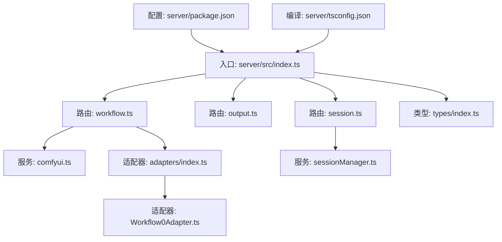
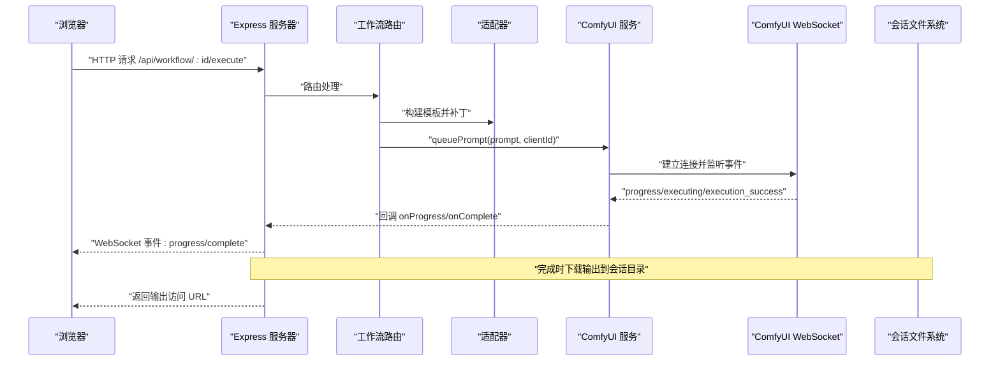
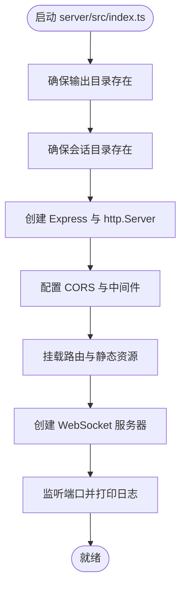
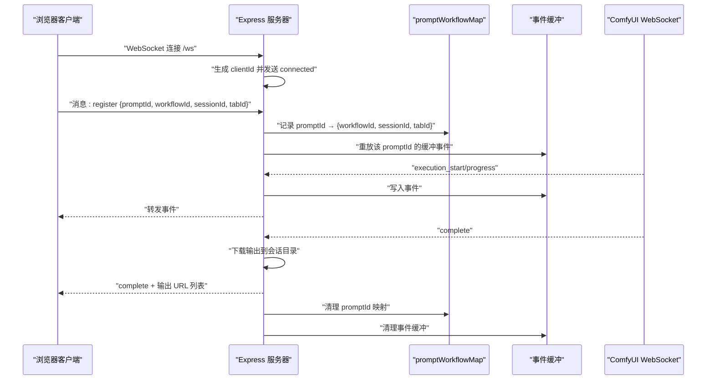
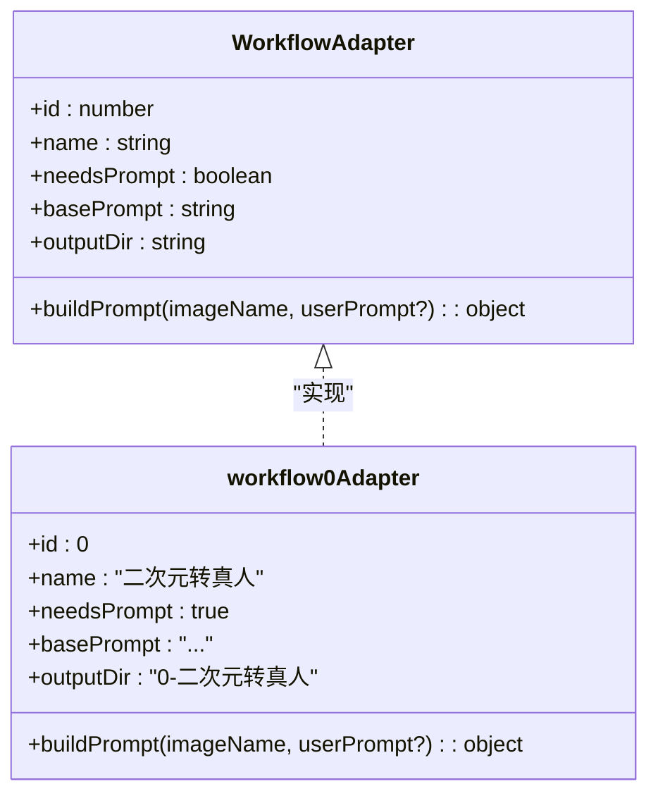
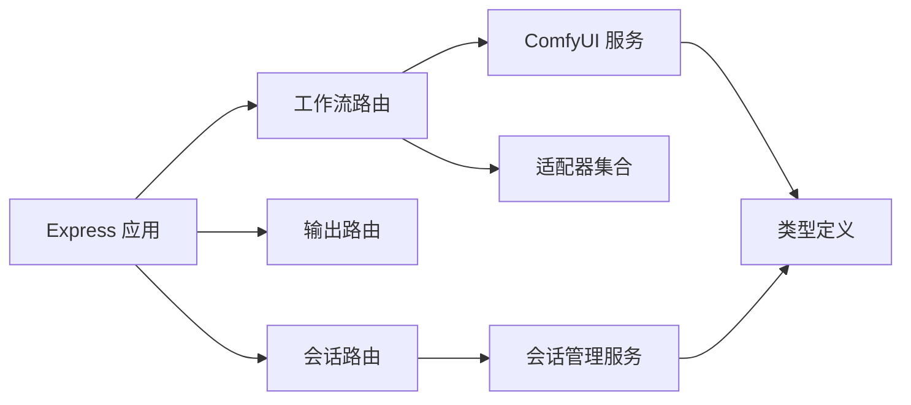

# Express 服务器

<cite>
**本文引用的文件**
- [server/src/index.ts](file://server/src/index.ts)
- [server/src/routes/workflow.ts](file://server/src/routes/workflow.ts)
- [server/src/routes/output.ts](file://server/src/routes/output.ts)
- [server/src/routes/session.ts](file://server/src/routes/session.ts)
- [server/src/services/comfyui.ts](file://server/src/services/comfyui.ts)
- [server/src/services/sessionManager.ts](file://server/src/services/sessionManager.ts)
- [server/src/adapters/index.ts](file://server/src/adapters/index.ts)
- [server/src/adapters/BaseAdapter.ts](file://server/src/adapters/BaseAdapter.ts)
- [server/src/adapters/Workflow0Adapter.ts](file://server/src/adapters/Workflow0Adapter.ts)
- [server/src/types/index.ts](file://server/src/types/index.ts)
- [server/package.json](file://server/package.json)
- [server/tsconfig.json](file://server/tsconfig.json)
- [start.bat](file://start.bat)
- [package.json](file://package.json)
- [README.md](file://README.md)
</cite>

## 目录
1. [简介](#简介)
2. [项目结构](#项目结构)
3. [核心组件](#核心组件)
4. [架构总览](#架构总览)
5. [详细组件分析](#详细组件分析)
6. [依赖关系分析](#依赖关系分析)
7. [性能考虑](#性能考虑)
8. [故障排查指南](#故障排查指南)
9. [结论](#结论)
10. [附录](#附录)

## 简介
本文件面向 CorineKit Pix2Real 的 Express + TypeScript 服务器，系统性阐述其架构与实现要点，覆盖服务器初始化、CORS 配置、中间件设置、静态文件服务；路由注册机制（工作流路由、输出文件路由、会话路由）；WebSocket 服务器集成（连接管理、客户端标识生成、事件缓冲机制）；以及服务器启动流程、端口配置与输出目录管理等具体实现细节与使用示例。

## 项目结构
后端采用模块化分层设计：
- 入口文件负责应用实例创建、中间件与静态资源挂载、路由注册、WebSocket 服务器创建与事件处理。
- 路由层按功能拆分：工作流路由、输出文件路由、会话路由。
- 服务层封装对 ComfyUI 的 HTTP/WebSocket 客户端调用与会话文件系统操作。
- 适配器层以模板 JSON 为基础，按工作流动态构建执行参数。
- 类型定义统一在 types 层，确保前后端交互契约一致。

图表来源
- [server/src/index.ts:42-61](file://server/src/index.ts#L42-L61)
- [server/src/routes/workflow.ts:1-27](file://server/src/routes/workflow.ts#L1-L27)
- [server/src/routes/output.ts:1-11](file://server/src/routes/output.ts#L1-L11)
- [server/src/routes/session.ts:1-16](file://server/src/routes/session.ts#L1-L16)
- [server/src/services/comfyui.ts:127-188](file://server/src/services/comfyui.ts#L127-L188)
- [server/src/services/sessionManager.ts:10-57](file://server/src/services/sessionManager.ts#L10-L57)
- [server/src/adapters/index.ts:13-28](file://server/src/adapters/index.ts#L13-L28)
- [server/src/adapters/Workflow0Adapter.ts:9-34](file://server/src/adapters/Workflow0Adapter.ts#L9-L34)
- [server/src/types/index.ts:1-52](file://server/src/types/index.ts#L1-L52)
- [server/package.json:11-26](file://server/package.json#L11-L26)
- [server/tsconfig.json:2-16](file://server/tsconfig.json#L2-L16)

章节来源
- [README.md:41-62](file://README.md#L41-L62)
- [server/src/index.ts:42-61](file://server/src/index.ts#L42-L61)

## 核心组件
- 应用与服务器实例
  - 使用 Express 创建 HTTP 服务器，并通过 http.Server 包装以便复用同一端口同时承载 HTTP 与 WebSocket。
  - 端口默认 3000，可通过环境变量覆盖。
- CORS 配置
  - 仅允许前端开发地址 http://localhost:5173 访问，支持凭据传递。
- 中间件
  - 启用大体积 JSON 解析（上限 50MB），满足批量任务与大尺寸图像上传场景。
- 静态文件服务
  - 输出目录静态映射：/output → 项目根 output 目录
  - 会话文件静态映射：/api/session-files → 项目根 sessions 目录
- 路由注册
  - 工作流路由：/api/workflow
  - 输出文件路由：/api/output
  - 会话路由：/api/session
- WebSocket 服务器
  - 路径：/ws
  - 连接管理：为每个浏览器客户端生成唯一 clientId 并转发 ComfyUI 事件
  - 事件缓冲：针对 promptId 维护最近事件缓冲，避免客户端注册前错过进度事件

章节来源
- [server/src/index.ts:42-61](file://server/src/index.ts#L42-L61)
- [server/src/index.ts:62-228](file://server/src/index.ts#L62-L228)

## 架构总览
下图展示从浏览器到 ComfyUI 的完整链路：Express 路由接收请求，适配器构建模板，服务层调用 ComfyUI 接口，WebSocket 将进度与完成事件实时回传给浏览器，完成后将输出下载到本地会话目录并可直接访问。

图表来源
- [server/src/routes/workflow.ts:408-455](file://server/src/routes/workflow.ts#L408-L455)
- [server/src/services/comfyui.ts:47-60](file://server/src/services/comfyui.ts#L47-L60)
- [server/src/services/comfyui.ts:127-188](file://server/src/services/comfyui.ts#L127-L188)
- [server/src/index.ts:73-219](file://server/src/index.ts#L73-L219)
- [server/src/services/sessionManager.ts:34-57](file://server/src/services/sessionManager.ts#L34-L57)

## 详细组件分析

### 服务器初始化与启动流程
- 初始化步骤
  - 确保输出目录与会话目录存在，不存在则创建
  - 创建 Express 实例与 http.Server
  - 配置 CORS、JSON 解析中间件
  - 注册路由与静态文件服务
  - 创建 WebSocket 服务器并绑定路径
  - 生成唯一 clientId 并与 ComfyUI 建立 WebSocket 连接
- 启动日志
  - 打印运行地址、WebSocket 地址与输出目录位置
- 端口与启动脚本
  - 默认端口 3000；启动脚本会先检查并释放 3000 与 5173 端口，再分别启动服务端与客户端

图表来源
- [server/src/index.ts:17-41](file://server/src/index.ts#L17-L41)
- [server/src/index.ts:42-61](file://server/src/index.ts#L42-L61)
- [server/src/index.ts:221-228](file://server/src/index.ts#L221-L228)
- [start.bat:35-48](file://start.bat#L35-L48)

章节来源
- [server/src/index.ts:17-41](file://server/src/index.ts#L17-L41)
- [server/src/index.ts:42-61](file://server/src/index.ts#L42-L61)
- [server/src/index.ts:221-228](file://server/src/index.ts#L221-L228)
- [start.bat:35-48](file://start.bat#L35-L48)

### CORS 配置与中间件设置
- CORS
  - 允许源：http://localhost:5173
  - 支持凭据（credentials）
- 中间件
  - express.json({ limit: '50mb' })：支持大体积请求体
- 静态文件
  - /output → 项目 output 目录
  - /api/session-files → 项目 sessions 目录

章节来源
- [server/src/index.ts:45-61](file://server/src/index.ts#L45-L61)

### 路由注册机制
- 工作流路由（/api/workflow）
  - 列表：GET /api/workflow
  - 单图执行：POST /api/workflow/:id/execute
  - 批量执行：POST /api/workflow/:id/batch
  - 取消队列：POST /api/workflow/cancel-queue/:promptId
  - 优先级调整：POST /api/workflow/queue/prioritize/:promptId
  - 队列查询：GET /api/workflow/queue
  - 系统统计：GET /api/workflow/system-stats
  - 内存释放：POST /api/workflow/release-memory
  - 打开输出目录：POST /api/workflow/:id/open-folder
  - 导出混合图：POST /api/workflow/export-blend
  - 反推提示词：POST /api/workflow/reverse-prompt?model=...
  - 提示词助理：POST /api/workflow/prompt-assistant
  - 模型列表：GET /api/workflow/models/checkpoints, /models/unets, /models/loras
- 输出文件路由（/api/output）
  - 列表：GET /api/output/:workflowId
  - 下载：GET /api/output/:workflowId/:filename
  - 打开文件：POST /api/output/open-file
- 会话路由（/api/session）
  - 上传输入图：POST /api/session/:sessionId/images
  - 上传蒙版：POST /api/session/:sessionId/masks
  - 保存状态：PUT/POST /api/session/:sessionId/state
  - 加载会话：GET /api/session/:sessionId
  - 列举会话：GET /api/sessions
  - 删除会话：DELETE /api/session/:sessionId

章节来源
- [server/src/routes/workflow.ts:29-800](file://server/src/routes/workflow.ts#L29-L800)
- [server/src/routes/output.ts:22-134](file://server/src/routes/output.ts#L22-L134)
- [server/src/routes/session.ts:18-95](file://server/src/routes/session.ts#L18-L95)

### WebSocket 服务器集成
- 连接管理
  - 为每个浏览器客户端生成唯一 clientId（格式包含时间戳与随机串）
  - 与 ComfyUI 建立 WebSocket 连接，透传进度、开始与完成事件
- 客户端标识生成
  - 函数 generateClientId 返回 pix2real_{timestamp}_{random} 格式字符串
- 事件缓冲机制
  - 以 promptId 为键维护事件缓冲，若客户端在 ComfyUI 开始处理后再注册，可重放已发生的 execution_start 与 progress 事件
- 完成后处理
  - 获取历史与输出，下载图片/视频到会话输出目录，返回完成事件与输出 URL 列表
  - 清理 promptWorkflowMap 与事件缓冲

图表来源
- [server/src/index.ts:73-219](file://server/src/index.ts#L73-L219)
- [server/src/services/comfyui.ts:127-188](file://server/src/services/comfyui.ts#L127-L188)

章节来源
- [server/src/index.ts:65-68](file://server/src/index.ts#L65-L68)
- [server/src/index.ts:73-219](file://server/src/index.ts#L73-L219)

### 适配器模式与工作流执行
- 适配器职责
  - 读取对应工作流的 JSON 模板，仅补丁需要变更的节点（如图像名、提示词、采样参数、种子等）
  - 统一接口 buildPrompt(imageName, userPrompt?) 返回可提交的 prompt 对象
- 适配器注册
  - adapters/index.ts 维护编号到适配器的映射，getAdapter(id) 提供查找
- 典型工作流
  - 二次元转真人：根据模型选择模板或使用适配器构建 prompt
  - 精修放大：支持多种模型与模板
  - 批量执行：支持最多 50 张图片，可为每张指定独立提示词

图表来源
- [server/src/types/index.ts:1-8](file://server/src/types/index.ts#L1-L8)
- [server/src/adapters/Workflow0Adapter.ts:9-34](file://server/src/adapters/Workflow0Adapter.ts#L9-L34)

章节来源
- [server/src/adapters/index.ts:13-28](file://server/src/adapters/index.ts#L13-L28)
- [server/src/adapters/Workflow0Adapter.ts:9-34](file://server/src/adapters/Workflow0Adapter.ts#L9-L34)

### 会话管理与输出目录
- 会话目录结构
  - sessions/{sessionId}/tab-{0..5}/{input|masks|output}
  - 输入图、蒙版、输出文件分别存放于对应子目录
- 会话状态
  - 保存 activeTab 与各标签页数据，包含图片、提示词、任务、选中输出索引、姿态切换等
  - 自动维护 createdAt/updatedAt
- 输出目录
  - 项目根 output 目录按工作流分类存放生成文件
  - 服务器启动时确保目录存在
- 文件访问
  - /api/output/* 提供输出文件列表与下载
  - /api/session-files/* 提供会话内文件访问

章节来源
- [server/src/services/sessionManager.ts:10-57](file://server/src/services/sessionManager.ts#L10-L57)
- [server/src/services/sessionManager.ts:91-110](file://server/src/services/sessionManager.ts#L91-L110)
- [server/src/routes/output.ts:13-53](file://server/src/routes/output.ts#L13-L53)
- [server/src/index.ts:17-41](file://server/src/index.ts#L17-L41)

## 依赖关系分析
- 外部依赖
  - express、cors、ws、multer、node-fetch、form-data
- 内部模块耦合
  - 路由层依赖服务层（comfyui.ts、sessionManager.ts）
  - 路由层依赖适配器层（adapters/index.ts）
  - 服务层依赖类型定义（types/index.ts）

图表来源
- [server/src/index.ts:8-12](file://server/src/index.ts#L8-L12)
- [server/src/routes/workflow.ts:7-10](file://server/src/routes/workflow.ts#L7-L10)
- [server/src/routes/session.ts:4-13](file://server/src/routes/session.ts#L4-L13)
- [server/src/services/comfyui.ts:1-7](file://server/src/services/comfyui.ts#L1-L7)
- [server/src/services/sessionManager.ts:1-6](file://server/src/services/sessionManager.ts#L1-L6)
- [server/src/types/index.ts:1-52](file://server/src/types/index.ts#L1-L52)

章节来源
- [server/src/index.ts:8-12](file://server/src/index.ts#L8-L12)
- [server/src/routes/workflow.ts:7-10](file://server/src/routes/workflow.ts#L7-L10)
- [server/src/routes/session.ts:4-13](file://server/src/routes/session.ts#L4-L13)
- [server/src/services/comfyui.ts:1-7](file://server/src/services/comfyui.ts#L1-L7)
- [server/src/services/sessionManager.ts:1-6](file://server/src/services/sessionManager.ts#L1-L6)
- [server/src/types/index.ts:1-52](file://server/src/types/index.ts#L1-L52)

## 性能考虑
- 大文件与批量处理
  - 中间件启用 50MB JSON 解析上限，满足批量任务与大图上传
  - 批量执行接口支持最多 50 张图片并发排队
- WebSocket 事件去重
  - 使用 startedPrompts 与 completedPrompts 集合避免重复触发开始与完成事件
- 事件缓冲
  - 针对 promptId 的事件缓冲减少客户端注册时机差异导致的数据丢失
- I/O 优化
  - 输出下载后立即写入会话目录，避免重复拉取
  - 目录按需创建，减少不必要的文件系统操作

## 故障排查指南
- ComfyUI 不可用
  - 现象：系统统计、队列、历史接口返回错误
  - 排查：确认 ComfyUI 在 http://127.0.0.1:8188 运行
- CORS 拦截
  - 现象：浏览器跨域报错
  - 排查：确认前端地址为 http://localhost:5173，且服务端允许该源
- 端口占用
  - 现象：启动失败或端口冲突
  - 排查：使用启动脚本自动释放 3000/5173 端口，或手动释放
- WebSocket 连接异常
  - 现象：进度事件不更新或连接断开
  - 排查：检查 generateClientId 是否正常生成；确认事件缓冲逻辑是否正确重放
- 输出文件缺失
  - 现象：完成事件返回空输出列表
  - 排查：确认 ComfyUI 输出节点类型为 output；检查会话目录写入权限

章节来源
- [server/src/services/comfyui.ts:106-125](file://server/src/services/comfyui.ts#L106-L125)
- [server/src/index.ts:221-228](file://server/src/index.ts#L221-L228)
- [server/src/index.ts:73-219](file://server/src/index.ts#L73-L219)
- [server/src/services/sessionManager.ts:34-57](file://server/src/services/sessionManager.ts#L34-L57)

## 结论
该 Express 服务器以清晰的分层架构整合了工作流调度、实时进度回传与会话持久化能力。通过适配器模式与模板化 JSON，实现了多工作流的统一扩展；借助 WebSocket 事件缓冲与客户端标识管理，保障了实时体验与可靠性；配合静态文件服务与输出目录管理，提供了完整的本地化批处理解决方案。

## 附录

### 端口与启动配置
- 服务器端口：默认 3000，可通过环境变量覆盖
- 前端开发端口：5173
- 启动脚本：自动释放端口并启动服务端与客户端，随后打开浏览器

章节来源
- [server/src/index.ts:221-228](file://server/src/index.ts#L221-L228)
- [start.bat:35-48](file://start.bat#L35-L48)

### 编译与运行配置
- 编译目标：ES2022，模块解析使用 bundler
- 开发脚本：tsx watch 监听热重载
- 生产构建：tsc 编译为 dist

章节来源
- [server/tsconfig.json:2-16](file://server/tsconfig.json#L2-L16)
- [server/package.json:7-9](file://server/package.json#L7-L9)