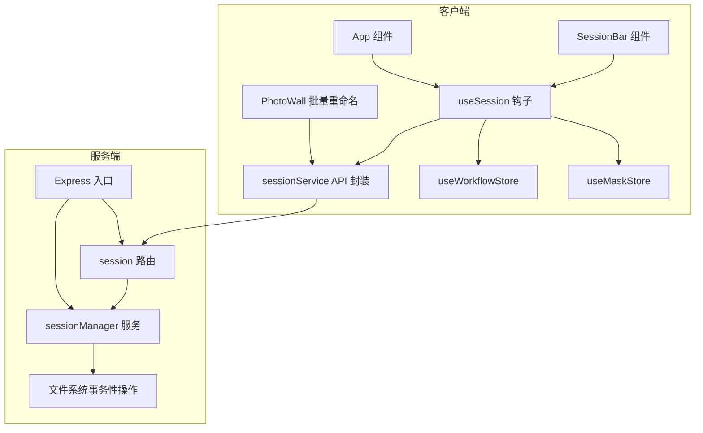
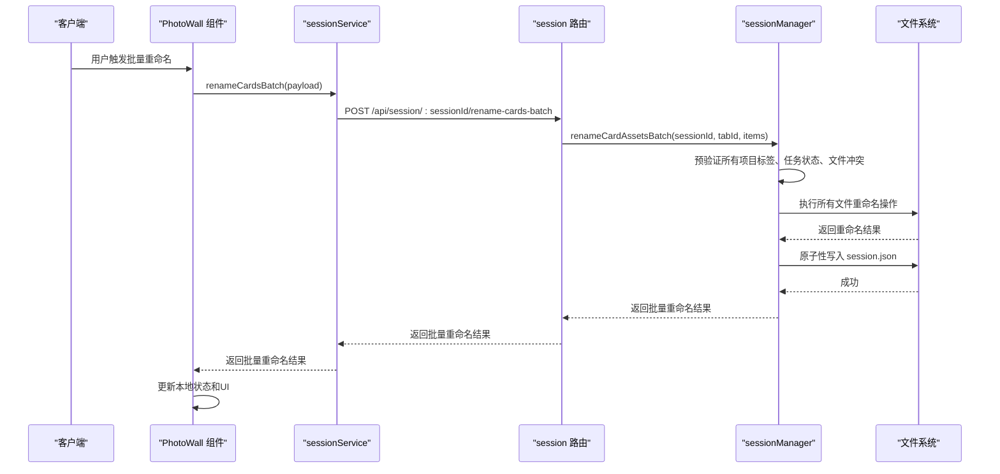
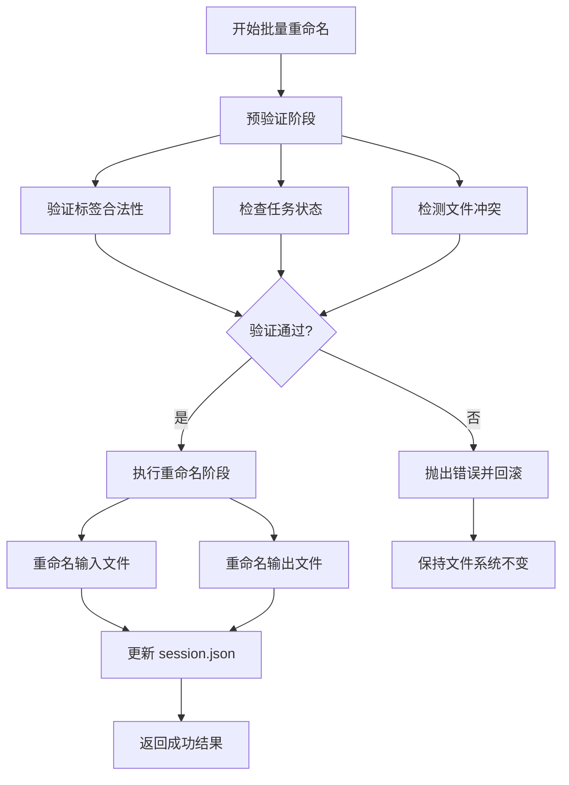
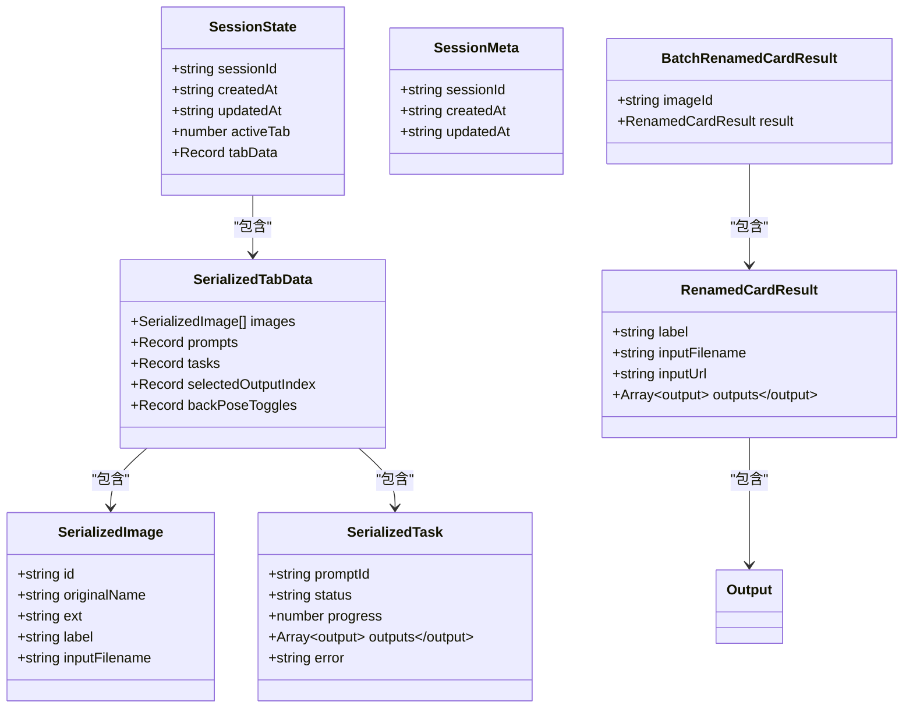
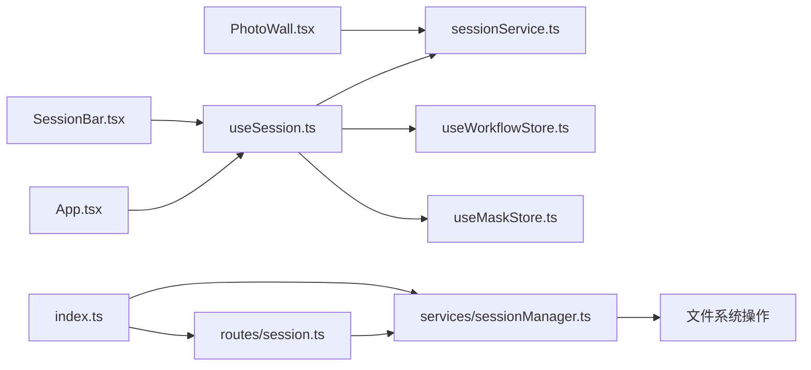

# 会话管理服务

<cite>
**本文档引用的文件**
- [server/src/services/sessionManager.ts](file://server/src/services/sessionManager.ts)
- [server/src/routes/session.ts](file://server/src/routes/session.ts)
- [server/src/index.ts](file://server/src/index.ts)
- [client/src/services/sessionService.ts](file://client/src/services/sessionService.ts)
- [client/src/hooks/useSession.ts](file://client/src/hooks/useSession.ts)
- [client/src/hooks/useWorkflowStore.ts](file://client/src/hooks/useWorkflowStore.ts)
- [client/src/hooks/useMaskStore.ts](file://client/src/hooks/useMaskStore.ts)
- [client/src/types/index.ts](file://client/src/types/index.ts)
- [client/src/components/SessionBar.tsx](file://client/src/components/SessionBar.tsx)
- [client/src/components/App.tsx](file://client/src/components/App.tsx)
- [client/src/components/PhotoWall.tsx](file://client/src/components/PhotoWall.tsx)
- [TODO-session-persistence.md](file://TODO-session-persistence.md)
</cite>

## 更新摘要
**变更内容**
- 新增批量重命名功能，支持事务性文件系统操作
- 添加 `renameCardAssets` 和 `renameCardAssetsBatch` 函数实现
- 新增对应的API路由和前端服务方法
- 在PhotoWall组件中集成批量重命名用户界面

## 目录
1. [简介](#简介)
2. [项目结构](#项目结构)
3. [核心组件](#核心组件)
4. [架构总览](#架构总览)
5. [详细组件分析](#详细组件分析)
6. [依赖关系分析](#依赖关系分析)
7. [性能考量](#性能考量)
8. [故障排查指南](#故障排查指南)
9. [结论](#结论)
10. [附录](#附录)

## 简介
本文件面向 CorineKit Pix2Real 的会话管理服务，系统性阐述会话数据的持久化实现、状态管理机制、恢复与断点续传策略，以及性能优化方案。该系统采用"事件驱动静默自动保存"的策略，结合前端 Store 订阅、后端文件系统存储与路由接口，实现跨页面、跨会话的数据一致性与可用性保障。**更新**：新增批量重命名功能，支持事务性文件系统操作，确保批量操作的一致性和原子性。

## 项目结构
会话管理涉及前后端协作：
- 前端负责状态序列化、变更监听、自动保存、会话恢复、UI展示与批量重命名操作
- 后端负责会话目录结构、文件读写、状态 JSON 管理、会话列表与清理、文件系统事务性操作
- 服务器同时提供静态文件服务，使会话中的输入图、遮罩等资源可被安全访问

**图表来源**
- [client/src/hooks/useSession.ts:116-421](file://client/src/hooks/useSession.ts#L116-L421)
- [client/src/services/sessionService.ts:1-134](file://client/src/services/sessionService.ts#L1-L134)
- [server/src/routes/session.ts:1-95](file://server/src/routes/session.ts#L1-L95)
- [server/src/services/sessionManager.ts:1-164](file://server/src/services/sessionManager.ts#L1-L164)
- [server/src/index.ts:1-228](file://server/src/index.ts#L1-L228)
- [client/src/components/PhotoWall.tsx:304-354](file://client/src/components/PhotoWall.tsx#L304-L354)

## 核心组件
- 会话状态模型：包含会话标识、创建/更新时间、活动标签页、各标签页的图像、提示词、任务、选中输出索引、姿态切换等序列化数据
- 会话目录结构：每个会话一个根目录，包含 session.json 与若干标签页目录，标签页目录内含 input、masks、output 子目录
- 自动保存策略：基于 Store 订阅的防抖保存、任务完成回调、遮罩绘制完成、提示词变更、页面卸载前的发送信标
- 恢复与清理：根据启动行为决定是否恢复；空会话在欢迎页返回时清理；支持列出最近会话与按时间裁剪旧会话
- **新增** 批量重命名功能：支持事务性文件系统操作，确保批量重命名的一致性和原子性

**章节来源**
- [server/src/services/sessionManager.ts:61-120](file://server/src/services/sessionManager.ts#L61-L120)
- [client/src/services/sessionService.ts:30-67](file://client/src/services/sessionService.ts#L30-L67)
- [client/src/hooks/useSession.ts:138-181](file://client/src/hooks/useSession.ts#L138-L181)
- [server/src/services/sessionManager.ts:246-349](file://server/src/services/sessionManager.ts#L246-L349)
- [server/src/services/sessionManager.ts:370-526](file://server/src/services/sessionManager.ts#L370-L526)

## 架构总览
会话管理采用"前端事件驱动 + 后端文件系统"的双层架构：
- 前端：useSession 钩子集中处理会话生命周期，订阅多个 Store 的变更，触发自动保存；在挂载时尝试恢复会话；在 beforeunload 时进行最终保存；**新增** PhotoWall 组件提供批量重命名界面
- 后端：Express 路由提供会话相关的 REST 接口，sessionManager 负责目录与文件操作，**新增** 事务性文件系统操作确保批量重命名的一致性；index.ts 负责注册路由与静态文件服务

**图表来源**
- [client/src/components/PhotoWall.tsx:304-354](file://client/src/components/PhotoWall.tsx#L304-L354)
- [client/src/services/sessionService.ts:210-230](file://client/src/services/sessionService.ts#L210-L230)
- [server/src/routes/session.ts:134-160](file://server/src/routes/session.ts#L134-L160)
- [server/src/services/sessionManager.ts:370-526](file://server/src/services/sessionManager.ts#L370-L526)

## 详细组件分析

### 会话状态模型与序列化
- 状态结构
  - 顶层：sessionId、createdAt、updatedAt、activeTab、tabData
  - tabData：按标签页索引映射，包含 images、prompts、tasks、selectedOutputIndex、backPoseToggles、可选配置等
  - images：包含 id、originalName、ext、**新增** label、inputFilename
  - tasks：按 imageId 映射，包含 promptId、status、progress、outputs、可选 error
- 序列化策略
  - Store 中的 File 对象不参与持久化，仅保存其元信息（id、originalName、ext）
  - 任务完成后，后端将输出文件下载到会话 output 目录，并在 session.json 中记录输出文件 URL
  - 遮罩以 PNG 文件形式保存在 masks 目录，文件名使用安全的 maskKey 替换非法字符
  - **新增** 卡片重命名：支持用户自定义显示标签和文件系统中的实际文件名

**章节来源**
- [server/src/services/sessionManager.ts:61-89](file://server/src/services/sessionManager.ts#L61-L89)
- [client/src/services/sessionService.ts:30-67](file://client/src/services/sessionService.ts#L30-L67)
- [client/src/types/index.ts:1-14](file://client/src/types/index.ts#L1-L14)

### 文件系统存储策略与目录结构
- 目录布局
  - sessions/<sessionId>/session.json：完整会话状态
  - sessions/<sessionId>/tab-<n>/input/：输入图像文件，**新增** 支持重命名后的文件名格式 `{label}_raw{ext}`
  - sessions/<sessionId>/tab-<n>/masks/：遮罩 PNG 文件
  - sessions/<sessionId>/tab-<n>/output/：任务输出文件（由后端下载并保存），**新增** 支持重命名后的文件名格式 `{label}_{1..N}{ext}`
- 路由与静态服务
  - Express 在启动时确保 sessions 目录存在
  - 通过静态中间件将 sessions 目录映射为 /api/session-files，供前端安全访问
  - 后端在任务完成后将 ComfyUI 输出下载到会话 output 目录，并返回可访问 URL

**章节来源**
- [server/src/index.ts:37-60](file://server/src/index.ts#L37-L60)
- [server/src/services/sessionManager.ts:10-16](file://server/src/services/sessionManager.ts#L10-L16)
- [server/src/services/sessionManager.ts:34-44](file://server/src/services/sessionManager.ts#L34-L44)

### 会话状态管理机制
- 状态跟踪
  - useSession 钩子维护 lastSavedAt，用于 UI 展示"上次保存"时间
  - Store 订阅检测到有意义的状态变化（如新增图像、任务状态变更、提示词更新）时触发保存
- 变更监听
  - 图像上传：检测到新图像后异步上传至 input 目录，并更新 store 中的 sessionUrl
  - 遮罩保存：maskStore 变更时，将 RGBA 数据转换为 PNG 并上传至 masks 目录
  - 任务完成：completeTask 后触发保存，确保 outputs 与选中输出索引同步
  - **新增** 卡片重命名：支持单个和批量重命名操作，更新显示标签和文件系统中的实际文件名
- 自动保存
  - 防抖保存：500ms 防抖，避免频繁写入
  - 页面卸载前：使用 navigator.sendBeacon 发送最终状态，确保在页面关闭时仍能持久化
- 清理策略
  - 空会话清理：当返回欢迎页且会话为空时，删除服务器上的会话记录
  - 会话裁剪：列出会话并按 updatedAt 倒序，保留最近 N 个（默认 5），其余删除

**章节来源**
- [client/src/hooks/useSession.ts:164-181](file://client/src/hooks/useSession.ts#L164-L181)
- [client/src/hooks/useSession.ts:184-233](file://client/src/hooks/useSession.ts#L184-L233)
- [client/src/hooks/useSession.ts:235-265](file://client/src/hooks/useSession.ts#L235-L265)
- [client/src/hooks/useSession.ts:397-418](file://client/src/hooks/useSession.ts#L397-L418)
- [server/src/services/sessionManager.ts:157-163](file://server/src/services/sessionManager.ts#L157-L163)

### 会话恢复与断点续传
- 恢复流程
  - 挂载时根据启动行为（restore/new/welcome）决定是否恢复
  - 若需要恢复：调用 getSession 获取 session.json，重建 ImageItem（从 /api/session-files 下载），恢复遮罩（遍历可能的 maskKey），最后恢复 Store 与 maskStore
  - 支持切换会话：通过 SessionBar 设置 pix2real_session_id 并标记切换意图，刷新页面后重新加载目标会话
- 断点续传
  - 任务进度与输出：completeTask 时更新 outputs，设置 selectedOutputIndex，默认优先选择新批次中的特定输出（如视频工作流的插帧）
  - 遮罩恢复：通过 HEAD 请求探测 masks 目录下的 PNG 文件是否存在，逐个恢复
  - 状态回滚：session.json 作为单一事实源，任何异常均以最新写入为准；若 session.json 损坏，将跳过该会话
  - **新增** 文件重命名恢复：支持从重命名后的文件名格式恢复到原始状态

**章节来源**
- [client/src/hooks/useSession.ts:306-384](file://client/src/hooks/useSession.ts#L306-L384)
- [client/src/hooks/useSession.ts:316-366](file://client/src/hooks/useSession.ts#L316-L366)
- [client/src/components/SessionBar.tsx:66-71](file://client/src/components/SessionBar.tsx#L66-L71)
- [client/src/components/WelcomePage.tsx:108-112](file://client/src/components/WelcomePage.tsx#L108-L112)

### 批量重命名功能实现
- 功能概述
  - 支持事务性文件系统操作，确保批量重命名的一致性和原子性
  - 预验证所有项目，检测标签合法性、任务状态和文件冲突
  - 一旦验证通过，执行所有重命名操作，失败时回滚所有更改
- 技术实现
  - 前端：PhotoWall 组件提供批量重命名界面，支持基础名称输入和批量确认
  - 后端：renameCardAssetsBatch 函数实现事务性重命名，包含预验证和执行两个阶段
  - 文件命名规则：输入文件 `{label}_raw{ext}`，输出文件 `{label}_1{ext}`、`{label}_2{ext}`...
- 错误处理
  - 标签不合法：抛出错误，拒绝重命名
  - 任务进行中：拒绝重命名，要求等待任务完成
  - 文件冲突：检测现有文件和批内冲突，拒绝可能导致数据丢失的操作
  - 文件系统错误：异常情况抛出错误，保持文件系统状态不变

**图表来源**
- [server/src/services/sessionManager.ts:370-526](file://server/src/services/sessionManager.ts#L370-L526)
- [client/src/components/PhotoWall.tsx:304-354](file://client/src/components/PhotoWall.tsx#L304-L354)

**章节来源**
- [server/src/services/sessionManager.ts:246-349](file://server/src/services/sessionManager.ts#L246-L349)
- [server/src/services/sessionManager.ts:370-526](file://server/src/services/sessionManager.ts#L370-L526)
- [server/src/routes/session.ts:117-160](file://server/src/routes/session.ts#L117-L160)
- [client/src/services/sessionService.ts:174-230](file://client/src/services/sessionService.ts#L174-L230)
- [client/src/components/PhotoWall.tsx:304-354](file://client/src/components/PhotoWall.tsx#L304-L354)

### API 工作流与错误处理
- 上传输入图
  - 客户端：multipart/form-data，字段 image、tabId、imageId
  - 服务端：校验参数，保存到 input 目录，返回可访问 URL
- 上传遮罩
  - 客户端：multipart/form-data，字段 mask、tabId、maskKey
  - 服务端：校验参数，保存到 masks 目录（maskKey 中的冒号替换为下划线）
- 保存/加载会话状态
  - PUT /api/session/:sessionId/state：覆盖写入 session.json
  - GET /api/session/:sessionId：返回完整会话数据
  - GET /api/sessions：返回最近会话列表（最多 5）
  - DELETE /api/session/:sessionId：删除会话目录
- **新增** 卡片重命名
  - POST /api/session/:sessionId/rename-card：单个卡片重命名
  - POST /api/session/:sessionId/rename-cards-batch：批量事务性重命名
- 错误处理
  - 参数缺失：返回 400
  - 会话不存在：GET 返回 404
  - JSON 解析失败：跳过损坏会话
  - 上传失败：前端捕获并记录警告
  - **新增** 重命名冲突：返回 400，包含具体的冲突信息

**章节来源**
- [server/src/routes/session.ts:18-33](file://server/src/routes/session.ts#L18-L33)
- [server/src/routes/session.ts:35-49](file://server/src/routes/session.ts#L35-L49)
- [server/src/routes/session.ts:51-68](file://server/src/routes/session.ts#L51-L68)
- [server/src/routes/session.ts:70-92](file://server/src/routes/session.ts#L70-L92)
- [server/src/routes/session.ts:117-160](file://server/src/routes/session.ts#L117-L160)
- [server/src/services/sessionManager.ts:112-120](file://server/src/services/sessionManager.ts#L112-L120)

### 类关系与数据模型

**图表来源**
- [server/src/services/sessionManager.ts:61-89](file://server/src/services/sessionManager.ts#L61-L89)
- [server/src/services/sessionManager.ts:124-128](file://server/src/services/sessionManager.ts#L124-L128)
- [server/src/services/sessionManager.ts:220-225](file://server/src/services/sessionManager.ts#L220-L225)
- [server/src/services/sessionManager.ts:358-361](file://server/src/services/sessionManager.ts#L358-L361)

## 依赖关系分析
- 前端依赖
  - useSession 依赖 sessionService、useWorkflowStore、useMaskStore、useSettingsStore
  - App 与 SessionBar 依赖 useSession 与 sessionService
  - **新增** PhotoWall 依赖 sessionService 的批量重命名功能
- 后端依赖
  - session 路由依赖 sessionManager
  - **新增** sessionManager 依赖文件系统操作实现事务性重命名
  - index.ts 注册路由并提供静态文件服务
- 外部集成
  - WebSocket 服务器与 ComfyUI 集成，任务完成后将输出下载到会话 output 目录
  - **新增** 文件系统事务性操作确保批量重命名的一致性

**图表来源**
- [client/src/hooks/useSession.ts:8-16](file://client/src/hooks/useSession.ts#L8-L16)
- [client/src/components/App.tsx:54-58](file://client/src/components/App.tsx#L54-L58)
- [client/src/components/SessionBar.tsx:26-33](file://client/src/components/SessionBar.tsx#L26-L33)
- [client/src/components/PhotoWall.tsx:304-354](file://client/src/components/PhotoWall.tsx#L304-L354)
- [server/src/routes/session.ts:1-13](file://server/src/routes/session.ts#L1-L13)
- [server/src/index.ts:10-12](file://server/src/index.ts#L10-L12)

**章节来源**
- [server/src/index.ts:53-60](file://server/src/index.ts#L53-L60)
- [server/src/routes/session.ts:1-13](file://server/src/routes/session.ts#L1-L13)

## 性能考量
- 内存使用
  - Store 中仅保存必要元信息，避免直接持久化大体积 File 对象
  - 图像预览使用 Blob URL，上传成功后替换为持久 URL，减少内存占用
  - **新增** 批量重命名使用预验证机制，避免不必要的文件系统操作
- 磁盘 I/O
  - 使用防抖保存（500ms）降低频繁写入
  - 仅在必要时创建目录，避免冗余 mkdir
  - 遮罩保存时将 RGBA 转换为灰度 PNG，减小存储体积
  - **新增** 事务性批量重命名减少多次文件系统操作的开销
- 并发访问控制
  - 前端通过 isRestoring 标志避免启动阶段覆盖状态
  - 通过 uploadedImages 与 savedMasks 集合避免重复上传
  - 会话切换通过 sessionStorage 标记意图，防止 React StrictMode 双调用导致的竞态
  - **新增** 批量重命名使用预验证和原子性提交，避免并发冲突
- 网络与稳定性
  - beforeunload 使用 sendBeacon，确保在网络不稳定情况下仍能提交最终状态
  - 会话裁剪默认保留最近 5 个，避免无限增长
  - **新增** 批量重命名操作具有完整的错误处理和回滚机制

**章节来源**
- [client/src/hooks/useSession.ts:128-135](file://client/src/hooks/useSession.ts#L128-L135)
- [client/src/hooks/useSession.ts:164-181](file://client/src/hooks/useSession.ts#L164-L181)
- [client/src/hooks/useSession.ts:291-303](file://client/src/hooks/useSession.ts#L291-L303)
- [client/src/hooks/useSession.ts:397-418](file://client/src/hooks/useSession.ts#L397-L418)

## 故障排查指南
- 会话无法恢复
  - 检查 session.json 是否存在且可解析
  - 确认 /api/session-files 能正常访问对应文件
  - 查看浏览器控制台是否有网络错误或权限问题
- 图像未显示
  - 确认上传成功后 sessionUrl 已更新
  - 检查 input 目录下是否存在对应文件
- 遮罩丢失
  - 确认 masks 目录下存在对应 PNG 文件
  - 检查 maskKey 是否包含非法字符（冒号会被替换）
- 保存失败
  - 检查 PUT /api/session/:sessionId/state 返回值
  - 确认磁盘空间充足，目录权限正确
- 会话过多
  - 使用 /api/sessions 列表确认会话数量
  - 调用 pruneOldSessions 或手动删除不需要的会话
- **新增** 批量重命名失败
  - 检查是否有进行中的任务（任务状态不是 idle/done/error）
  - 确认目标文件名是否与现有文件冲突
  - 查看错误消息中的具体冲突信息
  - 确认文件系统权限允许重命名操作

**章节来源**
- [server/src/services/sessionManager.ts:112-120](file://server/src/services/sessionManager.ts#L112-L120)
- [server/src/routes/session.ts:70-92](file://server/src/routes/session.ts#L70-L92)
- [server/src/services/sessionManager.ts:157-163](file://server/src/services/sessionManager.ts#L157-L163)
- [server/src/services/sessionManager.ts:265-270](file://server/src/services/sessionManager.ts#L265-L270)
- [server/src/services/sessionManager.ts:456-458](file://server/src/services/sessionManager.ts#L456-L458)

## 结论
该会话管理服务通过清晰的前后端职责划分、严谨的事件驱动保存策略与完善的恢复与清理机制，实现了跨页面、跨会话的稳定数据持久化。目录结构与序列化格式简洁明确，配合防抖与 sendBeacon 等手段，在保证一致性的同时兼顾了性能与用户体验。**更新**：新增的批量重命名功能进一步增强了系统的实用性，通过事务性文件系统操作确保了批量操作的一致性和原子性，为用户提供了更加高效和可靠的文件管理体验。建议后续可考虑引入增量备份、版本控制与更细粒度的并发控制以进一步提升可靠性。

## 附录
- 目录结构参考
  - sessions/<sessionId>/session.json
  - sessions/<sessionId>/tab-<n>/input/
  - sessions/<sessionId>/tab-<n>/masks/
  - sessions/<sessionId>/tab-<n>/output/
- **新增** 批量重命名文件命名规则
  - 输入文件：`{label}_raw{ext}`
  - 输出文件：`{label}_1{ext}`、`{label}_2{ext}`...

**章节来源**
- [TODO-session-persistence.md:13-26](file://TODO-session-persistence.md#L13-L26)
- [server/src/services/sessionManager.ts:246-349](file://server/src/services/sessionManager.ts#L246-L349)
- [server/src/services/sessionManager.ts:370-526](file://server/src/services/sessionManager.ts#L370-L526)