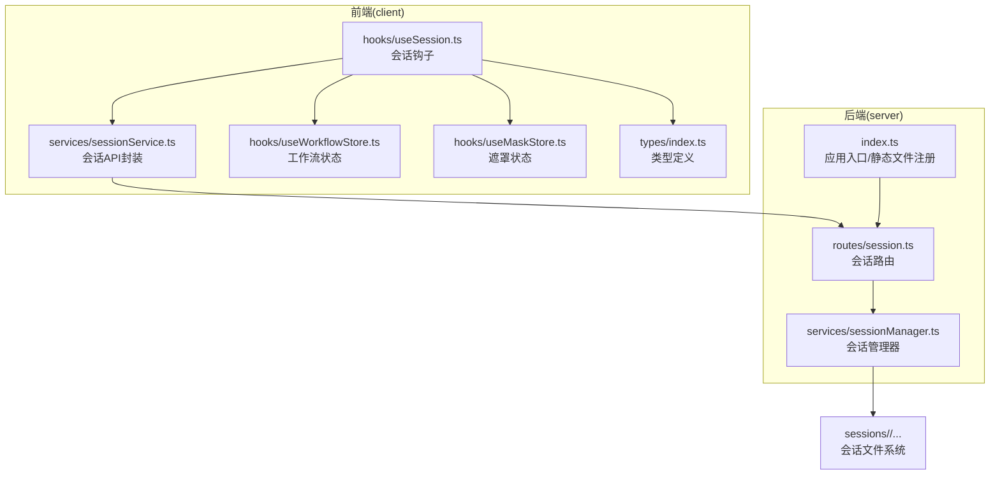
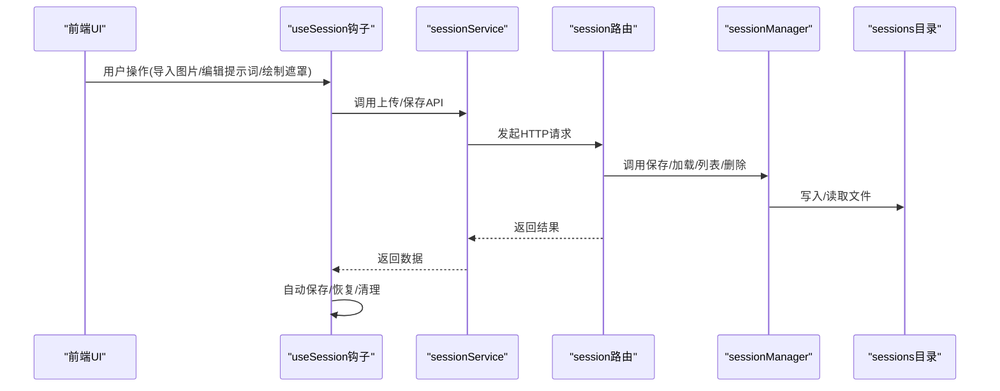
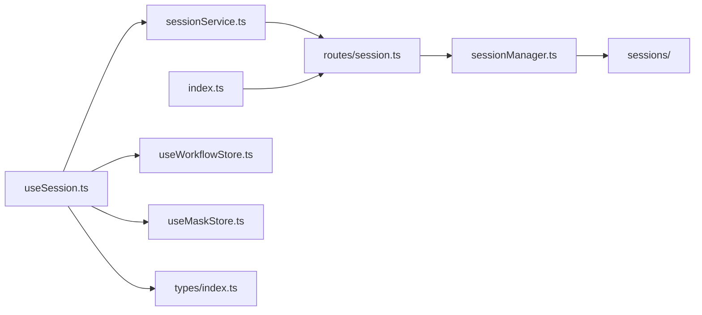

# 会话路由

<cite>
**本文引用的文件**
- [server/src/routes/session.ts](file://server/src/routes/session.ts)
- [server/src/services/sessionManager.ts](file://server/src/services/sessionManager.ts)
- [server/src/index.ts](file://server/src/index.ts)
- [client/src/services/sessionService.ts](file://client/src/services/sessionService.ts)
- [client/src/hooks/useSession.ts](file://client/src/hooks/useSession.ts)
- [client/src/hooks/useWorkflowStore.ts](file://client/src/hooks/useWorkflowStore.ts)
- [client/src/hooks/useMaskStore.ts](file://client/src/hooks/useMaskStore.ts)
- [client/src/types/index.ts](file://client/src/types/index.ts)
- [TODO-session-persistence.md](file://TODO-session-persistence.md)
- [sessions/187f40a5-66a0-4b2f-95fb-d6c9b6baeba6/session.json](file://sessions/187f40a5-66a0-4b2f-95fb-d6c9b6baeba6/session.json)
</cite>

## 目录
1. [简介](#简介)
2. [项目结构](#项目结构)
3. [核心组件](#核心组件)
4. [架构总览](#架构总览)
5. [详细组件分析](#详细组件分析)
6. [依赖关系分析](#依赖关系分析)
7. [性能考量](#性能考量)
8. [故障排除指南](#故障排除指南)
9. [结论](#结论)
10. [附录](#附录)

## 简介
本文件面向 CorineKit Pix2Real 的“会话路由”模块，系统性阐述会话管理接口的设计与实现，覆盖以下关键主题：
- 会话生命周期：创建、列出、加载、删除
- 会话数据的序列化与反序列化机制
- 会话状态持久化策略：文件存储格式、数据结构设计、版本兼容性处理
- 会话恢复机制：状态加载、断点续传、资源清理
- 最佳实践与故障排除建议

该模块采用前后端分离的架构：前端负责事件驱动的自动保存与恢复，后端提供 REST 接口与静态文件服务，二者通过统一的会话目录结构协同工作。

## 项目结构
会话路由相关代码主要分布在 server 与 client 两个子工程中，并辅以 sessions 目录作为持久化存储根目录。

图表来源
- [server/src/routes/session.ts:1-95](file://server/src/routes/session.ts#L1-L95)
- [server/src/services/sessionManager.ts:1-164](file://server/src/services/sessionManager.ts#L1-L164)
- [server/src/index.ts:1-228](file://server/src/index.ts#L1-L228)
- [client/src/services/sessionService.ts:1-134](file://client/src/services/sessionService.ts#L1-L134)
- [client/src/hooks/useSession.ts:1-422](file://client/src/hooks/useSession.ts#L1-L422)

章节来源
- [server/src/routes/session.ts:1-95](file://server/src/routes/session.ts#L1-L95)
- [server/src/services/sessionManager.ts:1-164](file://server/src/services/sessionManager.ts#L1-L164)
- [server/src/index.ts:1-228](file://server/src/index.ts#L1-L228)
- [client/src/services/sessionService.ts:1-134](file://client/src/services/sessionService.ts#L1-L134)
- [client/src/hooks/useSession.ts:1-422](file://client/src/hooks/useSession.ts#L1-L422)

## 核心组件
- 会话路由层：提供 REST 接口，负责请求解析、参数校验与响应返回。
- 会话管理器：负责会话目录结构维护、输入图像与遮罩的读写、会话 JSON 的序列化与反序列化、会话列表与清理。
- 会话服务封装：前端对后端接口进行类型化封装，便于上层组件使用。
- 会话钩子：负责会话初始化、自动保存、恢复逻辑、断点续传与资源清理。
- 类型定义：统一前后端的数据契约，保证序列化/反序列化一致性。

章节来源
- [server/src/routes/session.ts:1-95](file://server/src/routes/session.ts#L1-L95)
- [server/src/services/sessionManager.ts:61-164](file://server/src/services/sessionManager.ts#L61-L164)
- [client/src/services/sessionService.ts:30-134](file://client/src/services/sessionService.ts#L30-L134)
- [client/src/hooks/useSession.ts:116-422](file://client/src/hooks/useSession.ts#L116-L422)

## 架构总览
会话路由模块遵循“事件驱动静默自动保存”的策略：
- 导入图片时立即拷贝到会话目录
- 任务完成后更新 session.json
- 遮罩绘制结束时保存遮罩 PNG
- 提示词变更时经 500ms 防抖后更新 session.json
- 页面关闭前通过 sendBeacon 触发最终保存

图表来源
- [client/src/hooks/useSession.ts:164-181](file://client/src/hooks/useSession.ts#L164-L181)
- [client/src/services/sessionService.ts:69-134](file://client/src/services/sessionService.ts#L69-L134)
- [server/src/routes/session.ts:18-92](file://server/src/routes/session.ts#L18-L92)
- [server/src/services/sessionManager.ts:20-164](file://server/src/services/sessionManager.ts#L20-L164)

## 详细组件分析

### 会话路由层（server/src/routes/session.ts）
- 路由职责
  - POST /api/session/:sessionId/images：接收多部件表单，保存输入图像至对应 tab/input 目录，返回持久化 URL。
  - POST /api/session/:sessionId/masks：接收遮罩 PNG，保存至对应 tab/masks 目录。
  - PUT /api/session/:sessionId/state 与 POST /api/session/:sessionId/state：保存完整会话状态 JSON。
  - GET /api/session/:sessionId：加载并返回指定会话。
  - GET /api/session：列出最近会话元信息。
  - DELETE /api/session/:sessionId：删除指定会话目录。
- 参数校验与错误处理
  - 对必填字段进行校验，缺失时返回 400。
  - 对文件扩展名进行安全处理，避免非法扩展导致路径问题。
  - 对 Windows 不安全字符（如冒号）在遮罩键名中进行替换，确保文件名合法。
- 处理流程
  - 入参解析与类型转换
  - 调用 sessionManager 的相应方法
  - 统一返回 JSON 响应

章节来源
- [server/src/routes/session.ts:18-92](file://server/src/routes/session.ts#L18-L92)

### 会话管理器（server/src/services/sessionManager.ts）
- 目录结构
  - sessions/<sessionId>/tab-0..9/input、masks、output
  - 会话状态文件：sessions/<sessionId>/session.json
- 输入图像与遮罩 I/O
  - saveInputImage：根据扩展名保存输入图像，返回可访问的 URL。
  - saveMask：将遮罩键名中的冒号替换为下划线，避免 Windows 文件系统限制。
  - saveOutputFile：保存输出文件（用于 WebSocket 回调下载），返回 URL。
- 会话状态 JSON
  - SessionState：包含 sessionId、createdAt、updatedAt、activeTab、tabData。
  - SerializedTabData：包含 images、prompts、tasks、selectedOutputIndex、backPoseToggles 等。
  - SerializedTask：包含 promptId、status、progress、outputs、error。
  - saveState：若已有 session.json，则保留 createdAt；更新 updatedAt 并写入 JSON。
  - loadSession：读取并解析 session.json，异常或不存在返回 null。
- 列表与清理
  - listSessions：遍历 sessions 目录，读取每个 session.json，按 updatedAt 倒序排序。
  - deleteSession：递归删除会话目录。
  - pruneOldSessions：仅保留最近 N 个会话。

章节来源
- [server/src/services/sessionManager.ts:10-164](file://server/src/services/sessionManager.ts#L10-L164)

### 会话服务封装（client/src/services/sessionService.ts）
- 类型契约
  - SessionMeta、SerializedImage、SerializedTask、SerializedTabData、SessionData
- API 封装
  - uploadSessionImage：multipart 表单上传输入图像，返回持久化 URL。
  - uploadSessionMask：multipart 表单上传遮罩 PNG。
  - putSessionState：PUT 保存会话状态 JSON。
  - getSession：按 ID 获取会话。
  - listSessions：获取最近会话列表。
  - deleteSession：删除会话。

章节来源
- [client/src/services/sessionService.ts:30-134](file://client/src/services/sessionService.ts#L30-L134)

### 会话钩子（client/src/hooks/useSession.ts）
- 初始化与本地存储
  - 使用 localStorage 存储 sessionId；首次启动生成 UUID。
  - 使用 sessionStorage 标记“切换意图”，避免 React StrictMode 双次挂载导致的并发问题。
- 自动保存策略
  - 序列化 store 状态（剥离 File 对象），防抖 500ms 后保存。
  - 上传新图片后同步更新 sessionUrl，随后触发保存。
  - 遮罩绘制完成后异步保存遮罩 PNG。
- 恢复逻辑
  - 按设置行为决定是否恢复：直接恢复、新建、欢迎页。
  - 逐 tab 恢复：根据 session.json 中 images 列表，通过 HEAD 检测遮罩是否存在，再逐一恢复图片与遮罩。
  - 恢复后更新 store 与 mask 状态，标记已上传/已保存集合，避免重复上传。
- 断点续传与资源清理
  - beforeunload 使用 sendBeacon 触发最终保存，避免跨域限制。
  - 若空会话且已保存过，离开欢迎页时删除服务器端记录。
- 辅助工具
  - fetchAsFile：将持久化 URL 转回 File 对象。
  - fetchMaskEntry：将遮罩 PNG URL 解码为 RGBA 像素数据。

章节来源
- [client/src/hooks/useSession.ts:116-422](file://client/src/hooks/useSession.ts#L116-L422)

### 数据模型与序列化
- 会话状态数据模型
  - SessionState：sessionId、createdAt、updatedAt、activeTab、tabData
  - SerializedTabData：images、prompts、tasks、selectedOutputIndex、backPoseToggles、text2imgConfigs、zitConfigs、faceSwapZones
  - SerializedImage：id、originalName、ext
  - SerializedTask：promptId、status、progress、outputs、error
- 序列化与反序列化
  - 前端序列化：将 File 对象剥离，仅保留可持久化字段。
  - 后端反序列化：严格解析 JSON，保留 createdAt，更新 updatedAt。
  - 输出文件 URL：session.json 中直接记录 /api/session-files/... URL，避免复制大文件。

章节来源
- [server/src/services/sessionManager.ts:61-120](file://server/src/services/sessionManager.ts#L61-L120)
- [client/src/hooks/useSession.ts:138-162](file://client/src/hooks/useSession.ts#L138-L162)

### 目录结构与静态文件服务
- 目录结构
  - sessions/<sessionId>/tab-0..9/input：原始输入图像
  - sessions/<sessionId>/tab-0..9/masks：遮罩 PNG（键名中冒号替换为下划线）
  - sessions/<sessionId>/tab-0..9/output：输出文件（由后端回调下载）
  - sessions/<sessionId>/session.json：完整会话状态 JSON
- 静态文件服务
  - 后端将 sessions 目录映射为 /api/session-files，供前端通过 URL 直接访问。

章节来源
- [server/src/index.ts:58-60](file://server/src/index.ts#L58-L60)
- [server/src/services/sessionManager.ts:20-57](file://server/src/services/sessionManager.ts#L20-L57)

## 依赖关系分析
- 前端依赖
  - useSession 依赖 sessionService、useWorkflowStore、useMaskStore、localStorage/sessionStorage。
  - sessionService 依赖 fetch 与 FormData。
- 后端依赖
  - session 路由依赖 sessionManager 的目录与文件 I/O 能力。
  - 应用入口注册路由并提供静态文件服务。
- 耦合与内聚
  - 路由层与业务层清晰分离，sessionManager 提供稳定的文件系统抽象。
  - 前端通过类型化封装隔离网络细节，降低耦合。

图表来源
- [client/src/hooks/useSession.ts:8-16](file://client/src/hooks/useSession.ts#L8-L16)
- [client/src/services/sessionService.ts:1-134](file://client/src/services/sessionService.ts#L1-L134)
- [server/src/routes/session.ts:1-16](file://server/src/routes/session.ts#L1-L16)
- [server/src/services/sessionManager.ts:1-16](file://server/src/services/sessionManager.ts#L1-L16)
- [server/src/index.ts:54-60](file://server/src/index.ts#L54-L60)

## 性能考量
- 事件驱动保存
  - 图片导入即时上传，减少重复传输。
  - 遮罩绘制结束保存，避免频繁小文件写入。
  - 提示词变更防抖 500ms，平衡实时性与 I/O 压力。
- 文件大小控制
  - 会话 JSON 仅保存必要元数据，输出文件通过 URL 引用，避免复制大文件。
  - 前端限制 JSON 请求体大小，后端启用较大 JSON 解析上限。
- 并发与幂等
  - 通过 sessionId 与 tabId 精确定位文件，避免冲突。
  - 上传与保存操作幂等，重复执行不会破坏状态。

[本节为通用性能讨论，无需特定文件来源]

## 故障排除指南
- 常见问题与排查步骤
  - 上传失败（400 缺少字段）
    - 检查 multipart 字段：image、tabId、imageId 或 mask、maskKey 是否正确传递。
    - 确认文件扩展名与缓冲区有效。
  - 遮罩保存失败
    - 检查遮罩键名是否包含冒号，后端会自动替换为下划线。
    - 确认目标目录存在（ensureSessionDirs 已在保存前调用）。
  - 会话加载为空
    - 确认 session.json 存在且可解析。
    - 检查图片 URL 是否可访问（/api/session-files/...）。
  - 恢复时遮罩缺失
    - 使用 HEAD 请求探测遮罩文件是否存在，确认命名规则一致。
  - 断点续传未生效
    - 确认 beforeunload 事件触发 sendBeacon，且服务器端 PUT/POST /state 接口可用。
- 错误处理与日志
  - 后端对 JSON 解析异常进行捕获并返回 null，避免中断。
  - 前端对 fetch 失败抛出错误，便于上层捕获与提示。

章节来源
- [server/src/routes/session.ts:25-28](file://server/src/routes/session.ts#L25-L28)
- [server/src/services/sessionManager.ts:115-120](file://server/src/services/sessionManager.ts#L115-L120)
- [client/src/hooks/useSession.ts:398-418](file://client/src/hooks/useSession.ts#L398-L418)

## 结论
会话路由模块通过清晰的分层设计与事件驱动的自动保存策略，实现了可靠的会话持久化与恢复能力。其数据模型简洁、文件系统结构明确，配合静态文件服务与防抖保存机制，在保证用户体验的同时兼顾了性能与可靠性。建议在后续迭代中持续关注：
- 版本兼容性：新增字段时保持向后兼容与默认值处理。
- 存储配额与清理：结合 pruneOldSessions 与用户设置，优化磁盘占用。
- 并发与一致性：在高并发场景下进一步增强幂等性与一致性保障。

[本节为总结性内容，无需特定文件来源]

## 附录

### API 定义概览
- POST /api/session/:sessionId/images
  - 请求体：multipart/form-data
  - 字段：image（文件）、tabId（数字）、imageId（字符串）
  - 响应：{ url: string }
- POST /api/session/:sessionId/masks
  - 请求体：multipart/form-data
  - 字段：mask（PNG 文件）、tabId（数字）、maskKey（字符串）
  - 响应：{ ok: true }
- PUT /api/session/:sessionId/state
  - 请求体：JSON
  - 字段：activeTab（数字）、tabData（对象）
  - 响应：{ ok: true }
- POST /api/session/:sessionId/state
  - 请求体：JSON（sendBeacon）
  - 响应：{ ok: true }
- GET /api/session/:sessionId
  - 响应：SessionData 或 { error: string }
- GET /api/session
  - 响应：SessionMeta[]
- DELETE /api/session/:sessionId
  - 响应：{ ok: true }

章节来源
- [server/src/routes/session.ts:18-92](file://server/src/routes/session.ts#L18-L92)

### 数据结构参考
- SessionState
  - sessionId: string
  - createdAt: string
  - updatedAt: string
  - activeTab: number
  - tabData: Record<number, SerializedTabData>
- SerializedTabData
  - images: SerializedImage[]
  - prompts: Record<string, string>
  - tasks: Record<string, SerializedTask>
  - selectedOutputIndex: Record<string, number>
  - backPoseToggles: Record<string, boolean>
  - text2imgConfigs?: Record<string, Text2ImgConfig>
  - zitConfigs?: Record<string, ZitConfig>
  - faceSwapZones?: Record<string, 'face' | 'target'>
- SerializedImage
  - id: string
  - originalName: string
  - ext: string
- SerializedTask
  - promptId: string
  - status: string
  - progress: number
  - outputs: Array<{ filename: string; url: string }>
  - error?: string

章节来源
- [server/src/services/sessionManager.ts:61-89](file://server/src/services/sessionManager.ts#L61-L89)
- [client/src/services/sessionService.ts:30-67](file://client/src/services/sessionService.ts#L30-L67)

### 示例会话数据
- sessions/<sessionId>/session.json
  - 包含 images、prompts、tasks、selectedOutputIndex、backPoseToggles、text2imgConfigs、zitConfigs、faceSwapZones 等字段。
  - 输出文件以 URL 形式记录，便于直接访问。

章节来源
- [sessions/187f40a5-66a0-4b2f-95fb-d6c9b6baeba6/session.json:1-492](file://sessions/187f40a5-66a0-4b2f-95fb-d6c9b6baeba6/session.json#L1-L492)