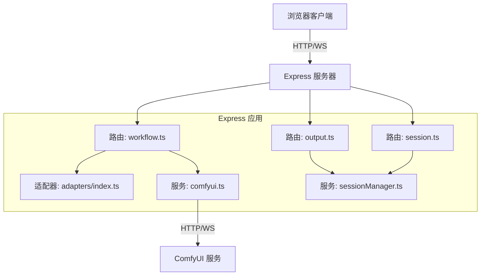
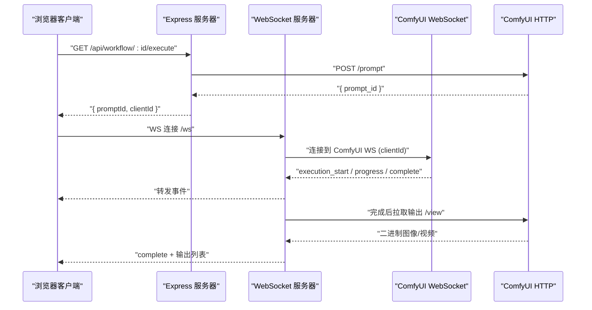
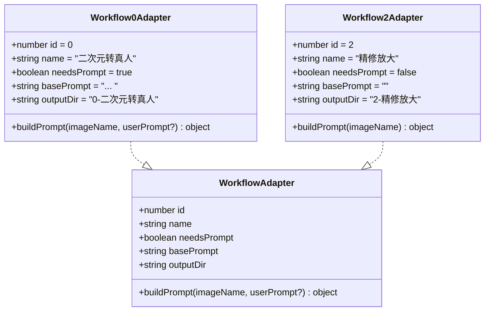
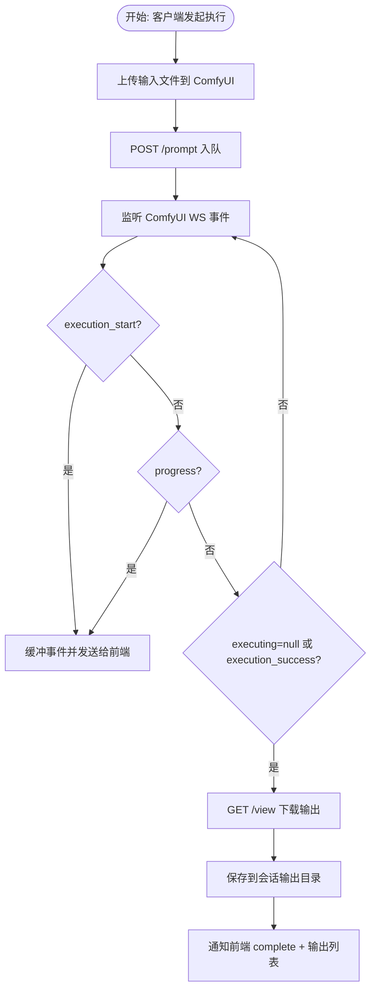
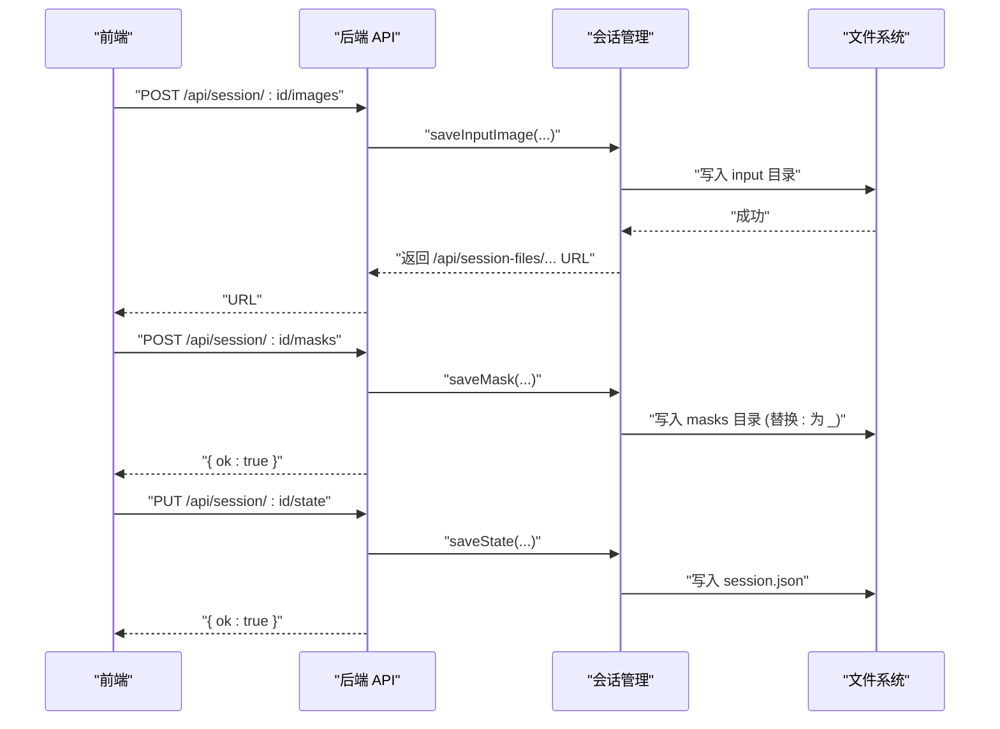
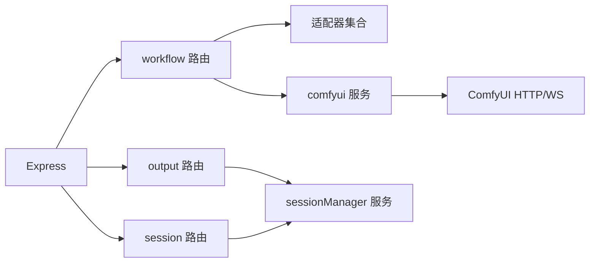

# 后端服务

<cite>
**本文引用的文件**
- [server/src/index.ts](file://server/src/index.ts)
- [server/src/types/index.ts](file://server/src/types/index.ts)
- [server/src/routers/workflow.ts](file://server/src/routes/workflow.ts)
- [server/src/routers/output.ts](file://server/src/routes/output.ts)
- [server/src/routers/session.ts](file://server/src/routes/session.ts)
- [server/src/services/comfyui.ts](file://server/src/services/comfyui.ts)
- [server/src/services/sessionManager.ts](file://server/src/services/sessionManager.ts)
- [server/src/adapters/index.ts](file://server/src/adapters/index.ts)
- [server/src/adapters/BaseAdapter.ts](file://server/src/adapters/BaseAdapter.ts)
- [server/src/adapters/Workflow0Adapter.ts](file://server/src/adapters/Workflow0Adapter.ts)
- [server/src/adapters/Workflow2Adapter.ts](file://server/src/adapters/Workflow2Adapter.ts)
- [server/package.json](file://server/package.json)
- [server/tsconfig.json](file://server/tsconfig.json)
- [README.md](file://README.md)
</cite>

## 目录
1. [简介](#简介)
2. [项目结构](#项目结构)
3. [核心组件](#核心组件)
4. [架构总览](#架构总览)
5. [详细组件分析](#详细组件分析)
6. [依赖关系分析](#依赖关系分析)
7. [性能考量](#性能考量)
8. [故障排查指南](#故障排查指南)
9. [结论](#结论)
10. [附录：API 接口文档与使用示例](#附录api-接口文档与使用示例)

## 简介
本项目为 CorineKit Pix2Real 的后端服务，采用 Express + TypeScript 构建，负责：
- 提供 REST API 以执行多种工作流（图像/视频处理、提示词反推、提示词助理等）
- 通过 WebSocket 实时转发 ComfyUI 的进度事件
- 管理会话（输入图片、蒙版、输出、任务状态）并持久化到本地目录
- 封装 ComfyUI 的 HTTP API 与 WebSocket，统一上传、排队、取回结果与系统状态查询

后端同时作为静态资源服务器，暴露 output 与 session 文件夹，便于前端直接访问生成结果与会话数据。

## 项目结构
后端代码位于 server/src，主要模块划分如下：
- adapters：工作流适配器，每个适配器对应一个 ComfyUI 工作流模板，并负责参数替换
- routes：REST 路由，包含工作流执行、输出文件列表与下载、会话读写等
- services：业务服务，封装 ComfyUI 的 HTTP/WebSocket 客户端与会话管理
- types：共享类型定义（事件、队列项、历史记录等）

图表来源
- [server/src/index.ts:1-228](file://server/src/index.ts#L1-L228)
- [server/src/routes/workflow.ts:1-862](file://server/src/routes/workflow.ts#L1-L862)
- [server/src/routes/output.ts:1-134](file://server/src/routes/output.ts#L1-L134)
- [server/src/routes/session.ts:1-95](file://server/src/routes/session.ts#L1-L95)
- [server/src/services/comfyui.ts:1-285](file://server/src/services/comfyui.ts#L1-L285)
- [server/src/services/sessionManager.ts:1-164](file://server/src/services/sessionManager.ts#L1-L164)
- [server/src/adapters/index.ts:1-31](file://server/src/adapters/index.ts#L1-L31)

章节来源
- [README.md:41-79](file://README.md#L41-L79)
- [server/src/index.ts:42-61](file://server/src/index.ts#L42-L61)

## 核心组件
- 适配器系统（Adapter Pattern）：每个工作流一个适配器，加载对应 JSON 模板并对关键节点进行参数替换（如输入图像名、提示词、随机种子等），实现“模板 + 参数”的可扩展工作流构建。
- 路由层：提供工作流执行、批量执行、队列管理、系统统计、提示词反推/助理、导出混合图等功能；同时提供输出文件列表与下载、打开文件等能力。
- 会话管理：在本地 sessions 目录下按会话与标签页隔离存储输入、蒙版、输出与状态 JSON，支持保存、加载、删除与清理。
- ComfyUI 集成：封装上传图片/视频、入队、取回历史、查看进度、系统统计、队列优先级调整、WebSocket 连接与事件转发。

章节来源
- [server/src/adapters/index.ts:13-28](file://server/src/adapters/index.ts#L13-L28)
- [server/src/routes/workflow.ts:29-580](file://server/src/routes/workflow.ts#L29-L580)
- [server/src/services/sessionManager.ts:10-164](file://server/src/services/sessionManager.ts#L10-L164)
- [server/src/services/comfyui.ts:9-285](file://server/src/services/comfyui.ts#L9-L285)

## 架构总览
后端启动时：
- 初始化 Express 应用与 HTTP 服务器
- 注册 CORS、JSON 解析、静态资源（output 与 session-files）
- 创建 WebSocket 服务器，为每个浏览器连接建立独立的 ComfyUI WebSocket 连接
- 维护 promptId 到工作流/会话映射，缓冲早期进度事件，确保客户端重连后能补发

图表来源
- [server/src/index.ts:73-219](file://server/src/index.ts#L73-L219)
- [server/src/services/comfyui.ts:47-83](file://server/src/services/comfyui.ts#L47-L83)
- [server/src/services/comfyui.ts:127-188](file://server/src/services/comfyui.ts#L127-L188)

## 详细组件分析

### 适配器系统与工作流模板管理
- 设计模式：适配器模式。每个适配器实现统一接口，持有工作流 ID、名称、是否需要用户提示词、基础提示词与输出目录，并提供 buildPrompt 方法。
- 参数替换机制：
  - 输入图像名：将 LoadImage 节点的 image 字段替换为上传后的文件名
  - 用户提示词：根据 needsPrompt 与用户输入拼接或覆盖默认提示词
  - 随机种子：对采样器节点注入随机种子，避免重复结果
- 典型适配器：
  - Workflow0Adapter：二次元转真人，拼接基础提示词与用户提示词
  - Workflow2Adapter：精修放大，仅替换输入图像与随机种子

图表来源
- [server/src/types/index.ts:1-8](file://server/src/types/index.ts#L1-L8)
- [server/src/adapters/Workflow0Adapter.ts:9-34](file://server/src/adapters/Workflow0Adapter.ts#L9-L34)
- [server/src/adapters/Workflow2Adapter.ts:9-27](file://server/src/adapters/Workflow2Adapter.ts#L9-L27)

章节来源
- [server/src/adapters/index.ts:13-28](file://server/src/adapters/index.ts#L13-L28)
- [server/src/adapters/Workflow0Adapter.ts:16-33](file://server/src/adapters/Workflow0Adapter.ts#L16-L33)
- [server/src/adapters/Workflow2Adapter.ts:16-26](file://server/src/adapters/Workflow2Adapter.ts#L16-L26)

### ComfyUI 集成（HTTP API 与 WebSocket）
- HTTP 封装：
  - 上传图片/视频：统一走 /upload/image，支持覆盖与子文件夹类型
  - 入队：POST /prompt，携带 prompt 与 client_id
  - 历史与输出：GET /history/:promptId 与 /view 查询输出二进制
  - 队列与优先级：GET /queue 与 POST /queue 删除/重排
  - 系统统计：GET /system_stats
- WebSocket：
  - 连接：ws://127.0.0.1:8188/ws?clientId=...
  - 事件：progress、executing（含 null 结束）、execution_success、execution_error
  - 去重：使用 Set 记录已触发的执行与完成，避免重复回调
- 与后端 WebSocket 的桥接：
  - 后端为每个浏览器客户端创建一个 ComfyUI WS 连接
  - 缓冲 execution_start/progress 事件，客户端注册 promptId 后重放
  - 完成后从 ComfyUI 拉取输出并保存至会话输出目录，再通知前端

图表来源
- [server/src/services/comfyui.ts:9-83](file://server/src/services/comfyui.ts#L9-L83)
- [server/src/services/comfyui.ts:127-188](file://server/src/services/comfyui.ts#L127-L188)
- [server/src/index.ts:92-189](file://server/src/index.ts#L92-L189)

章节来源
- [server/src/services/comfyui.ts:47-285](file://server/src/services/comfyui.ts#L47-L285)
- [server/src/index.ts:73-219](file://server/src/index.ts#L73-L219)

### 会话管理服务
- 目录结构：sessions/<sessionId>/tab-<n>/{input,masks,output}
- 功能：
  - 输入图片保存：按 imageId+扩展名命名，返回相对 API 路径
  - 输出文件保存：下载自 ComfyUI，保存到对应会话输出目录
  - 蒙版保存：Windows 不支持 ":"，替换为 "_" 并以 .png 结尾
  - 状态 JSON：记录 activeTab 与各标签页的数据（图片、提示词、任务、选中输出索引、姿态切换等）
  - 列表与清理：列出会话元信息，按更新时间倒序，支持删除与保留最近 N 个会话

图表来源
- [server/src/routes/session.ts:18-68](file://server/src/routes/session.ts#L18-L68)
- [server/src/services/sessionManager.ts:20-110](file://server/src/services/sessionManager.ts#L20-L110)

章节来源
- [server/src/routes/session.ts:18-95](file://server/src/routes/session.ts#L18-L95)
- [server/src/services/sessionManager.ts:10-164](file://server/src/services/sessionManager.ts#L10-L164)

### 路由设计与中间件配置
- 中间件：
  - CORS：允许 http://localhost:5173 访问，支持凭据
  - JSON 解析：限制 50MB，满足大体积上传场景
  - 静态资源：/output 与 /api/session-files
- 路由分组：
  - /api/workflow：工作流执行、批量执行、队列管理、系统统计、提示词反推/助理、导出混合图、打开输出目录
  - /api/output：输出文件列表、单文件下载、打开文件
  - /api/session：会话读写、列出会话、删除会话

章节来源
- [server/src/index.ts:45-61](file://server/src/index.ts#L45-L61)
- [server/src/routes/workflow.ts:29-862](file://server/src/routes/workflow.ts#L29-L862)
- [server/src/routes/output.ts:22-134](file://server/src/routes/output.ts#L22-L134)
- [server/src/routes/session.ts:18-95](file://server/src/routes/session.ts#L18-L95)

### 错误处理机制
- 统一错误响应：捕获异常后返回 500 或 400，并包含错误消息
- ComfyUI 可用性降级：系统统计与队列查询失败时返回 502/504
- WebSocket 异常：记录错误日志，清理映射与缓冲，向客户端发送 error 事件
- 文件操作安全：路径解码失败、文件不存在等场景返回明确错误

章节来源
- [server/src/routes/workflow.ts:88-91](file://server/src/routes/workflow.ts#L88-L91)
- [server/src/routes/workflow.ts:145-148](file://server/src/routes/workflow.ts#L145-L148)
- [server/src/routes/output.ts:76-131](file://server/src/routes/output.ts#L76-L131)
- [server/src/services/comfyui.ts:183-185](file://server/src/services/comfyui.ts#L183-L185)

## 依赖关系分析
- 运行时依赖：express、ws、node-fetch、multer、form-data
- 开发依赖：@types/*、tsx、typescript
- 模块耦合：
  - 路由依赖适配器与服务（comfyui、sessionManager）
  - 服务之间低耦合，通过类型接口通信
  - WebSocket 事件在后端与 ComfyUI 之间桥接，避免 UI 层直接依赖

图表来源
- [server/src/index.ts:8-12](file://server/src/index.ts#L8-L12)
- [server/src/routes/workflow.ts:7-10](file://server/src/routes/workflow.ts#L7-L10)
- [server/src/routes/output.ts:6](file://server/src/routes/output.ts#L6)
- [server/src/routes/session.ts:13](file://server/src/routes/session.ts#L13)
- [server/src/services/comfyui.ts:6-7](file://server/src/services/comfyui.ts#L6-L7)

章节来源
- [server/package.json:11-26](file://server/package.json#L11-L26)
- [server/tsconfig.json:2-16](file://server/tsconfig.json#L2-L16)

## 性能考量
- 大文件上传：启用 50MB JSON 解析上限，满足高质量图像/视频处理
- 批量执行：路由支持一次提交多张图片，逐个入队，注意队列长度与 ComfyUI 资源占用
- WebSocket 事件去重：避免重复回调导致的 UI 抖动
- 输出下载：完成后一次性拉取所有输出并保存，减少多次请求
- 队列优先级：支持将目标任务置顶，提升交互体验

## 故障排查指南
- ComfyUI 不可用
  - 现象：系统统计/队列/入队返回 502/504
  - 排查：确认 ComfyUI 在 http://127.0.0.1:8188 运行
- WebSocket 连接失败
  - 现象：进度不更新、complete 事件缺失
  - 排查：检查后端日志中的 WS 错误；确认客户端已发送 register 消息
- 文件无法打开
  - 现象：打开文件/输出目录失败
  - 排查：确认路径存在且编码正确；跨平台命令差异（Windows 使用 start）
- 会话状态异常
  - 现象：session.json 读取失败或字段缺失
  - 排查：检查 JSON 格式与字段类型；必要时删除会话重新开始

章节来源
- [server/src/services/comfyui.ts:106-125](file://server/src/services/comfyui.ts#L106-L125)
- [server/src/routes/output.ts:76-131](file://server/src/routes/output.ts#L76-L131)
- [server/src/services/sessionManager.ts:112-120](file://server/src/services/sessionManager.ts#L112-L120)

## 结论
该后端服务以适配器模式组织工作流，结合 Express 的路由与中间件、ComfyUI 的 HTTP/WebSocket 能力以及本地会话持久化，形成一套完整的本地图像/视频批处理与实时反馈系统。其模块化设计便于扩展更多工作流与功能，同时通过 WebSocket 事件桥接与输出下载优化提升了用户体验。

## 附录：API 接口文档与使用示例

### 通用说明
- 基础地址：http://localhost:3000
- 跨域：允许 http://localhost:5173
- JSON 请求体大小限制：50MB
- WebSocket 地址：ws://localhost:3000/ws

### 工作流路由
- 获取工作流列表
  - GET /api/workflow
  - 返回：[{ id, name, needsPrompt, basePrompt }]
- 单图执行（通用）
  - POST /api/workflow/:id/execute
  - 表单字段：image=file, clientId=string, prompt=string(可选)
  - 返回：{ promptId, clientId, workflowId, workflowName }
- 批量执行
  - POST /api/workflow/:id/batch
  - 表单字段：images=file[]（最多 50），clientId=string，prompt=string 或 prompts=JSON 数组
  - 返回：{ clientId, workflowId, workflowName, tasks:[{ promptId, originalName }] }
- 工作流 5（解除装备）
  - POST /api/workflow/5/execute
  - 表单字段：image=file, mask=file, clientId=string, backPose=bool(可选)
  - 返回：{ promptId, clientId, workflowId=5, workflowName }
- 工作流 7（快速出图：文生图）
  - POST /api/workflow/7/execute
  - JSON：{ clientId, model, prompt, width, height, steps, cfg, sampler, scheduler, name?(可选) }
  - 返回：{ promptId, clientId, workflowId=7, workflowName }
- 工作流 8（黑兽换脸）
  - POST /api/workflow/8/execute
  - 表单字段：targetImage=file, faceImage=file, clientId=string
  - 返回：{ promptId, clientId, workflowId=8, workflowName }
- 工作流 9（ZIT 快出：UNet+LoRA）
  - POST /api/workflow/9/execute
  - JSON：{ clientId, unetModel, loraModel, loraEnabled, shiftEnabled, shift, prompt, width, height, steps, cfg, sampler, scheduler, name?(可选) }
  - 返回：{ promptId, clientId, workflowId=9, workflowName }
- 提示词反推
  - POST /api/workflow/reverse-prompt?model=Qwen3VL|Florence|WD-14
  - 表单字段：image=file
  - 返回：{ text }
- 提示词助理
  - POST /api/workflow/prompt-assistant
  - JSON：{ systemPrompt, userPrompt }
  - 返回：{ text }
- 导出混合图
  - POST /api/workflow/export-blend
  - JSON：{ sessionId, tabId, filename, imageDataBase64 }
  - 返回：{ ok, savedPath }
- 打开输出目录
  - POST /api/workflow/:id/open-folder
  - JSON：{ sessionId?, tabId? }
  - 返回：{ ok, path }
- 队列与系统
  - GET /api/workflow/models/checkpoints
  - GET /api/workflow/models/unets
  - GET /api/workflow/models/loras
  - GET /api/workflow/system-stats
  - POST /api/workflow/release-memory
  - GET /api/workflow/queue
  - POST /api/workflow/queue/prioritize/:promptId
  - POST /api/workflow/cancel-queue/:promptId

章节来源
- [server/src/routes/workflow.ts:29-862](file://server/src/routes/workflow.ts#L29-L862)

### 输出路由
- 列出输出文件
  - GET /api/output/:workflowId
  - 返回：[{ filename, size, createdAt, url }]
- 下载单文件
  - GET /api/output/:workflowId/:filename
- 打开文件
  - POST /api/output/open-file
  - JSON：{ url }（支持 /output/...、/api/output/...、/api/session-files/...）

章节来源
- [server/src/routes/output.ts:22-134](file://server/src/routes/output.ts#L22-L134)

### 会话路由
- 上传输入图片
  - POST /api/session/:sessionId/images
  - 表单字段：image=file, tabId=number, imageId=string
  - 返回：{ url }
- 上传蒙版
  - POST /api/session/:sessionId/masks
  - 表单字段：mask=file(PNG), tabId=number, maskKey=string
  - 返回：{ ok }
- 保存/发送 Beacon 保存状态
  - PUT /api/session/:sessionId/state
  - POST /api/session/:sessionId/state
  - JSON：{ activeTab, tabData }
  - 返回：{ ok }
- 读取会话
  - GET /api/session/:sessionId
  - 返回：SessionState
- 列出会话
  - GET /api/sessions
  - 返回：[{ sessionId, createdAt, updatedAt }]
- 删除会话
  - DELETE /api/session/:sessionId
  - 返回：{ ok }

章节来源
- [server/src/routes/session.ts:18-95](file://server/src/routes/session.ts#L18-L95)
- [server/src/services/sessionManager.ts:112-164](file://server/src/services/sessionManager.ts#L112-L164)