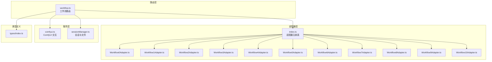
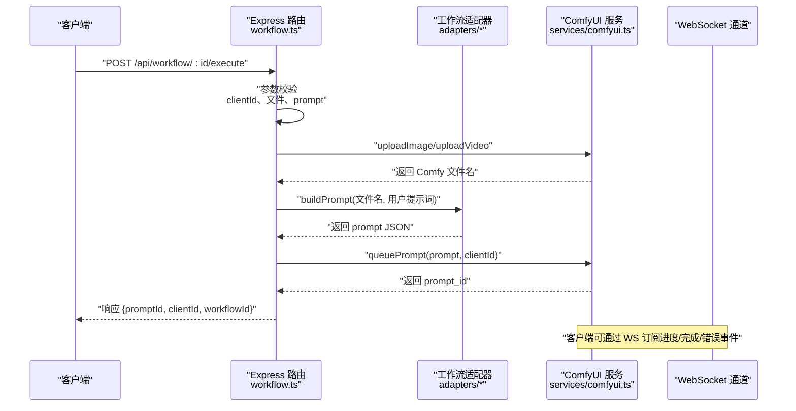
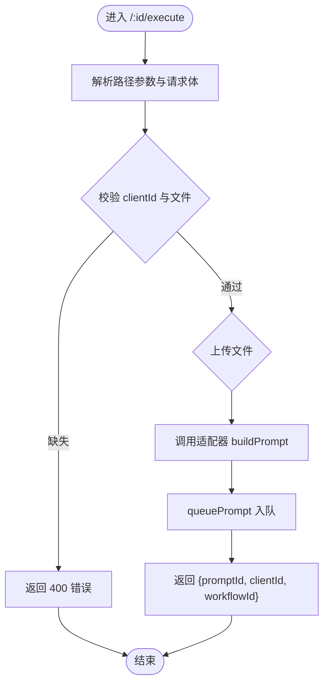
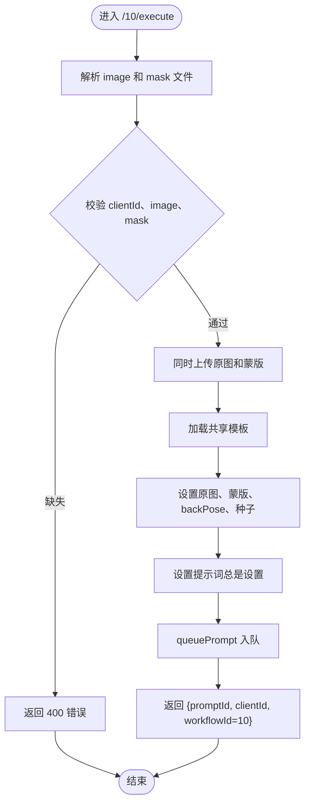
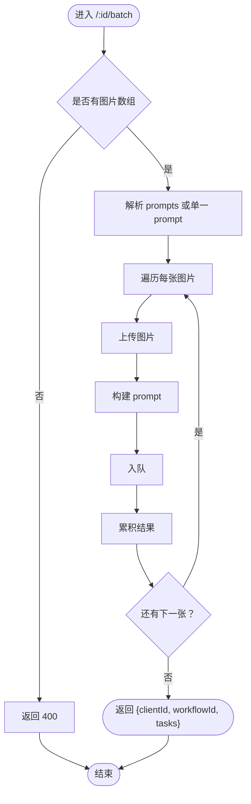
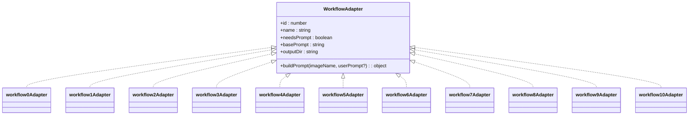
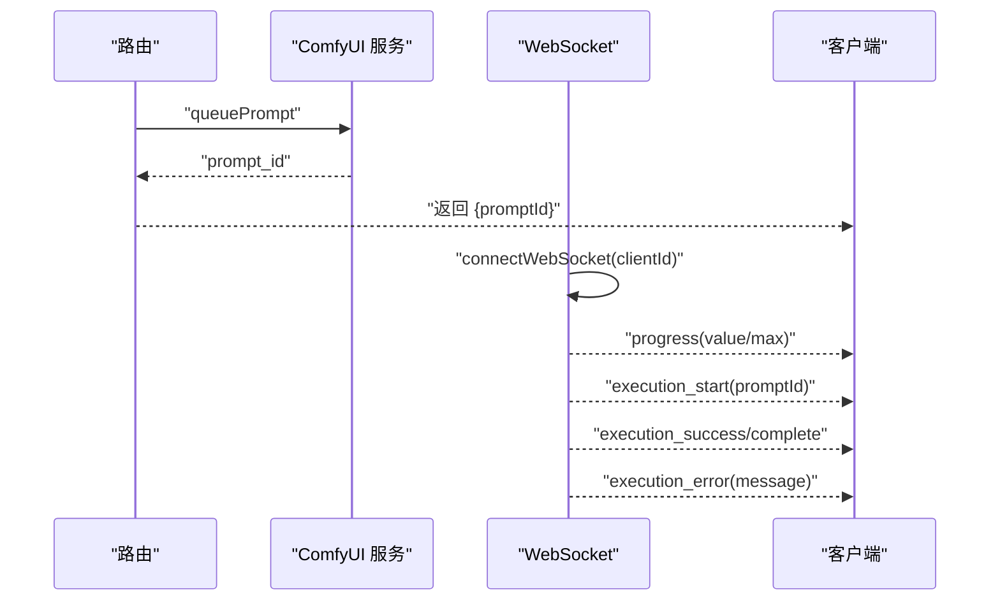
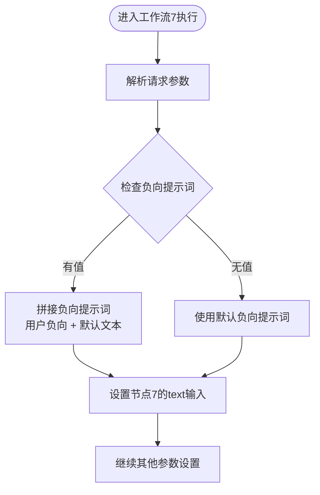
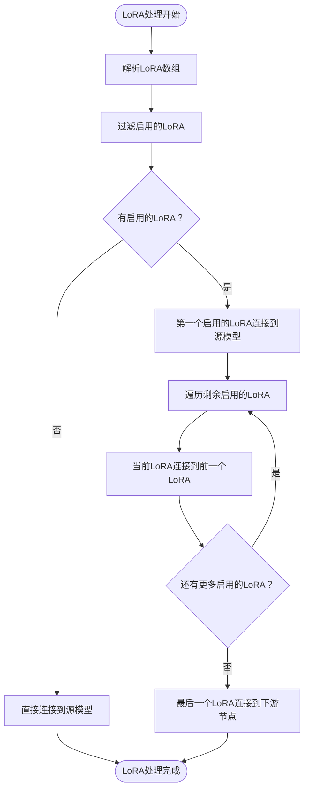
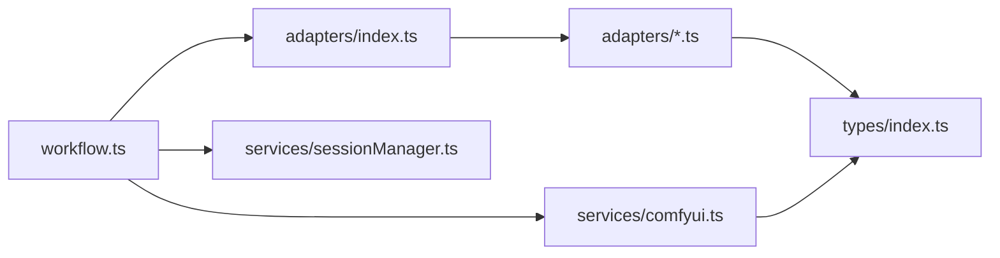

# 工作流路由

<cite>
**本文引用的文件**
- [server/src/routes/workflow.ts](file://server/src/routes/workflow.ts)
- [server/src/adapters/index.ts](file://server/src/adapters/index.ts)
- [server/src/services/comfyui.ts](file://server/src/services/comfyui.ts)
- [server/src/services/sessionManager.ts](file://server/src/services/sessionManager.ts)
- [server/src/types/index.ts](file://server/src/types/index.ts)
- [server/src/adapters/BaseAdapter.ts](file://server/src/adapters/BaseAdapter.ts)
- [server/src/adapters/Workflow0Adapter.ts](file://server/src/adapters/Workflow0Adapter.ts)
- [server/src/adapters/Workflow10Adapter.ts](file://server/src/adapters/Workflow10Adapter.ts)
- [server/src/adapters/Workflow1Adapter.ts](file://server/src/adapters/Workflow1Adapter.ts)
- [server/src/adapters/Workflow2Adapter.ts](file://server/src/adapters/Workflow2Adapter.ts)
- [server/src/adapters/Workflow3Adapter.ts](file://server/src/adapters/Workflow3Adapter.ts)
- [server/src/adapters/Workflow4Adapter.ts](file://server/src/adapters/Workflow4Adapter.ts)
- [server/src/adapters/Workflow5Adapter.ts](file://server/src/adapters/Workflow5Adapter.ts)
- [server/src/adapters/Workflow6Adapter.ts](file://server/src/adapters/Workflow6Adapter.ts)
- [server/src/adapters/Workflow7Adapter.ts](file://server/src/adapters/Workflow7Adapter.ts)
- [server/src/adapters/Workflow8Adapter.ts](file://server/src/adapters/Workflow8Adapter.ts)
- [server/src/adapters/Workflow9Adapter.ts](file://server/src/adapters/Workflow9Adapter.ts)
- [ComfyUI_API/Pix2Real-ZIT文生图NEW2.json](file://ComfyUI_API/Pix2Real-ZIT文生图NEW2.json)
- [ComfyUI_API/Pix2Real-二次元生成.json](file://ComfyUI_API/Pix2Real-二次元生成.json)
</cite>

## 目录
1. [简介](#简介)
2. [项目结构](#项目结构)
3. [核心组件](#核心组件)
4. [架构总览](#架构总览)
5. [详细组件分析](#详细组件分析)
6. [依赖关系分析](#依赖关系分析)
7. [性能考量](#性能考量)
8. [故障排查指南](#故障排查指南)
9. [结论](#结论)
10. [附录：API 使用示例与错误处理](#附录api-使用示例与错误处理)

## 简介
本文件面向 CorineKit Pix2Real 的"工作流路由"模块，系统性阐述以下内容：
- 工作流执行接口设计与实现：重点覆盖 POST /api/workflow/:id/execute 的请求处理流程、参数校验、工作流适配器调用机制。
- 新增工作流10（区域编辑）的专用接口：支持原图和蒙版的区域编辑处理，提供原图和蒙版的联合处理能力。
- **新增负向提示词处理**：在工作流7（快速出图）中支持负向提示词的动态拼接和处理。
- **增强的LoRA节点链处理**：在多个工作流中实现动态LoRA节点链连接，支持多个LoRA模型的串联和条件启用。
- 任务状态查询接口 GET /api/workflow/:id/status 的实现思路（基于现有服务层能力的扩展建议）。
- 批量处理接口的设计思路：并发控制、资源管理、错误处理策略。
- 完整的 API 使用示例与错误处理机制。

该模块通过 Express 路由聚合多条工作流执行路径，并借助工作流适配器与 ComfyUI 服务层完成模板构建、上传、入队与状态轮询等关键步骤。

## 项目结构
工作流路由位于后端 server 子项目中，采用"按功能分层"的组织方式：
- 路由层：集中定义 REST 接口与业务入口
- 适配器层：封装不同工作流的模板与参数构建逻辑
- 服务层：抽象与 ComfyUI 的交互（上传、入队、队列、历史、系统统计、WebSocket）
- 类型定义：统一事件与数据结构
- 会话管理：持久化会话与输出目录

**图表来源**
- [server/src/routes/workflow.ts:1-1068](file://server/src/routes/workflow.ts#L1-L1068)
- [server/src/adapters/index.ts:1-33](file://server/src/adapters/index.ts#L1-L33)
- [server/src/services/comfyui.ts:1-285](file://server/src/services/comfyui.ts#L1-L285)
- [server/src/services/sessionManager.ts:1-164](file://server/src/services/sessionManager.ts#L1-L164)
- [server/src/types/index.ts:1-52](file://server/src/types/index.ts#L1-L52)

**章节来源**
- [server/src/routes/workflow.ts:1-1068](file://server/src/routes/workflow.ts#L1-L1068)
- [server/src/adapters/index.ts:1-33](file://server/src/adapters/index.ts#L1-L33)
- [server/src/services/comfyui.ts:1-285](file://server/src/services/comfyui.ts#L1-L285)
- [server/src/services/sessionManager.ts:1-164](file://server/src/services/sessionManager.ts#L1-L164)
- [server/src/types/index.ts:1-52](file://server/src/types/index.ts#L1-L52)

## 核心组件
- 工作流路由（workflow.ts）
  - 提供工作流清单、执行、取消队列、系统统计、队列优先级、打开输出目录、导出混合图、反向提示词、提示词助理等接口。
  - 支持单图执行与批量执行，支持图片与视频输入（特定工作流）。
  - 新增工作流10（区域编辑）专用路由，支持原图和蒙版的联合处理。
  - **新增负向提示词处理**：在工作流7中支持负向提示词的动态拼接。
  - **增强LoRA节点链处理**：在工作流7和9中实现动态LoRA节点链连接和条件启用。
- 适配器注册表（adapters/index.ts）
  - 维护编号到适配器实例的映射，提供按 id 获取适配器的工厂方法。
  - 新增工作流10适配器注册。
- 适配器实现（adapters/*.ts）
  - 每个适配器负责加载对应 ComfyUI JSON 模板，注入输入参数（如图像名、种子、提示词），并返回可直接入队的 prompt 对象。
  - 工作流10适配器使用专用路由而非通用 /:id/execute。
- ComfyUI 服务（services/comfyui.ts）
  - 封装上传、入队、历史、系统统计、队列、优先级调整、WebSocket 连接等能力。
- 会话管理（services/sessionManager.ts）
  - 提供会话目录结构、输入/输出/掩码文件保存、会话状态序列化与列表清理等。
- 类型定义（types/index.ts）
  - 统一事件、输出文件、队列响应、历史条目等结构。

**章节来源**
- [server/src/routes/workflow.ts:1-1068](file://server/src/routes/workflow.ts#L1-L1068)
- [server/src/adapters/index.ts:1-33](file://server/src/adapters/index.ts#L1-L33)
- [server/src/services/comfyui.ts:1-285](file://server/src/services/comfyui.ts#L1-L285)
- [server/src/services/sessionManager.ts:1-164](file://server/src/services/sessionManager.ts#L1-L164)
- [server/src/types/index.ts:1-52](file://server/src/types/index.ts#L1-L52)

## 架构总览
工作流路由的典型执行链路如下：

**图表来源**
- [server/src/routes/workflow.ts:545-593](file://server/src/routes/workflow.ts#L545-L593)
- [server/src/adapters/index.ts:26-28](file://server/src/adapters/index.ts#L26-L28)
- [server/src/services/comfyui.ts:47-60](file://server/src/services/comfyui.ts#L47-L60)
- [server/src/types/index.ts:10-30](file://server/src/types/index.ts#L10-L30)

## 详细组件分析

### 组件一：工作流执行接口 POST /api/workflow/:id/execute
- 请求处理流程
  - 参数解析：从路径参数提取 workflowId；从查询或请求体解析 clientId；从 multipart/form-data 中读取 image 字段。
  - 参数校验：检查 clientId 是否存在；检查是否上传了图片；对特殊工作流（如 4 视频）进行类型区分。
  - 文件上传：根据工作流类型选择上传图片或视频至 ComfyUI。
  - 模板构建：通过适配器工厂获取对应适配器，调用其 buildPrompt 方法生成 prompt JSON。
  - 入队：调用 queuePrompt 将 prompt 提交到 ComfyUI 队列，返回 prompt_id。
  - 响应：返回包含 promptId、clientId、workflowId、workflowName 的 JSON。
- 错误处理
  - 未知工作流：返回 400。
  - 缺少文件或 clientId：返回 400。
  - 服务异常：捕获错误并返回 500。
- 并发与资源
  - 单请求内串行：上传、构建、入队为顺序操作，避免竞争条件。
  - 外部依赖：ComfyUI 可能成为瓶颈，需结合队列与 WebSocket 监听优化用户体验。

**图表来源**
- [server/src/routes/workflow.ts:545-593](file://server/src/routes/workflow.ts#L545-L593)

**章节来源**
- [server/src/routes/workflow.ts:545-593](file://server/src/routes/workflow.ts#L545-L593)

### 组件二：工作流10（区域编辑）专用接口 POST /api/workflow/10/execute
- 接口特性
  - 专用路由：使用 `/api/workflow/10/execute` 而非通用 `/:id/execute`。
  - 双文件输入：要求同时提供原图（image）和蒙版（mask）文件。
  - 模板共享：与工作流5（解除装备）使用相同的模板文件（Pix2Real-解除装备Fixed.json）。
  - 提示词处理：始终设置提示词，即使为空字符串，体现区域编辑的强制性。
- 请求处理流程
  - 参数解析：从 multipart/form-data 中读取 image 和 mask 字段。
  - 参数校验：检查 clientId、image、mask 文件是否都存在。
  - 文件上传：同时上传原图和蒙版至 ComfyUI。
  - 模板构建：加载共享模板，设置原图、蒙版、backPose 参数和随机种子。
  - 提示词设置：无论用户是否提供，都会设置提示词（区域编辑特性）。
  - 入队：调用 queuePrompt 将 prompt 提交到 ComfyUI 队列。
  - 响应：返回包含 promptId、clientId、workflowId、workflowName 的 JSON。
- 与其他工作流的区别
  - 与工作流5相比：主要区别在于提示词处理逻辑（工作流10总是设置提示词）。
  - 与通用路由相比：使用专用路由，参数校验更加严格，支持双文件输入。

**图表来源**
- [server/src/routes/workflow.ts:96-146](file://server/src/routes/workflow.ts#L96-L146)

**章节来源**
- [server/src/routes/workflow.ts:96-146](file://server/src/routes/workflow.ts#L96-L146)
- [server/src/adapters/Workflow10Adapter.ts:1-15](file://server/src/adapters/Workflow10Adapter.ts#L1-L15)

### 组件三：批量处理接口 POST /api/workflow/:id/batch
- 设计思路
  - 输入：支持最多 50 张图片的数组上传；可选 prompts 数组（与图片一一对应）或单一 prompt。
  - 流程：逐张上传、逐张构建 prompt、逐张入队，收集每项的 promptId 与原始文件名。
  - 响应：返回 clientId、workflowId、workflowName 以及 tasks 列表。
- 并发控制
  - 当前实现为串行循环，简单可靠；若需提升吞吐，可在保证幂等与资源限制的前提下引入有限并发（例如使用 Promise.allSettled 控制并发度）。
- 资源管理
  - 上传与入队均依赖 ComfyUI；应考虑队列长度与 GPU/内存占用，必要时在前端或路由层增加节流。
- 错误处理
  - 单项失败不影响整体；建议在 tasks 中记录单项错误或在上层统一处理。

**图表来源**
- [server/src/routes/workflow.ts:595-658](file://server/src/routes/workflow.ts#L595-L658)

**章节来源**
- [server/src/routes/workflow.ts:595-658](file://server/src/routes/workflow.ts#L595-L658)

### 组件四：任务状态查询接口 GET /api/workflow/:id/status（设计建议）
- 现状
  - 路由层未提供该接口；但服务层已具备历史查询与 WebSocket 事件订阅能力。
- 设计建议
  - 后端提供 GET /api/workflow/:id/status，内部通过 getHistory 查询 ComfyUI 历史，返回任务状态与输出文件列表。
  - 若需要实时进度，建议复用现有 WebSocket 通道，或在路由层维护短期状态缓存（结合 clientId 与 promptId）。
  - 进度计算：可参考 WebSocket 的 progress 事件中的 value/max 推导百分比。
  - 历史记录管理：结合 sessionManager 的会话状态结构，将任务状态持久化到 session.json 中，便于断线恢复与回溯。
- 注意事项
  - 历史查询可能受 ComfyUI 配置影响（历史保留策略）。
  - WebSocket 事件去重与幂等处理需在服务层统一实现。

**章节来源**
- [server/src/services/comfyui.ts:62-71](file://server/src/services/comfyui.ts#L62-L71)
- [server/src/services/comfyui.ts:127-188](file://server/src/services/comfyui.ts#L127-L188)
- [server/src/types/index.ts:42-51](file://server/src/types/index.ts#L42-L51)
- [server/src/services/sessionManager.ts:61-110](file://server/src/services/sessionManager.ts#L61-L110)

### 组件五：工作流适配器调用机制
- 适配器职责
  - 加载对应 JSON 模板，设置输入节点（如图像名、种子、提示词），返回可直接入队的 prompt。
- 适配器注册与获取
  - 通过 adapters/index.ts 的映射表与工厂函数 getAdapter 获取指定 id 的适配器实例。
- 典型适配器示例
  - Workflow0Adapter：二次元转真人，支持用户提示词拼接。
  - Workflow2Adapter：精修放大，无用户提示词。
  - Workflow5Adapter：解除装备，使用专用路由而非通用 /:id/execute。
  - Workflow7Adapter：快速出图，使用专用路由。
  - Workflow10Adapter：区域编辑，使用专用路由，提示词总是设置。
  - Workflow1Adapter/WF3Adapter/WF6Adapter/WF4Adapter/WF8Adapter/WF9Adapter：分别对应不同工作流的模板与参数。

**图表来源**
- [server/src/types/index.ts:1-8](file://server/src/types/index.ts#L1-L8)
- [server/src/adapters/Workflow0Adapter.ts:9-34](file://server/src/adapters/Workflow0Adapter.ts#L9-L34)
- [server/src/adapters/Workflow1Adapter.ts:9-35](file://server/src/adapters/Workflow1Adapter.ts#L9-L35)
- [server/src/adapters/Workflow2Adapter.ts:9-27](file://server/src/adapters/Workflow2Adapter.ts#L9-L27)
- [server/src/adapters/Workflow3Adapter.ts:9-32](file://server/src/adapters/Workflow3Adapter.ts#L9-L32)
- [server/src/adapters/Workflow4Adapter.ts:9-27](file://server/src/adapters/Workflow4Adapter.ts#L9-L27)
- [server/src/adapters/Workflow5Adapter.ts:4-14](file://server/src/adapters/Workflow5Adapter.ts#L4-L14)
- [server/src/adapters/Workflow6Adapter.ts:9-35](file://server/src/adapters/Workflow6Adapter.ts#L9-L35)
- [server/src/adapters/Workflow7Adapter.ts:3-13](file://server/src/adapters/Workflow7Adapter.ts#L3-L13)
- [server/src/adapters/Workflow8Adapter.ts:3-13](file://server/src/adapters/Workflow8Adapter.ts#L3-L13)
- [server/src/adapters/Workflow9Adapter.ts:3-13](file://server/src/adapters/Workflow9Adapter.ts#L3-L13)
- [server/src/adapters/Workflow10Adapter.ts:4-14](file://server/src/adapters/Workflow10Adapter.ts#L4-L14)

**章节来源**
- [server/src/adapters/index.ts:14-30](file://server/src/adapters/index.ts#L14-L30)
- [server/src/adapters/Workflow0Adapter.ts:1-35](file://server/src/adapters/Workflow0Adapter.ts#L1-L35)
- [server/src/adapters/Workflow2Adapter.ts:1-28](file://server/src/adapters/Workflow2Adapter.ts#L1-L28)
- [server/src/adapters/Workflow5Adapter.ts:1-15](file://server/src/adapters/Workflow5Adapter.ts#L1-L15)
- [server/src/adapters/Workflow7Adapter.ts:1-14](file://server/src/adapters/Workflow7Adapter.ts#L1-L14)
- [server/src/adapters/Workflow10Adapter.ts:1-15](file://server/src/adapters/Workflow10Adapter.ts#L1-L15)
- [server/src/adapters/Workflow1Adapter.ts:1-36](file://server/src/adapters/Workflow1Adapter.ts#L1-L36)
- [server/src/adapters/Workflow3Adapter.ts:1-33](file://server/src/adapters/Workflow3Adapter.ts#L1-L33)
- [server/src/adapters/Workflow4Adapter.ts:1-28](file://server/src/adapters/Workflow4Adapter.ts#L1-L28)
- [server/src/adapters/Workflow6Adapter.ts:1-36](file://server/src/adapters/Workflow6Adapter.ts#L1-L36)
- [server/src/adapters/Workflow8Adapter.ts:1-14](file://server/src/adapters/Workflow8Adapter.ts#L1-L14)
- [server/src/adapters/Workflow9Adapter.ts:1-14](file://server/src/adapters/Workflow9Adapter.ts#L1-L14)

### 组件六：与 ComfyUI 的集成与 WebSocket 状态监听
- 上传与入队
  - uploadImage/uploadVideo：将二进制文件上传至 ComfyUI，返回文件名。
  - queuePrompt：提交 prompt 至队列，返回 prompt_id。
- 历史与进度
  - getHistory：查询任务历史，判断完成状态与输出文件。
  - connectWebSocket：建立 WS 连接，接收 progress、execution 开始/完成、execution_error 等事件。
- 队列管理
  - getQueue：获取运行中与待处理队列项。
  - prioritizeQueueItem：将目标任务置于队首，返回旧/新 prompt_id 映射。
- 系统统计
  - getSystemStats：获取 VRAM 与 RAM 使用率。

**图表来源**
- [server/src/services/comfyui.ts:47-60](file://server/src/services/comfyui.ts#L47-L60)
- [server/src/services/comfyui.ts:62-71](file://server/src/services/comfyui.ts#L62-L71)
- [server/src/services/comfyui.ts:127-188](file://server/src/services/comfyui.ts#L127-L188)
- [server/src/services/comfyui.ts:202-221](file://server/src/services/comfyui.ts#L202-L221)
- [server/src/services/comfyui.ts:255-284](file://server/src/services/comfyui.ts#L255-L284)

**章节来源**
- [server/src/services/comfyui.ts:1-285](file://server/src/services/comfyui.ts#L1-L285)

### 组件七：新增功能：负向提示词处理

**更新** 工作流7（快速出图）现已支持负向提示词处理，允许用户添加额外的负面描述来改善生成效果。

- 处理逻辑
  - 负向提示词会与默认文本进行拼接，用户提供的负向提示词会添加到默认文本的前面。
  - 支持空字符串输入，此时使用模板的默认负向提示词。
  - 通过模板节点7的text输入实现负向提示词的动态设置。

**图表来源**
- [server/src/routes/workflow.ts:188-191](file://server/src/routes/workflow.ts#L188-L191)

**章节来源**
- [server/src/routes/workflow.ts:148-253](file://server/src/routes/workflow.ts#L148-L253)

### 组件八：增强功能：动态LoRA节点链处理

**更新** 工作流7和9现已实现动态LoRA节点链处理，支持多个LoRA模型的串联和条件启用。

- LoRA节点链结构
  - 工作流7使用节点50-54形成LoRA链
  - 工作流9使用节点36、50-53形成LoRA链
  - 支持最多5个LoRA节点的串联

- 动态连接逻辑
  - 遍历所有LoRA，过滤出enabled=true的节点
  - 如果没有启用的LoRA，直接连接到源模型
  - 如果有启用的LoRA，第一个启用的LoRA连接到源模型
  - 后续LoRA依次连接到前一个LoRA的输出
  - 最后一个LoRA的输出连接到下游节点

**图表来源**
- [server/src/routes/workflow.ts:197-239](file://server/src/routes/workflow.ts#L197-L239)
- [server/src/routes/workflow.ts:332-374](file://server/src/routes/workflow.ts#L332-L374)

**章节来源**
- [server/src/routes/workflow.ts:148-393](file://server/src/routes/workflow.ts#L148-L393)

### 组件九：LoRA节点链模板结构

**更新** 新增的LoRA节点链在JSON模板中有明确的结构定义：

- 工作流7模板结构
  - 节点50-54：5个LoRA加载器节点
  - 节点4：Checkpoint模型源
  - 节点6、7：CLIP文本编码器
  - 节点3：KSampler采样器

- 工作流9模板结构  
  - 节点36、50-53：5个LoRA加载器节点
  - 节点25：UNet模型源
  - 节点26：CLIP模型源
  - 节点4：KSampler采样器
  - 节点47：ifElse判断节点控制模型选择

**章节来源**
- [ComfyUI_API/Pix2Real-ZIT文生图NEW2.json:115-265](file://ComfyUI_API/Pix2Real-ZIT文生图NEW2.json#L115-L265)
- [ComfyUI_API/Pix2Real-二次元生成.json:132-226](file://ComfyUI_API/Pix2Real-二次元生成.json#L132-L226)

## 依赖关系分析
- 路由层依赖
  - 适配器注册表：用于按 id 获取适配器实例。
  - ComfyUI 服务：用于上传、入队、历史、队列、系统统计、WebSocket。
  - 会话管理：用于打开输出目录与导出混合图等场景。
- 适配器层依赖
  - JSON 模板文件：位于 ComfyUI_API 目录。
  - 类型定义：确保 buildPrompt 返回值符合预期。
- 服务层依赖
  - 外部 ComfyUI 实例：通过 HTTP 与 WebSocket 通信。
  - 类型定义：统一响应结构。

**图表来源**
- [server/src/routes/workflow.ts:1-12](file://server/src/routes/workflow.ts#L1-L12)
- [server/src/adapters/index.ts:1-33](file://server/src/adapters/index.ts#L1-L33)
- [server/src/services/comfyui.ts:1-8](file://server/src/services/comfyui.ts#L1-L8)
- [server/src/services/sessionManager.ts:1-6](file://server/src/services/sessionManager.ts#L1-L6)
- [server/src/types/index.ts:1-8](file://server/src/types/index.ts#L1-L8)

**章节来源**
- [server/src/routes/workflow.ts:1-12](file://server/src/routes/workflow.ts#L1-L12)
- [server/src/adapters/index.ts:1-33](file://server/src/adapters/index.ts#L1-L33)
- [server/src/services/comfyui.ts:1-8](file://server/src/services/comfyui.ts#L1-L8)
- [server/src/services/sessionManager.ts:1-6](file://server/src/services/sessionManager.ts#L1-L6)
- [server/src/types/index.ts:1-8](file://server/src/types/index.ts#L1-L8)

## 性能考量
- 上传与入队
  - 图片/视频上传为同步阻塞操作，建议在前端进行文件大小与格式预检，减少无效请求。
- 队列与并发
  - 批量接口当前串行执行，适合稳定可控的环境；高负载场景可引入有限并发与背压策略。
- WebSocket 事件
  - 在 UI 层订阅进度事件，避免频繁轮询历史接口，降低网络与服务器压力。
- 内存与显存
  - 提供释放内存工作流与系统统计接口，便于在高峰时段主动回收资源。
- **LoRA处理性能**
  - 多个LoRA节点串联会增加计算开销，建议合理控制启用的LoRA数量。
  - 动态连接逻辑避免了不必要的节点连接，提高了执行效率。

## 故障排查指南
- 常见错误与定位
  - 400 缺少参数：检查 clientId、文件上传字段、prompts JSON 格式。
  - 500 服务异常：查看路由层 catch 分支与服务层错误抛出位置。
  - ComfyUI 不可用：系统统计与队列接口返回 502，确认 ComfyUI 服务状态。
  - **负向提示词问题**：检查负向提示词格式和拼接逻辑。
  - **LoRA连接问题**：检查LoRA节点ID映射和动态连接逻辑。
- 建议排查步骤
  - 确认 ComfyUI 地址与端口配置正确。
  - 检查模板文件是否存在且可读。
  - 使用 WebSocket 订阅事件，观察执行开始与完成信号。
  - 对于长时间未完成的任务，检查队列优先级与历史状态。
  - **验证LoRA节点链连接**：检查enabled字段和节点间的连接关系。

**章节来源**
- [server/src/routes/workflow.ts:88-91](file://server/src/routes/workflow.ts#L88-L91)
- [server/src/routes/workflow.ts:145-148](file://server/src/routes/workflow.ts#L145-L148)
- [server/src/routes/workflow.ts:156-158](file://server/src/routes/workflow.ts#L156-L158)
- [server/src/routes/workflow.ts:257-260](file://server/src/routes/workflow.ts#L257-L260)
- [server/src/routes/workflow.ts:516-519](file://server/src/routes/workflow.ts#L516-L519)
- [server/src/routes/workflow.ts:537-539](file://server/src/routes/workflow.ts#L537-L539)
- [server/src/routes/workflow.ts:576-578](file://server/src/routes/workflow.ts#L576-L578)
- [server/src/services/comfyui.ts:106-125](file://server/src/services/comfyui.ts#L106-L125)
- [server/src/services/comfyui.ts:202-221](file://server/src/services/comfyui.ts#L202-L221)

## 结论
工作流路由模块通过清晰的分层设计与适配器模式，实现了对多种工作流的统一接入与扩展。当前已具备完善的单图与批量执行能力，并通过服务层与 WebSocket 提供了良好的状态反馈基础。新增的工作流10（区域编辑）专用接口进一步丰富了应用的编辑能力，支持原图和蒙版的联合处理。

**重要更新**：
- **负向提示词处理**：工作流7现已支持负向提示词的动态拼接，用户可以通过negativePrompt参数添加负面描述来改善生成效果。
- **增强LoRA节点链处理**：在工作流7和9中实现了动态LoRA节点链连接，支持最多5个LoRA模型的串联和条件启用，提供了更灵活的模型组合能力。

后续可在"任务状态查询接口""批量并发控制""历史记录持久化"等方面进一步完善，以满足更高吞吐与更丰富的用户体验需求。

## 附录：API 使用示例与错误处理

- POST /api/workflow/:id/execute
  - 请求
    - 方法：POST
    - 路径：/api/workflow/:id/execute
    - 表单字段：image（必填）、clientId（查询或请求体）、prompt（可选）
    - 特殊工作流：当 id=4 时，上传的是视频文件
  - 响应
    - 成功：返回 {promptId, clientId, workflowId, workflowName}
    - 失败：400（缺少参数/未知工作流）、500（内部错误）

- POST /api/workflow/10/execute（新增）
  - 请求
    - 方法：POST
    - 路径：/api/workflow/10/execute
    - 表单字段：image（原图，必填）、mask（蒙版，必填）、clientId（必填）、prompt（可选）
    - 特殊行为：总是设置提示词，即使为空字符串
  - 响应
    - 成功：返回 {promptId, clientId, workflowId=10, workflowName="区域编辑"}
    - 失败：400（缺少参数/文件）、500（内部错误）

- POST /api/workflow/:id/batch
  - 请求
    - 方法：POST
    - 路径：/api/workflow/:id/batch
    - 表单字段：images（最多 50 张）、clientId（必填）、prompt（可选）、prompts（可选 JSON 数组）
  - 响应
    - 成功：返回 {clientId, workflowId, workflowName, tasks: [{promptId, originalName}, ...]}
    - 失败：400（缺少参数/无文件）、500（内部错误）

- GET /api/workflow/:id/status（建议新增）
  - 请求
    - 方法：GET
    - 路径：/api/workflow/:id/status?promptId=...
  - 响应
    - 成功：返回任务状态与输出文件列表
    - 失败：502（ComfyUI 不可用）、504（超时）

- **新增** POST /api/workflow/7/execute（快速出图，含负向提示词）
  - 请求
    - 方法：POST
    - 路径：/api/workflow/7/execute
    - JSON字段：clientId（必填）、model（必填）、loras（可选数组）、prompt（必填）、negativePrompt（可选）、width、height、steps、cfg、sampler、scheduler、name
    - 特殊功能：支持负向提示词拼接和动态LoRA节点链
  - 响应
    - 成功：返回 {promptId, clientId, workflowId=7, workflowName="快速出图"}
    - 失败：400（缺少参数）、500（内部错误）

- **新增** POST /api/workflow/9/execute（ZIT快出，含UNet和LoRA）
  - 请求
    - 方法：POST
    - 路径：/api/workflow/9/execute
    - JSON字段：clientId（必填）、unetModel（必填）、loras（可选数组）、shiftEnabled（必填）、shift（可选）、prompt（必填）、width、height、steps、cfg、sampler、scheduler、name
    - 特殊功能：支持UNet模型、AuraFlow算法和动态LoRA节点链
  - 响应
    - 成功：返回 {promptId, clientId, workflowId=9, workflowName="ZIT快出"}
    - 失败：400（缺少参数）、500（内部错误）

- **其他常用接口**
  - GET /api/workflow/models/checkpoints、/unets、/loras：列出模型
  - POST /api/workflow/release-memory：释放显存
  - GET /api/workflow/system-stats：系统统计
  - GET /api/workflow/queue、POST /queue/prioritize/:promptId：队列管理
  - POST /:id/open-folder：打开输出目录
  - POST /api/workflow/export-blend：导出混合图
  - POST /api/workflow/reverse-prompt：反向提示词
  - POST /api/workflow/prompt-assistant：提示词助理

- **错误处理机制**
  - 参数校验失败：返回 400，并给出明确错误信息
  - 服务不可用：返回 502（如系统统计）
  - 超时：反向提示词与提示词助理接口设置超时（约 180 秒），返回 504
  - 未知异常：捕获并返回 500，日志记录便于排查
  - **新增**：负向提示词处理失败：检查negativePrompt参数格式
  - **新增**：LoRA节点链连接失败：检查loras数组格式和enabled字段

**章节来源**
- [server/src/routes/workflow.ts:29-38](file://server/src/routes/workflow.ts#L29-L38)
- [server/src/routes/workflow.ts:40-92](file://server/src/routes/workflow.ts#L40-L92)
- [server/src/routes/workflow.ts:94-149](file://server/src/routes/workflow.ts#L94-L149)
- [server/src/routes/workflow.ts:151-179](file://server/src/routes/workflow.ts#L151-L179)
- [server/src/routes/workflow.ts:181-261](file://server/src/routes/workflow.ts#L181-L261)
- [server/src/routes/workflow.ts:263-310](file://server/src/routes/workflow.ts#L263-L310)
- [server/src/routes/workflow.ts:312-355](file://server/src/routes/workflow.ts#L312-L355)
- [server/src/routes/workflow.ts:357-405](file://server/src/routes/workflow.ts#L357-L405)
- [server/src/routes/workflow.ts:407-455](file://server/src/routes/workflow.ts#L407-L455)
- [server/src/routes/workflow.ts:457-520](file://server/src/routes/workflow.ts#L457-L520)
- [server/src/routes/workflow.ts:522-539](file://server/src/routes/workflow.ts#L522-L539)
- [server/src/routes/workflow.ts:541-559](file://server/src/routes/workflow.ts#L541-L559)
- [server/src/routes/workflow.ts:561-579](file://server/src/routes/workflow.ts#L561-L579)
- [server/src/routes/workflow.ts:581-623](file://server/src/routes/workflow.ts#L581-L623)
- [server/src/routes/workflow.ts:626-655](file://server/src/routes/workflow.ts#L626-L655)
- [server/src/routes/workflow.ts:674-744](file://server/src/routes/workflow.ts#L674-L744)
- [server/src/routes/workflow.ts:746-800](file://server/src/routes/workflow.ts#L746-L800)
- [server/src/routes/workflow.ts:800-860](file://server/src/routes/workflow.ts#L800-L860)
- [server/src/routes/workflow.ts:862-926](file://server/src/routes/workflow.ts#L862-L926)
- [server/src/routes/workflow.ts:928-975](file://server/src/routes/workflow.ts#L928-L975)
- [server/src/services/comfyui.ts:106-125](file://server/src/services/comfyui.ts#L106-L125)
- [server/src/services/comfyui.ts:202-221](file://server/src/services/comfyui.ts#L202-L221)
- [server/src/services/comfyui.ts:255-284](file://server/src/services/comfyui.ts#L255-L284)