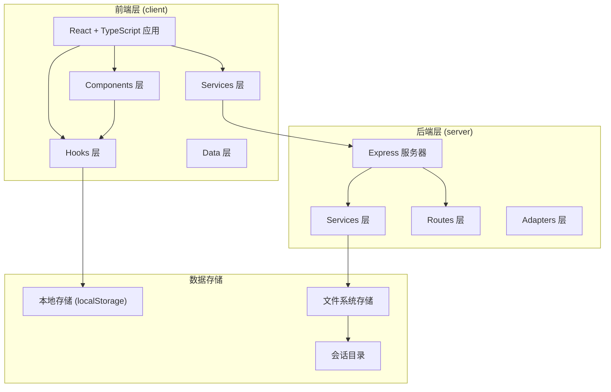
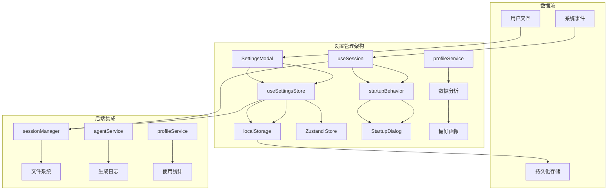
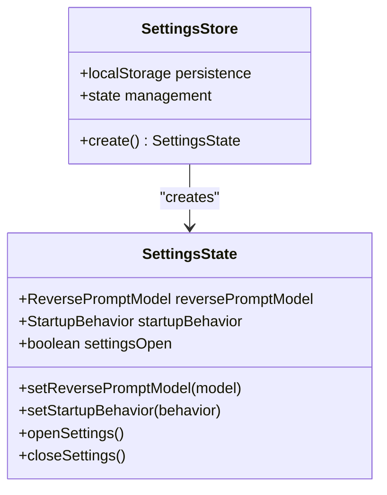
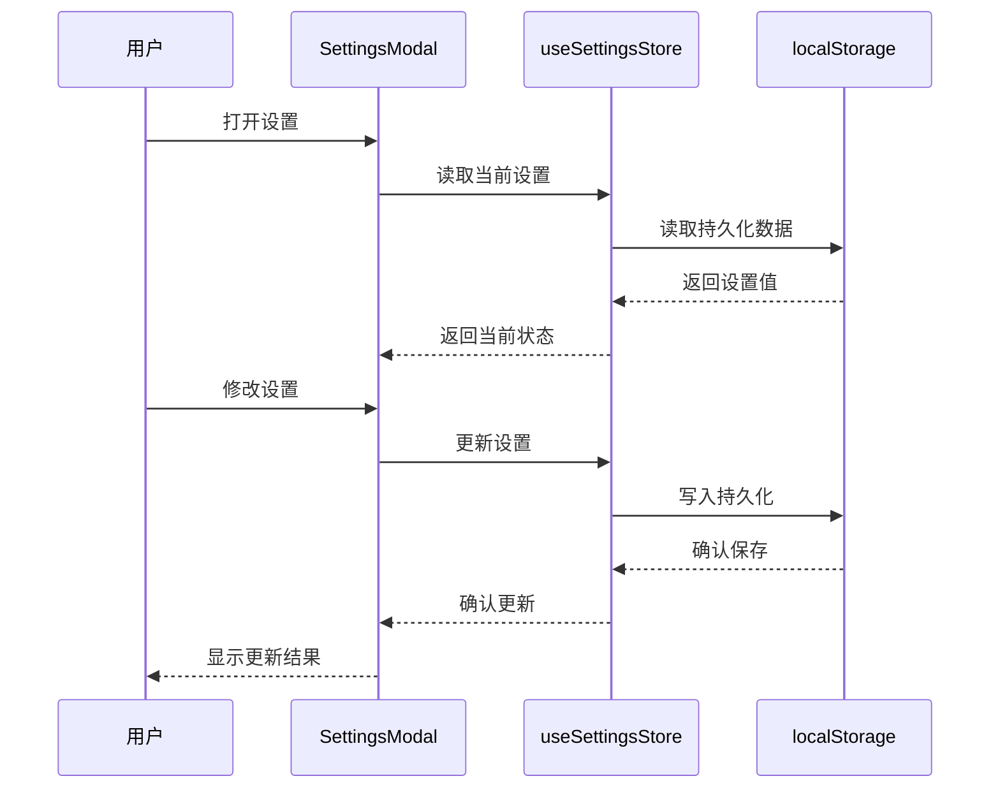
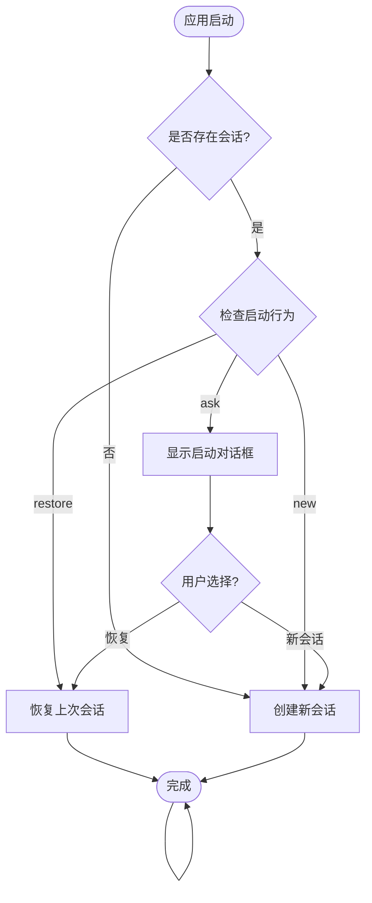
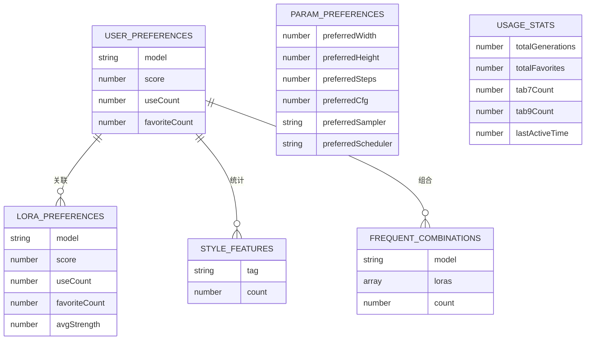
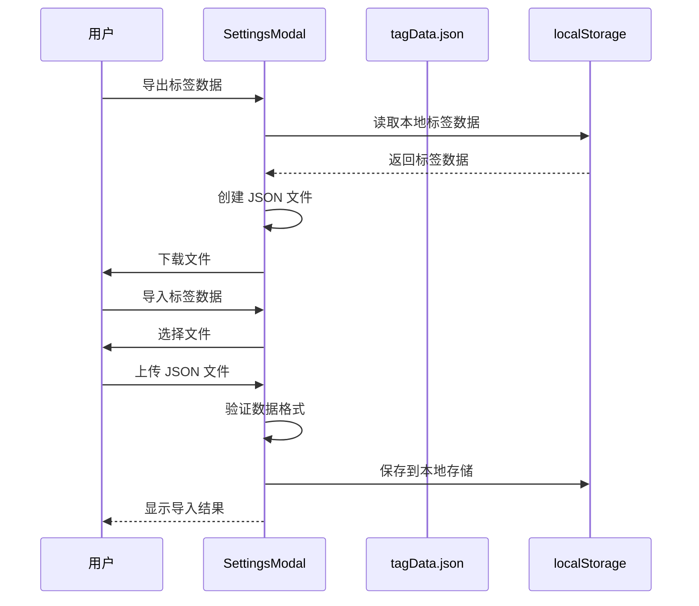
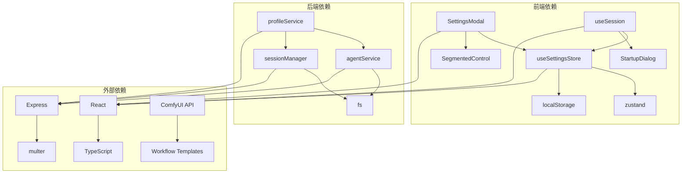

# 用户偏好配置服务

<cite>
**本文档引用的文件**
- [useSettingsStore.ts](file://client/src/hooks/useSettingsStore.ts)
- [SettingsModal.tsx](file://client/src/components/SettingsModal.tsx)
- [SegmentedControl.tsx](file://client/src/components/SegmentedControl.tsx)
- [useSession.ts](file://client/src/hooks/useSession.ts)
- [StartupDialog.tsx](file://client/src/components/StartupDialog.tsx)
- [profileService.ts](file://server/src/services/profileService.ts)
- [agentService.ts](file://server/src/services/agentService.ts)
- [sessionManager.ts](file://server/src/services/sessionManager.ts)
- [session.ts](file://server/src/routes/session.ts)
- [tagData.json](file://client/src/data/tagData.json)
- [settings-panel.md](file://docs/settings-panel.md)
- [2026-03-01-settings-panel.md](file://docs/plans/2026-03-01-settings-panel.md)
</cite>

## 目录
1. [简介](#简介)
2. [项目结构](#项目结构)
3. [核心组件](#核心组件)
4. [架构概览](#架构概览)
5. [详细组件分析](#详细组件分析)
6. [依赖关系分析](#依赖关系分析)
7. [性能考虑](#性能考虑)
8. [故障排除指南](#故障排除指南)
9. [结论](#结论)

## 简介

用户偏好配置服务是 CorineKit Pix2Real 项目中的一个关键功能模块，负责管理用户的个性化设置和偏好配置。该服务提供了直观的设置界面，允许用户自定义应用程序的行为、工作流程参数以及会话管理策略。

该项目是一个基于 Web 的本地图像处理工具，支持多种 AI 工作流程，包括二次元转真人、真人精修、图像放大等。用户偏好配置服务通过本地存储机制确保设置的持久化，同时提供智能的会话恢复功能。

## 项目结构

CorineKit Pix2Real 采用前后端分离的架构设计，主要分为以下层次：

**图表来源**
- [useSettingsStore.ts:1-31](file://client/src/hooks/useSettingsStore.ts#L1-L31)
- [SettingsModal.tsx:1-360](file://client/src/components/SettingsModal.tsx#L1-L360)
- [sessionManager.ts:1-164](file://server/src/services/sessionManager.ts#L1-L164)

**章节来源**
- [README.md:41-79](file://README.md#L41-L79)

## 核心组件

用户偏好配置服务的核心组件包括：

### 设置状态管理器
- **useSettingsStore**: 基于 Zustand 的全局状态管理，负责存储用户设置并提供持久化机制
- **SettingsModal**: 主设置界面，采用左右布局设计，包含多个设置类别
- **SegmentedControl**: 可复用的分段控制器组件

### 会话管理组件
- **useSession**: 会话生命周期管理，包含启动行为控制逻辑
- **StartupDialog**: 启动时对话框，处理用户选择

### 数据分析组件
- **profileService**: 用户偏好画像构建，分析使用模式和偏好
- **agentService**: 生成记录管理和收藏功能

**章节来源**
- [useSettingsStore.ts:1-31](file://client/src/hooks/useSettingsStore.ts#L1-L31)
- [SettingsModal.tsx:1-360](file://client/src/components/SettingsModal.tsx#L1-L360)
- [profileService.ts:1-238](file://server/src/services/profileService.ts#L1-L238)

## 架构概览

用户偏好配置服务采用模块化的架构设计，实现了清晰的关注点分离：

**图表来源**
- [useSettingsStore.ts:16-30](file://client/src/hooks/useSettingsStore.ts#L16-L30)
- [useSession.ts:134-222](file://client/src/hooks/useSession.ts#L134-L222)
- [profileService.ts:77-237](file://server/src/services/profileService.ts#L77-L237)

## 详细组件分析

### 设置状态管理器 (useSettingsStore)

设置状态管理器是整个用户偏好配置服务的核心，采用 Zustand 状态管理库实现：

**图表来源**
- [useSettingsStore.ts:6-14](file://client/src/hooks/useSettingsStore.ts#L6-L14)

#### 数据类型定义
- **ReversePromptModel**: 反推模型枚举，支持 Qwen3VL、Florence、WD-14、Grok
- **StartupBehavior**: 启动行为枚举，支持 restore、new、ask

#### 状态初始化
- 从 localStorage 读取现有设置，若不存在则使用默认值
- 支持实时更新和持久化存储

**章节来源**
- [useSettingsStore.ts:1-31](file://client/src/hooks/useSettingsStore.ts#L1-L31)

### 设置界面 (SettingsModal)

设置界面采用现代化的左右布局设计，提供三个主要设置类别：

**图表来源**
- [SettingsModal.tsx:25-360](file://client/src/components/SettingsModal.tsx#L25-L360)
- [useSettingsStore.ts:16-30](file://client/src/hooks/useSettingsStore.ts#L16-L30)

#### 设置类别
1. **工作流设置**: 反推模型选择
2. **会话设置**: 启动行为配置
3. **提示词管理**: 标签数据导入导出

#### 交互特性
- 左侧导航栏 + 右侧滚动内容区域
- IntersectionObserver 实时导航高亮
- 平滑滚动导航

**章节来源**
- [SettingsModal.tsx:19-360](file://client/src/components/SettingsModal.tsx#L19-L360)

### 会话启动行为管理

会话启动行为是用户偏好配置服务的重要组成部分，提供了三种启动策略：

**图表来源**
- [useSession.ts:134-222](file://client/src/hooks/useSession.ts#L134-L222)

#### 启动行为策略
1. **restore**: 自动恢复上次会话（默认行为）
2. **new**: 跳过恢复，直接创建新会话
3. **ask**: 弹出对话框让用户选择

#### 技术实现
- 使用 useRef 跟踪恢复状态
- 实现 isRestoring.current 标志防止并发保存
- 支持 beforeunload 事件的安全处理

**章节来源**
- [useSession.ts:134-222](file://client/src/hooks/useSession.ts#L134-L222)
- [settings-panel.md:86-104](file://docs/settings-panel.md#L86-L104)

### 用户偏好画像分析

后端服务提供了强大的用户偏好画像分析功能，通过分析历史使用数据生成个性化的推荐：

**图表来源**
- [profileService.ts:6-49](file://server/src/services/profileService.ts#L6-L49)

#### 分析维度
1. **模型偏好**: 基于使用频率和收藏数量计算评分
2. **LoRA 偏好**: 分析 LoRA 模型使用模式和强度
3. **参数偏好**: 通过众数统计常用参数配置
4. **风格特征**: 提取高频标签作为风格标识
5. **使用模式**: 统计活跃时间和工作流程使用情况
6. **组合模式**: 分析常用模型+LoRA 组合

**章节来源**
- [profileService.ts:77-237](file://server/src/services/profileService.ts#L77-L237)

### 标签数据管理系统

提示词管理功能提供了完整的标签数据导入导出机制：

**图表来源**
- [SettingsModal.tsx:264-351](file://client/src/components/SettingsModal.tsx#L264-L351)

#### 数据结构
标签数据采用层次化分类结构：
- **一级分类**: 人物、场景、风格、镜头
- **二级子分类**: 具体的标签类别
- **标签项**: 具体的标签值和显示文本

**章节来源**
- [tagData.json:1-174](file://client/src/data/tagData.json#L1-L174)

## 依赖关系分析

用户偏好配置服务的依赖关系呈现清晰的层次结构：

**图表来源**
- [useSettingsStore.ts:1](file://client/src/hooks/useSettingsStore.ts#L1)
- [SettingsModal.tsx:1](file://client/src/components/SettingsModal.tsx#L1)
- [profileService.ts:1](file://server/src/services/profileService.ts#L1)

### 关键依赖关系

1. **状态管理依赖**: 所有设置组件都依赖于 useSettingsStore
2. **UI 组件依赖**: SettingsModal 依赖 SegmentedControl 和其他 UI 组件
3. **会话管理依赖**: useSession 依赖设置存储和会话服务
4. **数据分析依赖**: profileService 依赖 agentService 和 sessionManager

**章节来源**
- [useSettingsStore.ts:1-31](file://client/src/hooks/useSettingsStore.ts#L1-L31)
- [profileService.ts:1-4](file://server/src/services/profileService.ts#L1-L4)

## 性能考虑

用户偏好配置服务在设计时充分考虑了性能优化：

### 前端性能优化
- **状态隔离**: 使用 Zustand 实现细粒度状态管理，避免不必要的重新渲染
- **懒加载**: 设置界面按需加载，减少初始包大小
- **缓存策略**: localStorage 持久化减少重复计算
- **防抖机制**: 自动保存采用防抖技术，避免频繁写入

### 后端性能优化
- **异步处理**: 所有文件操作采用异步非阻塞模式
- **错误隔离**: 单个会话的读写错误不影响整体系统运行
- **资源清理**: 及时清理临时文件和内存资源

### 存储优化
- **增量更新**: 仅保存必要的状态信息
- **压缩存储**: 大数据量采用压缩存储策略
- **清理机制**: 定期清理过期会话和无用数据

## 故障排除指南

### 常见问题及解决方案

#### 设置无法保存
**症状**: 修改设置后重启应用发现设置恢复默认值
**原因**: localStorage 访问权限问题或浏览器隐私设置
**解决方法**:
1. 检查浏览器是否禁用了 localStorage
2. 清除浏览器缓存和 Cookie
3. 尝试在隐身模式下测试

#### 会话恢复失败
**症状**: 应用启动时无法恢复上次会话
**原因**: 会话文件损坏或路径错误
**解决方法**:
1. 检查 sessions 目录是否存在
2. 验证 session.json 文件格式正确
3. 删除损坏的会话目录重新开始

#### 偏好画像分析异常
**症状**: 用户偏好统计不准确或显示错误
**原因**: 生成日志文件格式错误或缺失
**解决方法**:
1. 检查 generation-log.json 文件完整性
2. 验证 JSON 格式正确性
3. 重新生成日志文件

**章节来源**
- [sessionManager.ts:130-164](file://server/src/services/sessionManager.ts#L130-L164)
- [agentService.ts:44-64](file://server/src/services/agentService.ts#L44-L64)

## 结论

用户偏好配置服务为 CorineKit Pix2Real 项目提供了完善的个性化设置管理能力。通过精心设计的状态管理、直观的用户界面和强大的数据分析功能，该服务显著提升了用户体验和应用的智能化水平。

### 主要优势
1. **模块化设计**: 清晰的组件分离便于维护和扩展
2. **持久化存储**: 基于 localStorage 的可靠设置保存
3. **智能分析**: 后端提供深度的用户行为分析
4. **灵活配置**: 支持多种启动策略和个性化选项
5. **性能优化**: 采用多种技术手段确保响应速度

### 未来发展方向
1. **云端同步**: 支持多设备间设置同步
2. **高级分析**: 增强机器学习算法提供更精准的推荐
3. **可视化界面**: 添加图表和仪表板展示偏好分析结果
4. **批量管理**: 支持设置模板和批量导入导出

该服务的成功实施为整个 CorineKit Pix2Real 项目奠定了坚实的技术基础，为用户提供了一个既强大又易用的本地图像处理工具。