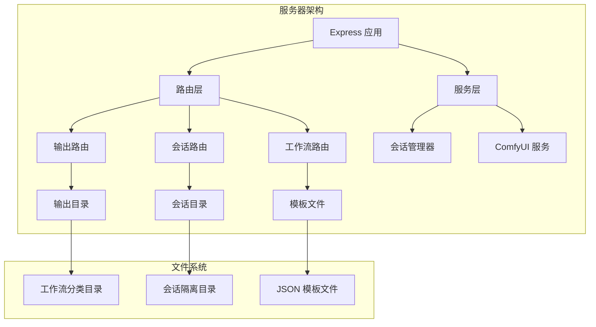
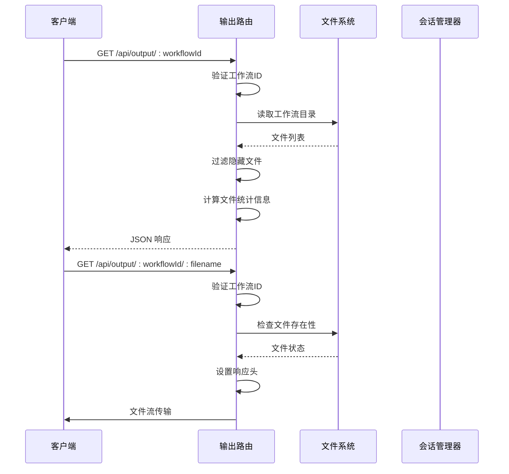
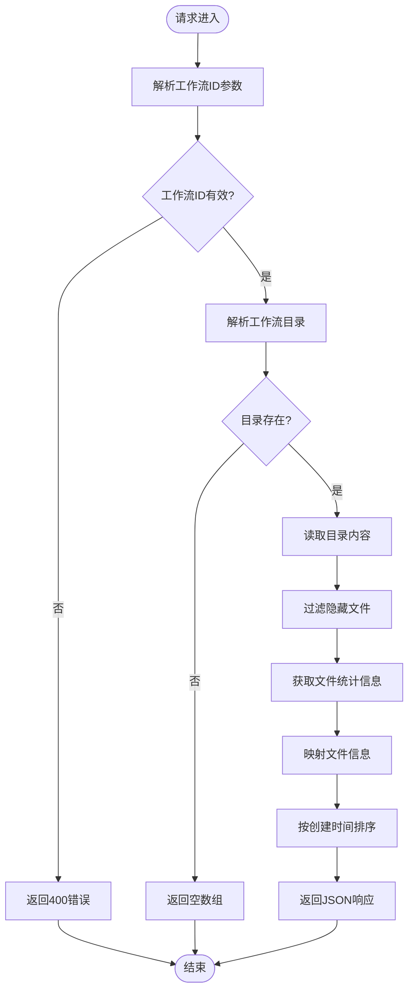
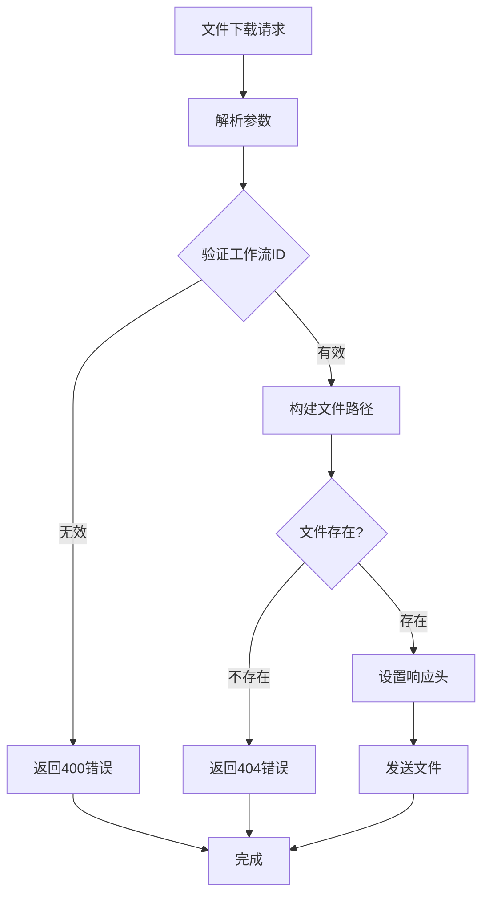
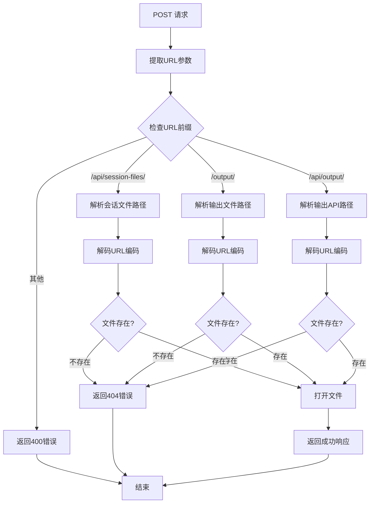
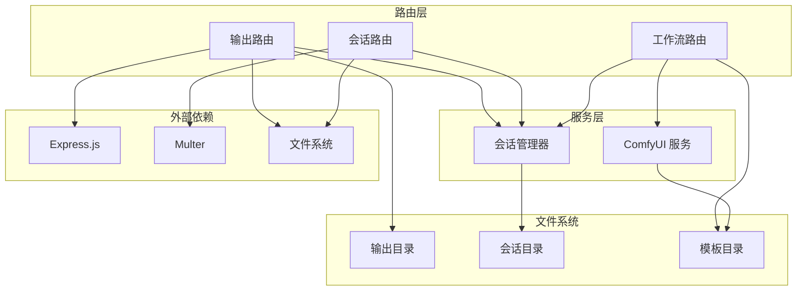
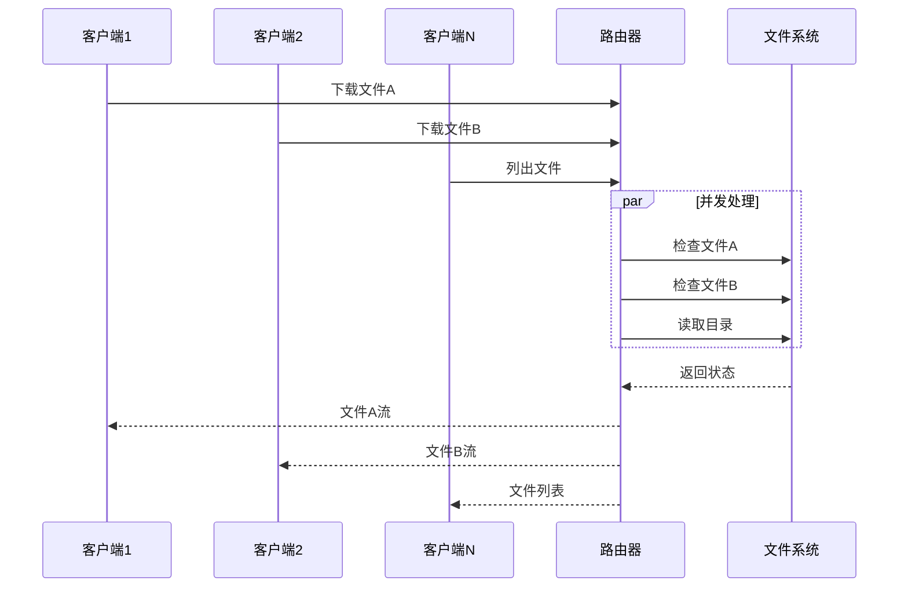
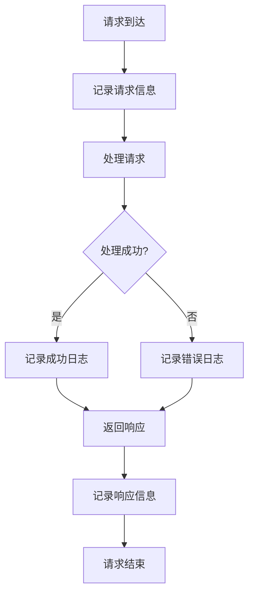

# 输出文件路由

<cite>
**本文档引用的文件**
- [server/src/routes/output.ts](file://server/src/routes/output.ts)
- [server/src/index.ts](file://server/src/index.ts)
- [server/src/services/sessionManager.ts](file://server/src/services/sessionManager.ts)
- [server/package.json](file://server/package.json)
- [README.md](file://README.md)
</cite>

## 目录
1. [简介](#简介)
2. [项目结构](#项目结构)
3. [核心组件](#核心组件)
4. [架构概览](#架构概览)
5. [详细组件分析](#详细组件分析)
6. [依赖关系分析](#依赖关系分析)
7. [性能考虑](#性能考虑)
8. [故障排除指南](#故障排除指南)
9. [结论](#结论)

## 简介

输出文件路由模块是 CorineKit Pix2Real 项目中负责管理生成文件访问的核心组件。该模块提供了完整的文件下载接口，支持按工作流分类的文件组织、安全的文件访问控制以及静态文件服务功能。本文档将深入分析输出文件路由的设计和实现，包括文件查找机制、安全验证、响应头设置等关键特性。

## 项目结构

输出文件路由模块位于服务器端的路由层，与会话管理服务紧密集成。项目采用模块化的架构设计，将不同功能职责分离到独立的模块中。

**图表来源**
- [server/src/index.ts:54-60](file://server/src/index.ts#L54-L60)
- [server/src/routes/output.ts:13-20](file://server/src/routes/output.ts#L13-L20)

**章节来源**
- [README.md:41-62](file://README.md#L41-L62)
- [server/src/index.ts:17-35](file://server/src/index.ts#L17-L35)

## 核心组件

输出文件路由模块包含三个主要的 HTTP 端点，每个都针对不同的使用场景：

### 主要端点

1. **GET /api/output/:workflowId** - 列出指定工作流的所有输出文件
2. **GET /api/output/:workflowId/:filename** - 提供单个文件的下载服务
3. **POST /api/output/open-file** - 使用操作系统默认应用打开文件

### 文件组织结构

系统采用按工作流分类的目录结构，确保不同类型的生成文件得到适当的隔离：

| 工作流 ID | 目录名称 | 文件类型 | 描述 |
|-----------|----------|----------|------|
| 0 | 0-二次元转真人 | 图像 | 二次元风格转换为真实感图像 |
| 1 | 1-真人精修 | 图像 | 真人图像的精细修饰 |
| 2 | 2-精修放大 | 图像 | 精修后的图像放大处理 |
| 3 | 3-快速生成视频 | 视频 | 快速生成的视频文件 |
| 4 | 4-视频放大 | 视频 | 视频分辨率提升 |
| 5 | 5-解除装备 | 图像 | 装备移除处理 |
| 6 | 6-真人转二次元 | 图像 | 真人向二次元风格转换 |
| 7 | 7-快速出图 | 图像 | 快速文本到图像生成 |
| 8 | 8-黑兽换脸 | 图像 | 特殊换脸处理 |
| 9 | 9-ZIT快出 | 图像 | 高级文本到图像生成 |

**章节来源**
- [server/src/routes/output.ts:13-20](file://server/src/routes/output.ts#L13-L20)
- [server/src/index.ts:18-29](file://server/src/index.ts#L18-L29)

## 架构概览

输出文件路由模块采用分层架构设计，通过明确的职责分离实现了高内聚低耦合的系统结构。

**图表来源**
- [server/src/routes/output.ts:22-53](file://server/src/routes/output.ts#L22-L53)
- [server/src/routes/output.ts:55-73](file://server/src/routes/output.ts#L55-L73)

## 详细组件分析

### 文件列表接口 (GET /api/output/:workflowId)

该接口负责返回指定工作流的所有输出文件信息，提供完整的文件元数据。

#### 处理流程

**图表来源**
- [server/src/routes/output.ts:22-53](file://server/src/routes/output.ts#L22-L53)

#### 返回的数据结构

接口返回的文件信息包含以下字段：
- `filename`: 文件名
- `size`: 文件大小（字节）
- `createdAt`: 创建时间（ISO格式）
- `url`: 文件下载URL

**章节来源**
- [server/src/routes/output.ts:22-53](file://server/src/routes/output.ts#L22-L53)

### 单文件下载接口 (GET /api/output/:workflowId/:filename)

该接口提供精确的文件下载服务，支持直接的文件传输。

#### 安全验证机制

**图表来源**
- [server/src/routes/output.ts:55-73](file://server/src/routes/output.ts#L55-L73)

#### 响应头设置

接口自动设置适当的响应头以优化文件传输：
- Content-Type: 根据文件扩展名自动确定
- Content-Length: 文件大小
- Cache-Control: no-cache
- Content-Disposition: inline（浏览器内显示）

**章节来源**
- [server/src/routes/output.ts:55-73](file://server/src/routes/output.ts#L55-L73)

### 文件打开功能 (POST /api/output/open-file)

该接口允许客户端触发操作系统默认应用打开指定文件。

#### 路径解析机制

**图表来源**
- [server/src/routes/output.ts:75-131](file://server/src/routes/output.ts#L75-L131)

**章节来源**
- [server/src/routes/output.ts:75-131](file://server/src/routes/output.ts#L75-L131)

### 静态文件服务配置

系统同时提供静态文件服务，支持直接访问输出目录和会话文件目录。

#### 配置详情

| 服务类型 | 路径前缀 | 目标目录 | 缓存策略 | 安全性 |
|----------|----------|----------|----------|--------|
| 输出文件 | /output | outputBase | 默认 | 无限制 |
| 会话文件 | /api/session-files | sessionsBase | 默认 | 无限制 |

#### MIME 类型处理

静态文件服务自动根据文件扩展名设置正确的 MIME 类型：
- 图像文件：image/* (PNG, JPG, GIF, WEBP)
- 视频文件：video/* (MP4, GIF)
- 文本文件：text/plain
- JSON 文件：application/json

**章节来源**
- [server/src/index.ts:58-60](file://server/src/index.ts#L58-L60)

## 依赖关系分析

输出文件路由模块与其他系统组件存在密切的依赖关系，形成了清晰的依赖层次结构。

**图表来源**
- [server/src/routes/output.ts:1-8](file://server/src/routes/output.ts#L1-L8)
- [server/src/index.ts:8-12](file://server/src/index.ts#L8-L12)

### 关键依赖关系

1. **会话管理器集成**：输出路由需要访问会话管理器提供的 sessionsBase 路径
2. **文件系统操作**：所有文件操作都依赖 Node.js 的 fs 模块
3. **Express 中间件**：利用 Express 的静态文件服务功能
4. **路径解析**：使用 path 模块进行跨平台的路径处理

**章节来源**
- [server/src/routes/output.ts:1-8](file://server/src/routes/output.ts#L1-L8)
- [server/src/index.ts:8-12](file://server/src/index.ts#L8-L12)

## 性能考虑

输出文件路由模块在设计时充分考虑了性能优化和资源管理。

### 文件操作优化

1. **异步文件操作**：所有文件系统操作都是异步的，避免阻塞主线程
2. **内存效率**：文件下载使用流式传输，不会将整个文件加载到内存中
3. **目录缓存**：工作流目录结构在启动时预创建，减少运行时的目录检查开销

### 并发处理

### 内存管理

- **流式传输**：使用 `res.sendFile()` 实现流式文件传输
- **垃圾回收**：及时释放文件句柄和缓冲区
- **连接池**：复用文件描述符，减少系统调用开销

## 故障排除指南

### 常见问题及解决方案

#### 1. 文件找不到错误 (404)

**症状**：访问 `/api/output/:workflowId/:filename` 返回 404 错误

**可能原因**：
- 文件已被删除或移动
- 工作流ID不正确
- 文件名包含特殊字符未正确编码

**解决方法**：
- 验证文件是否存在于对应的输出目录
- 检查工作流ID是否在允许范围内
- 确保文件名使用 `encodeURIComponent` 进行编码

#### 2. 权限错误

**症状**：无法读取或写入文件

**可能原因**：
- 目录权限不足
- 文件被其他进程占用

**解决方法**：
- 检查输出目录的读写权限
- 关闭可能占用文件的应用程序
- 重启服务器进程

#### 3. 路径解析错误

**症状**：POST /api/output/open-file 返回 400 错误

**可能原因**：
- URL 格式不正确
- 编码格式错误
- 路径超出允许范围

**解决方法**：
- 确保使用正确的 URL 前缀
- 检查 URL 编码是否正确
- 验证路径是否指向允许的目录

**章节来源**
- [server/src/routes/output.ts:67-70](file://server/src/routes/output.ts#L67-L70)
- [server/src/routes/output.ts:100-104](file://server/src/routes/output.ts#L100-L104)

### 日志监控

系统提供了详细的日志记录机制，便于问题诊断：

**章节来源**
- [server/src/routes/output.ts:105-107](file://server/src/routes/output.ts#L105-L107)

## 结论

输出文件路由模块通过精心设计的架构和实现，为 CorineKit Pix2Real 提供了可靠的文件管理服务。该模块具有以下特点：

1. **安全性**：通过严格的工作流ID验证和路径解析，防止目录遍历攻击
2. **可维护性**：清晰的模块化设计，便于功能扩展和代码维护
3. **性能**：采用异步文件操作和流式传输，确保高效的文件服务
4. **可靠性**：完善的错误处理和日志记录机制

该模块的成功实现为整个系统的文件管理奠定了坚实的基础，为用户提供了流畅的文件访问体验。