# 错误处理系统

<cite>
**本文档引用的文件**
- [README.md](file://README.md)
- [server/src/index.ts](file://server/src/index.ts)
- [server/src/services/comfyui.ts](file://server/src/services/comfyui.ts)
- [server/src/routes/workflow.ts](file://server/src/routes/workflow.ts)
- [server/src/services/sessionManager.ts](file://server/src/services/sessionManager.ts)
- [server/src/services/comfyuiLauncher.ts](file://server/src/services/comfyuiLauncher.ts)
- [client/src/hooks/useWebSocket.ts](file://client/src/hooks/useWebSocket.ts)
- [client/src/components/Toast.tsx](file://client/src/components/Toast.tsx)
- [client/src/hooks/useToast.ts](file://client/src/hooks/useToast.ts)
- [client/src/types/index.ts](file://client/src/types/index.ts)
</cite>

## 目录
1. [简介](#简介)
2. [项目结构](#项目结构)
3. [核心组件](#核心组件)
4. [架构概览](#架构概览)
5. [详细组件分析](#详细组件分析)
6. [依赖关系分析](#依赖关系分析)
7. [性能考虑](#性能考虑)
8. [故障排除指南](#故障排除指南)
9. [结论](#结论)

## 简介

CorineKit Pix2Real 是一个基于 Web 的本地图像/视频处理工具，通过 ComfyUI 实现批量图像和视频处理。该项目采用前后端分离架构，后端使用 Express + TypeScript，前端使用 React + TypeScript。错误处理系统贯穿整个应用，从底层的 ComfyUI 通信到前端的用户界面反馈，形成了完整的错误处理链路。

## 项目结构

项目采用模块化设计，主要分为三个部分：

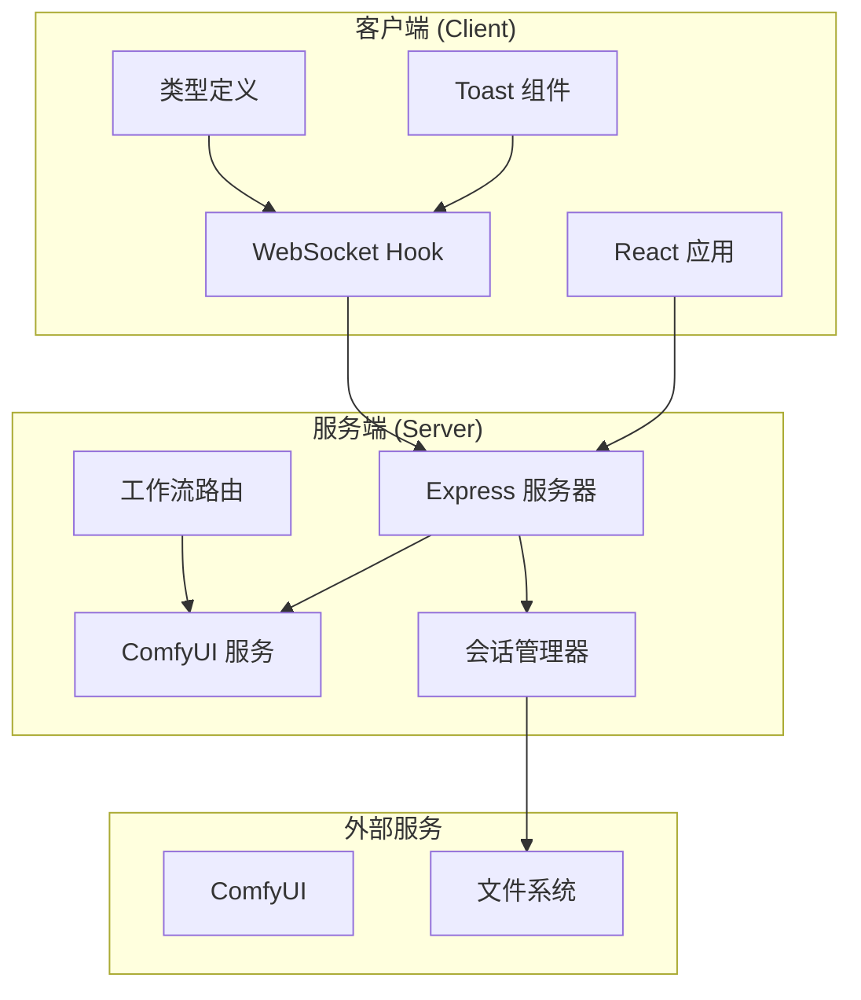

**图表来源**
- [server/src/index.ts:1-478](file://server/src/index.ts#L1-L478)
- [client/src/main.tsx:1-11](file://client/src/main.tsx#L1-L11)

**章节来源**
- [README.md:41-79](file://README.md#L41-L79)

## 核心组件

### 1. WebSocket 错误处理系统

WebSocket 是整个错误处理系统的核心，负责实时传输进度和错误信息。

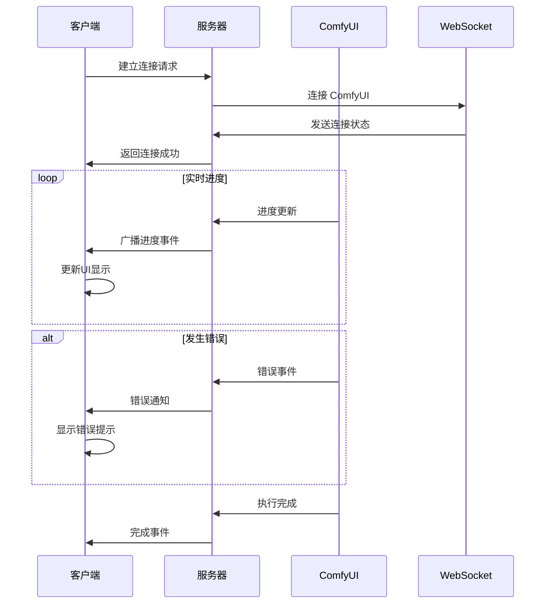

**图表来源**
- [server/src/index.ts:144-456](file://server/src/index.ts#L144-L456)
- [client/src/hooks/useWebSocket.ts:12-199](file://client/src/hooks/useWebSocket.ts#L12-L199)

### 2. 用户友好错误转换

服务端实现了将技术性错误转换为用户友好提示的功能：

| 技术错误类型 | 用户友好提示 | 触发条件 |
|------------|------------|----------|
| value_not_in_list + ckpt_name | 模型文件未找到，请检查 ComfyUI 模型是否已正确安装 | 检查点模型缺失 |
| value_not_in_list + lora_name | LoRA 文件未找到，请检查 LoRA 是否已正确安装 | LoRA 模型缺失 |
| value_not_in_list + unet_name | UNET 模型文件未找到，请检查模型是否已正确安装 | UNET 模型缺失 |
| value_not_in_list + vae_name | VAE 文件未找到，请检查 VAE 是否已正确安装 | VAE 模型缺失 |
| Queue prompt failed | 工作流提交失败，请检查 ComfyUI 是否正常运行 | 提交队列失败 |

**章节来源**
- [server/src/routes/workflow.ts:32-56](file://server/src/routes/workflow.ts#L32-L56)

### 3. 会话持久化错误处理

会话管理系统包含完整的错误处理机制，确保数据安全：

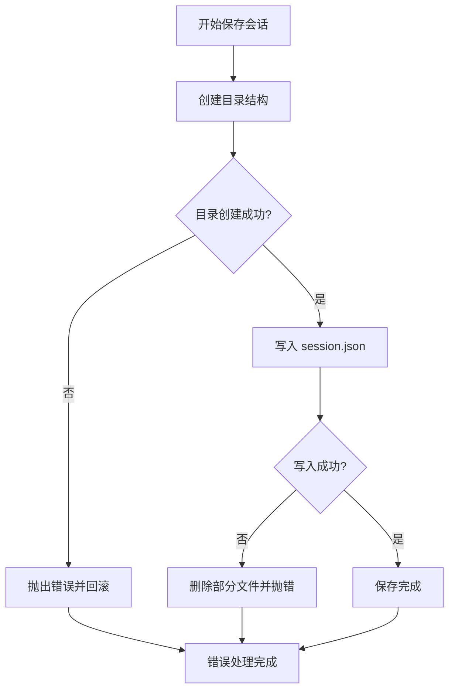

**图表来源**
- [server/src/services/sessionManager.ts:10-112](file://server/src/services/sessionManager.ts#L10-L112)

**章节来源**
- [server/src/services/sessionManager.ts:1-213](file://server/src/services/sessionManager.ts#L1-L213)

## 架构概览

错误处理系统采用分层架构，从底层到顶层的处理流程如下：

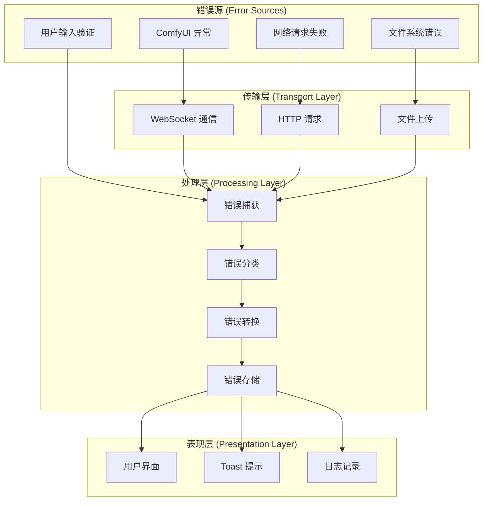

**图表来源**
- [server/src/index.ts:134-426](file://server/src/index.ts#L134-L426)
- [client/src/hooks/useWebSocket.ts:28-177](file://client/src/hooks/useWebSocket.ts#L28-L177)

## 详细组件分析

### 1. WebSocket 错误处理机制

#### 服务器端 WebSocket 处理

服务器端维护了完整的错误处理状态机：

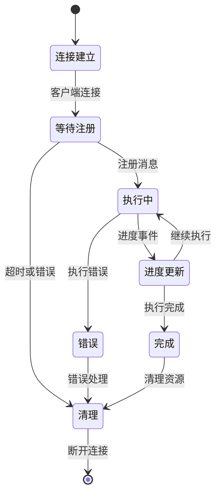

**图表来源**
- [server/src/index.ts:155-456](file://server/src/index.ts#L155-L456)

#### 客户端 WebSocket 处理

客户端实现了智能的连接管理和错误恢复：

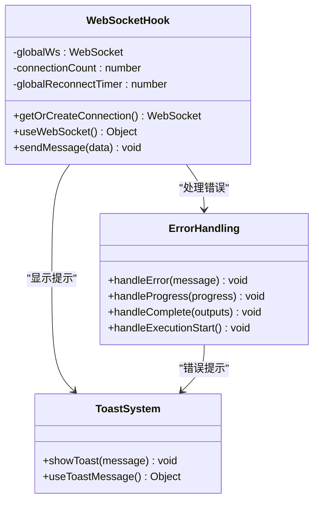

**图表来源**
- [client/src/hooks/useWebSocket.ts:12-225](file://client/src/hooks/useWebSocket.ts#L12-L225)
- [client/src/components/Toast.tsx:1-32](file://client/src/components/Toast.tsx#L1-L32)

**章节来源**
- [client/src/hooks/useWebSocket.ts:1-225](file://client/src/hooks/useWebSocket.ts#L1-L225)

### 2. ComfyUI 集成错误处理

#### 服务发现和健康检查

ComfyUI 服务的自动启动和健康检查机制：

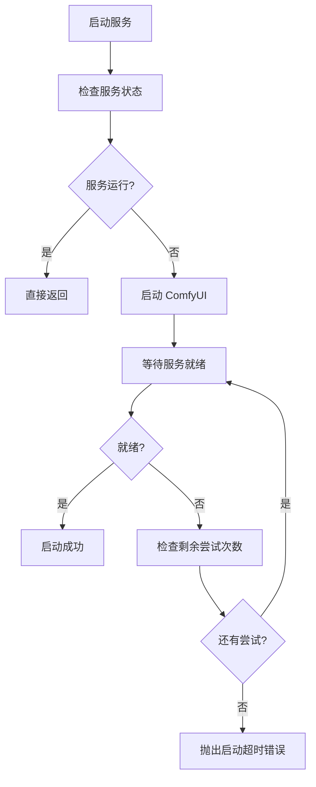

**图表来源**
- [server/src/services/comfyuiLauncher.ts:101-131](file://server/src/services/comfyuiLauncher.ts#L101-L131)

#### HTTP 请求错误处理

ComfyUI 服务的 HTTP 请求错误处理策略：

| 错误类型 | 处理方式 | 返回状态码 |
|---------|---------|-----------|
| 网络连接失败 | 重试机制 | 502 |
| 请求超时 | 降级处理 | 504 |
| 服务器内部错误 | 详细错误信息 | 500 |
| 资源不可用 | 用户友好提示 | 503 |

**章节来源**
- [server/src/services/comfyui.ts:168-237](file://server/src/services/comfyui.ts#L168-L237)

### 3. 工作流执行错误处理

#### 工作流路由错误处理

每个工作流都有独立的错误处理逻辑：

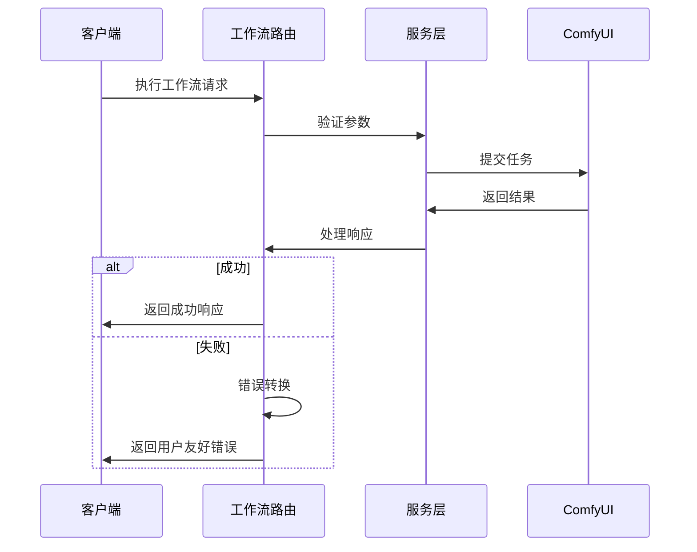

**图表来源**
- [server/src/routes/workflow.ts:70-121](file://server/src/routes/workflow.ts#L70-L121)

**章节来源**
- [server/src/routes/workflow.ts:1-800](file://server/src/routes/workflow.ts#L1-L800)

### 4. 前端错误显示系统

#### Toast 通知系统

Toast 系统提供了统一的错误和状态提示：

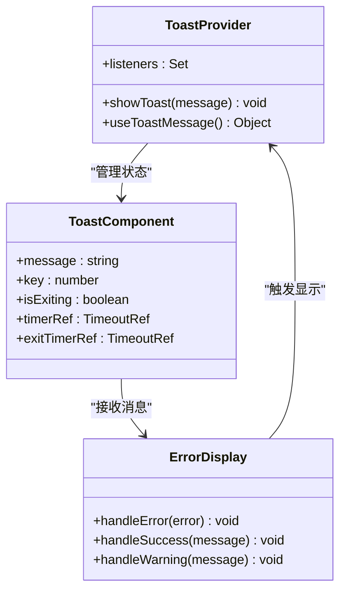

**图表来源**
- [client/src/hooks/useToast.ts:1-33](file://client/src/hooks/useToast.ts#L1-L33)
- [client/src/components/Toast.tsx:1-32](file://client/src/components/Toast.tsx#L1-L32)

**章节来源**
- [client/src/hooks/useToast.ts:1-33](file://client/src/hooks/useToast.ts#L1-L33)

## 依赖关系分析

### 错误处理依赖图

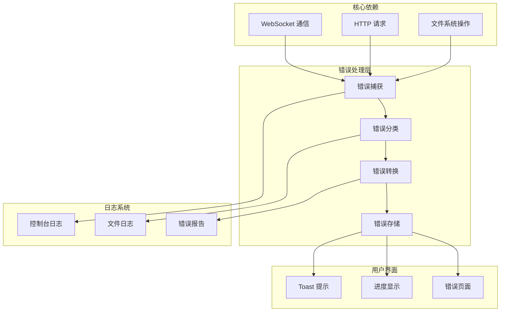

**图表来源**
- [server/src/index.ts:134-426](file://server/src/index.ts#L134-L426)
- [client/src/hooks/useWebSocket.ts:28-177](file://client/src/hooks/useWebSocket.ts#L28-L177)

### 错误传播路径

错误在系统中的传播遵循以下路径：

1. **底层错误** (ComfyUI/文件系统/网络)
2. **服务层捕获** (Express 路由/服务函数)
3. **错误转换** (用户友好提示)
4. **前端显示** (WebSocket 事件/Toast 提示)
5. **日志记录** (控制台/文件)

**章节来源**
- [server/src/services/comfyui.ts:285-344](file://server/src/services/comfyui.ts#L285-L344)

## 性能考虑

### 错误处理性能优化

1. **异步错误处理**: 所有错误处理都是异步的，不会阻塞主线程
2. **错误缓存**: WebSocket 连接复用，减少重复连接开销
3. **渐进式错误**: 错误信息逐步传递，避免一次性大量数据传输
4. **资源清理**: 及时清理错误状态和临时资源

### 内存管理

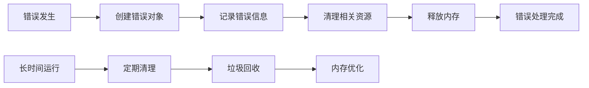

## 故障排除指南

### 常见错误诊断

#### WebSocket 连接问题

| 症状 | 可能原因 | 解决方案 |
|------|---------|---------|
| 连接超时 | 网络不稳定 | 检查网络连接，重试连接 |
| 连接断开 | 服务器重启 | 等待自动重连或手动刷新 |
| 消息丢失 | 缓冲区溢出 | 检查缓冲区配置，增加容量 |
| 进度停滞 | 任务卡死 | 查看 ComfyUI 日志，重启任务 |

#### ComfyUI 集成问题

| 症状 | 可能原因 | 解决方案 |
|------|---------|---------|
| 服务不可用 | ComfyUI 未启动 | 启动 ComfyUI 或检查路径配置 |
| 模型加载失败 | 模型文件缺失 | 检查模型文件完整性 |
| 内存不足 | VRAM 不足 | 释放内存或降低分辨率 |
| 进度异常 | 节点配置错误 | 检查工作流模板 |

#### 前端显示问题

| 症状 | 可能原因 | 解决方案 |
|------|---------|---------|
| 错误不显示 | Toast 系统故障 | 刷新页面，检查 JavaScript 错误 |
| 进度条异常 | WebSocket 数据错误 | 检查服务器日志，重新连接 |
| 状态不同步 | 组件状态管理问题 | 重置应用状态 |
| UI 卡死 | 内存泄漏 | 清理浏览器缓存，重启应用 |

### 调试技巧

1. **启用详细日志**: 在开发环境中启用详细的错误日志
2. **检查网络请求**: 使用浏览器开发者工具查看网络请求
3. **监控 WebSocket**: 监控 WebSocket 连接状态和消息
4. **验证配置**: 检查所有配置文件的正确性
5. **测试边界条件**: 测试各种错误场景和边界条件

**章节来源**
- [server/src/services/comfyuiLauncher.ts:101-131](file://server/src/services/comfyuiLauncher.ts#L101-L131)

## 结论

CorineKit Pix2Real 的错误处理系统展现了现代 Web 应用的优秀实践，具有以下特点：

1. **多层次防护**: 从底层到顶层的完整错误处理链路
2. **用户友好**: 将技术性错误转换为易懂的用户提示
3. **实时反馈**: 通过 WebSocket 提供实时的进度和错误信息
4. **优雅降级**: 在各种错误情况下都能提供合理的用户体验
5. **可维护性**: 模块化的错误处理设计便于维护和扩展

该系统为类似的大规模图像处理应用提供了优秀的错误处理参考，特别是在实时通信和复杂工作流处理方面具有重要的借鉴意义。