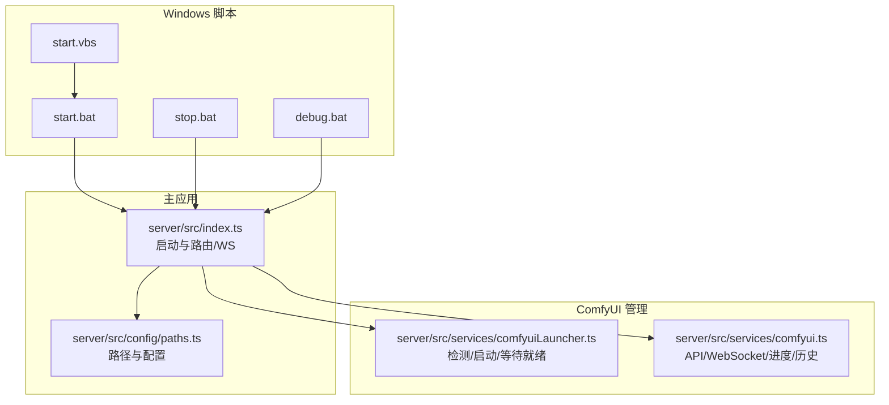
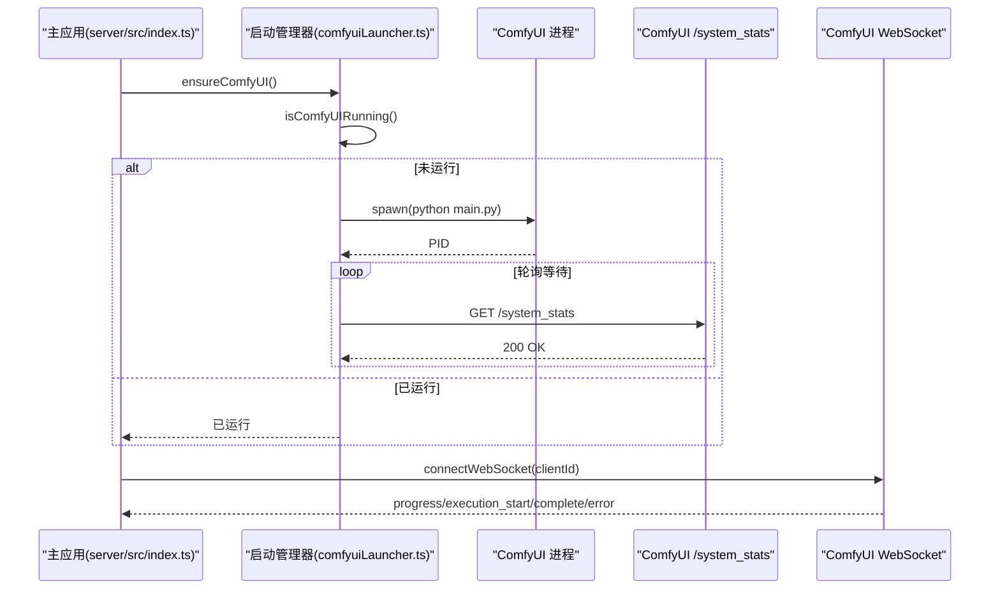
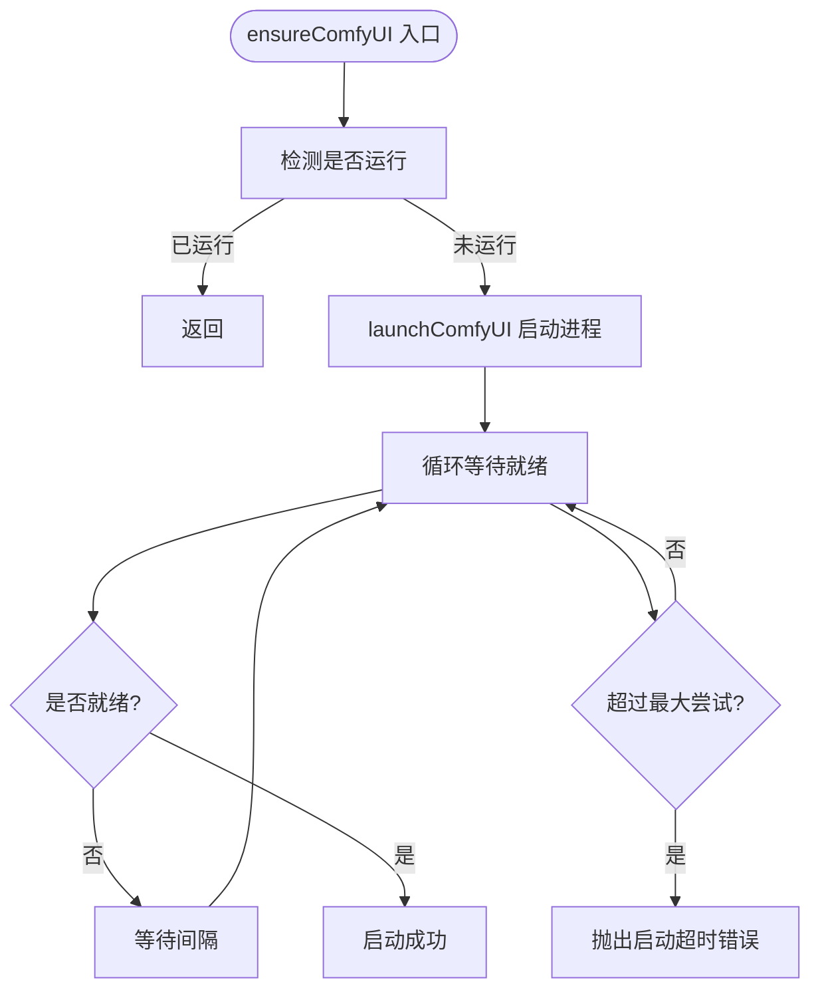
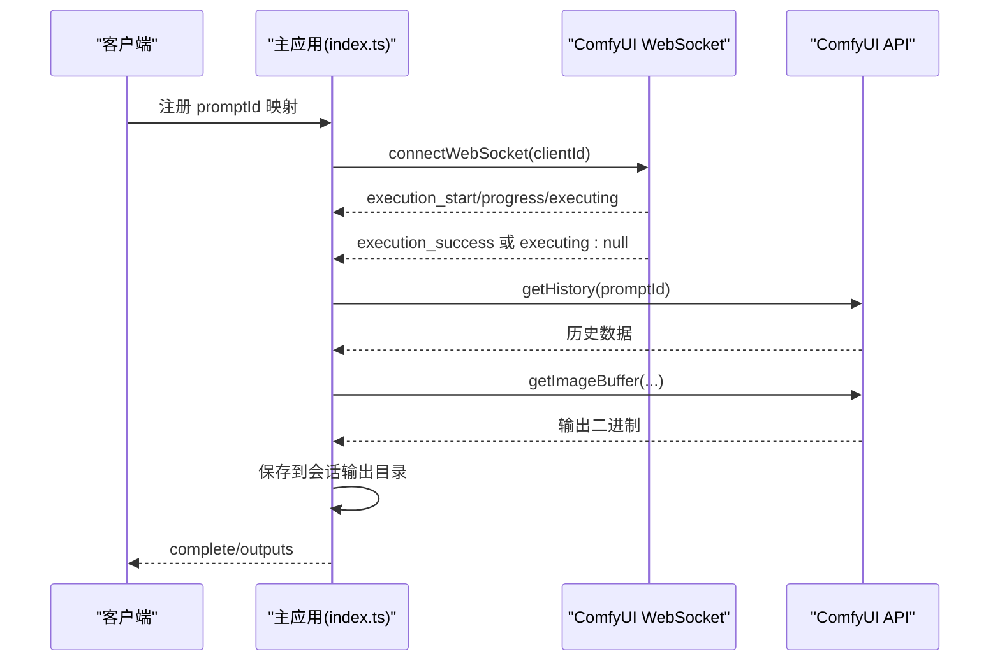
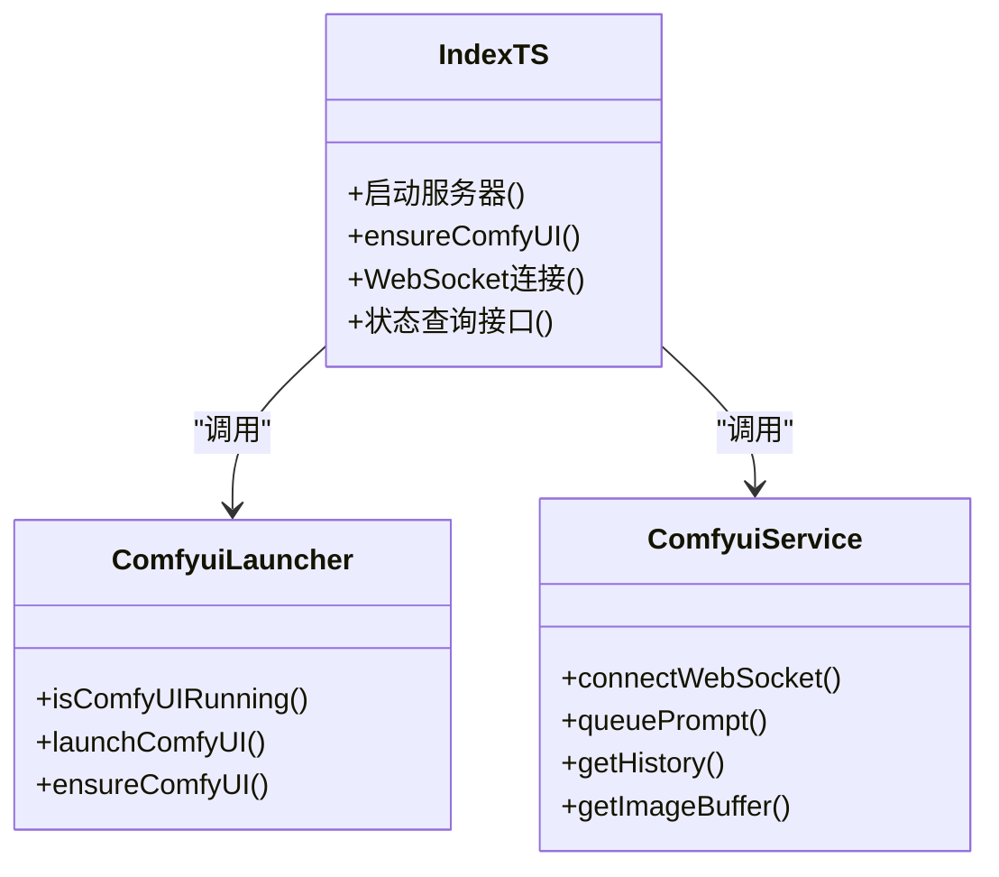
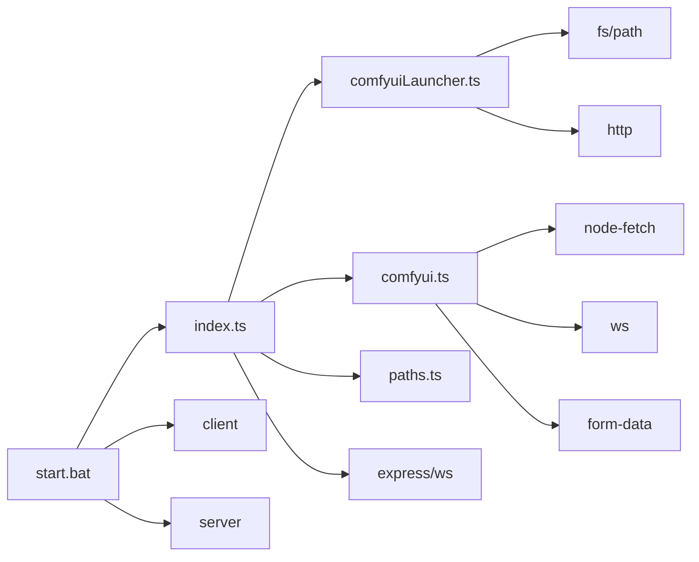

# ComfyUI 启动管理

<cite>
**本文引用的文件**
- [server/src/services/comfyuiLauncher.ts](file://server/src/services/comfyuiLauncher.ts)
- [server/src/services/comfyui.ts](file://server/src/services/comfyui.ts)
- [server/src/index.ts](file://server/src/index.ts)
- [server/src/config/paths.ts](file://server/src/config/paths.ts)
- [start.bat](file://start.bat)
- [start.vbs](file://start.vbs)
- [stop.bat](file://stop.bat)
- [debug.bat](file://debug.bat)
- [package.json](file://package.json)
- [server/package.json](file://server/package.json)
</cite>

## 目录
1. [简介](#简介)
2. [项目结构](#项目结构)
3. [核心组件](#核心组件)
4. [架构总览](#架构总览)
5. [组件详解](#组件详解)
6. [依赖关系分析](#依赖关系分析)
7. [性能考量](#性能考量)
8. [故障排除指南](#故障排除指南)
9. [结论](#结论)
10. [附录](#附录)

## 简介
本技术文档聚焦于 ComfyUI 启动管理器的设计与实现，涵盖自动启动、状态检测、生命周期管理、启动参数与环境变量、依赖检查、进程监控与健康检查、自动重启策略、跨平台与 Windows 启动脚本、与主应用的集成与状态同步、启动日志与性能监控、以及安全与权限策略。目标是帮助开发者与运维人员理解并高效维护 ComfyUI 服务的稳定运行。

## 项目结构
围绕 ComfyUI 启动管理的关键文件与职责如下：
- 启动管理器：负责 ComfyUI 进程的检测、启动、等待就绪与超时处理
- ComfyUI 服务适配层：封装 ComfyUI API 与 WebSocket 事件，提供进度与输出下载能力
- 主应用入口：在服务启动时自动确保 ComfyUI 正常运行，并建立 WebSocket 进度同步
- 路径与配置：集中管理 sessions/output/model_meta 等目录，支持运行时覆盖
- Windows 启动脚本：提供一键启动/停止/调试脚本，便于本地开发与测试

**图表来源**
- [server/src/index.ts:1-516](file://server/src/index.ts#L1-L516)
- [server/src/services/comfyuiLauncher.ts:1-131](file://server/src/services/comfyuiLauncher.ts#L1-L131)
- [server/src/services/comfyui.ts:1-472](file://server/src/services/comfyui.ts#L1-L472)
- [server/src/config/paths.ts:1-156](file://server/src/config/paths.ts#L1-L156)
- [start.bat:1-57](file://start.bat#L1-L57)
- [start.vbs:1-5](file://start.vbs#L1-L5)
- [stop.bat:1-46](file://stop.bat#L1-L46)
- [debug.bat:1-57](file://debug.bat#L1-L57)

**章节来源**
- [server/src/index.ts:1-516](file://server/src/index.ts#L1-L516)
- [server/src/services/comfyuiLauncher.ts:1-131](file://server/src/services/comfyuiLauncher.ts#L1-L131)
- [server/src/services/comfyui.ts:1-472](file://server/src/services/comfyui.ts#L1-L472)
- [server/src/config/paths.ts:1-156](file://server/src/config/paths.ts#L1-L156)
- [start.bat:1-57](file://start.bat#L1-L57)
- [start.vbs:1-5](file://start.vbs#L1-L5)
- [stop.bat:1-46](file://stop.bat#L1-L46)
- [debug.bat:1-57](file://debug.bat#L1-L57)

## 核心组件
- 启动管理器（comfyuiLauncher）
  - 功能：检测 ComfyUI 是否运行、根据环境变量选择安装路径、启动 ComfyUI 进程、轮询等待服务就绪、超时处理
  - 关键点：使用 HTTP 请求 /system_stats 判断健康；spawn 启动并 detached 与 windowsHide；轮询间隔与最大尝试次数可配置
- ComfyUI 服务适配层（comfyui）
  - 功能：上传图像/视频、入队工作流、获取历史、拉取输出、WebSocket 进度事件解析、系统资源统计、队列优先级调整
  - 关键点：进度权重模型、阶段化名称映射、执行完成的“双信号”容错（executing:null 与 execution_success）、输出下载与会话目录集成
- 主应用入口（index.ts）
  - 功能：启动 Express 与 WebSocket 服务，自动确保 ComfyUI 运行，转发进度事件，完成时下载输出并持久化到会话目录
  - 关键点：/api/comfyui/status 接口；客户端注册 prompt->workflow 映射；事件缓冲与重放
- 路径与配置（paths.ts）
  - 功能：集中管理 sessions/output/model_meta 等目录，支持运行时覆盖（config.json），提供校验与写权限探测
- Windows 启动脚本
  - 功能：一键启动/停止/调试，端口占用检测与释放，隐藏窗口启动子进程

**章节来源**
- [server/src/services/comfyuiLauncher.ts:1-131](file://server/src/services/comfyuiLauncher.ts#L1-L131)
- [server/src/services/comfyui.ts:1-472](file://server/src/services/comfyui.ts#L1-L472)
- [server/src/index.ts:148-516](file://server/src/index.ts#L148-L516)
- [server/src/config/paths.ts:1-156](file://server/src/config/paths.ts#L1-L156)
- [start.bat:1-57](file://start.bat#L1-L57)
- [stop.bat:1-46](file://stop.bat#L1-L46)
- [debug.bat:1-57](file://debug.bat#L1-L57)

## 架构总览
ComfyUI 启动管理采用“主应用驱动 + 启动器守护 + 服务适配”的分层设计。主应用在启动时调用 ensureComfyUI，若未运行则自动启动并轮询等待；随后通过 WebSocket 与 ComfyUI 事件交互，完成进度与输出的闭环。

**图表来源**
- [server/src/index.ts:500-516](file://server/src/index.ts#L500-L516)
- [server/src/services/comfyuiLauncher.ts:24-130](file://server/src/services/comfyuiLauncher.ts#L24-L130)
- [server/src/services/comfyui.ts:265-375](file://server/src/services/comfyui.ts#L265-L375)

## 组件详解

### 启动管理器（comfyuiLauncher）
- 环境变量与默认路径
  - 默认安装路径与可被环境变量覆盖，便于不同机器与部署场景
- 健康检查
  - 通过 HTTP 请求 /system_stats 判断服务可用性，设置超时时间
- 启动流程
  - 校验 Python 可执行文件与 main.py 存在性
  - 使用 spawn 启动，设置工作目录、分离进程、隐藏控制台窗口、忽略标准输入输出
  - 进程 unref，使其独立于父进程生命周期
- 等待与超时
  - 循环等待服务就绪，结合最大尝试次数与间隔时间，避免无限等待
- 错误处理
  - 文件不存在抛出明确错误；HTTP 超时/异常均视为未运行

**图表来源**
- [server/src/services/comfyuiLauncher.ts:101-130](file://server/src/services/comfyuiLauncher.ts#L101-L130)

**章节来源**
- [server/src/services/comfyuiLauncher.ts:1-131](file://server/src/services/comfyuiLauncher.ts#L1-L131)

### ComfyUI 服务适配层（comfyui）
- API 封装
  - 上传图像/视频、入队工作流、获取历史、拉取输出、删除队列项、系统资源统计、队列查询与优先级调整
- WebSocket 进度与事件
  - 连接 /ws?clientId=，解析 progress/executing/execution_success/execution_error 等事件
  - 对 executing:null 与 execution_success 的顺序进行容错，避免“卡住空输出”
  - 事件去重与完成回调保护，防止重复触发
- 进度计算
  - 基于节点类型与权重（含采样步数、Tiled 估算）的阶段化进度，支持多轮节点计数
- 输出下载与会话集成
  - 完成后从 ComfyUI 拉取输出并保存至会话输出目录，支持图像与视频类型

**图表来源**
- [server/src/services/comfyui.ts:265-375](file://server/src/services/comfyui.ts#L265-L375)
- [server/src/services/comfyui.ts:198-263](file://server/src/services/comfyui.ts#L198-L263)
- [server/src/index.ts:335-448](file://server/src/index.ts#L335-L448)

**章节来源**
- [server/src/services/comfyui.ts:1-472](file://server/src/services/comfyui.ts#L1-L472)
- [server/src/index.ts:148-516](file://server/src/index.ts#L148-L516)

### 主应用集成与状态同步
- 自动启动
  - 服务启动时调用 ensureComfyUI，若失败记录错误但不影响主应用继续运行
- 状态查询接口
  - /api/comfyui/status 返回 running 状态
- WebSocket 事件桥接
  - 将 ComfyUI 的进度与完成事件转换为前端友好的格式，支持事件缓冲与重放
- 输出落盘
  - 完成后将输出下载并保存到会话输出目录，便于前端访问

**图表来源**
- [server/src/index.ts:148-516](file://server/src/index.ts#L148-L516)
- [server/src/services/comfyuiLauncher.ts:1-131](file://server/src/services/comfyuiLauncher.ts#L1-L131)
- [server/src/services/comfyui.ts:1-472](file://server/src/services/comfyui.ts#L1-L472)

**章节来源**
- [server/src/index.ts:148-516](file://server/src/index.ts#L148-L516)

### 路径与配置（paths.ts）
- 集中式路径管理
  - sessions/output/model_meta 等目录统一管理，支持运行时覆盖（通过 config.json）
- 运行时切换
  - setSessionsBase 支持绝对路径覆盖与清除；validateSessionsBase 校验路径合法性与写权限
- Electron 场景
  - 通过环境变量覆盖数据根目录，便于打包后写入用户数据目录

**章节来源**
- [server/src/config/paths.ts:1-156](file://server/src/config/paths.ts#L1-L156)

### Windows 启动脚本
- start.bat
  - 检测端口占用并释放，隐藏窗口启动服务与客户端，最后打开浏览器
- start.vbs
  - 通过 WScript 启动 start.bat，便于双击运行
- stop.bat
  - 检测并终止 3000/5173/8188 端口对应的进程，便于一键停止
- debug.bat
  - 类似 start.bat，但使用 cmd 窗口保持输出，便于调试

**章节来源**
- [start.bat:1-57](file://start.bat#L1-L57)
- [start.vbs:1-5](file://start.vbs#L1-L5)
- [stop.bat:1-46](file://stop.bat#L1-L46)
- [debug.bat:1-57](file://debug.bat#L1-L57)

## 依赖关系分析
- 启动管理器依赖
  - child_process.spawn 用于启动 ComfyUI
  - http 用于健康检查
  - fs/path 用于路径验证
- 服务适配层依赖
  - node-fetch/ws/form-data 用于 API/WebSocket/上传
  - 与主应用共享的类型定义
- 主应用依赖
  - express/ws 提供 HTTP 与 WebSocket 服务
  - 依赖启动管理器与服务适配层
- 脚本依赖
  - Windows 命令行工具 netstat/taskkill/powershell/cmd
  - npm 脚本与 concurrently 并发启动前后端

**图表来源**
- [server/src/index.ts:1-516](file://server/src/index.ts#L1-L516)
- [server/src/services/comfyuiLauncher.ts:1-131](file://server/src/services/comfyuiLauncher.ts#L1-L131)
- [server/src/services/comfyui.ts:1-472](file://server/src/services/comfyui.ts#L1-L472)
- [server/src/config/paths.ts:1-156](file://server/src/config/paths.ts#L1-L156)
- [start.bat:1-57](file://start.bat#L1-L57)
- [package.json:1-15](file://package.json#L1-L15)
- [server/package.json:1-28](file://server/package.json#L1-L28)

**章节来源**
- [server/src/index.ts:1-516](file://server/src/index.ts#L1-L516)
- [server/src/services/comfyuiLauncher.ts:1-131](file://server/src/services/comfyuiLauncher.ts#L1-L131)
- [server/src/services/comfyui.ts:1-472](file://server/src/services/comfyui.ts#L1-L472)
- [server/src/config/paths.ts:1-156](file://server/src/config/paths.ts#L1-L156)
- [start.bat:1-57](file://start.bat#L1-L57)
- [package.json:1-15](file://package.json#L1-L15)
- [server/package.json:1-28](file://server/package.json#L1-L28)

## 性能考量
- 启动等待策略
  - 合理的轮询间隔与最大尝试次数平衡了启动速度与稳定性
- 进度计算
  - 基于节点权重与采样步数的阶段化进度，减少前端复杂度
- 输出下载
  - 完成后再下载，避免阻塞主流程；对慢盘场景增加历史提交重试
- 资源统计
  - 通过 /system_stats 获取 VRAM/内存使用，辅助性能监控与容量规划

[本节为通用性能建议，不直接分析具体文件]

## 故障排除指南
- 启动失败
  - 检查 Python 可执行文件与 main.py 是否存在
  - 查看启动日志中的 PID 与路径信息
  - 确认端口 8188 未被占用
- 健康检查失败
  - 确认 /system_stats 可访问，检查网络与防火墙
  - 观察轮询日志，确认超时阈值是否合理
- WebSocket 事件缺失
  - 确认客户端已注册 promptId 映射
  - 检查 executing:null 与 execution_success 的先后顺序
- 输出为空
  - 等待历史提交完成（内置重试），或检查 ComfyUI 输出目录
- 端口占用
  - 使用 stop.bat 释放 3000/5173/8188 端口
- 调试模式
  - 使用 debug.bat 保持命令行窗口，便于观察输出

**章节来源**
- [server/src/services/comfyuiLauncher.ts:64-87](file://server/src/services/comfyuiLauncher.ts#L64-L87)
- [server/src/services/comfyui.ts:350-375](file://server/src/services/comfyui.ts#L350-L375)
- [server/src/index.ts:335-448](file://server/src/index.ts#L335-L448)
- [stop.bat:1-46](file://stop.bat#L1-L46)
- [debug.bat:1-57](file://debug.bat#L1-L57)

## 结论
本启动管理器通过“自动检测—自动启动—轮询就绪—健康检查—事件同步”的闭环机制，实现了 ComfyUI 的稳定运行与与主应用的无缝集成。配合 Windows 启动脚本与路径配置能力，满足本地开发与生产部署的多样化需求。建议在生产环境中结合日志与资源监控，持续优化启动参数与等待策略，确保高可用与高性能。

## 附录
- 环境变量
  - COMFYUI_PATH：覆盖 ComfyUI 安装路径
  - CORINE_DATA_ROOT：Electron 打包场景下覆盖数据根目录
- 端口约定
  - 3000：主应用 HTTP
  - 5173：前端开发服务器
  - 8188：ComfyUI 服务
- 脚本用途
  - start.bat/start.vbs：一键启动前后端与浏览器
  - stop.bat：一键停止所有服务
  - debug.bat：调试模式启动，保留命令行窗口

**章节来源**
- [server/src/services/comfyuiLauncher.ts:16-18](file://server/src/services/comfyuiLauncher.ts#L16-L18)
- [server/src/config/paths.ts:15-20](file://server/src/config/paths.ts#L15-L20)
- [start.bat:1-57](file://start.bat#L1-L57)
- [start.vbs:1-5](file://start.vbs#L1-L5)
- [stop.bat:1-46](file://stop.bat#L1-L46)
- [debug.bat:1-57](file://debug.bat#L1-L57)