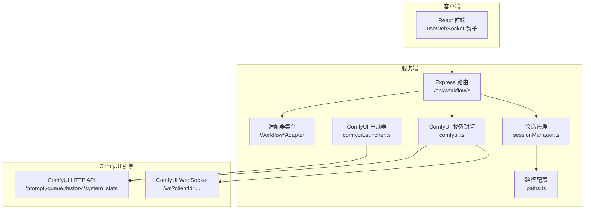
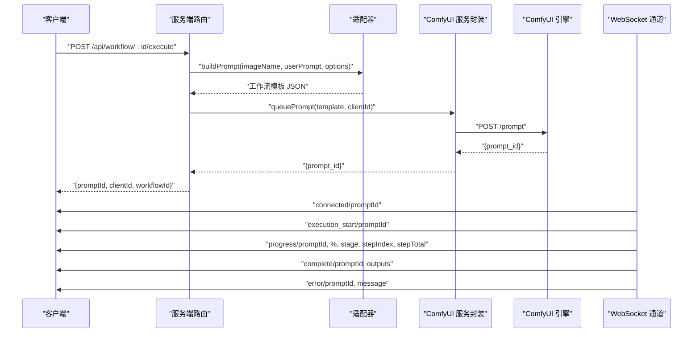
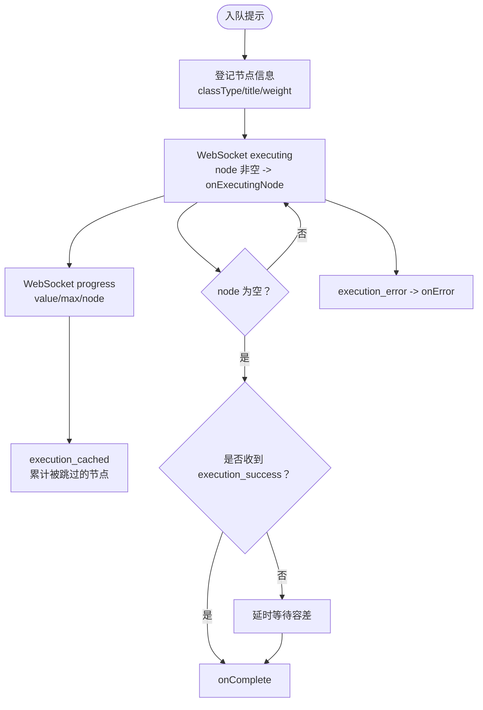
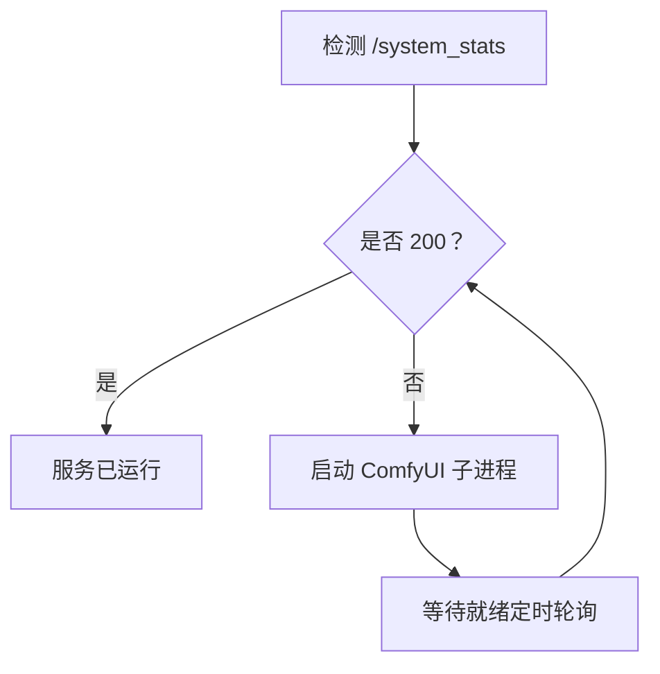
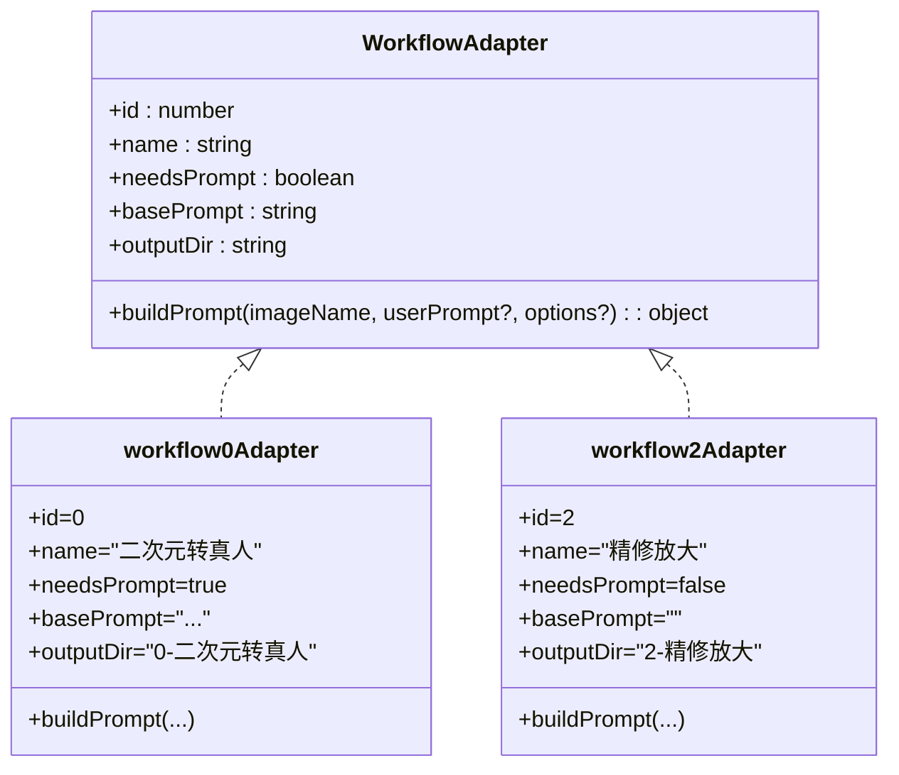
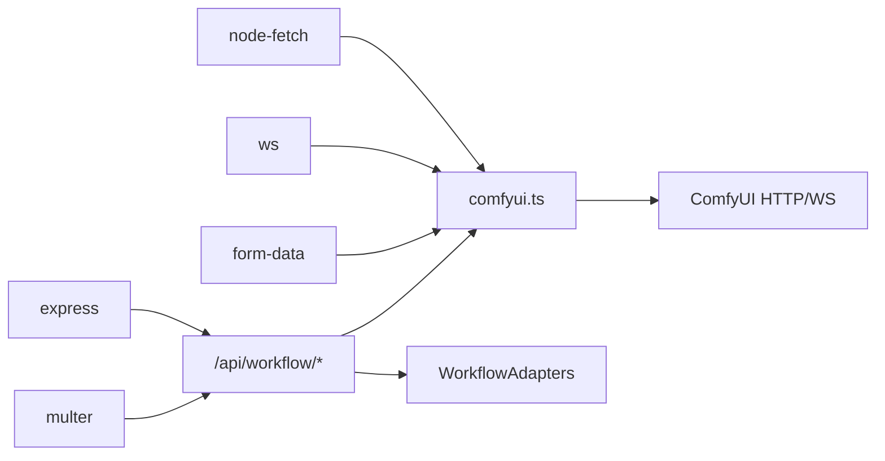

# ComfyUI 集成层

<cite>
**本文引用的文件**
- [server/src/services/comfyui.ts](file://server/src/services/comfyui.ts)
- [server/src/services/comfyuiLauncher.ts](file://server/src/services/comfyuiLauncher.ts)
- [server/src/services/sessionManager.ts](file://server/src/services/sessionManager.ts)
- [server/src/routers/workflow.ts](file://server/src/routers/workflow.ts)
- [server/src/adapters/index.ts](file://server/src/adapters/index.ts)
- [server/src/adapters/BaseAdapter.ts](file://server/src/adapters/BaseAdapter.ts)
- [server/src/adapters/Workflow0Adapter.ts](file://server/src/adapters/Workflow0Adapter.ts)
- [server/src/adapters/Workflow2Adapter.ts](file://server/src/adapters/Workflow2Adapter.ts)
- [server/src/types/index.ts](file://server/src/types/index.ts)
- [server/src/config/paths.ts](file://server/src/config/paths.ts)
- [client/src/hooks/useWebSocket.ts](file://client/src/hooks/useWebSocket.ts)
- [package.json](file://package.json)
- [server/package.json](file://server/package.json)
- [client/package.json](file://client/package.json)
</cite>

## 目录
1. [简介](#简介)
2. [项目结构](#项目结构)
3. [核心组件](#核心组件)
4. [架构总览](#架构总览)
5. [详细组件分析](#详细组件分析)
6. [依赖关系分析](#依赖关系分析)
7. [性能考虑](#性能考虑)
8. [故障排除指南](#故障排除指南)
9. [结论](#结论)
10. [附录](#附录)

## 简介
本文件面向 CorineKit Pix2Real 的 ComfyUI 集成层，系统性阐述与 ComfyUI 引擎的双向通信机制、状态检测与自动启动、进程管理、工作流执行流程、API 接口规范、配置优化、性能调优与故障排除，并提供集成测试与调试方法。目标读者既包括前端与后端开发者，也包括需要理解系统运行机制的产品与测试人员。

## 项目结构
该仓库采用前后端分离架构：
- 服务端（server）：基于 Node.js + Express，负责与 ComfyUI 交互、工作流编排、会话持久化、WebSocket 中继等。
- 客户端（client）：基于 React + Vite，负责 UI 展示、WebSocket 客户端、任务进度与结果处理。
- 配置与模板：ComfyUI 工作流 JSON 模板位于 ComfyUI_API 目录；会话数据与资源位于 sessions 目录。

图表来源
- [server/src/routers/workflow.ts](file://server/src/routers/workflow.ts)
- [server/src/services/comfyui.ts](file://server/src/services/comfyui.ts)
- [server/src/services/comfyuiLauncher.ts](file://server/src/services/comfyuiLauncher.ts)
- [server/src/services/sessionManager.ts](file://server/src/services/sessionManager.ts)
- [server/src/adapters/index.ts](file://server/src/adapters/index.ts)
- [server/src/config/paths.ts](file://server/src/config/paths.ts)
- [client/src/hooks/useWebSocket.ts](file://client/src/hooks/useWebSocket.ts)

章节来源
- [package.json:1-15](file://package.json#L1-L15)
- [server/package.json:1-28](file://server/package.json#L1-L28)
- [client/package.json:1-26](file://client/package.json#L1-L26)

## 核心组件
- ComfyUI 服务封装（HTTP + WebSocket）
  - HTTP 客户端：上传图像/视频、入队提示、查询历史、查看输出、系统统计、队列管理、模型枚举、优先级调整等。
  - WebSocket 服务器：进度事件、执行开始/完成、错误、被缓存节点等事件中继。
- ComfyUI 启动器：检测运行状态、自动启动、轮询等待就绪。
- 适配器（WorkflowAdapter）：将通用参数映射为具体工作流模板，支持不同工作流的差异化构建。
- 会话管理：会话目录结构、输入/输出/掩码存储、状态持久化、封面生成、资产重命名等。
- 路由与编排：根据工作流 ID 选择适配器或模板，注入参数，提交到 ComfyUI 并返回 promptId。
- 客户端 WebSocket：统一连接后端 WebSocket，分发进度、完成、错误事件，支持 Agent 执行进度同步。

章节来源
- [server/src/services/comfyui.ts:1-472](file://server/src/services/comfyui.ts#L1-L472)
- [server/src/services/comfyuiLauncher.ts:1-131](file://server/src/services/comfyuiLauncher.ts#L1-L131)
- [server/src/adapters/index.ts:1-33](file://server/src/adapters/index.ts#L1-L33)
- [server/src/adapters/BaseAdapter.ts:1-4](file://server/src/adapters/BaseAdapter.ts#L1-L4)
- [server/src/services/sessionManager.ts:1-539](file://server/src/services/sessionManager.ts#L1-L539)
- [server/src/routers/workflow.ts:1-800](file://server/src/routers/workflow.ts#L1-L800)
- [client/src/hooks/useWebSocket.ts:1-278](file://client/src/hooks/useWebSocket.ts#L1-L278)

## 架构总览
系统通过服务端路由将前端请求转换为 ComfyUI 的工作流模板与参数，经 HTTP 入队后，通过 WebSocket 实时推送进度与结果。服务端还负责会话数据的持久化与管理，以及 ComfyUI 的自动启动与健康检查。

图表来源
- [server/src/routers/workflow.ts:750-799](file://server/src/routers/workflow.ts#L750-L799)
- [server/src/services/comfyui.ts:168-196](file://server/src/services/comfyui.ts#L168-L196)
- [client/src/hooks/useWebSocket.ts:45-162](file://client/src/hooks/useWebSocket.ts#L45-L162)

## 详细组件分析

### ComfyUI 服务封装（HTTP + WebSocket）
- HTTP 接口
  - 上传：支持图像与视频上传，返回 ComfyUI 端的文件名，用于模板节点输入。
  - 入队：提交模板 JSON 至 /prompt，返回 prompt_id。
  - 历史：通过 /history/:prompt_id 获取输出文件列表与状态。
  - 查看：通过 /view 查询输出二进制数据。
  - 队列：获取运行中与待处理队列项，支持删除与优先级调整。
  - 系统统计：获取 RAM/Vram 使用率，用于健康监控。
  - 模型枚举：通过 /object_info 获取可用模型列表。
- WebSocket 事件
  - progress：节点级进度，携带 value/max 与可选 node。
  - execution_start：工作流开始。
  - executing：节点开始执行（node 非空）与完成（node 为空）。
  - execution_success：新版本 ComfyUI 的最终完成信号，优先于 executing:null。
  - execution_error：错误事件，优先级最高。
  - execution_cached：被缓存跳过的节点列表，用于全局进度累计。
- 进度权重与阶段化
  - 通过登记每个节点的 class_type、标题与权重，结合采样器步数与 Tiled 估算 tile 数，计算全局百分比。
  - 对于 Tiled 采样器，使用经验估算 tile 数以补偿无法静态精确计算的问题。

图表来源
- [server/src/services/comfyui.ts:265-375](file://server/src/services/comfyui.ts#L265-L375)
- [server/src/services/comfyui.ts:131-144](file://server/src/services/comfyui.ts#L131-L144)

章节来源
- [server/src/services/comfyui.ts:9-472](file://server/src/services/comfyui.ts#L1-L472)

### ComfyUI 启动器（状态检测与自动启动）
- 状态检测：通过 HTTP 请求 /system_stats 判断服务是否就绪，设置超时。
- 自动启动：根据环境变量或默认路径定位 ComfyUI 可执行脚本，使用子进程启动，后台运行。
- 就绪等待：循环轮询直到服务可用，超过最大尝试次数则抛出错误。

图表来源
- [server/src/services/comfyuiLauncher.ts:24-130](file://server/src/services/comfyuiLauncher.ts#L24-L130)

章节来源
- [server/src/services/comfyuiLauncher.ts:1-131](file://server/src/services/comfyuiLauncher.ts#L1-L131)

### 适配器（WorkflowAdapter）与工作流编排
- 统一接口：id、name、needsPrompt、basePrompt、outputDir、buildPrompt。
- 具体实现：Workflow0Adapter、Workflow2Adapter 等分别读取对应 JSON 模板，注入上传后的文件名、随机种子、用户提示词等。
- 路由编排：根据工作流 ID 选择适配器或模板文件，注入参数（如模型、尺寸、采样器、LoRA 链等），然后入队。

图表来源
- [server/src/adapters/BaseAdapter.ts:1-4](file://server/src/adapters/BaseAdapter.ts#L1-L4)
- [server/src/adapters/Workflow0Adapter.ts:1-35](file://server/src/adapters/Workflow0Adapter.ts#L1-L35)
- [server/src/adapters/Workflow2Adapter.ts:1-28](file://server/src/adapters/Workflow2Adapter.ts#L1-L28)
- [server/src/adapters/index.ts:1-33](file://server/src/adapters/index.ts#L1-L33)

章节来源
- [server/src/adapters/index.ts:1-33](file://server/src/adapters/index.ts#L1-L33)
- [server/src/adapters/Workflow0Adapter.ts:1-35](file://server/src/adapters/Workflow0Adapter.ts#L1-L35)
- [server/src/adapters/Workflow2Adapter.ts:1-28](file://server/src/adapters/Workflow2Adapter.ts#L1-L28)
- [server/src/routers/workflow.ts:644-799](file://server/src/routers/workflow.ts#L644-L799)

### 会话管理与路径配置
- 路径配置：支持通过 config.json 覆盖 sessions 根目录，提供校验与写入能力。
- 会话目录：按会话与标签页划分 input/masks/output 目录，确保幂等创建。
- 数据持久化：保存/加载会话状态 JSON，支持封面生成、资产重命名（含批处理）。
- 会话清理：列出并删除旧会话，控制存储占用。

章节来源
- [server/src/config/paths.ts:1-156](file://server/src/config/paths.ts#L1-L156)
- [server/src/services/sessionManager.ts:1-539](file://server/src/services/sessionManager.ts#L1-L539)

### 客户端 WebSocket（进度与通知）
- 单例连接：全局共享 WebSocket，避免重复连接与资源浪费。
- 事件分发：根据消息类型更新任务状态、进度、阶段与步骤总数；完成后异步记录生成日志并触发桌面通知。
- Agent 执行：支持批量生成模式，逐步累计完成数量并在全部完成后统一通知。

章节来源
- [client/src/hooks/useWebSocket.ts:1-278](file://client/src/hooks/useWebSocket.ts#L1-L278)

## 依赖关系分析
- 服务端依赖
  - Express：路由与中间件。
  - node-fetch：HTTP 客户端。
  - ws：WebSocket 客户端。
  - multer：文件上传。
  - form-data：multipart 表单上传。
- 客户端依赖
  - React + Zustand：状态管理。
  - lucide-react：图标。
  - pinyin-match：搜索匹配（用于提示词助手）。

图表来源
- [server/src/routers/workflow.ts:1-800](file://server/src/routers/workflow.ts#L1-L800)
- [server/src/services/comfyui.ts:1-472](file://server/src/services/comfyui.ts#L1-L472)
- [server/package.json:11-27](file://server/package.json#L11-L27)

章节来源
- [server/package.json:1-28](file://server/package.json#L1-L28)
- [client/package.json:1-26](file://client/package.json#L1-L26)

## 性能考虑
- 进度权重与全局百分比
  - 采样器节点按 steps 加权，Tiled 采样器按估算 tile 数乘以采样系数，提升进度估算准确性。
  - 节点权重表覆盖常见节点类型，静态权重与动态 steps 结合，减少 UI 卡顿。
- WebSocket 完成信号优先级
  - execution_success 优先于 executing:null，避免“卡片完成但历史为空”的问题，提高前端一致性。
- 队列优先级调整
  - 通过删除并重新入队的方式将目标任务置顶，减少等待时间。
- 图像/视频上传
  - 上传前设置 overwrite 与 type，减少重复文件与冗余存储。
- 会话 I/O
  - 输入/输出/掩码目录分离，避免文件名冲突；输出文件名前缀规范化，避免 ComfyUI 子目录分隔符导致的覆盖。

章节来源
- [server/src/services/comfyui.ts:58-144](file://server/src/services/comfyui.ts#L58-L144)
- [server/src/services/comfyui.ts:442-471](file://server/src/services/comfyui.ts#L442-L471)
- [server/src/routers/workflow.ts:328-340](file://server/src/routers/workflow.ts#L328-L340)

## 故障排除指南
- ComfyUI 未运行
  - 现象：HTTP 请求失败或 /system_stats 无响应。
  - 处理：确认环境变量 COMFYUI_PATH 指向正确路径；使用 ensureComfyUI 自动启动并等待就绪。
- 模型/LoRA 未找到
  - 现象：提示 value_not_in_list。
  - 处理：检查 ComfyUI 模型安装路径与文件名；路由层将错误映射为用户友好提示。
- 队列提交失败
  - 现象：/prompt 返回错误。
  - 处理：检查模板节点连接与输入参数；确认 clientId 有效。
- WebSocket 断线重连
  - 现象：网络波动导致断开。
  - 处理：客户端自动重连；若长时间无活动，需重新发起连接。
- 输出为空或覆盖
  - 现象：多条提示使用相同前缀导致覆盖。
  - 处理：路由层对输出前缀进行安全替换，避免子目录分隔符引发覆盖。

章节来源
- [server/src/services/comfyuiLauncher.ts:101-130](file://server/src/services/comfyuiLauncher.ts#L101-L130)
- [server/src/routers/workflow.ts:126-150](file://server/src/routers/workflow.ts#L126-L150)
- [server/src/routers/workflow.ts:322-326](file://server/src/routers/workflow.ts#L322-L326)
- [client/src/hooks/useWebSocket.ts:232-244](file://client/src/hooks/useWebSocket.ts#L232-L244)

## 结论
本集成层通过清晰的服务边界与事件驱动架构，实现了与 ComfyUI 的稳定双向通信。HTTP 入队与 WebSocket 实时事件相结合，辅以进度权重估算与队列优先级调整，显著提升了用户体验。会话管理与路径配置提供了良好的可维护性与可扩展性。建议在生产环境中配合日志与监控，持续优化节点权重与队列策略。

## 附录

### ComfyUI API 接口规范
- 上传图像
  - 方法：POST
  - 路径：/upload/image
  - 表单字段：image（文件）、overwrite（布尔）、subfolder（可选）、type（可选）
  - 成功响应：JSON，包含 name/subfolder/type
- 入队提示
  - 方法：POST
  - 路径：/prompt
  - 请求体：{ prompt: object, client_id: string }
  - 成功响应：{ prompt_id: string }
- 历史
  - 方法：GET
  - 路径：/history/:prompt_id
  - 成功响应：包含 outputs 与 status
- 查看输出
  - 方法：GET
  - 路径：/view?filename=...&subfolder=...&type=...
  - 成功响应：二进制图像数据
- 队列
  - 方法：GET
  - 路径：/queue
  - 成功响应：{ queue_running, queue_pending }
  - 删除队列项：POST /queue，{ delete: [promptId...] }
- 系统统计
  - 方法：GET
  - 路径：/system_stats
  - 成功响应：{ system: { ram_total, ram_free }, devices: [{ vram_total, vram_free }] }
- 模型枚举
  - 方法：GET
  - 路径：/object_info/{NodeClass}
  - 成功响应：对象输入定义，包含模型名称数组

章节来源
- [server/src/services/comfyui.ts:9-472](file://server/src/services/comfyui.ts#L1-L472)

### WebSocket 消息类型
- connected：{ type: "connected", clientId: string }
- execution_start：{ type: "execution_start", promptId: string }
- progress：{ type: "progress", promptId: string, value: number, max: number, node?: string }
- execution_cached：{ type: "execution_cached", prompt_id: string, nodes: string[] }
- executing：{ type: "executing", prompt_id: string, node?: string }
- execution_success：{ type: "execution_success", prompt_id: string }
- execution_error：{ type: "execution_error", prompt_id: string, exception_message: string }
- complete：{ type: "complete", promptId: string, outputs: OutputFile[] }
- error：{ type: "error", promptId: string, message: string }

章节来源
- [server/src/services/comfyui.ts:265-375](file://server/src/services/comfyui.ts#L265-L375)
- [client/src/hooks/useWebSocket.ts:45-162](file://client/src/hooks/useWebSocket.ts#L45-L162)
- [server/src/types/index.ts:10-52](file://server/src/types/index.ts#L10-L52)

### 集成测试方法与调试技巧
- 端到端测试
  - 使用 curl 或 Postman 调用 /api/workflow/:id/execute，观察返回的 promptId。
  - 通过 /api/workflow/models/* 检查模型列表是否正确。
  - 通过 /api/workflow/:id/execute 上传图像，确认 WebSocket 事件流完整。
- 调试技巧
  - 启用服务端日志，关注 ensureComfyUI 与 queuePrompt 的错误堆栈。
  - 在客户端 useWebSocket 中打印收到的消息，核对阶段与百分比计算。
  - 使用 /history/:prompt_id 核对 outputs 是否与预期一致。
  - 如遇模型缺失，检查 /object_info/* 与路由中的友好错误映射。

章节来源
- [server/src/services/comfyuiLauncher.ts:101-130](file://server/src/services/comfyuiLauncher.ts#L101-L130)
- [server/src/routers/workflow.ts:126-150](file://server/src/routers/workflow.ts#L126-L150)
- [client/src/hooks/useWebSocket.ts:45-162](file://client/src/hooks/useWebSocket.ts#L45-L162)