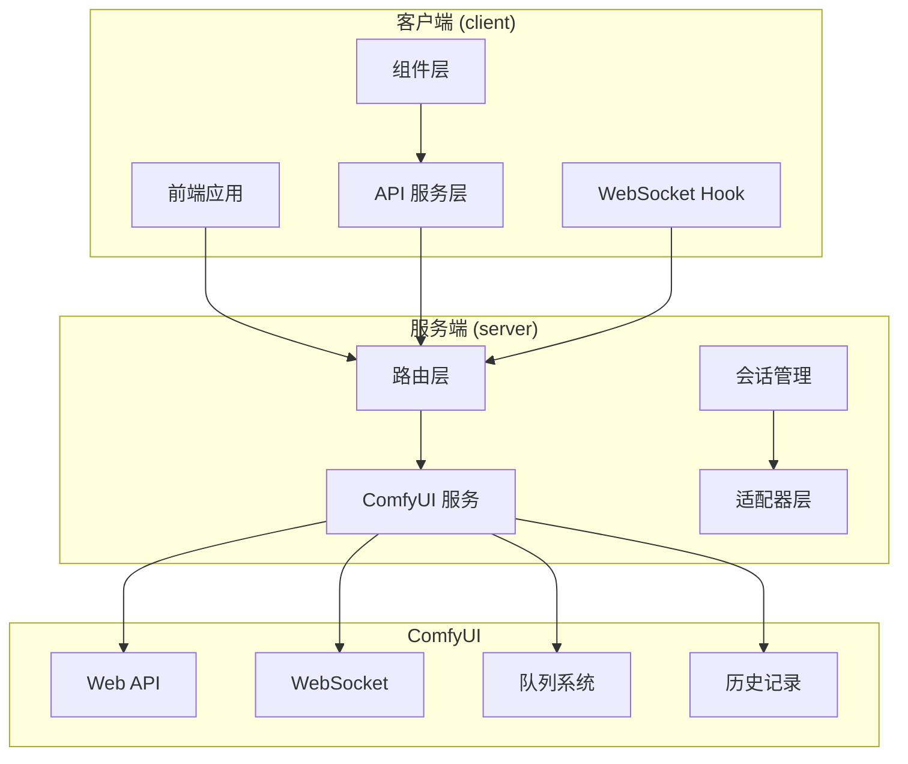
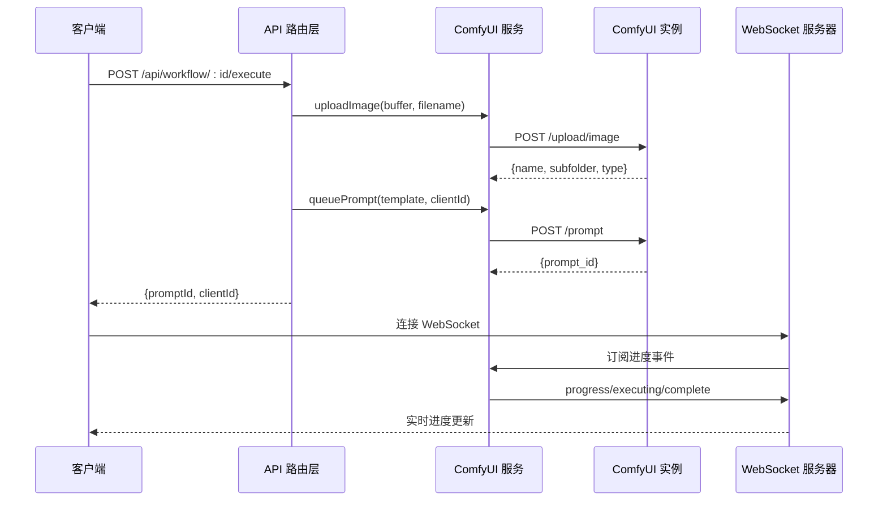
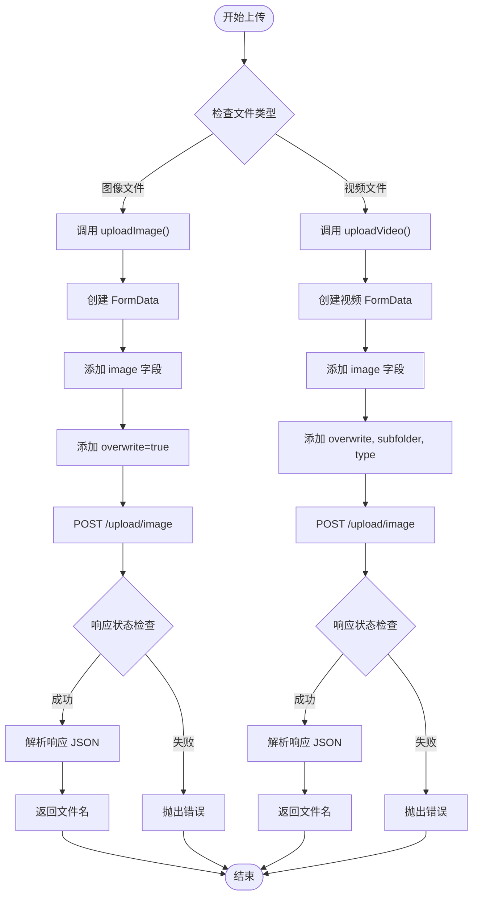
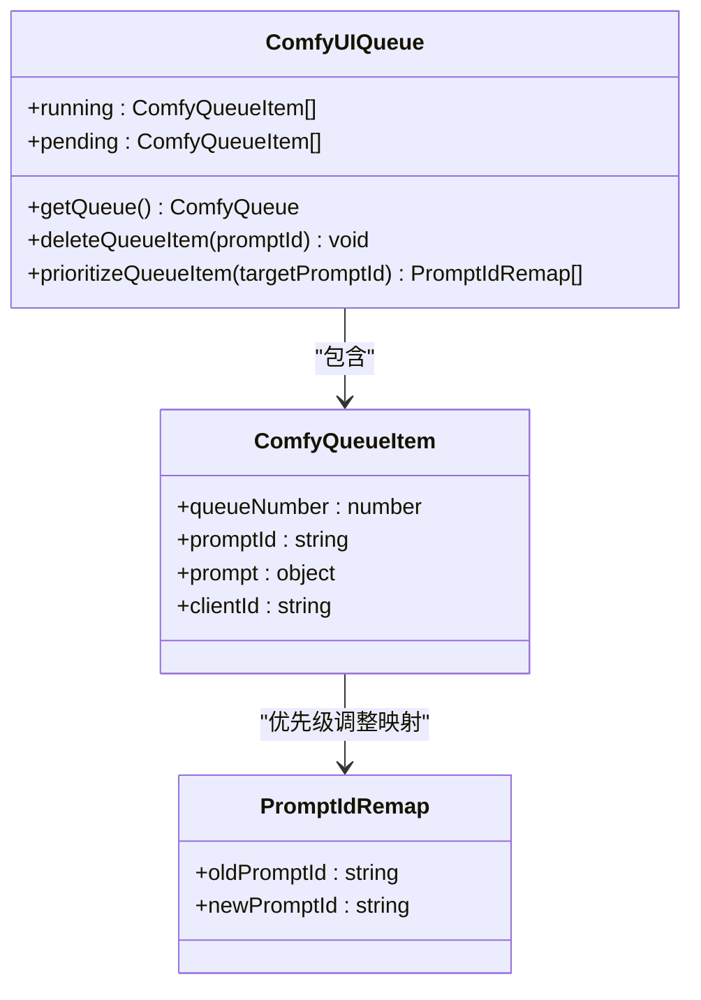
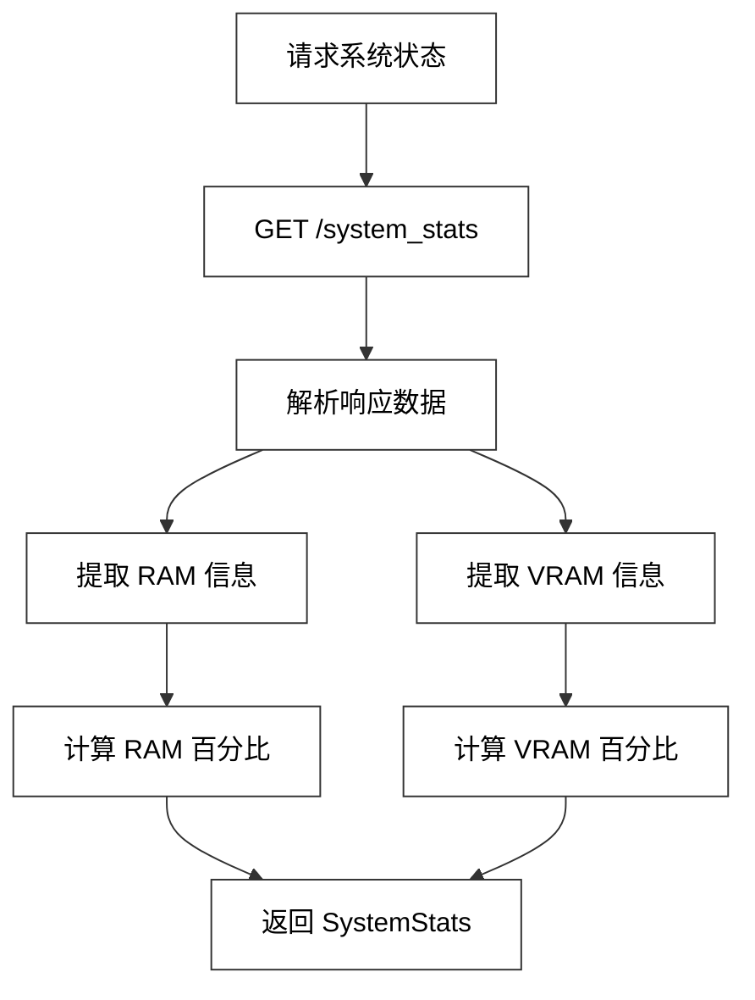
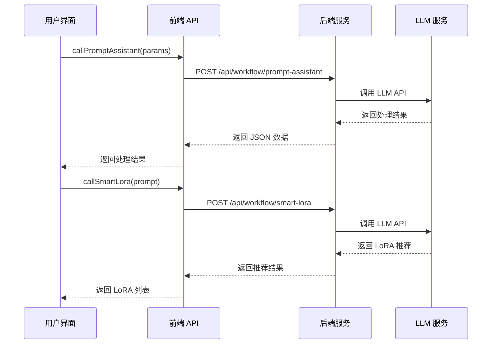
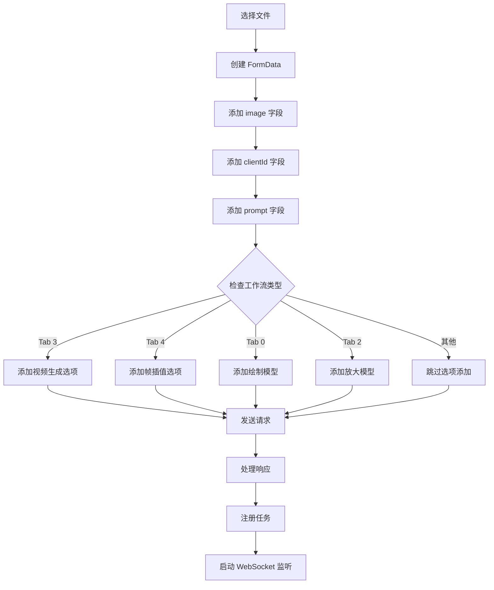
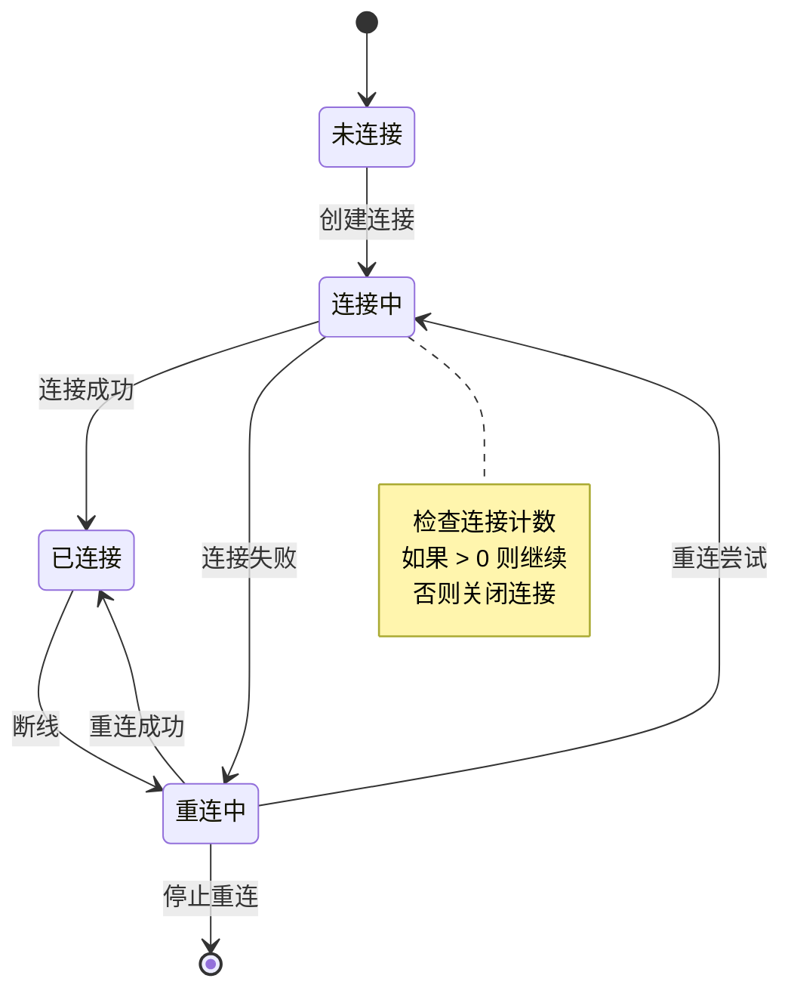
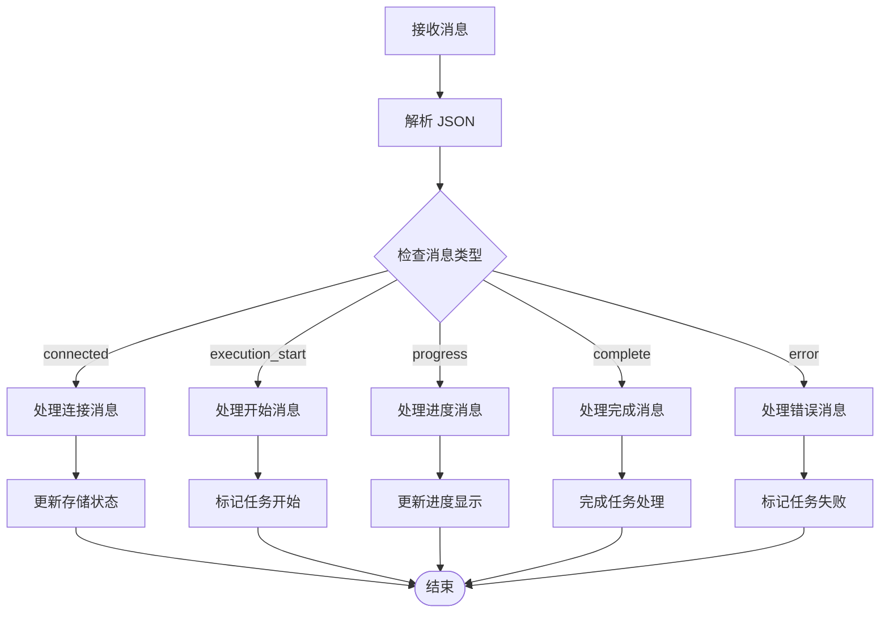
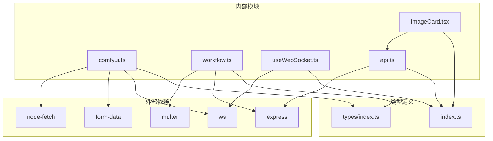

# HTTP 客户端实现

<cite>
**本文档引用的文件**
- [README.md](file://README.md)
- [comfyui.ts](file://server/src/services/comfyui.ts)
- [workflow.ts](file://server/src/routes/workflow.ts)
- [api.ts](file://client/src/services/api.ts)
- [useWebSocket.ts](file://client/src/hooks/useWebSocket.ts)
- [ImageCard.tsx](file://client/src/components/ImageCard.tsx)
- [index.ts](file://client/src/types/index.ts)
- [sessionManager.ts](file://server/src/services/sessionManager.ts)
</cite>

## 目录
1. [简介](#简介)
2. [项目结构](#项目结构)
3. [核心组件](#核心组件)
4. [架构概览](#架构概览)
5. [详细组件分析](#详细组件分析)
6. [依赖关系分析](#依赖关系分析)
7. [性能考虑](#性能考虑)
8. [故障排除指南](#故障排除指南)
9. [结论](#结论)

## 简介

本文档详细介绍了 CorineKit Pix2Real 项目中的 ComfyUI HTTP 客户端实现。该项目是一个基于 ComfyUI 的本地 Web 图像/视频处理工具，提供了实时进度更新和一键输出文件夹访问功能。

项目采用前后端分离架构：
- **前端**：React + TypeScript + Vite，负责用户界面和交互
- **后端**：Express + TypeScript，负责与 ComfyUI 通信和工作流管理
- **核心**：通过 HTTP API 与 ComfyUI 进行交互，支持文件上传、工作流执行和状态查询

## 项目结构

项目采用模块化设计，主要分为以下几个部分：

**图表来源**
- [README.md:41-62](file://README.md#L41-L62)
- [comfyui.ts:6-7](file://server/src/services/comfyui.ts#L6-L7)

**章节来源**
- [README.md:1-79](file://README.md#L1-L79)

## 核心组件

### ComfyUI HTTP 客户端服务

服务端实现了完整的 ComfyUI HTTP 客户端，提供以下核心功能：

#### 文件上传处理
- **图像上传**：支持标准图像文件上传，使用 `overwrite=true` 参数覆盖同名文件
- **视频上传**：特殊处理视频文件，添加 `subfolder=''` 和 `type='input'` 参数
- **FormData 构建**：使用 `form-data` 库构建多部分表单数据

#### 工作流执行管理
- **队列提交**：将工作流模板提交到 ComfyUI 队列
- **历史记录查询**：获取工作流执行历史和输出文件信息
- **系统状态监控**：查询 VRAM 和 RAM 使用情况

#### WebSocket 进度跟踪
- **实时进度**：通过 WebSocket 实时接收执行进度
- **阶段化显示**：根据节点类型映射显示中文阶段名称
- **错误处理**：完善的错误捕获和用户友好提示

**章节来源**
- [comfyui.ts:9-45](file://server/src/services/comfyui.ts#L9-L45)
- [comfyui.ts:168-196](file://server/src/services/comfyui.ts#L168-L196)
- [comfyui.ts:198-207](file://server/src/services/comfyui.ts#L198-L207)
- [comfyui.ts:244-263](file://server/src/services/comfyui.ts#L244-L263)

### 前端 API 服务

前端提供了简洁的 API 调用接口：

#### LLM 辅助功能
- **提示词助手**：调用 ComfyUI 提示词助手工作流
- **智能 LoRA 推荐**：基于用户提示词推荐合适的 LoRA 模型
- **触发词智能插入**：向提示词中智能插入触发词

#### 文件上传处理
- **FormData 构建**：支持多文件上传和自定义参数
- **选项传递**：支持工作流特定的配置选项

**章节来源**
- [api.ts:3-41](file://client/src/services/api.ts#L3-L41)

### WebSocket 连接管理

前端实现了高效的 WebSocket 连接管理：

#### 连接池管理
- **单例连接**：确保每个浏览器会话只有一个 WebSocket 连接
- **自动重连**：断线自动重连机制
- **连接计数**：跟踪活跃连接数量

#### 消息处理
- **进度更新**：实时接收和处理进度消息
- **任务状态**：管理任务生命周期状态
- **桌面通知**：任务完成或错误时的桌面通知

**章节来源**
- [useWebSocket.ts:29-277](file://client/src/hooks/useWebSocket.ts#L29-L277)

## 架构概览

系统采用分层架构设计，确保了良好的可维护性和扩展性：

**图表来源**
- [workflow.ts:750-799](file://server/src/routes/workflow.ts#L750-L799)
- [comfyui.ts:9-45](file://server/src/services/comfyui.ts#L9-L45)
- [comfyui.ts:168-196](file://server/src/services/comfyui.ts#L168-L196)

## 详细组件分析

### ComfyUI HTTP 客户端实现

#### 文件上传服务

文件上传服务实现了两种不同的上传策略：

**图表来源**
- [comfyui.ts:9-45](file://server/src/services/comfyui.ts#L9-L45)

**章节来源**
- [comfyui.ts:9-45](file://server/src/services/comfyui.ts#L9-L45)

#### 工作流队列管理

队列管理系统提供了完整的工作流生命周期管理：

**图表来源**
- [comfyui.ts:384-408](file://server/src/services/comfyui.ts#L384-L408)
- [comfyui.ts:410-413](file://server/src/services/comfyui.ts#L410-L413)

**章节来源**
- [comfyui.ts:389-471](file://server/src/services/comfyui.ts#L389-L471)

#### 系统状态监控

系统状态监控提供了硬件资源使用情况的实时查询：

**图表来源**
- [comfyui.ts:244-263](file://server/src/services/comfyui.ts#L244-L263)

**章节来源**
- [comfyui.ts:239-263](file://server/src/services/comfyui.ts#L239-L263)

### 前端 API 服务实现

#### LLM 辅助功能

前端 API 服务提供了三个主要的 LLM 辅助功能：

**图表来源**
- [api.ts:3-41](file://client/src/services/api.ts#L3-L41)

**章节来源**
- [api.ts:3-41](file://client/src/services/api.ts#L3-L41)

#### 文件上传处理

前端文件上传处理实现了灵活的多文件上传机制：

**图表来源**
- [ImageCard.tsx:455-515](file://client/src/components/ImageCard.tsx#L455-L515)

**章节来源**
- [ImageCard.tsx:455-515](file://client/src/components/ImageCard.tsx#L455-L515)

### WebSocket 进度跟踪系统

#### 连接管理

WebSocket 连接管理系统实现了高效的连接池管理：

**图表来源**
- [useWebSocket.ts:29-277](file://client/src/hooks/useWebSocket.ts#L29-L277)

**章节来源**
- [useWebSocket.ts:29-277](file://client/src/hooks/useWebSocket.ts#L29-L277)

#### 消息处理流程

WebSocket 消息处理实现了复杂的状态转换：

**图表来源**
- [useWebSocket.ts:45-162](file://client/src/hooks/useWebSocket.ts#L45-L162)

**章节来源**
- [useWebSocket.ts:45-162](file://client/src/hooks/useWebSocket.ts#L45-L162)

## 依赖关系分析

系统依赖关系清晰，遵循单一职责原则：

**图表来源**
- [comfyui.ts:1-4](file://server/src/services/comfyui.ts#L1-L4)
- [workflow.ts:1-16](file://server/src/routes/workflow.ts#L1-L16)

**章节来源**
- [comfyui.ts:1-4](file://server/src/services/comfyui.ts#L1-L4)
- [workflow.ts:1-16](file://server/src/routes/workflow.ts#L1-L16)

## 性能考虑

### 上传优化策略

1. **内存管理**：使用 `multer.memoryStorage()` 存储上传文件，避免临时文件写入磁盘
2. **并发限制**：批量上传最多支持 50 个文件，防止内存溢出
3. **文件类型检测**：支持 PNG、JPEG、WebP 等常见图像格式

### WebSocket 连接优化

1. **单例连接**：确保每个浏览器会话只有一个 WebSocket 连接
2. **自动重连**：断线后 2 秒自动重连，最多重试直到连接成功
3. **连接池管理**：使用 `connectionCount` 跟踪活跃连接数量

### 缓存和状态管理

1. **进度缓存**：WebSocket 连接建立时自动重放最近的进度消息
2. **任务状态持久化**：使用 Zustand 状态管理库保持任务状态
3. **错误恢复**：完善的错误处理和状态恢复机制

## 故障排除指南

### 常见问题及解决方案

#### ComfyUI 连接失败
- **症状**：WebSocket 连接断开或 API 请求超时
- **原因**：ComfyUI 服务未启动或网络连接问题
- **解决**：确认 ComfyUI 在 `http://localhost:8188` 正常运行

#### 文件上传失败
- **症状**：上传过程中出现 400 或 500 错误
- **原因**：文件格式不支持或文件过大
- **解决**：检查文件格式是否为支持的图像格式，文件大小是否超过限制

#### 进度更新延迟
- **症状**：任务完成后进度条未完全填充
- **原因**：ComfyUI 历史记录写入延迟
- **解决**：系统已内置重试机制，等待历史记录完全写入

**章节来源**
- [workflow.ts:126-150](file://server/src/routes/workflow.ts#L126-L150)

### 错误处理机制

系统实现了多层次的错误处理：

1. **HTTP 状态码检查**：所有 API 调用都会检查响应状态码
2. **用户友好错误**：将技术错误转换为用户可理解的提示
3. **重试机制**：关键操作（如历史记录查询）具有自动重试功能
4. **降级处理**：在网络异常时提供合理的降级行为

**章节来源**
- [comfyui.ts:19-21](file://server/src/services/comfyui.ts#L19-L21)
- [workflow.ts:146-149](file://server/src/routes/workflow.ts#L146-L149)

## 结论

本项目的 ComfyUI HTTP 客户端实现展现了优秀的软件工程实践：

### 设计优势
- **模块化架构**：清晰的分层设计，职责分离明确
- **错误处理完善**：多层次的错误捕获和用户友好提示
- **性能优化**：合理的内存管理和连接池设计
- **用户体验**：实时进度反馈和桌面通知机制

### 技术亮点
- **WebSocket 实时通信**：提供流畅的用户体验
- **智能文件处理**：支持多种文件格式和工作流类型
- **状态管理**：完善的任务状态跟踪和恢复机制
- **扩展性设计**：易于添加新的工作流和功能

该实现为类似的人工智能图像处理应用提供了优秀的参考模板，展示了如何在实际生产环境中可靠地集成和使用 ComfyUI。