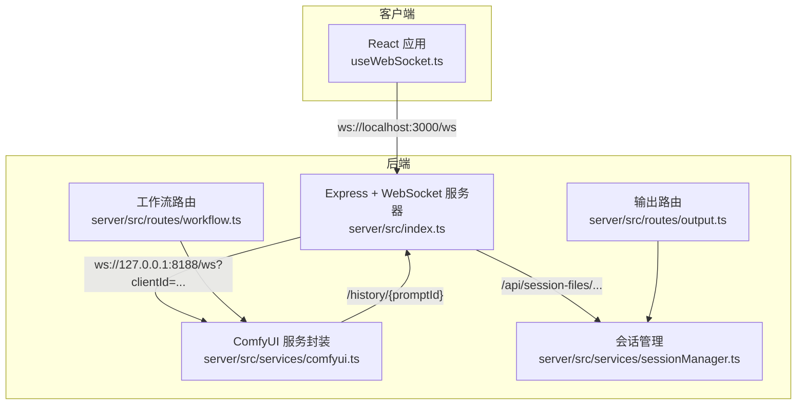
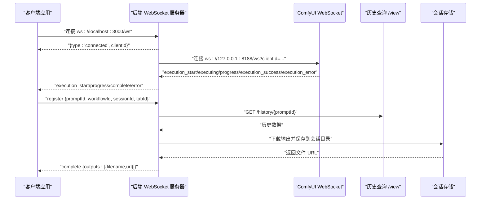
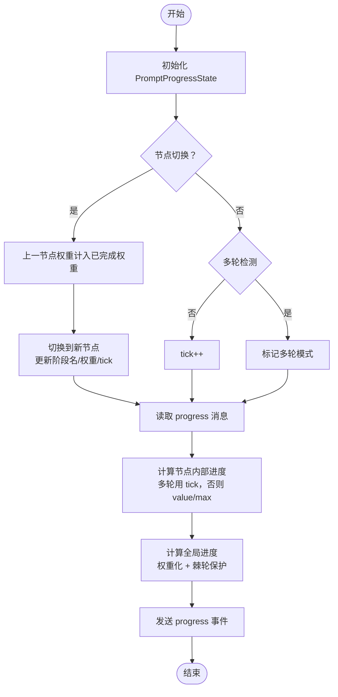
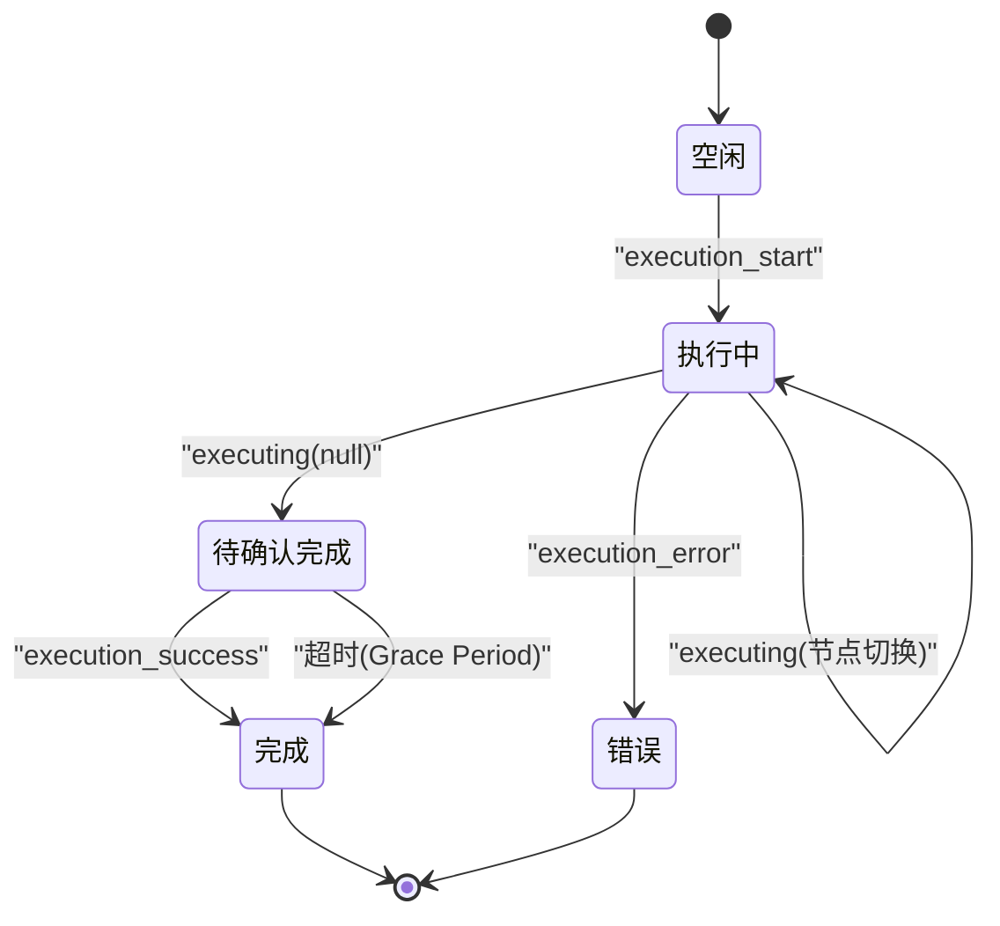
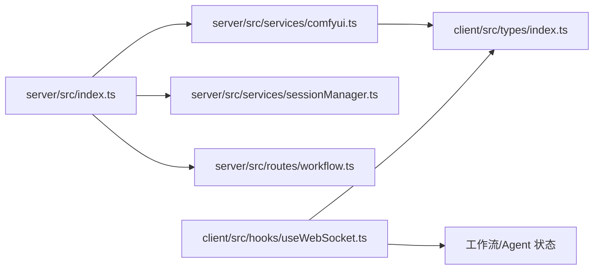
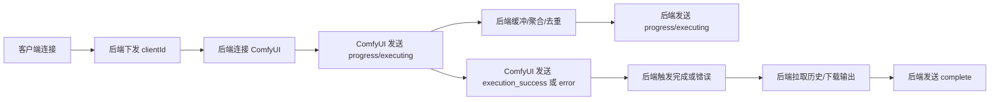

# WebSocket 服务器

<cite>
**本文引用的文件**
- [server/src/index.ts](file://server/src/index.ts)
- [server/src/services/comfyui.ts](file://server/src/services/comfyui.ts)
- [client/src/hooks/useWebSocket.ts](file://client/src/hooks/useWebSocket.ts)
- [client/src/types/index.ts](file://client/src/types/index.ts)
- [server/src/routes/workflow.ts](file://server/src/routes/workflow.ts)
- [server/src/services/sessionManager.ts](file://server/src/services/sessionManager.ts)
- [server/src/routes/output.ts](file://server/src/routes/output.ts)
</cite>

## 目录
1. [简介](#简介)
2. [项目结构](#项目结构)
3. [核心组件](#核心组件)
4. [架构总览](#架构总览)
5. [详细组件分析](#详细组件分析)
6. [依赖关系分析](#依赖关系分析)
7. [性能考量](#性能考量)
8. [故障排查指南](#故障排查指南)
9. [结论](#结论)
10. [附录](#附录)

## 简介
本文件面向 ComfyUI WebSocket 服务器，系统性阐述以下主题：
- WebSocket 连接建立与客户端生命周期管理
- 消息处理与事件分发机制
- 进度追踪系统：节点级进度计算、权重分配算法、全局进度聚合
- 执行状态管理：execution_start、executing、execution_success、execution_error、execution_cached 的处理逻辑
- 去重机制、完成信号优先级与错误处理策略
- WebSocket 事件流与时序图、状态转换图
- 连接管理、重连机制与性能优化
- 调试技巧与常见问题解决方案

## 项目结构
本项目采用前后端分离的 Node.js + React 架构，WebSocket 服务器位于后端，负责：
- 作为客户端与 ComfyUI 的中间层，转发进度、完成与错误事件
- 维护全局进度状态，进行权重化聚合
- 将输出下载到会话目录，供前端展示与下载

图表来源
- [server/src/index.ts:157-170](file://server/src/index.ts#L157-L170)
- [server/src/services/comfyui.ts:265-277](file://server/src/services/comfyui.ts#L265-L277)
- [server/src/services/sessionManager.ts:37-48](file://server/src/services/sessionManager.ts#L37-L48)
- [server/src/routes/workflow.ts:12](file://server/src/routes/workflow.ts#L12)
- [server/src/routes/output.ts:1-139](file://server/src/routes/output.ts#L1-L139)

章节来源
- [server/src/index.ts:157-170](file://server/src/index.ts#L157-L170)
- [server/src/services/comfyui.ts:265-277](file://server/src/services/comfyui.ts#L265-L277)
- [server/src/services/sessionManager.ts:37-48](file://server/src/services/sessionManager.ts#L37-L48)
- [server/src/routes/workflow.ts:12](file://server/src/routes/workflow.ts#L12)
- [server/src/routes/output.ts:1-139](file://server/src/routes/output.ts#L1-L139)

## 核心组件
- WebSocket 服务器（后端）：负责连接管理、事件缓冲与重放、进度聚合、完成与错误处理、输出下载与会话持久化。
- ComfyUI 服务封装：负责与 ComfyUI WebSocket 通信，解析进度、执行状态与缓存跳过事件，并提供历史查询与资源下载。
- 客户端 WebSocket Hook：负责连接、消息分发、去重与重连、Agent 执行进度同步。
- 类型定义：统一前后端 WebSocket 消息格式。

章节来源
- [server/src/index.ts:157-170](file://server/src/index.ts#L157-L170)
- [server/src/services/comfyui.ts:265-375](file://server/src/services/comfyui.ts#L265-L375)
- [client/src/hooks/useWebSocket.ts:29-277](file://client/src/hooks/useWebSocket.ts#L29-L277)
- [client/src/types/index.ts:39-75](file://client/src/types/index.ts#L39-L75)

## 架构总览
WebSocket 服务器在后端监听本地端口，向客户端提供统一的事件通道；同时连接 ComfyUI 的 WebSocket，将 ComfyUI 的进度、执行与完成事件中继到客户端，并在完成时拉取历史、下载输出到会话目录。

图表来源
- [server/src/index.ts:168-173](file://server/src/index.ts#L168-L173)
- [server/src/index.ts:273-464](file://server/src/index.ts#L273-L464)
- [server/src/services/comfyui.ts:304-375](file://server/src/services/comfyui.ts#L304-L375)
- [server/src/services/comfyui.ts:198-207](file://server/src/services/comfyui.ts#L198-L207)
- [server/src/services/sessionManager.ts:37-48](file://server/src/services/sessionManager.ts#L37-L48)

## 详细组件分析

### WebSocket 连接建立与生命周期
- 后端在启动时创建 WebSocketServer 并监听指定路径，为每个连接生成唯一 clientId 并下发给客户端。
- 客户端首次连接后，后端连接 ComfyUI 的 WebSocket，并将 ComfyUI 的事件中继到客户端。
- 客户端断开连接时，后端关闭与 ComfyUI 的连接；重新连接时，若客户端仍有订阅者，则延迟重连。

章节来源
- [server/src/index.ts:157-170](file://server/src/index.ts#L157-L170)
- [server/src/index.ts:490-494](file://server/src/index.ts#L490-L494)
- [client/src/hooks/useWebSocket.ts:232-248](file://client/src/hooks/useWebSocket.ts#L232-L248)

### 消息处理与事件分发
- 事件缓冲与重放：当客户端注册 promptId 之前 ComfyUI 已经开始执行，后端会缓冲 execution_start/progress，并在客户端注册后重放，保证 UI 不错过初始事件。
- 客户端消息：客户端发送 register 消息，携带 promptId、workflowId、sessionId、tabId，后端据此在完成时下载输出到会话目录。

章节来源
- [server/src/index.ts:175-185](file://server/src/index.ts#L175-L185)
- [server/src/index.ts:466-488](file://server/src/index.ts#L466-L488)

### 进度追踪系统
- 节点级进度计算：依据 ComfyUI 的 progress 消息，结合节点 class_type 与 inputs，计算当前节点内部进度（value/max 或 tick 计数）。
- 权重分配算法：不同节点类型赋予不同权重（如采样器权重与 steps 成正比，模型加载权重固定），用于全局进度聚合。
- 全局进度聚合：全局进度 = min(99, sum(已完成权重 + 当前节点权重 × 节点内部进度) / 总权重)，并进行棘轮保护，防止多轮间回退。
- 阶段名称映射：将节点 class_type 映射为中文阶段名，便于 UI 展示。

图表来源
- [server/src/index.ts:208-229](file://server/src/index.ts#L208-L229)
- [server/src/index.ts:231-238](file://server/src/index.ts#L231-L238)
- [server/src/index.ts:240-271](file://server/src/index.ts#L240-L271)
- [server/src/index.ts:289-333](file://server/src/index.ts#L289-L333)
- [server/src/services/comfyui.ts:131-144](file://server/src/services/comfyui.ts#L131-L144)

章节来源
- [server/src/index.ts:208-271](file://server/src/index.ts#L208-L271)
- [server/src/index.ts:289-333](file://server/src/index.ts#L289-L333)
- [server/src/services/comfyui.ts:131-144](file://server/src/services/comfyui.ts#L131-L144)

### 执行状态管理与事件优先级
- execution_start：仅触发一次，确保前端先收到执行开始事件。
- executing：节点开始执行时触发；当 data.node 为 null 时，表示工作流完成，但为避免历史尚未落盘导致“空卡”问题，延迟触发 onComplete。
- execution_success：新的完成信号，发生在历史写盘之后，优先于 executing:null。
- execution_error：错误发生时取消任何待触发的 onComplete，立即上报错误。
- execution_cached：被缓存跳过的节点列表，直接计入已完成权重，推进进度条。

图表来源
- [server/src/services/comfyui.ts:325-354](file://server/src/services/comfyui.ts#L325-L354)
- [server/src/index.ts:335-447](file://server/src/index.ts#L335-L447)

章节来源
- [server/src/services/comfyui.ts:325-354](file://server/src/services/comfyui.ts#L325-L354)
- [server/src/index.ts:335-447](file://server/src/index.ts#L335-L447)

### 去重机制与完成信号优先级
- 去重策略：
  - startedPrompts：确保 execution_start 对同一 promptId 仅触发一次。
  - completedPrompts：防止 onComplete 双触发。
  - pendingCompleteTimers：executing:null 到 execution_success 之间的竞态，通过定时器与优先级控制完成信号。
- 完成信号优先级：execution_success > executing:null（带宽限期）> 错误（立即终止）。
- 缓存跳过：execution_cached 将命中缓存的节点权重直接计入已完成权重，提升进度连续性。

章节来源
- [server/src/services/comfyui.ts:280-302](file://server/src/services/comfyui.ts#L280-L302)
- [server/src/services/comfyui.ts:317-323](file://server/src/services/comfyui.ts#L317-L323)
- [server/src/index.ts:279-287](file://server/src/index.ts#L279-L287)

### 错误处理策略
- 错误捕获：ComfyUI 侧 JSON 解析异常会被忽略，避免中断连接。
- 错误传播：execution_error 发生时，立即清理待触发的完成定时器，并向客户端发送 error 事件。
- 历史一致性保障：完成时对 /history/{promptId} 进行多次重试，直到 completed=true，避免“空卡”现象。

章节来源
- [server/src/services/comfyui.ts:365-367](file://server/src/services/comfyui.ts#L365-L367)
- [server/src/services/comfyui.ts:356-364](file://server/src/services/comfyui.ts#L356-L364)
- [server/src/index.ts:450-463](file://server/src/index.ts#L450-L463)
- [server/src/index.ts:349-371](file://server/src/index.ts#L349-L371)

### 客户端事件流与 UI 同步
- 客户端连接后，根据消息类型分发到工作流状态与 Agent 执行状态。
- 支持批量生成模式的 Agent 执行进度同步，逐步累积 outputs 并在全部完成后统一通知。
- 桌面通知：根据设置在完成或错误时弹出通知。

章节来源
- [client/src/hooks/useWebSocket.ts:45-159](file://client/src/hooks/useWebSocket.ts#L45-L159)
- [client/src/hooks/useWebSocket.ts:164-229](file://client/src/hooks/useWebSocket.ts#L164-L229)
- [client/src/types/index.ts:39-75](file://client/src/types/index.ts#L39-L75)

## 依赖关系分析
- server/src/index.ts
  - 依赖 server/src/services/comfyui.ts 提供的 WebSocket 连接、历史查询与节点信息。
  - 依赖 server/src/services/sessionManager.ts 下载输出到会话目录。
  - 依赖 server/src/routes/workflow.ts 提供工作流模板与适配器。
- server/src/services/comfyui.ts
  - 依赖 node-fetch 与 ws 进行 HTTP 与 WebSocket 通信。
  - 维护 promptNodeInfo 映射，用于进度权重与阶段名。
- client/src/hooks/useWebSocket.ts
  - 依赖 client/src/types/index.ts 的消息类型定义。
  - 依赖 useWorkflowStore 与 useAgentStore 更新 UI 状态。

图表来源
- [server/src/index.ts:15-18](file://server/src/index.ts#L15-L18)
- [server/src/services/comfyui.ts:1-7](file://server/src/services/comfyui.ts#L1-L7)
- [client/src/hooks/useWebSocket.ts:1-7](file://client/src/hooks/useWebSocket.ts#L1-L7)
- [client/src/types/index.ts:39-75](file://client/src/types/index.ts#L39-L75)

章节来源
- [server/src/index.ts:15-18](file://server/src/index.ts#L15-L18)
- [server/src/services/comfyui.ts:1-7](file://server/src/services/comfyui.ts#L1-L7)
- [client/src/hooks/useWebSocket.ts:1-7](file://client/src/hooks/useWebSocket.ts#L1-L7)
- [client/src/types/index.ts:39-75](file://client/src/types/index.ts#L39-L75)

## 性能考量
- 事件缓冲与重放：减少客户端注册时机造成的事件丢失，降低 UI 重绘抖动。
- 历史查询重试：在慢盘环境下避免“空卡”，提高完成事件的可靠性。
- 进度计算优化：权重化聚合与棘轮保护，避免 UI 百分比回退，提升用户体验。
- 连接复用与去重：避免重复触发 execution_start，减少冗余事件。
- 输出下载策略：仅在有会话目标时下载，节省带宽与磁盘 IO。

章节来源
- [server/src/index.ts:175-185](file://server/src/index.ts#L175-L185)
- [server/src/index.ts:349-371](file://server/src/index.ts#L349-L371)
- [server/src/index.ts:240-271](file://server/src/index.ts#L240-L271)
- [server/src/index.ts:274-277](file://server/src/index.ts#L274-L277)

## 故障排查指南
- 连接失败
  - 检查 ComfyUI 是否运行在默认端口，后端是否能访问 127.0.0.1:8188。
  - 查看后端启动日志，确认 WebSocketServer 正常监听。
- 事件丢失
  - 确认客户端是否在 ComfyUI 开始执行前发送 register 消息。
  - 检查 eventBuffer 是否正确重放。
- “空卡”问题
  - 等待历史 completed=true 后再完成；若长时间未完成，查看后端重试日志。
- 输出未保存
  - 确认 register 消息包含有效的 sessionId 与 tabId。
  - 检查会话目录权限与磁盘空间。
- 错误定位
  - 关注后端日志中的错误消息与堆栈，区分 ComfyUI 报错与服务端异常。
  - 使用友好的错误映射，将 ComfyUI 的校验错误转换为用户可读提示。

章节来源
- [server/src/index.ts:466-488](file://server/src/index.ts#L466-L488)
- [server/src/index.ts:349-371](file://server/src/index.ts#L349-L371)
- [server/src/index.ts:450-463](file://server/src/index.ts#L450-L463)
- [server/src/routes/workflow.ts:126-150](file://server/src/routes/workflow.ts#L126-L150)

## 结论
本 WebSocket 服务器通过中间层抽象，实现了对 ComfyUI 事件的可靠中继、进度聚合与完成保障。其关键特性包括：
- 事件缓冲与重放，确保 UI 不错过初始事件
- 权重化全局进度与阶段化展示
- 完成信号优先级与竞态处理，避免“空卡”
- 会话输出下载与错误友好化
- 客户端连接管理与重连策略

这些设计共同提升了复杂工作流场景下的稳定性与用户体验。

## 附录

### WebSocket 事件流图（概念）

[本图为概念示意，不对应具体源码文件]

### 数据模型与类型
- 服务端消息类型：connected、execution_start、progress、complete、error
- 客户端消息类型：register（携带 promptId、workflowId、sessionId、tabId）

章节来源
- [client/src/types/index.ts:39-75](file://client/src/types/index.ts#L39-L75)