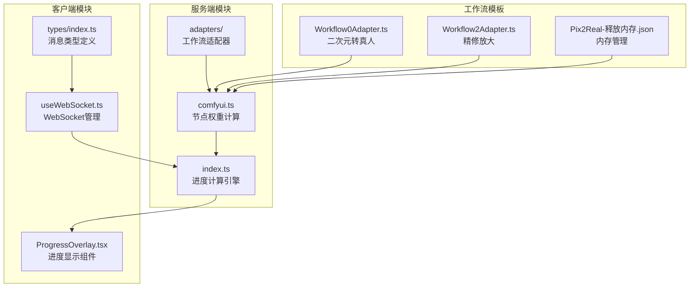
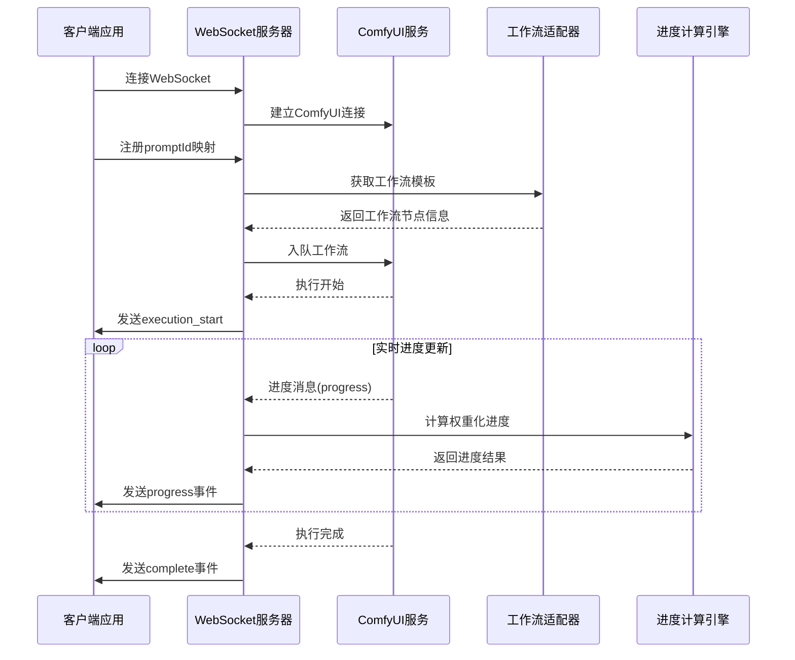
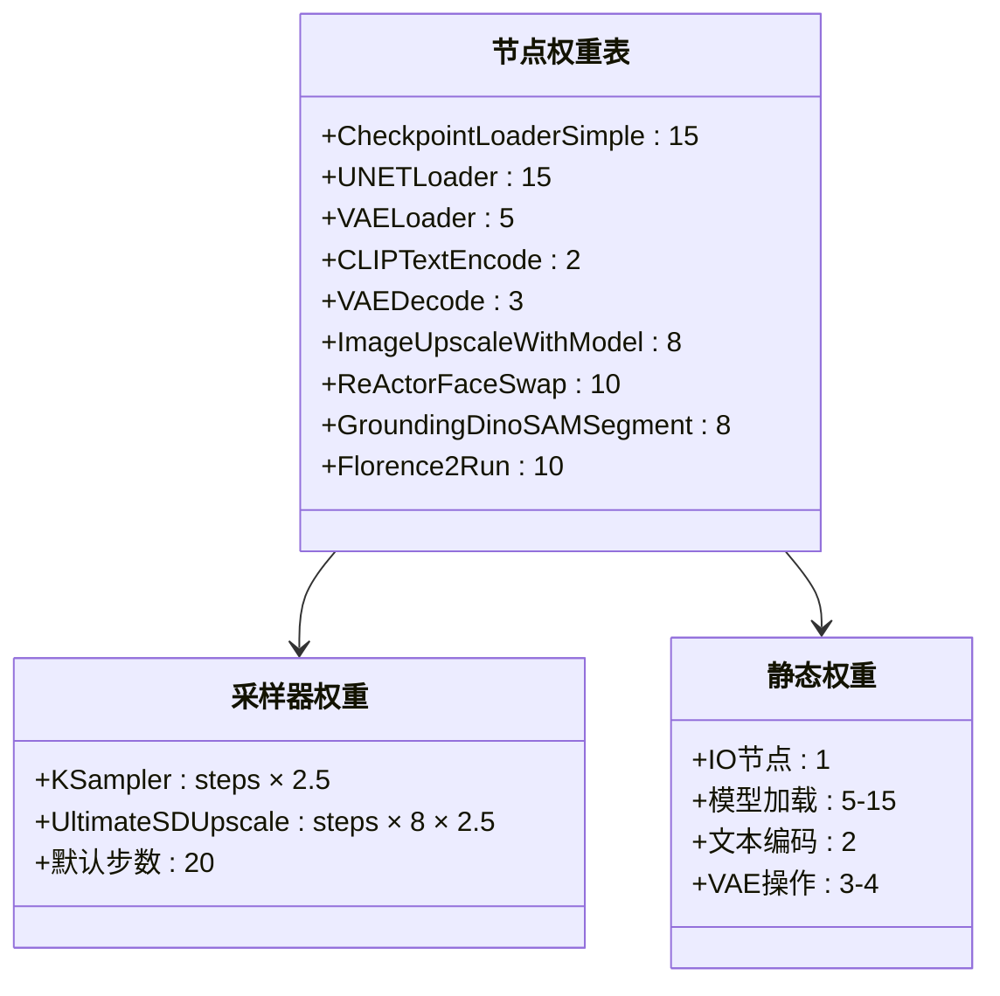
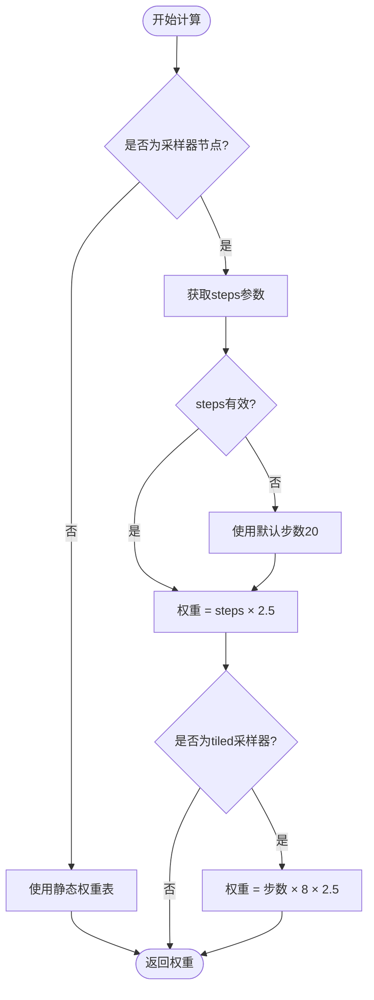
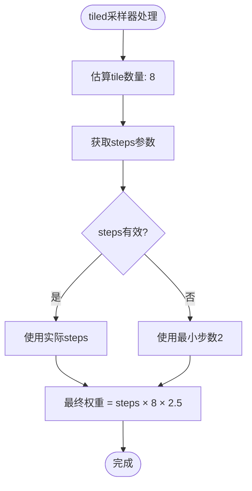
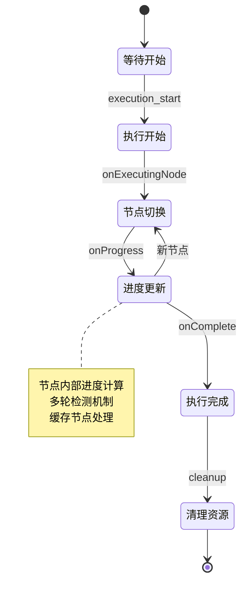
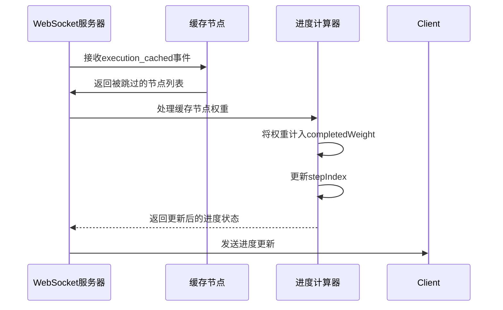
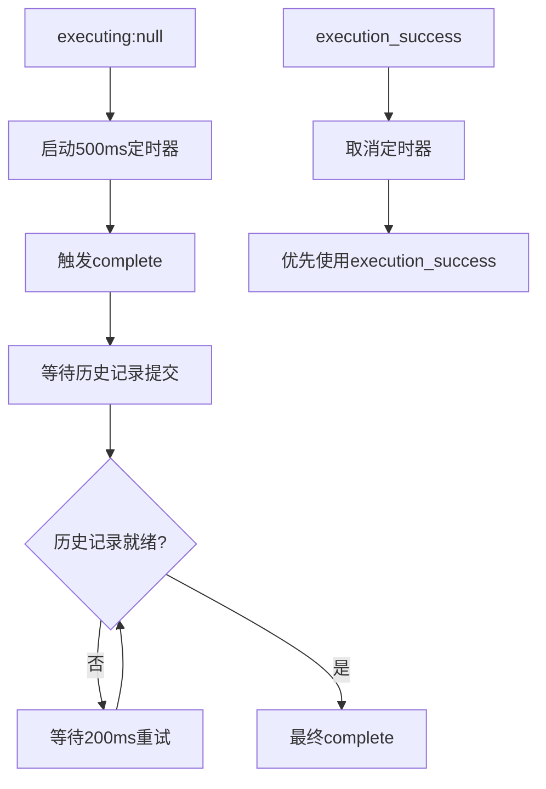
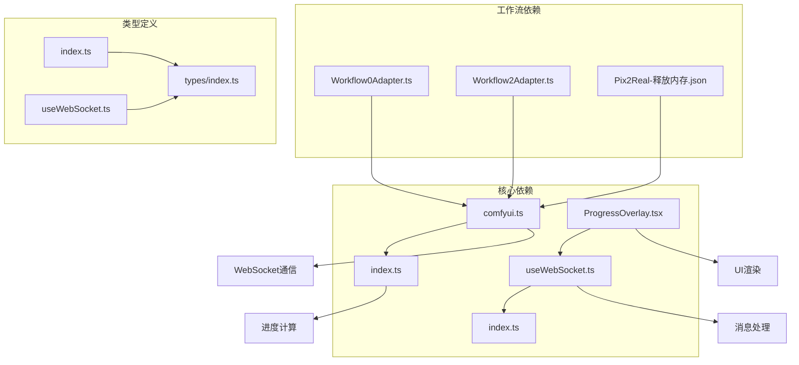

# 进度追踪系统

<cite>
**本文档引用的文件**
- [comfyui.ts](file://server/src/services/comfyui.ts)
- [index.ts](file://server/src/index.ts)
- [ProgressOverlay.tsx](file://client/src/components/ProgressOverlay.tsx)
- [useWebSocket.ts](file://client/src/hooks/useWebSocket.ts)
- [index.ts](file://client/src/types/index.ts)
- [Workflow0Adapter.ts](file://server/src/adapters/Workflow0Adapter.ts)
- [Workflow2Adapter.ts](file://server/src/adapters/Workflow2Adapter.ts)
- [Pix2Real-释放内存.json](file://ComfyUI_API/Pix2Real-释放内存.json)
</cite>

## 目录
1. [简介](#简介)
2. [项目结构](#项目结构)
3. [核心组件](#核心组件)
4. [架构概览](#架构概览)
5. [详细组件分析](#详细组件分析)
6. [依赖关系分析](#依赖关系分析)
7. [性能考量](#性能考量)
8. [故障排除指南](#故障排除指南)
9. [结论](#结论)

## 简介

ComfyUI 进度追踪系统是一个基于权重化阶段化算法的实时进度监控解决方案。该系统通过分析工作流中的节点权重、采样器步骤估算和特殊处理机制，为用户提供准确、直观的进度反馈。系统特别针对 tiled 采样器等复杂节点进行了专门优化，确保在各种工作流场景下都能提供可靠的进度追踪。

## 项目结构

进度追踪系统主要分布在以下模块中：



**图表来源**
- [comfyui.ts:1-472](file://server/src/services/comfyui.ts#L1-L472)
- [index.ts:1-516](file://server/src/index.ts#L1-L516)

**章节来源**
- [comfyui.ts:1-472](file://server/src/services/comfyui.ts#L1-L472)
- [index.ts:1-516](file://server/src/index.ts#L1-L516)

## 核心组件

### 节点权重计算引擎

系统采用基于时间开销的权重化方法，将每个节点的执行时间转换为可比较的权重值。权重计算遵循以下原则：

- **采样器节点**：权重 = steps × 采样系数
- **tiled 采样器**：权重 = steps × 估算 tile 数 × 采样系数  
- **静态节点**：使用预定义的权重表

### 进度计算核心算法

进度计算采用加权平均公式：
```
全局进度 = (已完成权重 + 当前节点权重 × 当前节点内部进度) / 总权重
```

其中：
- 已完成权重 = Σ(已执行节点权重)
- 当前节点内部进度 = min(0.95, 当前tick数 / 预期tick数)
- 预期tick数 = 当前节点权重 / 采样系数

**章节来源**
- [comfyui.ts:131-144](file://server/src/services/comfyui.ts#L131-L144)
- [index.ts:240-271](file://server/src/index.ts#L240-L271)

## 架构概览



**图表来源**
- [index.ts:273-464](file://server/src/index.ts#L273-L464)
- [comfyui.ts:265-375](file://server/src/services/comfyui.ts#L265-L375)

## 详细组件分析

### 节点权重表设计原理

系统维护了一个详细的节点权重表，基于不同节点类型的典型执行时间进行量化：



**图表来源**
- [comfyui.ts:58-107](file://server/src/services/comfyui.ts#L58-L107)
- [comfyui.ts:126-144](file://server/src/services/comfyui.ts#L126-L144)

#### 静态节点权重表

静态节点权重反映了各节点的典型执行时间开销：

| 节点类型 | 权重值 | 说明 |
|---------|--------|------|
| 模型加载类 | 15 | 磁盘I/O密集，较慢 |
| VAE加载类 | 5 | 内存操作，较快 |
| 文本编码类 | 2 | CPU计算，很快 |
| VAE编解码 | 3-4 | GPU计算，中等 |
| 放大操作 | 8 | GPU密集，较慢 |
| 换脸操作 | 10 | GPU密集，很慢 |
| 分割识别 | 8 | GPU计算，中等 |

**章节来源**
- [comfyui.ts:58-107](file://server/src/services/comfyui.ts#L58-L107)

### 动态权重计算逻辑

动态权重计算针对采样器节点进行实时调整：



**图表来源**
- [comfyui.ts:131-144](file://server/src/services/comfyui.ts#L131-L144)

#### 采样器类型识别机制

系统支持多种采样器类型，每种都有特定的权重计算规则：

| 采样器类型 | 权重计算方式 | 特殊处理 |
|-----------|-------------|----------|
| KSampler | steps × 2.5 | 标准采样器 |
| UltimateSDUpscale | steps × 8 × 2.5 | tiled采样器 |
| KSamplerAdvanced | steps × 2.5 | 高级采样器 |
| SamplerCustom | steps × 2.5 | 自定义采样器 |

**章节来源**
- [comfyui.ts:110-124](file://server/src/services/comfyui.ts#L110-L124)
- [comfyui.ts:131-144](file://server/src/services/comfyui.ts#L131-L144)

### tiled 采样器特殊处理

tiled 采样器由于其分块处理特性，需要特殊的权重计算：



**图表来源**
- [comfyui.ts:118-144](file://server/src/services/comfyui.ts#L118-L144)

#### 权重归一化机制

系统实现了多层权重归一化以确保进度计算的准确性：

1. **节点内归一化**：`min(0.95, 当前tick数 / 预期tick数)`
2. **全局归一化**：`(已完成权重 + 当前节点权重 × 节点内进度) / 总权重`
3. **封顶保护**：全局进度不超过99%

**章节来源**
- [index.ts:240-271](file://server/src/index.ts#L240-L271)

### 进度事件生命周期管理



**图表来源**
- [index.ts:273-464](file://server/src/index.ts#L273-L464)

#### 缓存节点处理机制

系统能够识别并处理被缓存跳过的节点：



**图表来源**
- [index.ts:279-287](file://server/src/index.ts#L279-L287)

**章节来源**
- [index.ts:279-287](file://server/src/index.ts#L279-L287)

### 完成信号协调机制

系统实现了多层次的完成信号协调，确保进度追踪的准确性：



**图表来源**
- [comfyui.ts:336-354](file://server/src/services/comfyui.ts#L336-L354)

**章节来源**
- [comfyui.ts:336-354](file://server/src/services/comfyui.ts#L336-L354)

## 依赖关系分析



**图表来源**
- [comfyui.ts:15-15](file://server/src/services/comfyui.ts#L15-L15)
- [index.ts:15-15](file://server/src/index.ts#L15-L15)

**章节来源**
- [comfyui.ts:15-15](file://server/src/services/comfyui.ts#L15-L15)
- [index.ts:15-15](file://server/src/index.ts#L15-L15)

## 性能考量

### 权重计算性能优化

系统通过以下机制优化权重计算性能：

1. **预计算权重表**：所有节点权重在工作流入队时一次性计算
2. **缓存节点信息**：避免重复计算和查询
3. **增量进度更新**：只更新变化的部分而非重新计算全部

### 内存使用优化

- **事件缓冲**：使用Map结构存储最近的进度事件
- **权重表缓存**：静态权重表只加载一次
- **连接池管理**：复用WebSocket连接减少资源消耗

### 网络传输优化

- **消息压缩**：只传输必要的进度信息
- **批量处理**：合并多个进度更新
- **心跳机制**：保持连接活跃但不频繁发送

## 故障排除指南

### 常见问题及解决方案

#### 进度停滞问题

**症状**：进度条长时间不变或倒退

**可能原因**：
1. 缓存节点导致的权重计算异常
2. 多轮采样器的tick计数错误
3. WebSocket连接中断

**解决方法**：
- 检查工作流中是否存在tiled采样器
- 验证steps参数的有效性
- 重新建立WebSocket连接

#### 进度计算偏差

**症状**：全局进度与实际执行时间不符

**可能原因**：
1. 静态权重表不准确
2. 采样器权重系数不合适
3. 节点执行时间异常

**解决方法**：
- 调整采样系数（当前为2.5）
- 更新静态权重表
- 检查GPU性能状态

**章节来源**
- [index.ts:258-260](file://server/src/index.ts#L258-L260)
- [comfyui.ts:126-129](file://server/src/services/comfyui.ts#L126-L129)

## 结论

ComfyUI 进度追踪系统通过创新的权重化阶段化算法，成功解决了复杂工作流中的进度追踪难题。系统的主要优势包括：

1. **准确性**：基于实际执行时间的权重计算
2. **鲁棒性**：完善的错误处理和信号协调机制
3. **可扩展性**：模块化的架构设计支持新的节点类型
4. **用户体验**：直观的进度反馈和状态指示

该系统为AI图像生成工作流提供了可靠的技术支撑，通过精确的进度追踪提升了用户的整体使用体验。未来可以考虑进一步优化权重计算的自适应能力，以及增强对新型采样器的支持。