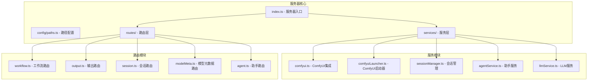
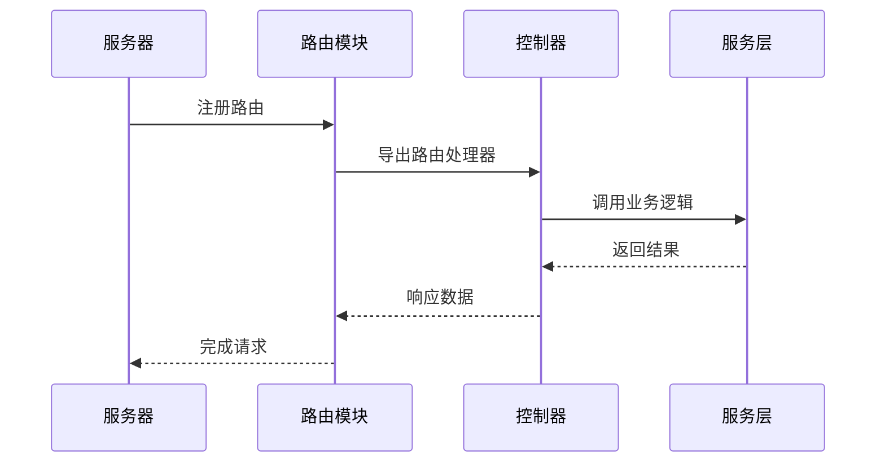
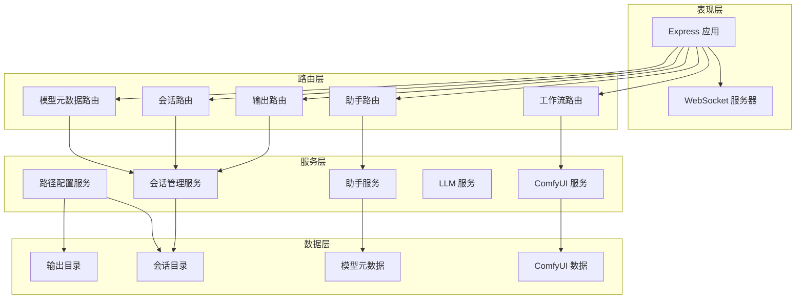
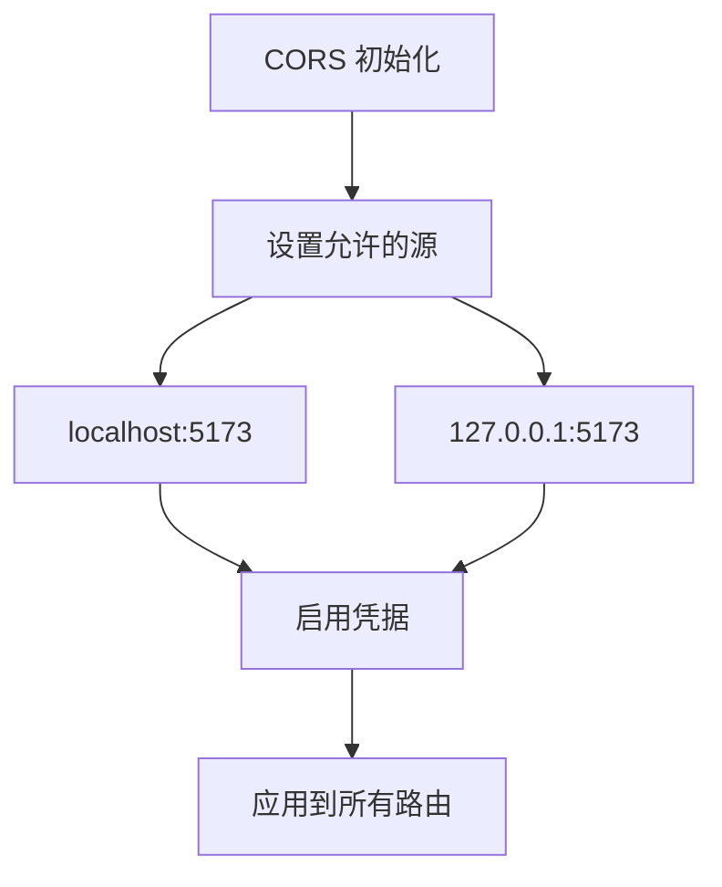
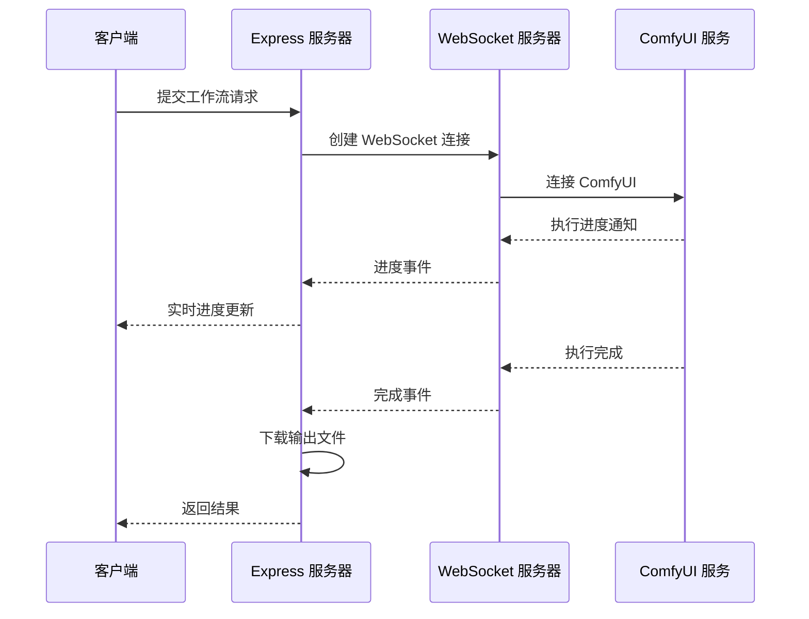
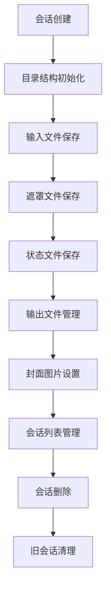
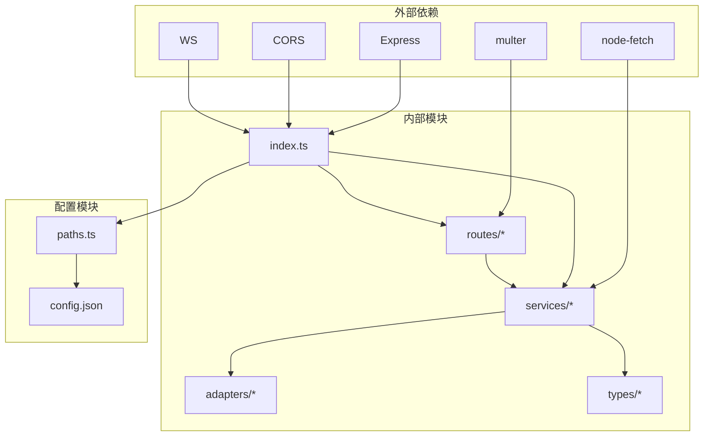
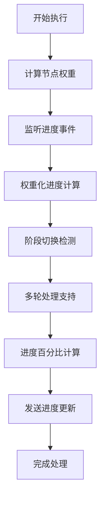

# Express 服务器配置

<cite>
**本文引用的文件**
- [server/src/index.ts](file://server/src/index.ts)
- [server/package.json](file://server/package.json)
- [server/src/config/paths.ts](file://server/src/config/paths.ts)
- [server/src/services/comfyuiLauncher.ts](file://server/src/services/comfyuiLauncher.ts)
- [server/src/services/comfyui.ts](file://server/src/services/comfyui.ts)
- [server/src/routes/workflow.ts](file://server/src/routes/workflow.ts)
- [server/src/routes/output.ts](file://server/src/routes/output.ts)
- [server/src/routes/session.ts](file://server/src/routes/session.ts)
- [server/src/routes/modelMeta.ts](file://server/src/routes/modelMeta.ts)
- [server/src/routes/agent.ts](file://server/src/routes/agent.ts)
- [server/src/services/sessionManager.ts](file://server/src/services/sessionManager.ts)
- [server/src/services/agentService.ts](file://server/src/services/agentService.ts)
- [server/src/services/llmService.ts](file://server/src/services/llmService.ts)
- [server/src/adapters/index.ts](file://server/src/adapters/index.ts)
- [server/src/types/index.ts](file://server/src/types/index.ts)
</cite>

## 目录
1. [简介](#简介)
2. [项目结构](#项目结构)
3. [核心组件](#核心组件)
4. [架构概览](#架构概览)
5. [详细组件分析](#详细组件分析)
6. [依赖关系分析](#依赖关系分析)
7. [性能考虑](#性能考虑)
8. [故障排除指南](#故障排除指南)
9. [结论](#结论)

## 简介

CorineKit Pix2Real Express 服务器是一个基于 Node.js 和 Express 的图像生成服务，集成了 ComfyUI 工作流引擎和 AI 助手功能。该服务器提供了完整的 API 接口，支持多种图像生成工作流、实时进度监控、会话管理和静态资源服务。

## 项目结构

服务器采用模块化设计，主要分为以下几个核心部分：

**图表来源**
- [server/src/index.ts:1-516](file://server/src/index.ts#L1-L516)
- [server/src/config/paths.ts:1-156](file://server/src/config/paths.ts#L1-L156)

**章节来源**
- [server/src/index.ts:1-516](file://server/src/index.ts#L1-L516)
- [server/package.json:1-28](file://server/package.json#L1-L28)

## 核心组件

### 服务器初始化流程

服务器启动时执行以下初始化步骤：

1. **CORS 配置**：允许本地开发环境访问
2. **中间件设置**：JSON 解析、文件上传处理
3. **目录检查**：确保输出目录、会话目录存在
4. **路由注册**：挂载所有 API 路由
5. **静态资源服务**：配置输出文件和会话文件服务
6. **ComfyUI 集成**：自动启动和连接 ComfyUI

### 路由注册机制

服务器采用模块化路由设计，每个功能模块都有独立的路由文件：

**图表来源**
- [server/src/index.ts:129-145](file://server/src/index.ts#L129-L145)
- [server/src/routes/workflow.ts:1-800](file://server/src/routes/workflow.ts#L1-L800)

**章节来源**
- [server/src/index.ts:118-145](file://server/src/index.ts#L118-L145)

## 架构概览

服务器采用分层架构设计，实现了清晰的关注点分离：

**图表来源**
- [server/src/index.ts:118-156](file://server/src/index.ts#L118-L156)
- [server/src/services/comfyui.ts:1-472](file://server/src/services/comfyui.ts#L1-L472)

## 详细组件分析

### CORS 配置分析

服务器使用 CORS 中间件配置跨域访问：

**图表来源**
- [server/src/index.ts:121-125](file://server/src/index.ts#L121-L125)

**章节来源**
- [server/src/index.ts:121-125](file://server/src/index.ts#L121-L125)

### 中间件设置

服务器配置了多种中间件来处理不同的请求类型：

| 中间件 | 类型 | 配置 | 用途 |
|--------|------|------|------|
| CORS | 跨域 | 允许本地开发源 | 处理跨域请求 |
| JSON | 请求解析 | 限制 50MB | 处理 JSON 请求体 |
| Multer | 文件上传 | 内存存储 | 处理图片上传 |
| 静态文件 | 文件服务 | 动态路径解析 | 提供静态资源 |

**章节来源**
- [server/src/index.ts:127-139](file://server/src/index.ts#L127-L139)

### 路由系统

服务器实现了 RESTful API 设计，支持以下主要路由：

#### 工作流路由
- `POST /api/workflow/:id/execute` - 执行图像生成工作流
- `GET /api/workflow/models/*` - 查询可用模型
- `POST /api/workflow/:id/ref-image` - 上传参考图片

#### 输出路由
- `GET /api/output/:workflowId` - 列出输出文件
- `GET /api/output/:workflowId/:filename` - 获取单个文件
- `POST /api/output/open-file` - 打开文件

#### 会话路由
- `POST /api/session/:sessionId/images` - 保存输入图片
- `POST /api/session/:sessionId/masks` - 保存遮罩
- `PUT /api/session/:sessionId/state` - 保存会话状态

#### 模型元数据路由
- `GET /api/models/metadata` - 获取元数据
- `POST /api/models/metadata/thumbnail` - 上传缩略图
- `POST /api/models/metadata/nickname` - 设置昵称

#### 助手路由
- `GET /api/agent/suggestions` - 获取建议
- `POST /api/agent/generate` - 生成图片

**章节来源**
- [server/src/routes/workflow.ts:152-800](file://server/src/routes/workflow.ts#L152-L800)
- [server/src/routes/output.ts:27-139](file://server/src/routes/output.ts#L27-L139)
- [server/src/routes/session.ts:21-163](file://server/src/routes/session.ts#L21-L163)
- [server/src/routes/modelMeta.ts:43-272](file://server/src/routes/modelMeta.ts#L43-L272)
- [server/src/routes/agent.ts:613-649](file://server/src/routes/agent.ts#L613-L649)

### ComfyUI 集成

服务器通过 WebSocket 与 ComfyUI 实现实时通信：

**图表来源**
- [server/src/index.ts:157-494](file://server/src/index.ts#L157-L494)
- [server/src/services/comfyui.ts:265-375](file://server/src/services/comfyui.ts#L265-L375)

**章节来源**
- [server/src/index.ts:157-494](file://server/src/index.ts#L157-L494)
- [server/src/services/comfyui.ts:1-472](file://server/src/services/comfyui.ts#L1-L472)

### 会话管理系统

服务器实现了完整的会话管理功能：

**图表来源**
- [server/src/services/sessionManager.ts:11-539](file://server/src/services/sessionManager.ts#L11-L539)

**章节来源**
- [server/src/services/sessionManager.ts:1-539](file://server/src/services/sessionManager.ts#L1-L539)

### 路径配置系统

服务器提供了灵活的路径配置机制：

| 配置项 | 默认值 | 描述 |
|--------|--------|------|
| sessionsBase | `projectRoot/sessions` | 会话数据根目录 |
| outputBase | `projectRoot/output` | 输出文件根目录 |
| modelMetaBase | `projectRoot/model_meta` | 模型元数据目录 |
| favoritesBase | `projectRoot/favorites` | 收藏文件目录 |

**章节来源**
- [server/src/config/paths.ts:70-156](file://server/src/config/paths.ts#L70-L156)

## 依赖关系分析

服务器的依赖关系体现了清晰的分层架构：

**图表来源**
- [server/package.json:11-26](file://server/package.json#L11-L26)
- [server/src/index.ts:1-18](file://server/src/index.ts#L1-L18)

**章节来源**
- [server/package.json:1-28](file://server/package.json#L1-L28)

## 性能考虑

### 进度追踪算法

服务器实现了复杂的进度追踪机制：

**图表来源**
- [server/src/index.ts:188-271](file://server/src/index.ts#L188-L271)

### 内存管理

服务器采用了多项内存优化策略：

1. **文件流处理**：避免大文件加载到内存
2. **缓存机制**：元数据缓存减少文件读取
3. **连接池**：WebSocket 连接复用
4. **垃圾回收**：及时清理临时数据

**章节来源**
- [server/src/index.ts:188-271](file://server/src/index.ts#L188-L271)

## 故障排除指南

### 常见问题及解决方案

#### ComfyUI 启动失败
- **症状**：服务器启动后 ComfyUI 无法连接
- **原因**：ComfyUI 路径配置错误或进程启动失败
- **解决方案**：
  1. 检查 `COMFYUI_PATH` 环境变量
  2. 验证 ComfyUI 安装目录完整性
  3. 查看启动日志获取详细错误信息

#### 跨域请求失败
- **症状**：前端请求被浏览器阻止
- **原因**：CORS 配置不正确
- **解决方案**：
  1. 确认客户端地址在允许列表中
  2. 检查凭据设置
  3. 验证预检请求处理

#### 文件上传失败
- **症状**：图片上传返回 400 错误
- **原因**：文件格式不支持或大小超限
- **解决方案**：
  1. 检查文件格式是否在允许列表中
  2. 确认文件大小不超过限制
  3. 验证磁盘空间充足

#### WebSocket 连接中断
- **症状**：进度更新丢失
- **原因**：网络不稳定或连接超时
- **解决方案**：
  1. 检查网络连接稳定性
  2. 增加连接超时时间
  3. 实现重连机制

**章节来源**
- [server/src/services/comfyuiLauncher.ts:101-131](file://server/src/services/comfyuiLauncher.ts#L101-L131)
- [server/src/index.ts:121-125](file://server/src/index.ts#L121-L125)

## 结论

CorineKit Pix2Real Express 服务器展现了优秀的架构设计和实现质量。通过模块化的设计、清晰的分层架构和完善的错误处理机制，该服务器能够稳定地提供图像生成服务。

### 主要优势

1. **模块化设计**：每个功能模块职责明确，易于维护和扩展
2. **实时通信**：WebSocket 实现实时进度反馈
3. **灵活配置**：支持动态路径配置和会话管理
4. **性能优化**：多项内存和网络优化策略
5. **错误处理**：完善的异常处理和故障恢复机制

### 改进建议

1. **监控系统**：添加详细的性能指标监控
2. **日志管理**：实现结构化日志记录
3. **安全增强**：添加请求验证和速率限制
4. **文档完善**：补充 API 文档和使用示例

该服务器为图像生成应用提供了一个强大而灵活的基础设施，为后续的功能扩展奠定了良好的基础。