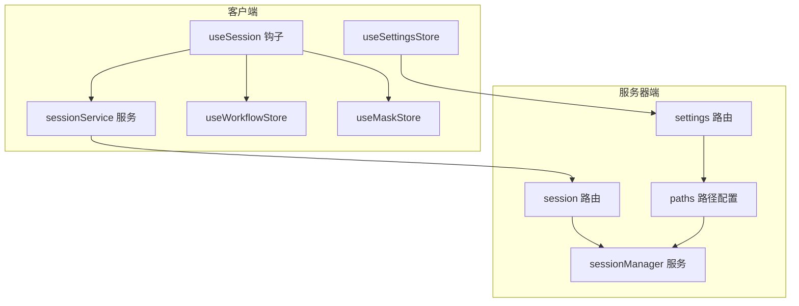
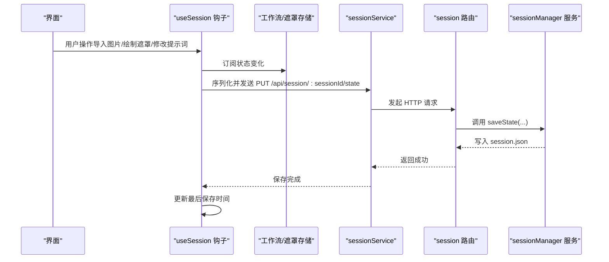
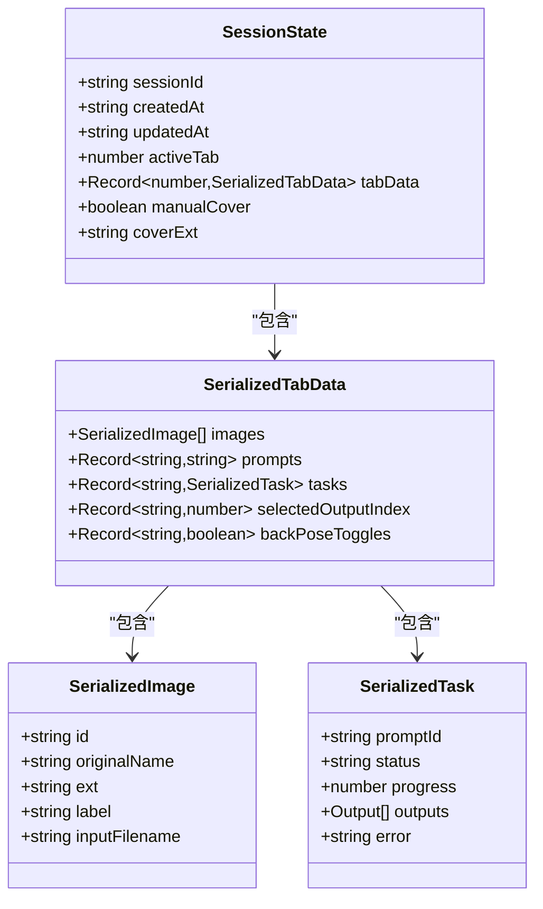

# 会话管理系统

<cite>
**本文引用的文件**
- [sessionManager.ts](file://server/src/services/sessionManager.ts)
- [session.ts](file://server/src/routes/session.ts)
- [paths.ts](file://server/src/config/paths.ts)
- [settings.ts](file://server/src/routes/settings.ts)
- [useSession.ts](file://client/src/hooks/useSession.ts)
- [sessionService.ts](file://client/src/services/sessionService.ts)
- [useSettingsStore.ts](file://client/src/hooks/useSettingsStore.ts)
- [useWorkflowStore.ts](file://client/src/hooks/useWorkflowStore.ts)
- [useMaskStore.ts](file://client/src/hooks/useMaskStore.ts)
- [index.ts](file://client/src/types/index.ts)
- [TODO-session-persistence.md](file://TODO-session-persistence.md)
</cite>

## 目录
1. [简介](#简介)
2. [项目结构](#项目结构)
3. [核心组件](#核心组件)
4. [架构总览](#架构总览)
5. [详细组件分析](#详细组件分析)
6. [依赖关系分析](#依赖关系分析)
7. [性能考量](#性能考量)
8. [故障排查指南](#故障排查指南)
9. [结论](#结论)
10. [附录](#附录)

## 简介
本文件为 CorineKit Pix2Real 会话管理系统的技术文档，聚焦于会话状态管理、多标签页状态持久化、会话数据存储与恢复、会话文件组织结构、会话配置管理、会话生命周期管理、数据模型与文件系统操作以及错误处理策略，并提供最佳实践与性能优化建议。系统采用前后端分离设计：前端负责事件驱动的自动保存、状态序列化与 UI 恢复；后端负责会话目录结构管理、文件写入与读取、会话元数据维护与清理。

## 项目结构
- 服务器端（Node.js + Express）
  - 会话管理服务：负责会话目录、输入图像、遮罩、任务输出、会话状态 JSON 的读写与清理
  - 路由层：暴露会话与设置相关的 API
  - 路径配置：集中管理 sessions 根目录、默认路径与运行时切换
- 客户端（React + Zustand）
  - 会话钩子：负责会话 ID 生成与持久化、自动保存、页面卸载前保存、会话恢复
  - 会话服务：对后端 API 的类型化封装
  - 设置存储：本地持久化用户设置，包含会话路径的远程同步
  - 工作流与遮罩存储：承载会话状态的数据容器，配合会话钩子进行序列化与恢复

图表来源
- [useSession.ts:118-435](file://client/src/hooks/useSession.ts#L118-L435)
- [sessionService.ts:1-232](file://client/src/services/sessionService.ts#L1-L232)
- [session.ts:1-163](file://server/src/routes/session.ts#L1-L163)
- [sessionManager.ts:1-539](file://server/src/services/sessionManager.ts#L1-L539)
- [paths.ts:1-156](file://server/src/config/paths.ts#L1-L156)
- [settings.ts:1-106](file://server/src/routes/settings.ts#L1-L106)

章节来源
- [TODO-session-persistence.md:1-120](file://TODO-session-persistence.md#L1-L120)

## 核心组件
- 会话状态模型
  - 会话状态包含 sessionId、创建时间、更新时间、活动标签页、各标签页数据、封面信息等
  - 标签页数据包含图片数组、提示词映射、任务映射、选中输出索引、姿态切换等
- 会话文件组织
  - 每个会话目录包含 session.json 与多个 tab-n 子目录，每个 tab-n 包含 input、masks、output 三个子目录
  - 输入图像与遮罩以文件形式落盘，任务输出 URL 记录在 session.json 中
- 会话配置管理
  - 支持运行时切换 sessions 根目录，具备路径合法性校验与写权限探测
  - 设置项通过本地存储与后端设置接口双向同步
- 生命周期管理
  - 创建：生成会话 ID 并初始化空状态
  - 更新：事件驱动自动保存、页面卸载前保存
  - 删除：删除会话目录或在空会话时清理
  - 清理：按更新时间保留最近若干会话

章节来源
- [sessionManager.ts:66-133](file://server/src/services/sessionManager.ts#L66-L133)
- [paths.ts:74-100](file://server/src/config/paths.ts#L74-L100)
- [useSession.ts:118-435](file://client/src/hooks/useSession.ts#L118-L435)

## 架构总览
会话系统采用“事件驱动 + 路由层 + 服务层”的分层架构：
- 前端通过 useSession 钩子订阅工作流与遮罩状态变化，自动触发保存
- sessionService 将状态序列化并通过 PUT /api/session/:sessionId/state 写入后端
- 后端 sessionManager 负责确保目录存在、写入 session.json、读取与列出会话、删除与清理
- 路由层提供会话与设置 API，settings 路由负责 sessionsBase 的读取与更新
- paths.ts 提供 sessions 根目录的集中管理与运行时切换能力

图表来源
- [useSession.ts:168-179](file://client/src/hooks/useSession.ts#L168-L179)
- [sessionService.ts:122-132](file://client/src/services/sessionService.ts#L122-L132)
- [session.ts:56-71](file://server/src/routes/session.ts#L56-L71)
- [sessionManager.ts:102-122](file://server/src/services/sessionManager.ts#L102-L122)

## 详细组件分析

### 会话状态模型与序列化
- 会话状态结构
  - sessionId、createdAt、updatedAt、activeTab、tabData、封面标记与扩展名
  - tabData 中包含 images、prompts、tasks、selectedOutputIndex、backPoseToggles 等
- 序列化策略
  - 前端将 File 对象排除，仅序列化必要字段，避免二进制数据进入 JSON
  - 任务输出 URL 与文件名在 session.json 中记录，避免重复上传
- 数据一致性
  - 保存前确保会话目录存在，读取时解析失败返回空状态
  - 重命名卡资产时，先做冲突检测，再批量应用，保证原子性

章节来源
- [sessionManager.ts:66-133](file://server/src/services/sessionManager.ts#L66-L133)
- [sessionService.ts:69-86](file://client/src/services/sessionService.ts#L69-L86)
- [useSession.ts:140-166](file://client/src/hooks/useSession.ts#L140-L166)

### 会话文件组织与存储
- 目录结构
  - sessions/<sessionId>/session.json
  - sessions/<sessionId>/tab-0/input/
  - sessions/<sessionId>/tab-0/masks/
  - sessions/<sessionId>/tab-0/output/
  - 其他 tab-n 目录同理
- 文件写入
  - 输入图像：保存到 input/，返回可访问 URL
  - 遮罩：保存到 masks/，键名替换冒号为下划线以兼容 Windows
  - 输出文件：不复制到会话目录，仅记录 URL 与文件名
- 资产重命名
  - 输入文件重命名为 {label}_raw{ext}
  - 输出文件按顺序重命名为 {label}_1{ext}、{label}_2{ext}...
  - 重命名前后均更新 session.json，确保 UI 与文件系统一致

章节来源
- [sessionManager.ts:22-62](file://server/src/services/sessionManager.ts#L22-L62)
- [sessionManager.ts:256-360](file://server/src/services/sessionManager.ts#L256-L360)
- [sessionManager.ts:381-538](file://server/src/services/sessionManager.ts#L381-L538)

### 会话配置管理
- 路径配置
  - 默认 sessions 根目录位于项目根下的 sessions
  - 支持通过设置接口切换为绝对路径，或恢复默认
  - 路径合法性校验：非空、绝对路径、不可写检测、禁止嵌套在 tab 子目录下
- 设置同步
  - 前端设置存储通过 /api/settings 读取与更新 sessionsBase
  - 本地存储与后端配置联动，确保跨标签页一致

章节来源
- [paths.ts:70-100](file://server/src/config/paths.ts#L70-L100)
- [paths.ts:106-137](file://server/src/config/paths.ts#L106-L137)
- [settings.ts:21-67](file://server/src/routes/settings.ts#L21-L67)
- [useSettingsStore.ts:140-175](file://client/src/hooks/useSettingsStore.ts#L140-L175)

### 会话生命周期管理
- 创建
  - 首次访问生成 UUID 作为 sessionId，写入本地存储
  - 初始化工作流与遮罩存储为空状态
- 更新
  - 导入图片：异步上传至 input/，成功后更新 sessionUrl
  - 遮罩绘制：完成时上传至 masks/
  - 提示词与任务状态：500ms 防抖保存
  - 页面卸载：使用 sendBeacon 发送最后一次状态
- 删除
  - 显式删除会话目录
  - 空会话返回欢迎页时自动清理
- 清理
  - 按更新时间倒序列出会话，保留最近若干个

章节来源
- [useSession.ts:27-38](file://client/src/hooks/useSession.ts#L27-L38)
- [useSession.ts:168-179](file://client/src/hooks/useSession.ts#L168-L179)
- [useSession.ts:410-431](file://client/src/hooks/useSession.ts#L410-L431)
- [session.ts:108-113](file://server/src/routes/session.ts#L108-L113)
- [sessionManager.ts:145-172](file://server/src/services/sessionManager.ts#L145-L172)

### 会话恢复与多标签页状态
- 恢复流程
  - 从 /api/session/:sessionId 获取 session.json
  - 逐标签页重建 ImageItem：通过 /api/session-files/ 下载文件为 File，生成 Blob URL
  - 重建遮罩：按 maskKey 与安全名称探测 masks/ 下的 PNG 文件
  - 恢复工作流与遮罩存储，设置最后保存时间
- 多标签页状态
  - activeTab 记录当前活动标签页
  - tabData 为 Record<number, SerializedTabData>，支持 0..10 标签页
  - 遮罩键名包含输出索引，区分不同模式下的遮罩来源

章节来源
- [session.ts:73-82](file://server/src/routes/session.ts#L73-L82)
- [useSession.ts:310-396](file://client/src/hooks/useSession.ts#L310-L396)
- [useSession.ts:352-367](file://client/src/hooks/useSession.ts#L352-L367)

### 会话重命名与批处理
- 单卡重命名
  - 校验标签页与任务状态，避免任务进行中重命名
  - 冲突检测：目标文件已存在且非自身旧文件则拒绝
  - 成功后更新 session.json 中的 label、inputFilename、outputs
- 批量重命名
  - 先做全量预检：标签页存在、任务状态、批内与现有文件冲突
  - 通过后一次性执行所有重命名并持久化，保证原子性
  - 任一步骤失败则回滚，保持文件系统不变

章节来源
- [sessionManager.ts:256-360](file://server/src/services/sessionManager.ts#L256-L360)
- [sessionManager.ts:381-538](file://server/src/services/sessionManager.ts#L381-L538)

### 错误处理策略
- 前端
  - 保存失败：控制台警告，不中断用户操作
  - 恢复失败：降级到启动行为设置，显示欢迎页
  - 上传失败：记录警告，稍后重试或手动重试
- 后端
  - 路由层对必填参数进行校验，返回明确错误信息
  - 文件系统异常：抛出错误并返回 400/500
  - 路径配置：校验失败返回 400，写入失败返回 500

章节来源
- [useSession.ts:176-178](file://client/src/hooks/useSession.ts#L176-L178)
- [useSession.ts:388-396](file://client/src/hooks/useSession.ts#L388-L396)
- [session.ts:28-31](file://server/src/routes/session.ts#L28-L31)
- [session.ts:125-131](file://server/src/routes/session.ts#L125-L131)

## 依赖关系分析

图表来源
- [sessionManager.ts:66-100](file://server/src/services/sessionManager.ts#L66-L100)

章节来源
- [sessionManager.ts:66-100](file://server/src/services/sessionManager.ts#L66-L100)

## 性能考量
- 事件驱动保存
  - 图片导入、遮罩绘制、提示词变更均触发防抖保存，减少频繁 IO
  - 页面卸载使用 sendBeacon，避免长时间阻塞
- 文件系统优化
  - 输入图像与遮罩直接落盘，避免大体积二进制数据在内存中驻留
  - 输出文件 URL 记录而非复制，节省磁盘空间
- 目录与路径
  - 运行时切换 sessions 根目录需确保目录存在与可写，避免启动时反复探测
  - 路径校验前置，减少无效 IO
- 批量操作
  - 批量重命名先做全量冲突检测，避免部分应用导致的不一致与多次 IO

章节来源
- [useSession.ts:181-185](file://client/src/hooks/useSession.ts#L181-L185)
- [sessionManager.ts:381-538](file://server/src/services/sessionManager.ts#L381-L538)
- [paths.ts:123-136](file://server/src/config/paths.ts#L123-L136)

## 故障排查指南
- 无法保存会话
  - 检查 sessions 根目录是否存在且可写
  - 查看后端日志中的路径配置与写入错误
- 会话恢复失败
  - 确认 session.json 是否存在且格式正确
  - 检查 input/ 与 masks/ 下的文件是否存在
- 重命名失败
  - 确认目标文件名未被占用
  - 确认任务状态为空闲或已完成，避免重命名与任务输出写入冲突
- 路径切换无效
  - 确认传入的是绝对路径
  - 确认路径不在 tab 子目录内部
  - 确认具有写权限

章节来源
- [paths.ts:106-137](file://server/src/config/paths.ts#L106-L137)
- [sessionManager.ts:276-281](file://server/src/services/sessionManager.ts#L276-L281)
- [sessionManager.ts:459-482](file://server/src/services/sessionManager.ts#L459-L482)

## 结论
Pix2Real 会话管理系统通过清晰的分层设计与事件驱动的自动保存机制，实现了多标签页状态的可靠持久化与恢复。其文件组织结构简洁明了，路径配置支持运行时切换，配合严格的校验与错误处理策略，确保了系统的稳定性与可维护性。建议在生产环境中结合监控与日志，持续优化保存频率与路径选择体验。

## 附录
- 最佳实践
  - 使用防抖保存策略，避免频繁 IO
  - 在任务执行期间避免重命名卡资产，防止竞态
  - 定期清理旧会话，控制磁盘占用
  - 路径切换前进行合法性校验与写权限探测
- 性能优化建议
  - 对大文件上传采用分块或后台队列
  - 对高频状态变更合并保存批次
  - 对遮罩与输出文件采用增量备份策略