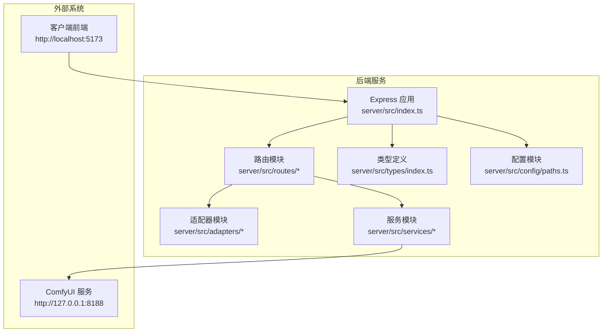
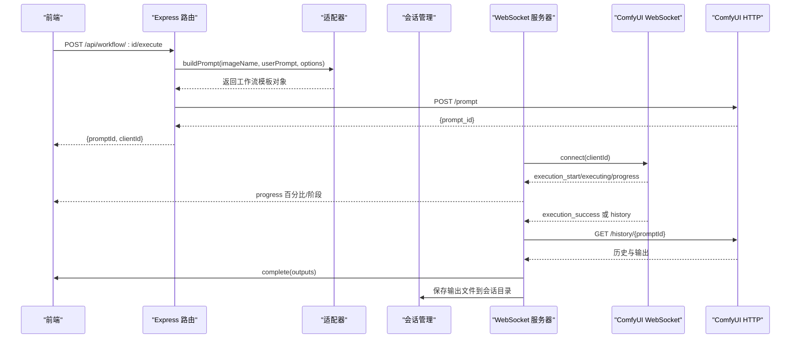
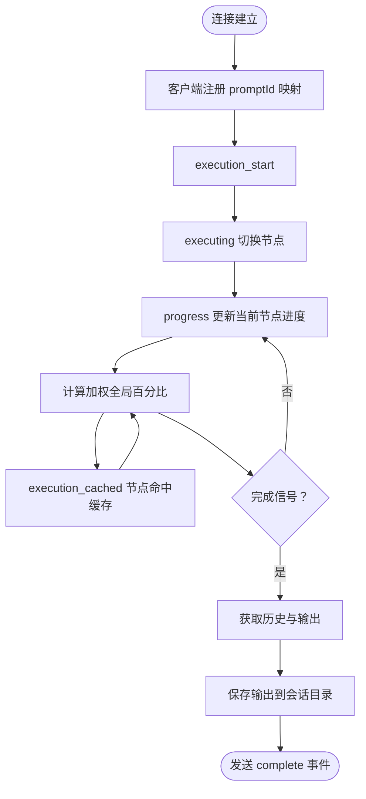
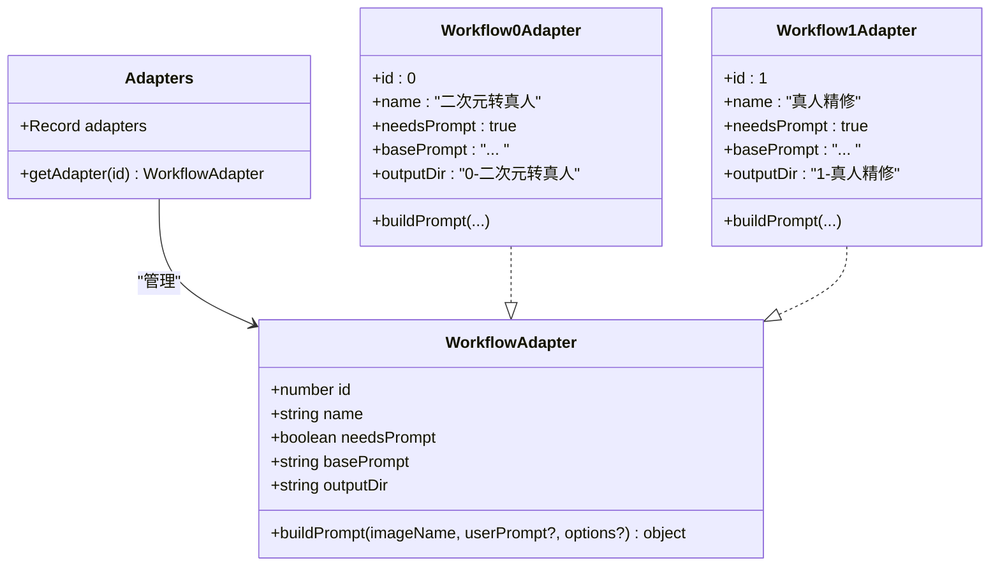
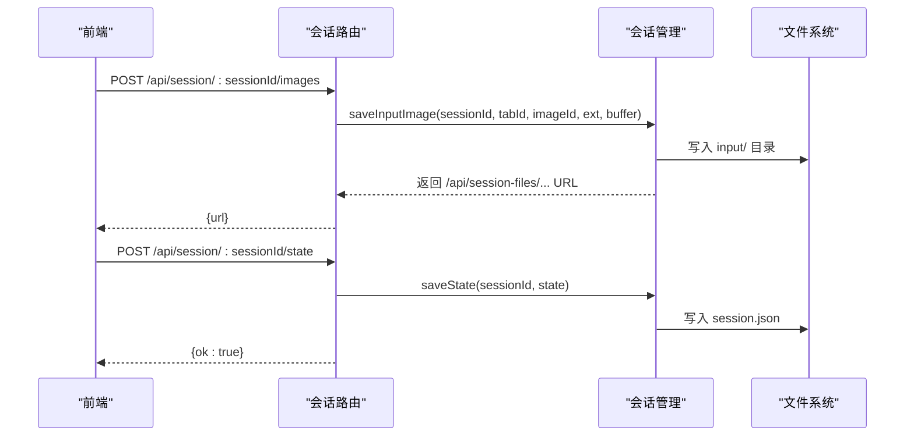
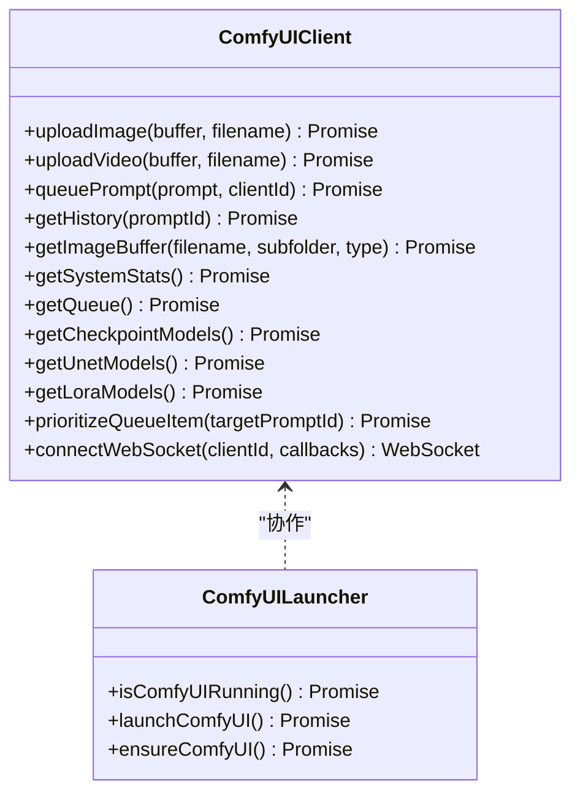
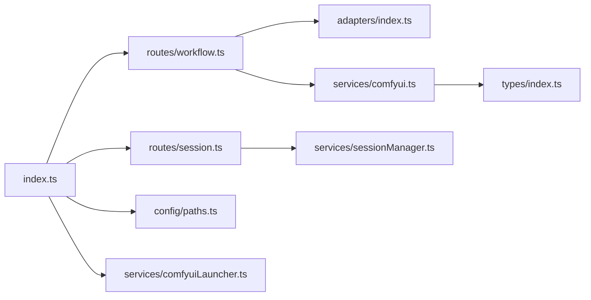

# 后端服务架构

<cite>
**本文引用的文件**
- [server/src/index.ts](file://server/src/index.ts)
- [server/package.json](file://server/package.json)
- [README.md](file://README.md)
- [server/src/adapters/BaseAdapter.ts](file://server/src/adapters/BaseAdapter.ts)
- [server/src/adapters/index.ts](file://server/src/adapters/index.ts)
- [server/src/adapters/Workflow0Adapter.ts](file://server/src/adapters/Workflow0Adapter.ts)
- [server/src/adapters/Workflow1Adapter.ts](file://server/src/adapters/Workflow1Adapter.ts)
- [server/src/routers/workflow.ts](file://server/src/routes/workflow.ts)
- [server/src/routers/session.ts](file://server/src/routes/session.ts)
- [server/src/services/comfyui.ts](file://server/src/services/comfyui.ts)
- [server/src/services/comfyuiLauncher.ts](file://server/src/services/comfyuiLauncher.ts)
- [server/src/services/sessionManager.ts](file://server/src/services/sessionManager.ts)
- [server/src/config/paths.ts](file://server/src/config/paths.ts)
- [server/src/types/index.ts](file://server/src/types/index.ts)
- [TODO-session-persistence.md](file://TODO-session-persistence.md)
</cite>

## 目录
1. [简介](#简介)
2. [项目结构](#项目结构)
3. [核心组件](#核心组件)
4. [架构总览](#架构总览)
5. [详细组件分析](#详细组件分析)
6. [依赖关系分析](#依赖关系分析)
7. [性能考量](#性能考量)
8. [故障排查指南](#故障排查指南)
9. [结论](#结论)
10. [附录](#附录)

## 简介
本项目为 CorineKit Pix2Real 的后端服务，基于 Express 提供 REST API，并通过 WebSocket 与 ComfyUI 实时通信，实现工作流编排、进度回传与输出下载。后端采用适配器模式为多种工作流提供模板化参数注入；通过会话管理实现多标签页状态持久化与恢复；通过路径配置中心化管理可运行时切换数据目录。

## 项目结构
后端位于 server/src，主要模块包括：
- 入口与路由：Express 应用、WebSocket 服务器、静态资源与路由注册
- 适配器：按工作流 ID 维护模板与参数构建逻辑
- 服务层：ComfyUI HTTP/WebSocket 客户端、会话管理、ComfyUI 启动器
- 类型定义：统一的接口与事件类型
- 配置：集中化路径与配置管理

图表来源
- [server/src/index.ts:118-145](file://server/src/index.ts#L118-L145)
- [server/src/routes/workflow.ts:1-30](file://server/src/routes/workflow.ts#L1-L30)
- [server/src/services/comfyui.ts:1-20](file://server/src/services/comfyui.ts#L1-L20)
- [server/src/config/paths.ts:1-156](file://server/src/config/paths.ts#L1-L156)

章节来源
- [README.md:41-79](file://README.md#L41-L79)
- [server/src/index.ts:118-145](file://server/src/index.ts#L118-L145)

## 核心组件
- Express 服务器与中间件：CORS、JSON 解析、静态资源托管
- WebSocket 服务器：与 ComfyUI 建立连接，中继进度、完成与错误事件
- 路由系统：工作流执行、输出访问、会话管理、模型元数据、代理等
- 适配器系统：按工作流 ID 加载模板并注入参数
- 会话管理：会话目录、输入/输出/遮罩文件、状态快照与封面
- ComfyUI 集成：HTTP 客户端、WebSocket 客户端、队列与系统状态查询
- 路径与配置：集中化路径解析、运行时覆盖与校验

章节来源
- [server/src/index.ts:118-145](file://server/src/index.ts#L118-L145)
- [server/src/services/comfyui.ts:168-196](file://server/src/services/comfyui.ts#L168-L196)
- [server/src/services/sessionManager.ts:102-133](file://server/src/services/sessionManager.ts#L102-L133)
- [server/src/config/paths.ts:35-100](file://server/src/config/paths.ts#L35-L100)

## 架构总览
后端以 Express 为核心，提供 REST API 并托管静态资源；同时启动 WebSocket 服务器，将浏览器客户端与 ComfyUI 的 WebSocket 事件桥接。会话管理模块负责将用户操作持久化到磁盘，支持多标签页隔离与跨页面恢复。

图表来源
- [server/src/routes/workflow.ts:750-799](file://server/src/routes/workflow.ts#L750-L799)
- [server/src/services/comfyui.ts:265-375](file://server/src/services/comfyui.ts#L265-L375)
- [server/src/index.ts:157-494](file://server/src/index.ts#L157-L494)
- [server/src/services/sessionManager.ts:37-48](file://server/src/services/sessionManager.ts#L37-L48)

## 详细组件分析

### Express 服务器与路由系统
- 中间件与静态资源
  - CORS 仅允许本地开发源
  - JSON 解析限制为 50MB
  - 静态资源：输出目录、会话目录、模型元数据目录
- 路由注册
  - 工作流相关：/api/workflow/*
  - 输出访问：/api/output/*
  - 会话管理：/api/session/*
  - 模型元数据：/api/models/*
  - 代理与收藏：/api/agent、/api/favorites、/favorites
- 状态查询
  - /api/comfyui/status 查询 ComfyUI 运行状态

章节来源
- [server/src/index.ts:121-145](file://server/src/index.ts#L121-L145)
- [server/src/index.ts:147-155](file://server/src/index.ts#L147-L155)

### WebSocket 集成与进度转发
- 客户端连接
  - 为每个浏览器客户端生成唯一 clientId
  - 建立与 ComfyUI 的 WebSocket 连接
- 事件缓冲与重放
  - 为每个 promptId 维护事件缓冲，客户端注册后重放
- 全局进度计算
  - 基于节点权重与当前节点内部进度，计算加权全局百分比
  - 支持多轮节点（如 UltimateSDUpscale）与 tiled 采样器
- 完成与错误处理
  - 等待历史写入完成，避免“完成但空输出”问题
  - 下载输出到会话目录，清理临时状态

图表来源
- [server/src/index.ts:187-448](file://server/src/index.ts#L187-L448)
- [server/src/services/comfyui.ts:265-375](file://server/src/services/comfyui.ts#L265-L375)

章节来源
- [server/src/index.ts:157-494](file://server/src/index.ts#L157-L494)

### 适配器模式与工作流模板
- 设计原则
  - 每个工作流一个适配器，暴露 id、name、needsPrompt、basePrompt、outputDir 与 buildPrompt
  - 通过 JSON 模板文件加载，仅修改必要节点（如图像名、提示词、种子）
- 适配器注册
  - 以数字 ID 为键，集中管理与查找
- 典型实现
  - Workflow0Adapter：二次元转真人，注入提示词与随机种子
  - Workflow1Adapter：真人精修，注入正向提示词与随机种子

图表来源
- [server/src/types/index.ts:1-8](file://server/src/types/index.ts#L1-L8)
- [server/src/adapters/index.ts:14-30](file://server/src/adapters/index.ts#L14-L30)
- [server/src/adapters/Workflow0Adapter.ts:9-34](file://server/src/adapters/Workflow0Adapter.ts#L9-L34)
- [server/src/adapters/Workflow1Adapter.ts:9-35](file://server/src/adapters/Workflow1Adapter.ts#L9-L35)

章节来源
- [server/src/adapters/BaseAdapter.ts:1-4](file://server/src/adapters/BaseAdapter.ts#L1-L4)
- [server/src/adapters/index.ts:1-33](file://server/src/adapters/index.ts#L1-L33)
- [server/src/adapters/Workflow0Adapter.ts:1-35](file://server/src/adapters/Workflow0Adapter.ts#L1-L35)
- [server/src/adapters/Workflow1Adapter.ts:1-36](file://server/src/adapters/Workflow1Adapter.ts#L1-L36)

### 会话管理系统
- 目录结构
  - sessions/{sessionId}/tab-{tabId}/{input|masks|output}/
- 数据持久化
  - 输入图：上传并保存到 input/
  - 遮罩：保存到 masks/，键名兼容 Windows 文件系统
  - 输出：下载到 output/ 并返回会话 URL
  - 状态：序列化 session.json，包含活动标签、图像列表、提示词、任务进度与封面
- API
  - 上传输入图、上传遮罩、保存/加载会话、列出会话、删除会话、设置封面、重命名卡片资产
- 路径与配置
  - sessionsBase 可运行时覆盖，支持绝对路径校验与写权限探测

图表来源
- [server/src/routes/session.ts:21-82](file://server/src/routes/session.ts#L21-L82)
- [server/src/services/sessionManager.ts:22-48](file://server/src/services/sessionManager.ts#L22-L48)
- [server/src/services/sessionManager.ts:102-133](file://server/src/services/sessionManager.ts#L102-L133)
- [server/src/config/paths.ts:74-100](file://server/src/config/paths.ts#L74-L100)

章节来源
- [server/src/routes/session.ts:1-163](file://server/src/routes/session.ts#L1-L163)
- [server/src/services/sessionManager.ts:1-539](file://server/src/services/sessionManager.ts#L1-L539)
- [server/src/config/paths.ts:1-156](file://server/src/config/paths.ts#L1-L156)
- [TODO-session-persistence.md:1-120](file://TODO-session-persistence.md#L1-L120)

### 与 ComfyUI 的集成层
- HTTP 客户端
  - 上传图像/视频、入队工作流、获取历史、系统状态、队列管理、模型列表
- WebSocket 客户端
  - 连接、事件监听、去重完成信号、错误处理、执行缓存节点统计
- 启动器
  - 自动检测与启动 ComfyUI，等待就绪

图表来源
- [server/src/services/comfyui.ts:9-472](file://server/src/services/comfyui.ts#L9-L472)
- [server/src/services/comfyuiLauncher.ts:24-131](file://server/src/services/comfyuiLauncher.ts#L24-L131)

章节来源
- [server/src/services/comfyui.ts:1-472](file://server/src/services/comfyui.ts#L1-L472)
- [server/src/services/comfyuiLauncher.ts:1-131](file://server/src/services/comfyuiLauncher.ts#L1-L131)

### RESTful API 接口规范（节选）
- 工作流执行
  - POST /api/workflow/:id/execute：通用执行（支持图片/视频）
  - POST /api/workflow/0/execute：二次元转真人
  - POST /api/workflow/2/execute：精修放大
  - POST /api/workflow/5/execute：解除装备（需图像与遮罩）
  - POST /api/workflow/7/execute：快速出图（文本生图）
  - POST /api/workflow/8/execute：黑兽换脸（目标图+人脸图）
  - POST /api/workflow/9/execute：ZIT快出（UNet+LoRA）
  - POST /api/workflow/10/execute：区域编辑（需图像与遮罩）
- 模型列表
  - GET /api/workflow/models/checkpoints
  - GET /api/workflow/models/unets
  - GET /api/workflow/models/loras
- 参考图管理（ZIT）
  - POST /api/workflow/7/ref-image
  - GET /api/workflow/7/ref-image/:filename
  - DELETE /api/workflow/7/ref-image/:filename
- 会话管理
  - POST /api/session/:sessionId/images
  - POST /api/session/:sessionId/masks
  - PUT /api/session/:sessionId/state
  - POST /api/session/:sessionId/state
  - GET /api/session/:sessionId
  - GET /api/sessions
  - DELETE /api/session/:sessionId
  - POST /api/session/:sessionId/cover
  - POST /api/session/:sessionId/rename-card
  - POST /api/session/:sessionId/rename-cards-batch
- 输出与静态资源
  - GET /api/output/:...（由 Express 静态路由提供）
  - GET /api/session-files/...（动态指向 sessionsBase）
  - GET /model_meta/...（模型元数据）
- ComfyUI 状态
  - GET /api/comfyui/status

章节来源
- [server/src/routes/workflow.ts:152-800](file://server/src/routes/workflow.ts#L152-L800)
- [server/src/routes/session.ts:1-163](file://server/src/routes/session.ts#L1-L163)
- [server/src/index.ts:134-145](file://server/src/index.ts#L134-L145)

## 依赖关系分析
- 模块耦合
  - index.ts 依赖路由、服务与配置模块，承担编排职责
  - 路由依赖适配器与服务层
  - 服务层依赖类型定义与配置
- 外部依赖
  - Express、CORS、WS、node-fetch、multer、form-data
- 潜在风险
  - 路径覆盖与权限校验需严格验证
  - WebSocket 事件去重与完成信号优先级需稳定

图表来源
- [server/src/index.ts:8-18](file://server/src/index.ts#L8-L18)
- [server/src/routes/workflow.ts:9-14](file://server/src/routes/workflow.ts#L9-L14)
- [server/src/routes/session.ts:4-16](file://server/src/routes/session.ts#L4-L16)
- [server/src/services/comfyui.ts:1-4](file://server/src/services/comfyui.ts#L1-L4)
- [server/src/services/sessionManager.ts:1-7](file://server/src/services/sessionManager.ts#L1-L7)
- [server/src/config/paths.ts:1-7](file://server/src/config/paths.ts#L1-L7)
- [server/src/services/comfyuiLauncher.ts:1-5](file://server/src/services/comfyuiLauncher.ts#L1-L5)

章节来源
- [server/src/index.ts:1-516](file://server/src/index.ts#L1-L516)
- [server/src/routes/workflow.ts:1-800](file://server/src/routes/workflow.ts#L1-L800)
- [server/src/routes/session.ts:1-163](file://server/src/routes/session.ts#L1-L163)
- [server/src/services/comfyui.ts:1-472](file://server/src/services/comfyui.ts#L1-L472)
- [server/src/services/sessionManager.ts:1-539](file://server/src/services/sessionManager.ts#L1-L539)
- [server/src/config/paths.ts:1-156](file://server/src/config/paths.ts#L1-L156)
- [server/src/services/comfyuiLauncher.ts:1-131](file://server/src/services/comfyuiLauncher.ts#L1-L131)

## 性能考量
- WebSocket 事件缓冲与重放：减少首包延迟导致的进度丢失
- 节点权重与阶段性进度：提升用户体验，避免线性进度误导
- 多轮与 tiled 采样器处理：使用 tick 计数与估计 tile 数，避免进度回退
- 历史写入等待：在 completion 前确保 ComfyUI 已提交历史，降低“完成但空输出”的概率
- 路径覆盖与目录预创建：避免运行时 IO 异常

章节来源
- [server/src/index.ts:175-185](file://server/src/index.ts#L175-L185)
- [server/src/index.ts:240-271](file://server/src/index.ts#L240-L271)
- [server/src/index.ts:335-371](file://server/src/index.ts#L335-L371)
- [server/src/services/comfyui.ts:131-144](file://server/src/services/comfyui.ts#L131-L144)
- [server/src/services/comfyui.ts:286-290](file://server/src/services/comfyui.ts#L286-L290)

## 故障排查指南
- ComfyUI 未运行
  - 使用 /api/comfyui/status 检查状态
  - 后端会尝试自动启动，若失败请手动启动并确认端口
- 上传失败
  - 检查 /upload/image 接口返回，确认文件类型与大小限制
- 进度异常
  - 确认 WebSocket 连接正常，关注 execution_start/executing/progress 顺序
  - 多轮与 tiled 节点的 tick 计数可能造成进度波动
- 完成但无输出
  - 后端会等待历史写入完成，若仍为空，检查 ComfyUI 输出目录与文件权限
- 会话保存失败
  - 确认 sessionsBase 路径可写，避免嵌套在 tab 子目录

章节来源
- [server/src/index.ts:147-155](file://server/src/index.ts#L147-L155)
- [server/src/services/comfyui.ts:168-196](file://server/src/services/comfyui.ts#L168-L196)
- [server/src/services/comfyui.ts:335-354](file://server/src/services/comfyui.ts#L335-L354)
- [server/src/services/comfyuiLauncher.ts:101-131](file://server/src/services/comfyuiLauncher.ts#L101-L131)
- [server/src/config/paths.ts:106-137](file://server/src/config/paths.ts#L106-L137)

## 结论
本后端服务通过适配器模式将多种工作流模板化，结合会话管理实现多标签页状态持久化，并通过 WebSocket 与 ComfyUI 紧密集成，提供实时进度与可靠完成事件。路径配置中心化与严格的权限校验提升了部署灵活性与安全性。建议在生产环境中增加鉴权与速率限制，并完善日志与监控体系。

## 附录
- 集成示例（概念性）
  - 前端发起工作流执行，后端返回 promptId 与 clientId
  - 前端建立 WebSocket 连接，注册 promptId 映射
  - 后端中继进度事件，完成时下载输出并保存到会话目录
  - 前端根据输出 URL 打开输出文件夹或进行下一步操作

[本节为概念性内容，不直接分析具体文件]