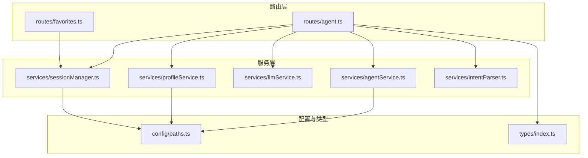
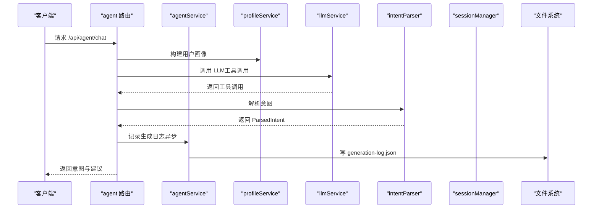
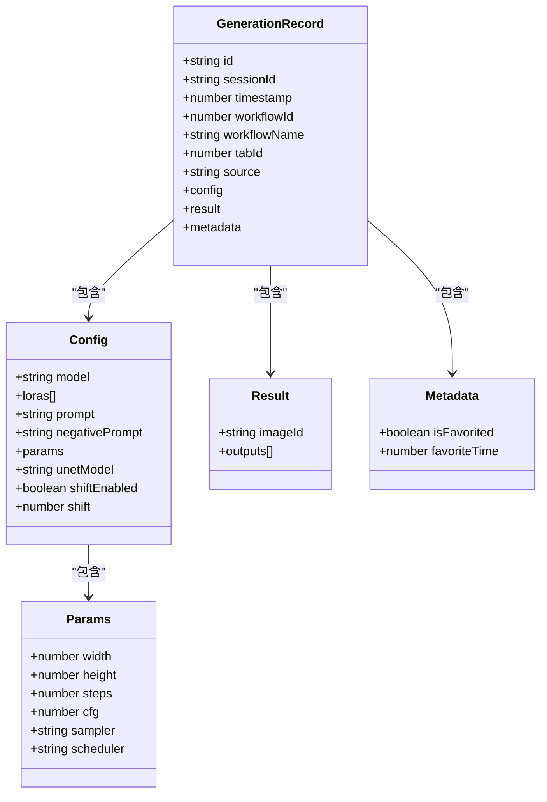
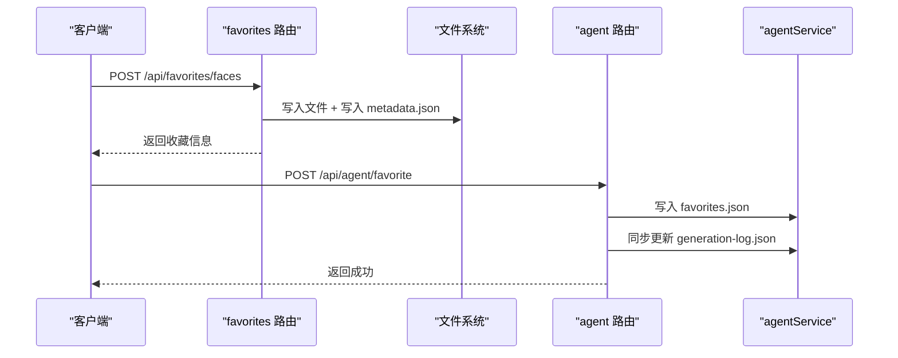
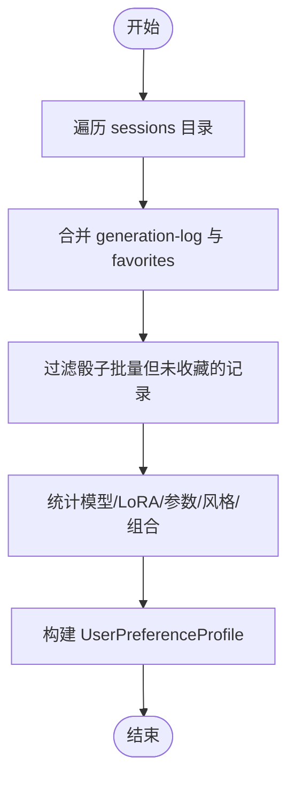
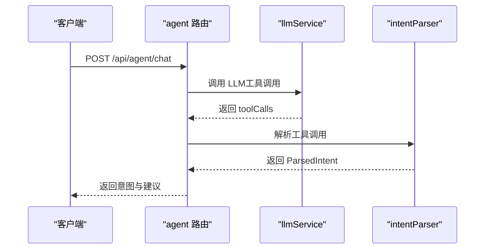
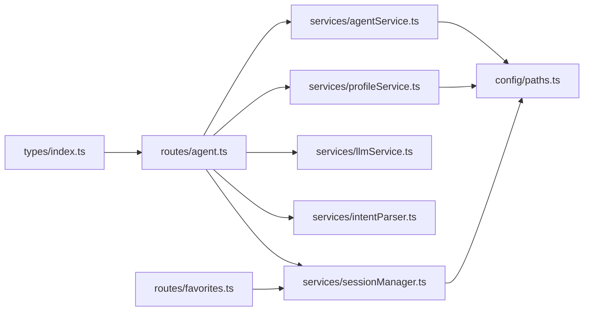

# AI Agent 服务

<cite>
**本文引用的文件**
- [server/src/routes/agent.ts](file://server/src/routes/agent.ts)
- [server/src/services/agentService.ts](file://server/src/services/agentService.ts)
- [server/src/services/profileService.ts](file://server/src/services/profileService.ts)
- [server/src/services/llmService.ts](file://server/src/services/llmService.ts)
- [server/src/services/intentParser.ts](file://server/src/services/intentParser.ts)
- [server/src/services/sessionManager.ts](file://server/src/services/sessionManager.ts)
- [server/src/config/paths.ts](file://server/src/config/paths.ts)
- [server/src/types/index.ts](file://server/src/types/index.ts)
- [server/src/routes/favorites.ts](file://server/src/routes/favorites.ts)
</cite>

## 目录
1. [简介](#简介)
2. [项目结构](#项目结构)
3. [核心组件](#核心组件)
4. [架构总览](#架构总览)
5. [详细组件分析](#详细组件分析)
6. [依赖关系分析](#依赖关系分析)
7. [性能考量](#性能考量)
8. [故障排查指南](#故障排查指南)
9. [结论](#结论)
10. [附录](#附录)

## 简介
本文件面向 CorineKit Pix2Real 的 AI Agent 服务，系统性阐述其核心功能与实现细节，包括：
- 生成记录管理：记录生成来源、配置参数与结果，支持异步写入与跨会话聚合。
- 收藏夹系统：支持按内容哈希去重的面容收藏，以及与生成日志的收藏状态同步。
- 用户偏好画像：基于历史生成与收藏数据构建用户偏好画像，用于智能建议与参数推荐。
- API 接口规范：提供读取日志、追加记录、收藏管理、聊天意图解析与执行等接口的使用说明。
- 安全与持久化：会话目录隔离、路径校验、异步写入与错误降级策略。

## 项目结构
服务端采用模块化组织，核心模块包括：
- 路由层：对外暴露 REST 接口，负责参数校验、调用服务层与返回响应。
- 服务层：封装业务逻辑，如生成记录读写、收藏管理、用户画像构建、LLM 调用与意图解析。
- 配置与路径：集中管理 sessions 目录、输出目录、模型元数据目录等。
- 类型定义：统一前后端交互的数据结构。

图表来源
- [server/src/routes/agent.ts:1-2167](file://server/src/routes/agent.ts#L1-L2167)
- [server/src/routes/favorites.ts:1-114](file://server/src/routes/favorites.ts#L1-L114)
- [server/src/services/agentService.ts:1-126](file://server/src/services/agentService.ts#L1-L126)
- [server/src/services/profileService.ts:1-251](file://server/src/services/profileService.ts#L1-L251)
- [server/src/services/llmService.ts:1-938](file://server/src/services/llmService.ts#L1-L938)
- [server/src/services/sessionManager.ts:1-539](file://server/src/services/sessionManager.ts#L1-L539)
- [server/src/config/paths.ts:1-156](file://server/src/config/paths.ts#L1-L156)
- [server/src/types/index.ts:1-52](file://server/src/types/index.ts#L1-L52)

章节来源
- [server/src/routes/agent.ts:1-2167](file://server/src/routes/agent.ts#L1-L2167)
- [server/src/routes/favorites.ts:1-114](file://server/src/routes/favorites.ts#L1-L114)
- [server/src/services/agentService.ts:1-126](file://server/src/services/agentService.ts#L1-L126)
- [server/src/services/profileService.ts:1-251](file://server/src/services/profileService.ts#L1-L251)
- [server/src/services/llmService.ts:1-938](file://server/src/services/llmService.ts#L1-L938)
- [server/src/services/sessionManager.ts:1-539](file://server/src/services/sessionManager.ts#L1-L539)
- [server/src/config/paths.ts:1-156](file://server/src/config/paths.ts#L1-L156)
- [server/src/types/index.ts:1-52](file://server/src/types/index.ts#L1-L52)

## 核心组件
- 生成记录管理：通过生成记录模型记录来源、配置与结果，并提供读取与追加写入接口，支持异步写入与跨会话聚合。
- 收藏夹系统：支持按内容哈希去重的面容收藏，提供列表、上传与删除接口；同时支持与生成日志收藏状态的双向同步。
- 用户偏好画像：聚合全量会话的生成与收藏数据，构建模型/LoRA 偏好、参数偏好、风格特征、使用统计与常用组合等画像指标。
- LLM 与意图解析：封装 LLM 调用、工具定义、系统提示词构建与工具调用解析，支持聊天、配置助理与智能问答模式。
- 会话与路径管理：集中管理 sessions 目录、输出目录、模型元数据目录与收藏目录，支持运行时切换与路径校验。

章节来源
- [server/src/services/agentService.ts:5-46](file://server/src/services/agentService.ts#L5-L46)
- [server/src/services/agentService.ts:52-125](file://server/src/services/agentService.ts#L52-L125)
- [server/src/services/profileService.ts:7-49](file://server/src/services/profileService.ts#L7-L49)
- [server/src/services/profileService.ts:77-250](file://server/src/services/profileService.ts#L77-L250)
- [server/src/services/llmService.ts:11-45](file://server/src/services/llmService.ts#L11-L45)
- [server/src/services/llmService.ts:55-114](file://server/src/services/llmService.ts#L55-L114)
- [server/src/services/intentParser.ts:12-34](file://server/src/services/intentParser.ts#L12-L34)
- [server/src/services/intentParser.ts:487-615](file://server/src/services/intentParser.ts#L487-L615)
- [server/src/services/sessionManager.ts:11-18](file://server/src/services/sessionManager.ts#L11-L18)
- [server/src/config/paths.ts:74-100](file://server/src/config/paths.ts#L74-L100)

## 架构总览
AI Agent 服务通过路由层接收请求，调用服务层完成业务处理，服务层依赖会话与路径配置、LLM 与意图解析模块，最终与 ComfyUI 工作流对接。

图表来源
- [server/src/routes/agent.ts:1317-1737](file://server/src/routes/agent.ts#L1317-L1737)
- [server/src/services/agentService.ts:63-72](file://server/src/services/agentService.ts#L63-L72)
- [server/src/services/profileService.ts:77-100](file://server/src/services/profileService.ts#L77-L100)
- [server/src/services/llmService.ts:55-114](file://server/src/services/llmService.ts#L55-L114)
- [server/src/services/intentParser.ts:487-504](file://server/src/services/intentParser.ts#L487-L504)

## 详细组件分析

### 生成记录管理
- 数据模型 GenerationRecord
  - 字段说明
    - id：生成记录唯一标识
    - sessionId：会话标识
    - timestamp：生成时间戳
    - workflowId/workflowName：工作流标识与名称
    - tabId：工作流对应的 Tab
    - source：生成来源（manual/dice/agent-chat）
    - config：生成配置（模型、LoRA、提示词、参数等）
    - result：生成结果（imageId、输出文件列表）
    - metadata：收藏状态与收藏时间
  - 设计要点
    - source 字段用于区分“骰子批量生成”等非用户主动行为，避免污染偏好画像
    - config 支持 ZIT 特定参数（UNet 模型、shift 等）
    - result 与 metadata 与收藏系统关联

- 读取与写入
  - 读取：按 sessionId 定位 generation-log.json 并解析
  - 追加：异步写入，避免阻塞响应
  - 跨会话聚合：画像构建时遍历 sessions 目录合并全量日志

- 收藏状态同步
  - 写入收藏：按 imageId 写入 favorites.json
  - 同步更新：在 generation-log 中更新 isFavorited 与 favoriteTime

图表来源
- [server/src/services/agentService.ts:5-46](file://server/src/services/agentService.ts#L5-L46)

章节来源
- [server/src/services/agentService.ts:5-46](file://server/src/services/agentService.ts#L5-L46)
- [server/src/services/agentService.ts:52-72](file://server/src/services/agentService.ts#L52-L72)
- [server/src/services/agentService.ts:80-104](file://server/src/services/agentService.ts#L80-L104)
- [server/src/services/agentService.ts:106-125](file://server/src/services/agentService.ts#L106-L125)

### 收藏夹系统
- 面容收藏
  - 去重策略：以图片内容的 SHA-256 哈希作为 ID，避免重复收藏
  - 元数据：记录原始文件名、添加时间与扩展名
  - 文件存储：与 output 同级的 favorites/faces 目录
  - 接口
    - GET /api/favorites/faces：列出收藏列表（按添加时间倒序）
    - POST /api/favorites/faces：上传图片并收藏，返回收藏信息
    - DELETE /api/favorites/faces/:id：取消收藏

- 与生成日志的关联
  - 写入收藏时同步更新 generation-log 中的 isFavorited 与 favoriteTime
  - 画像构建时过滤“骰子批量生成但未收藏”的记录，避免污染偏好

图表来源
- [server/src/routes/favorites.ts:52-111](file://server/src/routes/favorites.ts#L52-L111)
- [server/src/routes/agent.ts:1204-1236](file://server/src/routes/agent.ts#L1204-L1236)
- [server/src/services/agentService.ts:91-104](file://server/src/services/agentService.ts#L91-L104)
- [server/src/services/agentService.ts:106-125](file://server/src/services/agentService.ts#L106-L125)

章节来源
- [server/src/routes/favorites.ts:1-114](file://server/src/routes/favorites.ts#L1-L114)
- [server/src/routes/agent.ts:1204-1236](file://server/src/routes/agent.ts#L1204-L1236)
- [server/src/services/agentService.ts:80-125](file://server/src/services/agentService.ts#L80-L125)

### 用户偏好画像
- 构建流程
  - 遍历 sessions 目录，合并 generation-log 与 favorites
  - 过滤策略：骰子批量生成但未收藏的记录不入画像
  - 统计指标
    - 模型偏好：使用次数与收藏次数加权
    - LoRA 偏好：使用次数与收藏次数加权，计算平均强度
    - 参数偏好：尺寸、步数、CFG、采样器、调度器的众数
    - 风格特征：从提示词中提取高频 tag
    - 使用统计：总生成数、总收藏数、各 Tab 使用次数、最后活跃时间
    - 常用组合：模型 + 启用 LoRA 的组合频次

- 可视化画像
  - 提供 /api/agent/user-profile-view 接口，将模型/LoRA 路径解析为 nickname、category、thumbnail、triggerWords，便于前端展示

图表来源
- [server/src/services/profileService.ts:77-100](file://server/src/services/profileService.ts#L77-L100)
- [server/src/services/profileService.ts:113-250](file://server/src/services/profileService.ts#L113-L250)

章节来源
- [server/src/services/profileService.ts:7-49](file://server/src/services/profileService.ts#L7-L49)
- [server/src/services/profileService.ts:77-250](file://server/src/services/profileService.ts#L77-L250)

### LLM 与意图解析
- LLM 调用
  - 统一接口 callLLM，封装 API 调用、错误处理与响应解析
  - 支持工具调用（Function Calling），返回 content 与 toolCalls

- 工具定义
  - generate_image：生成图片，支持 character/pose/style/quality/variants 等参数
  - process_image：处理图片（二次元转真人、精修放大、真人转二次元）
  - text_response：纯文本回复

- 系统提示词构建
  - buildSystemPrompt：整合用户画像与模型/LoRA 列表，指导生成参数与提示词排序
  - buildConfigAssistantPrompt：配置助理模式，支持 LoRA 自动匹配与锁定模式保护触发词
  - buildSmartQAPrompt：智能问答模式

- 意图解析
  - parseToolCall：将 LLM 工具调用解析为 ParsedIntent，包含 workflowId、prompt、recommendedLoras、recommendedModel、parameters 等
  - findMatchingLorasFromPrompt：基于提示词与关键词匹配 LoRA，支持分类去重与强度回退

图表来源
- [server/src/routes/agent.ts:1317-1737](file://server/src/routes/agent.ts#L1317-L1737)
- [server/src/services/llmService.ts:55-114](file://server/src/services/llmService.ts#L55-L114)
- [server/src/services/intentParser.ts:487-615](file://server/src/services/intentParser.ts#L487-L615)

章节来源
- [server/src/services/llmService.ts:11-45](file://server/src/services/llmService.ts#L11-L45)
- [server/src/services/llmService.ts:55-114](file://server/src/services/llmService.ts#L55-L114)
- [server/src/services/intentParser.ts:12-34](file://server/src/services/intentParser.ts#L12-L34)
- [server/src/services/intentParser.ts:487-615](file://server/src/services/intentParser.ts#L487-L615)

### 会话与路径管理
- sessions 目录
  - 动态获取 sessions 根目录，支持运行时切换
  - 校验路径合法性与可写性，避免嵌套在 session 的 tab 子目录下
  - 保存/加载会话状态，提供会话列表与清理策略

- 其他数据目录
  - output、model_meta、favorites 等目录统一通过 getter 返回

章节来源
- [server/src/config/paths.ts:74-100](file://server/src/config/paths.ts#L74-L100)
- [server/src/config/paths.ts:106-137](file://server/src/config/paths.ts#L106-L137)
- [server/src/services/sessionManager.ts:11-18](file://server/src/services/sessionManager.ts#L11-L18)
- [server/src/services/sessionManager.ts:102-133](file://server/src/services/sessionManager.ts#L102-L133)

## 依赖关系分析
- 路由层依赖服务层与类型定义
- 服务层依赖会话与路径配置、LLM 与意图解析模块
- 生成记录与收藏系统依赖文件系统与会话管理
- 用户画像依赖全量会话数据与模型元数据

图表来源
- [server/src/routes/agent.ts:1-2167](file://server/src/routes/agent.ts#L1-L2167)
- [server/src/routes/favorites.ts:1-114](file://server/src/routes/favorites.ts#L1-L114)
- [server/src/services/agentService.ts:1-126](file://server/src/services/agentService.ts#L1-L126)
- [server/src/services/profileService.ts:1-251](file://server/src/services/profileService.ts#L1-L251)
- [server/src/services/llmService.ts:1-938](file://server/src/services/llmService.ts#L1-L938)
- [server/src/services/intentParser.ts:1-641](file://server/src/services/intentParser.ts#L1-L641)
- [server/src/services/sessionManager.ts:1-539](file://server/src/services/sessionManager.ts#L1-L539)
- [server/src/config/paths.ts:1-156](file://server/src/config/paths.ts#L1-L156)
- [server/src/types/index.ts:1-52](file://server/src/types/index.ts#L1-L52)

章节来源
- [server/src/routes/agent.ts:1-2167](file://server/src/routes/agent.ts#L1-L2167)
- [server/src/routes/favorites.ts:1-114](file://server/src/routes/favorites.ts#L1-L114)
- [server/src/services/agentService.ts:1-126](file://server/src/services/agentService.ts#L1-L126)
- [server/src/services/profileService.ts:1-251](file://server/src/services/profileService.ts#L1-L251)
- [server/src/services/llmService.ts:1-938](file://server/src/services/llmService.ts#L1-L938)
- [server/src/services/intentParser.ts:1-641](file://server/src/services/intentParser.ts#L1-L641)
- [server/src/services/sessionManager.ts:1-539](file://server/src/services/sessionManager.ts#L1-L539)
- [server/src/config/paths.ts:1-156](file://server/src/config/paths.ts#L1-L156)
- [server/src/types/index.ts:1-52](file://server/src/types/index.ts#L1-L52)

## 性能考量
- 异步写入：生成日志与收藏写入均使用 setImmediate 异步执行，避免阻塞请求响应。
- 元数据缓存：模型元数据按分钟级 TTL 缓存，减少频繁读取。
- 路径校验：切换 sessions 目录前进行合法性与可写性校验，避免运行时异常。
- 画像构建：遍历 sessions 目录时对不可读取的会话进行容错处理，保证整体稳定性。

## 故障排查指南
- LLM 调用失败
  - 检查 API Key 与网络连接
  - 查看响应状态与错误信息，确认工具调用是否返回
- 工作流执行失败
  - 检查模型/LoRA/UNet 文件是否存在
  - 确认 ComfyUI 服务是否正常运行
- 收藏失败
  - 检查 favorites 目录权限与磁盘空间
  - 确认上传文件是否包含二进制数据
- 生成日志缺失
  - 确认 sessionId 是否正确
  - 检查 generation-log.json 是否存在且可读

章节来源
- [server/src/routes/agent.ts:2146-2163](file://server/src/routes/agent.ts#L2146-L2163)
- [server/src/services/llmService.ts:77-81](file://server/src/services/llmService.ts#L77-L81)
- [server/src/services/agentService.ts:52-61](file://server/src/services/agentService.ts#L52-L61)

## 结论
AI Agent 服务通过完善的生成记录管理、收藏夹系统与用户偏好画像，实现了智能化的生成建议与参数推荐。其模块化设计与异步写入策略保证了良好的性能与稳定性，配合严格的路径校验与错误降级，为用户提供可靠的 AI 生成体验。

## 附录

### API 接口规范

- 生成记录管理
  - POST /api/agent/log-generation
    - 请求体：GenerationRecord
    - 成功：返回 { ok: true }
  - GET /api/agent/generation-history
    - 查询参数：sessionId（必需）
    - 成功：返回 generation-log.json 内容数组

- 收藏管理
  - POST /api/agent/favorite
    - 请求体：{ sessionId, imageId, tabId, isFavorited }
    - 成功：返回 { ok: true }
  - GET /api/agent/favorites
    - 查询参数：sessionId（必需）
    - 成功：返回 favorites.json 内容
  - GET /api/favorites/faces
    - 成功：返回收藏的面容列表（按添加时间倒序）
  - POST /api/favorites/faces
    - 表单字段：image（二进制图片）
    - 成功：返回收藏信息（id、originalName、url、addedAt）
  - DELETE /api/favorites/faces/:id
    - 成功：返回 { success: true }

- 用户画像
  - GET /api/agent/user-profile
    - 成功：返回 UserPreferenceProfile
  - GET /api/agent/user-profile-view
    - 成功：返回解析后的画像视图（包含 nickname、category、thumbnail、triggerWords）

- 聊天与意图解析
  - POST /api/agent/chat
    - 请求体：{ sessionId, message, messages, images, hasImage, mode, currentConfig, allowLoraModification }
    - 成功：返回 { type, intent/suggestions/message/changes }，其中 type 可为 tool_call/text_response/config_change/lora_conflict/text
  - POST /api/agent/execute
    - 请求体：{ intent, clientId, sessionId }
    - 成功：返回工作流执行结果（promptId、resolvedConfig、batchTotal 等）

章节来源
- [server/src/routes/agent.ts:1163-1265](file://server/src/routes/agent.ts#L1163-L1265)
- [server/src/routes/agent.ts:1204-1253](file://server/src/routes/agent.ts#L1204-L1253)
- [server/src/routes/agent.ts:1255-1315](file://server/src/routes/agent.ts#L1255-L1315)
- [server/src/routes/agent.ts:1317-1737](file://server/src/routes/agent.ts#L1317-L1737)
- [server/src/routes/agent.ts:1768-2164](file://server/src/routes/agent.ts#L1768-L2164)
- [server/src/routes/favorites.ts:52-111](file://server/src/routes/favorites.ts#L52-L111)