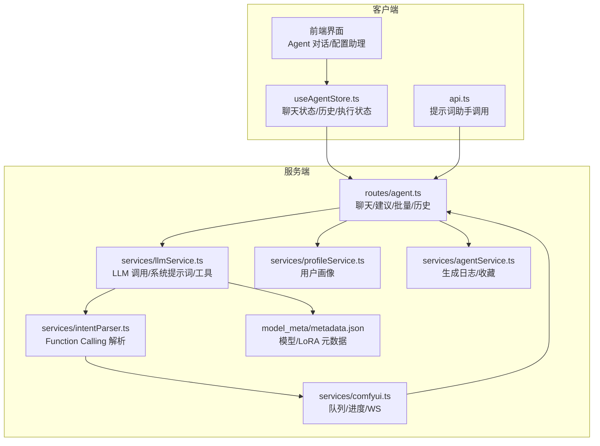
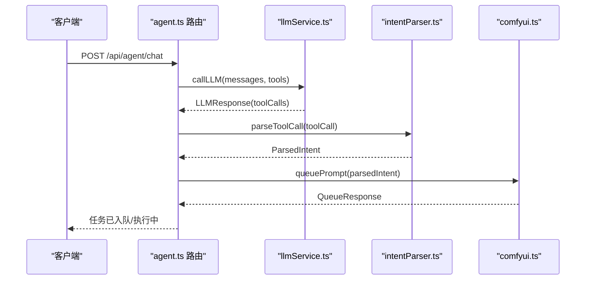
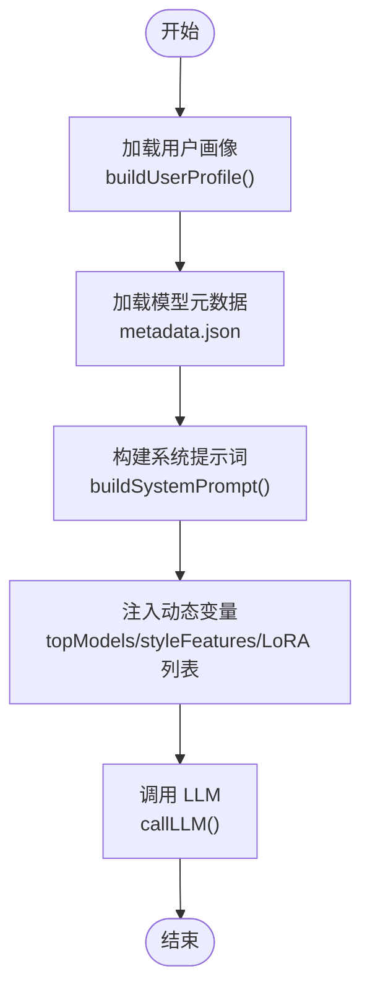
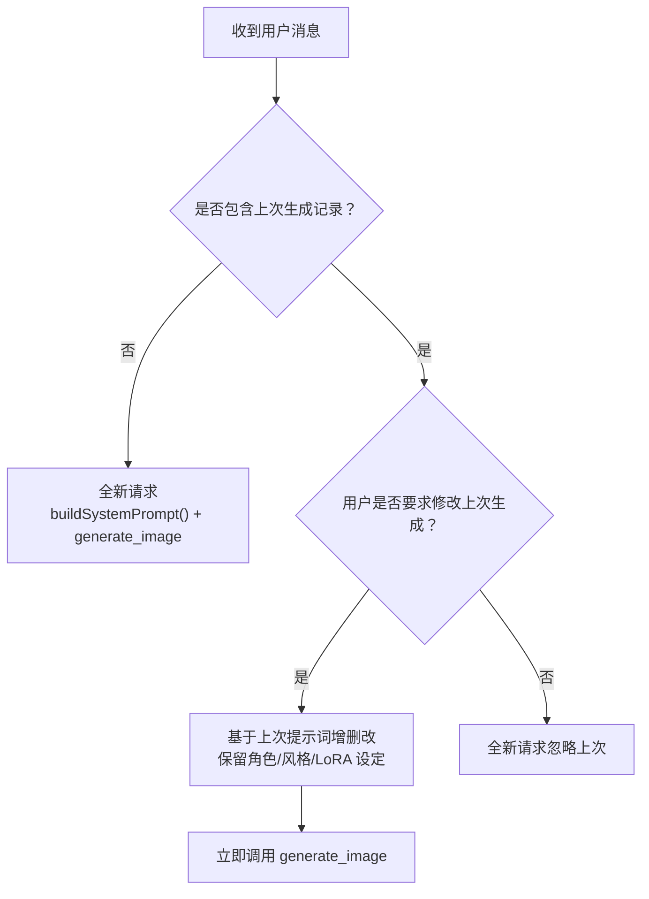
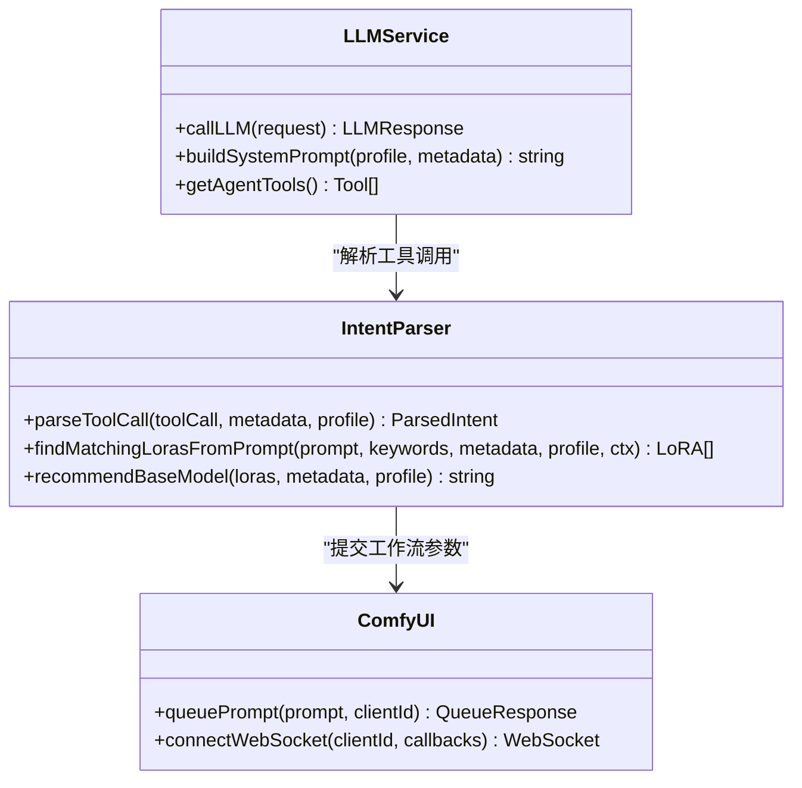
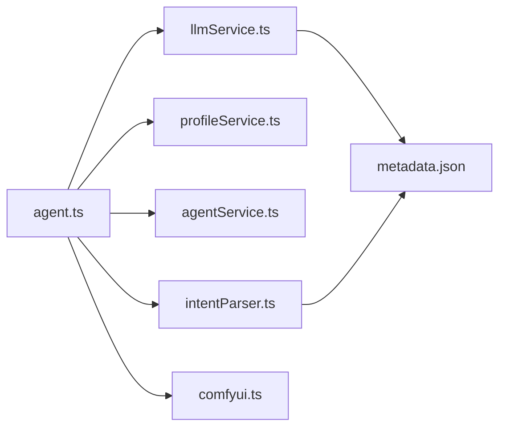

# LLM 服务

<cite>
**本文引用的文件**
- [llmService.ts](file://server/src/services/llmService.ts)
- [agent.ts](file://server/src/routes/agent.ts)
- [agentService.ts](file://server/src/services/agentService.ts)
- [profileService.ts](file://server/src/services/profileService.ts)
- [intentParser.ts](file://server/src/services/intentParser.ts)
- [comfyui.ts](file://server/src/services/comfyui.ts)
- [api.ts](file://client/src/services/api.ts)
- [useAgentStore.ts](file://client/src/hooks/useAgentStore.ts)
- [systemPrompts.ts](file://client/src/components/prompt-assistant/systemPrompts.ts)
- [metadata.json](file://model_meta/metadata.json)
- [LLM系统提示词汇总.md](file://docs/LLM系统提示词汇总.md)
- [SystemPrompt.txt](file://docs/SystemPrompt.txt)
</cite>

## 目录
1. [简介](#简介)
2. [项目结构](#项目结构)
3. [核心组件](#核心组件)
4. [架构总览](#架构总览)
5. [详细组件分析](#详细组件分析)
6. [依赖关系分析](#依赖关系分析)
7. [性能考虑](#性能考虑)
8. [故障排查指南](#故障排查指南)
9. [结论](#结论)
10. [附录](#附录)

## 简介
本文件面向 CorineKit Pix2Real 的 LLM 服务，系统性阐述大语言模型服务的集成架构与实现原理，覆盖以下主题：
- 系统提示词管理：构建与动态参数注入、多轮上下文与提示词模板
- 对话上下文处理：消息序列、历史记录与多轮编辑能力
- 响应生成机制：Function Calling 工具调用、意图解析与工作流参数映射
- 提示词模板系统：系统提示词组织结构、动态参数替换与多语言支持
- 配置管理：模型参数调优、API 密钥管理与请求限流策略
- 服务接口文档：对话管理、历史记录与错误处理
- 性能优化与调试指南

## 项目结构
LLM 服务位于后端 server/src 下，采用模块化设计：
- 服务层：llmService（LLM 调用、系统提示词构建、工具定义）
- 路由层：agent 路由（聊天、建议生成、骰子批量生成、历史记录）
- 数据层：agentService（生成日志与收藏）、profileService（用户画像构建）
- 工作流对接：intentParser（Function Calling 解析）、comfyui（ComfyUI 任务队列与进度）
- 前端对接：api（提示词助手）、useAgentStore（聊天状态与 UI 交互）

图表来源
- [agent.ts](file://server/src/routes/agent.ts)
- [llmService.ts](file://server/src/services/llmService.ts)
- [intentParser.ts](file://server/src/services/intentParser.ts)
- [comfyui.ts](file://server/src/services/comfyui.ts)
- [profileService.ts](file://server/src/services/profileService.ts)
- [agentService.ts](file://server/src/services/agentService.ts)
- [metadata.json](file://model_meta/metadata.json)

章节来源
- [agent.ts](file://server/src/routes/agent.ts)
- [llmService.ts](file://server/src/services/llmService.ts)
- [intentParser.ts](file://server/src/services/intentParser.ts)
- [comfyui.ts](file://server/src/services/comfyui.ts)
- [profileService.ts](file://server/src/services/profileService.ts)
- [agentService.ts](file://server/src/services/agentService.ts)
- [metadata.json](file://model_meta/metadata.json)

## 核心组件
- LLM 调用与工具
  - callLLM：封装 Grok API 调用，支持工具调用与温度参数
  - getAgentTools：定义 generate_image/process_image/text_response 工具
  - 系统提示词构建：buildSystemPrompt/buildConfigAssistantPrompt
- 意图解析与工作流映射
  - parseToolCall：将工具调用参数映射为工作流参数
  - findMatchingLoras/findMatchingLorasFromPrompt：LoRA 匹配与去重
  - recommendBaseModel：基于 LoRA 兼容性与用户偏好推荐基础模型
- 用户画像与建议生成
  - buildUserProfile：聚合生成日志与收藏，构建用户偏好画像
  - generateWarmUpSuggestions/generateFollowUpSuggestions：建议生成
- 生成日志与收藏
  - GenerationRecord 结构、读写与收藏管理
- 前端交互
  - api.ts：提示词助手调用
  - useAgentStore.ts：聊天消息、执行状态、批量结果与冲突处理

章节来源
- [llmService.ts](file://server/src/services/llmService.ts)
- [intentParser.ts](file://server/src/services/intentParser.ts)
- [profileService.ts](file://server/src/services/profileService.ts)
- [agentService.ts](file://server/src/services/agentService.ts)
- [api.ts](file://client/src/services/api.ts)
- [useAgentStore.ts](file://client/src/hooks/useAgentStore.ts)

## 架构总览
LLM 服务采用“提示词驱动 + Function Calling”的双引擎架构：
- 系统提示词驱动：根据用户画像与模型元数据动态拼装系统提示词，指导 LLM 的工具选择与参数生成
- Function Calling 驱动：LLM 通过工具调用返回结构化参数，后端解析为工作流参数并提交 ComfyUI

图表来源
- [agent.ts](file://server/src/routes/agent.ts)
- [llmService.ts](file://server/src/services/llmService.ts)
- [intentParser.ts](file://server/src/services/intentParser.ts)
- [comfyui.ts](file://server/src/services/comfyui.ts)

## 详细组件分析

### 系统提示词管理与模板系统
- 动态参数注入
  - buildSystemPrompt：从用户画像与模型元数据动态拼装系统提示词，包含常用模型、风格、LoRA 偏好、常用组合等
  - buildConfigAssistantPrompt：配置助理模式下的系统提示词，支持 LoRA 锁定与触发词保护
- 多轮上下文
  - 通过 messages 参数传递历史消息，LLM 基于上下文进行多轮编辑
- 多语言支持
  - 建议生成与提示词助手模式分别提供中/英提示词模板，前端通过 api.ts 选择不同端点

图表来源
- [llmService.ts](file://server/src/services/llmService.ts)
- [profileService.ts](file://server/src/services/profileService.ts)
- [metadata.json](file://model_meta/metadata.json)

章节来源
- [llmService.ts](file://server/src/services/llmService.ts)
- [profileService.ts](file://server/src/services/profileService.ts)
- [metadata.json](file://model_meta/metadata.json)
- [LLM系统提示词汇总.md](file://docs/LLM系统提示词汇总.md)
- [SystemPrompt.txt](file://docs/SystemPrompt.txt)

### 对话上下文处理与多轮编辑
- 历史消息管理
  - useAgentStore 维护消息数组，支持添加、更新、删除与清空
  - generation-context 保存最近一次生成的参数，支持多轮编辑
- 多轮编辑规则
  - 若用户要求修改之前的生成：基于上次提示词进行增删改，保留角色/风格/LoRA 设定，立即调用 generate_image
  - 若用户要求全新生成：当作新请求处理
  - 模糊修改：保持上次设定，仅更换随机种子

图表来源
- [agent.ts](file://server/src/routes/agent.ts)
- [useAgentStore.ts](file://client/src/hooks/useAgentStore.ts)

章节来源
- [agent.ts](file://server/src/routes/agent.ts)
- [useAgentStore.ts](file://client/src/hooks/useAgentStore.ts)

### 响应生成机制与 Function Calling
- 工具定义
  - generate_image：生成/修改图片，支持 prompt、negative_prompt、character、pose、style、quality、variants 等参数
  - process_image：处理已有图片（二次元转真人、精修放大、真人转二次元）
  - text_response：纯文本回复
- 意图解析
  - parseToolCall：将工具调用参数映射为 ParsedIntent，包含 workflowId、prompt、recommendedLoras、parameters 等
  - findMatchingLorasFromPrompt：基于提示词与关键词匹配 LoRA，支持分类去重与推荐强度
  - recommendBaseModel：根据 LoRA 兼容性与用户偏好推荐基础模型

图表来源
- [llmService.ts](file://server/src/services/llmService.ts)
- [intentParser.ts](file://server/src/services/intentParser.ts)
- [comfyui.ts](file://server/src/services/comfyui.ts)

章节来源
- [llmService.ts](file://server/src/services/llmService.ts)
- [intentParser.ts](file://server/src/services/intentParser.ts)
- [comfyui.ts](file://server/src/services/comfyui.ts)

### 提示词助手与多语言支持
- 提示词助手模式
  - naturalToTags/tagsToNatural/variations/detailer/nextScene/storyboarder：多种提示词转换与扩写模式
  - 前端通过 api.ts 调用 /api/workflow/prompt-assistant（或 grok 版本）将系统提示词注入 ComfyUI 工作流
- 多语言支持
  - 建议生成与提示词助手分别提供中文/英文提示词模板，满足不同场景

章节来源
- [systemPrompts.ts](file://client/src/components/prompt-assistant/systemPrompts.ts)
- [api.ts](file://client/src/services/api.ts)
- [LLM系统提示词汇总.md](file://docs/LLM系统提示词汇总.md)

### 配置管理与 API 密钥
- API 配置
  - Grok API 地址、密钥与模型在 llmService.ts 中集中配置
- 请求参数
  - temperature、max_tokens、tools/tool_choice 等参数在 callLLM 中设置
- 限流策略
  - 仓库未实现服务端限流；建议在网关或上游 API 层实施速率限制与熔断

章节来源
- [llmService.ts](file://server/src/services/llmService.ts)

### 服务接口文档
- 聊天与建议
  - GET /api/agent/suggestions：获取暖场建议（支持 agent/config_assistant/smart_qa 模式）
  - POST /api/agent/chat：发送消息并触发 LLM 生成
  - POST /api/agent/random-batch：骰子批量生成（支持 ratio 自动与内容策略）
- 历史与收藏
  - POST /api/agent/log-generation：记录生成日志
  - GET /api/agent/generation-history：获取生成历史
  - GET/POST /api/agent/favorites：收藏/取消收藏
- 提示词助手
  - POST /api/workflow/prompt-assistant：提示词助手（Groq/Grok 可选）
  - POST /api/workflow/smart-lora：智能 LoRA 推荐
  - POST /api/workflow/smart-trigger-insert：触发词智能插入

章节来源
- [agent.ts](file://server/src/routes/agent.ts)
- [agentService.ts](file://server/src/services/agentService.ts)
- [api.ts](file://client/src/services/api.ts)

## 依赖关系分析
- 组件耦合
  - agent.ts 依赖 llmService.ts、profileService.ts、agentService.ts、intentParser.ts、comfyui.ts
  - llmService.ts 依赖 metadata.json 与外部 Grok API
  - intentParser.ts 依赖 metadata.json 与用户画像 profileService.ts
- 外部依赖
  - Grok OpenAI 兼容 API
  - ComfyUI HTTP/WebSocket 接口
  - 本地文件系统（生成日志、收藏、模型元数据）

图表来源
- [agent.ts](file://server/src/routes/agent.ts)
- [llmService.ts](file://server/src/services/llmService.ts)
- [profileService.ts](file://server/src/services/profileService.ts)
- [agentService.ts](file://server/src/services/agentService.ts)
- [intentParser.ts](file://server/src/services/intentParser.ts)
- [comfyui.ts](file://server/src/services/comfyui.ts)
- [metadata.json](file://model_meta/metadata.json)

章节来源
- [agent.ts](file://server/src/routes/agent.ts)
- [llmService.ts](file://server/src/services/llmService.ts)
- [profileService.ts](file://server/src/services/profileService.ts)
- [agentService.ts](file://server/src/services/agentService.ts)
- [intentParser.ts](file://server/src/services/intentParser.ts)
- [comfyui.ts](file://server/src/services/comfyui.ts)
- [metadata.json](file://model_meta/metadata.json)

## 性能考虑
- 模型元数据缓存
  - agent.ts 中对 metadata.json 设置 1 分钟 TTL 缓存，减少频繁读取
- LLM 调用优化
  - 合理设置 temperature 与 max_tokens，避免超长响应
  - 工具调用中仅返回必要字段，减少解析成本
- 工作流执行
  - 通过 WebSocket 实时进度，避免轮询
  - 节点权重估算用于全局进度计算，提升用户体验

章节来源
- [agent.ts](file://server/src/routes/agent.ts)
- [comfyui.ts](file://server/src/services/comfyui.ts)

## 故障排查指南
- LLM API 错误
  - 现象：callLLM 返回非 2xx，抛出 LLM API 错误
  - 排查：检查 API 密钥、网络连通性、模型可用性
- Function Calling 解析失败
  - 现象：parseToolCall 未返回预期参数
  - 排查：确认工具 schema 与 LLM 输出一致性；检查 metadata.json 中 LoRA 元数据完整性
- 工作流执行异常
  - 现象：ComfyUI 执行错误或进度卡住
  - 排查：查看 WebSocket 错误回调、队列状态与历史记录；确认节点权重与采样器配置
- 建议生成失败
  - 现象：generateWarmUpSuggestions/generateFollowUpSuggestions 返回兜底
  - 排查：检查用户画像构建与元数据加载；确认 LLM 可用性

章节来源
- [llmService.ts](file://server/src/services/llmService.ts)
- [intentParser.ts](file://server/src/services/intentParser.ts)
- [comfyui.ts](file://server/src/services/comfyui.ts)
- [agent.ts](file://server/src/routes/agent.ts)

## 结论
本 LLM 服务通过“系统提示词 + Function Calling”的双引擎架构，实现了从自然语言到工作流参数的自动化映射。系统具备完善的用户画像与建议生成能力，支持多轮编辑与批量生成，并通过元数据驱动的 LoRA 匹配与模型推荐，提升了生成质量与效率。建议在生产环境中加强 API 限流、错误监控与日志审计，持续优化提示词模板与解析策略。

## 附录
- 提示词模板来源
  - AI Agent 主对话系统提示词：[LLM系统提示词汇总.md](file://docs/LLM系统提示词汇总.md)
  - 提示词助手模式：[systemPrompts.ts](file://client/src/components/prompt-assistant/systemPrompts.ts)
  - 历史文档：[SystemPrompt.txt](file://docs/SystemPrompt.txt)