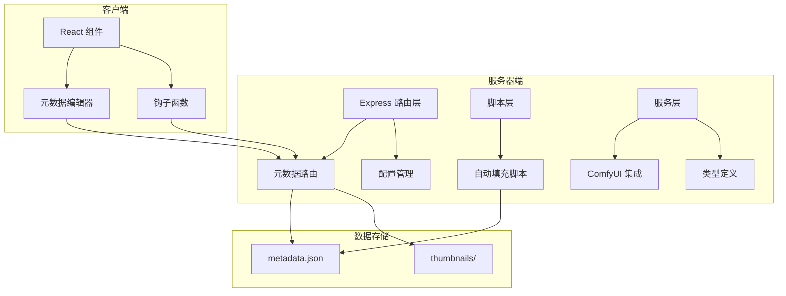
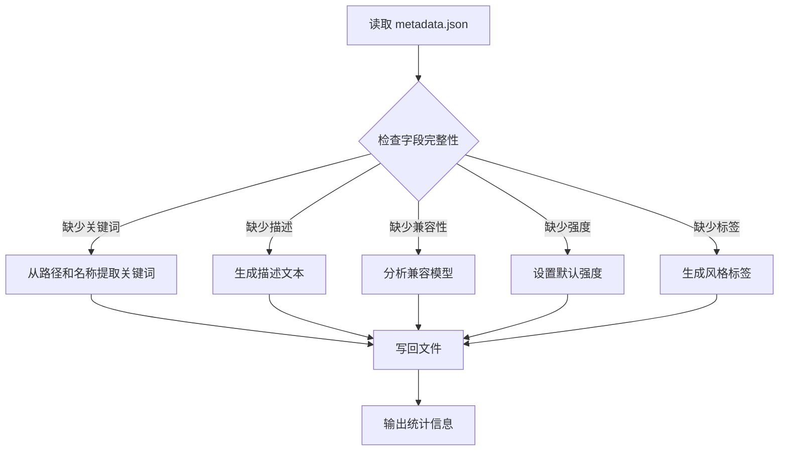
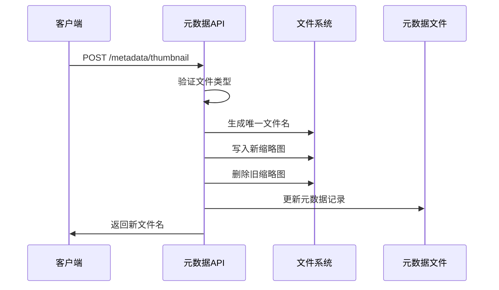
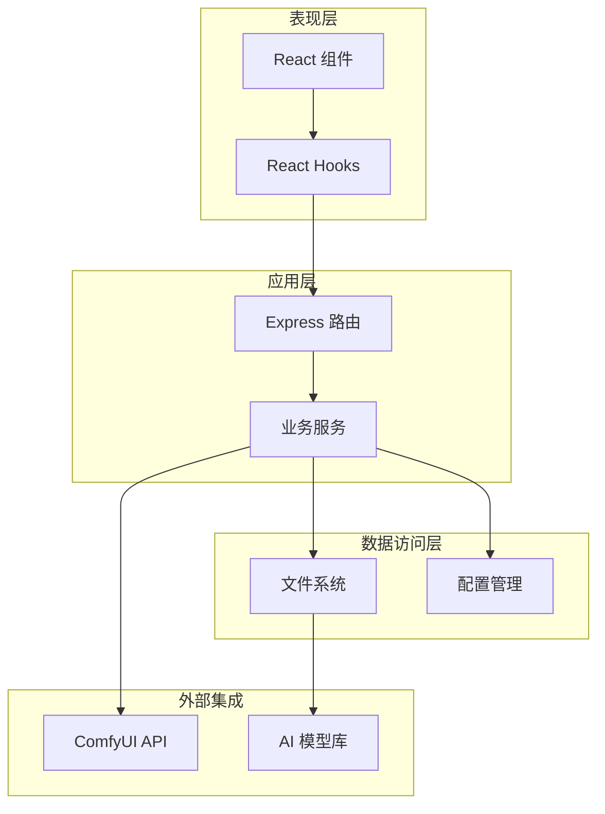
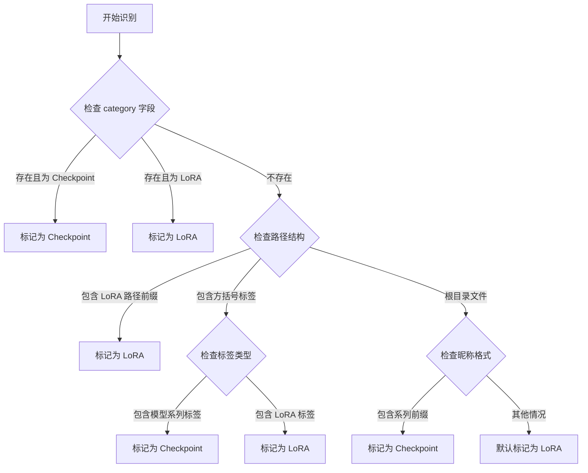
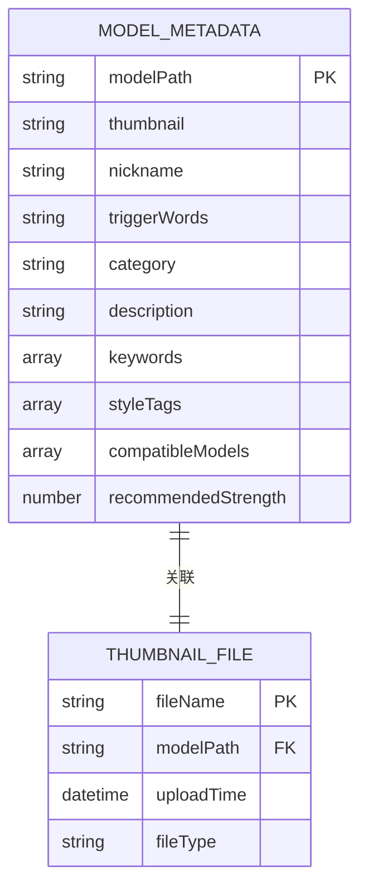
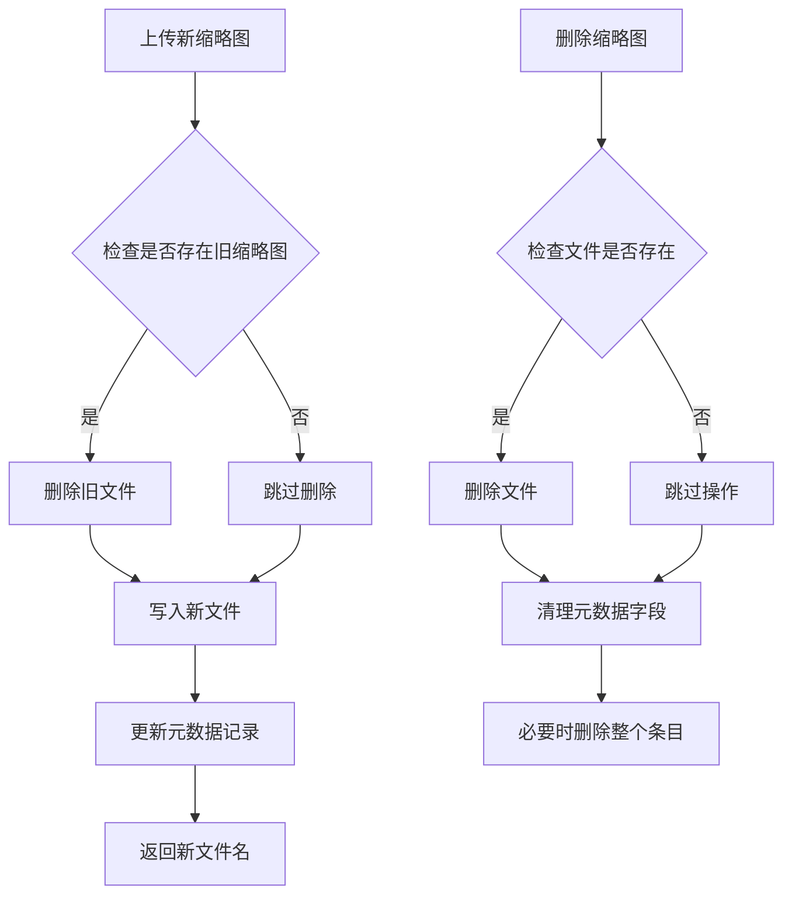
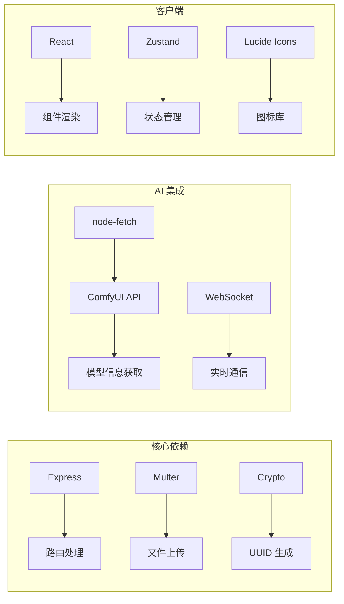
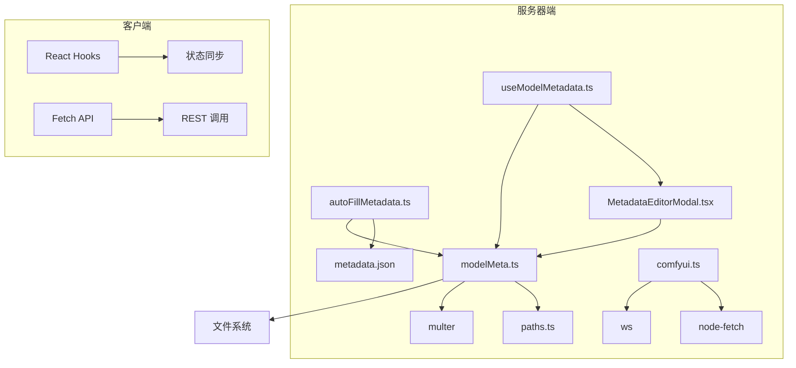

# 元数据服务

<cite>
**本文档引用的文件**
- [autoFillMetadata.ts](file://server/src/scripts/autoFillMetadata.ts)
- [modelMeta.ts](file://server/src/routes/modelMeta.ts)
- [metadata.json](file://model_meta/metadata.json)
- [paths.ts](file://server/src/config/paths.ts)
- [comfyui.ts](file://server/src/services/comfyui.ts)
- [index.ts](file://server/src/types/index.ts)
- [useModelMetadata.ts](file://client/src/hooks/useModelMetadata.ts)
- [MetadataEditorModal.tsx](file://client/src/components/MetadataEditorModal.tsx)
- [README.md](file://README.md)
- [package.json](file://package.json)
</cite>

## 目录
1. [简介](#简介)
2. [项目结构](#项目结构)
3. [核心组件](#核心组件)
4. [架构概览](#架构概览)
5. [详细组件分析](#详细组件分析)
6. [依赖关系分析](#依赖关系分析)
7. [性能考虑](#性能考虑)
8. [故障排除指南](#故障排除指南)
9. [结论](#结论)

## 简介

CorineKit Pix2Real 的元数据服务是一个专门为 AI 模型管理而设计的系统，主要负责自动化处理模型元数据、生成缩略图以及标准化模型信息。该服务支持多种类型的 AI 模型（主要是 LoRA 和 Checkpoint 模型），提供了完整的元数据管理功能，包括自动填充、手动编辑、缩略图管理和版本控制。

该系统的核心目标是：
- 自动识别模型类型（LoRA vs Checkpoint）
- 从文件路径和模型名称中提取关键词
- 生成描述性文本和风格标签
- 管理模型的缩略图资源
- 提供用户友好的元数据编辑界面

## 项目结构

元数据服务位于项目的 `server` 目录中，采用模块化的设计模式：

**图表来源**
- [modelMeta.ts:1-272](file://server/src/routes/modelMeta.ts#L1-L272)
- [autoFillMetadata.ts:1-257](file://server/src/scripts/autoFillMetadata.ts#L1-L257)

**章节来源**
- [README.md:41-62](file://README.md#L41-L62)

## 核心组件

### 元数据自动填充脚本

自动填充脚本是元数据服务的核心组件，负责扫描 `model_meta/metadata.json` 文件并为缺失的字段自动填充合理的默认值。

#### 主要功能特性

1. **智能模型类型识别**：根据文件路径和命名规则自动判断模型是 LoRA 还是 Checkpoint
2. **关键词提取**：从模型名称和路径中提取搜索关键词
3. **描述生成**：为不同类型的模型生成合适的描述文本
4. **兼容性分析**：确定 LoRA 模型适用的基础模型系列
5. **强度推荐**：为 LoRA 模型提供推荐的使用强度

#### 数据流图

**图表来源**
- [autoFillMetadata.ts:201-256](file://server/src/scripts/autoFillMetadata.ts#L201-L256)

**章节来源**
- [autoFillMetadata.ts:1-257](file://server/src/scripts/autoFillMetadata.ts#L1-L257)

### 元数据路由服务

Express 路由层提供了完整的 REST API 接口，用于管理模型元数据：

#### 核心接口

1. **GET /metadata** - 获取所有元数据
2. **POST /metadata/thumbnail** - 上传缩略图
3. **POST /metadata/nickname** - 设置昵称
4. **DELETE /metadata/thumbnail** - 删除缩略图
5. **PUT /metadata/update** - 批量更新元数据

#### 缩略图管理

**图表来源**
- [modelMeta.ts:49-83](file://server/src/routes/modelMeta.ts#L49-L83)

**章节来源**
- [modelMeta.ts:1-272](file://server/src/routes/modelMeta.ts#L1-L272)

### 客户端元数据编辑器

React 组件提供了用户友好的元数据编辑界面：

#### 主要功能

1. **批量元数据编辑**：支持同时编辑多个模型的元数据
2. **实时预览**：编辑过程中实时显示缩略图变化
3. **智能推荐**：根据模型路径自动推荐兼容模型
4. **搜索过滤**：支持按类别和关键词搜索模型

**章节来源**
- [MetadataEditorModal.tsx:1-200](file://client/src/components/MetadataEditorModal.tsx#L1-L200)
- [useModelMetadata.ts:1-126](file://client/src/hooks/useModelMetadata.ts#L1-L126)

## 架构概览

元数据服务采用分层架构设计，各层职责清晰分离：

**图表来源**
- [modelMeta.ts:1-272](file://server/src/routes/modelMeta.ts#L1-L272)
- [paths.ts:1-156](file://server/src/config/paths.ts#L1-L156)

## 详细组件分析

### 自动填充算法详解

#### 模型类型识别算法

**图表来源**
- [autoFillMetadata.ts:23-43](file://server/src/scripts/autoFillMetadata.ts#L23-L43)

#### 关键词提取机制

关键词提取算法支持多种数据源：

1. **昵称提取**：去除括号内容，保留纯名称
2. **路径标签提取**：从方括号标签中提取关键词
3. **触发词提取**：从触发词数组中提取第一个元素
4. **智能去重**：确保关键词列表不重复

**章节来源**
- [autoFillMetadata.ts:46-84](file://server/src/scripts/autoFillMetadata.ts#L46-L84)

### 元数据文件结构

#### JSON 格式规范

**图表来源**
- [metadata.json:1-2035](file://model_meta/metadata.json#L1-L2035)

#### 字段详细说明

| 字段名 | 类型 | 必需 | 描述 | 示例 |
|--------|------|------|------|------|
| thumbnail | string | 否 | 缩略图文件名 | "a7b00d45-c1d8-434e-b416-1bda8f5eb2c2.png" |
| nickname | string | 否 | 模型昵称 | "光辉-CherryMix" |
| triggerWords | string | 否 | 触发词 | "multiple views, pov" |
| category | string | 否 | 模型分类 | "多视角" |
| description | string | 否 | 描述文本 | "多视角LoRA - 多视角A，光辉系列适配" |
| keywords | array | 否 | 搜索关键词 | ["多视角A", "光辉", "多视图"] |
| styleTags | array | 否 | 风格标签 | ["multi_angle"] |
| compatibleModels | array | 否 | 兼容模型系列 | ["光辉"] |
| recommendedStrength | number | 否 | 推荐使用强度 | 0.7 |

**章节来源**
- [metadata.json:1-2035](file://model_meta/metadata.json#L1-L2035)

### 缩略图缓存管理

#### 缓存策略

**图表来源**
- [modelMeta.ts:67-83](file://server/src/routes/modelMeta.ts#L67-L83)

#### 文件存储结构

缩略图文件存储在 `model_meta/thumbnails/` 目录中，采用 UUID 命名策略，确保文件名的唯一性和安全性。

**章节来源**
- [modelMeta.ts:1-272](file://server/src/routes/modelMeta.ts#L1-L272)

### 版本控制机制

元数据服务采用简单的版本控制策略：

1. **增量更新**：只更新修改的字段，保持其他字段不变
2. **字段验证**：对输入数据进行类型和格式验证
3. **空值处理**：自动清理空值和无效数据
4. **备份机制**：文件写入前自动备份，防止数据丢失

## 依赖关系分析

### 外部依赖

**图表来源**
- [modelMeta.ts:1-272](file://server/src/routes/modelMeta.ts#L1-L272)
- [comfyui.ts:1-472](file://server/src/services/comfyui.ts#L1-L472)

### 内部模块依赖

**图表来源**
- [paths.ts:1-156](file://server/src/config/paths.ts#L1-L156)
- [useModelMetadata.ts:1-126](file://client/src/hooks/useModelMetadata.ts#L1-L126)

**章节来源**
- [package.json:1-15](file://package.json#L1-L15)

## 性能考虑

### 内存优化

1. **流式文件处理**：缩略图上传使用内存存储，避免临时文件
2. **增量更新**：只处理修改的元数据条目
3. **缓存策略**：客户端本地缓存元数据，减少网络请求

### 并发处理

1. **单文件并发**：同一时间只处理一个元数据文件的写入操作
2. **异步操作**：所有文件操作都是异步的，不会阻塞主线程
3. **错误隔离**：单个模型的错误不会影响其他模型的处理

### 扩展性设计

1. **模块化架构**：易于添加新的元数据字段和处理逻辑
2. **配置驱动**：大部分行为可以通过配置文件调整
3. **插件机制**：支持第三方扩展和自定义处理器

## 故障排除指南

### 常见问题及解决方案

#### 元数据文件损坏

**症状**：启动时出现 JSON 解析错误
**解决方法**：
1. 备份当前 `metadata.json` 文件
2. 使用在线 JSON 验证工具检查格式
3. 修复语法错误后重新启动服务

#### 缩略图上传失败

**症状**：上传缩略图时报错
**可能原因**：
1. 文件类型不支持
2. 磁盘空间不足
3. 权限问题

**解决步骤**：
1. 检查文件扩展名是否在允许列表中
2. 确认磁盘空间充足
3. 验证 `model_meta/thumbnails/` 目录的写权限

#### 自动填充脚本异常

**症状**：脚本执行中断或结果不正确
**排查步骤**：
1. 检查 `model_meta/metadata.json` 文件权限
2. 验证模型文件路径的有效性
3. 查看控制台输出的错误信息

### 调试技巧

1. **启用详细日志**：在开发环境中增加日志级别
2. **单元测试**：为关键函数编写测试用例
3. **监控指标**：跟踪文件大小和处理时间

**章节来源**
- [modelMeta.ts:264-269](file://server/src/routes/modelMeta.ts#L264-L269)

## 结论

CorineKit Pix2Real 的元数据服务是一个设计精良的系统，它成功地解决了 AI 模型管理中的关键问题。通过自动化处理、用户友好的界面和可靠的存储机制，该服务为用户提供了高效的模型管理体验。

### 主要优势

1. **智能化处理**：自动识别模型类型和提取元数据
2. **用户友好**：直观的编辑界面和实时预览
3. **可靠性强**：完善的错误处理和数据保护机制
4. **扩展性强**：模块化设计支持未来功能扩展

### 发展建议

1. **性能优化**：考虑引入数据库存储以支持大规模模型管理
2. **AI 辅助**：集成 AI 模型自动识别和元数据提取功能
3. **版本管理**：实现更精细的版本控制和变更历史
4. **协作功能**：支持多用户协作和权限管理

该元数据服务为 CorineKit Pix2Real 提供了坚实的数据基础，是整个系统的重要组成部分。