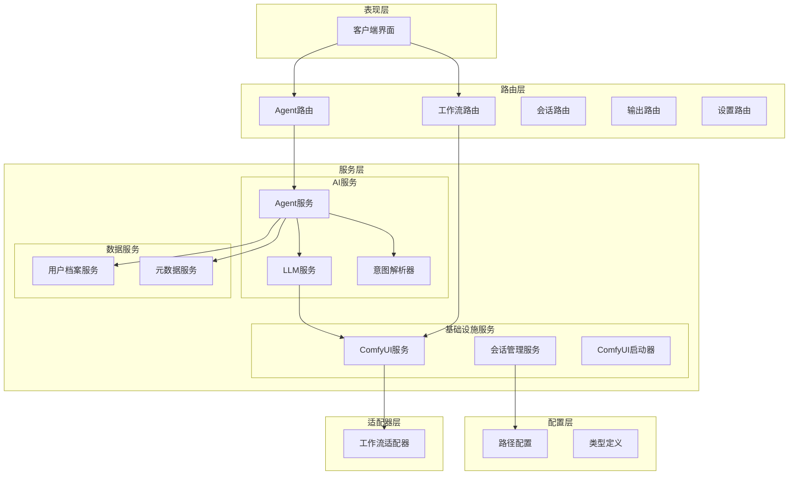
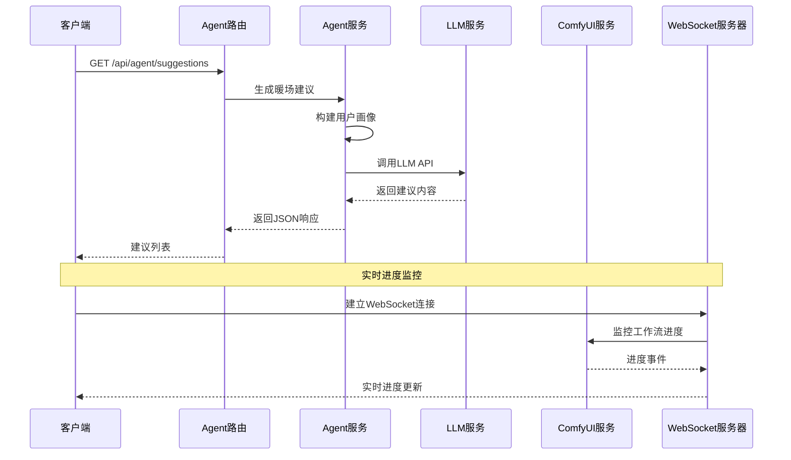
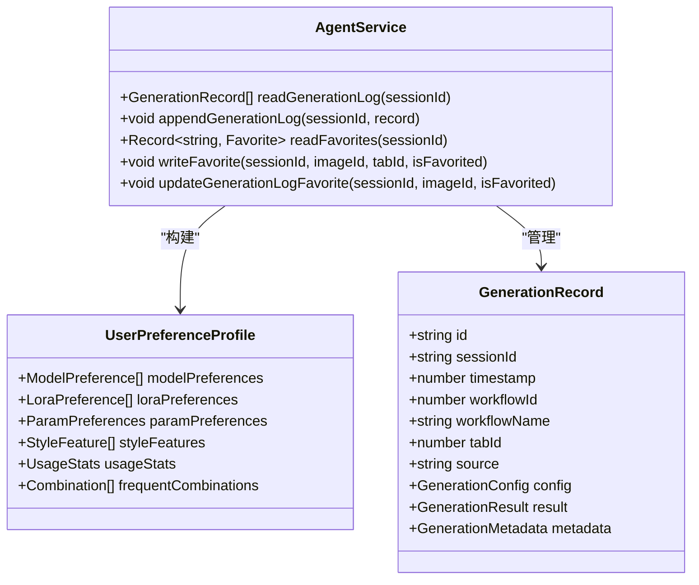
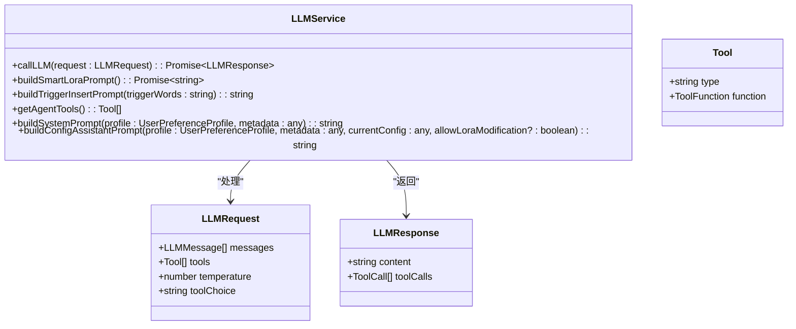
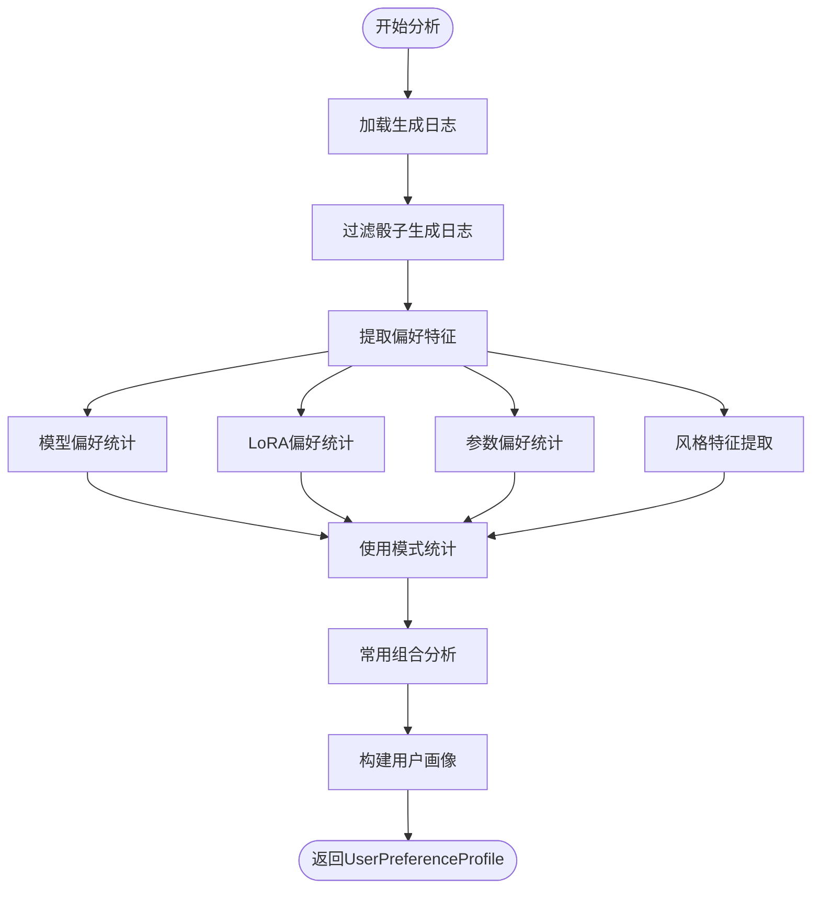
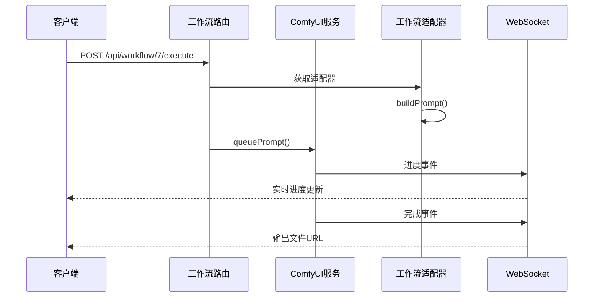
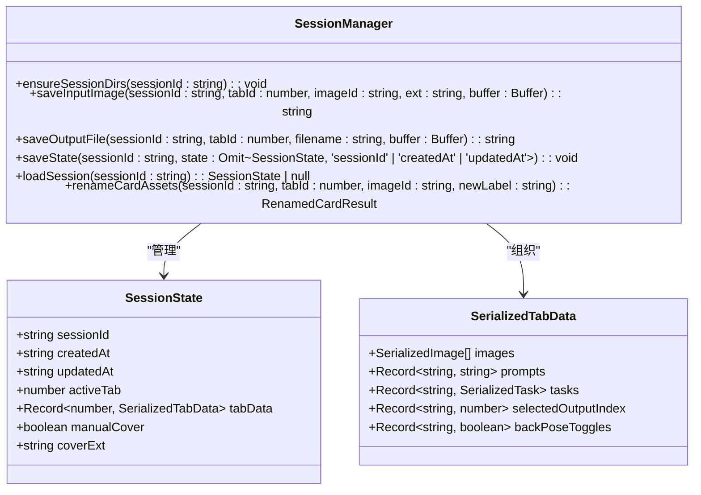
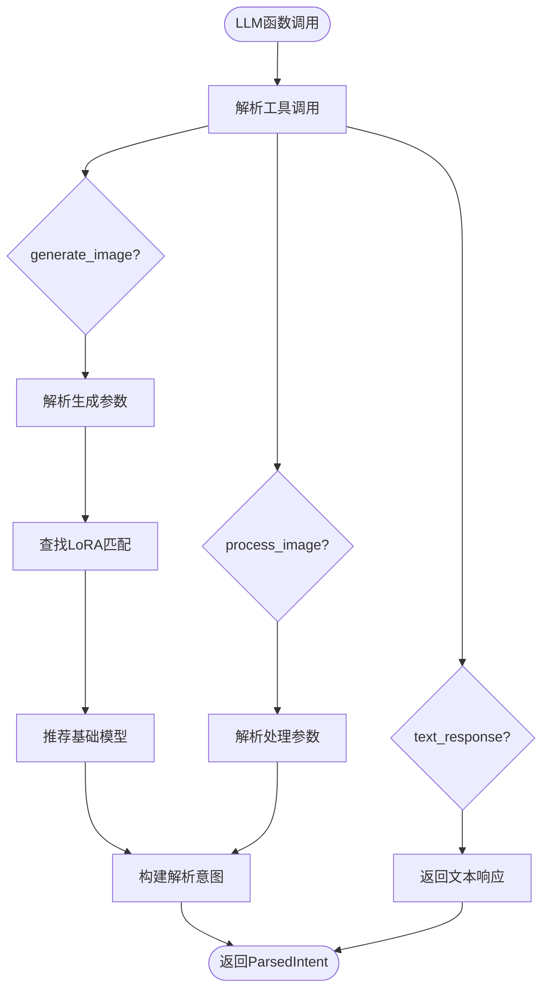
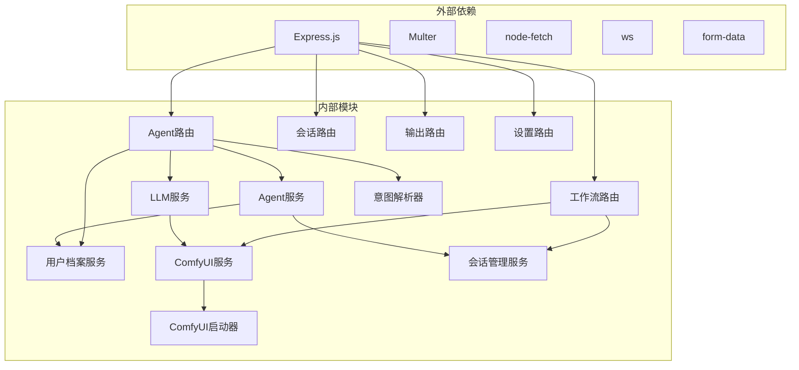

# 服务层架构

<cite>
**本文档引用的文件**
- [server/src/services/agentService.ts](file://server/src/services/agentService.ts)
- [server/src/services/llmService.ts](file://server/src/services/llmService.ts)
- [server/src/services/profileService.ts](file://server/src/services/profileService.ts)
- [server/src/services/comfyui.ts](file://server/src/services/comfyui.ts)
- [server/src/services/sessionManager.ts](file://server/src/services/sessionManager.ts)
- [server/src/services/intentParser.ts](file://server/src/services/intentParser.ts)
- [server/src/services/comfyuiLauncher.ts](file://server/src/services/comfyuiLauncher.ts)
- [server/src/routes/agent.ts](file://server/src/routes/agent.ts)
- [server/src/routes/workflow.ts](file://server/src/routes/workflow.ts)
- [server/src/types/index.ts](file://server/src/types/index.ts)
- [server/src/adapters/index.ts](file://server/src/adapters/index.ts)
- [server/src/scripts/autoFillMetadata.ts](file://server/src/scripts/autoFillMetadata.ts)
- [server/src/config/paths.ts](file://server/src/config/paths.ts)
- [server/src/index.ts](file://server/src/index.ts)
- [server/package.json](file://server/package.json)
</cite>

## 目录
1. [简介](#简介)
2. [项目结构](#项目结构)
3. [核心组件](#核心组件)
4. [架构概览](#架构概览)
5. [详细组件分析](#详细组件分析)
6. [依赖分析](#依赖分析)
7. [性能考虑](#性能考虑)
8. [故障排除指南](#故障排除指南)
9. [结论](#结论)
10. [附录](#附录)

## 简介

CorineKit Pix2Real 是一个基于 AI 的图像生成和处理平台，采用服务层架构设计。该系统通过多个专业服务模块协同工作，为用户提供从智能代理聊天到图像生成、处理和管理的完整解决方案。

系统的核心设计理念是模块化服务架构，每个服务模块都有明确的职责边界和清晰的接口定义。服务层包括 AI Agent 服务、LLM 服务、用户档案服务、ComfyUI 集成服务、会话管理服务和元数据填充服务等。

## 项目结构

项目采用分层架构设计，主要分为以下几个层次：

**图表来源**
- [server/src/index.ts:118-145](file://server/src/index.ts#L118-L145)
- [server/src/routes/agent.ts:1-50](file://server/src/routes/agent.ts#L1-L50)
- [server/src/routes/workflow.ts:1-30](file://server/src/routes/workflow.ts#L1-L30)

**章节来源**
- [server/src/index.ts:1-100](file://server/src/index.ts#L1-L100)
- [server/src/config/paths.ts:1-50](file://server/src/config/paths.ts#L1-L50)

## 核心组件

### AI Agent 服务

AI Agent 服务是系统的智能中枢，负责处理用户交互、生成建议和协调各种工作流。该服务集成了 LLM 能力，能够理解用户意图并自动推荐合适的图像生成方案。

主要功能包括：
- 用户暖场建议生成
- 后续创意建议生成  
- 智能 LoRA 推荐
- 批量随机生成支持

### LLM 服务

LLM 服务提供大语言模型集成，支持多种工具调用和函数式编程模式。该服务负责处理复杂的自然语言理解和生成任务。

核心特性：
- Grok API 集成
- 工具调用框架
- 系统提示词构建
- 触发词插入处理

### 用户档案服务

用户档案服务负责分析用户的历史行为和偏好，构建个性化的用户画像。该服务为其他组件提供智能化的决策支持。

关键功能：
- 偏好特征提取
- 使用模式统计
- 组合模式分析
- 成熟度评估

### ComfyUI 集成服务

ComfyUI 集成服务提供了与 ComfyUI 工作流引擎的深度集成，支持多种图像生成和处理工作流。

主要能力：
- 工作流模板管理
- LoRA 节点链式连接
- 实时进度跟踪
- 输出文件管理

**章节来源**
- [server/src/services/agentService.ts:1-126](file://server/src/services/agentService.ts#L1-L126)
- [server/src/services/llmService.ts:1-120](file://server/src/services/llmService.ts#L1-L120)
- [server/src/services/profileService.ts:1-80](file://server/src/services/profileService.ts#L1-L80)

## 架构概览

系统采用事件驱动的异步架构，通过 WebSocket 实现实时通信。整体架构分为以下几个关键组件：

**图表来源**
- [server/src/routes/agent.ts:614-649](file://server/src/routes/agent.ts#L614-L649)
- [server/src/index.ts:157-170](file://server/src/index.ts#L157-L170)

**章节来源**
- [server/src/index.ts:157-200](file://server/src/index.ts#L157-L200)
- [server/src/routes/agent.ts:1-100](file://server/src/routes/agent.ts#L1-L100)

## 详细组件分析

### Agent 服务组件分析

Agent 服务是系统的核心智能组件，负责处理用户交互和生成创意建议。

**图表来源**
- [server/src/services/agentService.ts:5-46](file://server/src/services/agentService.ts#L5-L46)
- [server/src/services/profileService.ts:6-49](file://server/src/services/profileService.ts#L6-L49)

#### Agent 服务接口规范

Agent 服务提供以下核心接口：

**生成日志管理接口**
- `readGenerationLog(sessionId: string): GenerationRecord[]` - 读取生成日志
- `appendGenerationLog(sessionId: string, record: GenerationRecord): void` - 追加生成记录
- `updateGenerationLogFavorite(sessionId: string, imageId: string, isFavorited: boolean): void` - 更新收藏状态

**收藏管理接口**
- `readFavorites(sessionId: string): Record<string, Favorite>` - 读取收藏列表
- `writeFavorite(sessionId: string, imageId: string, tabId: number, isFavorited: boolean): void` - 写入收藏状态

**章节来源**
- [server/src/services/agentService.ts:52-126](file://server/src/services/agentService.ts#L52-L126)

### LLM 服务组件分析

LLM 服务提供强大的语言模型集成能力，支持复杂的对话和工具调用。

**图表来源**
- [server/src/services/llmService.ts:29-45](file://server/src/services/llmService.ts#L29-L45)
- [server/src/services/llmService.ts:55-114](file://server/src/services/llmService.ts#L55-L114)

#### LLM 服务配置

LLM 服务使用 Grok API 进行推理，配置参数如下：
- API URL: `https://api.jiekou.ai/openai/v1/chat/completions`
- API Key: `sk_4kPU46GrW4F-GLsGzOygbmDVA8hoinn4b1PmgiQFB6s`
- 模型: `grok-4-fast-non-reasoning`
- 默认温度: 0.7
- 最大令牌数: 4096

**章节来源**
- [server/src/services/llmService.ts:49-114](file://server/src/services/llmService.ts#L49-L114)

### 用户档案服务组件分析

用户档案服务负责分析用户行为模式，构建个性化的偏好画像。

**图表来源**
- [server/src/services/profileService.ts:77-250](file://server/src/services/profileService.ts#L77-L250)

#### 用户画像数据结构

用户画像包含以下关键数据：

**模型偏好**
- `modelPreferences`: 按使用次数和收藏次数计算的得分
- `score = useCount × 1 + favoriteCount × 5`

**LoRA 偏好**
- `loraPreferences`: 包含平均权重信息
- `avgStrength`: 基于使用次数加权的平均强度

**参数偏好**
- `preferredSize`: 通过众数算法确定的首选尺寸
- `preferredSteps`: 首选采样步数
- `preferredCfg`: 首选CFG值

**章节来源**
- [server/src/services/profileService.ts:77-250](file://server/src/services/profileService.ts#L77-L250)

### ComfyUI 集成服务组件分析

ComfyUI 集成服务提供了与 ComfyUI 工作流引擎的深度集成，支持多种图像生成和处理工作流。

**图表来源**
- [server/src/routes/workflow.ts:269-405](file://server/src/routes/workflow.ts#L269-L405)
- [server/src/services/comfyui.ts:168-196](file://server/src/services/comfyui.ts#L168-L196)

#### 工作流适配器架构

系统支持多种工作流适配器，每种适配器负责特定的图像处理任务：

**适配器类型**
- `workflow0Adapter`: 二次元转真人
- `workflow2Adapter`: 精修放大
- `workflow7Adapter`: 快速出图
- `workflow9Adapter`: ZIT快出

**章节来源**
- [server/src/adapters/index.ts:14-30](file://server/src/adapters/index.ts#L14-L30)
- [server/src/routes/workflow.ts:152-161](file://server/src/routes/workflow.ts#L152-L161)

### 会话管理服务组件分析

会话管理服务负责管理用户会话状态、文件存储和资产重命名。

**图表来源**
- [server/src/services/sessionManager.ts:101-133](file://server/src/services/sessionManager.ts#L101-L133)
- [server/src/services/sessionManager.ts:66-93](file://server/src/services/sessionManager.ts#L66-L93)

#### 会话状态管理

会话管理服务提供完整的状态持久化机制：

**状态文件结构**
- `session.json`: 包含会话基本信息和状态
- `tab-{id}/input/`: 输入文件存储
- `tab-{id}/output/`: 输出文件存储  
- `tab-{id}/masks/`: 掩码文件存储

**文件重命名机制**
- 支持批量重命名操作
- 防止文件名冲突
- 维护任务状态一致性

**章节来源**
- [server/src/services/sessionManager.ts:101-133](file://server/src/services/sessionManager.ts#L101-L133)

### 意图解析器组件分析

意图解析器负责将 LLM 的函数调用结果转换为具体的工作流参数。

**图表来源**
- [server/src/services/intentParser.ts:487-504](file://server/src/services/intentParser.ts#L487-L504)

#### 意图解析流程

意图解析器支持三种主要工具调用：

**generate_image 工具**
- 解析提示词、负面提示词
- 提取角色、姿势、风格信息
- 推荐 LoRA 和基础模型
- 生成批量变体配置

**process_image 工具**
- 处理图像转换任务
- 支持二次元转真人、精修放大、真人转二次元
- 自动选择工作流类型

**章节来源**
- [server/src/services/intentParser.ts:487-641](file://server/src/services/intentParser.ts#L487-L641)

## 依赖分析

系统采用模块化设计，各组件之间的依赖关系清晰明确：

**图表来源**
- [server/package.json:11-26](file://server/package.json#L11-L26)
- [server/src/index.ts:1-20](file://server/src/index.ts#L1-L20)

**章节来源**
- [server/package.json:11-26](file://server/package.json#L11-L26)
- [server/src/index.ts:1-20](file://server/src/index.ts#L1-L20)

## 性能考虑

### 缓存策略

系统实现了多层次的缓存机制来提升性能：

**元数据缓存**
- `METADATA_CACHE_TTL`: 60秒缓存时间
- 避免频繁读取模型元数据文件
- 减少文件系统I/O开销

**会话状态缓存**
- 动态获取 sessions 根目录
- 支持运行时路径切换
- 防止路径解析重复计算

### 异步处理

系统广泛采用异步处理模式：

**WebSocket 实时通信**
- 事件驱动的进度通知
- 非阻塞的文件下载
- 客户端重连恢复机制

**工作流队列管理**
- 支持任务优先级调整
- 并行任务处理
- 内存友好的批量操作

### 资源管理

**文件系统优化**
- 智能的文件命名和重命名
- 防止文件名冲突
- 支持批量操作事务性

**内存使用优化**
- 流式文件处理
- 按需加载模型元数据
- 及时清理临时文件

## 故障排除指南

### 常见问题诊断

**ComfyUI 连接问题**
- 检查服务状态: `GET /api/comfyui/status`
- 验证端口监听: 8188 端口
- 确认模型文件完整性

**LLM API 错误**
- 检查 API 密钥有效性
- 验证网络连接
- 监控请求频率限制

**文件上传失败**
- 检查文件大小限制 (50MB)
- 验证文件格式支持
- 确认磁盘空间充足

### 错误处理策略

系统实现了完善的错误处理机制：

**HTTP 状态码规范**
- 400: 请求参数错误
- 404: 资源不存在  
- 500: 服务器内部错误
- 502: 外部服务错误

**用户友好错误消息**
- 将技术错误转换为中文提示
- 提供具体的解决建议
- 保持错误信息简洁明了

**章节来源**
- [server/src/routes/workflow.ts:126-150](file://server/src/routes/workflow.ts#L126-L150)
- [server/src/services/comfyui.ts:228-237](file://server/src/services/comfyui.ts#L228-L237)

## 结论

CorineKit Pix2Real 的服务层架构展现了现代 AI 应用的最佳实践。通过模块化设计、清晰的职责分离和完善的错误处理机制，系统实现了高可用性和可扩展性。

关键优势包括：
- **模块化架构**: 各服务职责明确，便于维护和扩展
- **异步处理**: 事件驱动的实时通信，提升用户体验
- **智能缓存**: 多层次缓存策略优化性能
- **完善监控**: 全面的错误处理和日志记录
- **灵活配置**: 支持运行时配置和路径切换

该架构为未来的功能扩展和技术演进奠定了坚实基础。

## 附录

### 配置管理

系统支持动态配置管理，包括：

**路径配置**
- `CORINE_DATA_ROOT`: 数据根目录覆盖
- `sessionsBase`: 会话存储路径
- 支持绝对路径验证和写权限检测

**运行时配置**
- `config.json`: 持久化配置文件
- 支持热更新和配置重载
- 配置变更自动应用

### 依赖注入和生命周期管理

系统采用简单的依赖注入模式：

**服务注册**
- 通过模块导入自动注册
- 单例模式管理服务实例
- 明确的初始化顺序

**生命周期管理**
- 服务启动时进行资源初始化
- 运行时状态监控
- 正常关闭时清理资源

### 扩展指南

**自定义服务开发步骤**
1. 创建服务模块文件
2. 定义服务接口和数据结构
3. 实现业务逻辑
4. 添加路由处理
5. 集成到主应用
6. 编写单元测试

**最佳实践**
- 保持服务单一职责
- 明确接口契约
- 实现错误处理
- 添加日志记录
- 编写文档注释