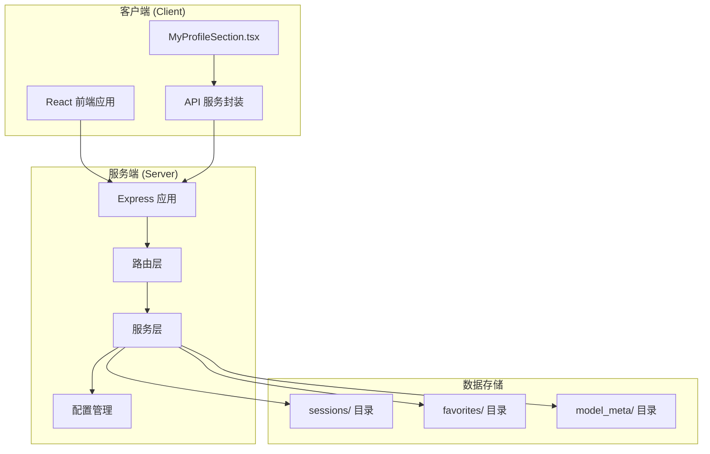
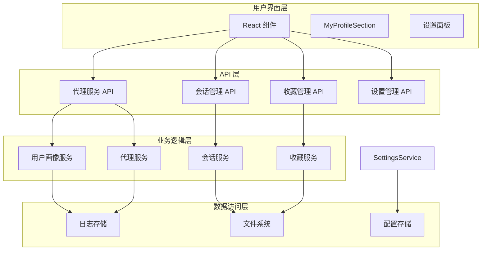
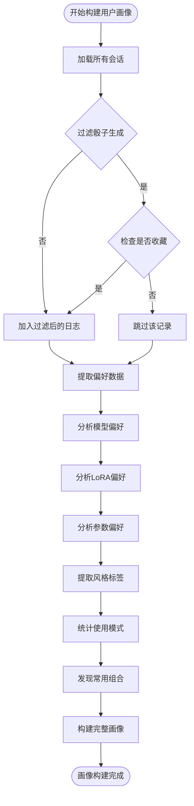
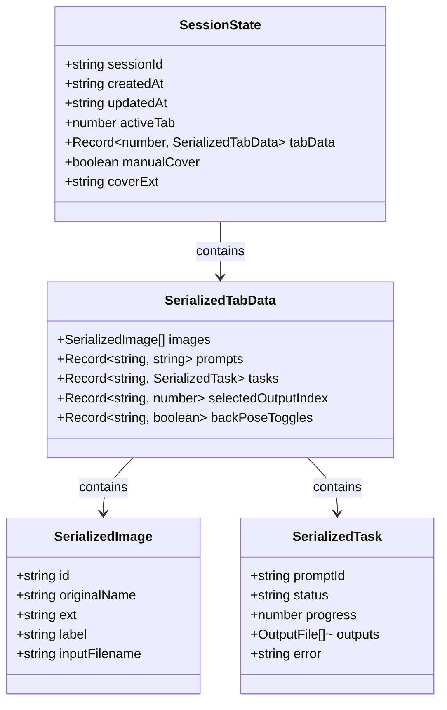
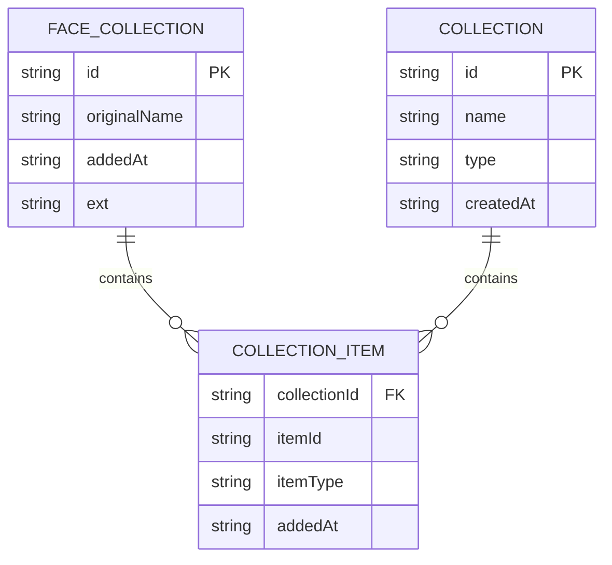
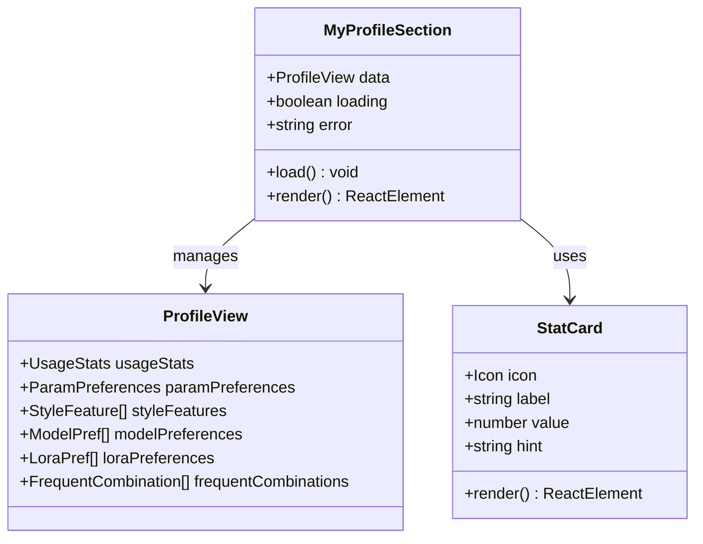
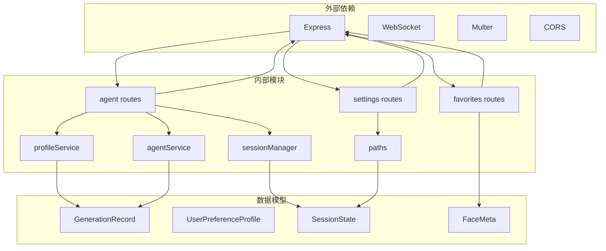

# 用户档案服务

<cite>
**本文档引用的文件**
- [profileService.ts](file://server/src/services/profileService.ts)
- [agentService.ts](file://server/src/services/agentService.ts)
- [sessionManager.ts](file://server/src/services/sessionManager.ts)
- [paths.ts](file://server/src/config/paths.ts)
- [agent.ts](file://server/src/routes/agent.ts)
- [settings.ts](file://server/src/routes/settings.ts)
- [favorites.ts](file://server/src/routes/favorites.ts)
- [MyProfileSection.tsx](file://client/src/components/MyProfileSection.tsx)
- [index.ts](file://server/src/index.ts)
- [metadata.json](file://model_meta/metadata.json)
- [README.md](file://README.md)
- [TODO-session-persistence.md](file://TODO-session-persistence.md)
</cite>

## 目录
1. [简介](#简介)
2. [项目结构](#项目结构)
3. [核心组件](#核心组件)
4. [架构概览](#架构概览)
5. [详细组件分析](#详细组件分析)
6. [依赖关系分析](#依赖关系分析)
7. [性能考虑](#性能考虑)
8. [故障排除指南](#故障排除指南)
9. [结论](#结论)
10. [附录](#附录)

## 简介

CorineKit Pix2Real 的用户档案服务是一个智能化的用户偏好管理系统，旨在为用户提供个性化的AI生成建议和推荐。该系统通过分析用户的生成历史、收藏行为和交互模式，构建详细的用户偏好画像，为AI助手提供智能化的创作建议。

系统的核心功能包括：
- 用户偏好画像构建和维护
- 个性化生成建议推荐
- 收藏管理和服务
- 数据持久化和会话管理
- 实时进度跟踪和状态同步

## 项目结构



**图表来源**
- [index.ts:118-146](file://server/src/index.ts#L118-L146)
- [paths.ts:70-100](file://server/src/config/paths.ts#L70-L100)

**章节来源**
- [README.md:41-79](file://README.md#L41-L79)
- [index.ts:118-146](file://server/src/index.ts#L118-L146)

## 核心组件

### 用户偏好画像系统

用户偏好画像系统是整个档案服务的核心，负责收集、分析和维护用户的生成偏好数据。系统通过以下方式构建用户画像：

- **模型偏好分析**：统计用户对不同AI模型的使用频率和收藏偏好
- **LoRA偏好分析**：分析用户对各种LoRA模型的使用模式和强度偏好
- **参数偏好提取**：通过众数算法提取用户偏好的生成参数
- **风格特征识别**：从提示词中提取高频标签，识别用户风格偏好
- **使用模式统计**：跟踪用户的活跃时间和使用习惯

### 会话管理系统

会话管理系统负责管理用户的生成历史和状态信息，确保用户能够在关闭应用后重新恢复之前的会话。

- **会话目录结构**：每个会话对应一个独立的目录，包含完整的状态信息
- **状态持久化**：实时保存用户的操作状态和生成历史
- **资源管理**：管理输入图片、输出文件和遮罩数据的存储

### 收藏管理系统

收藏管理系统为用户提供收藏和管理喜欢的图像的功能，同时支持人脸收藏的特殊用途。

- **图像收藏**：基于SHA-256哈希去重的图像收藏机制
- **人脸收藏**：专门的人脸收藏功能，支持换脸等高级应用
- **元数据管理**：维护收藏项的原始名称、添加时间和文件扩展名

**章节来源**
- [profileService.ts:7-49](file://server/src/services/profileService.ts#L7-L49)
- [sessionManager.ts:66-100](file://server/src/services/sessionManager.ts#L66-L100)
- [favorites.ts:21-47](file://server/src/routes/favorites.ts#L21-L47)

## 架构概览



**图表来源**
- [agent.ts:611-649](file://server/src/routes/agent.ts#L611-L649)
- [sessionManager.ts:102-122](file://server/src/services/sessionManager.ts#L102-L122)
- [favorites.ts:52-89](file://server/src/routes/favorites.ts#L52-L89)

## 详细组件分析

### 用户画像构建服务

用户画像构建服务是系统的核心组件，负责从用户的生成历史中提取有价值的偏好信息。

#### 数据收集和预处理



**图表来源**
- [profileService.ts:77-250](file://server/src/services/profileService.ts#L77-L250)

#### 偏好分析算法

系统采用多种算法来分析用户偏好：

1. **加权评分算法**：为收藏行为赋予更高的权重（收藏权重为5，使用权重为1）
2. **众数算法**：使用众数算法提取用户偏好的参数值
3. **组合分析**：识别用户常用的模型和LoRA组合模式

**章节来源**
- [profileService.ts:53-71](file://server/src/services/profileService.ts#L53-L71)
- [profileService.ts:113-241](file://server/src/services/profileService.ts#L113-L241)

### 会话管理服务

会话管理服务负责维护用户的生成历史和状态信息，确保数据的完整性和一致性。

#### 会话状态管理



**图表来源**
- [sessionManager.ts:66-100](file://server/src/services/sessionManager.ts#L66-L100)

#### 文件系统操作

会话管理服务提供了完整的文件系统操作能力：

- **输入文件保存**：将用户上传的输入图像保存到会话目录
- **输出文件保存**：保存生成的输出文件并返回可访问的URL
- **遮罩文件管理**：管理用户绘制的遮罩数据
- **状态文件持久化**：将完整的会话状态保存到JSON文件

**章节来源**
- [sessionManager.ts:22-62](file://server/src/services/sessionManager.ts#L22-L62)
- [sessionManager.ts:102-133](file://server/src/services/sessionManager.ts#L102-L133)

### 收藏管理服务

收藏管理服务为用户提供收藏和管理功能，支持普通图像收藏和人脸收藏两种模式。

#### 收藏数据结构



**图表来源**
- [favorites.ts:21-25](file://server/src/routes/favorites.ts#L21-L25)

#### 人脸收藏特性

系统特别优化了人脸收藏功能，支持换脸等高级应用场景：

- **SHA-256 哈希去重**：确保相同的图像不会重复收藏
- **元数据管理**：记录原始文件名、添加时间和文件扩展名
- **快速检索**：基于哈希值进行快速查找和匹配

**章节来源**
- [favorites.ts:62-89](file://server/src/routes/favorites.ts#L62-L89)

### 前端用户界面

前端界面提供了直观的用户画像展示和交互功能。

#### 画像展示组件



**图表来源**
- [MyProfileSection.tsx:48-55](file://client/src/components/MyProfileSection.tsx#L48-L55)

#### 实时数据更新

前端界面支持实时数据更新和用户交互：

- **自动刷新**：用户可以手动触发数据刷新
- **加载状态**：显示加载进度和错误信息
- **响应式布局**：根据屏幕大小调整显示效果

**章节来源**
- [MyProfileSection.tsx:206-226](file://client/src/components/MyProfileSection.tsx#L206-L226)
- [MyProfileSection.tsx:281-414](file://client/src/components/MyProfileSection.tsx#L281-L414)

## 依赖关系分析



**图表来源**
- [agent.ts:1-14](file://server/src/routes/agent.ts#L1-L14)
- [profileService.ts:1-4](file://server/src/services/profileService.ts#L1-L4)
- [sessionManager.ts:1-3](file://server/src/services/sessionManager.ts#L1-L3)

**章节来源**
- [agent.ts:1-14](file://server/src/routes/agent.ts#L1-L14)
- [index.ts:1-18](file://server/src/index.ts#L1-L18)

## 性能考虑

### 数据处理优化

系统在数据处理方面采用了多项优化策略：

1. **增量更新**：只处理新增的生成记录，避免全量扫描
2. **内存管理**：使用流式处理避免大文件内存占用
3. **缓存机制**：元数据文件使用缓存减少磁盘I/O
4. **并发处理**：支持多会话并行处理

### 存储优化

- **目录结构优化**：采用扁平化目录结构减少文件系统层级
- **文件命名规范**：使用UUID确保文件名唯一性
- **垃圾回收**：定期清理过期会话和临时文件

### 网络优化

- **静态资源缓存**：输出文件和模型元数据使用静态服务器
- **CDN友好**：生成的URL设计便于缓存和分发
- **连接池管理**：WebSocket连接的生命周期管理

## 故障排除指南

### 常见问题诊断

#### 会话数据丢失

**症状**：用户重新打开应用后会话状态丢失

**可能原因**：
1. 会话目录权限问题
2. 磁盘空间不足
3. 文件系统异常
4. 应用崩溃导致数据未保存

**解决方案**：
1. 检查会话目录的读写权限
2. 确认磁盘空间充足
3. 查看应用日志中的错误信息
4. 启动时自动恢复会话状态

#### 收藏功能异常

**症状**：收藏的图像无法访问或显示错误

**可能原因**：
1. 文件哈希计算错误
2. 文件扩展名解析问题
3. 目录结构不正确
4. 权限不足

**解决方案**：
1. 验证文件完整性
2. 检查文件扩展名
3. 确认目录结构正确
4. 重新生成收藏记录

#### 用户画像不准确

**症状**：AI助手的建议不符合用户偏好

**可能原因**：
1. 生成历史数据不足
2. 骰子生成数据污染
3. 收藏数据缺失
4. 元数据不完整

**解决方案**：
1. 确保有足够的生成历史
2. 检查骰子生成过滤逻辑
3. 验证收藏数据完整性
4. 更新模型元数据

**章节来源**
- [TODO-session-persistence.md:1-120](file://TODO-session-persistence.md#L1-L120)

## 结论

CorineKit Pix2Real 的用户档案服务通过智能化的数据收集和分析，为用户提供了个性化的AI生成体验。系统的设计充分考虑了性能、可扩展性和用户体验，为未来的功能扩展奠定了坚实的基础。

主要优势包括：
- **全面的偏好分析**：从多个维度分析用户偏好
- **实时数据更新**：支持实时的用户行为跟踪
- **可靠的持久化**：确保用户数据的安全存储
- **友好的用户界面**：提供直观的可视化展示

未来的发展方向包括：
- 增强机器学习算法以提高推荐准确性
- 扩展更多的用户行为分析维度
- 优化移动端的用户体验
- 增加更多个性化定制选项

## 附录

### API 接口规范

#### 用户画像相关接口

| 接口 | 方法 | 描述 | 请求参数 | 响应数据 |
|------|------|------|----------|----------|
| `/api/agent/user-profile-view` | GET | 获取用户画像视图 | 无 | ProfileView |
| `/api/agent/suggestions` | GET | 获取生成建议 | mode: string | { suggestions: string[] } |

#### 会话管理接口

| 接口 | 方法 | 描述 | 请求参数 | 响应数据 |
|------|------|------|----------|----------|
| `/api/session/:sessionId` | GET | 获取会话状态 | 无 | SessionState |
| `/api/session/:sessionId` | PUT | 更新会话状态 | SessionState | { success: boolean } |
| `/api/sessions` | GET | 获取会话列表 | 无 | SessionMeta[] |

#### 收藏管理接口

| 接口 | 方法 | 描述 | 请求参数 | 响应数据 |
|------|------|------|----------|----------|
| `/api/favorites/faces` | GET | 获取收藏列表 | 无 | FaceCollection[] |
| `/api/favorites/faces` | POST | 添加收藏 | image: File | FaceCollection |
| `/api/favorites/faces/:id` | DELETE | 删除收藏 | 无 | { success: boolean } |

#### 设置管理接口

| 接口 | 方法 | 描述 | 请求参数 | 响应数据 |
|------|------|------|----------|----------|
| `/api/settings` | GET | 获取设置 | 无 | { sessionsBase: string, defaultSessionsBase: string } |
| `/api/settings` | PUT | 更新设置 | { sessionsBase?: string \| null } | { sessionsBase: string, defaultSessionsBase: string } |
| `/api/settings/browse-folder` | POST | 浏览文件夹 | { initialPath?: string } | { path: string } \| { cancelled: true } \| { error: string } |

### 数据模型定义

#### 用户偏好画像数据模型

```typescript
interface UserPreferenceProfile {
  modelPreferences: Array<{
    model: string;
    score: number;
    useCount: number;
    favoriteCount: number;
  }>;
  
  loraPreferences: Array<{
    model: string;
    score: number;
    useCount: number;
    favoriteCount: number;
    avgStrength: number;
  }>;
  
  paramPreferences: {
    preferredSize: { width: number; height: number };
    preferredSteps: number;
    preferredCfg: number;
    preferredSampler: string;
    preferredScheduler: string;
  };
  
  styleFeatures: Array<{
    tag: string;
    count: number;
  }>;
  
  usageStats: {
    totalGenerations: number;
    totalFavorites: number;
    tab7Count: number;
    tab9Count: number;
    lastActiveTime: number;
  };
  
  frequentCombinations: Array<{
    model: string;
    loras: string[];
    count: number;
  }>;
}
```

#### 会话状态数据模型

```typescript
interface SessionState {
  sessionId: string;
  createdAt: string;
  updatedAt: string;
  activeTab: number;
  tabData: Record<number, SerializedTabData>;
  manualCover?: boolean;
  coverExt?: string;
}

interface SerializedTabData {
  images: SerializedImage[];
  prompts: Record<string, string>;
  tasks: Record<string, SerializedTask>;
  selectedOutputIndex: Record<string, number>;
  backPoseToggles: Record<string, boolean>;
}

interface SerializedImage {
  id: string;
  originalName: string;
  ext: string;
  label?: string;
  inputFilename?: string;
}

interface SerializedTask {
  promptId: string;
  status: string;
  progress: number;
  outputs: Array<{ filename: string; url: string }>;
  error?: string;
}
```

**章节来源**
- [profileService.ts:6-49](file://server/src/services/profileService.ts#L6-L49)
- [sessionManager.ts:66-100](file://server/src/services/sessionManager.ts#L66-L100)