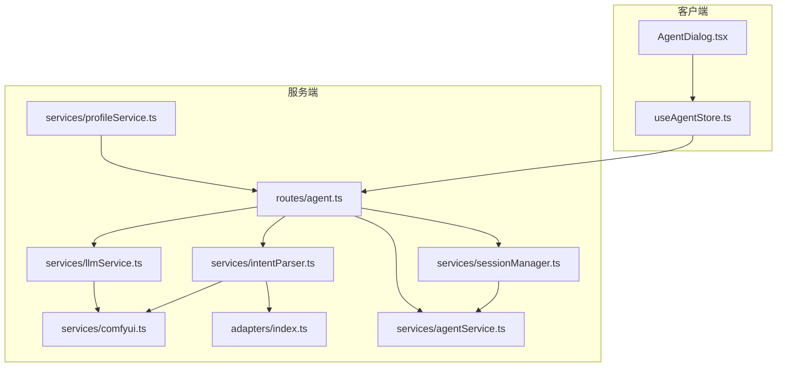
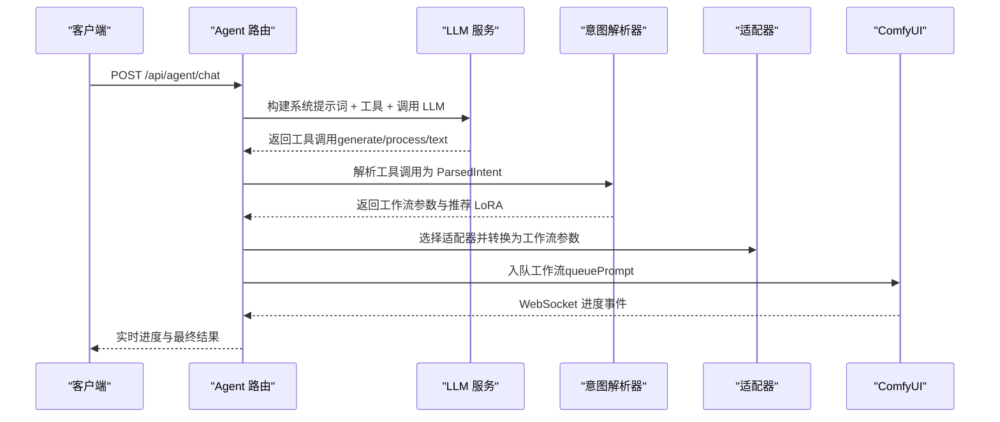
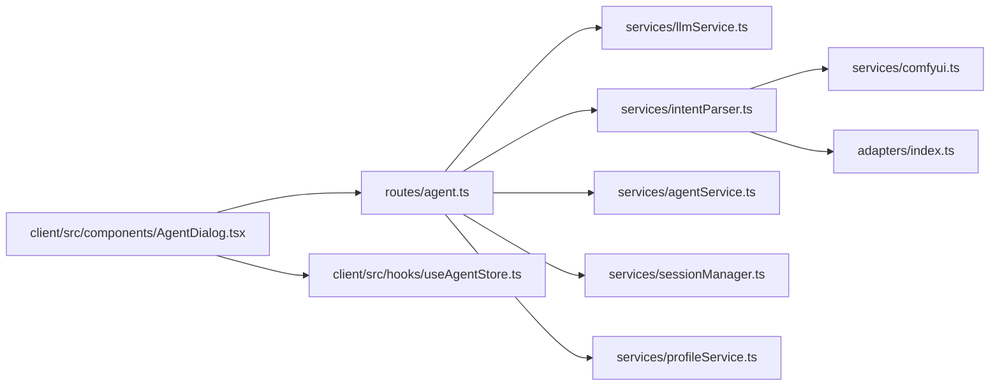
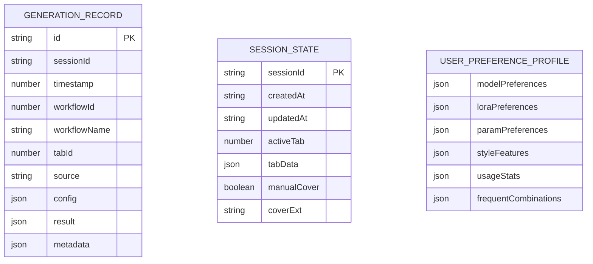

# AI Agent 路由

<cite>
**本文档引用的文件**
- [server/src/routes/agent.ts](file://server/src/routes/agent.ts)
- [server/src/services/agentService.ts](file://server/src/services/agentService.ts)
- [server/src/services/llmService.ts](file://server/src/services/llmService.ts)
- [server/src/services/intentParser.ts](file://server/src/services/intentParser.ts)
- [server/src/services/comfyui.ts](file://server/src/services/comfyui.ts)
- [server/src/services/sessionManager.ts](file://server/src/services/sessionManager.ts)
- [server/src/services/profileService.ts](file://server/src/services/profileService.ts)
- [server/src/adapters/index.ts](file://server/src/adapters/index.ts)
- [client/src/components/AgentDialog.tsx](file://client/src/components/AgentDialog.tsx)
- [client/src/hooks/useAgentStore.ts](file://client/src/hooks/useAgentStore.ts)
- [client/src/services/api.ts](file://client/src/services/api.ts)
</cite>

## 目录
1. [简介](#简介)
2. [项目结构](#项目结构)
3. [核心组件](#核心组件)
4. [架构概览](#架构概览)
5. [详细组件分析](#详细组件分析)
6. [依赖关系分析](#依赖关系分析)
7. [性能考虑](#性能考虑)
8. [故障排查指南](#故障排查指南)
9. [结论](#结论)
10. [附录](#附录)

## 简介
本文件为 CorineKit Pix2Real 的 AI Agent 路由技术文档，聚焦对话系统路由实现、消息发送、历史记录管理与会话状态维护，以及 LLM 服务集成、提示词处理与响应生成的路由逻辑。文档提供完整的 API 规范、上下文管理与错误处理机制说明，并包含配置选项、性能优化策略与集成指南，帮助开发者与使用者高效理解与扩展 AI Agent 能力。

## 项目结构
AI Agent 路由位于后端服务的 routes 目录，配合服务层（LLM、意图解析、ComfyUI、会话与偏好画像）与前端对话界面协同工作。整体采用模块化设计，路由负责对外暴露 API，服务层负责业务逻辑与外部系统交互，前端负责用户交互与状态管理。

图表来源
- [server/src/routes/agent.ts:611-649](file://server/src/routes/agent.ts#L611-L649)
- [server/src/services/llmService.ts:55-114](file://server/src/services/llmService.ts#L55-L114)
- [server/src/services/intentParser.ts:487-504](file://server/src/services/intentParser.ts#L487-L504)
- [server/src/services/comfyui.ts:168-196](file://server/src/services/comfyui.ts#L168-L196)
- [server/src/services/sessionManager.ts:102-122](file://server/src/services/sessionManager.ts#L102-L122)
- [server/src/services/agentService.ts:52-72](file://server/src/services/agentService.ts#L52-L72)
- [server/src/services/profileService.ts:77-250](file://server/src/services/profileService.ts#L77-L250)
- [server/src/adapters/index.ts:14-30](file://server/src/adapters/index.ts#L14-L30)

章节来源
- [server/src/routes/agent.ts:1-1200](file://server/src/routes/agent.ts#L1-L1200)
- [client/src/components/AgentDialog.tsx:1-800](file://client/src/components/AgentDialog.tsx#L1-L800)

## 核心组件
- 路由层（Agent 路由）：提供对话、暖场建议、批量随机生成、生成历史与收藏管理等 API。
- LLM 服务：封装 Grok API 调用、系统提示词构建、工具定义与函数调用解析。
- 意图解析器：将 LLM 的函数调用结果映射为工作流参数与推荐 LoRA/模型。
- ComfyUI 集成：上传资源、排队工作流、WebSocket 进度跟踪与系统状态查询。
- 会话与偏好画像：会话状态持久化、生成历史记录、用户偏好画像构建。
- 前端对话界面：消息渲染、执行状态管理、批量生成与卡片导航。

章节来源
- [server/src/routes/agent.ts:611-1200](file://server/src/routes/agent.ts#L611-L1200)
- [server/src/services/llmService.ts:55-114](file://server/src/services/llmService.ts#L55-L114)
- [server/src/services/intentParser.ts:487-641](file://server/src/services/intentParser.ts#L487-L641)
- [server/src/services/comfyui.ts:168-375](file://server/src/services/comfyui.ts#L168-L375)
- [server/src/services/sessionManager.ts:102-133](file://server/src/services/sessionManager.ts#L102-L133)
- [server/src/services/agentService.ts:52-126](file://server/src/services/agentService.ts#L52-L126)
- [server/src/services/profileService.ts:77-250](file://server/src/services/profileService.ts#L77-L250)
- [client/src/components/AgentDialog.tsx:1-800](file://client/src/components/AgentDialog.tsx#L1-L800)

## 架构概览
AI Agent 的核心流程：前端发起对话或配置请求 → 后端路由解析 → 构建系统提示词与工具 → LLM 生成工具调用 → 意图解析 → 工作流适配与 ComfyUI 执行 → WebSocket 实时进度 → 历史记录与会话状态更新。

图表来源
- [server/src/routes/agent.ts:611-649](file://server/src/routes/agent.ts#L611-L649)
- [server/src/services/llmService.ts:55-114](file://server/src/services/llmService.ts#L55-L114)
- [server/src/services/intentParser.ts:487-641](file://server/src/services/intentParser.ts#L487-L641)
- [server/src/adapters/index.ts:28-30](file://server/src/adapters/index.ts#L28-L30)
- [server/src/services/comfyui.ts:168-196](file://server/src/services/comfyui.ts#L168-L196)

## 详细组件分析

### 路由层（Agent 路由）
- 对外 API
  - GET /api/agent/suggestions：获取暖场建议（支持 agent/config_assistant/smart_qa 三种模式）
  - POST /api/agent/chat：对话入口，支持文本与图片输入，返回工具调用或文本回复
  - POST /api/agent/execute：执行解析后的意图（工作流参数）
  - POST /api/agent/random-batch：批量随机生成（骰子模式）
  - POST /api/agent/log-generation：记录生成日志
  - GET /api/agent/generation-history：获取生成历史
  - GET /api/agent/favorites：获取收藏
  - POST /api/agent/favorite：收藏/取消收藏
- 会话与偏好画像
  - 通过 sessionId 读取/写入 generation-log.json 与 favorites.json
  - 通过 buildUserProfile 聚合全量会话数据构建用户偏好画像
- 暖场建议
  - 根据用户画像成熟度（冷/暖/热）选择不同策略
  - 支持配置助理与智能问答模式的专属建议
- 批量随机生成
  - 支持 preference/tweak/explore 三档位，可选自动比例与内容策略
  - LLM 返回 cardName 与 ratio（可选），用于卡片命名与尺寸映射

章节来源
- [server/src/routes/agent.ts:611-1200](file://server/src/routes/agent.ts#L611-L1200)
- [server/src/services/agentService.ts:52-126](file://server/src/services/agentService.ts#L52-L126)
- [server/src/services/profileService.ts:77-250](file://server/src/services/profileService.ts#L77-L250)

### LLM 服务
- LLM 调用
  - 封装 Grok API，支持 tools 与 tool_choice
  - 统一 LLMRequest/LLMResponse 接口
- 系统提示词构建
  - buildSystemPrompt：整合用户偏好画像、可用模型与 LoRA 列表
  - buildConfigAssistantPrompt：配置助理模式专用提示词（支持 LoRA 锁定/解锁）
- 工具定义
  - getAgentTools：generate_image/process_image/text_response
  - 配置助理模式工具：apply_config/report_lora_conflict（用于参数变更与冲突检测）

章节来源
- [server/src/services/llmService.ts:55-114](file://server/src/services/llmService.ts#L55-L114)
- [server/src/services/llmService.ts:344-489](file://server/src/services/llmService.ts#L344-L489)
- [server/src/services/llmService.ts:493-712](file://server/src/services/llmService.ts#L493-L712)
- [server/src/services/llmService.ts:192-302](file://server/src/services/llmService.ts#L192-L302)

### 意图解析器
- 工具调用解析
  - parseToolCall：将 LLM 函数调用解析为 ParsedIntent
- LoRA 匹配
  - findMatchingLorasFromPrompt：基于提示词与关键词匹配 LoRA
  - findMatchingLoras：关键词兜底匹配
- 模型推荐
  - recommendBaseModel：根据 LoRA 兼容性与用户偏好推荐基础模型
- 变体生成
  - 支持 variants 参数，为每个变体独立解析与推荐

章节来源
- [server/src/services/intentParser.ts:487-641](file://server/src/services/intentParser.ts#L487-L641)
- [server/src/services/intentParser.ts:150-266](file://server/src/services/intentParser.ts#L150-L266)
- [server/src/services/intentParser.ts:397-483](file://server/src/services/intentParser.ts#L397-L483)

### ComfyUI 集成
- 资源上传
  - uploadImage/uploadVideo：上传图片/视频到 ComfyUI
- 工作流执行
  - queuePrompt：提交工作流到队列
  - getHistory/getImageBuffer：获取历史与输出图片
- 进度跟踪
  - connectWebSocket：WebSocket 监听进度、执行开始/完成、错误事件
  - 节点权重估算与阶段化进度展示
- 系统状态
  - getSystemStats：查询 VRAM/内存使用率

章节来源
- [server/src/services/comfyui.ts:9-45](file://server/src/services/comfyui.ts#L9-L45)
- [server/src/services/comfyui.ts:168-196](file://server/src/services/comfyui.ts#L168-L196)
- [server/src/services/comfyui.ts:198-220](file://server/src/services/comfyui.ts#L198-L220)
- [server/src/services/comfyui.ts:265-375](file://server/src/services/comfyui.ts#L265-L375)
- [server/src/services/comfyui.ts:415-440](file://server/src/services/comfyui.ts#L415-L440)

### 会话与偏好画像
- 会话状态
  - saveState/loadSession/listSessions/deleteSession：会话状态的持久化与管理
  - ensureSessionDirs：确保会话目录结构
- 生成历史
  - readGenerationLog/appendGenerationLog：读取/追加生成记录
  - updateGenerationLogFavorite：更新收藏状态
- 偏好画像
  - buildUserProfile：聚合全量会话数据，构建模型/LoRA/参数/风格偏好与使用统计

章节来源
- [server/src/services/sessionManager.ts:102-133](file://server/src/services/sessionManager.ts#L102-L133)
- [server/src/services/sessionManager.ts:145-172](file://server/src/services/sessionManager.ts#L145-L172)
- [server/src/services/agentService.ts:52-126](file://server/src/services/agentService.ts#L52-L126)
- [server/src/services/profileService.ts:77-250](file://server/src/services/profileService.ts#L77-L250)

### 前端对话界面
- 状态管理
  - useAgentStore：消息、执行状态、上传图片、收藏、配置快照等
- 对话流程
  - 发送消息 → 调用 /api/agent/chat → 解析工具调用 → 执行工作流 → WebSocket 进度 → 生成完成消息与后续建议
- 批量生成
  - /api/agent/random-batch：三档位批量生成，支持自动比例与内容策略
- 导航与卡片
  - 生成完成后跳转到目标卡片并高亮闪烁

章节来源
- [client/src/components/AgentDialog.tsx:1-800](file://client/src/components/AgentDialog.tsx#L1-L800)
- [client/src/hooks/useAgentStore.ts:198-337](file://client/src/hooks/useAgentStore.ts#L198-L337)

## 依赖关系分析

图表来源
- [server/src/routes/agent.ts:1-1200](file://server/src/routes/agent.ts#L1-L1200)
- [server/src/services/llmService.ts:55-114](file://server/src/services/llmService.ts#L55-L114)
- [server/src/services/intentParser.ts:487-641](file://server/src/services/intentParser.ts#L487-L641)
- [server/src/services/comfyui.ts:168-196](file://server/src/services/comfyui.ts#L168-L196)
- [server/src/adapters/index.ts:14-30](file://server/src/adapters/index.ts#L14-L30)
- [client/src/components/AgentDialog.tsx:1-800](file://client/src/components/AgentDialog.tsx#L1-L800)

章节来源
- [server/src/routes/agent.ts:1-1200](file://server/src/routes/agent.ts#L1-L1200)
- [server/src/services/llmService.ts:55-114](file://server/src/services/llmService.ts#L55-L114)
- [server/src/services/intentParser.ts:487-641](file://server/src/services/intentParser.ts#L487-L641)
- [server/src/services/comfyui.ts:168-196](file://server/src/services/comfyui.ts#L168-L196)
- [server/src/adapters/index.ts:14-30](file://server/src/adapters/index.ts#L14-L30)
- [client/src/components/AgentDialog.tsx:1-800](file://client/src/components/AgentDialog.tsx#L1-L800)

## 性能考虑
- LLM 调用
  - 使用工具调用减少多轮往返，提高解析准确性
  - temperature 与 tool_choice 控制输出稳定性与必需字段返回
- 资源上传与队列
  - 上传图片/视频采用表单方式，支持覆盖写入
  - 队列优先级调整：prioritizeQueueItem 将目标任务置顶
- 进度估算
  - 基于节点类型与步骤数估算权重，结合 WebSocket 事件实现阶段化进度
- 缓存与过滤
  - 元数据缓存（TTL 1 分钟），减少频繁文件读取
  - 偏好画像过滤骰子未收藏图，避免噪声污染

章节来源
- [server/src/services/llmService.ts:55-114](file://server/src/services/llmService.ts#L55-L114)
- [server/src/services/comfyui.ts:131-166](file://server/src/services/comfyui.ts#L131-L166)
- [server/src/routes/agent.ts:21-34](file://server/src/routes/agent.ts#L21-L34)
- [server/src/services/profileService.ts:103-111](file://server/src/services/profileService.ts#L103-L111)

## 故障排查指南
- LLM API 错误
  - 检查 Authorization 与 API Key，确认响应状态码与错误文本
- 工具调用解析失败
  - 确认 LLM 返回的 arguments 为合法 JSON，字段包含必需参数
- ComfyUI 连接异常
  - 检查 WebSocket 地址与 clientId，关注 execution_error 事件
- 生成历史写入失败
  - 确认 sessionId 与记录字段完整性，查看异步写入日志
- 偏好画像异常
  - 检查 generation-log.json 与 favorites.json 格式，确认 sessionId 目录存在

章节来源
- [server/src/services/llmService.ts:77-81](file://server/src/services/llmService.ts#L77-L81)
- [server/src/services/intentParser.ts:487-504](file://server/src/services/intentParser.ts#L487-L504)
- [server/src/services/comfyui.ts:350-364](file://server/src/services/comfyui.ts#L350-L364)
- [server/src/services/agentService.ts:1172-1178](file://server/src/services/agentService.ts#L1172-L1178)
- [server/src/services/profileService.ts:88-99](file://server/src/services/profileService.ts#L88-L99)

## 结论
AI Agent 路由通过清晰的模块划分与稳健的 LLM/意图解析/工作流适配链路，实现了从自然语言到工作流执行的完整闭环。配合会话状态与偏好画像，系统能够持续学习并提供个性化建议。前端对话界面与 WebSocket 实时反馈进一步提升了用户体验。建议在生产环境中重点关注 LLM API 稳定性、队列优先级与进度估算精度，以及偏好画像的数据清洗与缓存策略。

## 附录

### API 规范

- 获取暖场建议
  - 方法：GET
  - 路径：/api/agent/suggestions
  - 查询参数：
    - sessionId：会话 ID（可选，默认 default）
    - mode：模式（agent/config_assistant/smart_qa，默认 agent）
  - 响应：包含 suggestions 的数组

- 对话聊天
  - 方法：POST
  - 路径：/api/agent/chat
  - 请求体：
    - sessionId：会话 ID
    - message：用户消息
    - messages：历史消息（不包含当前消息）
    - images：图片 URL 数组（可选）
    - hasImage：是否包含图片（布尔）
    - mode：模式（agent/config_assistant/smart_qa）
    - currentConfig：配置助理模式当前面板配置（可选）
    - allowLoraModification：是否允许修改 LoRA（可选）
  - 响应：
    - type：text/tool_call/config_change/lora_conflict
    - message：文本回复（text/tool_call/config_change）
    - intent：ParsedIntent（tool_call）
    - summary：中文摘要（config_change）
    - changes：配置变更（config_change）
    - suggestions：后续建议（tool_call/config_change）
    - conflicts：冲突项（lora_conflict）

- 执行意图
  - 方法：POST
  - 路径：/api/agent/execute
  - 请求体：
    - intent：ParsedIntent
    - clientId：ComfyUI 客户端 ID
    - sessionId：会话 ID
    - imageData：图片 Base64（可选，仅图片处理工作流）
    - imageFilename：图片文件名（可选）
  - 响应：
    - promptId：工作流 promptId
    - workflowId：工作流 ID
    - tabId：目标 Tab
    - resolvedConfig：解析后的配置
    - allPromptIds：批量模式下的所有 promptId（可选）
    - batchTotal：批量总数（可选）

- 批量随机生成（骰子）
  - 方法：POST
  - 路径：/api/agent/random-batch
  - 请求体：
    - preferenceCount：偏好档位数量
    - tweakCount：调整档位数量
    - exploreCount：探索档位数量
    - ratioMode：比例模式（manual/auto）
    - contentPolicy：内容策略（sfw/mixed/nsfw）
    - userIntent：用户意向（可选）
    - temperature：发散温度（low/medium/high）
  - 响应：
    - items：生成的项目数组（包含 category/prompt/recommendedLoras/recommendedModel/ratio/width/height/cardName）
    - fallback：是否存在回退
    - maturity：画像成熟度

- 记录生成日志
  - 方法：POST
  - 路径：/api/agent/log-generation
  - 请求体：GenerationRecord
  - 响应：{ ok: true }

- 获取生成历史
  - 方法：GET
  - 路径：/api/agent/generation-history
  - 查询参数：sessionId
  - 响应：GenerationRecord[]

- 收藏/取消收藏
  - 方法：POST
  - 路径：/api/agent/favorite
  - 请求体：{ sessionId, imageId, tabId, isFavorited }
  - 响应：{ ok: true }

- 获取收藏
  - 方法：GET
  - 路径：/api/agent/favorites
  - 查询参数：sessionId
  - 响应：{ [imageId]: { tabId, favoritedAt } }

章节来源
- [server/src/routes/agent.ts:613-649](file://server/src/routes/agent.ts#L613-L649)
- [server/src/routes/agent.ts:1026-1161](file://server/src/routes/agent.ts#L1026-L1161)
- [server/src/routes/agent.ts:1163-1200](file://server/src/routes/agent.ts#L1163-L1200)
- [server/src/services/agentService.ts:52-126](file://server/src/services/agentService.ts#L52-L126)
- [client/src/components/AgentDialog.tsx:641-774](file://client/src/components/AgentDialog.tsx#L641-L774)

### 数据模型

图表来源
- [server/src/services/agentService.ts:5-46](file://server/src/services/agentService.ts#L5-L46)
- [server/src/services/sessionManager.ts:66-101](file://server/src/services/sessionManager.ts#L66-L101)
- [server/src/services/profileService.ts:7-49](file://server/src/services/profileService.ts#L7-L49)

### 配置选项与集成指南
- LLM 配置
  - Grok API URL/Key/Model 在 llmService.ts 中集中配置
  - temperature 与 tool_choice 可按场景调整
- 工作流适配
  - 通过 adapters/index.ts 注册与获取适配器，将 ParsedIntent 转换为工作流参数
- 前端集成
  - 使用 useAgentStore 管理消息与执行状态
  - 通过 WebSocket 监听进度事件，实现阶段化反馈
  - 支持配置助理模式的 LoRA 锁定与冲突检测

章节来源
- [server/src/services/llmService.ts:49-51](file://server/src/services/llmService.ts#L49-L51)
- [server/src/adapters/index.ts:14-30](file://server/src/adapters/index.ts#L14-L30)
- [client/src/hooks/useAgentStore.ts:198-337](file://client/src/hooks/useAgentStore.ts#L198-L337)