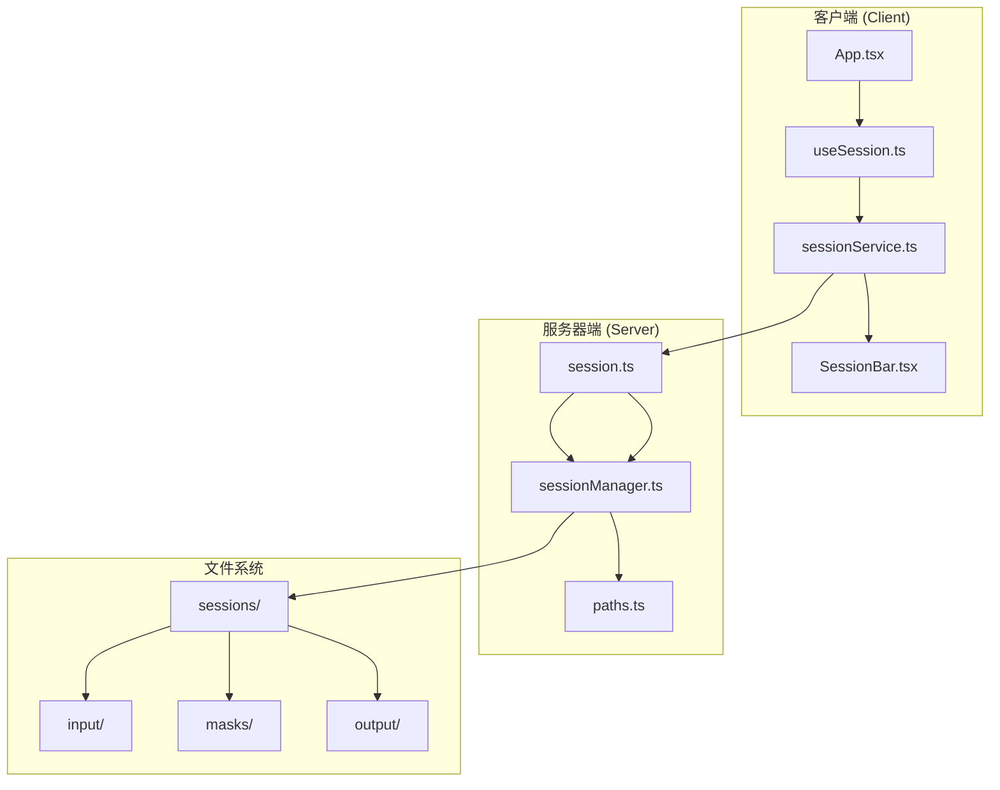
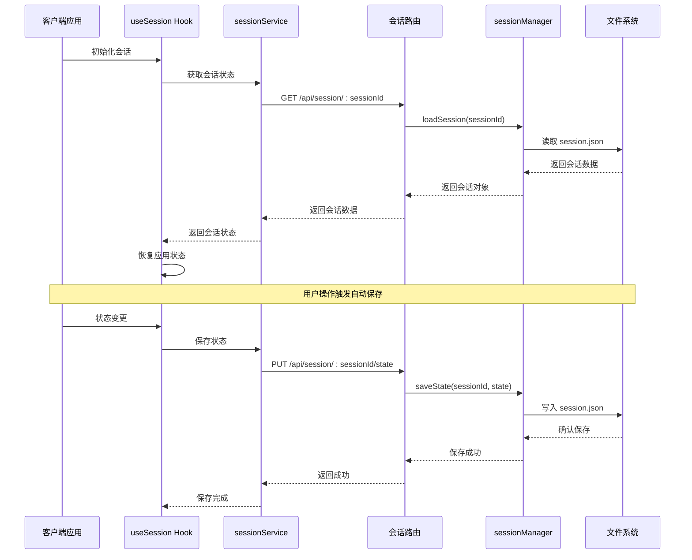
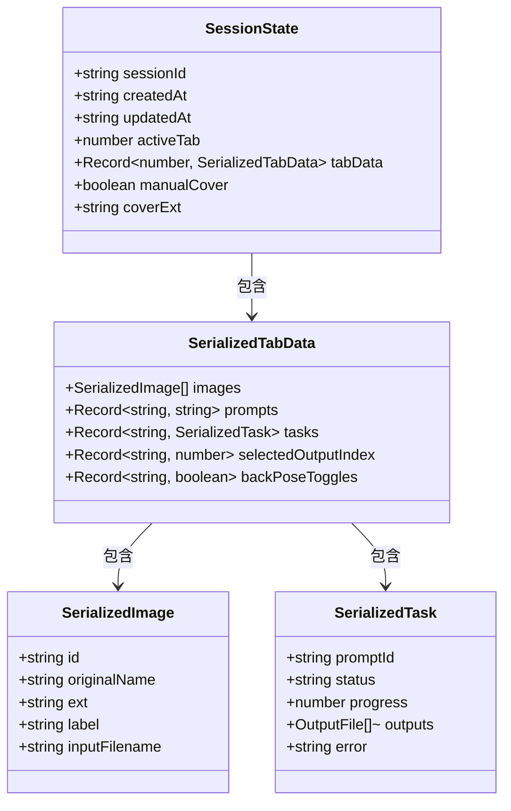
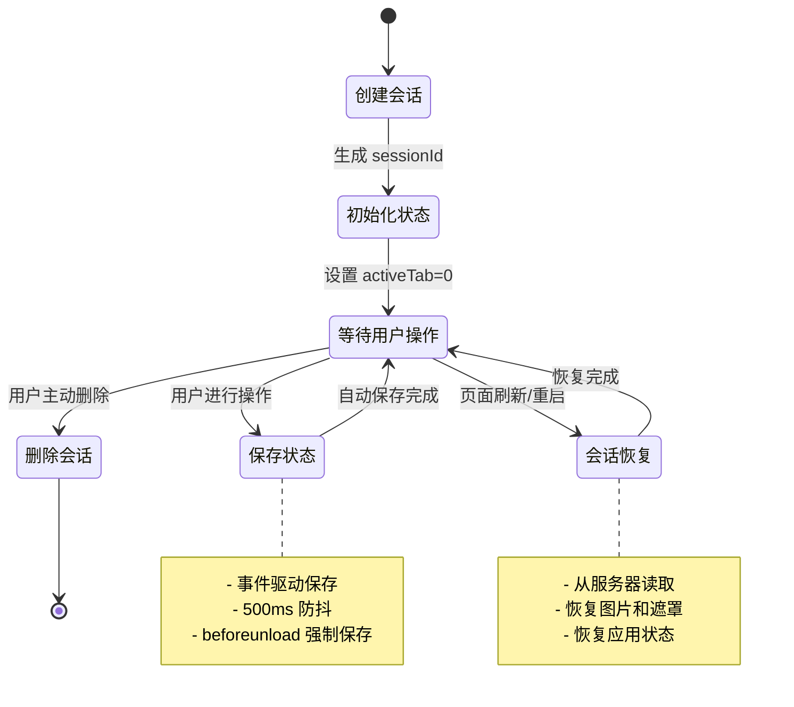
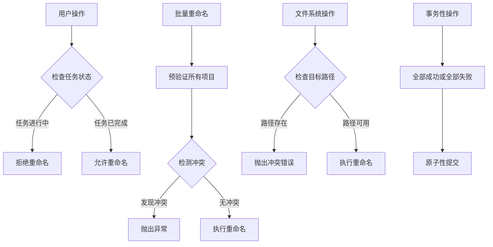
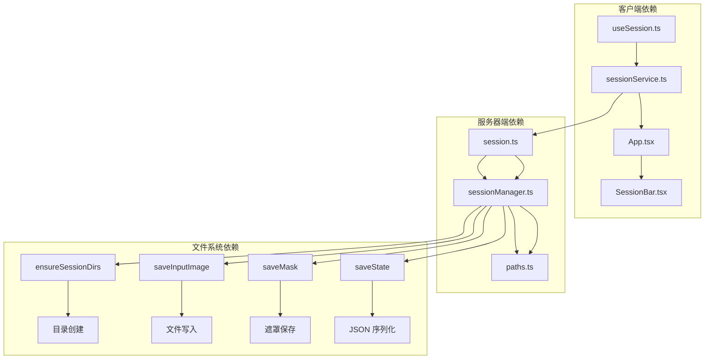

# 会话管理路由

<cite>
**本文档引用的文件**
- [server/src/routes/session.ts](file://server/src/routes/session.ts)
- [server/src/services/sessionManager.ts](file://server/src/services/sessionManager.ts)
- [server/src/config/paths.ts](file://server/src/config/paths.ts)
- [client/src/hooks/useSession.ts](file://client/src/hooks/useSession.ts)
- [client/src/services/sessionService.ts](file://client/src/services/sessionService.ts)
- [client/src/components/SessionBar.tsx](file://client/src/components/SessionBar.tsx)
- [client/src/components/App.tsx](file://client/src/components/App.tsx)
- [TODO-session-persistence.md](file://TODO-session-persistence.md)
- [README.md](file://README.md)
</cite>

## 目录
1. [简介](#简介)
2. [项目结构](#项目结构)
3. [核心组件](#核心组件)
4. [架构概览](#架构概览)
5. [详细组件分析](#详细组件分析)
6. [依赖关系分析](#依赖关系分析)
7. [性能考虑](#性能考虑)
8. [故障排除指南](#故障排除指南)
9. [结论](#结论)
10. [附录](#附录)

## 简介

CorineKit Pix2Real 的会话管理路由为用户提供了完整的会话生命周期管理功能，包括会话创建、更新、删除和状态同步。该系统支持多标签页状态管理、会话恢复功能以及并发控制策略，确保用户在关闭/重新打开浏览器后能够自动恢复上次的工作状态。

会话管理系统采用前后端分离的架构设计，前端负责状态收集和用户交互，后端负责数据持久化和文件存储。系统支持实时进度同步、批量操作和事务性操作，为复杂的图像处理工作流提供了可靠的状态管理基础。

## 项目结构

会话管理功能分布在客户端和服务器端两个主要部分：

**图表来源**
- [server/src/routes/session.ts:1-163](file://server/src/routes/session.ts#L1-L163)
- [server/src/services/sessionManager.ts:1-539](file://server/src/services/sessionManager.ts#L1-L539)
- [server/src/config/paths.ts:1-156](file://server/src/config/paths.ts#L1-L156)

**章节来源**
- [README.md:41-62](file://README.md#L41-L62)
- [TODO-session-persistence.md:13-26](file://TODO-session-persistence.md#L13-L26)

## 核心组件

### 服务器端会话路由

服务器端会话路由提供了完整的 REST API 接口，支持会话的全生命周期管理：

- **会话创建**: 通过会话 ID 自动生成和初始化
- **状态保存**: 支持正常保存和页面关闭时的强制保存
- **文件上传**: 输入图片和遮罩文件的上传处理
- **会话查询**: 单个会话查询和会话列表查询
- **会话删除**: 完整删除指定会话及其所有数据
- **资产重命名**: 单个卡片和批量卡片的资产重命名功能

### 客户端会话管理

客户端会话管理通过 React Hook 实现，提供以下核心功能：

- **会话初始化**: 从本地存储读取或生成新的会话 ID
- **状态序列化**: 将应用状态转换为可持久化的结构
- **自动保存**: 基于事件驱动的静默自动保存机制
- **会话恢复**: 从服务器恢复会话状态和文件资源
- **多标签页支持**: 支持跨标签页的状态同步和并发控制

**章节来源**
- [server/src/routes/session.ts:21-163](file://server/src/routes/session.ts#L21-L163)
- [client/src/hooks/useSession.ts:118-435](file://client/src/hooks/useSession.ts#L118-L435)

## 架构概览

会话管理系统采用分层架构设计，确保各层职责清晰且松耦合：

**图表来源**
- [client/src/hooks/useSession.ts:168-179](file://client/src/hooks/useSession.ts#L168-L179)
- [server/src/routes/session.ts:54-71](file://server/src/routes/session.ts#L54-L71)
- [server/src/services/sessionManager.ts:102-122](file://server/src/services/sessionManager.ts#L102-L122)

## 详细组件分析

### 会话数据结构定义

会话管理系统使用标准化的数据结构来表示会话状态：

**图表来源**
- [server/src/services/sessionManager.ts:66-100](file://server/src/services/sessionManager.ts#L66-L100)

### 会话生命周期管理

会话生命周期管理涵盖了从创建到销毁的完整过程：

**图表来源**
- [client/src/hooks/useSession.ts:294-400](file://client/src/hooks/useSession.ts#L294-L400)
- [client/src/hooks/useSession.ts:410-431](file://client/src/hooks/useSession.ts#L410-L431)

### 并发控制策略

系统实现了多层并发控制来确保数据一致性：

**图表来源**
- [server/src/services/sessionManager.ts:276-281](file://server/src/services/sessionManager.ts#L276-L281)
- [server/src/services/sessionManager.ts:427-430](file://server/src/services/sessionManager.ts#L427-L430)

### API 规范

#### 会话管理 API

| 方法 | 路径 | 描述 | 请求体 | 响应 |
|------|------|------|--------|------|
| POST | `/api/session/:sessionId/images` | 上传输入图片 | multipart/form-data: image, tabId, imageId | `{ url: string }` |
| POST | `/api/session/:sessionId/masks` | 上传遮罩文件 | multipart/form-data: mask, tabId, maskKey | `{ ok: true }` |
| PUT | `/api/session/:sessionId/state` | 保存会话状态 | JSON: `{ activeTab, tabData }` | `{ ok: true }` |
| POST | `/api/session/:sessionId/state` | 强制保存会话状态 | JSON: `{ activeTab, tabData }` | `{ ok: true }` |
| GET | `/api/session/:sessionId` | 获取会话详情 | - | `SessionData` |
| GET | `/api/sessions` | 获取会话列表 | - | `SessionMeta[]` |
| POST | `/api/session/:sessionId/cover` | 设置封面图片 | `{ sourceUrl: string }` | `{ coverUrl: string }` |
| DELETE | `/api/session/:sessionId` | 删除会话 | - | `{ ok: true }` |
| POST | `/api/session/:sessionId/rename-card` | 重命名单个卡片 | `{ tabId, imageId, label }` | `RenameCardResult` |
| POST | `/api/session/:sessionId/rename-cards-batch` | 批量重命名卡片 | `{ tabId, items }` | `BatchRenameItemResult[]` |

#### 错误处理

系统提供了统一的错误处理机制：

- **400 Bad Request**: 参数缺失或无效
- **404 Not Found**: 会话不存在
- **400 业务错误**: 文件名冲突、任务进行中等业务逻辑错误
- **500 Internal Server Error**: 服务器内部错误

**章节来源**
- [server/src/routes/session.ts:21-163](file://server/src/routes/session.ts#L21-L163)
- [client/src/services/sessionService.ts:88-232](file://client/src/services/sessionService.ts#L88-L232)

## 依赖关系分析

会话管理系统涉及多个层次的依赖关系：

**图表来源**
- [client/src/hooks/useSession.ts:8-18](file://client/src/hooks/useSession.ts#L8-L18)
- [server/src/routes/session.ts:4-16](file://server/src/routes/session.ts#L4-L16)
- [server/src/services/sessionManager.ts:11-18](file://server/src/services/sessionManager.ts#L11-L18)

### 数据持久化机制

会话数据持久化采用分层存储策略：

1. **状态文件存储**: `session.json` 存储会话元数据和状态
2. **文件系统存储**: 输入图片、遮罩文件和输出文件分别存储
3. **缓存机制**: 内存中的会话状态用于快速访问
4. **备份策略**: 自动清理机制保持磁盘空间合理使用

**章节来源**
- [server/src/services/sessionManager.ts:102-122](file://server/src/services/sessionManager.ts#L102-L122)
- [server/src/services/sessionManager.ts:220-226](file://server/src/services/sessionManager.ts#L220-L226)

## 性能考虑

### 自动保存策略

系统采用事件驱动的自动保存机制，通过防抖技术减少不必要的网络请求：

- **500ms 防抖延迟**: 避免频繁保存导致的性能问题
- **批量保存**: 合并多个状态变更到一次保存操作
- **条件保存**: 空会话不保存，减少无效操作

### 文件上传优化

文件上传采用流式处理和内存管理策略：

- **内存存储**: 使用 `multer.memoryStorage()` 减少磁盘 I/O
- **异步处理**: 文件上传完成后立即更新会话状态
- **错误恢复**: 上传失败时自动重试和状态回滚

### 并发控制优化

系统通过多种机制确保并发安全性：

- **任务状态检查**: 防止在任务执行期间进行文件重命名
- **文件系统锁定**: 使用原子性操作避免竞态条件
- **事务性批处理**: 批量操作要么全部成功，要么全部失败

## 故障排除指南

### 常见问题及解决方案

#### 会话恢复失败

**症状**: 页面刷新后无法恢复会话状态

**可能原因**:
- 服务器端会话文件损坏
- 客户端本地存储异常
- 网络连接问题

**解决步骤**:
1. 检查服务器端 `sessions/` 目录是否存在
2. 清除浏览器本地存储中的会话 ID
3. 重新启动应用并创建新的会话

#### 文件上传失败

**症状**: 图片或遮罩文件无法上传

**可能原因**:
- 磁盘空间不足
- 文件权限问题
- 网络连接中断

**解决步骤**:
1. 检查磁盘空间和权限
2. 确认网络连接稳定
3. 重新尝试上传操作

#### 会话删除异常

**症状**: 删除会话后仍能看到相关文件

**可能原因**:
- 文件系统权限不足
- 正在使用的文件被占用

**解决步骤**:
1. 关闭所有可能使用这些文件的应用
2. 重新尝试删除操作
3. 检查文件系统权限

**章节来源**
- [client/src/hooks/useSession.ts:388-396](file://client/src/hooks/useSession.ts#L388-L396)
- [server/src/services/sessionManager.ts:166-172](file://server/src/services/sessionManager.ts#L166-L172)

## 结论

CorineKit Pix2Real 的会话管理路由提供了一个完整、可靠的会话生命周期管理解决方案。系统通过前后端协作、多层并发控制和智能的自动保存机制，确保了用户数据的安全性和应用的稳定性。

主要优势包括：
- **完整的生命周期管理**: 从创建到销毁的全流程支持
- **智能自动保存**: 基于事件驱动的静默保存机制
- **强并发控制**: 多层保护确保数据一致性
- **灵活的文件管理**: 支持多种文件类型的处理
- **用户友好的界面**: 直观的会话管理和状态显示

该系统为复杂的图像处理工作流提供了坚实的基础，支持用户在不同设备和浏览器环境下无缝切换工作状态。

## 附录

### 最佳实践指南

#### 会话管理最佳实践

1. **合理使用自动保存**: 利用系统的自动保存机制，避免手动频繁保存
2. **定期清理会话**: 使用自动清理功能保持磁盘空间合理使用
3. **备份重要会话**: 对重要的工作会话进行手动备份
4. **监控磁盘空间**: 定期检查磁盘使用情况，及时清理不需要的会话

#### 性能优化建议

1. **合理设置防抖时间**: 根据使用场景调整自动保存的防抖时间
2. **优化文件大小**: 控制输入文件的大小，提高上传和处理效率
3. **使用合适的视图**: 根据内容选择合适的视图模式，减少渲染负担
4. **定期重启应用**: 定期重启应用清理内存和缓存

#### 安全注意事项

1. **文件权限管理**: 确保会话目录具有适当的读写权限
2. **数据备份**: 定期备份重要的会话数据
3. **网络安全**: 在公共网络环境下谨慎使用会话功能
4. **隐私保护**: 注意会话中可能包含的敏感信息