# ZIT快出工作流

<cite>
**本文档引用的文件**
- [Pix2Real-ZIT文生图NEW.json](file://ComfyUI_API/Pix2Real-ZIT文生图NEW.json)
- [Pix2Real-ZIT文生图NEW2.json](file://ComfyUI_API/Pix2Real-ZIT文生图NEW2.json)
- [ZITSidebar.tsx](file://client/src/components/ZITSidebar.tsx)
- [Workflow9Adapter.ts](file://server/src/adapters/Workflow9Adapter.ts)
- [workflow.ts](file://server/src/routes/workflow.ts)
- [useWorkflowStore.ts](file://client/src/hooks/useWorkflowStore.ts)
- [sessionService.ts](file://client/src/services/sessionService.ts)
- [comfyui.ts](file://server/src/services/comfyui.ts)
- [index.ts](file://client/src/types/index.ts)
</cite>

## 目录
1. [简介](#简介)
2. [项目结构](#项目结构)
3. [核心组件](#核心组件)
4. [架构概览](#架构概览)
5. [详细组件分析](#详细组件分析)
6. [依赖关系分析](#依赖关系分析)
7. [性能考虑](#性能考虑)
8. [故障排除指南](#故障排除指南)
9. [结论](#结论)
10. [附录](#附录)

## 简介

ZIT快出工作流(WF9)是CorineKit Pix2Real项目中的专业文生图工作流，专为快速高质量图像生成而设计。该工作流采用Z-image模型生态系统，结合AuraFlow采样算法，实现了高效的图像生成流程。

该工作流的主要特色包括：
- **高级提示词处理**：支持复杂的提示词编码和条件处理
- **图像质量优化**：通过AuraFlow采样算法和LoRA模型实现高质量输出
- **批量生成能力**：支持多张图像的批量处理和队列管理
- **灵活的参数配置**：提供丰富的采样器选择和质量控制选项

## 项目结构

ZIT快出工作流涉及前后端多个组件的协作：

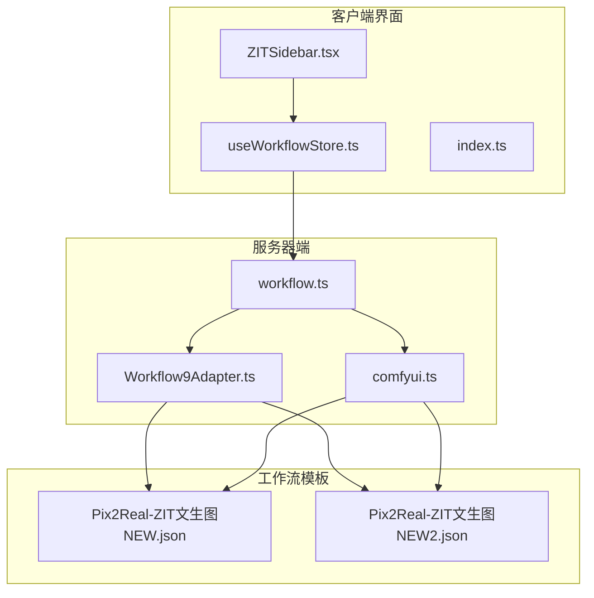

**图表来源**
- [ZITSidebar.tsx:1-800](file://client/src/components/ZITSidebar.tsx#L1-L800)
- [workflow.ts:485-593](file://server/src/routes/workflow.ts#L485-L593)
- [Workflow9Adapter.ts:1-14](file://server/src/adapters/Workflow9Adapter.ts#L1-L14)

**章节来源**
- [ZITSidebar.tsx:1-800](file://client/src/components/ZITSidebar.tsx#L1-L800)
- [workflow.ts:1-800](file://server/src/routes/workflow.ts#L1-L800)

## 核心组件

### ZIT工作流配置接口

ZIT工作流的核心配置通过ZitConfig接口定义，包含以下关键参数：

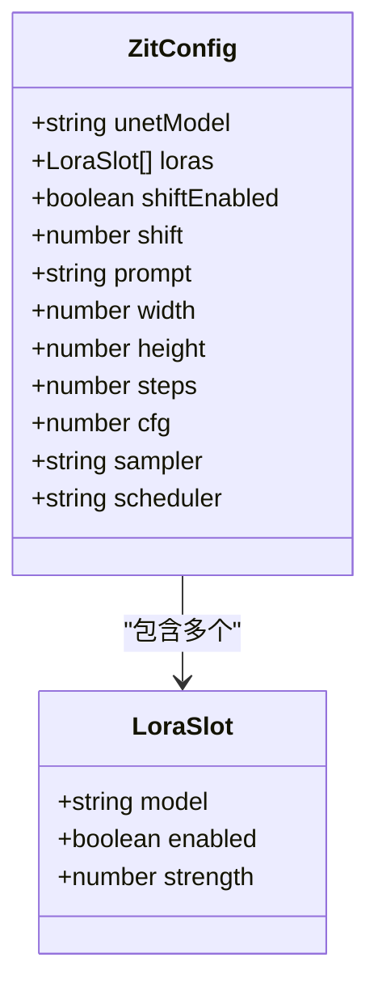

**图表来源**
- [sessionService.ts:29-41](file://client/src/services/sessionService.ts#L29-L41)
- [sessionService.ts:4-8](file://client/src/services/sessionService.ts#L4-L8)

### 采样器和调度器配置

工作流支持多种采样器和调度器组合：

| 采样器类型 | 说明 | 适用场景 |
|-----------|------|----------|
| euler | 欧拉方法 | 通用快速生成 |
| euler_a | 欧拉祖先采样 | 更稳定的生成结果 |
| res_ms | 多步祖先采样 | 高质量细节保留 |
| dpmpp_2m | DPM++ 2M采样 | 极高质量生成 |

**章节来源**
- [ZITSidebar.tsx:24-29](file://client/src/components/ZITSidebar.tsx#L24-L29)
- [workflow.ts:485-593](file://server/src/routes/workflow.ts#L485-L593)

## 架构概览

ZIT快出工作流采用分层架构设计，从前端界面到后端服务再到ComfyUI执行引擎：

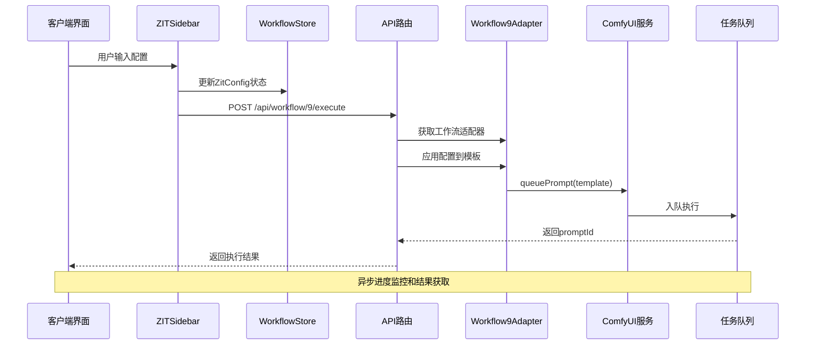

**图表来源**
- [ZITSidebar.tsx:345-419](file://client/src/components/ZITSidebar.tsx#L345-L419)
- [workflow.ts:485-593](file://server/src/routes/workflow.ts#L485-L593)
- [Workflow9Adapter.ts:3-13](file://server/src/adapters/Workflow9Adapter.ts#L3-L13)

## 详细组件分析

### 工作流模板差异分析

#### ZIT文生图NEW.json (基础版本)

基础版本工作流模板提供了核心的ZIT生成功能：

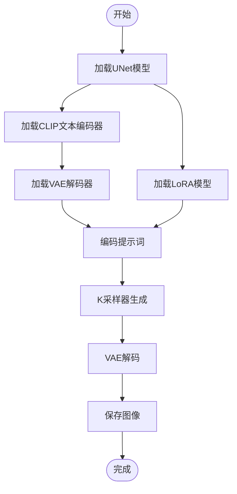

**图表来源**
- [Pix2Real-ZIT文生图NEW.json:1-172](file://ComfyUI_API/Pix2Real-ZIT文生图NEW.json#L1-L172)

#### ZIT文生图NEW2.json (增强版本)

增强版本在基础版本上增加了多LoRA链式处理和条件开关功能：

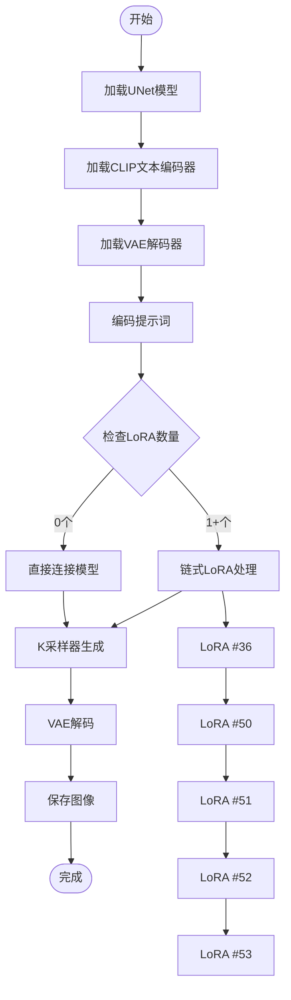

**图表来源**
- [Pix2Real-ZIT文生图NEW2.json:1-265](file://ComfyUI_API/Pix2Real-ZIT文生图NEW2.json#L1-L265)

### 参数配置详解

#### 分辨率设置

工作流支持多种预设比例和自定义尺寸：

| 比例 | 宽度 | 高度 | 适用场景 |
|------|------|------|----------|
| 1:1 | 1024 | 1024 | 正方形头像、图标 |
| 3:4 | 832 | 1216 | 竖版人像、证件照 |
| 9:16 | 768 | 1344 | 手机竖屏、短视频封面 |
| 4:3 | 1216 | 832 | 横版海报、风景画 |
| 16:9 | 1344 | 768 | 电影海报、横版宣传图 |

#### 采样器选择策略

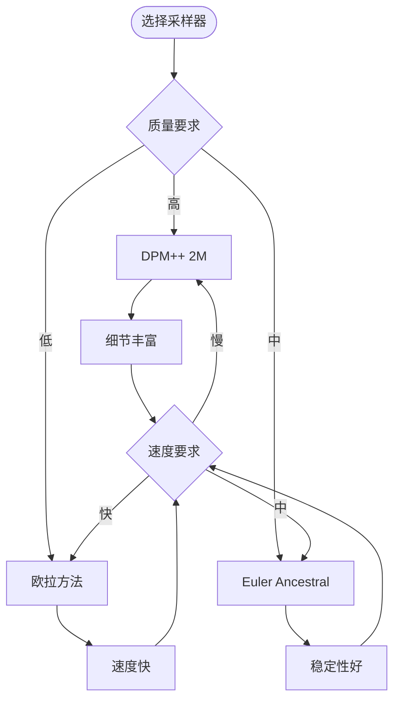

**图表来源**
- [ZITSidebar.tsx:24-29](file://client/src/components/ZITSidebar.tsx#L24-L29)
- [workflow.ts:485-593](file://server/src/routes/workflow.ts#L485-L593)

#### LoRA模型链式处理

增强版本支持最多5个LoRA模型的链式组合：

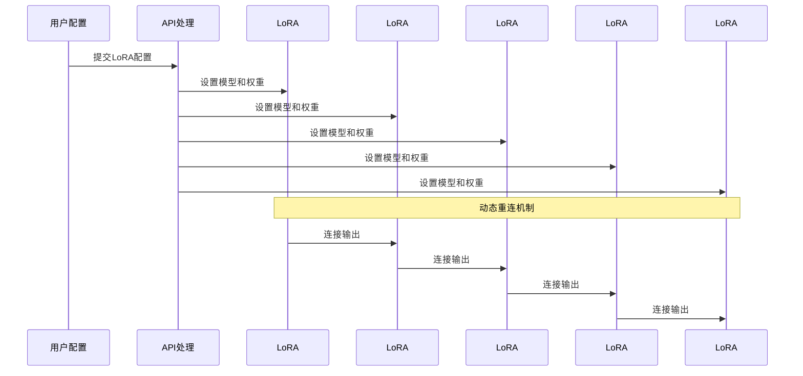

**图表来源**
- [workflow.ts:40-86](file://server/src/routes/workflow.ts#L40-L86)
- [workflow.ts:532-574](file://server/src/routes/workflow.ts#L532-L574)

**章节来源**
- [workflow.ts:40-86](file://server/src/routes/workflow.ts#L40-L86)
- [workflow.ts:532-574](file://server/src/routes/workflow.ts#L532-L574)

### 批量生成流程

ZIT工作流支持智能的批量生成和循环执行：

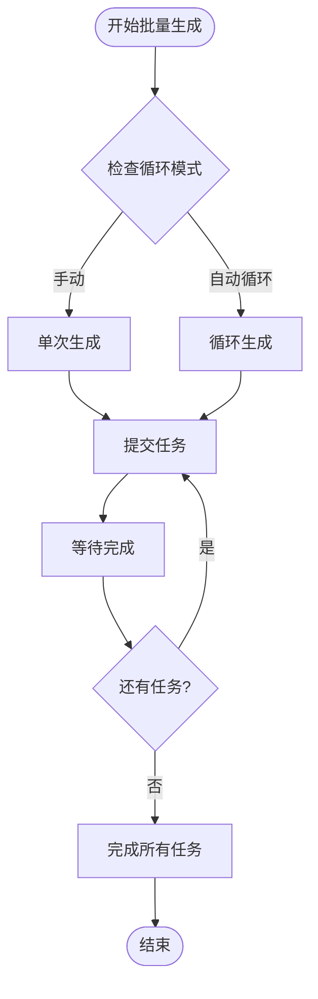

**图表来源**
- [ZITSidebar.tsx:372-418](file://client/src/components/ZITSidebar.tsx#L372-L418)

**章节来源**
- [ZITSidebar.tsx:372-418](file://client/src/components/ZITSidebar.tsx#L372-L418)

## 依赖关系分析

### 组件耦合度分析

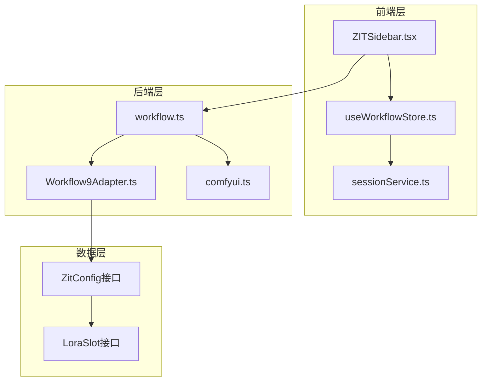

**图表来源**
- [useWorkflowStore.ts:71-83](file://client/src/hooks/useWorkflowStore.ts#L71-L83)
- [sessionService.ts:29-41](file://client/src/services/sessionService.ts#L29-L41)

### 外部依赖集成

工作流与ComfyUI的集成通过以下方式实现：

1. **模型加载**：通过UNETLoader、CLIPLoader、VAELoader节点
2. **LoRA处理**：动态链式连接多个LoraLoader节点
3. **采样控制**：KSampler节点的参数配置
4. **进度追踪**：WebSocket连接实时监控执行状态

**章节来源**
- [comfyui.ts:168-196](file://server/src/services/comfyui.ts#L168-L196)
- [workflow.ts:509-581](file://server/src/routes/workflow.ts#L509-L581)

## 性能考虑

### 采样算法优化

ZIT工作流采用AuraFlow采样算法，相比传统DDIM算法具有以下优势：

- **更快的收敛速度**：减少采样步骤数量
- **更好的细节保持**：在低步数下仍能保持高质量
- **更稳定的生成过程**：减少噪声和伪影

### 内存管理策略

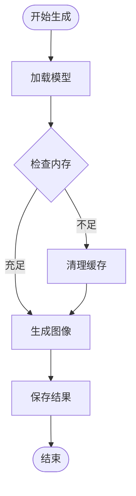

### 批量处理优化

- **智能队列管理**：避免同时加载过多模型
- **渐进式内存回收**：及时释放不再使用的资源
- **并发控制**：限制同时执行的任务数量

## 故障排除指南

### 常见问题及解决方案

| 问题类型 | 症状 | 解决方案 |
|----------|------|----------|
| 模型加载失败 | "模型文件未找到" | 检查模型路径和文件完整性 |
| LoRA应用失败 | "LoRA 文件未找到" | 验证LoRA文件存在且格式正确 |
| 采样器错误 | "采样器不支持" | 选择兼容的采样器类型 |
| 内存不足 | "GPU内存不足" | 降低分辨率或减少LoRA数量 |
| 生成缓慢 | "生成时间过长" | 调整steps参数或更换采样器 |

### 错误处理机制

工作流实现了多层次的错误处理：

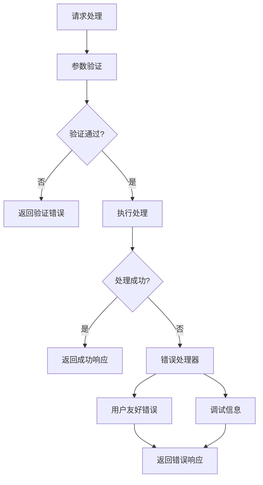

**图表来源**
- [workflow.ts:129-150](file://server/src/routes/workflow.ts#L129-L150)

**章节来源**
- [workflow.ts:129-150](file://server/src/routes/workflow.ts#L129-L150)

## 结论

ZIT快出工作流(WF9)是一个高度优化的专业文生图系统，具有以下核心优势：

1. **高效性**：采用AuraFlow采样算法和Z-image模型，实现快速高质量生成
2. **灵活性**：支持多种采样器、调度器和LoRA配置组合
3. **易用性**：直观的界面配置和智能的参数推荐
4. **可扩展性**：模块化的架构设计便于功能扩展

该工作流特别适合需要快速批量生成高质量图像的应用场景，如电商产品图生成、社交媒体内容创作、AI艺术作品制作等。

## 附录

### 最佳实践建议

#### 参数调优指南

- **分辨率选择**：根据用途选择合适的比例，避免过度放大
- **采样器选择**：高质量需求选择DPM++ 2M，速度优先选择欧拉方法
- **LoRA使用**：建议不超过3个LoRA叠加，避免过度拟合
- **步数设置**：一般在8-15步之间，根据质量需求调整

#### 应用场景推荐

- **电商产品图**：16:9比例，高质量采样器，适度LoRA
- **社交媒体内容**：4:3或16:9比例，快速采样器，简洁提示词
- **AI艺术创作**：1:1或3:4比例，高质量采样器，创意性提示词