# 专用工作流实现

<cite>
**本文档引用的文件**
- [server/src/adapters/index.ts](file://server/src/adapters/index.ts)
- [server/src/adapters/BaseAdapter.ts](file://server/src/adapters/BaseAdapter.ts)
- [server/src/adapters/Workflow0Adapter.ts](file://server/src/adapters/Workflow0Adapter.ts)
- [server/src/adapters/Workflow5Adapter.ts](file://server/src/adapters/Workflow5Adapter.ts)
- [server/src/adapters/Workflow7Adapter.ts](file://server/src/adapters/Workflow7Adapter.ts)
- [server/src/adapters/Workflow8Adapter.ts](file://server/src/adapters/Workflow8Adapter.ts)
- [server/src/adapters/Workflow9Adapter.ts](file://server/src/adapters/Workflow9Adapter.ts)
- [server/src/adapters/Workflow10Adapter.ts](file://server/src/adapters/Workflow10Adapter.ts)
- [server/src/routes/workflow.ts](file://server/src/routes/workflow.ts)
- [server/src/services/comfyui.ts](file://server/src/services/comfyui.ts)
- [server/src/types/index.ts](file://server/src/types/index.ts)
- [client/src/hooks/useWorkflowStore.ts](file://client/src/hooks/useWorkflowStore.ts)
- [ComfyUI_API/Pix2Real-解除装备Fixed.json](file://ComfyUI_API/Pix2Real-解除装备Fixed.json)
- [ComfyUI_API/Pix2Real-二次元生成.json](file://ComfyUI_API/Pix2Real-二次元生成.json)
- [ComfyUI_API/Pix2Real-ZIT文生图NEW2.json](file://ComfyUI_API/Pix2Real-ZIT文生图NEW2.json)
- [ComfyUI_API/Pix2Real-换面.json](file://ComfyUI_API/Pix2Real-换面.json)
</cite>

## 目录
1. [简介](#简介)
2. [项目结构](#项目结构)
3. [核心组件](#核心组件)
4. [架构概览](#架构概览)
5. [详细组件分析](#详细组件分析)
6. [依赖关系分析](#依赖关系分析)
7. [性能考虑](#性能考虑)
8. [故障排除指南](#故障排除指南)
9. [结论](#结论)

## 简介

CorineKit Pix2Real 是一个基于 ComfyUI 的 AI 图像生成工作流系统，专门针对二次元转真人场景提供了多个专用工作流。本文档深入解析了六个核心专用工作流的实现细节，包括解除装备(Workflow 5)、区域编辑(Workflow 10)、快速出图(Workflow 7)、ZIT快出(Workflow 9)、黑兽换脸(Workflow 8)和二次元转真人(Workflow 0)。

该系统采用模块化设计，通过适配器模式实现工作流的标准化接口，结合 ComfyUI 的强大渲染能力，为用户提供专业级的图像生成服务。每个工作流都经过精心优化，具有独特的参数要求、文件处理逻辑和业务规则。

## 项目结构

系统采用前后端分离架构，主要分为以下层次：

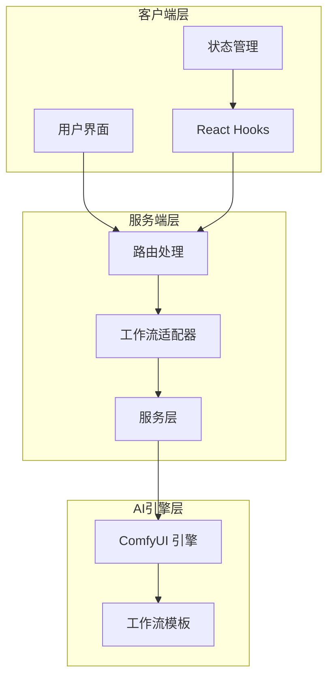

**图表来源**
- [server/src/routes/workflow.ts:1-800](file://server/src/routes/workflow.ts#L1-L800)
- [server/src/adapters/index.ts:1-33](file://server/src/adapters/index.ts#L1-L33)

**章节来源**
- [server/src/routes/workflow.ts:1-800](file://server/src/routes/workflow.ts#L1-L800)
- [server/src/adapters/index.ts:1-33](file://server/src/adapters/index.ts#L1-L33)

## 核心组件

### 工作流适配器系统

系统采用适配器模式实现工作流的标准化接口，所有工作流都必须实现统一的接口规范：

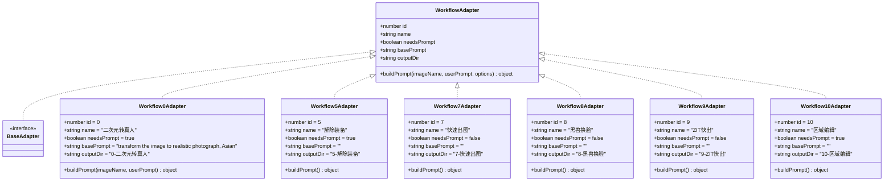

**图表来源**
- [server/src/types/index.ts:1-52](file://server/src/types/index.ts#L1-L52)
- [server/src/adapters/BaseAdapter.ts:1-4](file://server/src/adapters/BaseAdapter.ts#L1-L4)
- [server/src/adapters/Workflow0Adapter.ts:1-35](file://server/src/adapters/Workflow0Adapter.ts#L1-L35)
- [server/src/adapters/Workflow5Adapter.ts:1-15](file://server/src/adapters/Workflow5Adapter.ts#L1-L15)
- [server/src/adapters/Workflow7Adapter.ts:1-14](file://server/src/adapters/Workflow7Adapter.ts#L1-L14)
- [server/src/adapters/Workflow8Adapter.ts:1-14](file://server/src/adapters/Workflow8Adapter.ts#L1-L14)
- [server/src/adapters/Workflow9Adapter.ts:1-14](file://server/src/adapters/Workflow9Adapter.ts#L1-L14)
- [server/src/adapters/Workflow10Adapter.ts:1-15](file://server/src/adapters/Workflow10Adapter.ts#L1-L15)

### 适配器注册机制

系统通过集中注册机制管理所有工作流适配器，提供统一的访问接口：

**章节来源**
- [server/src/adapters/index.ts:1-33](file://server/src/adapters/index.ts#L1-L33)
- [server/src/types/index.ts:1-52](file://server/src/types/index.ts#L1-L52)

## 架构概览

系统整体架构采用分层设计，确保各组件职责明确、耦合度低：

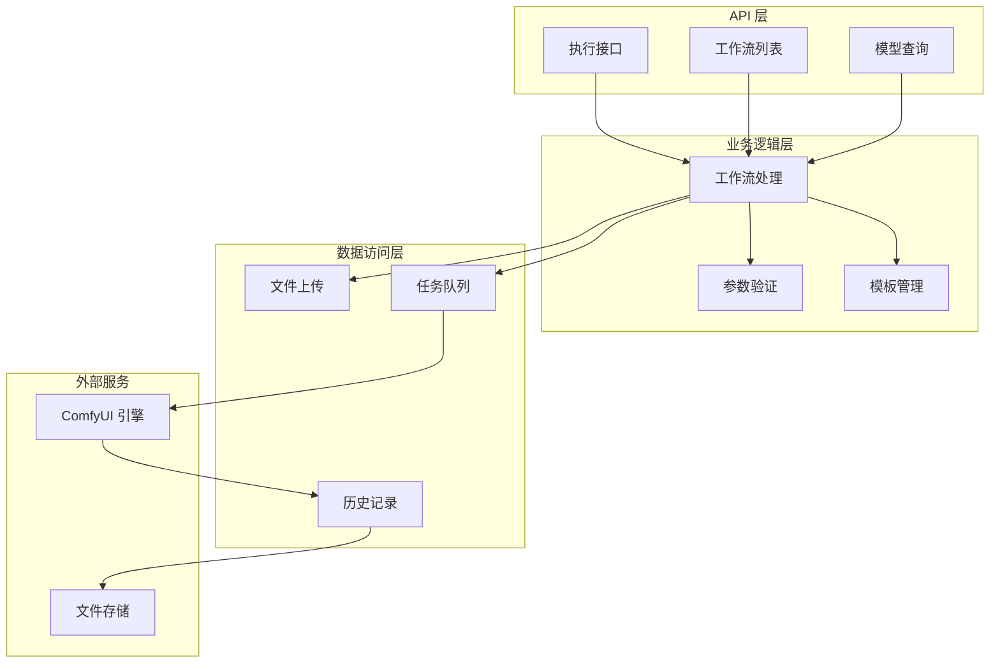

**图表来源**
- [server/src/routes/workflow.ts:1-800](file://server/src/routes/workflow.ts#L1-L800)
- [server/src/services/comfyui.ts:1-472](file://server/src/services/comfyui.ts#L1-L472)

## 详细组件分析

### 二次元转真人 (Workflow 0)

Workflow 0 是系统的核心功能，负责将二次元图像转换为逼真的真人照片。

#### 参数配置

| 参数名称 | 类型 | 必需 | 默认值 | 描述 |
|---------|------|------|--------|------|
| image | File | 是 | - | 输入的二次元图像文件 |
| clientId | string | 是 | - | 客户端标识符 |
| model | string | 否 | 'qwen' | 模型选择 ('qwen' 或 'klein') |
| prompt | string | 否 | '' | 自定义提示词 |

#### 文件处理流程

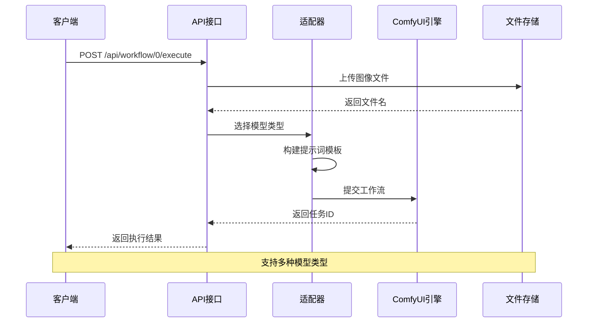

**图表来源**
- [server/src/routes/workflow.ts:644-687](file://server/src/routes/workflow.ts#L644-L687)
- [server/src/adapters/Workflow0Adapter.ts:1-35](file://server/src/adapters/Workflow0Adapter.ts#L1-L35)

#### 模板配置

Workflow 0 支持两种模型类型：

1. **Qwen 模型**：使用标准的二次元转真人模板
2. **Klein 模型**：使用专业的高清重绘模板

**章节来源**
- [server/src/routes/workflow.ts:644-687](file://server/src/routes/workflow.ts#L644-L687)
- [server/src/adapters/Workflow0Adapter.ts:1-35](file://server/src/adapters/Workflow0Adapter.ts#L1-L35)

### 解除装备 (Workflow 5)

Workflow 5 专门用于移除图像中的装备，支持精确的区域编辑。

#### 参数要求

| 参数名称 | 类型 | 必需 | 描述 |
|---------|------|------|------|
| image | File | 是 | 原始图像文件 |
| mask | File | 是 | 掩码文件，定义需要编辑的区域 |
| clientId | string | 是 | 客户端标识符 |
| backPose | boolean | 否 | 是否使用背面姿态 |
| prompt | string | 否 | 自定义提示词 |

#### 执行流程

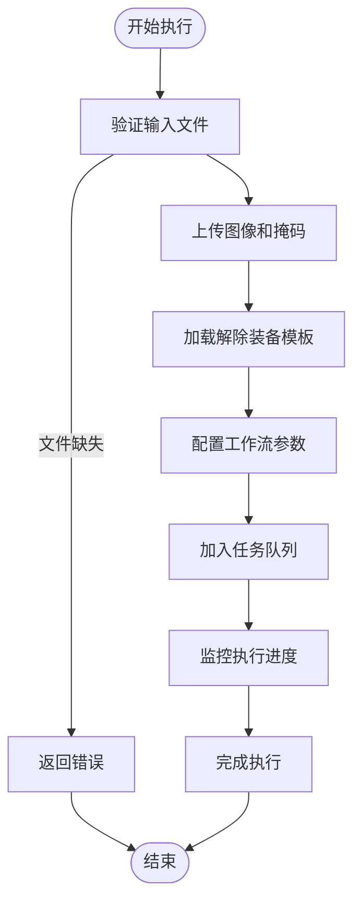

**图表来源**
- [server/src/routes/workflow.ts:163-215](file://server/src/routes/workflow.ts#L163-L215)
- [ComfyUI_API/Pix2Real-解除装备Fixed.json:1-200](file://ComfyUI_API/Pix2Real-解除装备Fixed.json#L1-L200)

#### 业务规则

1. **文件验证**：必须同时提供图像和掩码文件
2. **参数处理**：backPose 参数控制姿态调整
3. **提示词处理**：用户提示词会替换模板中的默认提示词

**章节来源**
- [server/src/routes/workflow.ts:163-215](file://server/src/routes/workflow.ts#L163-L215)
- [ComfyUI_API/Pix2Real-解除装备Fixed.json:1-200](file://ComfyUI_API/Pix2Real-解除装备Fixed.json#L1-L200)

### 区域编辑 (Workflow 10)

Workflow 10 提供更精细的区域编辑功能，允许用户对特定区域进行修改。

#### 参数配置

| 参数名称 | 类型 | 必需 | 描述 |
|---------|------|------|------|
| image | File | 是 | 原始图像文件 |
| mask | File | 是 | 掩码文件 |
| clientId | string | 是 | 客户端标识符 |
| backPose | boolean | 否 | 背面姿态选项 |
| prompt | string | 否 | 自定义提示词 |

#### 关键差异

与 Workflow 5 的主要区别在于提示词处理方式：

- **Workflow 5**：用户提示词替换默认提示词
- **Workflow 10**：用户提示词直接设置，即使为空也会覆盖

**章节来源**
- [server/src/routes/workflow.ts:217-267](file://server/src/routes/workflow.ts#L217-L267)

### 快速出图 (Workflow 7)

Workflow 7 提供高效的文本到图像生成功能，支持多种配置选项。

#### 参数要求

| 参数名称 | 类型 | 必需 | 描述 |
|---------|------|------|------|
| clientId | string | 是 | 客户端标识符 |
| model | string | 是 | 检查点模型名称 |
| prompt | string | 是 | 正向提示词 |
| width | number | 是 | 图像宽度 |
| height | number | 是 | 图像高度 |
| steps | number | 是 | 采样步数 |
| cfg | number | 是 | CFG 比例 |
| sampler | string | 是 | 采样器类型 |
| scheduler | string | 是 | 调度器类型 |
| loras | Array | 否 | LoRA 模型列表 |
| negativePrompt | string | 否 | 负向提示词 |
| name | string | 否 | 输出文件名前缀 |
| seed | number | 否 | 随机种子 |
| referenceImage | string | 否 | 参考图像文件名 |
| depthStrength | number | 否 | 深度强度 (默认 0.3) |
| poseStrength | number | 否 | 姿态强度 (默认 0.5) |
| useOriginalRatio | boolean | 否 | 使用原始比例 |

#### PRO 工作流分支

当提供 `referenceImage` 参数时，系统会使用 PRO 特性分支：

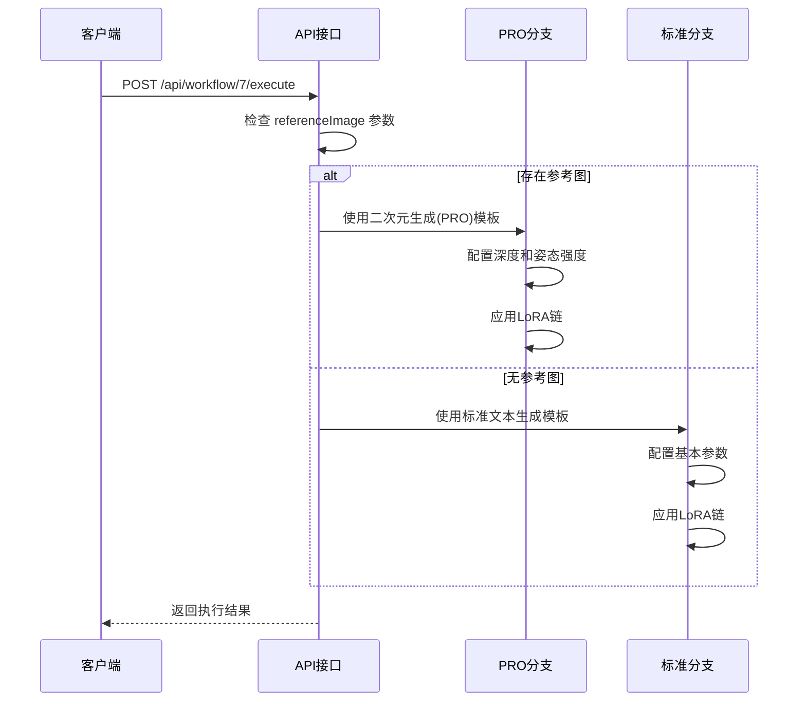

**图表来源**
- [server/src/routes/workflow.ts:269-405](file://server/src/routes/workflow.ts#L269-L405)

#### LoRA 处理机制

系统实现了复杂的 LoRA 链式连接机制：

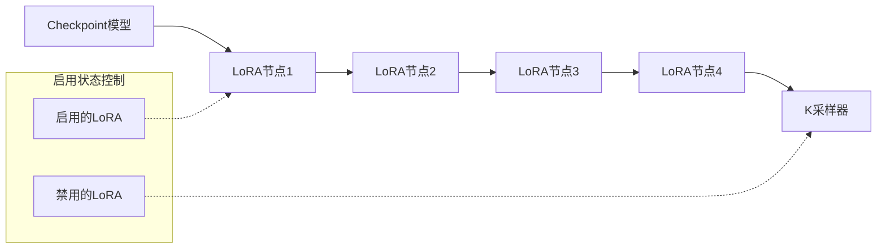

**图表来源**
- [server/src/routes/workflow.ts:40-86](file://server/src/routes/workflow.ts#L40-L86)

**章节来源**
- [server/src/routes/workflow.ts:269-405](file://server/src/routes/workflow.ts#L269-L405)
- [server/src/routes/workflow.ts:40-86](file://server/src/routes/workflow.ts#L40-L86)

### ZIT快出 (Workflow 9)

Workflow 9 专注于高效的文本到图像生成，特别优化了 UNet 和 LoRA 的使用。

#### 参数配置

| 参数名称 | 类型 | 必需 | 描述 |
|---------|------|------|------|
| clientId | string | 是 | 客户端标识符 |
| unetModel | string | 是 | UNet 模型名称 |
| prompt | string | 是 | 提示词内容 |
| width | number | 是 | 图像宽度 |
| height | number | 是 | 图像高度 |
| steps | number | 是 | 采样步数 |
| cfg | number | 是 | CFG 比例 |
| sampler | string | 是 | 采样器类型 |
| scheduler | string | 是 | 调度器类型 |
| loras | Array | 否 | LoRA 模型列表 |
| shiftEnabled | boolean | 否 | 是否启用AuraFlow shift |
| shift | number | 否 | shift数值 (默认 3) |
| name | string | 否 | 输出文件名前缀 |

#### UNet + LoRA 链式处理

Workflow 9 实现了灵活的 UNet 和 LoRA 组合机制：

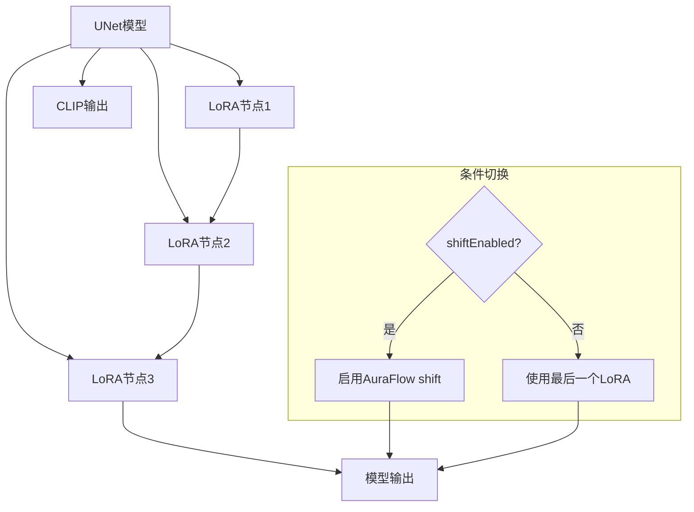

**图表来源**
- [server/src/routes/workflow.ts:485-593](file://server/src/routes/workflow.ts#L485-L593)

#### 动态重连机制

系统根据 LoRA 的启用状态动态调整连接路径：

**章节来源**
- [server/src/routes/workflow.ts:485-593](file://server/src/routes/workflow.ts#L485-L593)

### 黑兽换脸 (Workflow 8)

Workflow 8 专门处理人脸交换任务，提供高质量的人脸替换功能。

#### 参数要求

| 参数名称 | 类型 | 必需 | 描述 |
|---------|------|------|------|
| targetImage | File | 是 | 目标图像文件 |
| faceImage | File | 是 | 人脸图像文件 |
| clientId | string | 是 | 客户端标识符 |

#### 执行流程

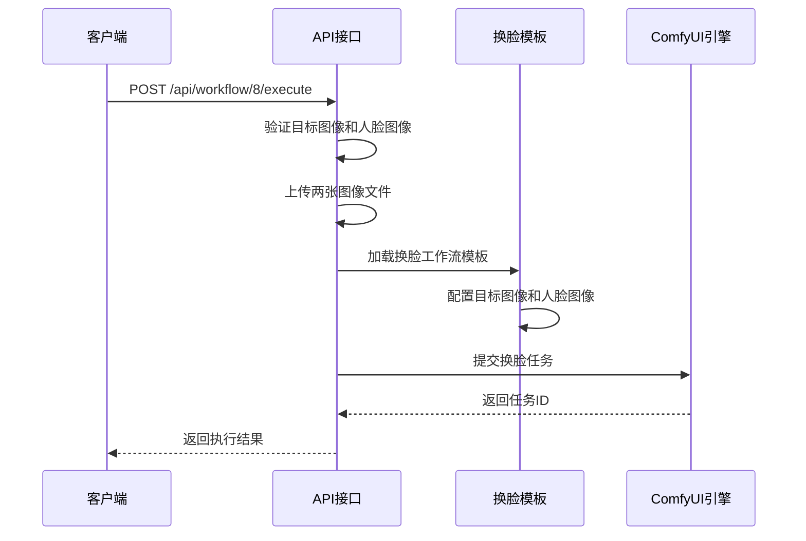

**图表来源**
- [server/src/routes/workflow.ts:595-642](file://server/src/routes/workflow.ts#L595-L642)
- [ComfyUI_API/Pix2Real-换面.json:1-200](file://ComfyUI_API/Pix2Real-换面.json#L1-L200)

#### 模板特性

换脸模板使用了专业的 ReActorFaceSwap 技术，支持：

1. **高精度人脸检测**：自动识别和定位人脸区域
2. **无缝融合**：确保换脸后的自然过渡
3. **风格保持**：维持原图的整体风格和色调

**章节来源**
- [server/src/routes/workflow.ts:595-642](file://server/src/routes/workflow.ts#L595-L642)
- [ComfyUI_API/Pix2Real-换面.json:1-200](file://ComfyUI_API/Pix2Real-换面.json#L1-L200)

## 依赖关系分析

系统各组件之间的依赖关系如下：

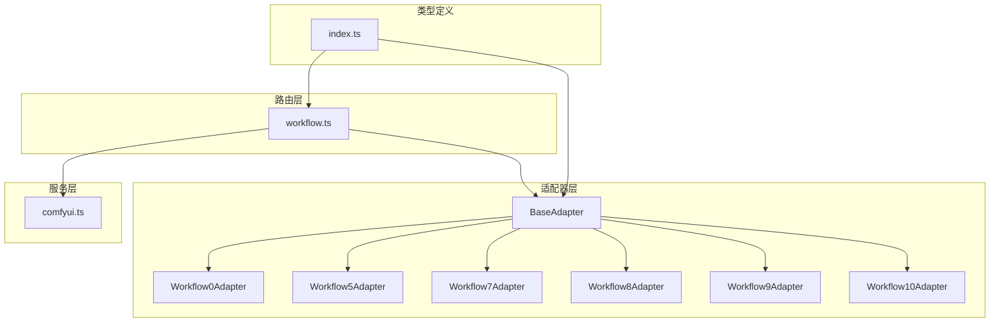

**图表来源**
- [server/src/adapters/index.ts:1-33](file://server/src/adapters/index.ts#L1-L33)
- [server/src/routes/workflow.ts:1-800](file://server/src/routes/workflow.ts#L1-L800)
- [server/src/services/comfyui.ts:1-472](file://server/src/services/comfyui.ts#L1-L472)
- [server/src/types/index.ts:1-52](file://server/src/types/index.ts#L1-L52)

**章节来源**
- [server/src/adapters/index.ts:1-33](file://server/src/adapters/index.ts#L1-L33)
- [server/src/routes/workflow.ts:1-800](file://server/src/routes/workflow.ts#L1-L800)

## 性能考虑

### 进度追踪机制

系统实现了智能的进度追踪机制，能够准确反映复杂工作流的执行状态：

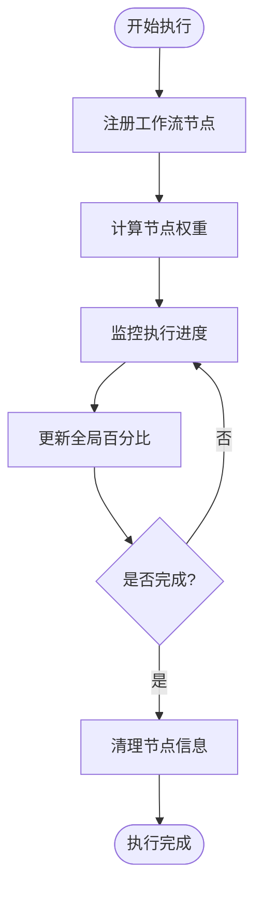

**图表来源**
- [server/src/services/comfyui.ts:47-196](file://server/src/services/comfyui.ts#L47-L196)

### 资源管理

系统通过以下机制优化资源使用：

1. **节点权重计算**：根据节点类型和参数动态计算权重
2. **内存管理**：及时清理已完成任务的节点信息
3. **并发控制**：合理管理同时执行的任务数量

**章节来源**
- [server/src/services/comfyui.ts:47-196](file://server/src/services/comfyui.ts#L47-L196)

## 故障排除指南

### 常见错误类型

系统提供了详细的错误处理和用户友好的错误信息：

| 错误类型 | 描述 | 用户提示 |
|---------|------|----------|
| 模型文件未找到 | Checkpoint、LoRA、UNET、VAE或ControlNet模型缺失 | 请检查ComfyUI模型是否正确安装 |
| 工作流提交失败 | ComfyUI服务不可用或配置错误 | 请检查ComfyUI是否正常运行 |
| 文件上传失败 | 图像或视频文件上传失败 | 请检查文件格式和大小限制 |

### 错误处理流程

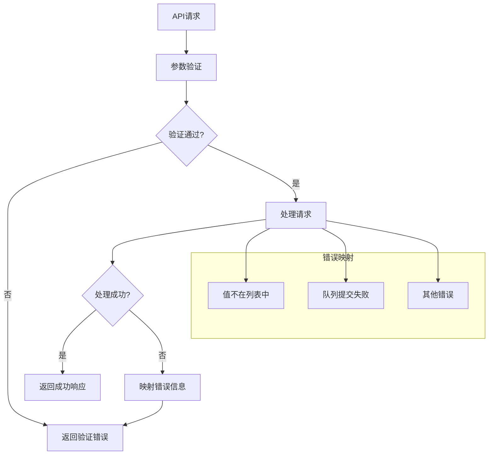

**图表来源**
- [server/src/routes/workflow.ts:126-150](file://server/src/routes/workflow.ts#L126-L150)

### 调试建议

1. **检查 ComfyUI 状态**：确认服务正常运行且模型已加载
2. **验证文件格式**：确保输入文件符合要求的格式和大小
3. **查看日志信息**：通过服务器日志了解具体的错误原因
4. **测试简单工作流**：先运行简单的文本到图像工作流验证系统功能

**章节来源**
- [server/src/routes/workflow.ts:126-150](file://server/src/routes/workflow.ts#L126-L150)

## 结论

CorineKit Pix2Real 的专用工作流系统通过模块化设计和标准化接口，为二次元转真人场景提供了专业级的解决方案。六个核心工作流各有特色，满足不同用户的需求：

1. **Workflow 0** 提供了完整的二次元转真人功能
2. **Workflow 5 和 10** 实现了精确的区域编辑能力
3. **Workflow 7** 支持高效的文本到图像生成
4. **Workflow 9** 专注于 UNet 和 LoRA 的优化组合
5. **Workflow 8** 提供高质量的人脸交换功能

系统的设计充分考虑了性能、可扩展性和用户体验，为后续的功能扩展奠定了良好的基础。通过适配器模式和模板化设计，新的工作流可以轻松集成到现有架构中。