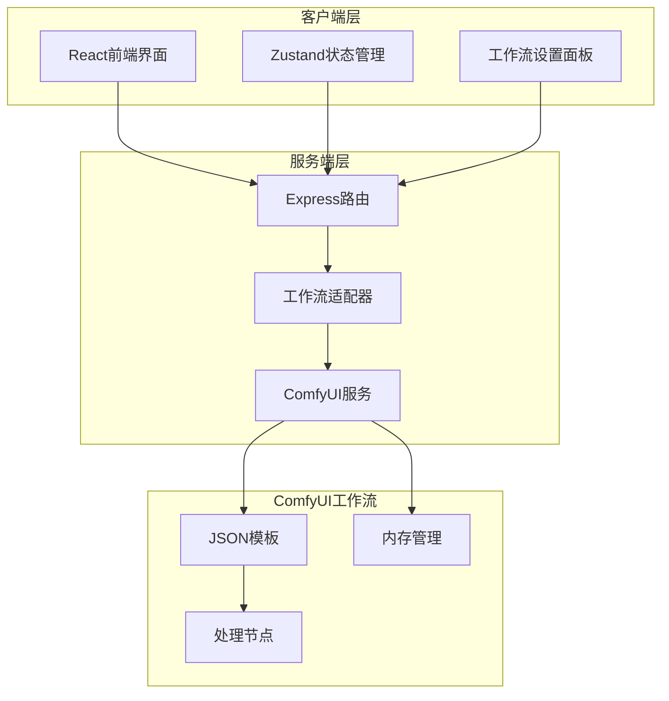
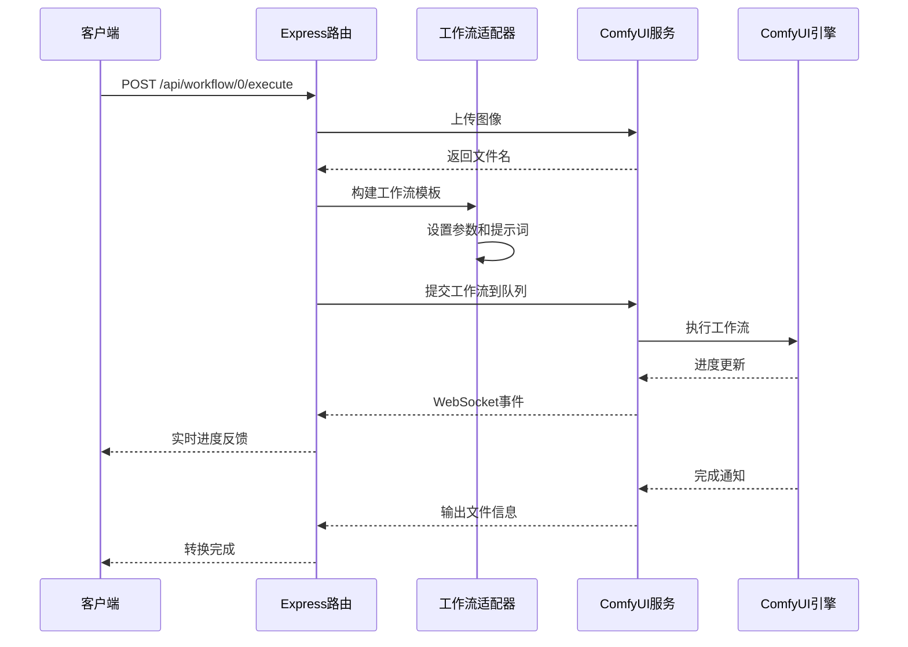
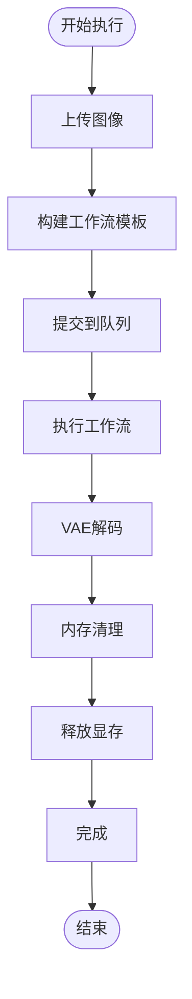
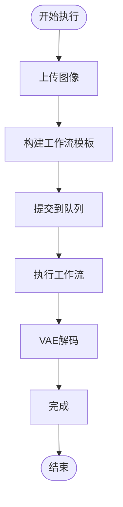
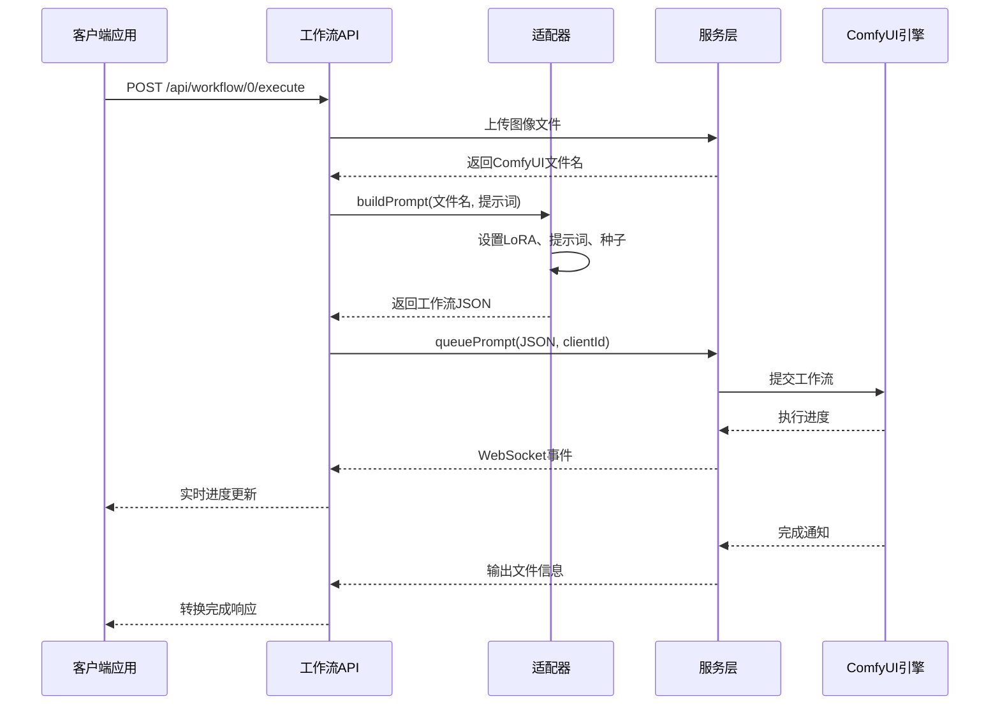
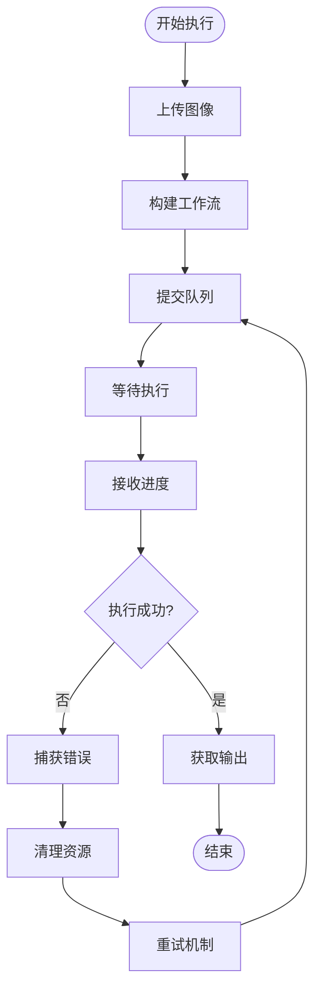
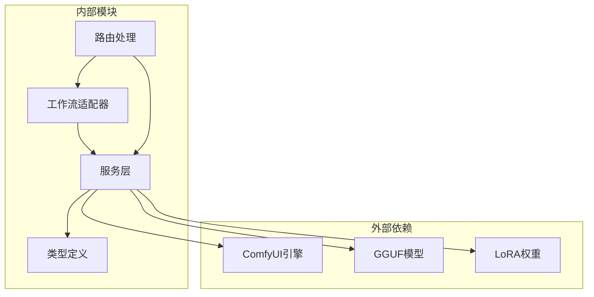

# 二次元转真人工作流

<cite>
**本文档引用的文件**
- [README.md](file://README.md)
- [0-Pix2Real-二次元转真人.json](file://ComfyUI_API/0-Pix2Real-二次元转真人.json)
- [👻二次元转真人(NoUnload).json](file://ComfyUI_API/👻二次元转真人(NoUnload).json)
- [Workflow0Adapter.ts](file://server/src/adapters/Workflow0Adapter.ts)
- [comfyui.ts](file://server/src/services/comfyui.ts)
- [workflow.ts](file://server/src/routes/workflow.ts)
- [Workflow0SettingsPanel.tsx](file://client/src/components/Workflow0SettingsPanel.tsx)
- [useWorkflowStore.ts](file://client/src/hooks/useWorkflowStore.ts)
- [Pix2Real-释放内存.json](file://ComfyUI_API/Pix2Real-释放内存.json)
- [index.ts](file://server/src/types/index.ts)
- [index.ts](file://client/src/types/index.ts)
</cite>

## 目录
1. [简介](#简介)
2. [项目结构](#项目结构)
3. [核心组件](#核心组件)
4. [架构概览](#架构概览)
5. [详细组件分析](#详细组件分析)
6. [依赖关系分析](#依赖关系分析)
7. [性能考虑](#性能考虑)
8. [故障排除指南](#故障排除指南)
9. [结论](#结论)

## 简介

二次元转真人工作流(WF0)是一个基于ComfyUI的动漫风格到写实风格转换系统。该工作流通过LoRA模型和高级采样算法，将动漫角色转换为逼真的照片风格，同时保持角色特征和细节。

该系统提供了两种执行模式：
- **标准版本**：包含完整的内存管理流程，包括显存和内存清理
- **NoUnload版本**：优化版本，移除了内存清理步骤，提高执行效率

## 项目结构

**图表来源**
- [README.md:41-62](file://README.md#L41-L62)
- [workflow.ts:1-29](file://server/src/routes/workflow.ts#L1-L29)

**章节来源**
- [README.md:41-79](file://README.md#L41-L79)

## 核心组件

### 工作流适配器
工作流0适配器负责构建和定制工作流模板，支持多种执行模式：

- **模板加载**：从JSON文件加载基础工作流模板
- **参数定制**：动态设置图像输入、提示词和随机种子
- **模式支持**：支持Qwen和Klein两种绘制模型

### ComfyUI集成
服务层提供完整的ComfyUI集成，包括：

- **图像上传**：支持PNG、JPEG、WebP格式
- **工作流队列**：异步任务管理和进度跟踪
- **内存管理**：显存和系统内存清理
- **WebSocket通信**：实时进度更新

### 前端界面
React组件提供直观的工作流控制界面：

- **设置面板**：绘制模型选择和参数调节
- **状态管理**：Zustand状态存储
- **进度显示**：实时任务进度和输出管理

**章节来源**
- [Workflow0Adapter.ts:1-35](file://server/src/adapters/Workflow0Adapter.ts#L1-L35)
- [comfyui.ts:168-196](file://server/src/services/comfyui.ts#L168-L196)
- [workflow.ts:644-687](file://server/src/routes/workflow.ts#L644-L687)

## 架构概览

**图表来源**
- [workflow.ts:644-687](file://server/src/routes/workflow.ts#L644-L687)
- [comfyui.ts:304-375](file://server/src/services/comfyui.ts#L304-L375)

## 详细组件分析

### NoUnload版本与标准版本的区别

#### 标准版本特点
标准工作流包含完整的内存管理流程：

**图表来源**
- [0-Pix2Real-二次元转真人.json:42-56](file://ComfyUI_API/0-Pix2Real-二次元转真人.json#L42-L56)

#### NoUnload版本特点
NoUnload版本移除了内存清理步骤，优化执行效率：

**图表来源**
- [👻二次元转真人(NoUnload).json:42-56](file://ComfyUI_API/👻二次元转真人(NoUnload).json#L42-L56)

#### 关键差异对比

| 特性 | 标准版本 | NoUnload版本 |
|------|----------|--------------|
| 内存清理 | 包含RAMCleanup节点 | 移除内存清理节点 |
| 显存管理 | 包含VRAMCleanup节点 | 移除显存清理节点 |
| 执行效率 | 稍低（包含清理步骤） | 更高（无清理延迟） |
| 内存占用 | 自动释放，占用较小 | 长期占用，需手动管理 |
| 适用场景 | 长时间运行 | 短时间批量处理 |

**章节来源**
- [0-Pix2Real-二次元转真人.json:1-252](file://ComfyUI_API/0-Pix2Real-二次元转真人.json#L1-L252)
- [👻二次元转真人(NoUnload).json:1-215](file://ComfyUI_API/👻二次元转真人(NoUnload).json#L1-L215)

### 核心算法组件

#### LoRA模型加载器
工作流使用LoRA模型进行风格转换：

- **模型文件**：anything2real_2601_A_final_patched.safetensors
- **强度设置**：strength_model = 0.8
- **作用机制**：通过LoRA权重调整扩散模型，实现风格迁移

#### 文本编码器
QwenImageEditPlus文本编码器处理提示词：

- **模型类型**：Qwen2.5-VL-7B-Instruct-Q3_K_S.gguf
- **输入类型**：qwen_image
- **功能**：将文本提示转换为模型可理解的向量表示

#### 采样算法
AuraFlow采样算法提供高质量生成：

- **采样器**：ModelSamplingAuraFlow
- **参数**：shift = 3.1
- **优势**：更好的细节保持和风格转换效果

**章节来源**
- [0-Pix2Real-二次元转真人.json:20-26](file://ComfyUI_API/0-Pix2Real-二次元转真人.json#L20-L26)
- [0-Pix2Real-二次元转真人.json:34-40](file://ComfyUI_API/0-Pix2Real-二次元转真人.json#L34-L40)
- [0-Pix2Real-二次元转真人.json:126-135](file://ComfyUI_API/0-Pix2Real-二次元转真人.json#L126-L135)

### 质量控制参数

#### 转换强度参数
工作流提供多个质量控制参数：

- **步数(steps)**：默认4步，影响生成质量和计算时间
- **CFG强度(cfg)**：默认1，控制提示词影响力
- **种子(seed)**：随机种子，确保可重现性
- **LoRA强度**：0.8，平衡动漫风格和真实感

#### 艺术效果调节
通过提示词和LoRA组合实现艺术效果调节：

- **基础提示词**："transform the image to realistic photograph, Asian"
- **用户自定义**：可添加个性化的描述和约束
- **风格保持**：通过LoRA权重保持角色特征

**章节来源**
- [Workflow0Adapter.ts:16-33](file://server/src/adapters/Workflow0Adapter.ts#L16-L33)
- [workflow.ts:658-673](file://server/src/routes/workflow.ts#L658-L673)

### API调用流程

#### 完整执行流程

**图表来源**
- [workflow.ts:644-687](file://server/src/routes/workflow.ts#L644-L687)
- [comfyui.ts:168-196](file://server/src/services/comfyui.ts#L168-L196)

#### 错误恢复机制

**图表来源**
- [comfyui.ts:304-375](file://server/src/services/comfyui.ts#L304-L375)

**章节来源**
- [workflow.ts:644-687](file://server/src/routes/workflow.ts#L644-L687)
- [comfyui.ts:265-375](file://server/src/services/comfyui.ts#L265-L375)

## 依赖关系分析

**图表来源**
- [workflow.ts:9-14](file://server/src/routes/workflow.ts#L9-L14)
- [comfyui.ts:1-8](file://server/src/services/comfyui.ts#L1-L8)

### 组件耦合度分析

| 组件 | 耦合度 | 说明 |
|------|--------|------|
| 适配器 | 低 | 专注于工作流模板构建 |
| 服务层 | 中 | 集成多个外部服务 |
| 路由层 | 中 | 处理HTTP请求和响应 |
| 前端组件 | 低 | 通过API接口交互 |

**章节来源**
- [workflow.ts:1-29](file://server/src/routes/workflow.ts#L1-L29)
- [comfyui.ts:1-472](file://server/src/services/comfyui.ts#L1-L472)

## 性能考虑

### 内存管理优化策略

#### 显存优化
- **模型卸载**：执行完成后自动卸载模型
- **批处理优化**：支持批量图像处理
- **缓存策略**：智能缓存常用模型

#### 系统资源管理
- **进程清理**：清理临时文件和进程
- **DLL管理**：释放系统资源
- **重试机制**：失败时自动重试

### 执行效率优化

#### NoUnload版本优势
- **减少延迟**：跳过内存清理步骤
- **提高吞吐量**：适合大批量处理
- **降低开销**：减少系统调用次数

#### 标准版本保障
- **稳定性**：确保长期运行稳定性
- **资源安全**：防止内存泄漏
- **兼容性**：支持各种硬件环境

## 故障排除指南

### 常见问题及解决方案

#### ComfyUI连接问题
- **症状**：无法连接到ComfyUI
- **原因**：服务未启动或端口被占用
- **解决**：检查ComfyUI服务状态，确认端口8188可用

#### 模型加载失败
- **症状**：LoRA或GGUF模型加载错误
- **原因**：模型文件缺失或路径错误
- **解决**：验证模型文件完整性，检查路径配置

#### 内存不足
- **症状**：显存不足导致执行失败
- **原因**：图像尺寸过大或模型过大
- **解决**：使用NoUnload版本，手动释放内存

#### 进度更新异常
- **症状**：WebSocket连接断开
- **原因**：网络不稳定或服务器压力过大
- **解决**：检查网络连接，重启服务

**章节来源**
- [comfyui.ts:126-150](file://server/src/services/comfyui.ts#L126-L150)
- [workflow.ts:126-150](file://server/src/routes/workflow.ts#L126-L150)

## 结论

二次元转真人工作流(WF0)提供了一个完整且高效的动漫风格转换解决方案。通过精心设计的架构和优化的执行策略，该系统能够在保证质量的同时提供良好的用户体验。

### 主要优势
- **灵活的执行模式**：支持标准和NoUnload两种模式
- **完善的质量控制**：多维度参数调节和优化
- **稳定的错误处理**：完整的错误恢复机制
- **优秀的性能表现**：高效的内存管理和执行优化

### 应用场景
- **批量图像处理**：适合大规模动漫风格转换
- **实时应用**：支持实时预览和交互式编辑
- **专业制作**：满足高质量图像生成需求
- **研究实验**：支持不同参数组合的实验

该工作流为动漫到真实照片的转换提供了可靠的技术基础，通过持续的优化和改进，能够满足各种应用场景的需求。