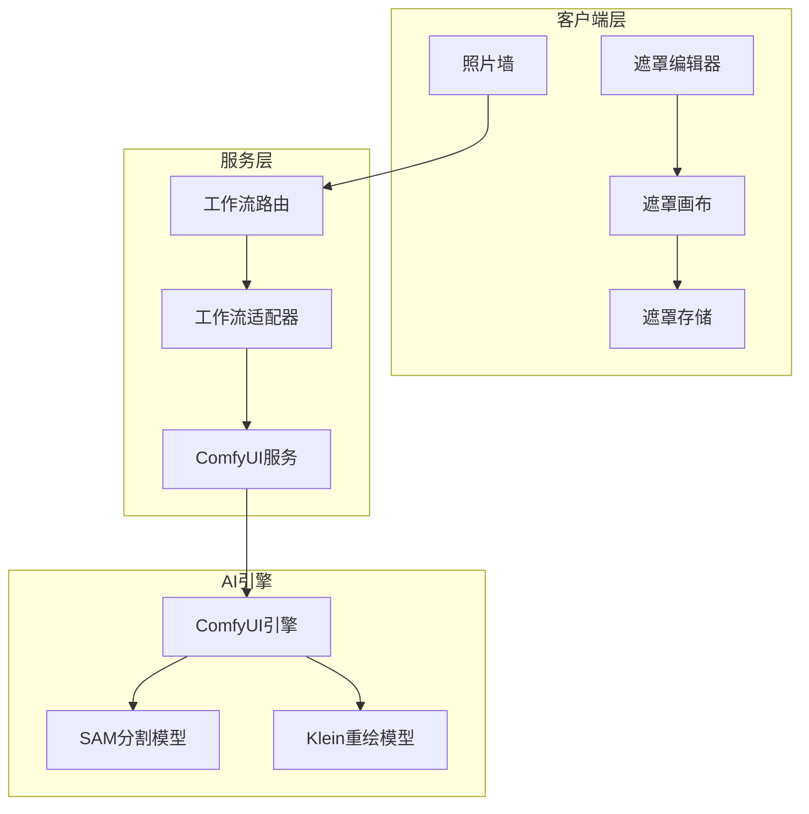
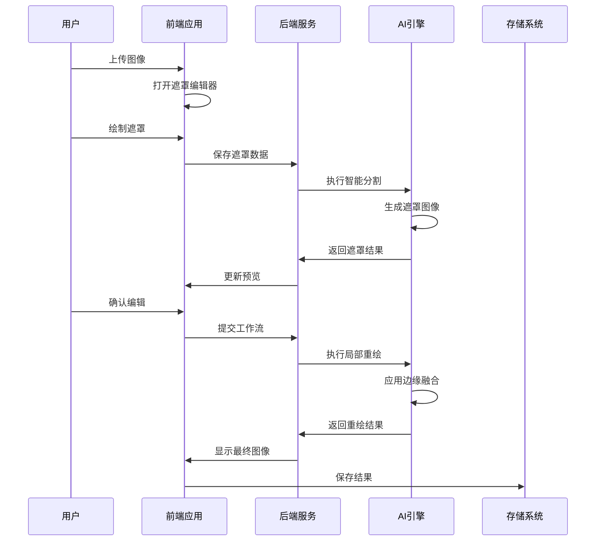
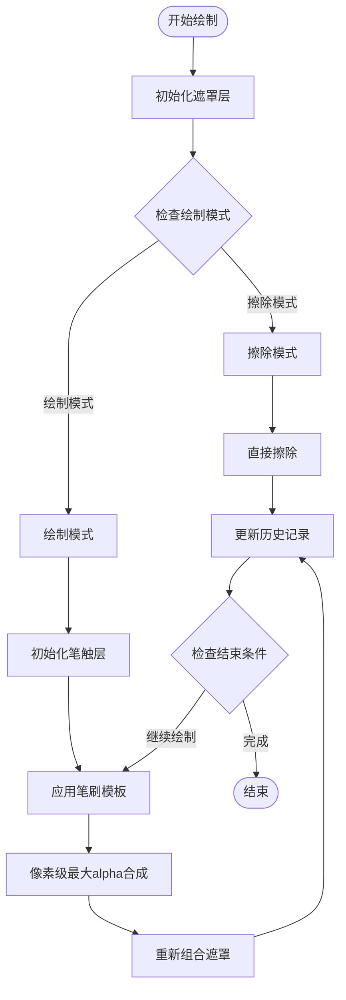
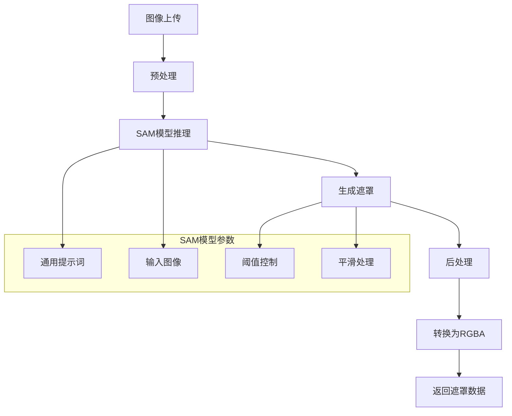
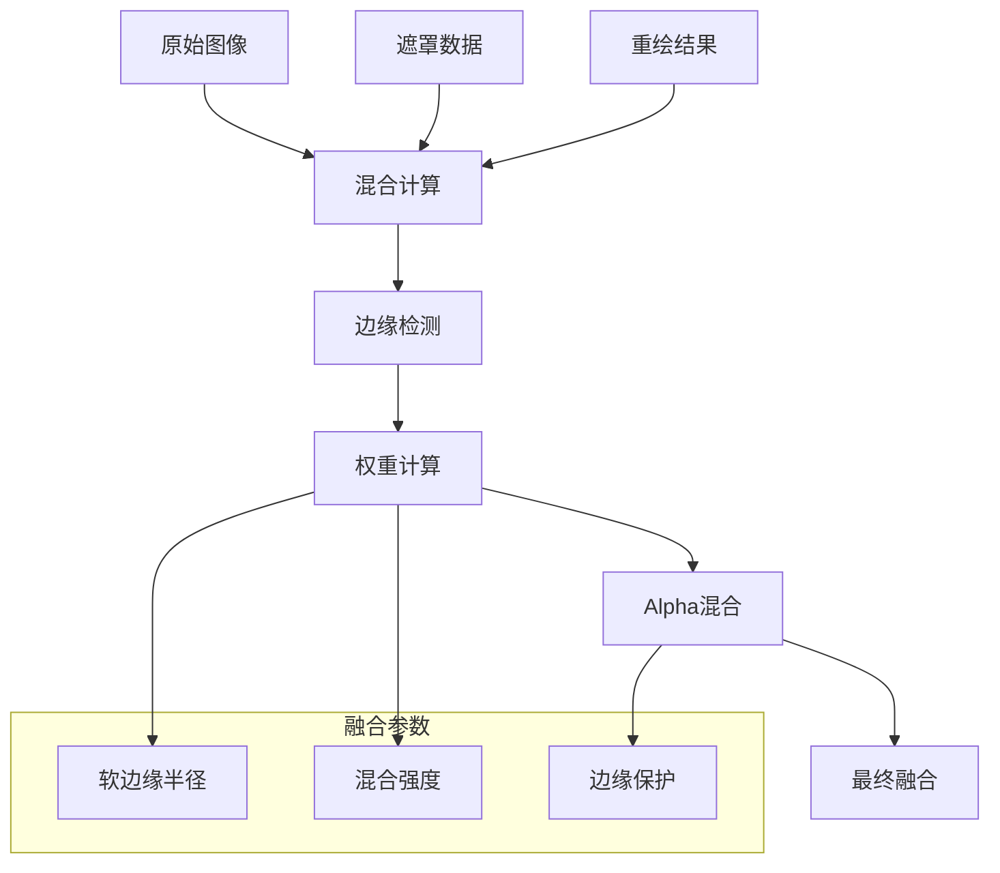
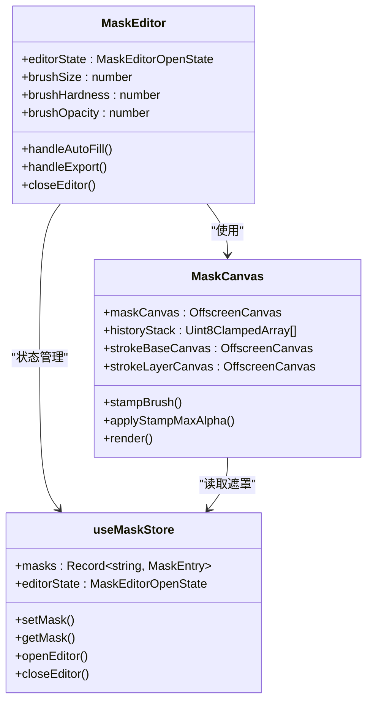
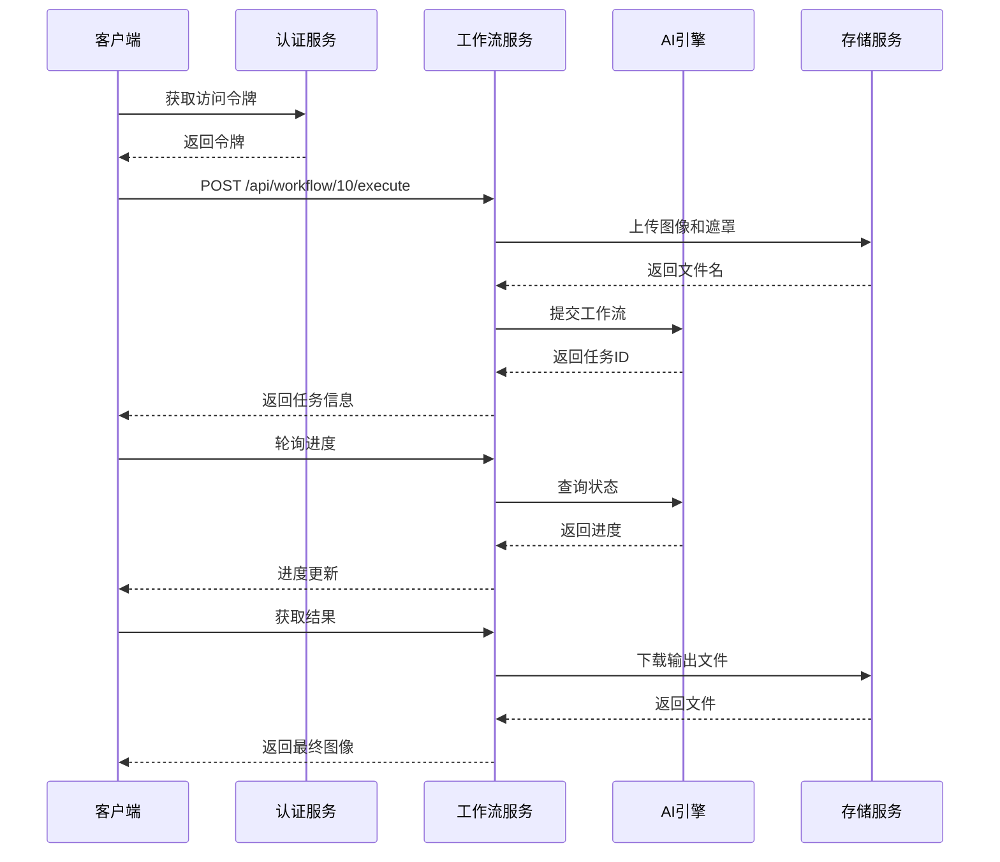
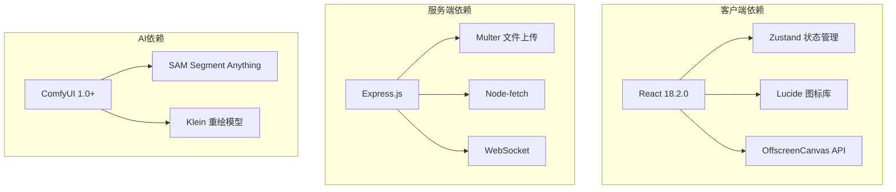

# 区域编辑工作流

<cite>
**本文档引用的文件**
- [Workflow10Adapter.ts](file://server/src/adapters/Workflow10Adapter.ts)
- [workflow.ts](file://server/src/routes/workflow.ts)
- [comfyui.ts](file://server/src/services/comfyui.ts)
- [MaskEditor.tsx](file://client/src/components/MaskEditor.tsx)
- [MaskCanvas.tsx](file://client/src/components/MaskCanvas.tsx)
- [useMaskStore.ts](file://client/src/hooks/useMaskStore.ts)
- [maskConfig.ts](file://client/src/config/maskConfig.ts)
- [PhotoWall.tsx](file://client/src/components/PhotoWall.tsx)
- [index.ts](file://client/src/types/index.ts)
- [2026-02-24-mask-editor.md](file://docs/plans/2026-02-24-mask-editor.md)
</cite>

## 目录
1. [简介](#简介)
2. [项目结构](#项目结构)
3. [核心组件](#核心组件)
4. [架构概览](#架构概览)
5. [详细组件分析](#详细组件分析)
6. [依赖关系分析](#依赖关系分析)
7. [性能考虑](#性能考虑)
8. [故障排除指南](#故障排除指南)
9. [结论](#结论)

## 简介

区域编辑工作流(WF10)是一个基于AI的图像局部重绘解决方案，结合了智能分割、遮罩编辑和局部重绘技术。该工作流允许用户通过直观的遮罩编辑器对图像特定区域进行精确控制，实现高质量的局部修改和重绘。

该系统采用前后端分离架构，前端提供交互式的遮罩编辑界面，后端通过ComfyUI处理复杂的AI推理任务。核心功能包括智能分割算法、实时遮罩编辑、边缘融合技术和智能填充算法。

## 项目结构

区域编辑工作流涉及以下关键模块：

**图表来源**
- [MaskEditor.tsx:141-375](file://client/src/components/MaskEditor.tsx#L141-L375)
- [workflow.ts:217-267](file://server/src/routes/workflow.ts#L217-L267)
- [comfyui.ts:168-196](file://server/src/services/comfyui.ts#L168-L196)

**章节来源**
- [Workflow10Adapter.ts:1-15](file://server/src/adapters/Workflow10Adapter.ts#L1-L15)
- [maskConfig.ts:1-21](file://client/src/config/maskConfig.ts#L1-L21)

## 核心组件

### 遮罩编辑器组件

遮罩编辑器提供了完整的图像局部编辑功能，包括：

- **智能分割**: 自动识别人物轮廓和边界
- **实时预览**: 实时显示遮罩效果和最终结果
- **多模式支持**: 支持叠加模式和混合模式
- **历史记录**: 完整的撤销/重做功能

### 遮罩画布组件

遮罩画布实现了高性能的遮罩绘制功能：

- **非累积软笔刷**: 防止软边刷重叠硬化
- **多层渲染**: 支持复杂遮罩效果
- **缩放平移**: 支持高分辨率图像编辑
- **实时光标**: 提供精确的绘制反馈

### 遮罩存储系统

遮罩存储采用高效的数据结构：

- **Uint8ClampedArray**: 内存友好的像素数据存储
- **工作分辨率**: 自动适配最大2048像素的工作尺寸
- **历史栈**: 支持最多30步的历史记录

**章节来源**
- [MaskEditor.tsx:1-375](file://client/src/components/MaskEditor.tsx#L1-L375)
- [MaskCanvas.tsx:1-677](file://client/src/components/MaskCanvas.tsx#L1-L677)
- [useMaskStore.ts:1-51](file://client/src/hooks/useMaskStore.ts#L1-L51)

## 架构概览

区域编辑工作流采用分层架构设计，确保系统的可扩展性和维护性：

**图表来源**
- [workflow.ts:217-267](file://server/src/routes/workflow.ts#L217-L267)
- [MaskEditor.tsx:196-235](file://client/src/components/MaskEditor.tsx#L196-L235)

## 详细组件分析

### 遮罩绘制逻辑

遮罩绘制采用先进的非累积软笔刷算法，确保绘制质量：

**图表来源**
- [MaskCanvas.tsx:203-276](file://client/src/components/MaskCanvas.tsx#L203-L276)
- [MaskCanvas.tsx:477-613](file://client/src/components/MaskCanvas.tsx#L477-L613)

#### 笔刷算法实现

笔刷算法采用径向渐变和硬边控制：

- **软边控制**: 通过硬边参数控制边缘柔和度
- **不透明度调节**: 支持0-1范围的精细控制
- **像素级合成**: 使用最大alpha合成防止边缘硬化

**章节来源**
- [MaskCanvas.tsx:234-276](file://client/src/components/MaskCanvas.tsx#L234-L276)
- [MaskCanvas.tsx:207-230](file://client/src/components/MaskCanvas.tsx#L207-L230)

### 智能填充算法

智能填充算法基于SAM(Segment Anything Model)实现：

**图表来源**
- [workflow.ts:1372-1419](file://server/src/routes/workflow.ts#L1372-L1419)

#### SAM分割实现

智能填充使用以下SAM配置：

- **提示词**: 通用的"人物分割"提示
- **阈值**: 0.5的分割阈值
- **平滑**: 3像素的边缘平滑处理
- **超时**: 120秒的最长等待时间

**章节来源**
- [workflow.ts:1372-1419](file://server/src/routes/workflow.ts#L1372-L1419)

### 边缘融合技术

边缘融合算法确保重绘区域与原图像的无缝衔接：

**图表来源**
- [MaskCanvas.tsx:288-302](file://client/src/components/MaskCanvas.tsx#L288-L302)

#### 混合模式实现

系统支持三种混合模式：

- **暗色叠加**: `rgba(20,20,20,0.72)`叠加，增强遮罩区域
- **高亮显示**: `rgba(0,0,0,0.55)`叠加，突出非遮罩区域  
- **红色叠加**: `rgba(220,40,40,0.60)`叠加，可视化遮罩区域

**章节来源**
- [MaskCanvas.tsx:344-359](file://client/src/components/MaskCanvas.tsx#L344-L359)

### 遮罩数据格式规范

遮罩数据采用标准化的内存布局：

| 字段 | 类型 | 描述 | 大小 |
|------|------|------|------|
| data | Uint8ClampedArray | RGBA像素数据 | 4N字节 |
| workingWidth | number | 工作宽度 | 4字节 |
| workingHeight | number | 工作高度 | 4字节 |
| originalWidth | number | 原始宽度 | 4字节 |
| originalHeight | number | 原始高度 | 4字节 |

#### 坐标系统和精度要求

- **工作分辨率**: 最大2048像素，自动适配
- **像素精度**: 8位通道精度，支持256级灰度
- **坐标精度**: 浮点数坐标，支持亚像素精度
- **内存效率**: 使用紧凑的RGBA布局，节省50%内存

**章节来源**
- [useMaskStore.ts:4-10](file://client/src/hooks/useMaskStore.ts#L4-L10)
- [MaskCanvas.tsx:7-15](file://client/src/components/MaskCanvas.tsx#L7-L15)

### 前端集成机制

前端通过React Hooks实现与遮罩编辑器的深度集成：

**图表来源**
- [MaskEditor.tsx:141-188](file://client/src/components/MaskEditor.tsx#L141-L188)
- [MaskCanvas.tsx:39-54](file://client/src/components/MaskCanvas.tsx#L39-L54)
- [useMaskStore.ts:21-30](file://client/src/hooks/useMaskStore.ts#L21-L30)

#### 实时预览实现

实时预览通过requestAnimationFrame优化：

- **双缓冲渲染**: 避免闪烁和撕裂
- **增量更新**: 仅在数据变化时重绘
- **帧率优化**: 60fps目标帧率
- **内存管理**: 自动清理离屏画布

**章节来源**
- [MaskCanvas.tsx:306-401](file://client/src/components/MaskCanvas.tsx#L306-L401)
- [MaskEditor.tsx:237-251](file://client/src/components/MaskEditor.tsx#L237-L251)

### API调用流程

完整的API调用流程从图像上传到结果输出：

**图表来源**
- [workflow.ts:217-267](file://server/src/routes/workflow.ts#L217-L267)
- [comfyui.ts:168-196](file://server/src/services/comfyui.ts#L168-L196)

#### 遮罩保存和加载机制

遮罩数据的持久化采用以下策略：

- **内存存储**: 页面会话期间的临时存储
- **键值映射**: 使用`imageId:outputIndex`作为唯一标识
- **序列化**: 自动序列化和反序列化遮罩数据
- **清理机制**: 页面关闭时自动清理内存

**章节来源**
- [useMaskStore.ts:19-20](file://client/src/hooks/useMaskStore.ts#L19-L20)
- [maskConfig.ts:19-21](file://client/src/config/maskConfig.ts#L19-L21)

## 依赖关系分析

区域编辑工作流的依赖关系如下：

**图表来源**
- [package.json](file://package.json)
- [server/package.json](file://server/package.json)

**章节来源**
- [comfyui.ts:1-8](file://server/src/services/comfyui.ts#L1-L8)
- [workflow.ts:1-29](file://server/src/routes/workflow.ts#L1-L29)

## 性能考虑

### 内存优化策略

- **工作分辨率限制**: 最大2048像素，平衡质量和性能
- **离屏画布复用**: 避免频繁创建销毁画布对象
- **历史记录限制**: 最多30步历史，防止内存泄漏
- **数据类型优化**: 使用Uint8ClampedArray减少内存占用

### 渲染性能优化

- **requestAnimationFrame**: 60fps自适应刷新率
- **增量渲染**: 仅重绘变化区域
- **双缓冲技术**: 避免视觉撕裂
- **事件委托**: 减少事件监听器数量

### 网络传输优化

- **Base64压缩**: 遮罩数据的高效传输格式
- **分块传输**: 大图像的分块处理
- **连接复用**: HTTP/1.1连接池
- **超时控制**: 120秒的智能分割超时

## 故障排除指南

### 常见问题及解决方案

#### 遮罩编辑器无响应

**症状**: 遮罩绘制无效或界面卡顿

**可能原因**:
- 浏览器不支持OffscreenCanvas API
- 内存不足导致渲染失败
- 事件监听器冲突

**解决方法**:
1. 检查浏览器兼容性
2. 关闭其他标签页释放内存
3. 刷新页面重新初始化

#### 智能分割失败

**症状**: 自动识别按钮无响应或报错

**可能原因**:
- ComfyUI服务未启动
- SAM模型加载失败
- 图像格式不支持

**解决方法**:
1. 确认ComfyUI服务运行状态
2. 检查SAM模型文件完整性
3. 重新上传支持的图像格式

#### 性能问题

**症状**: 界面响应缓慢或绘制卡顿

**可能原因**:
- 工作分辨率过高
- 历史记录过多
- 浏览器性能限制

**解决方法**:
1. 降低工作分辨率设置
2. 清理历史记录
3. 关闭不必要的标签页

**章节来源**
- [MaskCanvas.tsx:403-454](file://client/src/components/MaskCanvas.tsx#L403-L454)
- [workflow.ts:1372-1419](file://server/src/routes/workflow.ts#L1372-L1419)

## 结论

区域编辑工作流(WF10)提供了一个完整的AI驱动图像局部编辑解决方案。通过智能分割、精确遮罩编辑和高质量重绘技术的结合，用户可以实现专业级别的图像编辑效果。

系统的主要优势包括：

- **易用性**: 直观的遮罩编辑界面和实时预览
- **准确性**: 基于SAM的智能分割算法
- **性能**: 优化的渲染和内存管理
- **可扩展性**: 模块化的架构设计

未来改进方向包括：
- 遮罩数据的持久化存储
- 更多的混合模式支持
- 批量处理功能
- 移动端适配

该工作流为图像编辑领域提供了一个强大而灵活的解决方案，适用于各种专业和创意应用场景。