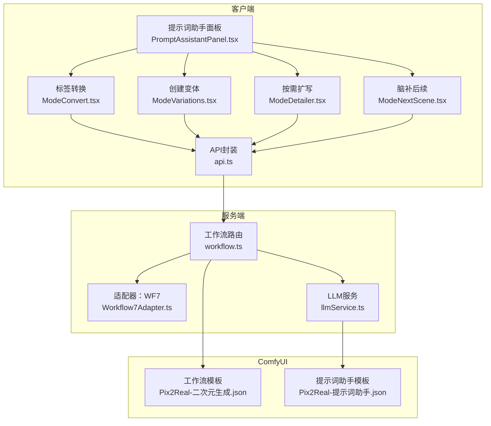
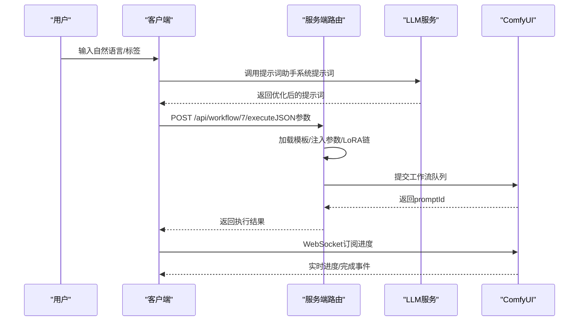
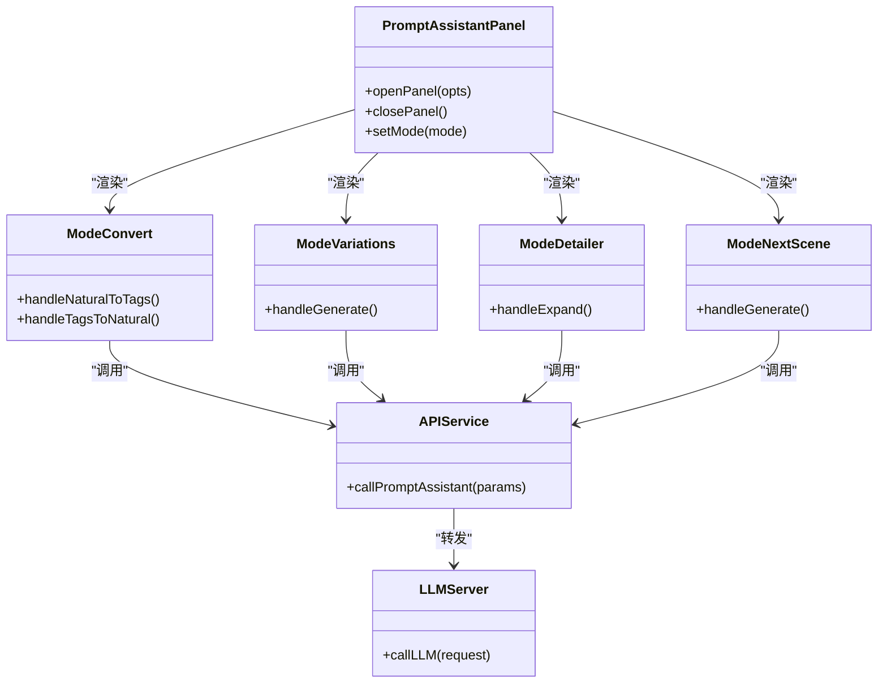
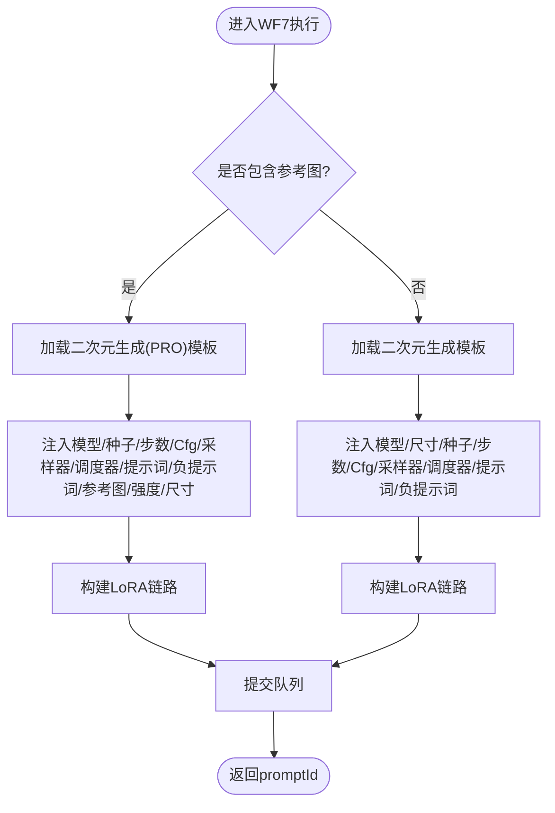
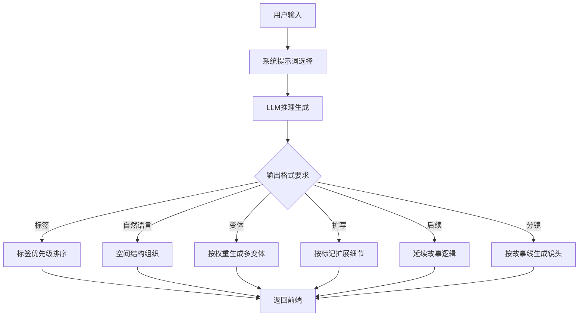
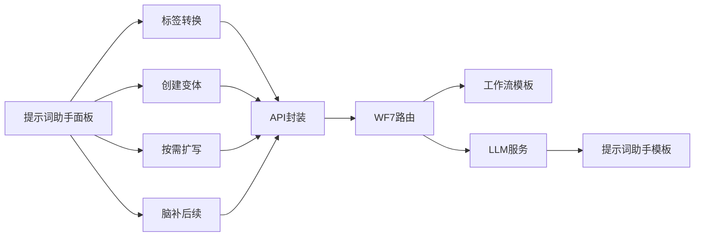

# 快速出图工作流

<cite>
**本文引用的文件**
- [README.md](file://README.md)
- [Workflow7Adapter.ts](file://server/src/adapters/Workflow7Adapter.ts)
- [workflow.ts](file://server/src/routes/workflow.ts)
- [api.ts](file://client/src/services/api.ts)
- [PromptAssistantPanel.tsx](file://client/src/components/PromptAssistantPanel.tsx)
- [ModeConvert.tsx](file://client/src/components/prompt-assistant/ModeConvert.tsx)
- [ModeVariations.tsx](file://client/src/components/prompt-assistant/ModeVariations.tsx)
- [ModeDetailer.tsx](file://client/src/components/prompt-assistant/ModeDetailer.tsx)
- [ModeNextScene.tsx](file://client/src/components/prompt-assistant/ModeNextScene.tsx)
- [systemPrompts.ts](file://client/src/components/prompt-assistant/systemPrompts.ts)
- [SystemPrompt.txt](file://docs/提示词助理开发需求/SystemPrompt.txt)
- [Pix2Real-提示词助手.json](file://ComfyUI_API/Pix2Real-提示词助手.json)
- [llmService.ts](file://server/src/services/llmService.ts)
</cite>

## 目录
1. [简介](#简介)
2. [项目结构](#项目结构)
3. [核心组件](#核心组件)
4. [架构总览](#架构总览)
5. [详细组件分析](#详细组件分析)
6. [依赖关系分析](#依赖关系分析)
7. [性能考量](#性能考量)
8. [故障排查指南](#故障排查指南)
9. [结论](#结论)
10. [附录](#附录)

## 简介
本技术文档聚焦“快速出图工作流（WF7）”，系统性阐述从提示词优化、图像尺寸控制到质量参数调节的完整流程，并深入解析提示词助手系统与AI Agent的集成机制、提示词模板系统的工作原理，以及API调用示例与批量处理策略。目标读者既包括一线创作者，也包括需要理解系统实现细节的工程师。

## 项目结构
- 客户端（React + TypeScript）位于 client/，负责用户界面、提示词助手面板、与后端API交互。
- 服务端（Express + TypeScript）位于 server/，负责工作流路由、ComfyUI通信、LLM服务与提示词增强。
- ComfyUI工作流模板位于 ComfyUI_API/，WF7使用专用模板与参数节点。
- 文档与系统提示词位于 docs/，包含提示词助手的系统提示词与模板。

图表来源
- [PromptAssistantPanel.tsx:1-139](file://client/src/components/PromptAssistantPanel.tsx#L1-L139)
- [ModeConvert.tsx:1-190](file://client/src/components/prompt-assistant/ModeConvert.tsx#L1-L190)
- [ModeVariations.tsx:1-146](file://client/src/components/prompt-assistant/ModeVariations.tsx#L1-L146)
- [ModeDetailer.tsx:1-137](file://client/src/components/prompt-assistant/ModeDetailer.tsx#L1-L137)
- [ModeNextScene.tsx:1-137](file://client/src/components/prompt-assistant/ModeNextScene.tsx#L1-L137)
- [api.ts:1-42](file://client/src/services/api.ts#L1-L42)
- [workflow.ts:269-405](file://server/src/routes/workflow.ts#L269-L405)
- [Workflow7Adapter.ts:1-14](file://server/src/adapters/Workflow7Adapter.ts#L1-L14)
- [llmService.ts:1-114](file://server/src/services/llmService.ts#L1-L114)
- [Pix2Real-提示词助手.json:1-106](file://ComfyUI_API/Pix2Real-提示词助手.json#L1-L106)

章节来源
- [README.md:41-79](file://README.md#L41-L79)

## 核心组件
- WF7工作流适配器：定义WF7的ID、名称、是否需要提示词、基础提示词与输出目录，并声明WF7采用专用路由而非通用模板拼接。
- WF7执行路由：接收JSON参数（模型、LoRA、提示词、尺寸、采样器、调度器、种子等），按PRO分支或普通分支处理，动态注入节点参数并提交队列。
- 提示词助手系统：前端提供标签转换、变体生成、按需扩写、脑补后续等模式；后端通过LLM服务与提示词助手模板协同，生成符合规则的提示词。
- API封装：统一提示词助手调用入口，支持Grokk/GPT等不同后端路由。

章节来源
- [Workflow7Adapter.ts:1-14](file://server/src/adapters/Workflow7Adapter.ts#L1-L14)
- [workflow.ts:269-405](file://server/src/routes/workflow.ts#L269-L405)
- [api.ts:1-42](file://client/src/services/api.ts#L1-L42)
- [systemPrompts.ts:1-154](file://client/src/components/prompt-assistant/systemPrompts.ts#L1-L154)
- [SystemPrompt.txt:1-153](file://docs/提示词助理开发需求/SystemPrompt.txt#L1-L153)
- [Pix2Real-提示词助手.json:1-106](file://ComfyUI_API/Pix2Real-提示词助手.json#L1-L106)

## 架构总览
WF7的端到端流程如下：
- 前端通过API调用提示词助手，生成符合规则的英文提示词。
- 前端调用WF7执行路由，携带模型、LoRA、提示词、尺寸、采样参数等。
- 服务端加载对应模板，动态填充节点参数（尺寸、采样器、提示词、LoRA链路等），提交到ComfyUI队列。
- WebSocket实时推送进度，完成后返回结果。

图表来源
- [workflow.ts:269-405](file://server/src/routes/workflow.ts#L269-L405)
- [api.ts:1-42](file://client/src/services/api.ts#L1-L42)
- [llmService.ts:1-114](file://server/src/services/llmService.ts#L1-L114)

## 详细组件分析

### 组件A：提示词助手系统
- 模式划分：标签转换、创建变体、按需扩写、脑补后续、分镜生成、标签合成器。
- 系统提示词：前端systemPrompts.ts与docs/SystemPrompt.txt内容一致，确保规则稳定。
- 与AI Agent集成：通过LLM服务封装，支持Grokk/GPT后端；Agent工具集可辅助生成/处理图片。
- 与WF7集成：前端调用api封装的callPromptAssistant，后端路由/workflow/prompt-assistant或/workflow/prompt-assistant-grok根据设置选择。

图表来源
- [PromptAssistantPanel.tsx:1-139](file://client/src/components/PromptAssistantPanel.tsx#L1-L139)
- [ModeConvert.tsx:1-190](file://client/src/components/prompt-assistant/ModeConvert.tsx#L1-L190)
- [ModeVariations.tsx:1-146](file://client/src/components/prompt-assistant/ModeVariations.tsx#L1-L146)
- [ModeDetailer.tsx:1-137](file://client/src/components/prompt-assistant/ModeDetailer.tsx#L1-L137)
- [ModeNextScene.tsx:1-137](file://client/src/components/prompt-assistant/ModeNextScene.tsx#L1-L137)
- [api.ts:1-42](file://client/src/services/api.ts#L1-L42)
- [llmService.ts:1-114](file://server/src/services/llmService.ts#L1-L114)

章节来源
- [systemPrompts.ts:1-154](file://client/src/components/prompt-assistant/systemPrompts.ts#L1-L154)
- [SystemPrompt.txt:1-153](file://docs/提示词助理开发需求/SystemPrompt.txt#L1-L153)
- [api.ts:1-42](file://client/src/services/api.ts#L1-L42)
- [llmService.ts:190-302](file://server/src/services/llmService.ts#L190-L302)

### 组件B：WF7工作流执行
- 专用路由：POST /api/workflow/7/execute，不使用通用模板拼接，而是按PRO分支或普通分支加载对应模板。
- PRO分支：当包含referenceImage时，使用二次元生成(PRO)模板，支持深度/姿态强度、参考图上传与命名前缀。
- 普通分支：使用二次元生成模板，注入模型、尺寸、采样器、提示词、LoRA链路等。
- LoRA链路：通过applyLoraChain动态连接Checkpoint/UNet/CLIP与LoRA节点，支持启用/禁用与权重串联。
- 输出命名：对文件名前缀中的路径分隔符进行替换，避免同名覆盖。

图表来源
- [workflow.ts:269-405](file://server/src/routes/workflow.ts#L269-L405)
- [Workflow7Adapter.ts:1-14](file://server/src/adapters/Workflow7Adapter.ts#L1-L14)

章节来源
- [workflow.ts:269-405](file://server/src/routes/workflow.ts#L269-L405)

### 组件C：提示词模板系统
- 系统提示词：前端systemPrompts.ts与docs/SystemPrompt.txt保持一致，覆盖标签生成、自然语言转写、变体生成、扩写、后续镜头、分镜生成等规则。
- 提示词助手模板：ComfyUI模板包含llama_cpp参数、模型加载、推理节点与文本输出节点，用于演示与测试。
- 与Agent集成：llmService提供工具定义与系统提示词构建，支持角色/姿势/风格LoRA匹配、触发词插入、批量变体生成等。

图表来源
- [systemPrompts.ts:1-154](file://client/src/components/prompt-assistant/systemPrompts.ts#L1-L154)
- [SystemPrompt.txt:1-153](file://docs/提示词助理开发需求/SystemPrompt.txt#L1-L153)
- [Pix2Real-提示词助手.json:1-106](file://ComfyUI_API/Pix2Real-提示词助手.json#L1-L106)
- [llmService.ts:190-302](file://server/src/services/llmService.ts#L190-L302)

章节来源
- [systemPrompts.ts:1-154](file://client/src/components/prompt-assistant/systemPrompts.ts#L1-L154)
- [SystemPrompt.txt:1-153](file://docs/提示词助理开发需求/SystemPrompt.txt#L1-L153)
- [Pix2Real-提示词助手.json:1-106](file://ComfyUI_API/Pix2Real-提示词助手.json#L1-L106)
- [llmService.ts:190-302](file://server/src/services/llmService.ts#L190-L302)

## 依赖关系分析
- 前端依赖：提示词助手面板依赖各模式组件；API封装依赖设置存储决定后端路由；系统提示词来自前端与文档两处，保持一致性。
- 后端依赖：WF7路由依赖ComfyUI模板与LoRA链构建；提示词助手依赖LLM服务与提示词助手模板；Agent工具集提供生成/处理能力。
- 外部依赖：ComfyUI API、LLM后端（Grokk/GPT）。

图表来源
- [PromptAssistantPanel.tsx:1-139](file://client/src/components/PromptAssistantPanel.tsx#L1-L139)
- [ModeConvert.tsx:1-190](file://client/src/components/prompt-assistant/ModeConvert.tsx#L1-L190)
- [ModeVariations.tsx:1-146](file://client/src/components/prompt-assistant/ModeVariations.tsx#L1-L146)
- [ModeDetailer.tsx:1-137](file://client/src/components/prompt-assistant/ModeDetailer.tsx#L1-L137)
- [ModeNextScene.tsx:1-137](file://client/src/components/prompt-assistant/ModeNextScene.tsx#L1-L137)
- [api.ts:1-42](file://client/src/services/api.ts#L1-L42)
- [workflow.ts:269-405](file://server/src/routes/workflow.ts#L269-L405)
- [llmService.ts:1-114](file://server/src/services/llmService.ts#L1-L114)
- [Pix2Real-提示词助手.json:1-106](file://ComfyUI_API/Pix2Real-提示词助手.json#L1-L106)

章节来源
- [workflow.ts:269-405](file://server/src/routes/workflow.ts#L269-L405)
- [llmService.ts:1-114](file://server/src/services/llmService.ts#L1-L114)

## 性能考量
- LoRA链路优化：通过applyLoraChain减少节点重连开销，仅连接启用的LoRA并串联权重，避免无效计算。
- 输出命名规范化：对文件名前缀中的路径分隔符进行替换，避免同名覆盖导致的IO冲突。
- WebSocket实时反馈：前端通过WebSocket订阅进度，提升用户体验与资源利用率。
- 模板复用：WF7使用专用模板，减少通用拼接带来的额外处理成本。

## 故障排查指南
- 常见错误映射：后端将ComfyUI常见错误映射为用户友好提示，如模型/LoRA/UNet/Vae/ControlNet缺失与队列提交失败等。
- API调用失败：检查clientId、模型/LoRA是否存在、提示词格式是否符合规则。
- 提示词助手异常：确认系统提示词与模板一致，检查LLM后端可用性与网络连通性。
- 尺寸与比例：当用户选择非原图比例时，需显式传入width/height覆盖模板节点；否则可能沿用默认尺寸。

章节来源
- [workflow.ts:126-150](file://server/src/routes/workflow.ts#L126-L150)
- [workflow.ts:269-405](file://server/src/routes/workflow.ts#L269-L405)

## 结论
WF7工作流通过专用路由与模板、完善的提示词助手与Agent集成、以及严谨的参数注入与LoRA链路构建，实现了从提示词优化到图像生成的高效闭环。提示词模板系统确保输出质量与一致性，API与路由设计兼顾灵活性与易用性，适合创作者与开发者共同使用。

## 附录

### API调用示例（基础参数设置）
- 端点：POST /api/workflow/7/execute
- 请求体字段（示例）：
  - clientId: string（必填）
  - model: string（必填）
  - loras: Array<{ model: string; enabled: boolean; strength: number }>
  - prompt: string（必填）
  - negativePrompt: string（可选）
  - width: number（必填）
  - height: number（必填）
  - steps: number（必填）
  - cfg: number（必填）
  - sampler: string（必填）
  - scheduler: string（必填）
  - name: string（可选）
  - seed: number（可选）

章节来源
- [workflow.ts:269-405](file://server/src/routes/workflow.ts#L269-L405)

### API调用示例（高级选项配置）
- PRO分支：当包含referenceImage时，使用二次元生成(PRO)模板，支持depthStrength、poseStrength、useOriginalRatio等。
- LoRA链路：通过applyLoraChain动态连接多个LoRA节点，支持启用/禁用与权重串联。
- 输出命名：对文件名前缀中的路径分隔符进行替换，避免同名覆盖。

章节来源
- [workflow.ts:293-350](file://server/src/routes/workflow.ts#L293-L350)
- [workflow.ts:379-391](file://server/src/routes/workflow.ts#L379-L391)

### API调用示例（批量处理策略）
- 批量生成：通过为每个生成项设置不同seed，确保批次内多样性；或使用variants参数（Agent工具）一次性生成多个变体。
- 变体生成：Agent工具支持variants字段，每个变体独立配置prompt/loras/model/尺寸，便于对比与筛选。

章节来源
- [llmService.ts:190-302](file://server/src/services/llmService.ts#L190-L302)