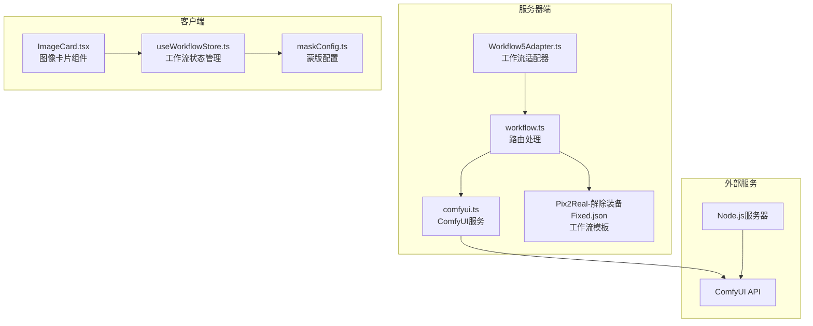
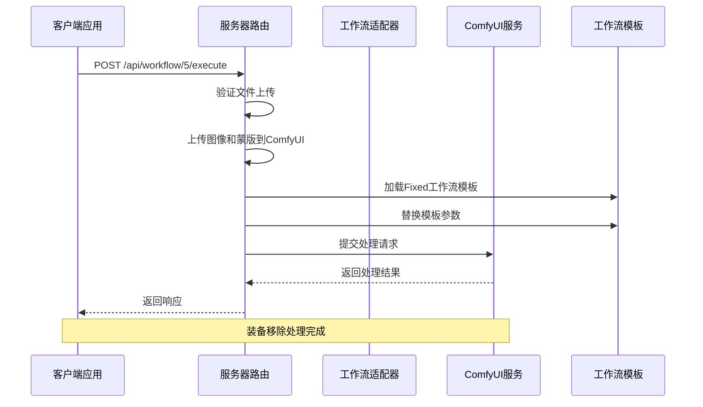
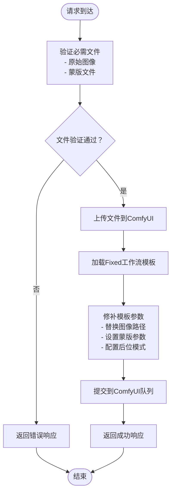
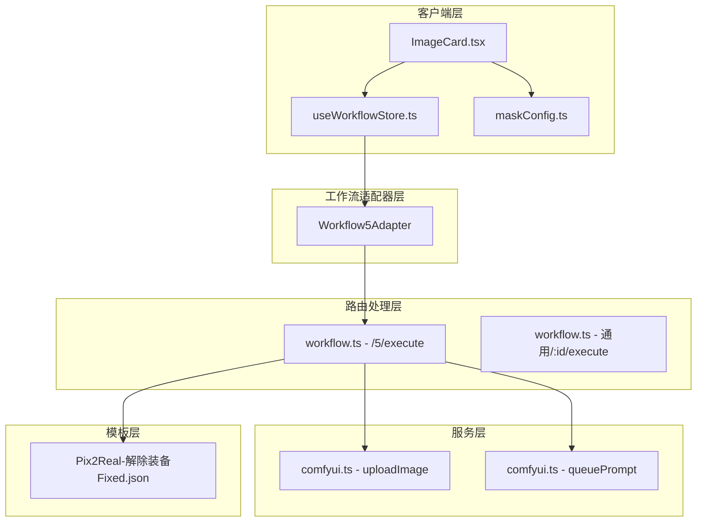

# 解除装备工作流

<cite>
**本文档引用的文件**
- [Workflow5Adapter.ts](file://server/src/adapters/Workflow5Adapter.ts)
- [workflow.ts](file://server/src/routes/workflow.ts)
- [comfyui.ts](file://server/src/services/comfyui.ts)
- [Pix2Real-解除装备.json](file://ComfyUI_API/Pix2Real-解除装备.json)
- [Pix2Real-解除装备Fixed.json](file://ComfyUI_API/Pix2Real-解除装备Fixed.json)
- [jiaochuazhuangbei-impl.md](file://docs/plans/2026-02-25-jiechuazhuangbei-impl.md)
- [jiaochuazhuangbei-workflow-design.md](file://docs/plans/2026-02-25-jiechuazhuangbei-workflow-design.md)
- [index.ts](file://server/src/adapters/index.ts)
- [ImageCard.tsx](file://client/src/components/ImageCard.tsx)
- [useWorkflowStore.ts](file://client/src/hooks/useWorkflowStore.ts)
- [maskConfig.ts](file://client/src/config/maskConfig.ts)
</cite>

## 目录
1. [简介](#简介)
2. [项目结构](#项目结构)
3. [核心组件](#核心组件)
4. [架构概览](#架构概览)
5. [详细组件分析](#详细组件分析)
6. [依赖关系分析](#依赖关系分析)
7. [性能考虑](#性能考虑)
8. [故障排除指南](#故障排除指南)
9. [结论](#结论)

## 简介

解除装备工作流(WF5)是一个专门设计的AI图像处理工作流，用于智能地移除图像中的装备或衣物，同时保留其他区域的完整性。该工作流采用独特的双文件上传机制，要求用户提供原始图像和对应的蒙版文件，并通过专用的/5/execute路由进行处理。

该工作流的核心特点包括：
- 专用的/5/execute路由处理
- 基于蒙版的智能分割技术
- 装备检测算法
- 智能移除逻辑
- Fixed版本与标准版本的区别

## 项目结构

解除装备工作流涉及服务器端和客户端两个主要部分：



**图表来源**
- [workflow.ts:163-215](file://server/src/routes/workflow.ts#L163-L215)
- [Workflow5Adapter.ts:4-14](file://server/src/adapters/Workflow5Adapter.ts#L4-L14)

**章节来源**
- [workflow.ts:1-800](file://server/src/routes/workflow.ts#L1-L800)
- [Workflow5Adapter.ts:1-15](file://server/src/adapters/Workflow5Adapter.ts#L1-L15)

## 核心组件

### 工作流适配器

Workflow5Adapter是最小化的适配器实现，专门为解除装备工作流提供元数据信息。它实现了WorkflowAdapter接口，但将buildPrompt方法重定向到专用路由。

### 专用路由处理

/5/execute路由是解除装备工作流的核心，它接受两个必需的文件上传：原始图像和蒙版文件。该路由在通用/:id/execute路由之前注册，确保正确的请求处理顺序。

### ComfyUI工作流模板

工作流模板定义了完整的处理流程，包括图像加载、蒙版处理、装备检测和智能移除等步骤。

**章节来源**
- [Workflow5Adapter.ts:4-14](file://server/src/adapters/Workflow5Adapter.ts#L4-L14)
- [workflow.ts:163-215](file://server/src/routes/workflow.ts#L163-L215)
- [Pix2Real-解除装备Fixed.json:1-360](file://ComfyUI_API/Pix2Real-解除装备Fixed.json#L1-L360)

## 架构概览

解除装备工作流采用分层架构设计，确保了模块间的清晰分离和职责明确：



**图表来源**
- [workflow.ts:163-215](file://server/src/routes/workflow.ts#L163-L215)
- [comfyui.ts:168-196](file://server/src/services/comfyui.ts#L168-L196)

## 详细组件分析

### 专用路由实现

/5/execute路由是解除装备工作流的关键组件，它提供了专门的文件上传和处理机制：



**图表来源**
- [workflow.ts:163-215](file://server/src/routes/workflow.ts#L163-L215)

#### 文件上传处理

路由使用multer的fields中间件来处理两个必需的文件上传：
- `image`: 原始图像文件
- `mask`: 白黑蒙版PNG文件

#### 参数配置

路由支持以下参数配置：
- `clientId`: 客户端标识符
- `prompt`: 用户自定义提示词
- `backPose`: 后位LoRA切换布尔值

**章节来源**
- [workflow.ts:163-215](file://server/src/routes/workflow.ts#L163-L215)

### 工作流模板分析

解除装备工作流使用Fixed版本的工作流模板，该模板包含了完整的处理流程：

#### 关键节点功能

| 节点ID | 类型 | 功能 | 配置 |
|--------|------|------|------|
| 313 | LoadImage | 加载原始图像 | 输入图像文件名 |
| 385 | LoadImage | 加载蒙版图像 | 输入蒙版文件名 |
| 314 | CLIPTextEncode | 文本编码 | 用户提示词或默认值 |
| 389 | easy ifElse | 后位LoRA切换 | 布尔开关控制 |
| 315 | Seed (rgthree) | 随机种子 | 随机数生成 |

#### 蒙版处理流程

```mermaid
flowchart LR
A[蒙版图像RGB] --> B[颜色阈值检测<br/>阈值=10]
B --> C{像素颜色判断}
C --> |≥(245,245,245)| D[白色像素<br/>保留区域]
C --> |<(245,245,245)| E[黑色像素<br/>移除区域]
D --> F[最终蒙版输出]
E --> F
```

**图表来源**
- [jiaochuazhuangbei-workflow-design.md:28-35](file://docs/plans/2026-02-25-jiechuazhuangbei-workflow-design.md#L28-L35)

**章节来源**
- [Pix2Real-解除装备Fixed.json:1-360](file://ComfyUI_API/Pix2Real-解除装备Fixed.json#L1-L360)
- [jiaochuazhuangbei-workflow-design.md:18-35](file://docs/plans/2026-02-25-jiechuazhuangbei-workflow-design.md#L18-L35)

### 客户端集成

客户端组件提供了完整的用户交互界面和数据处理功能：

#### 图像卡片组件

ImageCard.tsx组件针对工作流5进行了特殊处理：
- 显示后位LoRA切换按钮
- 实现蒙版到PNG的转换
- 处理批量执行逻辑

#### 状态管理

useWorkflowStore.ts维护了工作流5特有的状态：
- `backPoseToggles`: 每张图像的后位模式状态
- `tabData[5]`: 工作流5的完整数据结构

**章节来源**
- [ImageCard.tsx:420-515](file://client/src/components/ImageCard.tsx#L420-L515)
- [useWorkflowStore.ts:231-246](file://client/src/hooks/useWorkflowStore.ts#L231-L246)

## 依赖关系分析

解除装备工作流的依赖关系体现了清晰的分层架构：



**图表来源**
- [index.ts:14-26](file://server/src/adapters/index.ts#L14-L26)
- [workflow.ts:163-215](file://server/src/routes/workflow.ts#L163-L215)

**章节来源**
- [index.ts:1-33](file://server/src/adapters/index.ts#L1-L33)
- [workflow.ts:1-800](file://server/src/routes/workflow.ts#L1-L800)

## 性能考虑

解除装备工作流在设计时充分考虑了性能优化：

### 内存管理

- 使用OffscreenCanvas进行高效的图像处理
- 及时释放URL对象引用
- 优化蒙版转换过程中的内存使用

### 并发处理

- 支持批量执行多个图像
- 异步文件上传处理
- 非阻塞的WebSocket连接

### 缓存策略

- ComfyUI工作流模板的缓存
- 上传文件的临时存储管理
- 进度状态的实时更新

## 故障排除指南

### 常见问题及解决方案

#### 文件上传问题

**问题**: 400错误，提示缺少必需文件
**原因**: 未提供原始图像或蒙版文件
**解决**: 确保同时上传image和mask文件

#### ComfyUI连接问题

**问题**: 500错误，提示工作流提交失败
**原因**: ComfyUI服务不可达或配置错误
**解决**: 检查ComfyUI服务状态和网络连接

#### 蒙版格式问题

**问题**: 蒙版处理异常
**原因**: 蒙版图像格式不符合要求
**解决**: 确保蒙版为纯RGB PNG，白色区域表示保留，黑色区域表示移除

**章节来源**
- [workflow.ts:126-150](file://server/src/routes/workflow.ts#L126-L150)

## 结论

解除装备工作流(WF5)是一个精心设计的AI图像处理解决方案，具有以下显著特点：

1. **专用性**: 通过专用路由和模板实现了高度专业化的功能
2. **智能化**: 结合蒙版技术和AI算法实现精准的装备移除
3. **易用性**: 提供直观的用户界面和简单的操作流程
4. **可扩展性**: 清晰的架构设计便于后续功能扩展

该工作流特别适用于需要精确控制图像特定区域的应用场景，如服装设计、虚拟试衣、图像编辑等专业领域。通过Fixed版本与标准版本的差异化设计，用户可以根据具体需求选择最适合的处理方式。