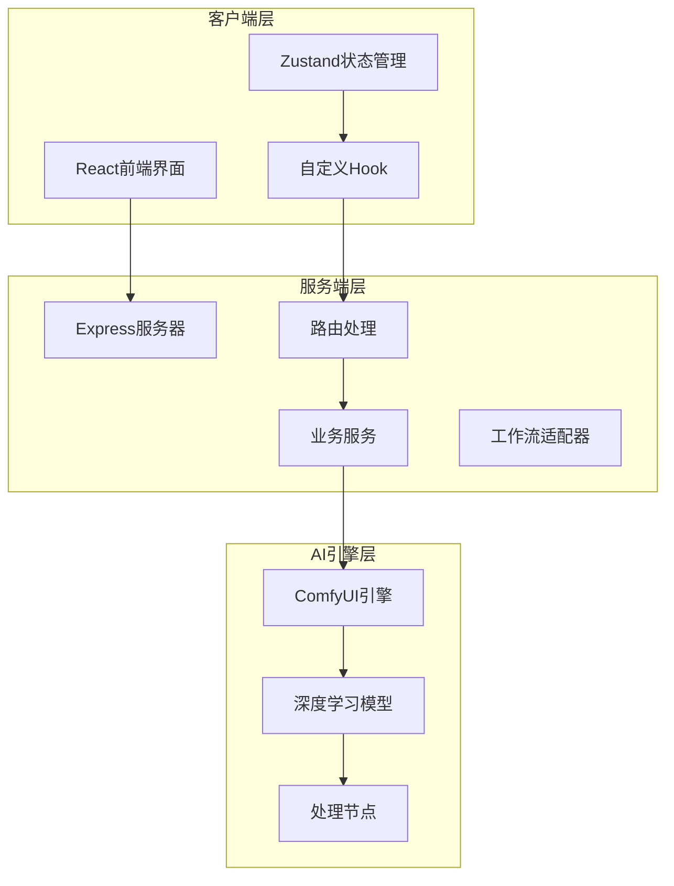
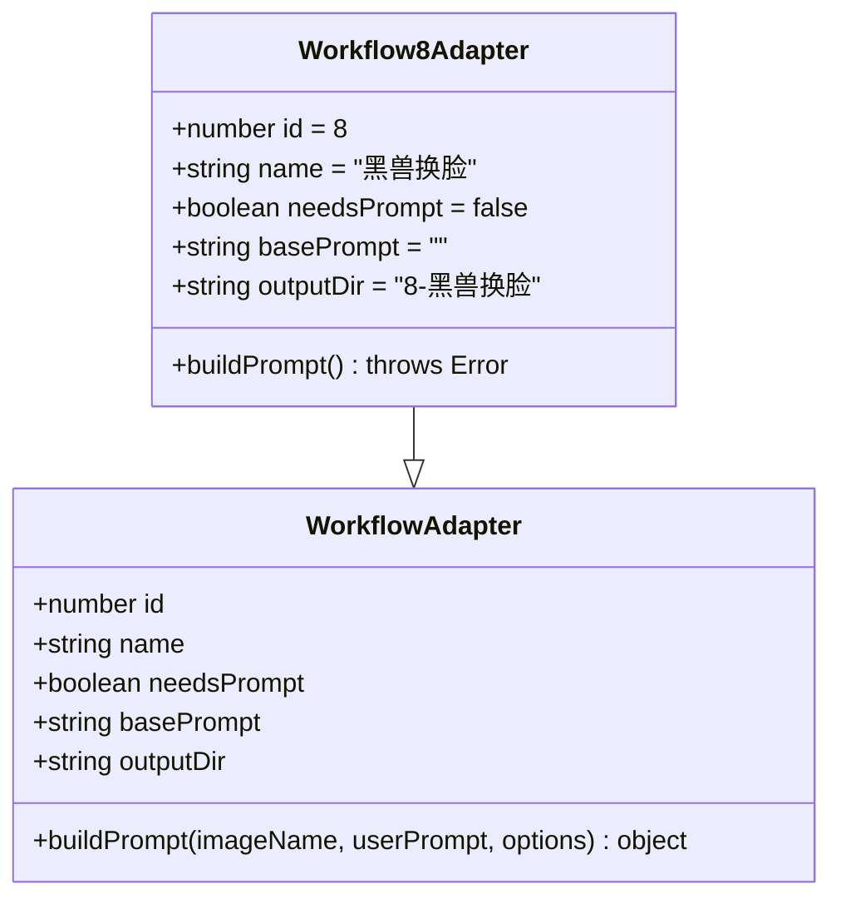
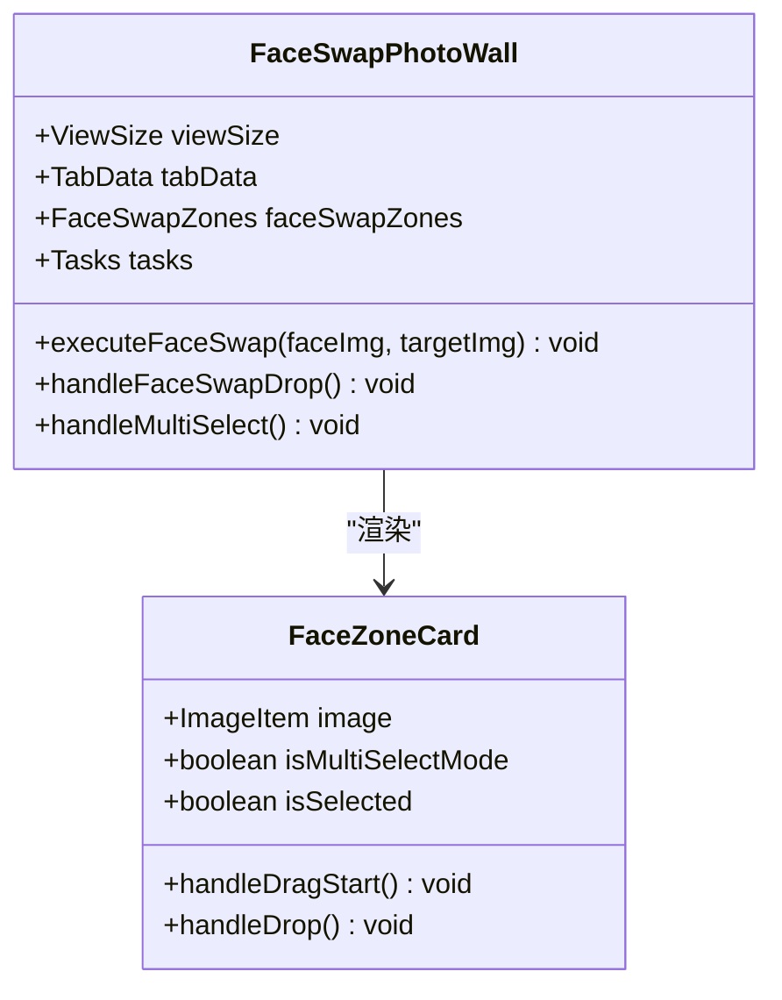
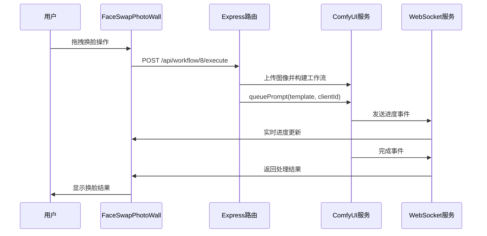
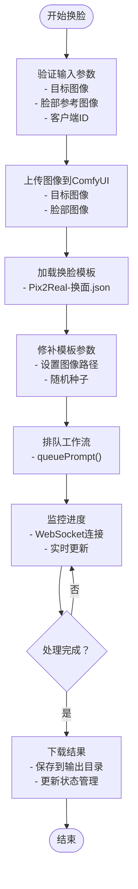
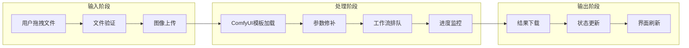
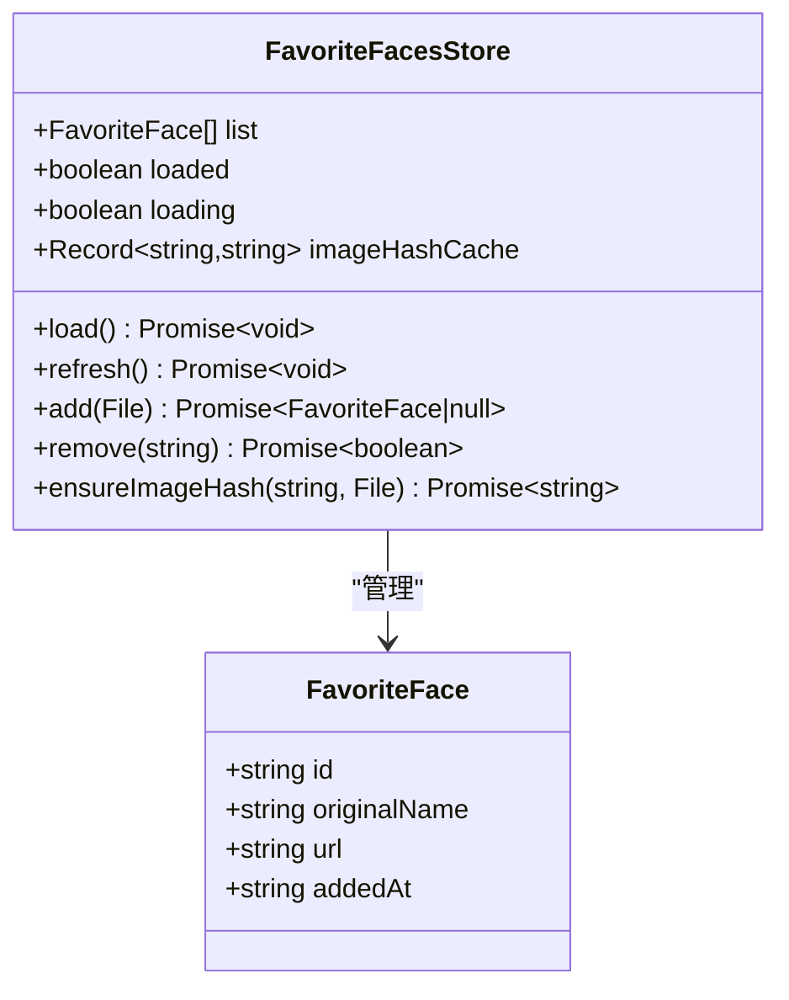
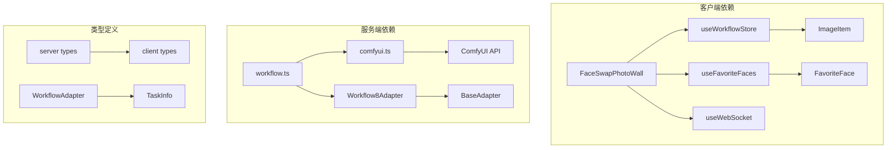
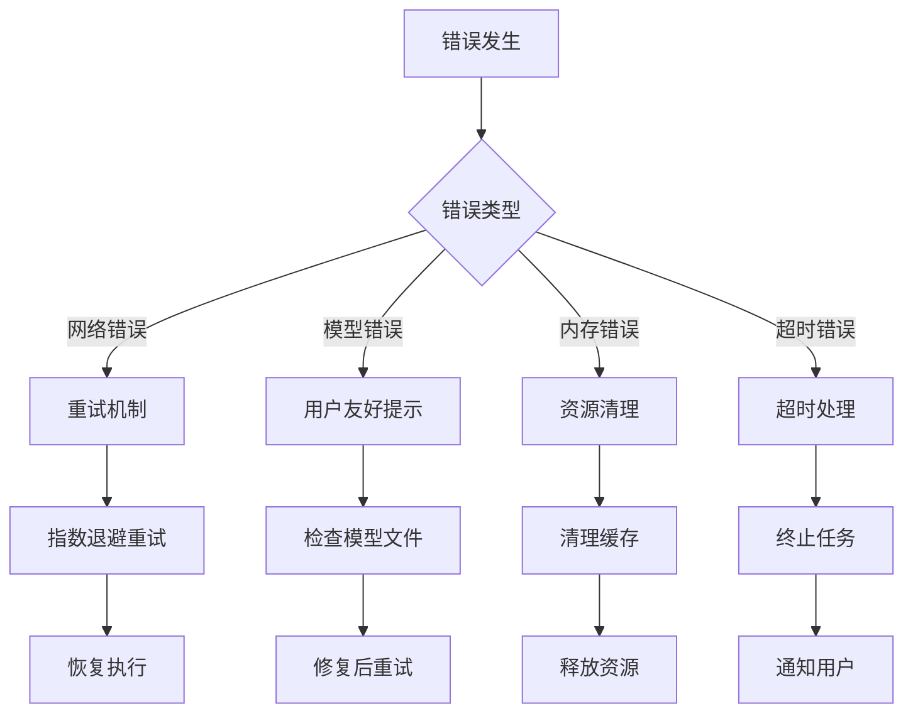

# 黑兽换脸工作流

<cite>
**本文档引用的文件**
- [Workflow8Adapter.ts](file://server/src/adapters/Workflow8Adapter.ts)
- [FaceSwapPhotoWall.tsx](file://client/src/components/FaceSwapPhotoWall.tsx)
- [useFavoriteFaces.ts](file://client/src/hooks/useFavoriteFaces.ts)
- [comfyui.ts](file://server/src/services/comfyui.ts)
- [Pix2Real-换面.json](file://ComfyUI_API/Pix2Real-换面.json)
- [workflow.ts](file://server/src/routes/workflow.ts)
- [useWorkflowStore.ts](file://client/src/hooks/useWorkflowStore.ts)
- [index.ts](file://server/src/index.ts)
- [types/index.ts](file://server/src/types/index.ts)
- [types/index.ts](file://client/src/types/index.ts)
</cite>

## 目录
1. [简介](#简介)
2. [项目结构](#项目结构)
3. [核心组件](#核心组件)
4. [架构概览](#架构概览)
5. [详细组件分析](#详细组件分析)
6. [依赖关系分析](#依赖关系分析)
7. [性能考虑](#性能考虑)
8. [故障排除指南](#故障排除指南)
9. [结论](#结论)
10. [附录](#附录)

## 简介

黑兽换脸工作流(WF8)是CorineKit Pix2Real系统中的核心功能模块，专门用于实现高质量的人像换脸处理。该工作流基于ComfyUI深度学习框架，结合ReActorFaceSwap和FaceSwapNode等专业换脸算法，为用户提供直观易用的拖拽式换脸体验。

本工作流的核心特性包括：
- **双区域界面设计**：分离的脸部参考区和目标图区，支持拖拽式操作
- **智能收藏系统**：支持人脸图像的收藏和去重管理
- **批量处理能力**：支持多目标批量换脸操作
- **实时进度监控**：完整的任务状态跟踪和进度显示
- **高质量输出**：基于Flux2模型的高质量图像生成

## 项目结构

该项目采用前后端分离架构，主要分为以下层次：



**图表来源**
- [index.ts:118-150](file://server/src/index.ts#L118-L150)
- [workflow.ts:29-31](file://server/src/routes/workflow.ts#L29-L31)

**章节来源**
- [index.ts:118-150](file://server/src/index.ts#L118-L150)
- [workflow.ts:29-31](file://server/src/routes/workflow.ts#L29-L31)

## 核心组件

### 工作流适配器

Workflow8Adapter负责定义黑兽换脸工作流的基本属性和行为：



**图表来源**
- [Workflow8Adapter.ts:1-14](file://server/src/adapters/Workflow8Adapter.ts#L1-L14)

### 界面组件

FaceSwapPhotoWall提供了直观的拖拽式换脸界面：



**图表来源**
- [FaceSwapPhotoWall.tsx:246-427](file://client/src/components/FaceSwapPhotoWall.tsx#L246-L427)

**章节来源**
- [Workflow8Adapter.ts:3-12](file://server/src/adapters/Workflow8Adapter.ts#L3-L12)
- [FaceSwapPhotoWall.tsx:246-427](file://client/src/components/FaceSwapPhotoWall.tsx#L246-L427)

## 架构概览

黑兽换脸工作流的整体架构采用事件驱动的设计模式：



**图表来源**
- [workflow.ts:599-642](file://server/src/routes/workflow.ts#L599-L642)
- [index.ts:273-333](file://server/src/index.ts#L273-L333)

## 详细组件分析

### 换脸算法流程

黑兽换脸工作流的核心算法流程如下：



**图表来源**
- [workflow.ts:599-642](file://server/src/routes/workflow.ts#L599-L642)
- [comfyui.ts:168-196](file://server/src/services/comfyui.ts#L168-L196)

### 数据流处理

工作流中的数据流处理机制：



**图表来源**
- [FaceSwapPhotoWall.tsx:409-427](file://client/src/components/FaceSwapPhotoWall.tsx#L409-L427)
- [workflow.ts:624-631](file://server/src/routes/workflow.ts#L624-L631)

### 收藏系统集成

人脸收藏功能的实现：



**图表来源**
- [useFavoriteFaces.ts:10-25](file://client/src/hooks/useFavoriteFaces.ts#L10-L25)

**章节来源**
- [FaceSwapPhotoWall.tsx:330-352](file://client/src/components/FaceSwapPhotoWall.tsx#L330-L352)
- [useFavoriteFaces.ts:35-109](file://client/src/hooks/useFavoriteFaces.ts#L35-L109)

## 依赖关系分析

### 组件耦合关系



**图表来源**
- [FaceSwapPhotoWall.tsx:1-12](file://client/src/components/FaceSwapPhotoWall.tsx#L1-L12)
- [workflow.ts:8-14](file://server/src/routes/workflow.ts#L8-L14)

### 外部依赖

工作流对外部系统的依赖关系：

| 依赖组件 | 版本要求 | 用途 | 配置位置 |
|---------|---------|------|---------|
| ComfyUI | 1.0+ | 深度学习推理引擎 | 本地8188端口 |
| Flux2模型 | 最新版 | 图像生成模型 | ComfyUI模型目录 |
| ReActorFaceSwap | 最新版 | 人脸交换算法 | ComfyUI节点插件 |
| Node.js | 16+ | 服务端运行时 | 系统环境 |

**章节来源**
- [index.ts:148-155](file://server/src/index.ts#L148-L155)
- [comfyui.ts:6-7](file://server/src/services/comfyui.ts#L6-L7)

## 性能考虑

### 进度追踪机制

工作流采用多维度的进度追踪机制：

```mermaid
flowchart TD
A[节点权重计算] --> B[静态权重表]
A --> C[动态权重计算]
B --> D[模型加载: 15]
B --> E[VAE编码/解码: 3]
B --> F[采样器: 2.5 × 步数]
C --> G[Tiled采样器估算]
G --> H[Tile数量: 8]
I[进度计算公式] --> J[权重化百分比]
J --> K[已完成权重 + 当前节点权重 × 进度] / 总权重
K --> L[封顶99%，100%留待确认]
```

**图表来源**
- [comfyui.ts:58-144](file://server/src/services/comfyui.ts#L58-L144)
- [index.ts:240-271](file://server/src/index.ts#L240-L271)

### 内存管理

工作流实现了完善的内存管理策略：

- **VRAM清理**：自动清理显存缓存
- **图像尺寸控制**：限制最大像素数(1.5MP)
- **批量处理优化**：支持多目标批量换脸
- **资源回收**：及时释放临时文件和缓存

**章节来源**
- [comfyui.ts:152-166](file://server/src/services/comfyui.ts#L152-L166)
- [Pix2Real-换面.json:334-344](file://ComfyUI_API/Pix2Real-换面.json#L334-L344)

## 故障排除指南

### 常见问题及解决方案

| 问题类型 | 症状描述 | 可能原因 | 解决方案 |
|---------|---------|---------|---------|
| 服务端错误 | "Queue prompt failed" | ComfyUI未运行 | 启动ComfyUI服务 |
| 模型缺失 | "模型文件未找到" | 模型文件损坏 | 重新安装模型 |
| 内存不足 | "VRAM使用过高" | 图像过大 | 减小图像尺寸 |
| 进度停滞 | "进度卡住" | 网络延迟 | 检查WebSocket连接 |
| 结果为空 | "换脸完成但无输出" | 历史记录未提交 | 等待历史提交完成 |

### 错误处理流程



**图表来源**
- [workflow.ts:129-150](file://server/src/routes/workflow.ts#L129-L150)
- [index.ts:450-463](file://server/src/index.ts#L450-L463)

**章节来源**
- [workflow.ts:129-150](file://server/src/routes/workflow.ts#L129-L150)
- [index.ts:450-463](file://server/src/index.ts#L450-L463)

## 结论

黑兽换脸工作流(WF8)是一个高度集成的AI图像处理系统，具有以下特点：

**技术优势**：
- 基于专业的ReActorFaceSwap算法，换脸质量优异
- 采用事件驱动架构，响应速度快
- 支持实时进度监控和状态反馈
- 集成收藏系统，提升用户体验

**架构特色**：
- 清晰的前后端分离设计
- 完善的错误处理和恢复机制
- 高效的内存管理和资源控制
- 可扩展的工作流适配器模式

**应用场景**：
- 个人头像换脸
- 视频内容制作
- 艺术创作辅助
- 社交媒体内容生成

该工作流为用户提供了专业级的换脸体验，同时保持了良好的易用性和稳定性。

## 附录

### API调用规范

#### 换脸执行接口

**请求地址**：`POST /api/workflow/8/execute`

**请求头**：
```
Content-Type: multipart/form-data
```

**请求体参数**：

| 参数名 | 类型 | 必填 | 描述 |
|-------|------|------|------|
| targetImage | File | 是 | 目标图像文件 |
| faceImage | File | 是 | 脸部参考图像文件 |
| clientId | string | 是 | 客户端标识符 |

**响应格式**：
```json
{
  "promptId": "string",
  "clientId": "string",
  "workflowId": 8,
  "workflowName": "黑兽换脸"
}
```

#### WebSocket连接

**连接地址**：`ws://localhost:3000/ws`

**消息格式**：
```typescript
interface WSMessage {
  type: 'connected' | 'progress' | 'complete' | 'error' | 'execution_start';
  promptId: string;
  value?: number;
  max?: number;
  percentage?: number;
  stage?: string;
  stepIndex?: number;
  stepTotal?: number;
  outputs?: Array<{ filename: string; url: string }>;
  message?: string;
}
```

### 配置参数说明

#### 换脸模板参数

| 参数 | 默认值 | 描述 | 影响范围 |
|------|--------|------|---------|
| Flux2模型 | F2K-9b-darkBeastMar0326Latest_dbkleinv2BFS | 主模型 | 图像生成质量 |
| 采样步数 | 5 | 采样精度 | 处理速度和质量 |
| 随机种子 | -1 | 随机性控制 | 结果可重现性 |
| 图像缩放 | 1.5MP | 输入图像大小 | 内存占用和处理时间 |

#### 性能优化建议

1. **图像尺寸优化**：建议使用1-2MP的图像进行换脸
2. **批量处理**：合理安排批量任务，避免内存峰值
3. **模型管理**：定期清理不使用的模型文件
4. **网络配置**：确保稳定的网络连接以支持WebSocket通信

**章节来源**
- [workflow.ts:599-642](file://server/src/routes/workflow.ts#L599-L642)
- [index.ts:157-173](file://server/src/index.ts#L157-L173)