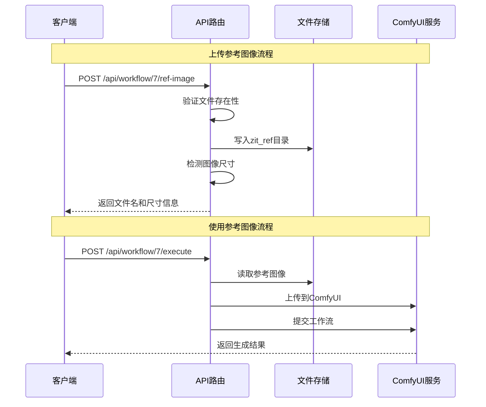
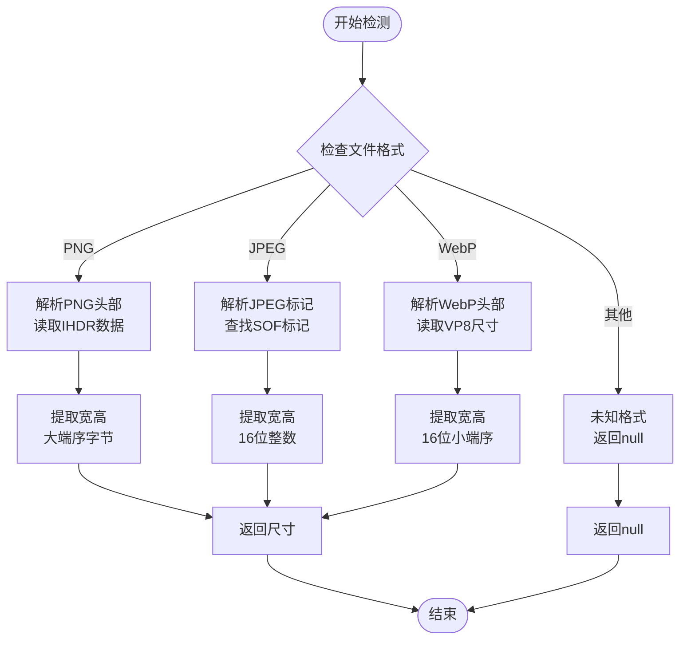
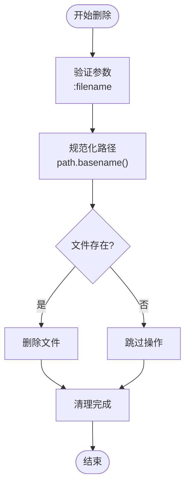
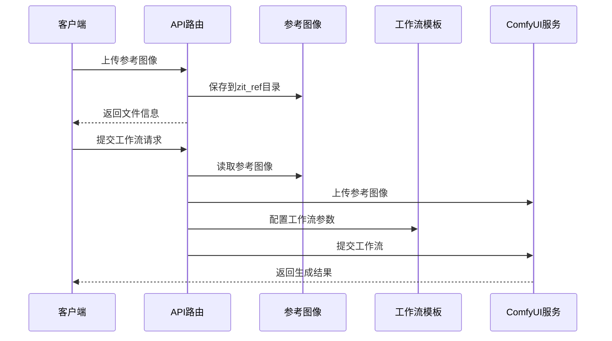
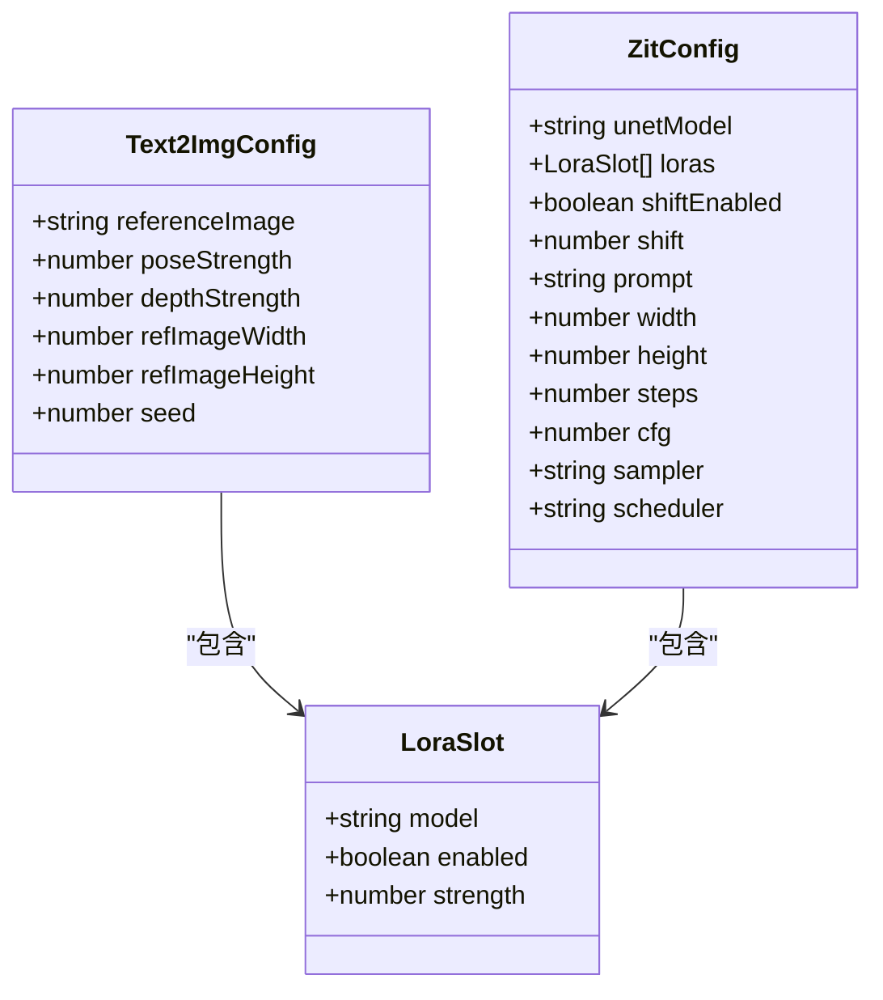
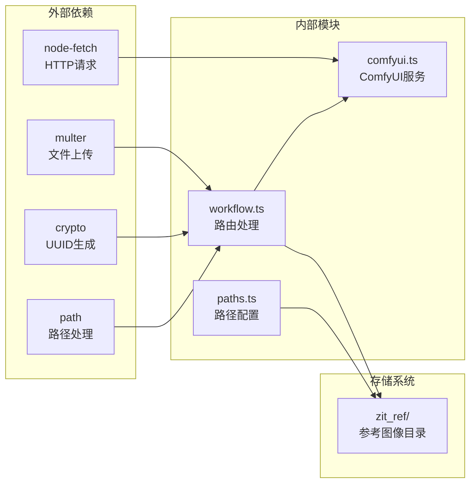

# 参考图像管理

<cite>
**本文档引用的文件**
- [workflow.ts](file://server/src/routes/workflow.ts)
- [comfyui.ts](file://server/src/services/comfyui.ts)
- [paths.ts](file://server/src/config/paths.ts)
- [sessionService.ts](file://client/src/services/sessionService.ts)
- [ZITSidebar.tsx](file://client/src/components/ZITSidebar.tsx)
- [Pix2Real-ZIT文生图NEW2.json](file://ComfyUI_API/Pix2Real-ZIT文生图NEW2.json)
- [二次元生成 (PRO).json](file://ComfyUI_API/二次元生成 (PRO).json)
</cite>

## 目录
1. [简介](#简介)
2. [项目结构](#项目结构)
3. [核心组件](#核心组件)
4. [架构概览](#架构概览)
5. [详细组件分析](#详细组件分析)
6. [依赖关系分析](#依赖关系分析)
7. [性能考虑](#性能考虑)
8. [故障排除指南](#故障排除指南)
9. [结论](#结论)

## 简介

本文档详细介绍了 CorineKit Pix2Real 项目中的参考图像管理功能。该功能允许用户上传、访问和删除参考图像，这些图像主要用于 ZIT 快出工作流中的人像生成过程。文档涵盖了文件存储策略、安全验证、访问控制、图像尺寸检测、文件类型验证以及与 ZIT 工作流的完整集成方式。

## 项目结构

参考图像管理功能主要分布在以下模块中：

```mermaid
graph TB
subgraph "服务器端"
A[workflow.ts<br/>工作流路由]
B[comfyui.ts<br/>ComfyUI服务]
C[paths.ts<br/>路径配置]
end
subgraph "客户端"
D[sessionService.ts<br/>会话服务]
E[ZITSidebar.tsx<br/>ZIT侧边栏]
end
subgraph "工作流模板"
F[Pix2Real-ZIT文生图NEW2.json]
G[二次元生成 (PRO).json]
end
subgraph "存储"
H[zit_ref/<br/>参考图像目录]
end
A --> B
A --> H
D --> A
E --> A
A --> F
A --> G
```

**图表来源**
- [workflow.ts:1-800](file://server/src/routes/workflow.ts#L1-L800)
- [comfyui.ts:1-472](file://server/src/services/comfyui.ts#L1-L472)
- [paths.ts:1-156](file://server/src/config/paths.ts#L1-L156)

**章节来源**
- [workflow.ts:1-800](file://server/src/routes/workflow.ts#L1-L800)
- [paths.ts:1-156](file://server/src/config/paths.ts#L1-L156)

## 核心组件

参考图像管理系统包含以下核心组件：

### 1. 参考图像存储目录
- **位置**: `zit_ref/` 目录
- **特性**: 服务器启动时自动创建，用于存放所有参考图像
- **访问**: 仅限服务器内部访问，不对外提供直接的 HTTP 访问

### 2. 图像处理服务
- **尺寸检测**: 支持 PNG、JPEG、WebP 格式的图像尺寸解析
- **内存存储**: 使用内存存储策略，避免磁盘 I/O 开销
- **文件命名**: 自动生成 UUID 格式的唯一文件名

### 3. 安全验证机制
- **文件存在性验证**: 上传前检查目标文件是否存在
- **路径规范化**: 使用 `path.basename()` 防止路径遍历攻击
- **类型检查**: 通过文件扩展名进行基本的类型判断

**章节来源**
- [workflow.ts:26-28](file://server/src/routes/workflow.ts#L26-L28)
- [workflow.ts:438-483](file://server/src/routes/workflow.ts#L438-L483)
- [workflow.ts:88-120](file://server/src/routes/workflow.ts#L88-L120)

## 架构概览

参考图像管理采用分层架构设计，实现了清晰的关注点分离：



**图表来源**
- [workflow.ts:440-458](file://server/src/routes/workflow.ts#L440-L458)
- [workflow.ts:292-350](file://server/src/routes/workflow.ts#L292-L350)
- [comfyui.ts:9-25](file://server/src/services/comfyui.ts#L9-L25)

## 详细组件分析

### 参考图像上传机制

#### 上传接口设计
- **端点**: `POST /api/workflow/7/ref-image`
- **文件处理**: 使用 `multer.memoryStorage()` 进行内存存储
- **验证逻辑**: 
  - 检查请求中是否包含文件
  - 确保 `zit_ref` 目录存在
  - 生成唯一文件名

#### 图像尺寸检测算法
系统实现了多格式图像的尺寸检测功能：



**图表来源**
- [workflow.ts:88-120](file://server/src/routes/workflow.ts#L88-L120)

**章节来源**
- [workflow.ts:440-458](file://server/src/routes/workflow.ts#L440-L458)
- [workflow.ts:88-120](file://server/src/routes/workflow.ts#L88-L120)

### 参考图像访问机制

#### 访问接口设计
- **端点**: `GET /api/workflow/7/ref-image/:filename`
- **安全措施**:
  - 文件存在性检查
  - 路径规范化 (`path.basename()`)
  - MIME 类型映射
- **响应格式**: 直接返回图像二进制数据

#### 文件类型验证
系统支持的图像格式及对应的 MIME 类型：
- PNG: `image/png`
- JPG/JPEG: `image/jpeg`
- GIF: `image/gif`
- WEBP: `image/webp`
- BMP: `image/bmp`

**章节来源**
- [workflow.ts:460-474](file://server/src/routes/workflow.ts#L460-L474)

### 参考图像删除机制

#### 删除接口设计
- **端点**: `DELETE /api/workflow/7/ref-image/:filename`
- **安全措施**:
  - 路径规范化防止目录遍历
  - 异常捕获确保操作不会中断
- **响应格式**: 统一的 JSON 响应

#### 删除流程


**图表来源**
- [workflow.ts:476-483](file://server/src/routes/workflow.ts#L476-L483)

**章节来源**
- [workflow.ts:476-483](file://server/src/routes/workflow.ts#L476-L483)

### 与ZIT工作流的集成

#### 工作流配置
参考图像主要集成到两个工作流中：

1. **ZIT快出 (Workflow 9)**: 使用 `Pix2Real-ZIT文生图NEW2.json` 模板
2. **快速出图 (Workflow 7)**: 使用 `二次元生成 (PRO).json` 模板

#### 集成实现


**图表来源**
- [workflow.ts:292-350](file://server/src/routes/workflow.ts#L292-L350)
- [workflow.ts:485-593](file://server/src/routes/workflow.ts#L485-L593)

**章节来源**
- [workflow.ts:292-350](file://server/src/routes/workflow.ts#L292-L350)
- [workflow.ts:485-593](file://server/src/routes/workflow.ts#L485-L593)

### 客户端集成

#### 会话服务支持
客户端通过 `sessionService.ts` 提供了完整的参考图像管理支持：



**图表来源**
- [sessionService.ts:10-41](file://client/src/services/sessionService.ts#L10-L41)

**章节来源**
- [sessionService.ts:10-41](file://client/src/services/sessionService.ts#L10-L41)

## 依赖关系分析

参考图像管理系统的依赖关系如下：



**图表来源**
- [workflow.ts:1-16](file://server/src/routes/workflow.ts#L1-L16)
- [comfyui.ts:1-5](file://server/src/services/comfyui.ts#L1-L5)

**章节来源**
- [workflow.ts:1-16](file://server/src/routes/workflow.ts#L1-L16)
- [comfyui.ts:1-5](file://server/src/services/comfyui.ts#L1-L5)

## 性能考虑

### 存储策略优化
1. **内存存储**: 使用 `memoryStorage()` 减少磁盘 I/O 操作
2. **异步处理**: 文件操作采用异步方式，避免阻塞主线程
3. **缓存机制**: 图像尺寸信息在内存中缓存，减少重复解析

### 并发处理
- **文件上传**: 支持并发上传多个参考图像
- **工作流执行**: 与 ComfyUI 的并发处理相协调
- **资源管理**: 合理的内存和文件描述符管理

### 扩展性设计
- **目录结构**: 支持通过环境变量覆盖数据根目录
- **配置管理**: 集中的路径配置管理
- **模块化**: 清晰的模块边界，便于功能扩展

## 故障排除指南

### 常见问题及解决方案

#### 1. 文件上传失败
**症状**: 上传接口返回 500 错误
**可能原因**:
- `zit_ref` 目录权限不足
- 磁盘空间不足
- 文件过大超出限制

**解决方法**:
- 检查目录权限设置
- 确认磁盘空间充足
- 调整文件大小限制

#### 2. 图像尺寸检测失败
**症状**: 尺寸检测返回 null
**可能原因**:
- 图像格式不受支持
- 文件损坏
- 非标准格式

**解决方法**:
- 确认图像格式为 PNG/JPEG/WebP
- 重新生成或转换图像文件
- 检查文件完整性

#### 3. 访问参考图像失败
**症状**: 获取图像返回 404 错误
**可能原因**:
- 文件已被删除
- 路径参数错误
- 权限问题

**解决方法**:
- 验证文件是否存在于 `zit_ref` 目录
- 检查文件名参数
- 确认服务器权限设置

#### 4. 工作流执行异常
**症状**: 使用参考图像的工作流执行失败
**可能原因**:
- 参考图像文件不存在
- ComfyUI 服务不可用
- 工作流模板配置错误

**解决方法**:
- 确认参考图像已成功上传
- 检查 ComfyUI 服务状态
- 验证工作流模板配置

**章节来源**
- [workflow.ts:454-457](file://server/src/routes/workflow.ts#L454-L457)
- [workflow.ts:463-466](file://server/src/routes/workflow.ts#L463-L466)
- [workflow.ts:297-300](file://server/src/routes/workflow.ts#L297-L300)

## 结论

参考图像管理系统为 CorineKit Pix2Real 提供了完整的参考图像管理功能。系统采用了安全、高效的设计原则，实现了以下关键特性：

1. **安全性**: 通过路径规范化、文件存在性验证和 MIME 类型检查确保系统安全
2. **效率性**: 使用内存存储策略和异步处理提升系统性能
3. **可靠性**: 完善的错误处理和故障恢复机制
4. **可扩展性**: 模块化设计便于功能扩展和维护

该系统与 ZIT 工作流的深度集成为用户提供了强大的参考图像驱动的人像生成能力，是整个 Pix2Real 工作流的重要组成部分。