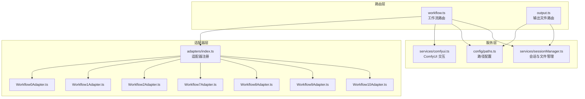
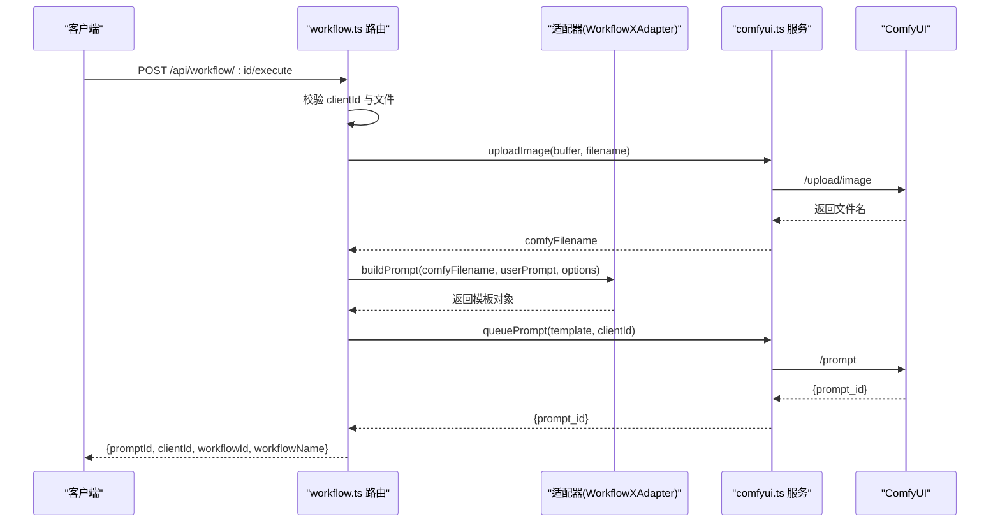
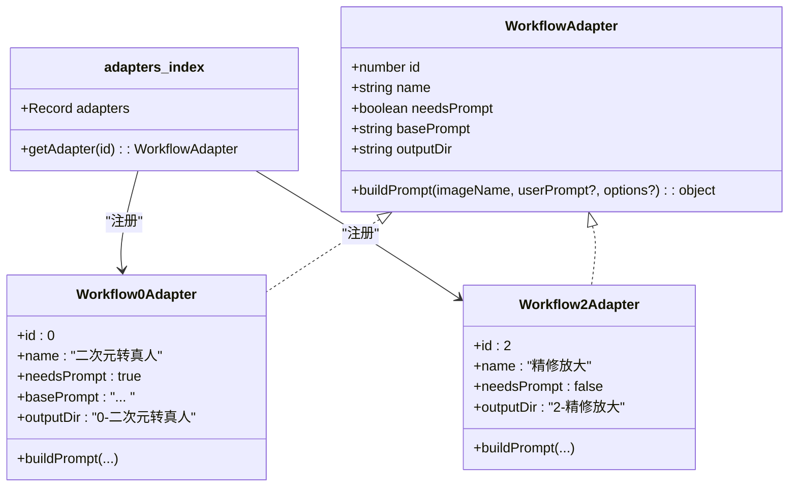
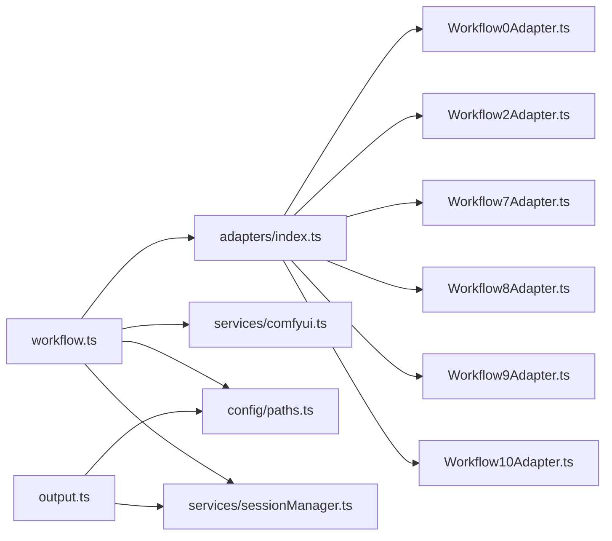

# 工作流路由

<cite>
**本文引用的文件**
- [workflow.ts](file://server/src/routes/workflow.ts)
- [index.ts](file://server/src/adapters/index.ts)
- [BaseAdapter.ts](file://server/src/adapters/BaseAdapter.ts)
- [index.ts](file://server/src/types/index.ts)
- [comfyui.ts](file://server/src/services/comfyui.ts)
- [Workflow0Adapter.ts](file://server/src/adapters/Workflow0Adapter.ts)
- [Workflow1Adapter.ts](file://server/src/adapters/Workflow1Adapter.ts)
- [Workflow2Adapter.ts](file://server/src/adapters/Workflow2Adapter.ts)
- [Workflow7Adapter.ts](file://server/src/adapters/Workflow7Adapter.ts)
- [Workflow8Adapter.ts](file://server/src/adapters/Workflow8Adapter.ts)
- [Workflow9Adapter.ts](file://server/src/adapters/Workflow9Adapter.ts)
- [Workflow10Adapter.ts](file://server/src/adapters/Workflow10Adapter.ts)
- [output.ts](file://server/src/routes/output.ts)
- [paths.ts](file://server/src/config/paths.ts)
- [sessionManager.ts](file://server/src/services/sessionManager.ts)
</cite>

## 目录
1. [简介](#简介)
2. [项目结构](#项目结构)
3. [核心组件](#核心组件)
4. [架构总览](#架构总览)
5. [详细组件分析](#详细组件分析)
6. [依赖关系分析](#依赖关系分析)
7. [性能考量](#性能考量)
8. [故障排查指南](#故障排查指南)
9. [结论](#结论)
10. [附录](#附录)

## 简介
本文件面向 CorineKit Pix2Real 的“工作流路由”模块，系统性阐述工作流执行路由的设计原理与实现细节，覆盖：
- 通用工作流执行路由与特定工作流路由（如解除装备、区域编辑、快速出图、ZIT快出、黑兽换脸等）
- 模型管理路由（Checkpoint/UNet/LoRA 列表）
- 文件上传处理与参考图管理
- 错误处理机制与用户友好提示映射
- 工作流适配器模式的集成方式与扩展指南
- 实际 API 调用示例、参数验证规则与性能优化建议

## 项目结构
工作流路由位于服务端模块 server/src/routes 下，核心文件包括：
- 路由入口：workflow.ts
- 适配器注册与索引：adapters/index.ts
- 适配器接口定义：adapters/BaseAdapter.ts、types/index.ts
- 与 ComfyUI 的交互：services/comfyui.ts
- 输出文件路由：routes/output.ts
- 路径与配置：config/paths.ts
- 会话管理与文件持久化：services/sessionManager.ts

图表来源
- [workflow.ts:1-800](file://server/src/routes/workflow.ts#L1-L800)
- [index.ts:1-33](file://server/src/adapters/index.ts#L1-L33)
- [comfyui.ts:1-472](file://server/src/services/comfyui.ts#L1-L472)
- [output.ts:1-139](file://server/src/routes/output.ts#L1-L139)
- [paths.ts:1-156](file://server/src/config/paths.ts#L1-L156)
- [sessionManager.ts:1-539](file://server/src/services/sessionManager.ts#L1-L539)

章节来源
- [workflow.ts:1-800](file://server/src/routes/workflow.ts#L1-L800)
- [index.ts:1-33](file://server/src/adapters/index.ts#L1-L33)
- [comfyui.ts:1-472](file://server/src/services/comfyui.ts#L1-L472)
- [output.ts:1-139](file://server/src/routes/output.ts#L1-L139)
- [paths.ts:1-156](file://server/src/config/paths.ts#L1-L156)
- [sessionManager.ts:1-539](file://server/src/services/sessionManager.ts#L1-L539)

## 核心组件
- 工作流路由（workflow.ts）
  - 提供通用执行路由与多个特定工作流的专用路由
  - 统一的文件上传中间件与多字段上传处理
  - 与 ComfyUI 的上传与排队交互
  - 错误映射与用户友好提示
- 适配器体系（adapters/index.ts + 各 Adapter）
  - 定义 WorkflowAdapter 接口，集中注册与检索
  - 每个工作流对应一个适配器，负责构建模板与参数
- 服务层（services/comfyui.ts）
  - 封装 ComfyUI 的上传、排队、历史查询、WebSocket 进度回调
  - 节点权重与阶段化进度计算
- 输出路由（routes/output.ts）
  - 列举与提供工作流输出文件
  - 打开文件系统默认应用
- 路径与会话（config/paths.ts + services/sessionManager.ts）
  - 统一的数据目录管理与会话文件持久化

章节来源
- [workflow.ts:152-800](file://server/src/routes/workflow.ts#L152-L800)
- [index.ts:14-33](file://server/src/adapters/index.ts#L14-L33)
- [comfyui.ts:9-196](file://server/src/services/comfyui.ts#L9-L196)
- [output.ts:13-78](file://server/src/routes/output.ts#L13-L78)
- [paths.ts:74-100](file://server/src/config/paths.ts#L74-L100)
- [sessionManager.ts:11-18](file://server/src/services/sessionManager.ts#L11-L18)

## 架构总览
工作流路由采用“适配器 + 服务”的分层设计：
- 路由层负责请求解析、文件上传、参数校验与错误映射
- 适配器层负责根据工作流类型构建 ComfyUI 模板与参数
- 服务层负责与 ComfyUI 通信，并提供进度与历史查询

图表来源
- [workflow.ts:750-799](file://server/src/routes/workflow.ts#L750-L799)
- [comfyui.ts:9-25](file://server/src/services/comfyui.ts#L9-L25)
- [comfyui.ts:168-196](file://server/src/services/comfyui.ts#L168-L196)
- [Workflow0Adapter.ts:16-34](file://server/src/adapters/Workflow0Adapter.ts#L16-L34)

章节来源
- [workflow.ts:750-799](file://server/src/routes/workflow.ts#L750-L799)
- [comfyui.ts:9-25](file://server/src/services/comfyui.ts#L9-L25)
- [comfyui.ts:168-196](file://server/src/services/comfyui.ts#L168-L196)
- [Workflow0Adapter.ts:16-34](file://server/src/adapters/Workflow0Adapter.ts#L16-L34)

## 详细组件分析

### 通用工作流执行路由
- 路由：POST /api/workflow/:id/execute
- 行为：
  - 从请求体读取 clientId
  - 从请求体读取可选的 options（JSON 字符串，解析为对象）
  - 上传单张图片至 ComfyUI，得到文件名
  - 通过 getAdapter(id) 获取适配器，调用 buildPrompt 构建模板
  - 调用 queuePrompt 提交任务
  - 返回 promptId、clientId、workflowId、workflowName
- 参数验证：
  - 缺少 clientId 或文件时返回 400
  - 未知工作流 ID 时返回 400
- 错误映射：统一通过 toFriendlyComfyError 映射为用户可读提示

章节来源
- [workflow.ts:750-799](file://server/src/routes/workflow.ts#L750-L799)
- [index.ts:28-30](file://server/src/adapters/index.ts#L28-L30)
- [comfyui.ts:168-196](file://server/src/services/comfyui.ts#L168-L196)
- [workflow.ts:129-150](file://server/src/routes/workflow.ts#L129-L150)

### 特定工作流路由

#### 解除装备（Workflow 5）
- 路由：POST /api/workflow/5/execute
- 文件上传：image 与 mask 两张图片
- 参数：
  - clientId（必填）
  - backPose（可选，布尔字符串）
  - prompt（可选，替换默认提示）
- 行为：
  - 上传两张图片
  - 读取固定模板，注入文件名、seed、backPose、prompt
  - 提交排队
- 响应：promptId、clientId、workflowId=5、workflowName

章节来源
- [workflow.ts:163-215](file://server/src/routes/workflow.ts#L163-L215)

#### 区域编辑（Workflow 10）
- 路由：POST /api/workflow/10/execute
- 文件上传：image 与 mask
- 参数：clientId、backPose、prompt（必填）
- 行为：与解除装备类似，但总是设置 prompt 字段（即使为空）

章节来源
- [workflow.ts:217-267](file://server/src/routes/workflow.ts#L217-L267)

#### 快速出图（Workflow 7）
- 路由：POST /api/workflow/7/execute
- 请求体：JSON（无文件上传）
- 关键参数：
  - clientId（必填）
  - model（必填，Checkpoint）
  - loras（可选，数组，含 model、enabled、strength）
  - prompt（可选）
  - negativePrompt（可选）
  - width、height（必填）
  - steps、cfg、sampler、scheduler（必填）
  - name（可选，作为输出前缀）
  - seed（可选）
  - referenceImage（可选，配合 PRO 模板）
  - useOriginalRatio（可选，与 width/height 协同）
  - depthStrength、poseStrength（可选，PRO 模板）
- 行为：
  - 若包含 referenceImage：使用 PRO 模板，上传参考图，设置 ckpt、sampler、prompt、negativePrompt、depthStrength、poseStrength、尺寸
  - 否则使用标准模板，设置 ckpt、尺寸、sampler、prompt、negativePrompt、输出前缀
  - LoRA 通过 applyLoraChain 动态链式连接
- 响应：promptId、clientId、workflowId=7、workflowName（快速出图 或 快速出图(PRO)）

章节来源
- [workflow.ts:269-405](file://server/src/routes/workflow.ts#L269-L405)
- [workflow.ts:40-86](file://server/src/routes/workflow.ts#L40-L86)

#### ZIT快出（Workflow 9）
- 路由：POST /api/workflow/9/execute
- 请求体：JSON（无文件上传）
- 关键参数：
  - clientId（必填）
  - unetModel（必填）
  - loras（可选）
  - shiftEnabled（必填，控制是否启用 AuraFlow shift）
  - shift（可选）
  - prompt（可选）
  - width、height（必填）
  - steps、cfg、sampler、scheduler（必填）
  - name（可选）
- 行为：
  - 设置 UNet、尺寸、sampler、prompt、shiftEnabled
  - LoRA 通过动态重连策略（禁用时直连源模型）
  - 输出前缀 name
- 响应：promptId、clientId、workflowId=9、workflowName

章节来源
- [workflow.ts:485-593](file://server/src/routes/workflow.ts#L485-L593)

#### 黑兽换脸（Workflow 8）
- 路由：POST /api/workflow/8/execute
- 文件上传：targetImage 与 faceImage
- 参数：clientId（必填）
- 行为：
  - 上传两张图片
  - 读取模板，注入目标与人脸
  - 提交排队
- 响应：promptId、clientId、workflowId=8、workflowName

章节来源
- [workflow.ts:595-642](file://server/src/routes/workflow.ts#L595-L642)

#### 二次元转真人（Workflow 0）
- 路由：POST /api/workflow/0/execute
- 文件上传：image
- 参数：
  - clientId（必填）
  - model（可选，默认 qwen；支持 klein）
  - prompt（可选）
- 行为：
  - 上传图片
  - 若 model=klein：使用 Klein 模板与默认提示
  - 否则使用适配器构建模板
- 响应：promptId、clientId、workflowId=0、workflowName

章节来源
- [workflow.ts:644-687](file://server/src/routes/workflow.ts#L644-L687)
- [Workflow0Adapter.ts:9-34](file://server/src/adapters/Workflow0Adapter.ts#L9-L34)

#### 精修放大（Workflow 2）
- 路由：POST /api/workflow/2/execute
- 文件上传：image
- 参数：
  - clientId（必填）
  - model（可选，默认 seedvr2；支持 klein、kleinpro、sd、remacri）
- 行为：
  - 上传图片
  - 根据 model 选择模板（Klein/SD/Remacri 或适配器）
- 响应：promptId、clientId、workflowId=2、workflowName

章节来源
- [workflow.ts:689-748](file://server/src/routes/workflow.ts#L689-L748)
- [Workflow2Adapter.ts:9-27](file://server/src/adapters/Workflow2Adapter.ts#L9-L27)

### 模型管理路由
- GET /api/workflow/models/checkpoints：列出可用 Checkpoint 模型
- GET /api/workflow/models/unets：列出可用 UNet 模型
- GET /api/workflow/models/loras：列出可用 LoRA 模型
- 实现：调用 comfyui.ts 的 getCheckpointModels/getUnetModels/getLoraModels

章节来源
- [workflow.ts:407-435](file://server/src/routes/workflow.ts#L407-L435)
- [comfyui.ts:415-440](file://server/src/services/comfyui.ts#L415-L440)

### 参考图管理（Workflow 7）
- 上传参考图：POST /api/workflow/7/ref-image
  - 上传字段：image（单文件）
  - 返回：filename、url、width、height
- 访问参考图：GET /api/workflow/7/ref-image/:filename
- 删除参考图：DELETE /api/workflow/7/ref-image/:filename
- 实现：使用内存存储与本地文件系统，尺寸通过 getImageDimensions 解析

章节来源
- [workflow.ts:437-483](file://server/src/routes/workflow.ts#L437-L483)
- [workflow.ts:88-120](file://server/src/routes/workflow.ts#L88-L120)

### 输出文件路由
- 列举输出：GET /api/output/:workflowId
  - 返回该工作流输出目录下的文件清单（大小、创建时间、URL）
- 提供输出：GET /api/output/:workflowId/:filename
  - 直接返回文件内容
- 打开文件：POST /api/output/open-file
  - 根据 URL 使用系统默认应用打开文件

章节来源
- [output.ts:27-78](file://server/src/routes/output.ts#L27-L78)
- [output.ts:80-136](file://server/src/routes/output.ts#L80-L136)

### 适配器模式与扩展指南
- 接口定义：WorkflowAdapter（id、name、needsPrompt、basePrompt、outputDir、buildPrompt）
- 注册中心：adapters/index.ts 将编号与适配器绑定
- 扩展步骤：
  1) 新建适配器文件，实现 buildPrompt(imageName, userPrompt?, options?) 并返回模板对象
  2) 在 adapters/index.ts 中注册
  3) 在通用路由中通过 getAdapter(id) 自动装配
  4) 如需专用路由，可在 workflow.ts 中新增 POST /api/workflow/:id/execute 的分支

图表来源
- [index.ts:14-33](file://server/src/adapters/index.ts#L14-L33)
- [BaseAdapter.ts:1-4](file://server/src/adapters/BaseAdapter.ts#L1-L4)
- [index.ts:1-8](file://server/src/types/index.ts#L1-L8)
- [Workflow0Adapter.ts:9-34](file://server/src/adapters/Workflow0Adapter.ts#L9-L34)
- [Workflow2Adapter.ts:9-27](file://server/src/adapters/Workflow2Adapter.ts#L9-L27)

章节来源
- [index.ts:14-33](file://server/src/adapters/index.ts#L14-L33)
- [BaseAdapter.ts:1-4](file://server/src/adapters/BaseAdapter.ts#L1-L4)
- [index.ts:1-8](file://server/src/types/index.ts#L1-L8)
- [Workflow0Adapter.ts:9-34](file://server/src/adapters/Workflow0Adapter.ts#L9-L34)
- [Workflow2Adapter.ts:9-27](file://server/src/adapters/Workflow2Adapter.ts#L9-L27)

## 依赖关系分析
- 路由层依赖适配器注册中心与服务层
- 适配器层依赖模板文件与路径配置
- 服务层依赖 ComfyUI API 与 WebSocket
- 输出路由依赖路径配置与会话管理

图表来源
- [workflow.ts:1-29](file://server/src/routes/workflow.ts#L1-L29)
- [index.ts:1-13](file://server/src/adapters/index.ts#L1-L13)
- [comfyui.ts:1-8](file://server/src/services/comfyui.ts#L1-L8)
- [output.ts:1-11](file://server/src/routes/output.ts#L1-L11)

章节来源
- [workflow.ts:1-29](file://server/src/routes/workflow.ts#L1-L29)
- [index.ts:1-13](file://server/src/adapters/index.ts#L1-L13)
- [comfyui.ts:1-8](file://server/src/services/comfyui.ts#L1-L8)
- [output.ts:1-11](file://server/src/routes/output.ts#L1-L11)

## 性能考量
- 节点权重与阶段化进度
  - 通过静态节点权重与采样器步数动态加权，估算全局进度
  - tiled 采样器按经验 tile 数乘以采样步权重
- WebSocket 进度回调
  - 优先使用 execution_success 信号，若缺失则在 grace 期内回退 executing:null
  - 缓存跳过节点计入进度，避免重复统计
- 文件上传与尺寸解析
  - 上传采用内存存储，注意大文件内存占用
  - 参考图尺寸解析仅读取头部信息，避免全量解码

章节来源
- [comfyui.ts:58-144](file://server/src/services/comfyui.ts#L58-L144)
- [comfyui.ts:265-375](file://server/src/services/comfyui.ts#L265-L375)
- [workflow.ts:88-120](file://server/src/routes/workflow.ts#L88-L120)

## 故障排查指南
- 常见错误映射
  - 模型未找到：ckpt/lora/unet/vae/control_net 缺失时映射为用户友好提示
  - 队列提交失败：映射为“工作流提交失败，请检查 ComfyUI 是否正常运行”
- 日志与状态
  - 路由层捕获异常并记录错误日志
  - 通过 toFriendlyComfyError 统一返回
- 建议排查步骤
  - 确认 ComfyUI 服务地址与端口可达
  - 检查模型文件是否存在于 ComfyUI 模型目录
  - 确认 clientId 有效且未被并发冲突
  - 对于 LoRA，确认 enabled 与 strength 配置正确

章节来源
- [workflow.ts:129-150](file://server/src/routes/workflow.ts#L129-L150)

## 结论
工作流路由模块通过“适配器 + 服务”的清晰分层，实现了对多种工作流类型的统一接入与扩展。通用路由与专用路由并存，既满足标准化流程，又允许特定工作流的灵活定制。结合模型管理、参考图管理与输出文件路由，形成完整的端到端工作流执行与产物管理闭环。

## 附录

### API 调用示例（不含代码片段）
- 通用执行
  - 方法与路径：POST /api/workflow/:id/execute
  - 上传：multipart，字段 image（单文件）
  - 请求体：JSON，包含 clientId（必填）、prompt（可选）、options（可选，JSON 字符串）
  - 成功响应：{promptId, clientId, workflowId, workflowName}
- 解除装备
  - 方法与路径：POST /api/workflow/5/execute
  - 上传：multipart，字段 image 与 mask（各一张）
  - 查询参数或请求体：clientId（必填），backPose（可选），prompt（可选）
- 区域编辑
  - 方法与路径：POST /api/workflow/10/execute
  - 上传：multipart，字段 image 与 mask（各一张）
  - 请求体：clientId（必填），backPose（可选），prompt（必填）
- 快速出图（标准）
  - 方法与路径：POST /api/workflow/7/execute
  - 请求体：JSON，包含 clientId、model、loras、prompt、negativePrompt、width、height、steps、cfg、sampler、scheduler、name、seed
- 快速出图（PRO，带参考图）
  - 请求体：JSON，包含 clientId、model、loras、prompt、negativePrompt、width、height、steps、cfg、sampler、scheduler、name、seed、referenceImage、useOriginalRatio、depthStrength、poseStrength
- ZIT快出
  - 方法与路径：POST /api/workflow/9/execute
  - 请求体：JSON，包含 clientId、unetModel、loras、shiftEnabled、shift、prompt、width、height、steps、cfg、sampler、scheduler、name
- 黑兽换脸
  - 方法与路径：POST /api/workflow/8/execute
  - 上传：multipart，字段 targetImage 与 faceImage（各一张）
- 二次元转真人
  - 方法与路径：POST /api/workflow/0/execute
  - 上传：multipart，字段 image（单文件）
  - 请求体：JSON，包含 clientId、model（可选，默认 qwen）、prompt（可选）
- 精修放大
  - 方法与路径：POST /api/workflow/2/execute
  - 上传：multipart，字段 image（单文件）
  - 请求体：JSON，包含 clientId、model（可选，默认 seedvr2）
- 模型列表
  - GET /api/workflow/models/checkpoints
  - GET /api/workflow/models/unets
  - GET /api/workflow/models/loras
- 参考图管理
  - 上传：POST /api/workflow/7/ref-image（multipart，字段 image）
  - 访问：GET /api/workflow/7/ref-image/:filename
  - 删除：DELETE /api/workflow/7/ref-image/:filename
- 输出文件
  - 列举：GET /api/output/:workflowId
  - 提供：GET /api/output/:workflowId/:filename
  - 打开：POST /api/output/open-file（JSON，字段 url）

### 参数验证规则
- 通用
  - 缺少 clientId：返回 400
  - 未知工作流 ID：返回 400
- 专用工作流
  - 解除装备/区域编辑：缺少 image 或 mask 返回 400
  - 黑兽换脸：缺少 targetImage 或 faceImage 返回 400
  - 快速出图(PRO)：缺少 referenceImage 对应文件返回 400
- 模型管理
  - 任一模型列表接口失败时返回空数组或 502

章节来源
- [workflow.ts:163-215](file://server/src/routes/workflow.ts#L163-L215)
- [workflow.ts:217-267](file://server/src/routes/workflow.ts#L217-L267)
- [workflow.ts:269-405](file://server/src/routes/workflow.ts#L269-L405)
- [workflow.ts:485-593](file://server/src/routes/workflow.ts#L485-L593)
- [workflow.ts:595-642](file://server/src/routes/workflow.ts#L595-L642)
- [workflow.ts:644-687](file://server/src/routes/workflow.ts#L644-L687)
- [workflow.ts:689-748](file://server/src/routes/workflow.ts#L689-L748)
- [workflow.ts:407-435](file://server/src/routes/workflow.ts#L407-L435)
- [workflow.ts:437-483](file://server/src/routes/workflow.ts#L437-L483)
- [output.ts:27-78](file://server/src/routes/output.ts#L27-L78)